
Hi everyone! This is Andrew, Tuesday, 10/14/2025. As promised, here are my notes on our fun cubic optimization technique. They're hot off the presses, so they probably contain typos and infelicities---read them carefully and skeptically! Take pleasure in pointing out my errors!

I hope it was a good challenge for you to work out cubic optima on the last few problem sets *without* having the safety blanket of my notes. Instead you had rely entirely on your own in-class notes and our discussions. That's different than the way we've been doing things for most of the semester---where you've always had my notes to rely on as you do your problem sets---and I think that mildly different, mildly spicier and scarier mode, is worthwhile as a different way to play in mathematics!

One of my favorite professional rock climbers is Mo Beck. She's an impressive elite climber for any number of reasons... but who's even more impressive when you learn that she has only one hand. She's a one-and-a-half-armed climber who still climbs 5.13.

John Carter is similar. 

John doesn't know calculus. Despite that, he's figured out how to find the maxima and minima of cubics^[ok, John definitely *does* know calculus, and I think he stole this algorithm from someone else, but we'll phrase it this way.] Normally finding the maxima and minima of functions requires calculus! But John is SNEAKY and thinks he can find the extrema of cubics only using algebra. 

His idea is this. Take some cubic:
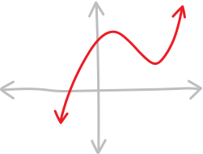{ width=75% }
Then shift it left/right and up/down (by some yet-unknown, magic amount) so that one of its extrema is now at the origin:
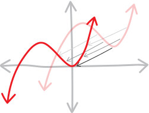{ width=75% }
Then the new shifted cubic has to have a formula that looks like $x^2(x-\text{something})$ ('cause it's got a double root now, i.e. a root of multiplicity $2$, at the origin):
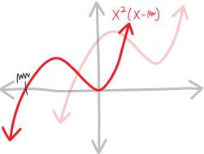{ width=75% }
But also, we can come up with an expression for the shifted cubic by taking our original cubic and doing the same linear transformations we've been doing for a month (change the input $x$ to shift it left or right, change the output $y$ to shift it up or down). Say that the magic amount we need to shift it left/right is $h$, and the magic amount we need to shift it up/down is $k$:
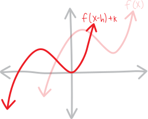{ width=75% }
If we can figure out the magic amounts $h$ and $k$ we need to shift it left/right and up/down^[Note that in my picture there, we're shifting the cubic left and down; maybe writing $f(x-h)+k$ makes it "feel" like we're shifting it right by $h$ and up by $k$, but of course $h$ and $k$ don't have to be positive numbers, so...] in order to turn one of these extrema into a double root at the origin, then we can UN-shift it in order to find where the extrema was in the first place!

It's basically the same as how we figured out the vertex/max/min/extremum of a parabola. By persuading it into transformed-parent-function form, we were basically taking our parabola, and figuring out how much to shift it left/right and up/down in order to get the original parent function $x^2$ (which is just a double root at the origin). This is just the fancier version of that!

Maybe the algebra will be tougher. Algebraically, we want to make an argument like:
\begin{align*}
\substack{\text{the original cubic}\\\text{shifted left/right some amount}\\\text{and up/down some amount}} \quad&=\quad \substack{\text{a cubic,}\\\text{with a double root at the origin}\\\text{and another root somewhere else}} \\ \\
f\Big(x+\text{blargh}\Big) + \text{(yargh)} \quad &=\quad x^2(x-\text{blah})
\end{align*}
Can we work this out??? It's a big "if". There are a lot of moving pieces. Maybe there are too many variables at play?? We have to, at the very least, figure out (a) how much to shift it left/right, and (b) how much to shift it up/down. That's two variables. Maybe there's a system of equations we can set up???? 

Let's work out some more details. If we have the general cubic:
$$ax^3+bx^2+cx+d$$
And if we shift it right by $h$ and up by $k$, we get:
$$a(x-h)^3 + b(x-h)^2 + c(x-h) + d \quad+k$$
So, comparing it to the other way of writing a cubic with a double root at the origin, we get the equation:
$$a(x-h)^3 + b(x-h)^2 + c(x-h) + d \quad+k \quad=\quad x^2(x-\text{blah})$$
This seems hard. 5.13 for sure. And this is all very abstract, so:

### Let's dive into a concrete example!!!

Abstraction is tough. Let's deal with the SPECIFIC and the CONCRETE, as Aristotle always reminds us! When problems are too hard: just do an easier problem! 

Here's a cubic:
$$f(x) = x^3 - 3x + 6$$
What does it look like? Ehh... it's kind of hard to figure out. It's a positive cubic, so it runs from the lower-left to upper-right, and it's got a $y$-intercept at $y=+6$. Without the cubic formula (or some sort of fancy technique), we can't find its roots. Oh well.  Perhaps it has a max and a min, and three real roots, like this:
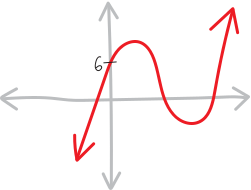{ width=50% }
Or perhaps it only has one real root, like this:
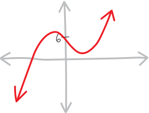{ width=50% }
Or perhaps it doesn't have extrema at all (and has more of an indecisive point, like normal $x^3$):
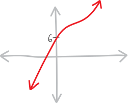{ width=50% }
Who knows!!!

But, let's assume it DOES have one maximum and one minimum. Let's say it looks like this:
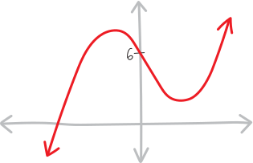{ width=50% }
How do we find the maxima and minima??? JC's idea is that we can figure out how much to shift the original cubic left/right and up/down so that it forms a new cubic, with a double root (i.e., a root of multiplicity $2$) at the origin:
{ width=50% }
If we do that, then by knowing how much we shifted the original cubic left/right and up/down, we'll be able to figure out where the max/min of the original cubic was!!!

Let's give that a try. Let's say:

<ul>
<li> we shift the original cubic right by $h$ </li>
<li> and up by $k$ </li>
<li> like so:
{ width=50% }

<li> this gives us a new cubic, with a double root at the origin (and a third root somewhere else) </li>
<li> in other words, this new cubic has a formula that looks like $x^2(x-\text{blah})$ </li>
<li> but also, shifting the original cubic right by $h$ and up by $k$ is the same as plugging in $(x-h)$ for $x$, and adding $k$ to the total result, which gives us ANOTHER formula for the cubic </li>
<li> so then we can compare-and-contrast these two formulas, make an equation, and bash through some algebra </li>
<li> and in doing so, we can figure out how much we need to shift the original cubic left/right and up/down in order to create a cubic with a double root at the origin </li>
<li> then we can use that information to figure out where the original cubic had a max/min, like so:
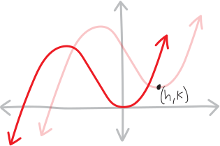{ width=50% }</li>

(we need to be kind of careful with the signs in this last step---I kept getting myself confused about whether we had added or subtracted $h$ or $k$ and whether we were going backwards or forwards from the original to the shifted---but this is the basic idea)</li></ul>

That's the strategy! Let's start!

Our original cubic is:
$$f(x) = x^3 - 3x + 6$$
If we shift it right by $h$ and up by $k$, we have:
\begin{align*}
\substack{\text{the original cubic}\\\text{shifted right by $h$}\\\text{and up by $k$}} \quad=\quad f(x-h) + k \quad&=\quad (x-h)^3 - 3(x-h) + 6 \quad+ k \\ \\
\text{Expanding, this is:}\\
&=\quad x^3 - 3hx^2 + 3h^2x - 3x -h^3 + 3h + 6 + k \\ \\
\text{Collecting terms, this is:} \\
&= \quad x^3 - 3hx^2 + \left(3h^2 - 3\right)x + \left(-h^3 + 3h +6 + k\right) \\
&=\quad \big({\color{gray}1}\big)x^3 + \left({\color{red} -3h }\right)x^2 + \left({\color{green} 3h^2 - 3 }\right)x + \left({\color{blue} -h^3 + 3h + 6 + k }\right)x^0
\end{align*}
I'm collecting/organizing and color-coding the coefficients on the $x$ terms because it's going to be helpful in our compare-and-contrast in a moment. So this is:
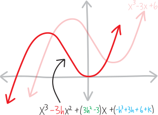{ width=75% }
(There's no connection between the fact that the $x^2$ coefficient is red, and the sketch of the cubic is red... it's just that there are a finite number of colors, and an even more finite number if you want things to look pretty!)

Meanwhile, we know this is going to end up, somehow, as a cubic that has a double root at the origin (plus some other root somewhere else):
\begin{align*}
\substack{\text{a cubic,}\\\text{with a double root at the origin}\\\text{and another root somewhere else}} \quad &= x^2\left(x-\,\, \text{blah}\right) \\ \\
\text{let's call the location of the other root ``$r$":} \\
&= x^2(x-r) \\ \\
\text{multiplied out, this is:} \\
&= x^3 - x^2r \\ \\
\text{or, if we include the implicit $x$ and constant terms:} \\
&= x^3 - rx^2 + 0x + 0 \\ \\
\text{and if we color-code it the same way:}\\
&= \big({\color{gray}1}\big)x^3 + \left({\color{red} -r }\right)x^2 + \left({\color{green} 0 }\right)x + \left({\color{blue}0}\right)x^0
\end{align*}
We don't really care where this other root is; we just need to acknowledge its existence to do the algebra. I'm going to call it "$r$" because that's easier than writing "some random other root" over and over again. In this form, we could label this picture as:
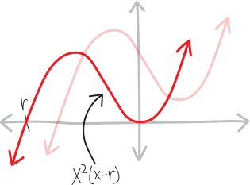{ width=75% }
But for now: where are the max and min?!?!

Our idea is that we have two ways of writing this shifted cubic: we can write it as the original cubic, but subbing in $(x-h)$ for $x$ and then adding $k$, or, we can write it as $x^2(x-\text{(another root)})$:
$$\substack{\text{the original cubic}\\\text{shifted right by $h$}\\\text{and up by $k$}} \quad=\quad \substack{\text{a cubic,}\\\text{with a double root at the origin}\\\text{and another root somewhere else}}$$
In other words, we have: 
$$ (x-h)^3 - 3(x-h) + 6 + k \quad=\quad x^2(x-r)$$
Multiplying out both sides 
$$x^3 - 3hx^2 + 3h^2x - 3x -h^3 + 3h + 6 + k  \quad=\quad x^3 - x^2r $$
That's just re-capping the stuff we already did (but now showing it in parallel). So now we have this huge horrible equation, and we want to solve it, for not just one variable, but TWO variables---$h$ and $k$!!! Where even to start?!?!

It's... not *quite* as bad as it looks. We've got all these $x$'s floating around, and it's always tempting to solve things for $x$, but that's not what we want to do here. We're OK with ending up with $x$'s---we want polynomial functions to be our outputs. So here's the trick. There's an $x^2$ with some coefficients on the left, and another $x^2$ with some coefficients on the right. The only way we can get the $x^2$ stuff on the left the same as the $x^2$ stuff on the right is if the coefficients are equal on both the left and the right. There's nowhere else we can get an $x^2$ from. Same with the rest of the $x$ powers! That's why I collected and color-coded them:
$$\big({\color{gray}1}\big)x^3 + \left({\color{red} -3h }\right)x^2 + \left({\color{green} 3h^2 - 3 }\right)x + \left({\color{blue} -h^3 + 3h + 6 + k }\right)x^0 \quad=\quad \big({\color{gray}1}\big)x^3 + \left({\color{red} -r }\right)x^2 + \left({\color{green} 0 }\right)x + \left({\color{blue}0}\right)x^0$$
In other words:

* the coefficients of the $x^3$ on the left side of the equation have to be equal to the coefficients of the $x^3$ on the right side (because there's nowhere else an $x^3$ could have come from)
* the coefficients of the $x^2$ on the left side of the equation have to be equal to the coefficients of the $x^2$ on the right side (because there's nowhere else an $x^2$ could have come from)
* the coefficients of the $x$ on the left side of the equation have to be equal to the coefficients of the $x$ on the right side (because there's nowhere else an $x$ could have come from)
* the coefficients of the $x^0$ (i.e., the constant term) on the left side of the equation have to be equal to constant term of the right side (because there's nowhere else the constants/the $x^0$ coefficients could have come from)

So we get smaller, simpler equations!!! We get... a *system* of equations!!!

* from the $x^3$ terms: ${\color{gray} 1 = 1 }$
* from the $x^2$ terms: ${\color{red} -3h = -r }$
* from the $x^1$ terms: ${\color{green} 3h^2-3 = 0 }$
* from the $x^0$ terms: ${\color{blue} -h^3 + 3h + 6 + k = 0 }$

In other words, we have this system of equations:
$$\begin{cases}
{\color{gray} 1} &= {\color{gray} 1 } \\
{\color{red} -3h} &= {\color{red} -r } \\
{\color{green} 3h^2-3 }&= {\color{green} 0 } \\
{\color{blue} -h^3 + 3h+ 6 + k } &= {\color{blue} 0 }
\end{cases}$$
Or, since $1=1$ is kind of dumb and pointless to include, we really have just:
$$\begin{cases}
{\color{red} -3h} &= {\color{red} -r } \\
{\color{green} 3h^2-3 }&= {\color{green} 0 } \\
{\color{blue} -h^3 + 3h + 6 + k } &= {\color{blue} 0 }
\end{cases}$$
Three equations, and two unknowns! We want to use these equations to find $h$ and $k$. Maybe $r$, too. Maybe we'll just get that for free along the way?

In principle we can now just solve this system of equations, using whatever our favorite system-of-equations solving technique is. Doing so will tell us what $h$ and $k$ are and thus where the original cubic has extrema!!!

Let's give this a shot. Let's look at the second/green equation from this system, and see what it can tell us. We have:
\begin{align*}
{\color{green} 3h^2-3 } &= {\color{green} 0 } \\
{\color{green} 3h^2 } &= {\color{green} 3 } \\
{\color{green} h^2 } &= {\color{green} 1 } \\
{\color{green} h } &= {\color{green} \pm\sqrt{1} } \\
{\color{green} h } &= {\color{green} \pm 1 }
\end{align*}
OK, so this gives us two possibilities for $h$ (how much we shift the original cubic left or right in order to turn the extrema into a double root at the origin). Either $h$ could be $+1$, or $h$ could be $-1$.
$$h = \big\{\,\, +1 \text{ or } -1 \big\}$$
The fact that we get two solutions here seems like a good thing---after all, there are two extrema! It's a cubic, so presumably there's one maximum and one minimum. So it's good that we're seeing that apparently show up in the algebra. $h$ tells us how much we need to shift the original cubic right, so with $h=\pm1$, I guess we get:

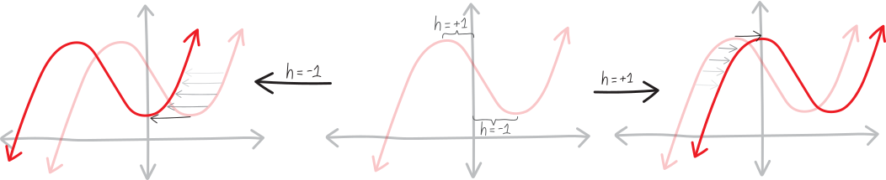{ width=100% }

So, these two possibilities for $h$ split us into two universes. Let's see what happens if $h=+1$, and let's also see what happens if $h=-1$.

<ul>

<li> ### if $h=-1$...

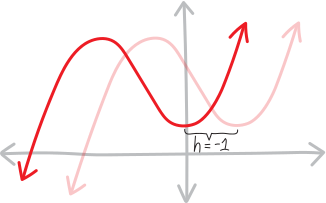{ width=75% }
OK, let's figure out what happens if $h=-1$. (Note that we did our algebra using $(x-h)$ for the horizontal shift, so if $h=-1$, then our algebra involved $(x+1)$, hence the shift left, even though $h$ is negative.) Here's how our system stands:
$$\begin{cases}
{\color{red} -3h} &= {\color{red} -r } \\
\cancel{ {\color{green} 3h^2-3 } }&= \cancel{{\color{green} 0 }} \\
{\color{blue} -h^3 + 3h + 6 + k } &= {\color{blue} 0 }
\end{cases}$$
So plugging in $h=-1$ gives us:
$$\begin{cases}
{\color{red} -3(-1)} &= {\color{red} -r } \\
{\color{blue} -(-1)^3 + 3(-1) + 6 + k } &= {\color{blue} 0 }
\end{cases}$$
Which, evaluating these exponents and doing these multiplications, is:
$$\begin{cases}
{\color{red} +3} &= {\color{red} -r } \\
{\color{blue} +1 - 3 + 6 + k } &= {\color{blue} 0 }
\end{cases}$$
Adding and subtracting, we get:
$$\begin{cases}
{\color{red} +3} &= {\color{red} -r } \\
{\color{blue} k + 4 } &= {\color{blue} 0 }
\end{cases}$$
Or:
$$\begin{cases}
{\color{red} +3} &= {\color{red} -r } \\
{\color{blue} k } &= {\color{blue} -4 }
\end{cases}$$
Or:
$$\begin{cases}
{\color{red} r} &= {\color{red} -3 } \\
{\color{blue} k } &= {\color{blue} -4 }
\end{cases}$$
So we get, as our second solution:
$$\Big\{\,\,h=-1,\quad k=-4, \quad r=-3  \,\,\Big\}$$
In other words, if we take our original cubic, and shift it right $-1$ ("right") and up $-4$ ("up"), then we get a new cubic with a double root at the origin. Or, phrased more fluently, if we take our original cubic and shift it left $1$ and down $4$, then we get a new cubic with a double root at the origin:
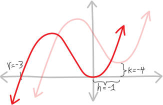{ width=75% }
Put differently, the original cubic must have an extremum $1$ to the *right* of the origin (backwards direction!), and $4$ *up* from the origin. So the original cubic has an extremum at $(+1,+4)$
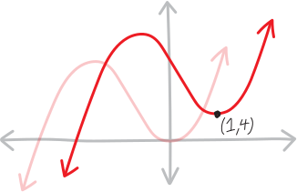{ width=75% }
Yay!!!! WE FOUND THE MINIMUM OF A CUBIC WITHOUT CALCULUS!!!!

(Note that we know it's a minimum because we can already anticipate, from $h=-1$ as the other solution, that this is the extremum on the right side, which, because it's $+x^3$, means it must be the minimum.)

</li>

<li> ### if $h=+1$...

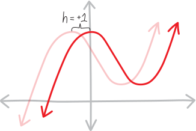{ width=75% }
OK, alternatively, we have this other branch/case, where $h=+1$. Let's set $h=+1$, plug that into our system, and see what that gets us. Here's what we had left from our system:
$$\begin{cases}
{\color{red} -3h} &= {\color{red} -r } \\
{\color{blue} -h^3 + 3h + 6 + k } &= {\color{blue} 0 }
\end{cases}$$
Let's figure out what happens if $h=+1$. Here's how our system stands:
$$\begin{cases}
{\color{red} -3h} &= {\color{red} -r } \\
\cancel{ {\color{green} 3h^2-3 } }&= \cancel{{\color{green} 0 }} \\
{\color{blue} -h^3 + 3h + 6 + k } &= {\color{blue} 0 }
\end{cases}$$
So what we have left is just:
$$\begin{cases}
{\color{red} -3h} &= {\color{red} -r } \\
{\color{blue} -h^3 + 3h + 6 + k } &= {\color{blue} 0 }
\end{cases}$$
So plugging in $h=+1$ gives us:
$$\begin{cases}
{\color{red} -3(+1)} &= {\color{red} -r } \\
{\color{blue} -(+1)^3 + 3(+1) + 6  +k } &= {\color{blue} 0 }
\end{cases}$$
which is:
$$\begin{cases}
{\color{red} -3} &= {\color{red} -r } \\
{\color{blue} -1 + 3 + 6  +k  } &= {\color{blue} 0 }
\end{cases}$$
doing the arithmetic:
$$\begin{cases}
{\color{red} -3} &= {\color{red} -r } \\
{\color{blue} 8 + k } &= {\color{blue} 0 }
\end{cases}$$
more arithmetic:
$$\begin{cases}
{\color{red} -3} &= {\color{red} -r } \\
{\color{blue} k } &= {\color{blue} -8 }
\end{cases}$$
and some rearranging:
$$\begin{cases}
{\color{red} r} &= {\color{red} +3 } \\
{\color{blue} k } &= {\color{blue} -8 }
\end{cases}$$
Yay!!!! That wasn't so bad????

So this set of solutions to this system is:
$$\Big\{\,\, h=+1,\quad k=-8, \quad r=+3 \,\,\Big\}$$
But what this means, VISUALLY (which is what we care about) is that if we take our original cubic, and shift it right $1$ and up $-8$ ("up"), then we get a new cubic with a double root at the origin. Or, put somewhat more clearly, if we take our original cubic, and shift it right $1$ and *down* $8$, then we get a new cubic with a double root at the origin:
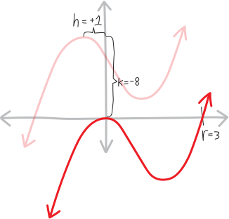{ width=75% }
So then our original cubic must have an extremum $1$ to the *left* of the origin (backwards direction!), and $8$ *up* from the origin. In other words, the original cubic has an extremum at $(-1,+8)$:  
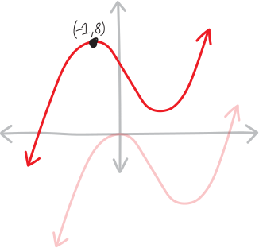{ width=75% }
</li>
</ul>
Yay!!!! So then we've found BOTH extrema---the maximum and the minimum---of this cubic, without using calculus!!!!
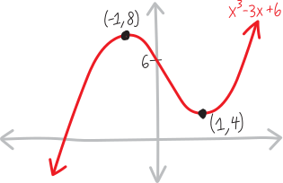{ width=100% }
Of course, we should still be curious where that one real root is... but that's a challenge for another time.

## Problems 

OK, that was a quick example---can you take these following cubics and find their extrema, without using calculus??? Of course show all the work and draw lots of pictures!!! Pictures are key, not just because we care about them for their own sake (which we do!), but becaus the algebra gets so nasty and torturous and complicated that pictures help us from getting lost in the sea of symbols!!!!

<ol class='problems'>
<li> $f(x) = x^3 - 6x^2 + 9$ *(a simple example Claude wrote)* <!-- [[h == 0, k == -9, r == 6], [h == -4, k == 23, r == -6]] --> </li>
<li> $f(x) = x^3 - 3x$ *(this is Claude's; I'm guessing the algebra is easy)* <!-- [[h == 1, k == -2, r == 3], [h == -1, k == 2, r == -3]] --> </li>
<li> $f(x) = x^3 - 9x^2 + 24x + 3$ *(JC's other, harder example!)* <!-- [[h == -2, k == -23, r == 3], [h == -4, k == -19, r == -3]] --> </li>
<li> $f(x) = x^3 - 3x + 5$ *(also looks fun)* <!-- [[h == 1, k == -7, r == 3], [h == -1, k == -3, r == -3]] --> </li>
<li> $f(x) = 2x^3 - 3x^2 - 12x + 1$ *(now the $x^3$ term has a coefficient!!! (It's **non-monic**, to use a fancy word) will that change things???)* <!-- [[h == 1, k == -8, r == (9/2)], [h == -2, k == 19, r == (-9/2)]] --> </li>
<li> $f(x) = 3x^{3}+4x^{2}+2x+1$ *(mine. there's a twist!)* <!-- sneaky sneaky sneaky no real extrema!  [[h == 1/9*I*sqrt(2) + 4/9, k == 4/243*I*sqrt(2) - 155/243, r == 1/3*I*sqrt(2)], [h == -1/9*I*sqrt(2) + 4/9, k == -4/243*I*sqrt(2) - 155/243, r == -1/3*I*sqrt(2)]]  --> </li>
<li> $f(x) = 5x^3 - 7x^2 - 3x -2$ *(I wrote this. I like it!!!)* <!-- [[h == 1/15*sqrt(94) - 7/15, k == -188/675*sqrt(94) + 2981/675, r == 1/5*sqrt(94)], [h == -1/15*sqrt(94) - 7/15, k == 188/675*sqrt(94) + 2981/675, r == -1/5*sqrt(94)]] --> </li>
<li> $f(x) = 2x^3 + 5x^2 - 9x +2$ *(also mine)* <!-- [[h == 1/6*sqrt(79) + 5/6, k == -79/54*sqrt(79) - 319/27, r == 1/2*sqrt(79)], [h == -1/6*sqrt(79) + 5/6, k == 79/54*sqrt(79) - 319/27, r == -1/2*sqrt(79)]] --> </li>
<li> $f(x) = ax^3 + bx^2 + cx +d$ *(EVERY cubic!!!! can you do it?!?!)* <!-- --> </li>
</ol>

