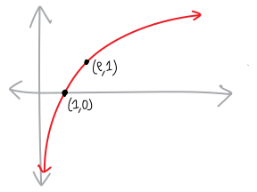
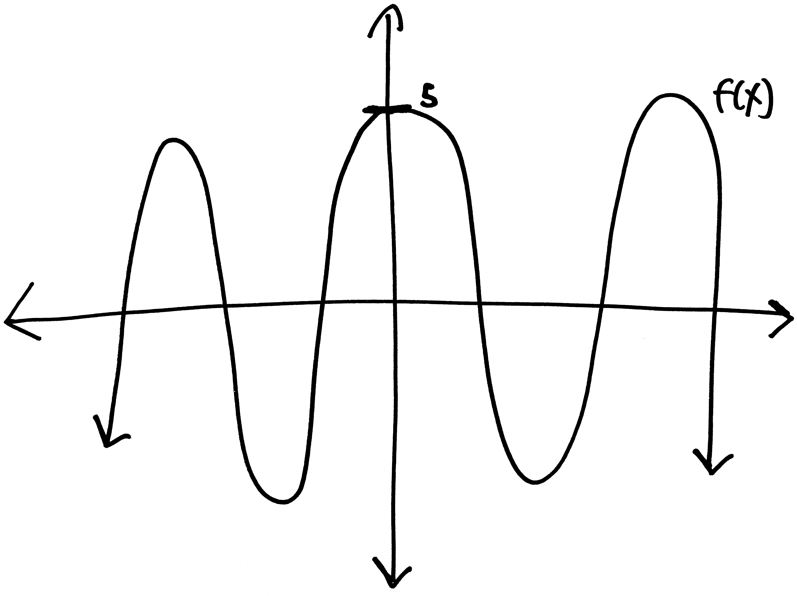

It's the start of a new school year. We're seeing our friends whom we haven't seen all summer long. We're making new friends. We're excited to again get to play all of our favorite games with our friends. But this is Nueva, and so our friends are not people, but rather *abstract objects*. In particular, our friends are functions. And the games we want play with them aren't chess or dodgeball or backgammon---the games we want to play are those called **linear transformations**.^[Why "linear''? What does "linear" mean here? Are there also "non-linear" transformations? What are those?!?]

Let's back up a bit. Here's what we're going to be thinking about for the first few weeks of our class. How can we take **equations** and turn them into **pictures**?
 
$$\text{equations} \longrightarrow  \text{pictures}$$

How can we take **pictures** and turn them into **equations**? 

$$\text{equations} \longleftarrow  \text{pictures}$$

How can we do this in both directions, back and forth, back and forth, over and over again, without a calculator, *using only our minds*, so that we develop a deep intuition for *what equations look like*? In other words, we're trying to figure out this: 

$$\text{equations} \Longleftrightarrow  \text{pictures}$$

We're going to try to become **algebraic synæsthetes**^[Note the pretty [https://en.wikipedia.org/wiki/\%C3\%86](æ digraph)! ]. Synæsthesia, as you might know, is the neurological condition describing when your senses overlap---when you can see sounds, or smell colors, or associate words with physical sensations. Your senses get all mixed up. That's what we want. We want no difference between *seeing a picture* and *seeing an equation.*

To start acquiring our **algebraic synæsthesia**, let's learn (or remind ourselves of) some basic functions and their shapes, and then figure out hw we can change them in simple ways. How can we move them up and down and left and right? How can we stretch them out? How can we squeeze and compress them? How can we flip them around? How does changing their equations change their pictures? How does changing their pictures change their equations?

It's the start of a new year, so let's make some new friends---or reintroduce ourselves to some old friends. Let's list a *dramatis personae* of the characters who will populate our story:

## $$f(x) = x$$

* A line with slope $1$ and $y$-intercept $0$, passing through the origin at $(0,0)$
* Extremely boring!!!
* The fancy mathematical word for this function is that it's the **identity function**, or even fancier, that it's **idempotent**

## $$f(x) = x^2$$

* Passes through $(0,0)$
* Cool parabolic shape!
* Passes through $(-1,+1)$, the origin, and $(1,1)$
* (What's the difference between $x^2$, $x^4$, $x^6$, etc.? What happens to $x^n$ as $n$ gets bigger?)

## $$f(x)=x^3$$ 

* Cool twisty shape
* Passes through $(-1,-1)$, the origin, and $(1,1)$
* Flat for a moment at the origin!
* (What's the difference between $x^3$, $x^5$, $x^7$, etc.? What happens to $x^n$ as $n$ gets bigger?)

## $$f(x)=\frac1x$$

* Also known as $f(x) = x^{-1}$
* Pretty symmetry!
* Vertical asymptote at $x=0$ (but in different directions from each side)
* Horizontal asymptotes at $y=0$
* Passes through $(-1,-1)$ and $(+1,+1)$
* (What's the difference between $1/x^3$, $1/x^5$, $1/x^7$, etc.? What happens to $1/x^n$, where $n$ is some odd positive integer, as $n$ gets bigger?)

## $$f(x)=\frac{1}{x^2}$$

* An infinitely-tall volcano! (Alternatively: a infinitely-tall redwood!)
* Also known as $f(x) = x^{-2}$
* Vertical asymptote at $x=0$ and horizontal asymptotes at $y=0$
* Passes through $(-1,+1)$ and $(+1,+1)$
* (What's the difference between $1/x^2$, $1/x^4$, $1/x^6$, etc.? What happens to $1/x^n$, where $n$ is some even positive integer as $n$ gets bigger?)

## $$f(x)=\sqrt{x}$$

* The square root function (or at least, the positive square root)
* Also known as $f(x)=x^{1/2}$
* Doesn't exist when $x<0$ (UNLESS YOU BELIEVE IN IMAGINARY NUMBERS!!!)
* Passes through $(1,1)$; touches the origin at $(0,0)$ (but stops there).

## $$f(x)=\sqrt[3]{x}$$

* The cube root!
* Also known as $x^{1/3}$
* Exists for all values of $x$, unlike the square root (why? why can we take the cube roots of negative numbers?)
* Passes through the origin at $(0,0)$, also passes through $(1,1)$, and even $(-1,-1)$!

## $$f(x)=e^x$$ 

* An exponential function, with base $e \approx 2.71...$
* Long horizontal asymptote to $y=0$ on the left!
* On the right, keeps going up forever and ever, getting steeper and steeper!
* Passes through $(0,1)$ and $(1,e)$
* (How does this differ from {\em other} exponential functions with *different* bases, like $f(x)=5^x$ or $f(x)=3^x$ or $f(x)=(1/2)^x$???)

## $$f(x)=\ln(x)$$

* The "natural logarithm," i.e., a logarithm with base $e$
* Doesn't exist when $x<0$ (UNLESS YOU BELIEVE IN IMAGINARY NUMBERS!!!)
* Vertical asymptote at $x=0$
* Passes through $(1,0)$ and $(e,1)$
* Keeps going up and to the right forever and ever... just less and less steeply and more and more flat-ly.
* We'll talk a lot more about logarithms and exponentials later!
* (Are there other logarithms????)

## $$f(x) = \sin(x)$$

* A trig function!
* Repeats every $2\pi$ (= $360^\circ$)
* $x$-intercepts at $\pi \pm k\pi$, where $k$ is any integer, i.e. $\pm \pi, \pm 2\pi, \pm 3\pi$, etc. 
* Maxima at $\frac{\pi}{2} \pm 2k\pi$, i.e. at $x=\pi/2, \pm 5\pi/2, \pm9\pi/2$, etc.
* Minima at $\frac{3\pi}{2} \pm 2k\pi$

## $$f(x) = \cos(x)$$

* Another trig function!
* Just like sine, but shifted a bit (how much? in which direction?)
* Repeats every $2\pi$ (= $360^\circ$)
* $x$-intercepts at $\pi/2 \pm k\pi$, where $k$ is any integer, i.e. $\pm \pi/2$, $\pm 3\pi/2$, $\pm 5\pi/2$. 

## $$f(x) = \tan(x)$$

* Another trig function, but really different from sine and cosine
* Repeats every $\pi$ (= $180^\circ$) (unlike sine and cosine)
* Vertical asymptotes at $\pi/2 \pm k\pi$
* $x$-intercepts at $\pm k\pi$, where $k$ is any integer, i.e. $\pm \pi$, $\pm2\pi$, $\pm 3\pi$, etc. 

So. Those are our friends. What are the games we can play with them?

## Vertical transformations 

### Vertical shifts

* If we have the function $f(x)$, and some positive number $h$, then the graph of $f(x) + h$ is the graph of $f(x)$ moved up by $h$ units. 

\includesvg{arbitrary-function.svg} \includesvg{up-by-h-arrow.svg} \includesvg{vertical-shift-up.svg}

\item Likewise, the graph of $f(x)-h$ is the graph of $f(x)$ moved down by $h$ units.

\includesvg{arbitrary-function.svg} \includesvg{down-by-h-arrow.svg} \includesvg{vertical-shift-down.svg}

\end{itemize}

\vspace{1pc}

### Vertical expansions and contractions

\begin{itemize}
\item If we have the function $f(x)$, and some positive number $k$, then $k\cdot f(x)$ is the graph of $f(x)$, but expanded (or contracted) vertically by a factor of $k$. So all the points get further away from the horizontal/$x$-axis by a factor of $k$.

When $k$ is greater than $1$, the function gets expanded away from the horizontal/$x$-axis. Here's an example:
\begin{center}\includesvg{vertical-expansion.svg}\end{center}
So everything gets further away from the horizontal/$x$-axis! All of the old $y$-values get multiplied by $k$! The only thing that doesn't change is the root/$x$-intercept. That has a $y$-value of zero, so multiplying it by anything won't change it!

If $k$ is between $0$ and $1$, then the function gets contracted towards the horizontal/$x$-axis. So all of the $y$-values get closer to zero. Again, the roots don't change! Here's an example:
\begin{center}\includesvg{vertical-contraction.svg}\end{center}

\end{itemize}

\vspace{1pc}

### Vertical reflections

\begin{itemize}
\item If we have the function $f(x)$, then the graph of $-f(x)$ is the graph of $f(x)$ reflected vertically (i.e., across the horizontal/$x$-axis). So all of the old $y$-values become their negative!!! Like with the vertical expansions and contractions, the roots/$x$-intercepts don't change, 'cause negative zero is still just zero. Here's an example:
\begin{center}\includesvg{vertical-reflection.svg}\end{center}
\end{itemize}

## Horizontal transformations

### Horizontal shifts

\begin{itemize}
\item If we have the function $f(x)$, and some positive number $k$, then the graph of $f(x+k)$ is the graph of $f(x)$ moved {\bf left} by $k$ units. In other words, even though we're adding $k$, the graph is moving in the $(-)$ direction along the axis (why?). This is confusing, so be careful! 
\begin{center}\includesvg{arbitrary-function.svg} \includesvg[width=1in]{left-by-h-arrow.svg} \includesvg{horizontal-shift-left.svg}\end{center}

\item Likewise, the graph of $f(x-k)$ is the graph of $f(x)$ moved {\bf right} by $k$ units.

\begin{center}\includesvg{arbitrary-function.svg}\includesvg[width=1in]{right-by-h-arrow.svg}  \includesvg{horizontal-shift-right.svg}\end{center}

\end{itemize}

### Horizontal expansions and contractions

\begin{itemize}
\item If we have the function $f(x)$ and some positive number $k$, then $f(kx)$ is the graph of $f(x)$, but expanded (or contracted) horizontally by a factor of $k$. But whether it gets expanded or contracted horizontally is {\it backwards} from vertical expansions/contractions: if $k$ is between $0$ and $1$, then $f(x)$ is horizontally expanded. If $k>1$, then $f(x)$ is horizontally contracted.

Here's an example of a function expanded away from the vertical/$y$-axis:
\begin{center}\includesvg{horizontal-expansion.svg} \end{center}
Here's an example of a function contracted towards the vertical/$y$-axis:
\begin{center}\includesvg{horizontal-contraction.svg}\end{center}

\end{itemize}

### Horizontal reflections

\begin{itemize}
\item If we have the function $f(x)$, then the graph of $f(-x)$ is the graph of $f(x)$ reflected horizontally (i.e., across the vertical/$y$-axis).
\begin{center}\includesvg{horizontal-reflection.svg}\end{center}

\end{itemize}

### Order of operations

Note that it matters in what order we apply these transformations! If we have $f(x)$, and we want to draw $af(bx + c) + d$, then we need to:

1. Shift left or right by $c$
2. Horizontally expand or contract by a factor of $b$
3. Vertically expand or contract by a factor of $a$
4. Vertically shift up or down by $d$

## Problems

Let's go from equations to pictures! For each of the following problems:

a. Identify the parent function
b. Write the transformed function in terms of the parent function
c. List the transformations, in order.
d. Graph the parent function
e. Graph the transformed function. (A nice way to do this would be to graph both the parent and transformed function on the same axes, but using different colors.)

Don't use a graphing calculator---do this all by hand! I mean, you can use Desmos to check or something, if you want, but we're trying to learn how to do all this {\em all by ourselves,} in our heads, {\em without any silicon}. There's no need to draw a particularly precise picture---we're just trying to get a {\em feeling} for how these things work.

And, as an example of what I mean in (2), if you're given $f(x) = 3\sin(x+2) - 7$, then you could set the parent function equal to $g(x) = \sin(x)$, and then write $f(x)$ as $f(x) = 3g(x + 2) - 7$. This can make it a little easier to see the transformations---all the details of the function are stripped/abstracted and we're left with just the transformations.

<ol class='problems'>
<li> $f(x) = e^x + 3$ </li>
<li> $f(x) = \sin(x - \pi)$ </li>
<li> $f(x) = 5x^2$ </li>
<li> $f(x) = 3x^8$ </li>
<li> $f(x) = -x^3$ </li>
<li> $f(x) = (4x)^7$  </li>
<li> $f(x) = \sqrt{-x}$ </li>
<li> $f(x) = \sqrt{x} + 4$ </li>
<li> $f(x) = 3x + 2$ </li>
<li> $f(x) = \frac{1}{2}\ln(x)$ </li>
<li> $f(x) = \frac{1}{3x}$ </li>
<li> $f(x) = \cos(5x)$ </li>
<li> $f(x) = 12$\ </li>
<li> $f(x) = - x^2$ </li>
<li> $f(x) = x - 5$ </li>
<li> $f(x) = \sqrt{x + 4}$ </li>
<li> $f(x) = \left(\frac{x}{4}\right)^3$ </li>
<li> $f(x) = \frac{-1}{x}$ </li>
<li> $f(x) = \sqrt[3]{-x}$ </li>
<li> $f(x) = 5$ </li>
<li> $f(x) = 3x$ </li>
<li> $f(x) = 2x + 1$ </li>
<li> $f(x) = -(x - 5) + 3$ </li>
<li> $f(x) = 2x+1$ </li>
<li> $f(x) = x - 5   $ </li>
<li> $f(x) =  \frac{5}{6} - \frac{2}{3}x  $ </li>
<li> $f(x) = -2x + 5$ </li>
<li> $p(y) = 4(y + 1) - 6$ </li>
<li> $f(x) = -2x^2$ </li>
<li> $f(x) = 9x^2$ </li>
<li> $f(x) = (3x)^2$ </li>
<li> $f(x) = 3x^2 - 4$ </li>
<li> $f(x) = (x + 4)^2$ </li>
<li> $f(x) = (-x)^2$ </li>
<li> $f(x) = (4x - 2)^2$ </li>
<li> $f(x) =  -(-3x - 7)^2$ </li>
<li> $f(x) = \frac{1}{3}(5x + 9)^2 - 14$ </li>
<li> $g(x) = (x-1)^2$ </li>
<li> $s(x) = -x^4 + 2$ </li>
<li> $f(x) = -(x^4 - 2)$ </li>
<li> $f(x) = -(x-3)^4$ </li>
<li> $f(x) = x^6 - 2$ </li>
<li> $f(x) = (x + 2)^3$ </li>
<li> $f(x) = x^3-1$ </li>
<li> $f(x) = (-x)^3$ </li>
<li> $f(x) = -x^3$ </li>
<li> $f(x) = -3(x + 1)^3$ </li>
<li> $f(x) = \frac{1}{5}(x - 2)^3 - 4$ </li>
<li> $f(x) = 9(-x + 6)^3 - 1$ </li>
<li> $f(x) = (x+2)^3+1$ </li>
<li> $f(x) = x^7 + 5$ </li>
<li> $f(x) = \sqrt{x - 3}$ </li>
<li> $f(x) = -\sqrt{x}$ </li>
<li> $f(x) = \sqrt{-x}$ </li>
<li> $f(x) = -4\sqrt{2x + 1}$ </li>
<li> $f(x) = \sqrt{-x + 7}$ </li>
<li> $f(x) = \sqrt{-x + 1} - 2$ </li>
<li> $f(x) =  4 - 2\sqrt{x}  $ </li>
<li> $f(x) = \sqrt[3]{-x} - 5$ </li>
<li> $f(x) = 6\sqrt[3]{x + 5}$ </li>
<li> $f(x) = \sqrt[3]{x + 3} + 2$ </li>
<li> $f(x) = \sin(x + \pi/2)$ </li>
<li> $f(x) = 5\sin(x)$ </li>
<li> $f(x) = \sin(5x)$ </li>
<li> $f(x) = 5\sin(5x)$ </li>
<li> $f(x) = \cos(x + 3\pi)$ </li>
<li> $f(x) = 2\cos(x) + 2$ </li>
<li> $f(x) = \frac{1}{2}\sin(x)$ </li>
<li> $f(x) = -\sin(x) + 1$ </li>
<li> $f(x) = \cos(-x) - 1$ </li>
<li> $f(x) = -3\cos(4x + 2\pi) + 5$ </li>
<li> $b(\theta) = 5\sin{(3\theta + \pi)}$ </li>
<li> $f(x) = -2\sin{(-2x - \frac{3}{4}\pi)}$ </li>
<li> $f(x) = 2\sin(x)$ </li>
<li> $f(x) =  \sin(2x)$ </li>
<li> $f(x) = \sin(x + \pi/2)$ </li>
<li> $r(x) = -12\tan(x)$ </li>
<li> $f(x) = 2\cos(x + 2\pi)$ </li>
<li> $f(x) = \cos(x + \pi)$ </li>
<li> $f(x) = -\cos(x)$ </li>
<li> $f(x) =  4+ (1/x)  $ </li>
<li> $\displaystyle f(x) = \frac{2}{x}$ </li>
<li> $\displaystyle f(x) = \frac{1}{x + 3}$ </li>
<li> $\displaystyle d(z) = \frac{-1}{z + 2}$ </li>
<li> $\displaystyle f(x) = \frac{-1}{3x} + 5$ </li>
<li> $\displaystyle f(x) = 3\cdot \frac{1}{5x}$ </li>
<li> $f(x) =  \frac{1}{x-3}  $ </li>
<li> $t(x) = e^{x - 2} - 4$ </li>
<li> $r(x) = 5e^{2x} + 1$ </li>
<li> $w(y) = -e^{y + 2}$ </li>
<li> $f(x) = 12e^{-3x} $ </li>
<li> $j(r) = e^{0.2r} $ </li>
<li> $h(x) = \ln{(x)} + 1$ </li>
<li> $t(x) = \ln{x - 2.5} - 8$ </li>
<li> $r(x) = \frac{1}{2}\ln{(3x)} + 1$ </li>
<li> $w(y) = -\ln{(y + 6)}$ </li>
<li> $f(x) = 12\ln{(-8x)} $ </li>
<li> $j(r) = \ln{0.4r} $ </li>
</ol>

Let's go from pictures to equations! For each of the following problems:

a. Identify the parent function (or rather, what one of the possible parent functions could be)
b. Describe the transformations that take the parent function to the graph given.
c. List the transformations, in order.
d. Finally (and most importantly), write out a possible equation for this picture. If multiple equations might work, give at least two possibilties.

  <!--  % x + 7 -->
  <!-- % sqrt(x+2) -->
  <!-- %-1/x^2 + 5 -->
  <!-- % e^(-x) -->
  <!-- % (x-7)^3 -->
  <!-- % 5cos(x) -->
  <!-- % x^2 - 4 -->
  <!-- % (x-5)^2 -->
  <!-- % x^3 + 3 -->
  <!-- % -1/x -->
  <!-- % -ln(x) -->
  <!-- % sin(2x) -->
  <!-- % tan(x-pi/2) -->
  <!--  % -cuberoot(x) -->
  <!-- %5x + 2 -->
  <!-- % 1/(x+2) + 3 -->
  <!-- % 1/(x+8)^2 +5 -->
  <!-- % 5sin(2x) -->
  <!-- % 0.2cos(2x)+1 -->
  <!-- % -ln(-x) -->
  <!-- % -cuberoot(x+3)+5 -->
  <!-- % sqrt(x+1) - 2 -->
  <!-- % -(x+2)^3 - 14 -->
  <!-- %e^(-x+2) -->
  <!-- %-(x-12)^2-2 -->
  <!-- %(x-4)^3-3 -->
  <!--  % sin(x+pi/4 -->

For the following: identify the parent function. Give one sequence of transformations, and then give an {\em alternative} sequence of transformations that will produce the same graph (i.e., use algebra to simplify (or complexify) the expression into a different form, and then write the sequence of transformations for that version.) 
\begin{multicols}{3}
\setlength{\columnseprule}{.5pt}
\begin{problems}
\setcounter{enumi}{122}
\item $h(x) = 2(x + 1)$
\item $c(x) = -3(x^2 + 1)$
\item $ g(t) = -\sin(t + 3\pi) $
\end{problems}
\end{multicols}

\vspace{.5cm}

\begin{problems}
\setcounter{enumi}{126}
\item Give an example of a transformed parent function (two or more transformations) in which applying the transformations in different orders gives different results. (Which order is the true one?)
\item Give an example of a transformed parent function (two or more transformations) in which applying the transformations in different orders gives the {\bf same} result.
\item Show that, for the parent function $f(x) = x^3$, a horizontal compression by a factor of three is equivalent to a vertical expansion by a factor of twenty-seven.
\item Show that, for the parent function $f(x) = x^2$, a horizontal expansion by a factor of four is equivalent to a vertical compression by a factor of one-sixteenth.
\item One of the strange things about exponential functions is that if you shift them horizontally, it's the same as if you had compressed/expanded them vertically. Why? If you take $e^x$ and shift it to the left by $k$ units, what's the equivalent vertical compression/expansion? (This requires a little bit of algebra.)
\item If you do both a horizontal reflection and then a vertical reflection of $f(x) = x^3$, you get the same graph back. Why? Give an algebraic answer.
\item Sine and cosine are the same function, but with a simple linear transformation. What's the transformation? Write $\cos(x)$ in terms of $\sin(x)$.
\item Write  $\cos(x)$ in terms of $\sin(x)$, in a way {\it different} than you did above.
\item We discussed $f(x) = 1/x$, but not $f(x) = 1/x^2$. What does it look like? Why? What about $1/x^3$? $1/x^4$? What about $1/x^{\rm even}$? $1/x^{\rm odd}$?
\item Consider $f(x)=1/x^n$, where $n$ is some even positive integer. What happens as $n$ gets bigger? What about if $n$ is an odd positive integer? What happens as $n$ gets bigger?
\item Just like we can sort $1/x^2$, $1/x^4$, $1/x^6$, and so forth into the extended family of $1/x^n$ (for $n$ an even positive integer), what about functions like $\sqrt{x}$, $\sqrt[4]{x}$, $\sqrt[6]{x}$, and so forth? What do they all have in common, both algebraically and in how their graphs look? What about $\sqrt[3]{x}$, $\sqrt[5]{x}$, $\sqrt[7]{x}$, and so forth? What do they not have in common? In other words, if you were to graph $\sqrt{x}$, $\sqrt[4]{x}$, and $\sqrt[6]{x}$ on the same axes, how would you distinguish the three of them from each other?
\end{problems}

\end{document}