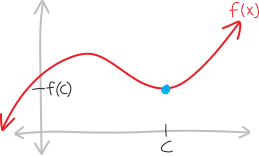
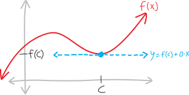
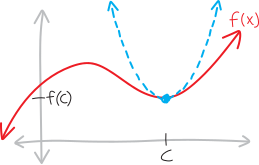
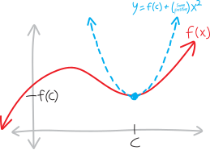
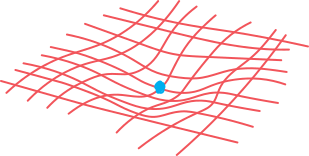
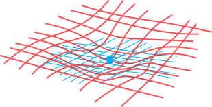
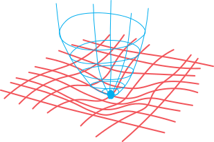

So in 1VC, we have a simple way to figure out whether a **critical point** (a point where the derivative is zero) is a maximum or a minimum: look at the second derivative! If the second derivative is positive, it's a minimum; if the second derivative is negative, it's a maximum:

The 1VC second derivative test for extrema

if

the first derivative is zero

and

the second derivative is positive

then

that point is a minimum!!!!

The 2VC equivalent of this is... more elaborate. I'll try to explain some of the reasoning in a bit, but first, I'll just describe the test/criteria themselves:

The 2VC second derivative test for extrema

Suppose we have a function:

$$f(x,y) :: \mathbb{R}^2 \rightarrow \mathbb{R}^1$$
    
And some point on $f$ given by the $x$-coordinate $c$ and $y$-coordinate $d$; i.e., the point $(c,d)$, or, including the $z$-coordinate:

$$\big(c,\, d,\, f(c,d)\big)$$

Such that both the partial derivatives, evaluated at $x=c$ and $y=d$, are zero:

$$\frac{\partial f}{\partial x} \text{ at } (x=c,y=d) \quad = 0$$
$$\frac{\partial f}{\partial y} \text{ at } (x=c,y=d) \quad = 0$$
                                                                              
Then whether or not the point that point is a minimum, a maximum, or neither, is given by calculating the following quantity involving the second partial derivatives, all evaluated at that point:

$$H = \frac{\partial^2 f}{\partial x^2}\cdot\frac{\partial^2 f}{\partial y^2} - \left( \frac{\partial^2 f}{\partial x\partial y} \right)^2 $$

Then:

* If $H<0$, then $(c,d)$ is a **saddle point** (like a mountain pass, or the point in the middle of a Pringle)

* If $H>0$, then:

    * If $\frac{\partial^2 f}{\partial x^2}$ (evaluated at $(c,d)$) is less than $0$, then $(c,d)$ is a **maximum**.

    * If $\frac{\partial^2 f}{\partial x^2}$ (evaluated at $(c,d)$) is greater than $0$, then $(c,d)$ is a **minimum**.

* If $H=0$, then who knows!

Yikes.

OK, we'll try to get *some* intuition for where this comes from, but first, let's think about the classic 1VC test for extrema, in a little more detail.

## 1vc

The classic 1VC test to figure out whether a point is a minimum or a maximum is: 

The 1VC second derivative test for extrema

if

the first derivative is zero

and

the second derivative is positive

then

that point is a minimum!!!!

I've written some pretty detailed notes about why all this is true, which you can read elsewhere, but since I'm trying to motivate the *two*-dimensional second derivative test here, I'm not going to elaborate on why this is true, but instead propose a much more convoluted, much more elaborate, way of putting it. (Bear with me for a moment---it's about making this analogy to the 2VC case.) So, put more elaborately, this 1VC second derivative test for extrema is:

The 1VC second derivative test for extrema (complicated phrasing)

if

the first-order Taylor series/polynomial approximation is a flat straight line

and

the quadratic Taylor series/polynomial approximation is an upwards-opening parabola

then

that point is a minimum!!!!

This seems like a much more convoluted way of saying exactly the same thing! And it is. Give me a moment to justify it. Suppose we have some function, with a minimum at $x=c$ and $y=f(c)$:

Saying that "the first-order Taylor series/polynomial approximation is a flat straight line" is just a more complicated way of saying "the first derivative is zero." Algebraically, the Taylor series of a function (around $x=c$) is:
$$f(x) \approx f(c) + f'(x)\!\cdot\! (x-c) \,\, + \frac{f''(c)}{2}(x-c)^2 + \frac{f'''(c)}{3}(x-c)^3 + \cdots$$
so the first-order Taylor series/polynomial approximation/linear approximation/tangent line approximation (different names for the same thing) is just:
$$f(x) \approx \underbrace{f(c) + f'(c)\!\cdot\! (x-c)}_{\text{linear approx}} \quad {\color{lightgray}+ \frac{f''(c)}{2}(x-c)^2 + \frac{f'''(c)}{3}(x-c)^3 + \cdots}$$
so the first derivative being zero at that point means it's just a flat straight line:
\begin{align*}
f(x) &\approx \underbrace{f(c) + 0\!\cdot\! (x-c)}_{\text{linear approx}} \quad {\color{lightgray}+ \frac{f''(c)}{2}(x-c)^2 + \frac{f'''(c)}{3}(x-c)^3 + \cdots} \\
&\approx f(c) + 0x \\
&\approx f(c)
\end{align*}
Visually, here's what that looks like. Here's the first-order Taylor series/polynomial approximation (which last year in 1VC you probably just called the **tangent line approximation**) to the function, at that point:

See? It's flat! It's just a flat line at $y=f(c)$!!!

Meanwhile, "the quadratic Taylor series/polynomial approximation is an upwards-opening parabola" is the same as saying "the second derivative is positive" is a complicated way of saying "the $x^2$ term is negative." Why? Imagine we have a random quadratic, like:
$$5x^2+4x+3$$
Does it open up or down? Up! How do we know? Because the coefficient on the $x^2$ is positive! What about this one:
$$-5x^2+4x+3$$
Now it opens downwards! Why? Because the coefficient on the $x^2$ is negative! 

So suppose we have our quadratic approximation:
$$f(x) \approx \underbrace{f(c) + f'(c)\!\cdot\! (x-c)+ \frac{f''(c)}{2}(x-c)^2}_{\text{quadratic approx}}  \quad {\color{lightgray} + \frac{f'''(c)}{3}(x-c)^3 + \cdots}$$
It's a parabola! Here's what it looks like:

What determines whether it's an upwards- or downwards-opening parabola is the coefficient on the $x^2$ term:
$$f(x)\quad \approx\quad f(c) \quad+\quad f'(c)(x-c) \quad+\quad \underbrace{\frac{f''(c)}{2}}_{\mathclap{\substack{\text{determines whether it}\\\text{opens up or down}}}}(x-c)^2 $$
There's a dividing-by-two in there, too, but that doesn't make a difference; what matters is whether the second derivative at that point---$f''(c)$---is positive or negative. In our example here, it's positive, so we have a minimum:

Actually, the Taylor series formula is an even simpler parabola: we already know the linear term is zero:
\begin{align*}
f(x) &\approx f(c) + \underbrace{f'(c)\!\cdot\! (x-c)}_{=0} + \frac{f''(c)}{2}(x-c)^2 \\ \\
&\approx f(c) + \frac{f''(c)}{2}(x-c)^2 \\ \\
\end{align*}

So that's our logic: if the second derivative is positive, that's the same as saying that the quadratic term in the Taylor series is positive, which is the same as saying that the quadratic Taylor series is an upwards-opening parabola:
$$\substack{\text{the quadratic/second order}\\\text{Taylor series/polynomial approximation}\\\text{is an upwards-opening parabola}} \iff \substack{\text{the $x^2$ term}\\\text{is positive}} \iff \substack{\text{the second derivative}\\\text{is positive}}$$
So then, we have this very simple way of phrasing the 1VC second derivative test for extrema, and this more-elaborate-for-unclear-reasons way of phrasing it:

The 1VC second derivative test for extrema (simple phrasing)

if

the first derivative is zero

and

the second derivative is positive

then

that point is a minimum!!!!

    

The 1VC second derivative test for extrema (complicated phrasing)

if

the zeroth-order Taylor series/polynomial approximation is a flat straight line

and

the quadratic Taylor series/polynomial approximation is an upwards-opening parabola

then

that point is a minimum!!!!

## Into 2VC

OK, but making things complicated for the sake of making things complicated is dumb. We should try to make things as *simple* as possible---rather than, as all too often happens in math teaching, make simple things complicated.

Here, though, there's some payoff (I think) for making the 1VC second derivative test a little more complicated, because it makes the very complicated 2VC test more simple. Here's the analgous, much simpler 2VC second derivative test:

The 2VC second derivative test for extrema  (simple phrasing)

if

the zeroth-order Taylor series/polynomial approximation is a flat straight plane

and

the quadratic Taylor series/polynomial approximation is a downwards-opening paraboloid

then

that point is a maximum!!!!

Let's do the visual version. Here's a two-dimensional surface, with a minimum:

Please forgive me for my bad hand-drawn wireframes. Anyway, imagine we have the first-order Taylor series/polynomial approximation/tangent plane:

Look! It's flat! That corresponds to both the first partials being zero! And then suppose we have the second-order/quadratic Taylor series/polynomial approximation/tangent parabaloid:

Look! It's opening up!!!

The algebra behind all this gets nasty. But this really is the core idea:

* **in 1VC**: a flat tangent line; an upwards-opening tangent parabola
* **in 2VC**: a flat tangent plane; an upwards-opening tangent paraboloid

So we can see how, regardless of whether we're operating in 1VC or 2VC, the ideas are analgous:

    

The 1VC second derivative test for extrema

if

the zeroth-order Taylor series/polynomial approximation is a flat straight line

and

the quadratic Taylor series/polynomial approximation is an upwards-opening parabola

then

that point is a minimum!!!!

The 2VC second derivative test for extrema

if

the zeroth-order Taylor series/polynomial approximation is a flat straight plane

and

the quadratic Taylor series/polynomial approximation is a downwards-opening paraboloid

then

that point is a maximum!!!!

## Okay, but how do we figure out if parabaloids open up or down?

So the intuition here is straightforward: we just need to figure out whether the quadratic Taylor approximation is an upwards-pointing parabaloid or a downward-pointing parabaloid. And that's where we get into all these details. 

In 1VC, polynomials have:

* one constant term
* one linear term
* one quadratic term
* one cubic term
* etc.

In 2VC, polynomials have:

* one constant term
* two linear terms
* three quadratic terms
* six cubic terms
* etc.

In 2VC, polynomials have:

* one constant term
* two linear terms ($x$ and $y$)
* three quadratic terms ($x^2$, $y^2$, and $xy$)
* four cubic terms ($x^3$, $x^2y$, $xy^2$, and $y^3$)
* etc.

The 1VC test for extrema:

if we have a point at which

the first derivative is zero
and
the second derivative is negative
then
that point is a maximum!!!!

the first derivative is zero

and

the second derivative is negative

then

that point is a maximum!!!!

Here's a much more convoluted, much more elaborate, way of putting that same statement
or, put somewhat more elaborately

if we have a point at which

the zeroth-order Taylor series/polynomial approximation is a flat straight line

and

the quadratic Taylor series/polynomial approximation is a downwards-opening parabola

then

that point is a maximum!!!!

This takes a simple statement and makes it way more complicated, but bear with me!

"the zeroth-order Taylor series/polynomial approximation is a flat straight line" is just a convoluted way of saying "the first derivative is zero". like, a taylor series, around $x=c$ is:

$$f(x) \approx f(c) + f'(x)\!\cdot\! (x-c) \,\, + \frac{f''(c)}{2}(x-c)^2 + \frac{f'''(c)}{3}(x-c)^3 + \cdots$$
so the zeroth-order Taylor series/polynomial approximation is just:
$$f(x) \approx \underbrace{f(c) + f'(c)\!\cdot\! (x-c)}_{\text{linear approx}} \quad {\color{lightgray}+ \frac{f''(c)}{2}(x-c)^2 + \frac{f'''(c)}{3}(x-c)^3 + \cdots}$$
so the first derivative being zero at that point means it's just a flat straight line:
\begin{align*}
f(x) &\approx \underbrace{f(c) + 0\!\cdot\! (x-c)}_{\text{linear approx}} \quad {\color{lightgray}+ \frac{f''(c)}{2}(x-c)^2 + \frac{f'''(c)}{3}(x-c)^3 + \cdots} \\
&\approx f(c) + 0x \\
&\approx f(c)
\end{align*}

but it's complicated for a good reaso

thus, the 2VC test for extrema:

the zeroth-order Taylor series/polynomial approximation is a flat straight plane

and

the quadratic Taylor series/polynomial approximation is a downwards-opening paraboloid

then

that point is a maximum!!!!

The 1VC second derivative test for extrema

if

the zeroth-order Taylor series/polynomial approximation is a flat straight *line*

and

the quadratic Taylor series/polynomial approximation is a downwards-opening parabola

then

that point is a maximum!!!!

The 2VC second derivative test for extrema

if

the zeroth-order Taylor series/polynomial approximation is a flat straight *plane*

and

the quadratic Taylor series/polynomial approximation is a downwards-opening parabo*loid*

then

that point is a maximum!!!!

in 2vc, parabolas 

$$f(x,y) = 1 + 2x + 3y + 4x^2 + 5y^2 + 6xy$$

there are THREE quadratic terms:

* the $x^2$ term
* the $y^2$ term
* the $xy$ term

whether a parabaloid is upwards-openign or downwards-opening depends on the balance of all three of those terms!!!! like, if they're all positive, then it'll be upwards-opoening; if they're all negative, then it'll be downwards opening. but if they're a mix... thigns get nasty. 

positive definite

https://en.wikipedia.org/wiki/Definite_quadratic_form

$$\begin{bmatrix} \frac{\partial^2 f}{\partial x^2} &  \frac{\partial^2 f}{\partial x\partial y} \\
\frac{\partial^2 f}{\partial y\partial x} &  \frac{\partial^2 f}{\partial y^2} 
\end{bmatrix}$$

$$\begin{bmatrix} f_{xx} & f_{xy} \\ f_{yx} & f_{yy}
\end{bmatrix}$$

$$f(x,y) \approx f(c,d) + f'( $$

## The One-Dimensional Second Derivative Test for Extrema

Suppose we have a function:

$$f(x) :: \mathbb{R}^1 \rightarrow \mathbb{R}^1$$
    
And some point on $f$ given by the $x$-coordinate $c$, i.e., including the $y$-coordinate:

$$\big(c,\, f(c)\big)$$

Such that the partial derivative, evaluated at $x=c$, is zero:

$$f'(c) = 0$$

or, in the other notation:

$$\frac{df}{dx} \text{ at } (x=c) \quad = 0$$

Then whether or not the point that point is a minimum, a maximum, or neither, can be (somewhat) determined by considering the value of the second derivative at that point:

* If $f''(c) > 0$, then $\big(c,\, f(c)\big)$ is a minimum of $f(x)$
* If $f''(c) < 0$, then $\big(c,\, f(c)\big)$ is a maximum of $f(x)$
* If $f''(c) = 0$, then $\big(c,\, f(c)\big)$ is... uhhh, unclear. It could be a min, it could be a max, or it could be neither! 

## The Two-Dimensional Second Derivative Test For Extrema

Suppose we have a function:

$$f(x,y) :: \mathbb{R}^2 \rightarrow \mathbb{R}^1$$
    
And some point on $f$ given by the $x$-coordinate $c$ and $y$-coordinate $d$; i.e., the point $(c,d)$, or, including the $z$-coordinate:

$$\big(c,\, d,\, f(c,d)\big)$$

Such that both the partial derivatives, evaluated at $x=c$ and $y=d$, are zero:

$$\frac{\partial f}{\partial x} \text{ at } (x=c,y=d) \quad = 0$$
$$\frac{\partial f}{\partial y} \text{ at } (x=c,y=d) \quad = 0$$
                                                                              
Then whether or not the point that point is a minimum, a maximum, or neither, is given by calculating the following quantity involving the second partial derivatives, all evaluated at that point:

$$H = \frac{\partial^2 f}{\partial x^2}\cdot\frac{\partial^2 f}{\partial y^2} - \left( \frac{\partial^2 f}{\partial x\partial y} \right)^2 $$

Then:

* If $H<0$, then $(c,d)$ is a **saddle point** (like a mountain pass, or the point in the middle of a Pringle)

* If $H>0$, then:

    * If $\frac{\partial^2 f}{\partial x^2}$ (evaluated at $(c,d)$) is less than $0$, then $(c,d)$ is a **maximum**.

    * If $\frac{\partial^2 f}{\partial x^2}$ (evaluated at $(c,d)$) is greater than $0$, then $(c,d)$ is a **minimum**.

* If $H=0$, then who knows!

Don't memorize this! This is gross and long---we're only seeing it as an *example* of how hideously complicated optimization gets in higher dimensions, as opposed to a formula we care about for its own sake. The formula comes from taking a second-order quadratic Taylor series around $(c,d)$, and seeing whether it looks like an upwards-facing parabola or downwards facing parabola (or neither). The details get quite messy, but that's the core idea. [Here's a suprisingly good Khan Academy article that goes into more depth.](https://www.khanacademy.org/math/multivariable-calculus/applications-of-multivariable-derivatives/optimizing-multivariable-functions/a/optimizing-multivariable-functions/a/reasoning-behind-the-second-partial-derivative-test)