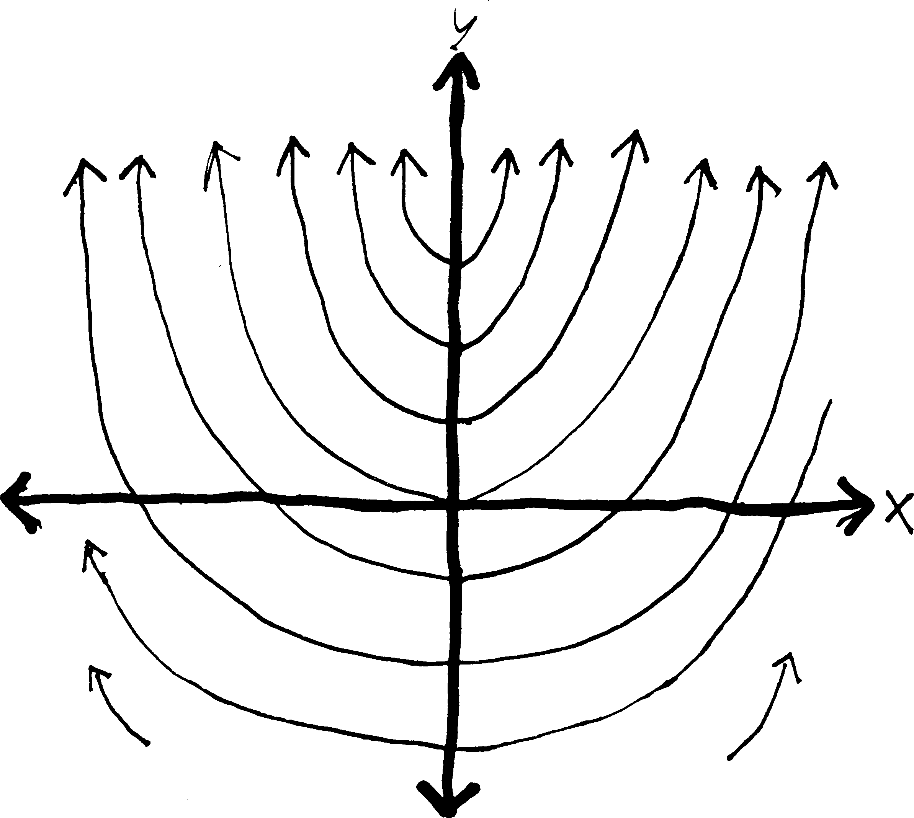
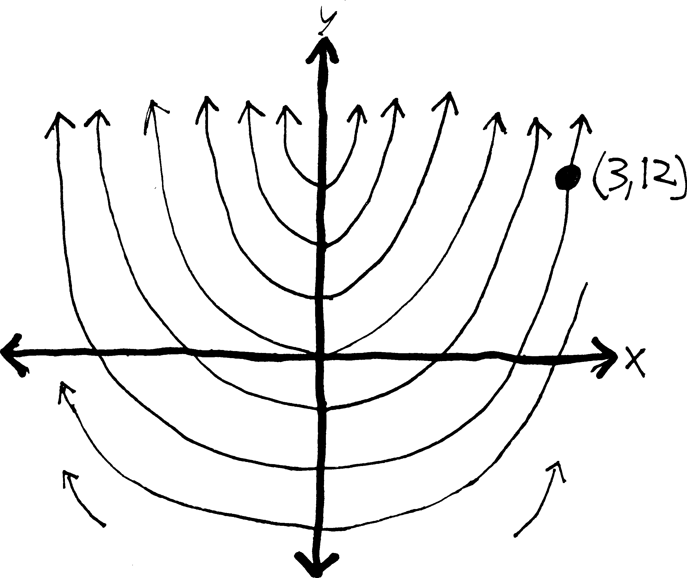

These are notes I originally wrote in 2009-2011 as part of my later-named <a href=http://www.andrusia.com/math>Adventures in Mathematics</a> curriculum while teaching in Phoenix. They were great for the time, but are distinctly earlier work, and haven't yet been rewritten in my current, deeper modes of mathematical storytelling.---Andrew

Here's David Foster Wallace on differential equations:

> ...the \#1 math tool for solving problems in physics, engineering, telemetry, automation, and all manner of hard science. You usually just start flirting with D.E.'s at the end of freshman math; it's in Calc III that you find out how ubiquitous and difficult they really are.
>
> In a broad sense, *differential equations* involve relationships between an independent $x$, a dependent $y$, and some derivative(s) of $y$ with respect to $x$. D.E.'s can be thought of either as integral calc on some sort of Class IV hallucinogen or (better) as "metafunctions," meaning one level of abstraction up from regular functions---meaning in turn that if an ordinary function is a sort of machine where you plug certain numbers in and get other numbers out, a differential equation is one where you plug certain functions in and get other functions out. The solution of a particular differential equation, then, is always some function, specifically one that can be substituted for the D.E.'s dependent variable to create what's known as an "identity," which is basically a mathematical tautology.
>
>That may not have been too helpful. In more concrete terms, a simple differential equation like $\displaystyle \frac{dy}{dx} = 3x^2 -1$ has as its solution that function for which $3x^2 - 1$ is the derivative. This means what's now required is integration, i.e. finding just the function(s) that satisfies $\int (3x^2 - 1)dx$. If you've retained some freshman math, you'll probably see that $\int(3x^2-1)dx$ equals $f(x) = x^3 - x + C$ (with $C$ being the infamous Constant of Integration), which equation is the same as $y = x^4 - x + C$, which latter just so happens to be the *general solution* of the differential equation $\displaystyle \frac{dy}{dx} = 3x^2 -1$. This D.E.'s *particular solutions* will be those functions in which $C$ takes on some specific value, as in like $y = x^3 - x + 2$ and so on. 
>
> Graphwise, because of $C$ and the general/particular thing, differential equations tend to yield `families of curves' as solutions...^[*Everything and More: A Compact History of $\infty$*, by David Foster Wallace (W.W. Norton, 2003), pp.151-2. (Footnotes removed. Seriously, there were four footnotes in 2.5 paragraphs...)]

**Suppose you're a mathematical archaeologist**. You run across the petrified derivative of a function, $\displaystyle \frac{dy}{dx} = 2x$, and you want to reconstruct the original function whence this derivative came (as an entertaining exhibit to museum-goers).

Well, obviously, you just take an antiderivative, and you get $y = x^2 + C$. You don't really know which function the derivative came from---it could have been $y = x^2$, or $y = x^2 - 8$, or $y = x^2 - 300,456$---so you instead just write $y = x^2 + C$, where $C$ can be any real number. So really, you get not a single function, but a whole collection of related functions. If you wanted to, you could graph a bunch of them. Below, I've graphed a bunch of them (in the cases that $C$ is an integer):

{width=50%}

But what if we know a bit more about this ancient function? Sometimes when archaeologists dig up ancient beasts, they find other things in their stomachs. Like, they dig up a t-rex, and find the tiny chewed-up boney remains of a baby triceratops in its stomach. And they conclude: t-reges must have eaten baby triceretopes! So they can make the diorama in the museum more accurate, by showing a t-rex not just wandering through the wild but pursuing a baby tricerotops. 

We can do the same thing with functions. What if we know not only that we have a function whose derivative is $2x$, but that that function passed through the point $(1,4)$? Then we can take our original set of possible functions, and reduce them to just a single function! We can, essentially, pin our possibilities down to a single function:

{width=50%}

There is only one function that *both* has a derivative of $2x$ *and* passes through $(3,12)$! We have pinned it down! "And when I am formulated, sprawling on a pin / When I am pinned and wriggling on the graph..." We can find the function algebraically simply by plugging in $12$ for $y$ and $3$ for $x$:

$$y = x^2 + C$$ (we take an antiderivative) \\
$$12 = (3)^2 + C$$ (plug in the point we know) \\
$$12 = 9 + C$$  (solve for C) \\
$$C = 3$$
$$y =x^2 + 3$$ (and then plug C back in to our original eq'n)

There we go! So we can put the function $y = x^2 + 3$ on display in our museum of functions.

By the way, when we're doing stuff with differential equations, it's usually easier to use Leibniz notation for derivatives (i.e., $\frac{df}{dx}$) rather than prime/Lagrange notation ($f'(x)$). You'll see why in a bit. Also, the "point" that we plug into the general solution to find the particular solution goes by a couple different names: often it's called the **initial condition** or **boundary condition,** or sometimes the **constraint.** And it's given in a variety of different ways:

*  passes through $(3,12)$
* $y=12$ when $x=3$
* $f(3) = 12$
* $y_0 = 12$, $x_0 = 3$ (The subscript zeroes here imply a sort of "initiality," I guess.)

These all mean the same thing. Sometimes you might need (and might be given) multiple conditions and multiple points to plug in.

Anyway. If you're just taking an antiderivative, solving a differential equation is basically straightforward (at least as far as antidifferentiation is straightforward). But what if you have a mathematical fossil that's a little more complicated? For example, you're digging out in Inner Mongolia, and you stumble across what appears to be a previously-unknown species of dinosaur: $\frac{dy}{dx} = y$. Here we have some function ($y$) that's equal to its own derivative ($dy/dx$). What function could that be? What's a function that is its own derivative? How about $y = e^x$?\footnote{$y = 0$ is another option, I guess, but it's pretty boring.}

You continue your dig, and keep finding stranger and stranger critters. What about $\frac{dy}{dx} = 2y$? A function that's twice its derivative? What would make that work? $y = e^{0.5x}$? That works. $\frac{dy}{dx}$ in that case will be $0.5e^{0.5x}$, which is half of the original function.

Is there a more systematic way of doing this? Or are we fated to forever guess-and-check, imprisoned by the luck (or unluck) of our intuition? Thankfully, for some simple differential equations, we can come up with a procedure for doing this. We can treat the $dy$ and $dx$ in a derivative like algebraic objects---like numbers and variables and such---and move them around and add and subtract and multiply and divide them just like we can with numbers and variables! And then we can integrate them. And then we can solve for $y$, and get a function!

Imagine we have something really simple like: $$\displaystyle \frac{dy}{dx} = 2x$$
We can rewrite this as just:
$$dy = 2x \, dx$$
and then we can integrate! 
$$\int dy = \int 2x \, dx$$
which is the same as:
$$\int 1 dy = \int 2x \, dx$$
$$y + C = x^2 + C$$
but really, each integration constant is different, so we should treat them differently. We'll label the one on the left as $C_1$ and the one on the right as $C_2$
$$y + C_1 = x^2 + C_2$$
so then we have
$$y = x^2 + C_2 - C_1$$
or just
$$y = x^2 + (C_2 - C_1)$$
But since our constants of integration are arbitrary to begin with, subtracting them doesn't make a difference. One arbitrary real number minus another arbitrary real number is just some other, equally-arbitrary real number. So we may as well just write this as
$$y = x^2 + C$$
Now, obviously, you can do this without having to go through this method (formally known as "separation of variables"). But what if you had something like what we just talked about---like $\frac{dy}{dx} = y$? Maybe if you're lucky, you could stare at it for a while and figure out the answer. But if you want an actual *procedure* for figuring it out, then this method is very helpful. Let me illustrate it:

$$\displaystyle \frac{dy}{dx} = y$$
Separating:
$$\displaystyle dy = y\cdot dx$$ 
Putting all $y$'s on one side and all $x$'s on one side:
$$\displaystyle \frac{dy}{y} = dx$$ 
Rewriting:
$$\displaystyle \frac{1}{y}dy = 1\cdot dx$$
Integrating:
$$\displaystyle \int \frac{1}{y}dy = \int 1 \,dx$$
Only need to have a constant on one side, since it can account for both constants:
$$\ln(y)= x + C$$

So now we have an equation relating $y$ and $x$ without any derivatives! This is a partial success. We have $y$ defined *implicitly* in terms of $x$. But what we really want is an *explicit* equation for $y$, meaning, an equation with just a naked $y$ on one side. The best way to do this here is just to exponentiate both sides by $e$:
$$e^{\ln y} = e^{x + C}$$
Because then the $e^{\text{stuff}}$ and $\ln(\text{stuff})$ will cancel out on the left side, and we'll just have:
$$y = e^{x + C}$$
Which is great! We've got a function for $y$ in terms of $x$! By convention, though, most people rewrite $e^{x+C}$ in the following way: they split it up using properties of exponents:
$$y = e^xe^C$$
and then, since $C$ is a constant, then $e^C$ is also a constant, and we may as well write it with a single letter... let's call $e^C$ $A$. Then we'll have:
$$y = Ae^x$$
Yay! We're done! So we've shown, then, that any function that is its own derivative ($dy/dx = y$) must just be $e^x$ (possibly times some constant $A$)! Note that this doesn't give us a single function---it gives us a whole collection of functions, depending on what $A$ is. If we had a specific point, we could plug that in, and find a specific function.

Let's do another example. This example will be somewhat more complicated, and we'll be given a point the function passes through, and so we'll be able to solve for a single function. There are, in fact, two different ways of going from the general solution (e.g., $y = Ae^x$) to the particular solution (e.g., $y = 5e^x$), and so I'll explain both ways. Imagine we have:
$$\frac{dy}{dx} = 2xy + 5y \,\,\,\, \text{and the point}\,\,\,(0,7)$$
Then we can solve for $y$! Rewriting:
$$\frac{dy}{dx} = y(2x + 5)$$
Separating:
$$dy = y(2x + 5)dx$$
Putting all $y$'s on one side and all $x$'s on one side:
$\frac{dy}{y} = (2x + 5)dx$$ 
Integrating:
$$ \int \frac{dy}{y} = \int (2x + 5)dx$$
Working out the integral:
$$\ln(y) =x^2 + 5x + C$$
Solving for $y$:
$$e^{\ln(y)} =e^{x^2 + 5x + C}$$
Etc.:
$$y =e^{x^2 + 5x + C}$$
Let's make it nicer on the right:
$$y =e^{x^2 + 5x}e^C$$
Etc.:
$$y =Ae^{x^2 + 5x}$$ 
Etc.:
$$y =Ae^{x(x+5)}$$

So now we have the general solution, $y = Ae^{x(x+5)}$. This gives us a collection of related curves, curves which all look the same except for this vertical expansion/compression by a factor of $A$. But we know one more thing about this function: we know that it passes through the point $(0,7)$. So we can use that extra bit of information to pin the particular solution down. There are two ways we can do this. We can either use our traditional method:

Plug in 0 for x and 7 for y:

$$7 = Ae^{0(0+5)}$$

Simplify:

$$7 = Ae^0$$

Now we've found A:

$$7 = A$$

So we can plug it back into the general sol'n and find the particular sol'n:

$$y = 7e^{x(x+5)}$$
Alternatively, we could have done it in this way. Back when we integrated, we could have done a definite integral---i.e., not just taken an antiderivative, but taken an integral from one point to another point. We could have done it in this way:
⋮

Putting all y's on one side and all x's on one side:

$$\frac{dy}{y} = (2x + 5)dx$$

Integrating from y=7 to y, and from x=0 to x:

$$\int_7^y \frac{dy}{y} = \int_0^x (2x + 5)dx$$

Working out integral. Look, ma, no constant!

$$\ln(y) - \ln(7) = (x^2 + 5x) - (0^2 + 5\cdot0)$$

Cleaning up:

$$\ln(y) - \ln(7) = x^2 + 5x$$

Properties of logs:

$$\ln\left(\frac{y}{7}\right) = x^2 + 5x$$

Solving for y:

$$e^{\ln(y/7)} = e^{x^2 + 5x}$$

Solving for y:

$$\frac{y}{7} = e^{x^2 + 5x}$$

Etc.:

$$y = 7e^{x^2 + 5x}$$
See? Same answer! Of course, we should have been a bit less sloppy with our notation, and we really shouldn't have had a $y$ and an $x$ in the bounds of the integrals that also had a $y$ and an $x$ in them. Remember how, in the proof of the FTC, we wanted to take an integral from $0$ to $x$, and so we changed the function from $f(x)$ to $f(t)$ just to avoid ambiguity? We probably should have done the same thing here:
$$ \int_7^y \frac{dt}{t}  = \int_0^x (2t + 5)dt$$
And so forth. Of course, we would have gotten the same answer.

Let's speak a bit more generally about this procedure we've been discussing. Formally, a differential equation is **separable** if it can be written in the form: $$\frac{dy}{dx} = f(x)\cdot g(y)$$where $f(x)$ is any function of $x$ and $g(y)$ is any function of $y$. Then, we can always solve it simply by rearranging:$$\frac{1}{g(y)}\cdot dy = f(x)\cdot dx$$and integrating:$$\int \frac{1}{g(y)}\cdot dy = \int f(x)\cdot dx$$Of course, this requires that we be able to find an antiderivative (which we might not be able to do) and then algebraically solve for $y$ (which we might not be able to do), and in any case, not every differential equation is separable. For example, consider $\displaystyle \frac{dy}{dx} = y + x$. Try writing this so that the $dx$ and all the $x$'s are on one side, and the $dy$ and all the $y$'s are on the other side. Try it. I dare you.

No luck? Yeah, it's impossible^[It's impossible to separate the variables and solve it using this method, but that doesn't mean it's impossible to solve. You can use more advanced methods to solve it, and get as a solution $y = Ae^x - (x + 1)$. It's quite easy to check/prove that that's a solution (just take a derivative); coming up with that solution is harder.]. Basically, with differential equations we get all the difficulties of taking integrals, but even more so. Think our methods for finding antiderivatives are haphazard and ad hoc? Methods for solving differential equations are even worse. If you take a differential equations course in college (please don't---save yourself and take algebraic topology or something instead), you'll learn a whole bunch of random, ad hoc formulas for solving certain types of differential equations, but you won't learn a general method (no such method exists), and then you'll go out into the real world (meaning, other classes) and find out that the differential equations you need to solve you don't actually know how to solve, because the diff. eqs. that you really really want to solve *can't* be solved.

Perhaps the most famous example is the **three-body problem**. Here's the question: if you have two objects, and some force between them, you can predict the positions of both objects. For example, if you have a sun and a single planet rotating around it (mutually attracted by gravity), and you know the right initial conditions (mass, initial momentum, etc.), you can set up a fairly simple differential equation to predict their position, and solve it. Newton did it. (It takes a little bit of work, otherwise I'd show it here, but you can look it up. All you really need is Newton's second law (force $=$ mass $\cdot$ acceleration). Acceleration is a derivative, a second derivative ($a = \frac{d^2x}{dt^2}$), and so that's where the differential equation comes from.)

Another example, at the opposite extreme of size, comes from quantum mechanics. A hydrogen atom consists of just a proton and an electron orbiting each other, with quantum-mechanical forces in between them. We can "solve" the hydrogen atom exactly, and find out quite a bit about its properties.

But what if we have three objects? What if we have a sun and two planets? Or a nucleus with two electrons (like a helium atom)? As it turns out, we can't solve a three-body equation exactly. Unlike the two-body case, we can never come up with an equation that predicts the motion of three objects, when there are forces between all three of them! We can estimate their motion using a computer, of course, but we can't actually come up with a nice, beautiful, algebraic solution. And the interesting thing that happens when you simulate the solution with a computer is that... well, so, when you have two bodies orbiting each other, their motion is very nice and predictable. They both follow simple ellipses. But when you have three bodies orbiting each other... their motion is somewhat unpredictable. They don't always return to the same positions. They don't behave totally randomly, but they don't behave predictably, either. Their behavior is *chaotic*! And in fact, with differential equations and $n$-body problems is where the mathematical study and description of chaos theory begins.

But that's for another day. Back to separable diff. eqs. They may encompass only a small number of all the possible differential equations, but they're a good starting point. There are some problems in the back that will give you practice.

Here's a somewhat harder type of differential equation: what if you have, like$$\frac{dy}{dx} + 2y = 3$$Your first temptation is probably to try to separate this. But you won't be able to. Crap. So here's another way of thinking about this: is there anything we could multiply both sides of this equation by that would suddenly make it possible to take an integral of both sides? What I mean is this: Imagine we multiply both sides by $e^{2x}$. Since we're multiplying both sides by the same thing, it won't actually change the equation. But it will make it easier to solve! We'll have this: 
\begin{align*}
e^{2x}\cdot \left(\frac{dy}{dx} + 2y\right) &= \left(3\right)\cdot e^{2x}\\
e^{2x}\cdot \!\frac{dy}{dx} \,\,+\,\, 2e^{2x}\cdot \!y &= 3e^{2x}
\end{align*}And then, if you look very closely at this, you might notice something interesting about the left side: IT LOOKS LIKE SOMETHING THAT'S BEEN PRODUCT-RULED!!! It looks like:$$\frac{d}{dx}\left( ye^{2x} \right) = 3e^{2x}$$You might not be able to see this immediately; stare at those last two equations for a few moments until you can see it. But what's cool is that now we can integrate it! We know how to find the antiderivative of the left side---the antiderivative of a derivative is just the original function---and we certainly can find the antiderivative of $3e^{2x}$. So we'll have:

Integrating both sides w/r/t x:

$$\int \frac{d}{dx}\left( ye^{2x} \right) \, dx = \int 3e^{2x} \, dx$$

Integration & differentiation are inverse fxns and will cancel on left—antiderivative of a derivative:

$$ye^{2x} = \int 3e^{2x} \, dx$$

Integrating on right side:

$$ye^{2x} = \frac{3}{2}e^{2x} + C$$

Solving for y:

$$y = \frac{1}{e^{2x}}\left(\frac{3}{2}e^{2x} + C \right)$$

Rearranging:

$$y = \frac{3}{2} + Ce^{-2x}$$

Yay! Now we've solved this otherwise-nasty differential equation! (If we knew a point that the function passed through, we could plug it in and solve for $C$; otherwise, we're left with this general class of solutions\footnote{notice that these equations (for all possible values of $C$) all approach the same value as $x \rightarrow \infty$. Put more formally: $\displaystyle 3/2+ Ce^{-2x} \,  {\overset{x}{\underset{\infty}{\longrightarrow}} } \, 3/2$}.) If we wanted to check to make sure that this is indeed a solution, we could just take a derivative and then plug it back into our original equation:
We know:

$$y = \frac{3}{2} + Ce^{-2x}$$

So then:

$$\frac{dy}{dx} = -2Ce^{-2x}$$

Our original diff. eq. was:

$$\frac{dy}{dx} + 2y = 3$$

So if we plug dy/dx in:

$$(-2Ce^{-2x}) + 2y = 3$$

And if we also plug y in:

$$(-2Ce^{-2x}) + 2\left(\frac{3}{2} + Ce^{-2x}\right) = 3$$

So if we simplify the left side:

$$(-2Ce^{-2x}) + 3 + 2Ce^{-2x} = 3$$

$$-2Ce^{-2x} + 3 + 2Ce^{-2x} = 3$$

$$3 = 3$$

Yay! It works!

The point is that this is an example of a more general type of differential equation, known as **linear first-order equations**^[I mean, not that the name really matters, but I guess if you want to look them up in your book or on the internet, it might be helpful.]. Defined formally, they are differential equations of the form (written in both notations):
$$\frac{dy}{dx} + p(x)y = q(x) \hspace{1cm}\text{or}\hspace{1cm} y' + p(x)y = q(x)$$
(Where $p$ and $q$ are both functions of $x$.) We can't separate these equations. They can be kind of nasty to solve. But what we can do instead is to try to find something to multiply both sides of the equation by that makes both sides something we can integrate. In the last example, we multiplied both sides by $e^{2x}$. Let's do another example. This one is much harder. Imagine we have:
$$(1+t^2)\frac{dy}{dt} + 3ty - 6t = 0$$
We want, ultimately, to solve this for $y$; we want to find a function for $y$ in terms of $t$ such that this differential equation is true. Let's start by making this look a little more like our first example. Let's divide everything by $1+t^2$ so that we have the $\frac{dy}{dt}$ part by itself:
$$\frac{dy}{dt} + \frac{3ty}{1+t^2} - \frac{6t}{1+t^2} = 0$$
And now let's move the part with only the $t$ in it to the other side:
$$\frac{dy}{dt} + \frac{3ty}{1+t^2} = \frac{6t}{1+t^2}$$
And make the $y$ in the second term a little more explicit:
$$\frac{dy}{dt} + \frac{3t}{1+t^2}y = \frac{6t}{1+t^2}$$
OK? Now it looks like the general form of this type of DE. So *now* let's think about what we can multiply both sides by to make both sides integrable. What if I try---and you'll have no idea how I came up with this, which will probably make you angry (and justifiably so)---but what if I try multiplying both sides by $(1+t^2)^{3/2}$?
\begin{align*}
(1+t^2)^{3/2} \cdot \left(\frac{dy}{dt} + \frac{3t}{1+t^2}y \right) &= (1+t^2)^{3/2} \cdot \left( \frac{6t}{1+t^2}\right) \\
\frac{dy}{dt}\cdot(1+t^2)^{3/2} \, + \,y \cdot(1+t^2)^{3/2} \frac{3t}{1+t^2} &= (1+t^2)^{3/2} \frac{6t}{1+t^2} \\
\end{align*}
I'll discuss how I came up with $(1+t^2)^{3/2}$ in a minute. But for now, take a careful look at the left side. Does it look like the product rule rubble? There's a $y$ and a $y'$, so those could be parts of the product rule. But what about the rest of it? First, note that we can simplify this a bit---we can combine the $(1+t^2)$'s:
\begin{align*}
\frac{dy}{dt}\cdot(1+t^2)^{3/2} \, &+ \,y \cdot(1+t^2)^{3/2} \frac{3t}{(1+t^2)^1} &=& \,\,(1+t^2)^{3/2} \frac{6t}{1+t^2}\\
\frac{dy}{dt}\cdot(1+t^2)^{3/2} \, &+ \,y \cdot3t(1+t^2)^{1/2} &=& \,\,(1+t^2)^{3/2} \frac{6t}{1+t^2} \\
\frac{dy}{dt}\cdot(1+t^2)^{3/2} \, &+ \,y \cdot3t(1+t^2)^{1/2} &=& \,\,6t(1+t^2)^{1/2} \\
y'\cdot(1+t^2)^{3/2} \, &+ \,y \cdot3t(1+t^2)^{1/2} &=& \,\,6t(1+t^2)^{1/2} \\
\end{align*}
Does that help? Now, remember that we want to make the left side of the equation look like something that's been product ruled. If you observe that the derivative of $(1+t^2)^{3/2}$ is...
$$\frac{d}{dt}\left[(1+t^2)^{3/2}  \right] = \frac{3}{2}(1+t^2)^{1/2}\cdot2t = 3t(1+t^2)^{1/2}$$
So NOW the left side of our equation looks like something that's been product-ruled! It looks like:
$$\underbrace{y'}_{f'(t)}\cdot\underbrace{(1+t^2)^{3/2}}_{g(t)} \,\, + \,\, \underbrace{y}_{f(t)} \cdot\underbrace{3t(1+t^2)^{1/2}}_{g'(t)} = \,\,6t(1+t^2)^{1/2}$$
I can rewrite the entire equation like this:
$$\frac{d}{dt}\left(y\cdot (1+t^2)^{3/2} \right) =  6t(1+t^2)^{1/2}$$
Again, you probably can't see that immediately. So take a few moments and convince yourself that that is true. And then, at last---at long last---we can integrate and solve for $y$ as a function of $t$:

Integrating:

$$\int \frac{d}{dt}\left(y\cdot (1+t^2)^{3/2} \right)\, dt = \int 6t(1+t^2)^{1/2}\,dt$$

Antiderivative of a derivative:

$$y\cdot (1+t^2)^{3/2} = \int 6t(1+t^2)^{1/2}\,dt$$

Integrating on the right side:

$$y\cdot (1+t^2)^{3/2} = 2(1+t^2)^{3/2} + C$$

Solving for y:

$$y = \frac{1}{(1+t^2)^{3/2}}\cdot\left(2(1+t^2)^{3/2} + C\right)$$

Simplifying:

$$y = 2 + \frac{C}{(1+t^2)^{3/2}}$$

Etc.:

$$y = 2 + C(1+t^2)^{-3/2}$$

That was tough. But now we're done! We've found an equation for $y$ as a function of $t$ (up to a constant)! But you should still be angry about one thing: how did I come up with that $(1+t^2)^{3/2}$, anyway?

Here's what I did: we started with the equation that looked (with all the extraneous stuff stripped away) like this:
$$y' + y\!\cdot\!(\text{some stuff})= \text{other stuff}$$
But another way to think about that is:
$$y' + y\!\cdot\!(\text{stuff})'= \text{other stuff}$$
Put differently: the coefficient on the $y$ can be thought of not as just some function, but as the *derivative* of some function. (Again, none of this is particularly easy, so this should take some effort to read.) This is not an obvious way to think about it, but it is perfectly reasonable.
\begin{align*}
\text{For instance, in our example, that term was:}\,\,\, &\frac{3t}{1+t^2}y \\
\text{and so we had:}\,\,\, (\text{stuff})' =& \frac{3t}{1+t^2}\\
\text{meaning that the undifferentiated stuff was:}\,\,\,(\text{stuff}) =& \frac{3}{2}\ln(1+t^2)
\end{align*}
Anyway, let's go back to this general equation. What if a magical $e^\text{stuff}$ were to show up?
$$y'\cdot e^\text{stuff} + y\cdot (\text{stuff})'e^\text{stuff} = (\text{other stuff})e^\text{stuff}$$
Then the left side would look like a product rule!!!
$$y'\!\cdot\!\!\!\!\underbrace{e^\text{stuff}}_\text{a function} \,\,+ \,\,y\cdot\underbrace{(\text{stuff})'e^\text{stuff}}_\text{its derivative} = \text{other stuff}\cdot e^\text{stuff}$$
$$\frac{d}{dt}\left[ y\cdot e^\text{stuff} \right] = \text{other stuff}\cdot e^\text{stuff}$$
!!!!!! This $e^\text{stuff}$ was the magic **integrating factor** we needed to multiply everything by in order to a) make the left side look like the product rule, and b) hopefully keep the right side still integrable. And we did that by taking the thing in front of the $y$ on the left side, taking its antiderivative, and exponentiating it by $e$, so that when we multiplied we had: $(\text{stuff})'e^\text{stuff} = (e^\text{stuff})'$. So if we continue trying to solve this...
\begin{align*}
\frac{d}{dt}\left[ y\cdot e^\text{stuff} \right] &= \text{other stuff}\cdot e^\text{stuff}\\
\int \frac{d}{dt}\left[ y\cdot e^\text{stuff} \right] \, dt &= \!\!\!\!\!\!\!\! \underbrace{\int \! \text{other stuff}\cdot e^\text{stuff} \, dt}_\text{hopefully we can still integrate this} \\
y\cdot e^\text{stuff} &= \int \!\text{other stuff} \cdot e^\text{stuff}\, dt\\
y  &= \frac{1}{e^\text{stuff}} \cdot \int \! \text{other stuff}\cdot e^\text{stuff} \, dt\\
\end{align*}
Woo! So, assuming we can find an integrating factor, and assuming we can integrate $\int \text{other stuff} dt$, we can solve differential equations of this type, using this procedure! Okey-dokey? 

Let's summarize what we've done over the course of the last dozen pages. We start with some scary differential equation, and we try to solve it. To do so, we can:

1. See if we can simply take an antiderivative, but if that doesn't work, we can
2. Try separating the variables and then integrating, but we can't always do that, so we might have to try
3.  Considering it as one of these magic-almost-product-rule things (formally, as a "**linear first-order homogeneous differential equation**"), multiplying it by the appropriate integrating factor, and then integrating and solving. But even this method doesn't always work for every diff. eq., so we might have to
4.  Come up with some clever new technique!

## Problems

What you've seen in the notes is that coming up for the solutions of differential equations is a rather obnoxious process requiring lots of *ad hoc* techniques. That said, if you have a solution, it's easy to show that it is, in fact, a solution---you just take some derivatives and plug things in. (Thus putting differential equations into this very strange category of problems that are very hard to solve but whose solutions are very easy to check, like factoring.)  For each of the following differential equations, show that the given solution (or solutions) are, in fact, solutions.

\begin{multicols}{2}
\setlength{\columnseprule}{.5pt}
\begin{problems}

\item $2y' + 3y = e^{-x}$

with a) $y=e^{-x}$, b) $y=e^{-x} + e^{-3x/2}$, c) $y = e^{-x}+Ce^{=3x/2}$

\item $y' = y^2$

with a) $y=-1/x$, b) $y=-1/(x+3)$, and c) $y=-1/(x+C)$

\item $x^2y' + xy = e^x$, with $\displaystyle y = \frac{1}{x}\int_1^x \frac{e^t}{t}dt$

\item $\displaystyle \frac{dy}{dx} + \frac{2x^3}{1+x^4}y = 1$

with $\displaystyle y = \frac{1}{\sqrt{1+x^4}}\int_1^x \sqrt{1+t^4}dt$

\item $	xy' + y = -\sin x$, with $y = (\cos x)/x$

\end{problems}
\end{multicols}

\begin{problems}
\setcounter{enumi}{5}

\item The *wave equation* is a differential equation used in physics to model basically everything that bounces back and forth. You're probably quite familiar with the behavior of springs and pendula, circuits with capacitors and resistors, and possibly even waves in a tank. But so many more things can also be thought of as vibrating waves: the oscillations of a guitar string or a drum head, or the four-dimensional spherical harmonics of quantum mechanics... what about waves in a swimming pool? or what about light waves? In one sense, we can think of the entirety of physics as being the representation of the universe as vibrating matter. (String theory, in a sense, does this explicitly.)

Anyway, the one-dimensional wave equation is as follows:
$$\frac{d^2y}{dt^2} + \omega^2y = 0$$

Show that all functions of the form $y = A\sin(\omega t) + B\cos(\omega t)$ are solutions of the wave equation. (Note that this equation/set of equations has three unknowns---$A$, $B$, and $\omega$. So you'd need to know quite a bit of information about your system if you were to come up with a specific equation for $y$.)

\end{problems}

\vspace{.5pc}

\noindent Solve the following differential equations as far as you can. Your goal should be to come up with an equation for $y$ (or whatever the dependent variable is). If you know a point (or two) plug it in and find the constant (or constants); if you can solve the equation explicitly as a function for $y$, do so. You might not be able to do that. For some of these problems, you may have to antidifferentiate multiple times.

\begin{multicols}{2}
\setlength{\columnseprule}{.5pt}
\begin{problems}
\setcounter{enumi}{6}

%antiderivatives%

\item $\displaystyle \frac{dy}{dx} = 3\sqrt{x}$; $y = 4$ when $x = 9$

\item $\displaystyle \frac{dy}{dx} = \frac{1}{2\sqrt{x}}$; $y = 0$ when $x = 4$

\item $\displaystyle \frac{dy}{dt} = -\pi t \sin(\pi t)$; $y = 0$ when $t = 0$

\item $\displaystyle \frac{d^2y}{dx^2} = 0$

$\displaystyle \frac{dy}{dx} = 2$ when $x = -2$

$y = 1$ when $x = -2$

\item $\displaystyle \frac{d^2y}{dx^2} = \frac{2}{x^3}$

$\displaystyle \frac{dy}{dx} = -1$ when $x = 1/2$

$y = 7/2$ when $x = 1/2$

\item $\displaystyle \frac{d^3y}{dx^3} = 6 + \sin(x)$

$\displaystyle \frac{d^2y}{dx^2} = -1$ when $x = 0$

$\displaystyle \frac{dy}{dx} = -5$ when $x = 0$

$y = 2$ when $x = 0$

\item $\displaystyle \frac{d^3y}{dx^3} = -\cos(x)$

$\displaystyle \frac{d^2y}{dx^2} = 0$ when $x = -\pi$

$\displaystyle \frac{dy}{dx} = 1/\pi$ when $x = -\pi$

$y = 2$ when $x = -\pi$

\item $\displaystyle \frac{dy}{dx} = 1 - \frac{4}{3}x^{1/3}$; $y = 0.5$ when $x = 1$

\item $\displaystyle \frac{dy}{dx} = x + 1$; $y = 1$ when $x = -1$

\item $\displaystyle \frac{dy}{dx} = \sin(x) - \cos(x)$; $y = -1$ when $x = -\pi$

\item $\displaystyle \frac{dy}{dx} = \frac{1}{2\sqrt{x}} + \pi \sin(\pi x)$; $y = 2$ when $x = 1$

\item $\displaystyle \frac{ds}{dt} = 24t(3t^2 - 1)^3$; $s = 0$ when $t = 0$

\item $\displaystyle \frac{dy}{dx} = 4x(x^2 + 8)^{-1/3}$; $y = 0$ when $x = 0$

\item $\displaystyle \frac{ds}{dt} = 6\sin(t + \pi)$; $s = 0$ when $t = 0$

\item $\displaystyle \frac{d^2s}{dt^2} = -4\sin\left(2t - \frac{\pi}{2} \right)$

$\frac{ds}{dt} = 100$ when $t = 0$

$s = 0$ when $t = 0$

\item $\displaystyle\frac{dy}{dx} = 1 + \frac{1}{x}$; $y = 3$ when $x = 0$

\item $\displaystyle\frac{dy}{dx} = \frac{2x}{x^2 + 3}$; $y = \ln(2)$ when $x = 1$

\item $\displaystyle\frac{dy}{dt} = e^t\sin(e^t - 2)$; $y = 0$ when $t = \ln(2)$

\item $\displaystyle\frac{dy}{dx} =\frac{1}{e^t \cos^2(\pi e^{-t})}$; $y = 2/\pi$ when $t= \ln(4)$

\item $\displaystyle\frac{d^2y}{d\theta^2} = \frac{1}{\cos^2(\theta)}$

$\frac{dy}{d\theta} = 1$ when $\theta = 0$

$y = 0$ when $\theta = 0$

\end{problems}
\end{multicols}

\vspace{1pc}

%separable ones

\begin{multicols}{2}
\setlength{\columnseprule}{.5pt}
\begin{problems}
\setcounter{enumi}{26}

\item $\displaystyle \frac{dy}{dt} = te^y$

$y = 3$ when $t = 6$

\item $\displaystyle \frac{dy}{dx} = \frac{y}{x}$

\item $\displaystyle \frac{dy}{dx} = -4xy$

\item $\displaystyle 2\sqrt{xy}\frac{dy}{dx} = 1$

\item $\displaystyle\frac{dy}{dx} = x^2\sqrt{y}$

\item $\displaystyle\frac{dy}{dx} = e^{x-y}$

\item $\displaystyle\frac{dy}{dx} = \frac{2x^2 + 1}{xe^y}$

\item $\displaystyle\frac{dy}{\cos(x)dx} = e^{y+\sin x}$

\item $\displaystyle\sqrt{x}\frac{dy}{dx} = e^{y+\sqrt{x}}$

\item $\displaystyle \frac{dy}{dt} = e^y\sin(t)$

\item $\displaystyle \frac{dy}{dx} - 6y = 4$

\item $\displaystyle \frac{dy}{dx} = \frac{-15}{y^2\cos^2(x)}$

\item $\displaystyle \frac{dy}{dx}\frac{1}{\cos(4x)} = -9$

\item $\displaystyle \left(\frac{3}{\sin(t)} \right)\frac{dy}{dt} = 32$

\item $\displaystyle \left( \frac{w^{10}}{10t^9} \right)\frac{dw}{dt} = e^{t^{10}}$

\item $\displaystyle x^{-23} \frac{dz}{dx} + \frac{1}{2x^{23}} = 24$

\item $\displaystyle \frac{dy}{dx} = \frac{3x^2 + 4x - 4}{2y-4}$

$y = 3$ when $x = 1$
\item $\displaystyle \frac{dy}{dx} = \frac{xy^3}{\sqrt{1+x^2}}$

$y = -1$ when $x = 0$
\item $\displaystyle \frac{dy}{dx} =e^{-y}(2x-4)$

$y = 0$ when $x = 5$
\item $\displaystyle \frac{dr}{d\theta} = \frac{r^2}{\theta}$

$r = 2$ when $\theta = 1$
\item $\displaystyle \frac{dy}{dt} = \frac{e^{y-t}}{\cos(y)}(1+t^2)$

$y = 0$ when $t = 0$

\item $\displaystyle \frac{dy}{dt} + 3y = \cos(t)$

(you'll need to integrate by parts twice)

\end{problems}
\end{multicols}

\vspace{1pc}

%first order linear

\begin{multicols}{2}
\setlength{\columnseprule}{.5pt}
\begin{problems}
\setcounter{enumi}{48}

\item $\displaystyle e^x\frac{dy}{dx} + 2e^xy = 1$

\item $\displaystyle 2\frac{dy}{dx} - y = e^{x/2}$

\item $\displaystyle e^{2x}y' + 2e^{2x}y = 2x$

\item $\displaystyle t\frac{dy}{dt} + 2y = t^3$; $y(2) = 1$

\item $\displaystyle xy' + 3y = \frac{\sin x}{x^2}$

\item $\displaystyle (t-1)^3\frac{ds}{dt} + 4(t-1)^2s = t+1$

\item $\displaystyle (t+1)\frac{ds}{dt} + 2s = 3(t+1) + \frac{1}{(t+1)^2}$

\item $\displaystyle \sin(\theta)\frac{dr}{d\theta} + (\cos\theta)r = \tan \theta$

\item $\displaystyle \frac{dy}{dx} + xy = x$; through $(0,-6)$

\item $xy' - 4y = -2nx$

\item $(1+e^x)y' + y = 1$

\item $xy' + y = (1+x)e^x$

\item $\displaystyle \tan \theta \frac{dr}{d\theta} + r = \sin^2\theta$

\item $\displaystyle \frac{dy}{dt} + 2y = t$; $y = 1$ when $t=0$

\item $\displaystyle \theta \frac{dy}{d\theta} + y = \sin(\theta)$; through $(\pi/2, 1)$

\item $\displaystyle \theta \frac{dy}{d\theta} - 2y = \theta^3\frac{\sin\theta}{\cos^2\theta}$; $y = 1$ when $\theta = \pi/2$

\item $\displaystyle (x+1)\frac{dy}{dx} - 2(x^2 + x)y = \frac{e^{x^2}}{x+1}$; $y(0) = 5$

\item $xy' - y = 2x\ln(x)$

\item $\displaystyle \frac{dy}{dx} - \frac{y}{x} = 3x^3$; $y=3$ when $x=1$

\item $\displaystyle \sin(x)\frac{dy}{dx} + 2y\cos(x) = \sin(2x)$; $y=2$ when $x=\pi/6$

\item $\displaystyle \frac{dy}{dx} + \frac{2y}{x+1} = 0$

\item $\displaystyle \frac{dy}{dx} + \frac{2}{x+1}y = (x+1)^{5/2}$

\item $y' + y = x$; $y(0) = 1$

\item $y' - y = e^{2x}$; through $(1,1)$

\item $\displaystyle \frac{dy}{dx} + y = \frac{1}{1+e^x}$; $y = e$ when $x=0$

\item $xy' + 2y = xe^{-x}$; $y = -1$ when $x=1$

\end{problems}
\end{multicols}

\vspace{1pc}
\vspace{1pc}

\clearpage
\begin{center}**\large Money**\end{center}

\begin{problems}
\setcounter{enumi}{74}

\item One of the simplest things we can model with differential equations is model exponential growth and decay. You've seen it before, and you've done it without calculus, but with calculus, it reduces to a simple differential equation! Imagine, for example, compound interest. Say you own some sort of security that returns a predictable $5\%$ per year. And imagine you invest $1,000\$$ into that security this year (with plans to reinvest any earnings). Then clearly the rate at which the value of your security changes ($d\$/dt$) is proportional to the amount of money you have. (It's not a security that returns a fixed $\$50$ every year; it returns $5\%$ *of what you have* every year.) So we get a very basic differential equation $$\frac{d\$}{dt} = k\$$$and the two conditions that a) at $t=0$, $\$=1000$, and b) at $t=1$, $\$=1050$. Solve this differential equation and come up with a function $\$(t)$ for the amount of money you have invested into this security as a function of time (measured in years).

\item Now let's do it more generally. Imagine you invest $D$ dollars into a security that returns a fixed-rate of $p$ percent every year (which you reinvest). Come up with a function for the value of your security $\$(t)$ as a function of time (measured in years).  

\item Imagine you invest $D$ dollars into some sort of fixed-rate equity that returns $r\%$ every year (which you reinvest). How long does it take for your investment to double? triple? 

\item Between 2003 and 2007, the University of Chicago's endowment increased from \$3.22 billion dollars to \$6.2 billion dollars---an average increase of roughly $18\%$ per year\footnote{2009 University of Chicago Annual Report, http://www.uchicago.edu/annualreport/financials/endowment.shtml} . Assuming that the U of C's endowment increases exponentially, as financial instruments seem wont to do in first-order approximations, come up with a function for the value of the U of C's endowment as a function of time. Based on your model, what was the endowment worth in 2006? When did the endowment hit \$5 billion? What should the endowment have been worth in 2009, according to your model? The actual value of the endowment in 2009 was \$5.1 billion. Why does your model disagree?

\item Of course, securities that return fixed amounts every year are the boring ones. Savings accounts! Municipal bonds! Certificates of deposit! Those might be great for Grandma and her fiscal paranoia, but at our age, we can afford to be a bit more adventurous! We can invest in equities, which might not have a guaranteed rate of return---or even a positive rate of return---but have the potential to be far more rewarding than buying $\$10,000$ of debt for the new sewage treatment plant in Syracuse, New York. Unfortunately, we can't predict in advance what such equities will return. That's the point. So then we certainly can't come up with an equation how much money we'll have in 2015 if we invest $\$10,000$ into Google right now. Or how much the U of C's endowment would have been worth in 2009, from only knowing the 2003 and 2007 values.

\item But that doesn't mean we can't play around with equations and have some fun! Imagine you buy shares of a stock that fluctuates with the normal business cycle. It goes up and down and up, but the long-run trend is up. Sometimes, in a given year, the value of your stock will go down, sometimes it will go up, but usually it will do the latter. Imagine, then, that you can roughly model the value $y$ of this stock with the equation $$\frac{dy}{dt} = \sin(t) + \frac{1}{2}$$Graph this function to see that it makes sense. (Of course, I'm just making all of this stuff up, which is just what macroeconomists do anyway, which is why they have such a bad name. Macroeconomics is basically voodoo with equations. They have absolutely zero ability to run *experiments*! All they can do is look at past data.) Anyway, having done that, now imagine you invest $D$ dollars into this stock at time $t=0$. Come up with a function for the value of your stock as a function of $t$. 

\end{problems}

\vspace{1pc}

\begin{center}**\large Reproduction, etc.**\end{center}

\begin{problems}
\setcounter{enumi}{80}
\item Population growth is another thing we can easily model using differential equations! In fact, in the first-order approixmation, the equations are basically the same as for compound interest (which we did above). Imagine that the population $P$ of a country at time $t$ can be found using the differential equation $$\frac{dP}{dt} = kP$$where $k$ is some constant. Imagine that a given country has a population $P_0$ at time $t_0$, and a population of $P_2$ at time $t_2$. (Note that we need two constraints here to find the specific equation---one to eliminate the constant of integration, and the other to eliminate the already-existing $k$ in the D.E.) Find a function $P(t)$ for the population of this country at any time $t$.

\item After doing some sort of bacterial experiment, you place your agar-coated petri dish underneath a UV lamp to sterilize it so that you can reuse it. You leave it under the UV lamp for ten minutes, and the high-energy light kills all the bacteria... except for one. The lone remaining bacterium, fed by the plentiful supply of agar, begins to grow and reproduce. It takes about an hour for it to undergo a complete cell cycle, so an hour later, there are two bacteria. How many bacteria are there after two hours? three hours? four hours? what about after $t$ hours? what about after $m$ minutes? how many bacteria will there be after a day? when will there be ten million bacteria on your petri dish? 

\item Russia has a problem. A problem with overpopulation. Or rather, a problem with *under*population. Population growth in Russia is (and has been for the past several decades) below replacement levels, meaning that the population has actually been *decreasing*. (Somewhat hilariously, this is due not only to a declining birthrate, but also to a decreasing life expectancy, thanks to the increasingly third-world-quality of Russia's healthcare system (not to mention its political system).) In 2009, Russia's population was about $142$ million, and was declining at a rate of $0.177\%$ per year. Come up with a function for Russia's population in year $t$. What will the population be this year? next year? what about in 2020? what about in the centenary of Putin's birth in 2052? when will the Russian population drop below $100$ million? according to the model, when will it drop below $75$ million? If you were a Russian policymaker, what would you do to alleviate this problem?

\item (This isn't really population growth *per se*, but it is exponential growth, and I wasn't sure where else to throw it in.) In 1985, the only freeways that existed in the greater Salt River Valley area\footnote{I refuse to call it the "Valley of the Sun," which emphasizes the superficial desires of local immigrants for "good weather" and ignores a perfectly competent, geographically-accurate, existing name.} were I-10 and I-17, totaling about 85 miles in length. In 1985, Arizona voters passed Proposition 300, enacting a half-cent sales tax to fund highway construction. This resulted in the current car-encouraging sprawl of superhighways. In 2005, the total freeway network in Maricopa County was about 185 miles in length\footnote{these data come from some Google Maps calculations, as well as AZDOT's 2005 Annual Report on Proposition 400, http://www.azdot.gov/Highways/valley\_freeways/US60/Superstition/PDF/ANNUALREPORT89292.pdf}. Assuming you have no other knowledge about Ph****x's growth patterns, Arizona politics, American demographics, etc., and can only assume that the Maricopa highway network will continue to grow at the same rate, how many miles of freeway should there be in year $t$? In 2020?When will the highway network in the Salt River Valley reach 1,000 miles in length?

\item Of course, an exponential model of population growth is a very, very rough approximation. What if we complicate it a bit more? Suppose that a population of $P$ individuals has a birth rate of $dB/dt$ and a death rate of $dD/dt$. Then the rate of change of the population is:$$\frac{dP}{dt} = \frac{dB}{dt} - \frac{dD}{dt}$$Assuming that the birth rate and death rate are both proportional to the population----i.e., that $dB/dt = jP$ for some constant $a$, and $dD/dt = kP$ for some constant $k$, and that the population at time $t=0$ is $P=P_0$, find $P(t)$. 

Next, what happens to $P(t)$ as $t\rightarrow \infty$? Describe what happens (both mathematically and in words) if a) $a>b$, b) $a=b$, and c) $a<b$

\item Imagine we have a population that undergoes periodic fluctuations, which can be modeled with the differential equation$$\frac{dP}{dt} = (2\cos(2\pi t))P$$Find a function for the population as a function of time, given that at $t=0$ $P=P_0$. Draw it.

\item Or imagine we have a population that undergoes both periodic fluctuations and periodic migration, and thus can be modeled with$$\frac{dP}{dt} = 2P\cos(2\pi t) + 2P_0\cos(2\pi t)$$Again assuming that at $t=0$ $P=P_0$, find $P(t)$. Draw it. When will $P$ be at a maximum? what is that maximum?

\item It is somewhat unrealistic to assume that a population will forever grow exponentially. That bacteria colony in the petri dish---it's not as if you're going to leave it in there for a week while you go skiing and then come back to discover that your lab is just a huge throbbing glomp of bacteria. The growth of the bacteria will be proportional not just to how many bacteria there are, but also to how much space (and food) is left in the petri dish. Eventually the population will reach some sort of *carrying capacity*, its growth will level off, and its population will remain more-or-less fixed.

Imagine, for instance, the spread of a disease in a population. If only a few people are infected, it will spread quite slowly. If almost everyone is infected, it will also spread slowly (since there are very few people left to catch it). The growth rate, then, will be proportional to the number of people who are infected and the number who are not. Imagine we have a population of $M$ people in which $y$ people are infected with a disease. Then$$\frac{dy}{dt} = k\cdot y\cdot(M-y)$$Find the general solution of this differential equation. Here's a hint you'll need: $$\displaystyle \frac{1}{y(M-y)} = \frac{1/M}{y} + \frac{1/M}{M-y}$$Then imagine that at $t=0$, $y=y_0$. Find the particular solution of this DE. Graph it. What happens to $y$ as $t\rightarrow \infty$?

\item Logistic curves are pretty sweet, and can be used to model a wide range of phenomena. For example, there are about 350 students at Veritas. Imagine that one student starts a rumor that Mr. Sullivan is moving to Poland to partake in his long-standing dream of becoming a professional polka musician. The rate at which the rumor spreads is proportional, roughly, to the number of people who have heard it and the number who haven't. After one day, 45 people have heard the rumor. How long will it take for half of the Veritas student body to have heard the rumor? two-thirds?

\item SCALE-FREE NETWORKS!!!!! The graph theory connection! I totally am going to spend a day in class talking about this.

\item Imagine that a certain strain of bacteria grows at the following rate:$$\frac{dP}{dt} = 0.0020P(800-P)$$Initially, there are 100 bacteria present. Find a function for the population at any time $t$ (i.e., find $P(t)$). When is the bacteria colony growing the fastest?

\item We can make a similar model of population growth (a logisticky curve) using a slightly more complex differential equation
$$\frac{dP}{dt} = P(a-b\ln P)$$where $a$ and $b$ are both positive constants. This one is tricky to solve. Solve it. (Assuming, of course, that $P=P_0$ when $t=0$). (Suggestion: this is tough. To make it easier, set $Q=\ln(P)$, so that $dQ/dt = \frac{1}{P}\frac{dP}{dt}$. Does this make things easier? Fiddle with this for a bit. It is tough, but you can do it.) Then, what happens to $P$ as $t\rightarrow \infty$?  Finally, sketch the graph of $P(t)$. 

\end{problems}

\begin{center}**\large Radioactive Decay**\end{center}

\begin{problems}
\setcounter{enumi}{92}

\item Radioactive decay can be modeled in a similar way to population growth. On a fundamental level, radioactive decay is quantum-mechanical---each given radioactive atom has a certain probability of decaying in some finite time, and will decay at random. In the aggregate, this means---and I'm sorry we can't do the full derivation from probability, since it'd be really cool---this means that the rate at which the amount of radioactive substance decreases is proportional to the amount of substance:
$$\frac{dV}{dt} = kV$$
Imagine that at time $t=0$ you have a volume $V=V_0$ of some radioactive substance with a half-life of $t_{1/2}$, so that after $t_{1/2}$, you only have $V_0/2$ of the substance left. Come up with an equation for the amount of the substance you have left as a function of time $t$. 

\item About 99\% of the carbon on earth is carbon-12 (i.e., carbon with six protons and six neutrons), and most of the rest is carbon-13 (carbon with six protons and seven neutrons). But in the upper atmosphere, high-energy cosmic rays from outer space decay into neutrons, which collide with nitrogen atoms and turn nitrogen-14 into 1) a hydrogen atom and 2) an atom of radioactive carbon-14. The hydrogen atom floats away but the carbon-14 floats down to earth and gets taken up by living organisms who, like all other living organisms, constantly take in (and emit) carbon. Meanwhile, the carbon-14, being radioactive, will decay after a while into nitrogen. If an organism is living and constantly circulating carbon in and out (ingesting and egesting, synthesizing and excreting), the ratio of carbon-14 in its body to other carbon isotopes will be about the same as in the atmosphere. FILL IN. But if it's no longer living, it won't be taking in any more carbon-14, and so the carbon-14 that it *does* have will slowly disappear. Its half-life is about 5,730 years, so a dead body from 6,000 years ago will have about half as much carbon-14 as you or I have (ignoring the other effects of biological decay). 

So imagine Mr. Sullivan is out hiking in southern Utah one weekend, filming an episode of his Discovery Channel show *Petroglyph Hunters*. He finds a gorgeous petroglyph of what appears to be a giant duck eating a person. He carefully scrapes a small---actually, never mind. This isn't how petroglyphs are made. Um. So he, uh, keeps walking, and stumbles across a small cave, the insides of which are covered with beautiful petroglyphs. The top of the cave is jet-black---it's covered with layer after layer of soot. It seems the cave used to be, in archaeological parlance, "a place where people make fires." He carefully scrapes a small sample of soot off of the ceiling, and brings it to his lab in Tuba City for analysis. There is about 87\% the amount of carbon-14 (per carbon-12) as there is in a sample of contemporary soot (used as a control). Mr. Sullivan concludes that the cave was inhabited until \underline{\hspace{1cm}}.

\item Imagine you have a radioactive substance that takes 5 years for a third of it to decay. What is its half-life?

\item Imagine your grandmother wills you her stash of cobalt-60, a radioactive isotope of cobalt with a half-life of 5.3 years. You receive 100 grams of cobalt-60. How many grams did she have ten years ago, assuming that she neither bought nor sold cobalt-60 in the inervening decade? how many will you have in two years, if you just let it sit in a box?

\item (This is not radioactive decay *per se*, but it is a type of decay, I guess, and I didn't know where else to put this.) After graduating from high school, you gradually begin to lose touch with friends, such that every year, you only have half as many friends from high school as you did the year before. At the instant of your graduation, you had 22 friends from high school. How many do you have the summer after your first year of college? the summer after that? Come up with a function for the number of high school friends you have as a function of the years since your graduation. (Do you think that creating said functions might be responsible for the decline in your number of friends?) When will you only have four friends left from high school? When will you have no friends left from high school?

\item One of the (viscerally) coolest physics labs I did at the University of Chicago (cooler even than my experiment with polymers that required commandeering my dorm's industrial-size freezer) involved creating a radioactive isotope and measuring its half life. In the basement of the undergraduate physics building in a lead-lined room is a plutonium-beryllium ``neutron howitzer''. The howitzer's radioactive ingredients spit out a steady stream of neutrons. If you were to stand next to it for too long, your atoms would absorb some of the neutrons and become radioactive, too\footnote{Well, there are two options: either your atoms could absorb a neutron and be boosted into a heavier-but-still-stable isotope, or they could absorb a neutron and be boosted into a heavier-but-unstable isotope, which will eventually radioactively decay by spitting the extra neutron back out.}.

So my friend Alex and I went down to the basement with a small piece of silver, and stuck it into the neutron howitzer. Silver, as it turns out, is an excellent material for this sort of experiment. In its natural state, it is a mixture of two stable isotopes, $\text{Ag}^{107}$ and $\text{Ag}^{109}$. Adding a neutron to each produces radioactive isotopes, $\text{Ag}^{108}$ and $\text{Ag}^{110}$. Each of these isotopes will eventually decay by spitting the neutron back out. And... well, anyway, I just realized that this problem is going to be really hard, because these two isotopes have different half-lives, and so the tricky thing in the experiment was isolating from the data the decay from each of the isotopes, etc., and measuring the half-life of each of them... I guess it would be helpful if I had the actual lab report in front of me. But it's back in Ithaca. I'm just making this up as I remember it. Hm. Well, anyway, the point is that it was a fun way to end a year of general physics.

\end{problems}
\vspace{1pc}

\begin{center}**\large Free-Falling**\end{center}

\begin{problems}
\setcounter{enumi}{98}

\item TBDTBDTBD

\item We all know that the acceleration of gravity (near the surface of the Earth) is about $9.8 m/s^2$. But if you jump out of an airplane, or off a very tall bridge, you won't find yourself falling faster and faster and faster. You'll encounter air resistance. And eventually you'll reach a *terminal velocity*. 

If you were falling in a vacuum, 
$$\frac{dv}{dt} = g$$
But because of air resistence, we must add on an additional term. Air resistance increases with velocity---if you're walking down the street at three miles per hour, you feel essentially no air resistance. But if you're riding your motorcycle at $80mph$, you'll encounter quite a bit of air resistance. So (as a simple, first-order approximation), let's add on an additional term proportional to velocity:
$$\frac{dv}{dt} = g + av$$
where $a$  is some constant. (Presumably $a$ will turn out to be negative, since as $v$ increases, we want the change in velocity ($dv/dt$) to be negative---we want velocity to decrease.)

Solve this differential equation. Come up with a function $v(t)$ for the motion of an object subject to air resistance, whose initial velocity (at time $t=0$) is $v_0$. 

\item What happens to $v(t)$ as $t\rightarrow \infty$? Put differently, if you have an object falling with an initial velocity $v_0$, subject to gravity $g$, and with a coefficient-of-air-resistence (usually called the *drag coefficient*) $a$, what happens if it falls for longer and longer? does it keep falling faster and faster, or does it approach some terminal velocity?

\item You are walking across a tightrope from the South Rim of the Grand Canyon to the North Rim when, tragically, you fall. How long does it take before you cannonball into the Colorado? (You'll need to look up or estimate the distance you'll fall.)

\end{problems}
general case

specific case for earth
and for skydiver
If you go to the Exploratorium in San Francisco, there is a very cool exhibit that is a 3D diorama of the greater Bay Area. Onto the bay itself (and the ocean) is projected the 

 it starts snowing at a heavy but constant rate.
at 4 AM, A snowplow sets out. In the first hour, it travels two mikles. In the second hour, it travels 1 mile. What time did it start snowing? (You can assume that the speed of the snowplow is inversely proportional to the depth of the snow on the road, i.e., that $v_\text{plow} = k\cdot\frac{1}{\text{snow depth}}$. This is, of course, not completely true---if there were no snow, this would mean that the plow would go infinitely fast---but as long as there is some finite amount of snow, it is a reasonably good approximation.) 

\vspace{1pc}

\begin{center}**\large A Cold Case**\end{center}

\begin{problems}
\setcounter{enumi}{111}

\item  What happens if you put a steaming mug of hot chocolate into the freezer? Eventually it will freeze, yes, but how long will it take to freeze? It depends on the temperature of the freezer and the temperature of the hot chocolate. What if you were to do the reverse---to take ice cubes out of the freezer and place them on your porch during the Sonoran summer? They'd melt, but how long would it take them to melt? (Probably a few seconds.)

As it turns out---as Isaac Newton discovered---the rate at which the temperature of and object changes is proportional to the difference between the temperature of the object and the surrounding temperature. (This assumes, among other things, that the surrounding medium isn't affected by the temperature of the object---i.e., that the ice cubes on the porch won't lower the temperature outside, or that the temperature of the freezer won't rise slightly after we put the hot chocolate in.)

Imagine we have an object initially at temperature $T_\text{i}$, and we put it into an environment with constant temperature $T_\text{ext}$. Then the temperature of the object $T_\text{obj}$ at any time $t$ (i.e., $T _\text{obj}(t)$) can be modelled:
$$\frac{dT_\text{obj}}{dt} = k(T_\text{obj}-T_\text{ext})\hspace{1cm}(\text{where k is some constant})$$
This is known, by the way, as **Newton's law of cooling** (or heating).

Come up with the general solution for this D.E., assuming you have an object whose initial temperature is $T_i$, and whose temperature after time $t$ is $T_f$. (I chose the subscripts $i$ and $f$ to imply ``initial'' and ``final''.) Put differently, find a function for $T_\text{obj}(t)$. Then show that $T_\text{obj}(t) \,{\overset{t}{\underset{\infty}{\longrightarrow}}} \,T_\text{ext}$

\item A spinach deep-dish pizza, whose internal temperature was $220\degree$ F when removed from the oven, was set out onto a breezy $40\degree$ F porch in Logan Square to cool. Fifteen minutes later, the pizza's internal temperature was $180\degree$ F. How long will it take the pie to cool to a very edible $95\degree$ F?

\item You come back from a friend's house at 11 PM to find a dead body in your living room. It's warm---about $82\degree$ F. An hour later, it's still there. But now it's cooled to $76\degree$ F. Call the police and give them your best estimate of the time of death.

\item A solid metal sphere at a temperature of $20\degree$ C is dropped into a container of boiling water. If the temperature of the sphere increases $2\degree$ in $2$ seconds, what will the temperature be at time $t=6$ seconds? How long will it take for the temperature of the sphere to reach $90\degree$ C?

\end{problems}

\begin{center}**\large Chemical Kinetics**\end{center}

\begin{problems}
\setcounter{enumi}{111}
 
 \item hi
 
\end{problems}

\begin{center}**\large Mixing**\end{center}
\begin{problems}
\setcounter{enumi}{111}

\item Another cool type of problem we can easily model with differential equations are wacky problems with mixtures of stuff whose concentration changes over time. Imagine we have, like, a tank full of some specified concentration of salt water  (or some other chemical added to water), and we start pouring into that tank water with a different concentration of salt water, such that the tank overflows and, over time, the concentration of the salt water in the tank gradually approaches the concentration of the salt water that we're adding to it. We can think about it this way:
$$\left({ \text{rate of change of amount} \atopÊ\text{of chemical in mixture} }\right) = \left(\text{rate at which chemical enters} \right) - (\text{rate at which chemical leaves})$$
So if we assume that the chemical mixes homogeneously into the mixture (and does so instantly), we'll have:
$$\left({ \text{rate of change of amount} \atopÊ\text{of chemical in mixture} }\right)= \left({\text{rate at which} \atop \text{chemical enters}} \right) \,\,-\,\, \left({\text{concentration of } \atop \text{chemical in mixture} }\right)\!\!\cdot\!\!\left({\text{rate at which} \atop \text{mixture leaves} } \right)$$
or just:
$$\left({ \text{rate of change of amount} \atopÊ\text{of chemical in mixture} }\right)= \left({\text{rate at which} \atop \text{chemical enters}} \right) \,-\, \left(\frac{\text{amount of chemical in mixture}}{\text{total volume of mixture}}\right)\cdot \left({\text{rate at which} \atop \text{mixture leaves} } \right)$$

So imagine this scenario: you are the innkeeper at a small *ryokan* in rural Japan. Because your *ryokan* is located in an area of high geothermal activity, you have a small cedar-lined bath fed by a hot spring. The water coming from the spring is hot and very sulfurous, with an $H_2S$ concentration of about $20ppm$ (i.e., $20mg$ of $H_2S$ per liter of water). This is excellent. However, one day, you have a guest with poor taste, who says he doesn't like the smell of sulfur. He offers to pay extra for his room if you can make the bath less sulfurous. Luckily, you have a water filtration system (for, you know, the rest of the water in your inn) that filters out most (but not all) of the sulfur in the water. The filtered water has a sulfur concentration of only $1ppm$. You don't want to dump out all the water in the bath and refill it, so instead you turn on the tap for the filtered water, causing the sulfur concentration in the bath to decrease. (The bath has a volume of about $1,500$ liters, and it's full of the very-sulfurous water when you start. The tap can spit out filtered water at a rate of about $4$ liters/min.)

\begin{enumerate}
\item At what rate does $H_2S$ enter the bath? (Give units.)
\item What is the volume of water in the bath at time $t$?
\item How much $H_2S$ is there in the tank at time $t$? (Hint: you don't know. Call it ``$y$'' or something.)
\item At what rate does water leave the bath?
\item Initially, how much $H_2S$ is there in the bath?
\item Find a function for the amount of $H_2S$ in the bath as a function of time $t$.
\item Find a function for the concentration of $H_2S$ in the bath as a function of time $t$.
\item How much $H_2S$ will there be in the tank after $20$ minutes?
\item How long will it take for the $H_2S$ concentration to drop to $5ppm$?
\item What will happen to the $H_2S$ concentration as $t \rightarrow \infty$?

\end{enumerate}

\item In an oil refinery, a storage tank contains 2000 gallons of gasoline that initially has 100 kg of a special additive dissolved into it. In preparation for winter weather, gasoline containing 2 pounds of additive per gallon is pumped into the tank at the rate of 45 gallons per minute. How much additive is there in the tank 20 minutes after the process starts?

\item A 500mL beaker is full of 18 molar HCl. You want to dilute it to get 15 molar HCl. Obviously, you should just add some water, and you could easily figure out how much water to add using basic algebra, but you don't know how to do this. Also, you're out of pure water. But what you do have is  an extremely large jug of 12 molar HCl. So you start pouring the 12 molar HCl into the beaker. It overflows, but the more and more you pour, the more and more the molarity of the HCl in the beaker drops. Find an equation for the molarity of the HCl in the beaker as a function of time. 

\item Deep in the bowels of its warren-like headquarters in Cambridge, Massachusetts, is the board room of the secretive Saltonstall Foundation. The walls are darkly wood-paneled, the chairs are over-ulpholstered, and in the center of the room is a long, imposing table. The top of the table is a solid plank of wood, twenty feet long by six feet wide, hand-cut from a single redwood tree felled in northern California in the late 19th century. The board room contains 4500 cubic feet of air. At 4 PM on November 15th, a half-dozen senior Saltonstall executives enter the boardroom to conduct business. One of them lights a cigarette. He's a chain smoker. The cigarette emits carbon monoxide (among other chemicals) at the rate of $0.3ft^3/min$. A ceiling fan keeps the air in the room well-circulated, and thanks to the HVAC system, air leaves the room at the rate of (also) $0.3ft^3/min$.

Carbon monoxide, of course, is bad for you\footnote{Table from http://en.wikipedia.org/wiki/Carbon\_monoxide\_poisoning;  it cites M. Goldstein, ``Carbon monoxide poisoning,'' *Journal of Emergency Nursing*, 34 (6): 538--542 (December 2008) , but sadly, I can't get a PDF of the article.}:

 \begin{longtable}[h]{l p{8cm}}
 **Concentration** & **Symptoms** \\ \hline
35 ppm (0.0035\%)  &Headache and dizziness within six to eight hours of constant exposure \\
 100 ppm (0.01\%) & Slight headache in two to three hours\\
 200 ppm (0.02\%)  & Slight headache within two to three hours; loss of judgment\\
400 ppm (0.04\%)  & Frontal headache within one to two hours\\
800 ppm (0.08\%)  &Dizziness, nausea, and convulsions within 45 min; insensible within 2 hours \\
1,600 ppm (0.16\%  &Headache, tachycardia, dizziness, and nausea within 20 min; death in less than 2 hours \\
 3,200 ppm (0.32\%) & Headache, dizziness and nausea in five to ten minutes. Death within 30 minutes.\\
6,400 ppm (0.64\%)  & Headache and dizziness in one to two minutes. Convulsions, respiratory arrest, and death in less than 20 minutes.\\
12,800 ppm (1.28\%)  &Unconsciousness after 2-3 breaths. Death in less than three minutes. \\
\end{longtable}

The meeting goes on until the wee hours of the morning. Or at least the executives expect, when they enter the room, that it will go on that long. There are grave matters that must be discussed. But will the meeting last that long? What will the worst symptom of carbon monoxide poisoning that they experience be? Assume that the Saltonstall executive is chain-smoking the entire time. Also assume there is no carbon-monoxide detector in the room. What if a second Saltonstall executive also starts chain-smoking at the beginning of the meeting? What if none of them smoke?

\item The Gulf of Mexico contains approximately $2.5 \cdot 10^15 m^3$ of water\footnote{http://en.wikipedia.org/wiki/Gulf\_of\_Mexico}. Imagine, hypothetically, that an oil rig off the coast of Louisiana has very shoddy safety controls, and one day a terrible explosion results in the catastrophic failure of a crucial component and the subsequent spewing of $6,000m^3$ per day of oil into the Gulf\footnote{``Oil spill dumped 4.9 million barrels into Gulf of Mexico, latest measure shows,'' by Joel Achenbach and David Fahrenthold, *Washington Post* 3 August 2010.}. Assuming that the oil will continue gushing at this rate indefinitely, and assuming that excess oil will displace water in the Gulf (and push it out into the Carribean or the Atlantic), how long will it be until the Gulf of Mexico is 80\% water and 20\% oil? 

 
\end{problems}

 $\displaystyle m\frac{dv}{dt} mg - kv$

where $m$,$g$, and $k$ are all constants. Find a function for $v(t)$, given that $v=0$ when $t=0$. (Does this equation seem familiar?) Also, what happens to $v(t)$ as $t \rightarrow \infty$?

EXP GROWTH AND DECAY
POP GROWTH
RADIOACTIVE DECAY
INTEREST

terminal velocity

mixtures

snowplow
population steadty state (needs partial fractions)

NEWTON'S LAW OF COOLING

\vspace{1pc}

\noindent Here are some word problems involving exponential growth and decay. Do them.

terminal velocity

mixtures

snowplow
population steadty state (needs partial fractions)

