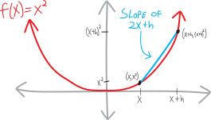

**In 1665, the bubonic plague swept across England.** Twenty-five percent of the population died. King Charles II and his court escaped London for the relative safety of the countryside. Oxford and Cambridge Universities both shut down, sending all the students home. Forced to return to his hometown of Woolsthorpe-by-Colsterworth and continue his mathematical explorations by himself was one young student named Isaac Newton. It was then and there that he discovered calculus.

Calculus often gets butchered and bowdlerized into a confusing mess of scary symbolism, “a tale / Told by an idiot, full of sound and fury / Signifying nothing.” But calculus, at its core, is about **two very simple ideas**:

* **How do we find the slopes of curvy lines?** We've known for years how to find the slopes of straight lines---but what about curvy lines? { width=75% }

* **How do we find the areas of curvy shapes?** We've known for years how to find the areas of boxy, geometric shapes---triangles, squares, and so forth. But what about blobby, curvier shapes? { width=75% }

Actually, that's an overcomplification. Calculus, at its core, is about **one simple idea**. The incredible idea at the core of calculus is that these two separate questions *are in fact the same question*. The same process we can use to find the slopes of curvy lines we can use to find the areas of curvy shapes.^[That's why we say that Newton discovered calculus. For centuries, or even millennia, people had *ad hoc* methods  for answering these two questions, at least in some simple and easy cases. The Greeks knew how to find the area of a circle, and the slope of a parabola. But it was Newton---and Leibniz, who discovered calculus simultaneously and independently, in Germany---who first realized that these two questions were in fact the same question.] This is remarkable.

## $\sim\sim\sim$Curvy slopes?$\sim\sim\sim$

It'll take us a while to build up to understanding this single core idea. Let's start more simply, by thinking about the slopes of curvy functions. We might initially ask: is the “slope” of a curvy line even a reasonable concept? After all, the way we traditionally think about slopes, it's:

$$\text{slope} = \frac{\text{rise}}{\text{run}} = \frac{\text{change in }y}{\text{change in }x} = \frac{\Delta y}{\Delta x}$$

But the thing with a curvy line is, the slope is changing at every single point! So each point has a different slope. But just because the slope isn't the same everywhere doesn't mean we can't have a slope! For example, suppose you're up at Tahoe, about to race down a run like this:

{ width=50% }

Would you say, "this run doesn't have the same slope everywhere---the slope is changing! It's not a straight line! Therefore, it doesn't have a slope!" Of course not! Rather, if you were thinking about the steepness about the run, you'd probably think it goes something like this:

* Initially, the run is flat. So the slope is $0$, or close to it.
* Then, the run starts going down. So the slope becomes negative.
* The run starts getting steeper. So the slope becomes *more* negative.
* Then the run starts getting less steep. It's still going down, just less so. So the slope is still negative, but it's less negative.
* At the bottom, the run becomes flat again. So the slope returns to being $0$.

{ width=50% }

Or:

{ width=50% }

So, the slope is some number that's changing over time. We could doodle a sketch of the slope itself, as a function itself! It'd look something like this:

{ width=50% }

The slope is *itself* a function! That's pretty cool. When we think about the slopes of straight lines, I guess those are functions, too---it's just that they're very boring functions. For example:

$$f(x) = 3x-2$$
$$\text{slope}(x) = 3$$

The function “3” is just a flat horizontal line, so it's very boring, but it's still a function:

{ width=50% }

We could go on! We could even start thinking about the slope of the slope, or the slope of the slope of the slope, or...

\vspace{3pc}

### Let's do another example

What about one of our favorite functions:
$$f(x) = x^2$$
Does it have a slope? What can we figure out about it? Well, we know that $x^2$ looks something like this:

{ width=75% }
What's going on with its slope? Moving from left to right, here's what's going on:

* At the far left, the function is going down steeply
* Then it goes down less steeply
* Then it's flat for a moment
* Then it starts going up, shallowly
* Then it starts going up steeply

{ width=75% }
So then, if we think about what its slope is as a number:

* At the far left, the function is going down steeply, so its slope is very negative (it's a big negative number)
* Then it goes down less steeply, so the slope is still negative, but less so
* Then it's flat for a moment, at the minimum, so the slope is $0$ there
* Then it starts going up, shallowly, so the slope is positive, but only slightly
* Then it starts going up steeply, so the slope is very positive (it's a big positive number)!

{ width=75% }
Let's sketch a doodle of the slope, on the same axes as $x^2$ itself. The slope, thought of as a function itself, is negative to the left of the origin, is zero at the origin, and is positive to the right of the origin, so maybe it looks something like this:

{ width=50% }

It looks kind of like $y=x$! I mean, this is just a doodle. It could also be $y=5x$, $y=\frac{1}{10}x$, or $y=x^3$, or really anything that starts in the lower-left quadrant, passes through the origin, and then ends up in the upper-right quadrant. We don't know! We just have a general idea of what the slope probably is. Presumably it looks sort of like that!

\vspace{3pc}

### Here's a waaay more complicated example.

Here's some function: 

{ width=75% }

What will its slope be? Let's think about what's going on:

* At the far left, the function is going up. So the slope is positive.
* As we move to the right, we hit a maximum, so the slope will be $0$ there.
* Then the function starts going down, so the slope is negative. 
* Then we hit a minimum, so the slope will be zero.
* Then the function starts going back up, so the slope will be positive.
* The function gets steeper and steeper, so the slope will be more and more positive
* ... but then the function starts getting less and less steep, so the slope, while still positive, is getting smaller.
* Finally, it looks like the function is asymptotically becoming flat, So the slope will approach $0$. 

{ width=75% }

## Can we calculate exact equations of the slopes?

Pictures are nice. *But we can't finger-paint our way to truth.* We want certainty. *We want an equation.* For example, we saw that if we finger-painted the slope of $x^2$, it looked like it might just be $x$, or it might be $5x$ or $0.1x$, or $x^3$, or any $x^\text{odd}$. Which is it???

Here's my proposal. We don't know how to find the exact slope of $x^2$, or the exact slope of any other curvy function. But we do know how to find the exact slope of straight lines. So let's try to *approximate* the slope of $x^2$, by approximating it as (a bunch of) straight lines. So, for example, let's suppose we want to find the approximate slope of $x^2$ between two arbitrary points, $x$ and another point $h$ units away, $x+h$:
\noindent
The $y$-coordinates of those points are $x^2$ and $(x+h)^2$, respectively. We can draw a straight line between those two points:
\noindent
The straight line between those two points will be a rough estimation of the slope of $x^2$ between those two points. Let's calculate it. We know that the two points are:
$$\left(x,x^2\right)\quad\text{and}\quad\Big(\,(x+h),\,(x+h)^2\,\Big)$$
And we know how to find the slope of a straight line between any two points. We need to find the change in the vertical, and divide it by the change in the horizontal. The vertical change is $\left(x+h\right)^2-x^2$; the horizontal change is $(x+h)-h$, or just $h$:
\noindent
So, plugging things in, we have:
\begin{align*}
\substack{\text{approximate slope of }x^2\\\text{ between }x\text{ and }x+h} \quad &= \,\,\text{slope of that straight line} \\ \\
&= \frac{\Delta y}{\Delta x} \\ \\
&= \frac{y_2-y_1}{x_2-x_1}  \\ \\
&= \frac{(x+h)^2 - x^2}{(x+h) - x}\\ \\
&\text{expanding:}\\
&= \frac{x^2 + 2xh + h^2 - x^2}{(x+h) - x}\\ \\
&\text{canceling stuff:}\\
&= \frac{\cancel{x^2} + 2xh + h^2 - \cancel{x^2}}{\cancel{x}+h - \cancel{x}}\\
&= \frac{2xh + h^2}{h}\\ \\
&\text{canceling more...}\\
&= \frac{2x\cancel{h} + \cancel{h}^2}{\cancel{h}}\\ \\
&= 2x+h
\end{align*}
So the slope of $x^2$ between those two points is approximately $2x+h$! It's not *exactly* that---the slope of $x^2$ is changing, after all---but it's roughly equal to that. 

When is this going to be a bad approximation? If the two points are really far apart! In other words, if $h$ is really big. When is this going to be a good approximation? When the two points are really close together! What's going to make this a better and better approximation? Moving the two points closer together! 

What if we wanted a really, really, really, *really* good approximation of the slope? We'd just need to make $h$ really, really, really, *really* small. 

What if we wanted not just an *approximation* of the slope, but the *exact* slope??? *We could just make $h$ equal to zero!!!!* And then we'd have:
$$\Big(\text{the approximate slope of }x^2\Big) = 2x+h$$
$$\hspace{1in}\text{as }h \text{ gets}\, \Bigg\downarrow\, \text{really small...} $$
$$\Big(\text{the exact slope of }x^2 \Big) = 2x$$
That's it! $2x$! That matches our intuition! We've found it! The exact slope of $x^2$!!!! It's not $x$, or $x^3$, or $5x$---it's just $2x$! (I wonder if there's a connection between the $2$ in $2x$ and the $2$ in $x^2$???)

So, for example, if we want to find the slope of $x^2$ at any *particular* point $x$, we can just plug the $x$-value into $2x$. For example, at $x=8$, the function $x^2$ should have a slope of $2\cdot8=16$. Does that seem reasonable? Yeah, I suppose! It's pretty steep there. At $x=-2$, the function $x^2$ should have a slope of $2\cdot(-2) = -4$. Does that seem reasonable? Yeah, it's somewhat less steep there (and it's going down, so the slope should be negative).

In fact, because $2x$ is a function, we could even graph it alongside $x^2$:
{ width=50% }

## In $\sum$mary

To summarize, what we've done is to try to find the slope of a curvy line by approximating it as the slope of a straight line:
$$\text{the average slope of } f \text{ between }x\text{ and }x+h \quad=\quad \frac{f(x+h) - f(x)}{h}$$
This approximation gets better and better as $h$ gets closer and closer to $0$. This approximation, then, turns into the *actual* slope:
$$\substack{\text{the average slope of } f\\\text{(between }x\text{ and }x+h)}  \quad\quad \xrightarrow[\quad\text{reeeally small}\quad]{\text{as h gets}} \quad\quad \substack{\text{the actual slope of } f\\\text{(at $x$)}}  $$
Or:
$$\frac{f(x+h) - f(x)}{h}  \quad\quad \xrightarrow[\quad\text{reeeally small}\quad]{\text{as h gets}} \quad\quad \text{the actual slope of }f(x)$$

## Notes on Notation

Okay, let's deal with some of the fine print. First of all, rather than keep having to write out “the slope of such-and-such,” let's come up with some notation for it. There are two notations people usually use for slopes; I flip back and forth between them, depending on the context:
$$\text{the slope of }f(x) = f'(x)$$
$$\text{the slope of }f(x) = \frac{d}{dx}\Big(f(x)\Big)= \frac{df}{dx}$$
So, for example:
$$\text{if }f(x)=x^2\text{, then }f'(x)=2x$$
$$\left(x^2\right)' = 2x$$
Using the other notation:
$$\text{if }f(x)=x^2\text{, then }\frac{df}{dx}=2x$$
$$\frac{d}{dx}\left(x^2\right)= 2x$$
There are many more notations people use for slopes, but we'll stick with these two for now. Also, the name these things usually go by is **derivative**. You can call them “slopes” if you want, because that's what they are, but “derivative” is the name most people use. 

Here's how these notations get pronounced:
\begin{align*}
f'(x)&:\quad \text{“$f$ prime of $x$”} \\
\frac{df}{dx}&: \quad\text{“d f d x”}
\end{align*}
The expression for the average slope of a function between the points $x$ and $x+h$ is often called **Fermat's Difference Quotient**:
$$\text{Fermat's Difference Quotient} = \frac{f(x+h) - f(x)}{h}$$
Finally, this whole “making $h$ really, really small” procedure is known as a **limit**. It's the same thing as we were doing in November when we were taking the limits of sequences as they go to $\infty$, just here we're making something go to $0$. This is the notation that often gets used:
$$\text{“the limit of $f(x)$ as $x$ approaches $c$ is L” is }\quad\lim_{x\rightarrow c}f(x) = L$$
Or:
$$\text{“the limit of $f(x)$ as $x$ approaches $c$ is L” is }\quad f(x)  \xrightarrow[\quad c \quad]{x} L$$
So, in the context of a derivative, we'd use it like:

$$f'(x) = \lim_{h\rightarrow 0}\left( \frac{f(x+h) - f(x)}{h} \right)$$
Or:   
$$\frac{f(x+h) - f(x)}{h}\quad \xrightarrow[\quad 0 \quad]{h}\quad f'(x)$$

## Why aren't you mad at me?

Speaking of limits, this whole “make $h$ equal to zero” thing should make you really, really upset, because aren't we then dividing by zero?!?!
$$\frac{f(x+h) - f(x)}{h} \,\, \xrightarrow[\quad 0 \quad]{h}\,\, \frac{f(x+0) - f(x)}{0} \,\,=\,\, \frac{f(x)-f(x)}{0} \,\,=\,\, \frac{0}{0}\quad ?!?!?!?!$$

##  Problems

Sketch the slope of each of the following functions on the same set of axes (i.e., on the worksheet).
 

<ol class='problems'>
<li> </li>
<li> </li>
<li> </li>
<li> </li>
<li> </li>
<li> </li>
<li> </li>
<li> </li>
<li> </li>
<li> </li>
<li> </li>
<li> </li>
<li> </li>
<li> </li>
<li> </li>
<li> </li>
<li> </li>
<li> </li>
<li> </li>
<li> </li>
<li> </li>
<li> </li>
<li> </li>
<li> </li>
<li> </li>
<li> </li>
<li> </li>
<li> </li>
<li> </li>
<li> </li>
<li> </li>
<li> </li>
<li> </li>
<li> </li>
<li> </li>
<li> </li>
<li> </li>
<li> </li>
<li> </li>
<li> </li>
<li> </li>
<li> </li>
<li> </li>
<li> </li>
<li> </li>
<li> </li>
<li> </li>
<li> </li>
</ol>

<ol class='problems'>
<li> For this function, sketch not just its slope, but (using different colors for each) the slope of its slope, and the slope of the slope of its slope.

<li> For this function, sketch not just its slope, but (using different colors for each) the slope of its slope, and the slope of the slope of its slope.

<li> Do you see any relationship between the degree of a polynomial and the degree of its slope?  </li>
<li> Do you see any relationship between the degree of the numerator and denominator of a rational function and the degree of its slope? (Or, perhaps, if the slope is itself a rational function, the degree of the numerator and denominator? </li>
<li> Suppose we have multiple versions of the same function, but each version is shifted horizontally left or right a bit. Are their slopes also shifted horizontally left or right? </li>
<li> Suppose we have multiple versions of the same function, but each version is shifted vertically up or down a bit. Are their slopes also shifted vertically up or down? </li>
<li> Slopes! Slopes of slopes of slopes! Rates of change of rates of change of rates of change... are you reminded of anything from physics??
<li> The following is the slope of some function. Can you sketch the original function?

 </li>
<li> The following is the slope of some function. Can you sketch the original function? </li>

</ol>

\vspace{2pc}

Sketch each of the following functions, sketch their slopes (on the same axes, in a different color), and then calculate the *exact* slope, using the same basic procedure we used to find the slope of $x^2$ (i.e., Fermat's difference quotient and your algebra skills). (Check your work---does the equation you found for the slope of the function look plausibly correct?)

 

<ol class='problems'>
<li> $f(x) = x^2$ </li>
<li> $f(x) = x^2 + 5$ </li>
<li> $f(x) = (x+1)^2$ </li>
<li> $f(x) = 3x^2$ </li>
<li> $f(x) = x^3$ </li>
<li> $f(x) = x^3 + 2$ </li>
<li> $f(x) = 7x^3$ </li>
<li> $f(x) = x^4$ </li>
<li> $\displaystyle f(x) = \frac{1}{x}$ </li>
<li> $\displaystyle f(x) = \frac{1}{x^2}$ </li>
<li> $f(x) = ax + b$ </li>
<li> $f(x) = \sqrt{x}$ (Hint: multiply by $1$ in a clever way) </li>
<li> $\displaystyle f(x) = -x^2$ </li>
<li> $\displaystyle f(x) = \frac{2}{x}$ </li>
<li> $\displaystyle f(x) = \frac{1}{x+1}$ </li>
<li> $\displaystyle f(x) = \frac{x}{x+1}$ </li>
<li> $\displaystyle f(x) = \frac{x}{2x+1}$ </li>
<li> $f(x) = 1 + \sqrt{x}$ </li>
<li> $f(x) = \sqrt{2x}$ </li>
<li> $f(x) = \sqrt{x+1}$ </li>
<li> $f(x) = \sqrt{2x+3}$ </li>
<li> $\displaystyle f(x) = \frac{1}{\sqrt{x}}$ </li>
<li> $\displaystyle f(x) = \frac{5}{\sqrt{x-2}}$ </li>
<li> $f(x) = \sin(x)$ </li>
<li> $f(x) = \cos(x)$ </li>
</ol>

We'd like to be able to learn more about how slopes work. Tediously calculating the slope of every function we're interested in one-by-one using Fermat's Difference Quotient would be... quite the pain. Perhaps we can figure out some shortcuts!

<ol class='problems'>
	<li>Can we split derivatives up along addition? In other words, is:
\begin{align*}
\text{the derivative of }\Big(\, f(x)+g(x)\,\Big) \quad &\stackrel{???}{=}\quad \big(\, \text{the derivative of }f(x)\,\big) \,\,+\,\, \big( \, \text{the derivative of }g(x)\,\big) \\ \\
\Big(\, f(x)+g(x)\,\Big)' \quad& \stackrel{???}{=}\quad f'(x) \,\,+\,\,g'(x) \\ \\
\frac{d}{dx}\Big(\, f(x)+g(x)\,\Big) \quad &\stackrel{???}{=}\quad \frac{d}{dx}\Big( \, f(x)\,\Big) \,\,+\,\, \frac{d}{dx}\Big( \, g(x)\,\Big)
\end{align*}
If this is true, prove it (using more-or-less the same method you used to calculate all the other derivatives above). If it's false, find a counterexample. </li>

<li> Can we pull constants out of derivatives? In other words, is:
$$\text{the derivative of }\Big(k\cdot f(x)\Big) \,\,\stackrel{???}{=}\,\, k\cdot\big(\, \text{the derivative of }f(x)\,\big)$$
We can do this for iterated and infinite sums, if you recall. Can we do it with derivatives? If we can, prove it (using more-or-less the same method you used to calculate all the other derivatives above). If it's false, find a counterexample. </li>
<li> What about subtraction? Can we split derivatives up along subtraction? If we can't, find a counterexample. If we can, prove it. You could prove it either by going through this same tedious procedure involving Fermat's Difference Quotient, or you could perhaps find a more clever way.
<li> Can we split derivatives up along multiplication?
$$\Big(\, f(x)\cdot g(x)\,\Big)' \quad\stackrel{???}{=}\quad f'(x) \,\,\cdot\,\,g'(x)$$
Again, either prove that we can, or prove that we can't. To prove it, try plugging it into Fermat's Difference Quotient and simplifying it. To disprove it, try searching for a counterexample (a time when this potential rule would be broken). </li>
<li> How 'bout division? 
$$\left(\, \frac{f(x)}{g(x)}\,\right)' \,\stackrel{???}{=}\, \frac{f'(x)}{g'(x)}$$ </li>
</ol>

   

<ol class='problems'>
<li> What's your guess as to what the slope of $x^n$ is? </li>
<li>  What about your guess as to what the slope of $ax^n + bx^{m}$ is? </li>
<li> Can you calculate the slope of $x^n$? This gets a bit tricky, because if we plug this into our Fermat's Difference Quotient procedure, we get:
$$\frac{(x+h)^n - x^n}{h}$$
And how do we deal with that $(x+h)^n$??? Here's a hint: think back to (and possibly look up) the binomial theorem (which I think you learned about in Math 2). Can you use the binomial theorem, and your skills at manipulating iterated series (which we talked about in the fall), to calculate it? In other words, don't just *guess* what the answer is; actually *prove* it!!! </li>

<li> Consider the function:
$$f(x) = x^4-16x^2$$
Sketch it. It has a maximum and a minimum! Very pretty. But *where* are these maxima and minima? Using calculus, we can find out! Sketch its slope, then *calculate* its slope, then, by seeing where the slope is zero, determine the exact $(x,y)$ coordinates of $f$'s maximum and minimum. </li>
<li>  Consider the function:
$$f(x) = x^4-3x^3-10x^2$$
Sketch it. It has a maximum and a minimum! Very pretty. But *where* are these maxima and minima? Using calculus, we can find out! Sketch its slope, then *calculate* its slope, then, by seeing where the slope is zero, determine the exact $(x,y)$ coordinates of $f$'s maximum and minimum. </li>
<li>  Consider the function:
$$f(x) = x^3-2x^2-3x$$
Again, sketch it, sketch its slope, then *calculate* its slope, then, by seeing where the slope is zero, determine the exact $(x,y)$ coordinates of $f$'s maximum and minimum. </li>

</ol>