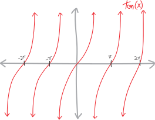
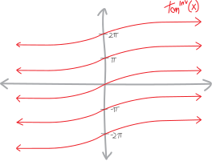

What's the derivative of inverse tangent? Who knows?!?

## visually

OK, let's see if we can think about this visually. (Of course we should *always* be thinking about derivatives visually!) Can we sketch tangent, sketch its inverse, and then sketch the slope of its inverse???

Tangent looks like:

{width=75%}

Visually, we can find/make inverses just by reflecting a function across the line $y=x$ (because that's the same as making the input the output, which is what it means to take an inverse). So inverse tangent looks like:

{width=75%}

Look at that! It's not a function... it's a **multifunction**! Each input $x$-value has an infinite number of possible outputs! Of course, this isn't surprising; tangent is a trig function, so its inverse is a whole family of stuff, all shifted by $2\pi$. (Well, actually, just $1\pi$---tangent repeats faster than sine or cosine.) It's a bunch of geological strata!

What about the derivative(s) of inverse tangent? What do those look like?

{width=75%}

There's only one of them! This is cool: tangent has a single output for each input, inverse tangent has an infinite number of values, but then the derivative of inverse tangent collapses everything back down to just one output! Each layer of inverse tangent has the same slope---inverse tangent is a bunch of identical curves, all raised up and down by multiples of $1\pi$.

## algebraically

But what is the derivative, algebraically? How do we find an actual formula for the derivative of inverse tangent? That's tough, given that we don't even have an actual formula for inverse tangent itself. We don't even know what inverse tangent *is*.  All we know about inverse tangent is that it's the thing that antimatter's tangent! It's the thing that, when we plug it into tangent, cancels out! Inverse tangent is just the mystery function that satisfies these equations"
$$\tan^\text{inv}\big( \tan\theta\, ) = \theta \quad\quad\text{and}\quad\quad \tan\left( \tan^\text{inv}\theta\,\right) = \theta $$
So what if we take one of these equations and see if we can do something with it? If we take the one on the left, we have:
$$\tan^\text{inv}\big( \tan\theta) = \theta$$
If we then take the derivative of both sides of this equation, we'll have:
$$\frac{d}{d\theta} \left[\, \tan^\text{inv}\big( \tan\theta) \,\right] = \frac{d}{d\theta} \left[\, \theta \,\right]$$
On the right side, the derivative of theta with respect to itself is just $1$:
$$\frac{d}{d\theta} \left[\, \tan^\text{inv}\big( \tan\theta) \,\right] = 1 $$
What about the left side? This is a chain rule situation! We have two functions, one inside the other. We have inverse tangent on the outside, and tangent on the inside. So we'll get the derivative of the outside, with the same insides, times the derivative of the inside. But the derivative of the outside is the derivative of inverse tangent, and we don't know what that is. Figuring it out is the whole point! But maybe we can just leave that in our equation and it'll actually be a good thing? Like, maybe we can eventually use algebra to isolate/solve for it? So we have:
$$\, \tan^{\text{inv}'}\big( \tan\theta) \cdot \frac{d}{d\theta}\left[ \tan\theta \right] = 1 $$
The derivative of tangent, meanwhile, we know is $1/\cos^2$:
$$\, \tan^{\text{inv}'}\big( \tan\theta) \cdot \frac{1}{\cos^2(\theta)} = 1 $$
We can move that around to make this a bit cleaner:
$$\, \tan^{\text{inv}'}\big( \tan\theta) = \cos^2\theta $$
But what to do here? Ideally we'd end up with an expression for just the derivative of tangent of some number alone on one side, and that's definitely not what we have here.

Two cool tricks!!!

Trick #1: remember the Pythagorean identity?
$$\sin^2x +\cos^2 x = 1$$
We can use it here. Not directly, but we can use it to rewrite $\cos^2\theta$ in terms of tangent. There isn't a tangent in the normal form of the Pythaogrean identity, but if we take it and multiply both sides by $\cos^2x$, we get:
$$\frac{1}{\cos^2x}\left(\sin^2x +\cos^2 x\right) = \frac{1}{\cos^2x} \cdot 1$$
$$\frac{\sin^2x}{\cos^2x} +\frac{\cos^2x}{\cos^2x} = \frac{1}{\cos^2x}$$
$$\frac{\sin^2x}{\cos^2x} + 1 = \frac{1}{\cos^2x}$$
$$\tan^2x + 1 = \frac{1}{\cos^2x} $$
$$\cos^2x = \frac{1}{\tan^2x + 1}$$
So if we plug that in here for $\cos^2\theta$, we get:
$$\tan^{\text{inv}'}\big( \tan\theta) = \cos^2\theta$$
$$\tan^{\text{inv}'}\big( \tan\theta) = \frac{1}{\tan^2(\theta) + 1}$$
$$\tan^{\text{inv}'}\big( \tan\theta) = \frac{1}{\left(\tan\theta\right)^2 + 1}$$
Now at we're rid of the cosines! Now we only have tangents!

But... we have a $\tan\theta$ on the left, and also a $\tan\theta$ on the right. And truthfully, we don't actually really care about $\tan\theta$ here. We just want to find the derivative of inverse tangent. We don't want to find the derivative of inverse tangent *of* tangent; we want to find the derivative of inverse tangent *of any random number*. And... really, here, in our equation, $\tan\theta$ could be anything. So... trick #2! Let's say that $\tan\theta$ is some unknown variable $x$???
$$\text{let }\tan\theta = x$$
So then this will simplify to just:
$$\tan^{\text{inv}'}\big( \tan\theta) = \frac{1}{\left(\tan\theta\right)^2 + 1}$$
$$\tan^{\text{inv}'}( x) = \frac{1}{x^2 + 1}$$
And... that's it! That's a formula for the derivative of inverse tangent, of any random input $x$!!! It's what we wanted!
$$\boxed{\,\, \tan^{\text{inv}'}( x) = \frac{1}{x^2 + 1} \,\,}$$
Does this look basically like what we sketched? Yeah! It's just a rational function---perhaps one you even remmeber sketching. It has no roots (because $1\neq 0$), it has no vertical asymptotes (because $x^2+1 \neq 0$), it's got a horizontal asymptote at $y=0$---yeah, this is it!

## Problems

<ol class='problems'>
<li> We came up with this formula for the derivative inverse tangent by using *one* of the two equivalent equations defining it, $\tan^\text{inv}\big( \tan\theta) = \theta$. But what if we used the other one? If we started with $\tan\left( \tan^\text{inv} \right) = \theta$, can we still get the same result? (In the same way?) Work it out!
<li> OK, this was fun, and there's something even more fun: *none of the ideas in this derivation were specific to inverse tangent.* Well, OK, some of the ideas were: we used the Pythagorean identity. But we could make a very similar argument and come up with a formula for the derivative of *any inverse function*! A lot of payoff, for only a little extra work! Can you do it? Can you take what we did, and instead of making this argument about $\tan(x)$ and $\tan^\text{inv}(x)$, make it about just $f(x)$ and $f^\text{inv}(x)$?!? 
$$f^{\text{inv}\,'}\big(\, x \, \big) \quad = \quad ???$$</li>
<li> Having done that, can you verify that your formula works by testing it on some pairs of functions and inverse functions whose derivatives you already know? ($x^3$ and $\sqrt[3]{x}$? $e^x$ and $\ln(x)$??? Others???) </li>
<li> What's a function whose inverse's derivative you *don't* know? What does this formula tell you it should be??
<li> What's the... the *antiderivative* of $\displaystyle\frac{1}{x^2+1}$???
</ol>