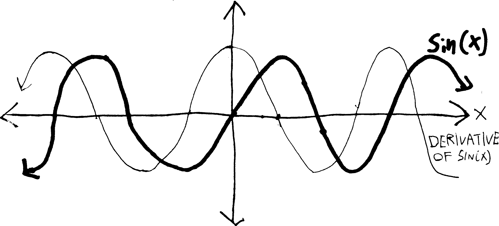
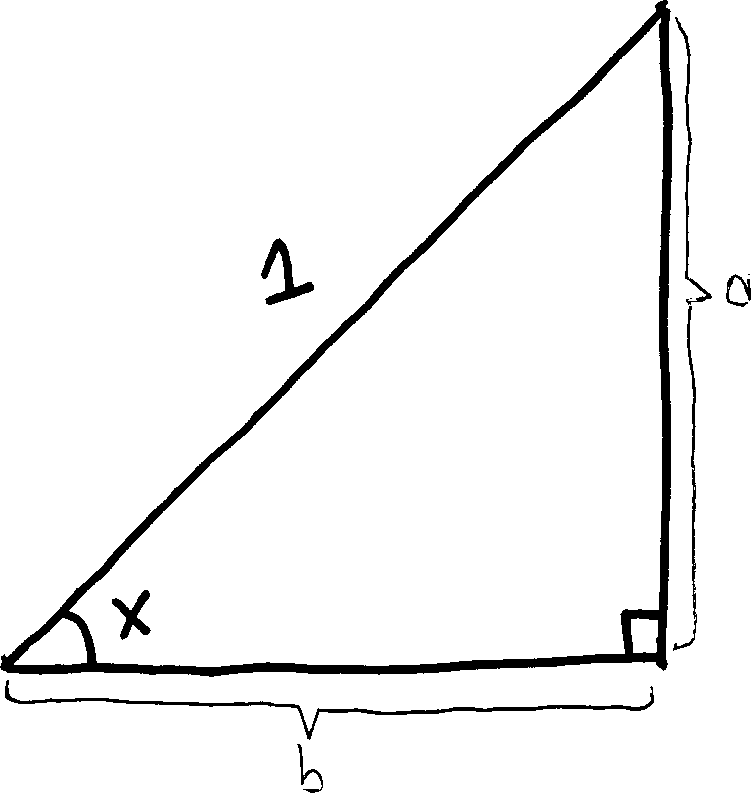
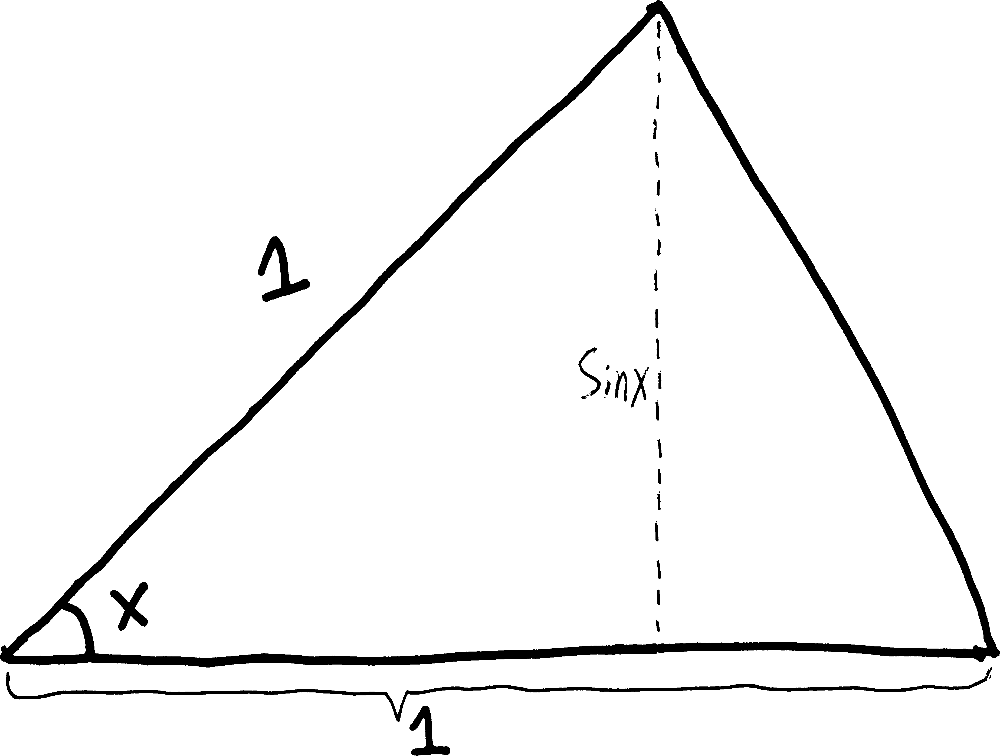
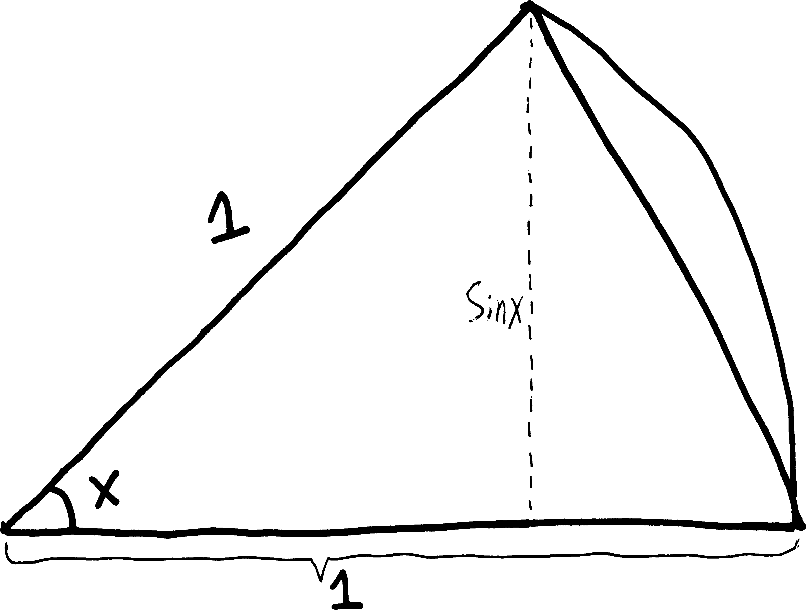
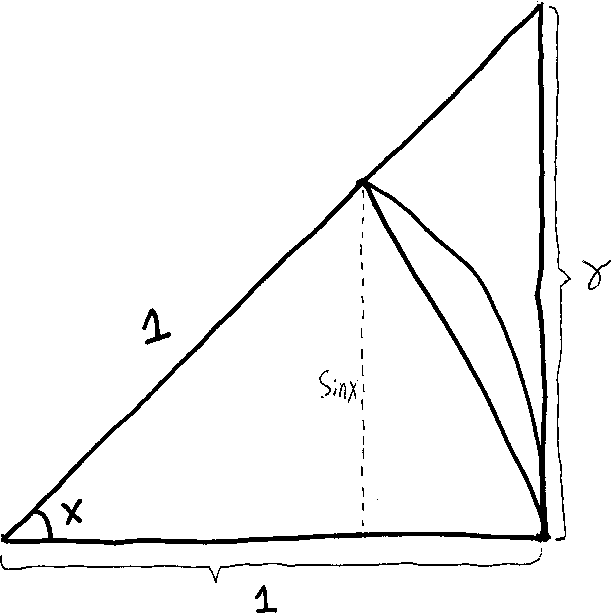
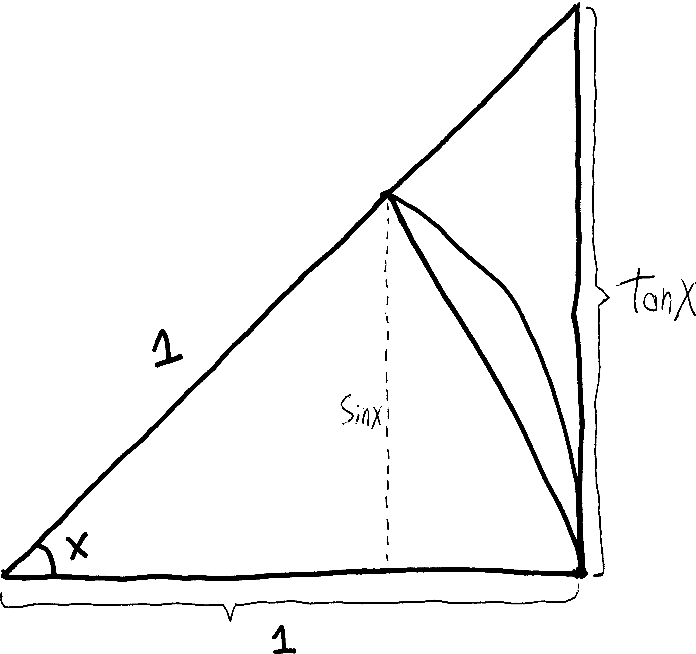

We have long suspected, based on the visuals alone, that the derivative of $\sin(x)$ looks kind of like $\cos(x)$ (potentially with a vertical expansion/compression):

{width=75%}

And I've assured you that, in fact, the derivative of $\sin(x)$ *is* $\cos(x)$. But how do we prove this? We tried to do this back in November^[see the original limits notes], but we ran into a stumbling block---one that caused us to trip and fall not onto the ground, but into a weird alternate universe of limits and epsilons and deltas and $h$'s going to zero. It gave us a whole new perspective---a fuller perspective---on what derivatives are.

Now that we're back in the main universe (the one that has derivatives), let's see if we can actually prove this to be true. (That is, let's see if we can see *why* this is true.) We want to calculate $\sin'(x)$, and since we have no other rules that we can apply (can't use the product rule, can't use the chain rule, etc.), we may as well start with first principles: plug it into Fermat's difference quotient.
$$\sin'(x) = \lim_{h\rightarrow 0}\left[ \frac{\sin(x+h) - \sin(x)}{h} \right]$$
But this looks kind of nasty. Unlike with, e.g., $x^2$, we can't "multiply out" the $\sin(x+h)$, or distribute it. It's certainly not equal to $\sin(x) + \sin(h)$. But we can simplify it using that formula we proved in trig:
$$\text{helpful formula: }\quad \sin(\alpha + \beta) =  \cos(\alpha)\sin(\beta) + \sin(\alpha)\cos(\beta)$$
If we apply that here, we'll get:
\begin{align*}
\sin'(x) &= \lim_{h\rightarrow 0}\left[ \frac{\sin(x+h) - \sin(x)}{h} \right]\\ \\
&= \lim_{h\rightarrow 0}\left[ \frac{\cos(x)\sin(h) + \sin(x)\cos(h) \quad-\quad \sin(x)}{h}\right]
\end{align*}
Which, if we do some rearranging, is:
\begin{align*}
&= \lim_{h\rightarrow 0}\left[ \frac{\cos(x)\sin(h)}{h} + \frac{\sin(x)\cos(h)- \sin(x)}{h}\right]\\
&= \lim_{h\rightarrow 0}\left[ \cos(x)\frac{\sin(h)}{h} + \sin(x)\frac{\cos(h)- 1}{h}\right]\\
&= \lim_{h\rightarrow 0}\left[ \cos(x)\frac{\sin(h)}{h} - \sin(x)\frac{ -\cos(h)+1}{h}\right] \quad\text{(factoring out a } -1)\\
&= \lim_{h\rightarrow 0}\left[ \cos(x)\frac{\sin(h)}{h} - \sin(x)\frac{1 - \cos(h)}{h}\right] \\
&= \lim_{h\rightarrow 0}\left[ \cos(x)\frac{\sin(h)}{h}\right] - \lim_{h\rightarrow 0}\left[\sin(x)\frac{1 - \cos(h)}{h}\right] \\
&= \cos(x)\cdot\lim_{h\rightarrow 0}\left[ \frac{\sin(h)}{h}\right] - \sin(x)\cdot\lim_{h\rightarrow 0}\left[\frac{1 - \cos(h)}{h}\right]
\end{align*}
So now we're basically at the place where we had to stop when we tried to do this in November. Because: what *are* these limits? It's not clear how we work out $\lim_{h\rightarrow 0} \sin(h)/h$ and $\lim_{h \rightarrow 0} (1-\cos h)/h$.
\begin{align*}
\lim_{h\rightarrow 0}\left[ \frac{\sin(h)}{h}\right] \quad&=\quad ??? \\ \\
\lim_{h \rightarrow 0}\left[ \frac{1-\cos h}{h}\right] \quad&=\quad ???
\end{align*}
If we simply plug $0$ in, we get $0/0$, for both of these. Each of these functions has a hole at $h=0$. So we need some way of finding the presumptive $y$-value of that hole---of finding what $\sin(0)/0$ *should* be, if it existed.

With rational functions, this is no big deal---we simply cancel out the offending/hole-creating factor, and then act as if it never existed. But we can't do that here, because sine and cosine aren't polynomials. So. Um. 

Geometry to the rescue! (I have this image of Mr. Austin swooping in with a cape.) We need to figure out what those two limits are. So we'll go on a bit of a tangent, and build some triangles. What we're going to do, in a sentence, is use geometry to build some algebraic relationships, and then use those to find our limit. We're going to construct an inequality that has $\sin(x)/x$ in the middle (like $\text{stuff} < \sin(x)/x < \text{more stuff}$), and then we're going to (more or less) crush $\sin(x)/x$ between the two things on the outside. We'll be able to find the limit as $h\rightarrow 0$ of both of the things on the outside---they'll both go to $1$---and since we know that $\sin(x)/x$ is always between them, we'll know that the limit as $h\rightarrow 0$ of $\sin(x)/x$ will be $1$, too. This is the general idea.

So. Imagine we draw a right triangle with an angle of $x$, legs of length $a$ and $b$, and hypotenuse of $1$:

{width=50%}
so then, just using trig, we know that 
$$\sin(x) = \frac{\text{opp}}{\text{hyp}} = \frac{a}{1} = a$$
and
$$\cos(x)= \frac{\text{adj}}{\text{hyp}} = \frac{b}{1} = b$$
So rather than using two new variables, $a$ and $b$, I can just label the legs with $\sin(x)$ and $\cos(x)$, since that's how long each of them are:

{width=50%}
The bottom side has length $\cos(x)$ and the right side has length $\sin(x)$. Then, what if I extend this to make a slightly bigger triangle? I'll extend the bottom side such that it's $1$ unit long and I no longer have a right triangle:

{width=50%}
(This triangle will be important. For reference, let's call this triangle "little triangle." Which might seem a bit odd, because it's *bigger* than the triangle we started with, but later in the proof we're going to make an even bigger triangle. So this is our "little one.")

Then, what if I imagine that the far right side of the triangle were not a straight line but a curvy arc---than instead of having a triangle, we have a wedge, a pizza slice, a fraction of a larger circle:

{width=50%}
This is another shape we'll refer to again. Let's call this wedge-shaped area our "pizza slice."

THEN, let's build another triangle! What if I turn this shape into a (larger) right triangle, like so:

{width=50%}
Let's call this the "big triangle." I've labelled the side opposite $x$ as $\gamma$, but we can write this solely in terms of $x$:
$$\tan(x) = \frac{\text{opp}}{\text{adj}} = \frac{\gamma}{1} = \gamma$$
So then rather than calling the far-right side $\gamma$, let's call it $\tan(x)$:

{width=50%}

Why are we doing all of this? We have three overlapping shapes: a small triangle, a pizza slice, and a big triangle. They're stacked on top of each other. We know that the little triangle is smaller than the pizza slice, and we know that the pizza slice is smaller than the big triangle. So we know:
$$\text{area of little triangle} < \text{area of pizza slice} < \text{area of big triangle}$$
But we also know what each of their areas are. The little triangle we know has a base of $1$, and a height of $\sin(x)$ (from what we started with), so we can find its area. The big triangle has a base of $1$, and a height of $\tan x$. And the pizza slice---well, we know that it's a slice out of a pizza with radius $1$, and so the entire pizza will have area $\pi\cdot(1)^2$. But it's only a percentage of the entire pizza. It's $x$ radians of the entire pizza, and the entire pizza has $2\pi$ radians. So the pizza slice's area will be $(\pi\cdot1^2)\cdot(x/\,2\pi)$. In summary:
\begin{align*}
\text{\bf area of little triangle} &= \frac{1}{2}\cdot \text{base}\cdot\text{height} = \frac{1}{2}\cdot1\cdot\sin x =\frac{1}{2}\sin x \\
\text{\bf area of pizza slice} & = \text{(area of full circle)}\cdot \text{(percentage of the circle it is)} = (\pi\cdot 1^2) \cdot\left(\frac{x}{2\pi}\right) = \frac{1}{2}x \\
\text{\bf area of big triangle} &= \frac{1}{2}\cdot\text{base}\cdot\text{height} = \frac{1}{2}\cdot1\cdot\tan x = \frac{1}{2}\tan x =  \frac{1}{2} \frac{\sin x}{\cos x}
\end{align*}
So because we know:
$$\text{area of little triangle} < \text{area of pizza slice} < \text{area of big triangle}$$
if we plug in the areas, we must have:
$$\frac{1}{2}\sin(x) < \frac{1}{2}x < \frac{1}{2} \frac{\sin x}{\cos x} $$
Let's clean this up a bit. We want to get $\sin(x)/x$ in the middle there, so that we can CRUSH it. If I get rid of the $1/2$s...
$$\sin x < x < \frac{\sin x}{\cos x} $$
and divide by $\sin(x)$...
$$\frac{\sin x }{\sin x} < \frac{x}{\sin x} < \frac{\sin x}{\cos x \sin x} $$
$$1 < \frac{x}{\sin x} < \frac{1}{\cos x} $$
and then take the reciprocal (which will flip the direction of the inequalities^[since (for example) $2<3$ and $\displaystyle \frac{1}{2}  > \frac{1}{3}$]):
$$\frac{1}{1} > \frac{\sin x}{x} > \frac{\cos x}{1} $$
$$1 > \frac{\sin x}{x} > \cos x $$
So I get a $\sin(x)/x$! This is the thing whose limit as $h\rightarrow 0$ we want to figure out. Here's the trick: we know that $\sin(x)/x$ is always between $1$ and $\cos x$. And we know what happens to $\cos x$ and $1$ as $x\rightarrow 0$. Both of them just become $1$. (Well, $1$ already is $1$):
\begin{align*}\cos(x) \,\, & \xrightarrow[\quad0 \quad]{x} \,\, 1\\
1 \,\, &\xrightarrow[\quad0 \quad]{x} \,\, 1\end{align*}
And since we know that $\sin(x)/x$ is always *between* $\cos(x)$ and $1$, then we know that $\sin(x)/x$ must also go to $1$ as well!! (Which, by the way, obviously tells us what $\displaystyle \lim_{h \rightarrow 0}\frac{\sin h}{h}$ is, since they're the same thing---just with the letter $h$ instead of the letter $x$.)
$$\lim_{h\rightarrow 0}\frac{\sin h}{h} = 1$$

That's kind of a cool technique. We don't know how to take the limit of $\sin(x)/x$ directly, so instead we take the limit of two of its best friends---friends that we know $\sin(x)/x$ *always* hangs out with. And since we know $\sin(x)/x$ is always hanging out with $1$ and $\cos(x)$, if we know where $1$ and $\cos x$ are, we know where $\sin(x)/x$ is.

This technique is an example of what is called the **sandwich theorem** (if you're a high school teacher), the **pinching theorem** (if you're a mathematician), or the **two policeman theorem** (if you're a Russian mathematician). Also sometimes the **squeeze theorem**. The idea is simple enough: if you put some mozzarella between two pieces of bread, and then press the two pieces of bread together and put it in your mouth, the mozzarella will go in your mouth, too. Or, put differently, if you get arrested, and there's one cop in front of you and one cop behind you, and the front cop walks to the precinct, and the rear cop walks to the precinct, you'll get walked to the precinct, too. (This assumes you are walking on a one-dimensional path; given the width of European streets, this is not an bad assumption.) Were we doing calculus totally rigorously (totally formally), we'd need to prove this theorem. But it's pretty intuitive, and for us limits are a tool, not an end, and to prove it requires some other fancy techniques that you don't know and that are sort of extraneous, so we won't prove it. But feel free to look it up online or in a book if you're curious.

So now we know what $\displaystyle \lim_{h \rightarrow 0}\frac{\sin h}{h}$ is. But our original formula for the derivative of $\sin(x)$ had two limits in it---not just $\displaystyle\lim_{h \rightarrow 0}\frac{\sin h}{h}$, but also $\displaystyle\lim_{h \rightarrow 0}\frac{1-\cos h}{h}$. So we need to figure that out, too. 

Unfortunately, the procedure isn't quite as interesting. All we need to do is a little bit of algebra to write it in a more convenient form, and then it'll be obvious what the limit is. First, the algebra:
\begin{align*}
\frac{1-\cos(x)}{x} &= \left( \frac{1-\cos(x)}{x}\right)\cdot \underbrace{\left( \frac{1+\cos x}{1+\cos x} \right)}_{=1} & \text{multiplying by } 1 \\
& = \frac{1-\cos^2(x)}{x(1+\cos x)}
\end{align*}
But because of the Pythagorean theorem from trig, we know that $\sin^2x + \cos^2x = 1$, and thus that $1-\cos^2(x)=\sin^2x$:
\begin{align*}
&= \frac{\sin^2(x)}{x(1+\cos x)} \\
&= \frac{\sin(x)\cdot\sin(x)}{x(1+\cos x)} \\
&= \frac{\sin(x)}{x}\cdot\frac{\sin(x)}{1+\cos x} \\
\end{align*}
So we know, then, how to rewrite $1-\cos(x)\,/\,x$:
$$\frac{1-\cos x}{x} =  \frac{\sin(x)}{x}\cdot\frac{\sin(x)}{1+\cos x}$$
But we also know that we can split limits up along multiplication, and we know how to take the limit of both of those things! We just found out that as $h\rightarrow 0$, $\sin(x)/x$ goes to $1$, and as $h\rightarrow 0$, $\sin(x)/(1+\cos x)$ should just go to $0/(1+1)$, or just $0$. 
\begin{align*}
\lim_{x \rightarrow 0}\left[ \frac{1-\cos x}{x} \right] &=  \lim_{x \rightarrow 0}\left[ \frac{\sin(x)}{x}\cdot\frac{\sin(x)}{1+\cos x} \right] \\
&=  \underbrace{\lim_{x \rightarrow 0}\left[ \frac{\sin(x)}{x}\right]}_{=1}\cdot \underbrace{\lim_{x\rightarrow 0}\left[\frac{\sin(x)}{1+\cos x}\right]}_{=0}  \\
& = 1\cdot 0 \\
&= 0
\end{align*}

So we've calculated both of the limits! We know:
$$\displaystyle \lim_{h \rightarrow 0}\frac{\sin h}{h} = 1Ê\quad\text{and}\quad \displaystyle\lim_{h \rightarrow 0}\frac{1-\cos h}{h} = 0$$

So with these limits both calculated, we can return to our original argument, and **finally prove that the derivative of sine is cosine**! When we left off, we had:
\begin{align*}
\sin'(x) &= \cos(x)\cdot\lim_{h\rightarrow 0}\left[ \frac{\sin(h)}{h}\right] - \sin(x)\cdot\lim_{h\rightarrow 0}\left[\frac{1 - \cos(h)}{h}\right]
\end{align*}
And if we plug in what we just found out about these limits...:
\begin{align*}
&= \cos(x)\cdot\underbrace{\lim_{h\rightarrow 0}\left[ \frac{\sin(h)}{h}\right]}_{=1} - \sin(x)\cdot\underbrace{\lim_{h\rightarrow 0}\left[\frac{1 - \cos(h)}{h}\right]}_{=0} \\
&= \cos(x)\!\cdot \!1\,- \,\sin(x)\!\cdot\!0 \\
&= \cos(x) \\ \\
& \includegraphics[scale=.5]{andrewproof.png}  
\end{align*}

##  Problem

Prove that:
$$\cos'(x) = -\sin(x)$$
There are a couple ways you could do this. One way would be to follow the method we used here---to plug $\cos(x)$ into the FDQ, do the trig addition identity, rearrange, and figure out the limits. You can probably get it just in terms of the two limits we evaluated here, so no need to do anything new to figure out what they are. Another way would be to first rewrite cosine using a trig identity, and *then* take its derivative. Try it both ways. Write them up nicely and turn it in.
