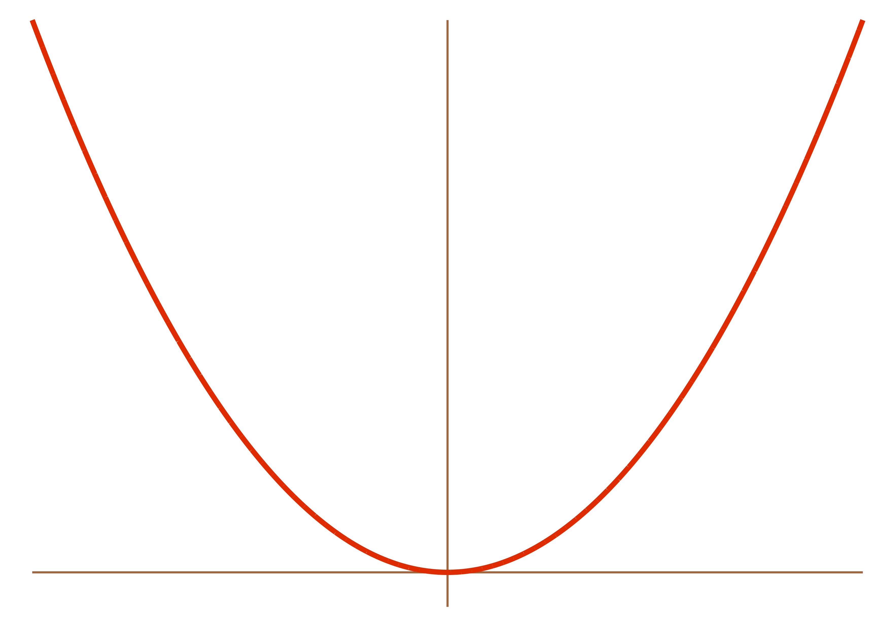
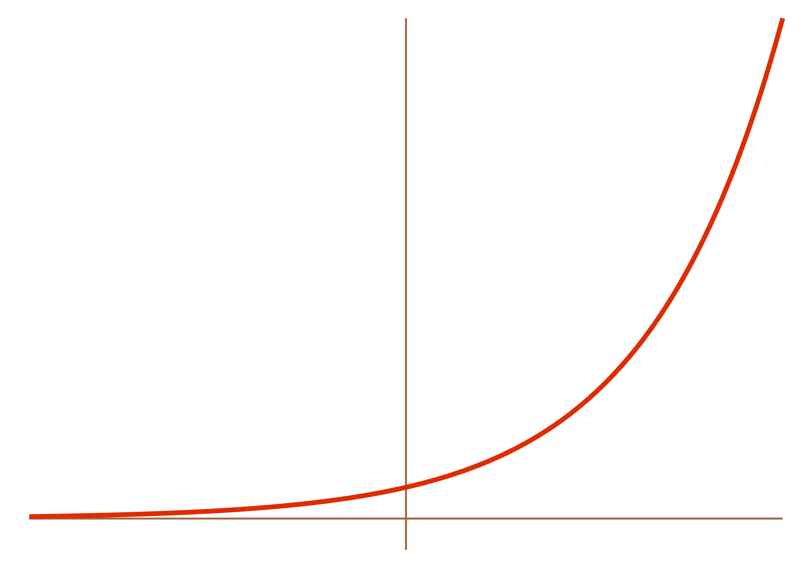

These are notes I originally wrote in 2009-2011 as part of my later-named <a href=http://www.andrusia.com/math>Adventures in Mathematics</a> curriculum while teaching in Phoenix. They were great for the time, but are distinctly earlier work, and haven't yet been rewritten in my current, deeper modes of mathematical storytelling. -Andrew

We know how to work with exponential functions. We know how to work with logarithms. But there are still two things we don't know:

<ul>
<li>What is the derivative of an exponential function?

$\left(\text{Answer: } \displaystyle \frac{d}{dx}(a^x) = \ln(a)\cdot a^x \,\right)$ </li>

<li> What is the derivative of a logarithm?

$\left(\text{Answer: } \displaystyle \frac{d}{dx}\log_a{x} = \frac{1}{x\ln(a)} \,\right)$ </li>
</ul>

In the rest of these notes, we'll derive these two identites (and more). It might seem like a lot of details, and a lot of proofs, but don't get bogged down in the formalism. All that is just details. Everything boils down to these two equations. All the stuff we already know about calculus, logarithms, and exponential functions still applies. This just gives us new toys to play with.

That said, you want to know *why* these two things are true, right? Let's go find out!

## The Derivative of an Exponential Function

What if we have an exponential function like $f(x) = a^x$, where $a$ is some greater-than-zero constant? What is its derivative?

We have no idea. This isn't a polynomial like $f(x) = x^a$. In that case, the *variable* is in the *base* and the *constant* is in the *exponent*. For example, $x^2$ and $2^x$ are very different functions:

<table>
        <tbody>
            <tr>
                <td>$$f(x) = x^2$$</td>
                <td>$$f(x) = 2^x$$</td>
            </tr>
            <tr>
                <td></td>
                <td></td>
            </tr>
        </tbody>
    </table>

We have long known what the derivative of something like $x^2$ is. But in this case---in the case of an exponential function like $2^x$---the base is a constant, and the exponent is a variable. We don't know how to find the derivative of that. And we don't really know where to begin in our search for the derivative of an exponential function, so let's get back to basics.

We know that the definition of the derivative is 
$$f'(x) = \lim_{h \to 0} \frac{f(x+h) - f(x)}{h}$$
(Ages ago we constructed this definition using Fermat's difference quotient.) Let's use this. If we use some general exponential function $f(x) = a^x$, then we have:

\begin{align*}
\frac{d}{dx}(a^x) &= \lim_{h \to 0} \frac{a^{x+h} - a^x}{h} \\
&= \lim_{h \to 0} \frac{a^xa^h - a^x}{h} \quad\quad\text{(properties of exponents)} \\ \\
&= \lim_{h \to 0} \frac{a^x(a^h - 1)}{h} \quad\quad \text{(factor out $a^x$)} \\
&= a^x \cdot \lim_{h \to 0} \frac{a^h - 1}{h} \quad\quad \text{(as $h \to 0$, $a^x$ doesn't change, so we can pull it out of the limit)}
\end{align*}

But where to go from here? We're kind of stuck with this nasty limit thing.

But... notice that $\displaystyle \lim_{h \to 0} \frac{a^h - 1}{h}$ is *constant* with respect to $x$. It's just a fixed number (for some fixed $a$). Hmm. For convenience, let's call it $L$. Then we have:

\begin{align*}
&= a^x \cdot \lim_{h \to 0} \frac{a^h - 1}{h} \\ \\
&= a^x \cdot L  \\ \\
&= L \cdot a^x 
\end{align*}

This is cool! This means that the derivative of any exponential function is just the function again times some constant $L$! Now, we have no idea how to actually compute $L$---it's a really scary-looking limit---but just be patient for a moment. Do you like taking derivatives? I do. If we take a whole bunch...

\begin{align*}
\frac{d}{dx}\left[a^x\right] &= L\cdot a^x  \\ \\
\frac{d^2}{dx^2}\left[a^x\right]  &= L^2\cdot a^x  \\ \\
\frac{d^3}{dx^3}\left[a^x\right]  &= L^3\cdot a^x  \\ \\
\frac{d^4}{dx^4}\left[a^x\right]  &= L^4\cdot a^x  \\ \\
\frac{d^5}{dx^5}\left[a^x\right]  &= L^5\cdot a^x  \\ \\
&\vdots
\end{align*}

The $L$'s keep piling up! What a mess. 

Anyway, back to what $L$ is. We don't really know how to compute it. $\displaystyle \lim_{h \to 0} \frac{a^h - 1}{h}$ is a total mess. We can't simplify it. But we *can* estimate it with a silicon slave. Don't worry too much about how we came up with these numbers---you could, for example, graph $(2^x -1)/x$, look at the graph, and see what value it gets close to as $x$ gets close to $0$---but, for example:
 <table>
        <thead>
            <tr>
                <th>$a$</th>
                <th>$\displaystyle \lim_{h \to 0} \frac{a^h - 1}{h}$</th>
                <th>$\displaystyle \frac{d}{dx}(a^x)$</th>
            </tr>
        </thead>
        <tbody>
            <tr>
                <td>$2$</td>
                <td>$0.693$</td>
                <td>$0.693\cdot2^x$</td>
            </tr>
            <tr>
                <td>$2.5$</td>
                <td>$0.916$</td>
                <td>$0.916\cdot2.5^x$</td>
            </tr>
            <tr>
                <td>$3$</td>
                <td>$1.098$</td>
                <td>$1.098\cdot3^x$</td>
            </tr>
            <tr>
                <td>$3.5$</td>
                <td>$1.252$</td>
                <td>$1.252\cdot3.5^x$</td>
            </tr>
        </tbody>
    </table>

And so forth. Anyway, here's an observation: if we could make $L = 1$---i.e., if we could find some number such that $\displaystyle \lim_{h \to 0} \frac{({\rm that \, number})^h - 1}{h} = 1$---we could have a function ***who is its own derivative!!!***^[Notice how I've anthropomorphized derivatives here.] **THAT WOULD BE AWESOME.** Question is, what is that number? Based on the examples, it must be between $2.5$ and $3$. If we estimate it more precisely, we get:

$$\text{that number} \approx 2.718281828459045...$$

Unfortunately, it's not something nice like an integer. It's an irrational, transcendental number that goes on forever, like $\pi$. Which I guess in some ways makes it more beautiful. 

Anyway---this is $e$! The base of all natural logarithms! "Euler's Number"^[$e$ roughly equals $2.7 \,\, 1828 \,\, 1828 \,\, 45 \,\, 90 \,\, 45$, which is easy to remember, because then it's just the year 1828, twice, and a 45-90-45 triangle. Of course, memorizing numbers like this is what gives math a bad name---math isn't about numbers and certainly not about memorizing long strings of them, etc. etc., but this * is* kind  of cool, and makes for a nice party trick.], after Leonhard Euler (1707--1783)! This is how we define $e$! It is the number such that $\frac{d}{dx}(e^x) = e^x$ (don't worry about the self-referentiality there). Like with $\pi$, which is the ratio of the circumference of a circle to its diameter, $e$ is the number whose exponential function is its own slope. It arises eerily out of mathematical nature.

So, to recap.  We know:

\begin{align*}
\frac{d}{dx}(a^x)  &= a^x \cdot \lim_{h \to 0} \frac{a^h - 1}{h}\quad\quad\text{(for any $a>0$)} \\ \\
\frac{d}{dx}(e^x) &= e^x \quad\quad \text{(for $e \approx 2.718...$)}
\end{align*}

Maybe we should also include the chain rule in these theorems---i.e., what if we want to raise a constant not just to $x$ but to some more complicated function of $x$? Then these two formulas follow directly from the chain rule:

\begin{align*}
frac{d}{dx}\left[a^{g(x)}\right] &= a^{g(x)} \cdot \lim_{h \to 0} \frac{a^h - 1}{h}\cdot g'(x)  \\ \\
\frac{d}{dx}\left[e^{g(x)}\right] &= e^{g(x)}\cdot g'(x)
\end{align*}

But we still have this nasty limit expression in our formula for the derivative of a general exponential function $a^x$. Is there a nicer way we can write the derivative of $a^x$? **Yes**. Let's do it.

## The Derivative of an Exponential (Way \#2)

Back when we started this unit, we showed that 
$$\frac{d}{dx}(a^x) = a^x \cdot \lim_{h \to 0} \frac{a^h - 1}{h}$$
But unless $a \approx 2.71828...$, this is a useless mess, because we have no idea how to compute this limit (i.e., approximate the number that it represents, as a decimal). So, let's see a new way to write this derivative, which will be in terms of a natural log.

### Theorem: $\displaystyle \frac{d}{dx}(a^x) = \ln(a) \cdot a^x$

### Proof:

Because of the laws of logarithms, we can write $a^x$ as $e^{\ln(a^x)}$, because $e^\text{stuff}$ and $\ln(\text{stuff})$ are inverse functions and will cancel each other out when composed. So then we can write $a^x$ as:
$$a^x = e^{\ln(a^x)}$$
And we can use laws of logarithms to simplify this even further. We can pull the exponent $x$ out and have:
$$a^x = e^{x\ln(a)}$$
If we differentiate this equation, we get:
\begin{align*}
\frac{d}{dx}\left[a^x\right] &= \frac{d}{dx}\left[ e^{x\ln(a)}\right]
\end{align*}
But we already know how to take the derivative of $e^{x\ln a}$. It looks like $e^{g(x)}$, and we've figured out how to differentiate that. Because of the chain rule, we must have:
\begin{align*}
&= e^{x\ln(a)}\cdot\frac{d}{dx}\left[ x\ln(a)\right] \\
\end{align*}
What's the derivative of $x\ln(a)$? Well, $\ln(a)$ is just a constant---it's a number, like $5$ or $\pi$ or three-sevenths. So the derivative of $x\ln(a)$ must just be $\ln(a)$ (in the same way that the derivative of $5x$ is $5$).
\begin{align*}
&= e^{x\ln(a)} \cdot \ln(a)
\end{align*}
And we already know that another way to write $e^{x\ln a}$ is $a^x$:
\begin{align*}
&= a^x\cdot \ln(a) \\
&= \ln(a)\cdot a^x \\
& \includegraphics[scale=.25]{andrewproof.png}
\end{align*}

### For example...

* $\displaystyle \frac{d}{dx}(7^x) = \ln(7) \cdot 7^x$
* $\displaystyle \frac{d}{dx}\left( e^{5x}\right) = e^{5x}\cdot\frac{d}{dx}(5x) = 5e^{5x}$
* $\displaystyle \frac{d}{dx}\left(5^{x^3}\right) = \ln(5) \cdot 5^{x^3} \cdot 3x^2$ (by the chain rule)
* $\displaystyle \frac{d}{dx}\left((3\pi)^{2x+1}\right) = \ln(3\pi) \cdot (3\pi)^{2x+1} \cdot 2$ (chain rule again)

### Note

What if we have $\frac{d}{dx}(e^x)$? This must just be $\ln(e) \cdot e^x$, but since $\ln(e) = \log_{e}(e^1) = 1$, we must have:$$\frac{d}{dx}(e^x) = \ln(e) \cdot e^x = 1 \cdot e^x = e^x$$Which we already knew. So thankfully, this is consistent.

### Corollary

Notice how we needed to use the chain rule in that last example. Might it not be nice to come up with a version of this theorem that has a built-in chain rule? To wit: 

$$\frac{d}{dx}(a^{g(x)}) = \ln(a)\cdot a^{g(x)} \cdot g'(x)$$ (where $g(x)$ is any function of $x$)

**Proof**: Do it yourself! It's basically the same as the proof we just did, but with $g(x)$ instead of $x$. Or---even more easily---it's just the last theorem, but with an application of the chain rule. 

### Another note

From before, we know $\frac{d}{dx}(a^x) = \lim_{h \to 0} \frac{a^h - 1}{h} \cdot a^x$

And now, we know & $\frac{d}{dx}(a^x) = \ln(a) \cdot a^x$ 

Then... these are just two different ways of writing the same derivative, so they must be equal. But then $\lim_{h \to 0} \frac{a^h - 1}{h}$ and $\ln(a)$ must be equal! Or:
$$ \lim_{h \to 0} \frac{a^h - 1}{h} = \ln(a) $$
Which is totally crazy and counterintuitive and doesn't at all make visceral sense. Just by thinking about how limits work, or by thinking about how logarithms work, you would not at all expect these two things to be equal. But they are. We've proved it. This is, in a sense, one of the real powers of math---we are not constrained simply to what we *feel* is true, or think *should* be true. We can use logic to discover new truths, or even truths that contradict our innate, not-neccesarily-rational beliefs.

Of course, I am talking about mathematical truths. In a sense, it is much easier to discover truth in mathematics than truth in reality (whatever that is). In math, we start with explicit axioms and rules of logical inference; mathematical truths are only true relative to these axioms. They are not true in any universal, structure--of--the--cosmos sort of way^[Or are they? Would aliens on Alpha Centurai come up with an equivalent set of mathematical axioms, and thus an equivalent mathematics? We can use different axioms and create different mathematical structures---does math reflect reality? is it part of it? or is it just an awesome game?].

Anyway, back to logs. I have no idea when you would need to calculate $\lim_{h \to 0} \frac{a^h - 1}{h}$, but if you did, you could use this formula: \medskip

### For example...

* $\displaystyle\lim_{h \to 0} \frac{2^h - 1}{h} = \ln(2) \approx 0.693\dots$
* $\displaystyle\lim_{t \to 0} \frac{\pi^t - 1}{t} = \ln(\pi) \approx 1.1447\dots$
* $\displaystyle\lim_{h \to 0} \frac{{f(x)}^h - 1}{h} = \ln(f(x))$

## The Derivative of a Logarithm

This is tricky. We have no rule that will help us take the derivative of a log. What if we go back to basics and use the definition of a derivative?  This, after all, is whence all of our other derivative laws came (e.g., $\frac{d}{dx} x^n = nx^{n-1}$), and it's how we came up with the derivative of $a^x$. 

So let's try that. Given a function $f(x)$, the derivative is $\displaystyle  \lim_{h \to 0} \frac{f(x+h) - f(x)}{h}$. So if $f(x) = \log_k(x)$...
$$\frac{d}{dx}(\log_k(x)) = \lim_{h \to 0} \frac{\log_k(x+h) - \log_k(x)}{h}$$
Maybe we could rewrite this using laws  of logs:
$$\frac{d}{dx}(\log_k(x)) = \lim_{h \to 0}\left[ \frac{1}{h} \log_k\left(\frac{x+h}{x}\right)\right]$$
And maybe split the fraction up:
$$\frac{d}{dx}(\log_k(x)) = \lim_{h \to 0}\left[ \frac{1}{h} \log_k\left(1 +\frac{h}{x}\right)\right]$$
But where do we go from here? We can't do much more to simplify this. Uh. Darn. We'll need to use another method.

## The Derivative of a Logarithm (Second Attempt)

What else do we know about logarithms? We know they're cool. We also know that, by definition, they cancel out with exponentials upon composition: $$\log_k(k^x) = x \hspace{1cm}\text{and}\hspace{1cm} k^{\log_k(x)} = x$$
What if we try to take the derivative of that equation on the right? It has a log in it, but more importantly, it has an exponential---and we already know how to take the derivative of those.

\begin{align*}
\frac{d}{dx}\left[k^{\log_k(x)}\right] &=  \frac{d}{dx}(x) \quad\quad\text{(taking derivative of both sides)} \\ \\
\frac{d}{dx}\left[k^{\log_k(x)}\right] &=  1 \quad\quad\text{($d/dx(x) = 1$)} \\
k^{\log_k(x)}\cdot\ln(k)\cdot\frac{d}{dx}\left[\log_k(x)\right] &=1 \quad\quad\text{(derivative of exponential---derivative of exponent comes out by chain rule)}  \\
\frac{d}{dx}\left[\log_k(x)\right] &=  \frac{1}{k^{\log_k(x)}\cdot\ln(k)} \quad\quad\text{(dividing by $k^{\log_k(x)}\cdot\ln(k))$}  \\
\frac{d}{dx}\left[\log_k(x)\right] &=  \frac{1}{x\cdot\ln(k)} \quad\quad \text{(and we already know that $k^{\log_k(x)}=x$)} \\
& \includegraphics[scale=.25]{andrewproof.png}
\end{align*}

Yay! Now we know how to take the derivative of a logarithm!!

## For example...

* $\displaystyle \frac{d}{dx}(\log_7(x)) = \frac{1}{x \ln(7)}$
* $\displaystyle \frac{d}{dx}(\ln(x)) = \frac{d}{dx}(\log_e(x)) = \frac{1}{x \ln(e) } = \frac{1}{x}$
* $\displaystyle \frac{d}{dx}[ \log_9(x^5) ] = \frac{1}{x^5 \ln(9) } \cdot 5x^4 = \frac{5}{x \ln(9)}$

## Corollary

Notice how we needed to use the chain rule in that last example. Perhaps we could come up with a formula for the derivative of a logarithm that has a built-in chain rule?

Imagine we have a logarithm base $a$ and some function $g(x)$. Then:
$$\frac{d}{dx}\left[\log_a(\,g(x)\,)\right] = \frac{1}{g(x) \ln(a)} \cdot g'(x)$$

**Proof**: You can do it yourself! It's basically the same as the proof we just did, but with $g(x)$ instead of $x$. 

## The Derivative of an Inverse Function

Note that in order to take the derivative of a log, we used the property that logs and their inverses (exponentials) cancel out when we put them inside of each other. This is, of course, true about any pair of inverse functions---it's the very *definition* of an inverse function. So the cool thing is, then, that we can use the same method to figure out the derivative of a logarithm to figure out the derivative of *any* inverse function (at least in terms of some other stuff).

### Theorem:

$\displaystyle \underbrace{f^{\text{inv}'}(x)}_{\mathclap{\text{derivative of the inverse}}} = \frac{1}{f'( \, f^\text{inv}(x) \, )}$

### For example...

$f(x) = x^3$ and $f^\text{inv}(x) = \sqrt[3]{x}$ are inverses. And we know $f'(x) = 3x^2$. So by  this theorem, 

$$f^{\text{inv}'}(x) = \frac{1}{f'( \sqrt[3]{x} )} = \frac{1}{3( \sqrt[3]{x} )^2} = \frac{1}{3(x^{1/3})^2} = \frac{1}{x^{2/3}} = \frac{1}{3} x^{-2/3}$$

Of course, we already knew this---we know how to differentiate $\sqrt[3]{x}$ the normal way. (Just write it like $x^{1/3}$ and use the power rule.) This is just another way to do it.

**Proof**:
By the definition of an inverse function, we must have
$$f( \, f^\text{inv}(x) \,) = x$$
So if we differentiate both sides:
$$\frac{d}{dx}\left[f( \, f^\text{inv}(x) \,)\right] = \frac{d}{dx}(x)$$
Which is just:
$$\frac{d}{dx}\left[f( \, f^\text{inv}(x) \,)\right] = 1$$
But on the left, we have the derivative of a function inside another function... which requires, like, THE CHAIN RULE! So if we use the chain rule we'll get:
$$f'\left( \, f^\text{inv}(x) \,\right)\cdot f^{\text{inv}'}(x) = 1$$
But we can just use algebra to rearrange this:
$$f^{\text{inv}'}(x) = \frac{1}{f'( \, f^\text{inv}(x) \,)}$$
$$ \includegraphics[scale=.25]{andrewproof.png} $$

Whee!

### Another example

$f(x) = \sin(x)$ and $f^\text{inv}(x) = \sin^\text{inv}(x)$ are inverses. And $\frac{d}{dx}(\sin x) = \cos(x)$. So then the derivative of $\sin^\text{inv}(x)$ is...
$$\left(\, \sin^\text{inv}(x)\,\right)' = \frac{1}{\cos(\sin^\text{inv}(x))}$$

## The Derivative of $x^x$

We know how to take the derivative of a variable raised to a constant: $\displaystyle \frac{d}{dx}(x^a) = ax^{a-1}$ \medskip \medskip

We know how to take the derivative of a constant raised to a variable: $\displaystyle \frac{d}{dx}(a^x) = \ln(a) a^x$\medskip \medskip

But how do we take the derivative of a variable raised to a variable??? $\displaystyle \frac{d}{dx}(x^x) = \,????$\medskip \medskip

(By the way, what is the derivative of a constant raised to a constant?)

### Theorem: $\displaystyle \frac{d}{dx}(x^x) = x^x(1 + \ln(x))$

### Proof: 

By properties of logarithms, we can write $x^x$ as $e^{\ln(x^x)}$:
$$x^x = e^{\ln(x^x)}$$
Which we can simplify by using another property of logs:
$$x^x = e^{x \ln(x)} \hspace{1cm} (*)$$
We'll use this equation again, so let's label it as $*$. If we differentiate with respect to $x$:
$$\frac{d}{dx}(x^x) = \frac{d}{dx}(e^{x\ln(x)})$$
But we know how to take the derivative of $e^\text{stuff}$:
$$\frac{d}{dx}(x^x) = e^{x\ln(x)} \cdot \underbrace{\frac{d}{dx}(x \ln(x))}_\text{by chain rule}$$
Using the product rule, we get:
\begin{align*}
\frac{d}{dx}(x^x) &= e^{x\ln(x)} \cdot \left(x \frac{d}{dx}(\ln x) + \ln x \frac{d}{dx}(x) \, \right) \\
& = e^{x\ln(x)} \cdot \left(x \cdot \frac{1}{x} + \ln (x)  \cdot 1 \, \right) \\
&= e^{x\ln(x)} \cdot (1 + \ln x )
\end{align*}
Almost there! By the identity we proved back in $*$, we can write $e^{x \ln x}$ as $x^x$, so this becomes:
$$\frac{d}{dx}(x^x) = x^x(1 + \ln x )$$ 
$$\includegraphics[scale=.25]{andrewproof.png}$$

### For example...

* $\displaystyle \frac{d}{dt}(t^t) = t^t(1 + \ln t )$ \medskip\medskip
* $\displaystyle \frac{d}{dx}((x^2)^{x^2}) = (x^2)^{x^2}(1 + \ln (x^2) ) \cdot \underbrace{2x}_{\mathclap{\text{chain rule}}}$\medskip\medskip
* $\displaystyle \frac{d}{d \theta}((\sin \theta)^{\sin \theta)}) = (\sin \theta)^{(\sin \theta)}(1 + \ln (\sin \theta) ) \cdot \cos \theta$ (chain rule again) 

BUT. This formula only tells us how to find the derivative of a variable raised to itself. What if we want, say, to find the derivative of $(3x + 2)^{\sin x}$? More generally, what if we want to find the derivative of one function of $x$ raised to another function of $x$? 

### Theorem: $\displaystyle \frac{d}{dx}\left[g(x)^{h(x)}\right] = g(x)^{h(x)}\cdot \frac{d}{dx}\left[h(x) \ln (g(x)) \right]$

### Proof

This is basically the same as the proof of $\frac{d}{dx}(x^x)$, but with arbitrary functions (i.e., with $f(x)$ instead of $x$). By laws of logarithms, we know:$$g(x)^{h(x)} = e^{\ln\left(g(x)^{h(x)}\right)}$$

Also by log laws: $$g(x)^{h(x)} = e^{h(x) \ln(g(x))}\hspace{1cm}(**)$$
differentiating... $$\frac{d}{dx}\left[ g(x)^{h(x)} \right]  = \frac{d}{dx}\left[e^{h(x) \ln(g(x))}\right]$$
which is: $$\frac{d}{dx}\left[ g(x)^{h(x)} \right]  = e^{h(x) \ln(g(x))} \cdot \frac{d}{dx}\left[h(x) \ln(\,g(x)\,) \right]$$
But we already know that $e^{h(x) \ln(g(x))} = g(x)^{h(x)}$ (from $**$). So: 
$$\frac{d}{dx}\left(g(x)^{h(x)}\right) = g(x)^{h(x)} \cdot \frac{d}{dx}\left(h(x) \ln(g(x) \right) $$
$$\includegraphics[scale=.25]{andrewproof.png}$$

### For example...

* $\frac{d}{dx}\left( (x^2)^{\sin x} \right) = (x^2)^{\sin x} \cdot \frac{d}{dx}(\sin x \cdot \ln(x^2) )$

\hspace{2cm}$\displaystyle = (x^2)^{\sin x} \cdot \left(\cos x \cdot \ln(x^2) + \sin(x) \cdot \frac{1}{x^2} \cdot 2x\right)$ (product rule)

\hspace{2cm}$\displaystyle = (x^2)^{\sin x} \cdot \left(\cos x \cdot \ln(x^2) + \sin(x) \cdot \frac{2}{x}\right)$

\hspace{2cm}$\displaystyle = (x^2)^{\sin x} \cdot \left(2\cos(x)\ln(x) + \frac{2\sin(x)}{x} \right)$

* $\frac{d}{dx}[ (8x + 4)^{x^3} ] = (8x + 4)^{x^3} \cdot \frac{d}{dx}(x^3 \ln(8x + 4) )$

\hspace{2.3cm}$\displaystyle = (8x + 4)^{x^3} \cdot \left(3x^2 \ln(8x + 4) + x^3 \cdot \frac{1}{8x + 4} \cdot 8 \right)$ (product rule)

\hspace{2.3cm}$\displaystyle = (8x + 4)^{x^3} \cdot \left(3x^2 \ln(8x + 4) + \frac{8x^3}{8x + 4} \right)$ (simplification)

\hspace{2.3cm}$\displaystyle = (8x + 4)^{x^3} \cdot \left(3x^2 \ln(8x + 4) + \frac{2x^3}{2x + 1} \right)$ (simplification)

## An Awesome Proof of Why $\displaystyle \left( x^n\right)' = nx^{n-1}$

We've already proven that the derivative of $x^n$ is $nx^{n-1}$... sort of. Our proof, which was rather excruciating and involved huge amounts of writing, only actually worked for $n$ being some positive integer. Some of you, for an extra credit problem, proved it for $n$ being a negative integer. But this still leaves out large numbers of numbers: what if $n$ is a rational number? for example, what if we want to take the derivative of $x^{1/2}$? what if $n$ is a real number? what if we want to take the derivative of $x^\pi$? 

As it turns out, the $(x^n)'=nx^{n-1}$ law {\em is} true if $n$ is any real number (and not just an integer or a rational number). And, as it turns out, there's a very simple and very clean proof. It doesn't take any of the pain that our proof that only worked for natural numbers did; in fact, it doesn't even use Fermat's difference quotient. It simply relies of the derivatives of logs, exponentials, and the chain rule.

The basic idea is that if we have $x^n$, then we can rewrite it as $e^{\ln(x^n)}$, just using properties of logs---the $e^\text{stuff}$ and $\ln(\text{stuff})$ will cancel out. But then using a different property of logs---the one about how you can pull exponents down---you can rewrite it as $e^{n\ln(x)}$. (That works for any real number $n$.) And {\em then} we know how to take its derivative!

\begin{align*}
\frac{d}{dx}\left[x^n\right] &= \frac{d}{dx}\left[ e^{\ln(x^n)}\right] &\text{properties of logs} \\
&= \frac{d}{dx}\left[ e^{n\ln(x)}\right] &\text{another property of logs}\\
&= e^{n\ln(x)}\cdot\frac{d}{dx}\left[ n\ln(x)\right] &\text{chain rule}\\ 
&= e^{n\ln(x)}\cdot n\cdot\frac{1}{x}
\end{align*}
But now we can rewrite $e^{n\ln(x)}$, since we know that's just equal to $e^{\ln(x^n)}$, or just $x^n$:
\begin{align*}
&= x^n\cdot n\cdot\frac{1}{x} \\ 
&= \frac{nx^n}{x} \\
&= nx^{n-1} \\
&\includegraphics[scale=.25]{andrewproof.png}
\end{align*}

## One Last Question (or two)

What is the derivative of $x^{x^x}$? What about of $g(x)^{h(x)^{j(x)}}$? Remember how we can make "iterated sums" with a giant $\Sigma$ and "iterated products" with a giant $\Pi$? Can we make an "iterated exponentiation" function, like $\displaystyle {\rm Power}^n(x) = \underbrace{x^{x^{x^{\cdots ^x}}}}_{n \text{ times}}$? What is its derivative? 

One thing to be careful with is that---unlike with addition/subtraction and multiplication/division---exponentiation is not commutative: $a^b \neq b^a$, or, in calculator notation, $a\wedge b \neq b\wedge a$. (For example, $2^5 \neq 5^2$.) Likewise, it's not associative: $a\wedge(b \wedge c)\neq (a\wedge b)\wedge c$. So if you have a teetering tower of things being exponentiated, you need to be clear where your parentheses are---the function $x^{(x^2)}$ isn't the same as the function $(x^x)^2$.

## Actually, I Have Another Question

Throughout these notes, we've dealt exclusively with logarithms which bases^[Note my use of "which" as a posessive relative pronoun. Certainly I couldn't say "whose base," since logarithms are inanimate, and while I could sound mildly pretentious and say "the base of which," I discovered (in the midst of a David Foster Wallace essay)(he used it in this way) that "which" used to be used in this way. I've since seen it once or twice in early 20th century/late 19th century English books.] are constants. The natural log ($\ln$) has base $e$; the $\log_7$ has base $7$, $\log_k$ (which I use in proofs a lot) has a base of constant $k$. 

But logarithms only exist as inverses of exponential functions. Usually we talk about exponential functions which bases are constants---$e^x$, $7^x$, $k^x$. Sometimes we raise them to things that are more complicated than just $x$: $e^{\sin x}$, $7^{x^2}$, $k^{\log_k(5)}$. But there's no reason why we couldn't exponentiate them by something more complicated than a constant. There's no reason why the base has to be constant. What's wrong with the function $(\sin(x))^x$? What's wrong with $(x^2+5x^3)^{\cos x}$? Absolutely nothing! We can take functions and raise them to other functions.

So, ultimately my question is "what is the derivative of the log base $f(x)$ of $g(x)$"?
$$\frac{d}{dx}\left[ \log_{f(x)}(g(x))\right] = \quad???$$
But to answer this question, we need to first ask the question: "what is a log base $f(x)$ of $g(x)$"?? Meaning: we've never seriously dealt with logarithms which bases are arbitrary functions and not constants. We've only seen them once in passing. On the logs quiz back in October (September?), I asked you:
$$\log_{a^3b^4}{\left(\frac{b^{-12}}{(\sqrt[4]{a^3})^{12}}\right)} = \quad???$$
Many of you were able to fiddle with this and get:
$$\log_{a^3b^4}{\left(\frac{b^{-12}}{(\sqrt[4]{a^3})^{12}}\right)} = \log_{a^3b^4}{\left(\left(a^3b^4\right)^{-3}\right)} = -3$$
But we don't have a general theory of how logs to a variable base behave. We don't have a list of properties of logs-base-$f(x)$; we only have a list of properties of logs-base-$k$ (where $k$ is some constant). Before we start doing calculus with logs-base-$f(x)$, we really ought to know how to do algebra^[I use this word loosely. Mathematicians, please don't quibble.] with logs-base-$f(x)$. (It might or might not be necessary as a prerequisite for calculus; if nothing else, it would probably be interesting.)

I have no idea what such a theory would be; I haven't thought about it very much. But I suppose I would start by thinking about general properties of exponential functions with variable bases. If we understand how things like $f(x)=g(x)^{h(x)}$ behave; maybe we can start thinking about how $f^\text{inv}(x)$ must behave.

## Problems

Differentiate the following functions, with respect to $x$, $\theta$, $t$, etc., as appropriate. (As is my usual convention, $a$, $b$, $c$, $k$, and $n$ represent constants.)

<ol class='problems'>
<li> $y = e^x$ </li>
<li> $y = e^{100x}$ </li>
<li> $y = e^{2x/3}$ </li>
<li> $y = e^{-4x/5}$ </li>
<li> $y = e^{x + \sqrt{2}}$ </li>
<li> $y = e^{x - \pi}$ </li>
<li> $y = e^{3x^2}$ </li>
<li> $y = e^{-x^2}$ </li>
<li> $y = e^{5t^2 - 7t}$ </li>
<li> $y = e^{4t + t^2}$ </li>
<li> $y = e^{\sin x}$ </li>
<li> $y = 2e^{\tan\theta}$ </li>
<li> $y = 7e^{\frac{1}{\cos4\theta}}$ </li>
<li> $y = (e^{x^2} + 1)^2$ </li>
<li> $y = (e^{2x} - e^{-2x})^2$ </li>
<li> $y = e^{\sqrt{x}}\ln(\sqrt{x})$ </li>
<li> $y = e^{2\ln(x)}$ </li>
<li> $y = e^{x/\ln(x)}$ </li>
<li> $y = e^{2x^2 - x}$ </li>
<li> $y = e^{x^3\ln(x)}$ </li>
<li> $y = xe^x$ </li>
<li> $y = -3te^t$ </li>
<li> $y = xe^x - e^x$ </li>
<li> $y = (1+2x)e^{-2x}$ </li>
<li> $y = (6x^2 + 6x + 3)e^{2x}$ </li>
<li> $y = (9x^2 - 6x + 2)e^{3x}$ </li>
<li> $y = 2te^{\sqrt{t}}$ </li>
<li> $y = t^2e^{2/t}$ </li>
<li> $y = x^2e^x - xe^{x^2}$ </li>
<li> $\displaystyle y = \frac{e^x}{e^{-x} + 1}$ </li>
<li> $\displaystyle y = \frac{e^{-x}}{e^x + 1}$ </li>
<li> $y = (\cos(\theta) - 1)e^{\cos\theta}$ </li>
<li> $y = (\sin(\theta) - 1)e^{\sin\theta}$ </li>
<li> $\displaystyle y = \frac{e^t}{2}(\sin t + \cos t)$ </li>
<li> $\displaystyle y = \frac{e^{-t}}{2}(\sin t - \cos t)$ </li>
<li> $\displaystyle y = \frac{e^{-x}}{5}(2\sin(2x) - \cos(2x)$ </li>
<li> $\displaystyle y = \frac{e^{2x}}{13}(2\sin(3x) - 3\cos(3x)$ </li>
<li> $\displaystyle y = \frac{ax - 1}{a^2}e^{ax}$ </li>
<li> $\displaystyle y = \frac{ax +1}{a^2}e^{-ax}$ </li>
<li> $\displaystyle y = \frac{e^{2\theta}}{e^{2\theta} + 1}$ </li>
<li> $\displaystyle y = \frac{e^\theta}{1 - e^{2\theta}}$ </li>
<li> $\displaystyle y = \ln(\cos e^{2x})$ </li>
<li> $y = a^x$ </li>
<li> $y = 2^x$ </li>
<li> $y = 8^x$ </li>
<li> $y = 3^{-x}$ </li>
<li> $y = 9^{-x}$ </li>
<li> $y = 5^{\sqrt{x}}$ </li>
<li> $\displaystyle y = 2^{s^2}$ </li>
<li> $\displaystyle y = 7^{\frac{1}{\cos \theta}}\ln(7)$ </li>
<li> $\displaystyle y = 3^{\tan\theta}\ln(3)$ </li>
<li> $y = 2^{\sin(3t)}$ </li>
<li> $y = 5^{-\cos(2t)}$ </li>
<li> $y = \ln(x)$ </li>
<li> $y = \ln(5x)$ </li>
<li> $y = \ln(x/5)$ </li>
<li> $y = \ln(t^2)$ </li>
<li> $y = \ln(t^{3/2})$ </li>
<li> $y = \ln(3/x)$ </li>
<li> $y = \ln(10/x)$ </li>
<li> $y = \ln(x^3 + 1)$ </li>
<li> $y = \ln(x^2 + 3x + \pi)$ </li>
<li> $y = x^2\ln(x)$ </li>
<li> $y = \ln(\, (x+1)^x\,)$ </li>
<li> $y = \ln(\sqrt{1 + x^2})$ </li>
<li> $y = \ln(\sqrt[4]{x^2 + 1})$ </li>
<li> $y = \ln(\theta + 1)$ </li>
<li> $y = \ln(2\theta + 2)$ </li>
<li> $y = \frac{x^4}{4}\ln(x) - \frac{x^4}{16}$ </li>
<li> $y = \frac{x^3}{3}\ln(x) - \frac{x^3}{9}$ </li>
<li> $y = x^2\ln x + (\ln x)^3$ </li>
<li> $y = (\ln x)^3$ </li>
<li> $y = \ln(\ln x)$ </li>
<li> $y = 1/(\ln x)$ </li>
<li> $y = t(\ln t)^2$ </li>
<li> $y = t\sqrt{\ln(t)}$ </li>
<li> $\displaystyle y = \frac{\ln(t)}{t}$ </li>
<li> $\displaystyle y = \frac{1 + \ln(t)}{t}$ </li>
<li> $\displaystyle y = \frac{\ln x}{a + \ln x}$ </li>
<li> $\displaystyle y = \frac{x\ln(x)}{1 + \ln(x)}$ </li>
<li> $y = \ln(3te^{-t})$ </li>
<li> $y = \ln(2e^{-t}\sin t)$ </li>
<li> $y = (2x + 1)^2\ln(2x + 1)$ </li>
<li> $\displaystyle y = \frac{\ln x}{x^2\ln(x^2)} + \left( \ln\frac{1}{x}\right)^3$ </li>
<li> $y = \ln\left( x + \sqrt{x^2 + 1}\right)$ </li>
<li> $\displaystyle y = \ln \left(\frac{x+2}{x^3 -1}\right)$ </li>
<li> $\displaystyle y = \ln \left(\frac{e^\theta}{1 + e^\theta}\right)$ </li>
<li> $\displaystyle y = \ln \left(\frac{\sqrt{\theta}}{1 + \sqrt{\theta}}\right)$ </li>
<li> $\displaystyle y = \ln\left(\frac{1}{\sin(\theta)} + \frac{\cos \theta}{\sin \theta}\right)$ </li>
<li> $y = \sin(\ln x)$ </li>
<li> $y = \cos(\ln x)$ </li>
<li> $y = \log_2(5\theta)$ </li>
<li> $y = \log_3(1 + \theta \ln(3))$ </li>
<li> $y = \log_4(x) + \log_4(x^2)$ </li>
<li> $y = \log_{25}(e^x) - \log_5(\sqrt{x})$ </li>
<li> $y =\log_2(r) \cdot \log_4(r)$ </li>
<li> $y = \log_3\left( \left(\frac{x + 1}{x - 1}\right)^{\ln3}\right)$ </li>
<li> $y = \log_5\left( \sqrt{\left(\frac{7x}{3x + 2}\right)^{\ln 5}} \right)$ </li>
<li> $y = 10^{x^2} + (x^2)^{10}$ </li>
<li> $y = (\sin x)^2 + 2^{\sin x}$ </li>
<li> $y = x^2$ </li>
<li> $y = x^{\ln(2)}$ </li>
<li> $y = t^{1 - e}$ </li>
<li> $y = (\cos\theta)^{\sqrt{2}}$ </li>
<li> $y = (\ln\theta)^\pi$ </li>
<li> $y = (x^2 + 1)^{\ln x}$ </li>
<li> $y = (x + 1)^x$ </li>
<li> $y = x^{x+1}$ </li>
<li> $y = (\sqrt{t})^t$ </li>
<li> $y = t^{\sqrt{t}}$ </li>
<li> $y = (\sin x)^x$ </li>
<li> $y = x^{\sin x)}$ </li>
<li> $y = (\ln x^2)^{2x + 3}$ </li>
</ol>

<ol class='problems'>
<li>Consider the graphs of $f(x) = x^ke^{-x}$, where $k$ is some positive constant. What do they look like (for varying values of $k$)? As $x \rightarrow \infty$, $f(x) \rightarrow$ ? Also: $f(x)$ has a maximum between $x=0$ and $\infty$. What are its coordinates?</li>
<li> The equation $x^2 = 2^x$ has three solutions\footnote{``Solutions'' just means ``values of $x$ for which the equation is true;'' in this case, values of $x$ for which $x^2$ is the same as $2^x$.}: one at $x=2$, one at $x=4$, and one elsewhere. Use a calc***tor to estimate it as a decimal.</li>
<li>Find the $n$th derivative of a) $y = e^{ax}$ (where $a$ is some positive constant), and b) $y = e^{-ax}$.</li>
<li> Show\footnote{i.e., prove} that the average slope of the natural logarithm from $x=a$ to $x=b$ is $\displaystyle \frac{1}{b-a}\ln\left(\frac{b}{a}\right)$ </li>
<li>  Show that $f(x) = \ln(2x)$ and $g(x) = \ln(3x)$ have the same derivative. Then calculate the derivative of $y = \ln(kx)$, where $k$ is any positive number. Explain your results in terms of the properties of logarithms. </li>
<li> Find the $n$th derivative of a) $y=\ln x$ and b) $y=\ln(1-x)$. </li>
<li> Consider the function $\displaystyle f(x) = \frac{a^x - 1}{a^x + 1}$. Find its inverse $f^\text{inv}(x)$. Then find the derivative of its inverse.</li>
</ol>