Here's Ivan, arguing with Alyosha, in the *Brothers Karamazov*:

> "If God exists, and if he indeed created the earth, then, as we know perfectly well, he created it in accordance with Euclidean geometry, and he created human reason with a conception of only three dimensions of space. At the same time there were and even now geometers and philosophers, even some of the most outstanding among them, who doubt that the whole universe, or, even more broadly, the whole of being, was created purely in accordance with Euclidean geometry; they even dare to dream that two parallel lines, which according to Euclid cannot possibly meet on earth, may perhaps meet somewhere in infinity. I, my dear, have come to the conclusion that if I cannot understand even that, then it is not for me to understand about God. I humbly confess that I do not have any ability to resolve such questions, I have a Euclidean mind, an earthly mind, and therefore it is not for us to resolve things that are not of this world. And I advise you never to think about it, Alyosha my friend ... all such questions are completely unsuitable to a mind created with a concept of only three dimensions."^[p235 of my copy of the Pevear \& Volokhonsky translation.]

Back in 1VC, we wanted to measure the area of curvy shapes. We realized that we could do so by using antiderivatives. We called that strategy an **integral**, and we used integrals to calculate 2D areas. Now, in MVC, we've realized that we can nest one integral inside another and find a *volume*! One integral gives us a way of finding a curvy 2D shape; two integrals gives us a way of finding a curvy 3D volume. In more detail, our reasoning has been:

* we can use an integral to find the 2D area of a cross-section of some shape
* then, we can use a second integral to add up the infinite-number of "infinitely-narrow" cross-sections to get the total 3D volume of that shape.

One integral in one direction to find an area; another integral in an orthogonal direction to find a volume. We've gone further: we've used *three* integrals, matryoshka doll'd inside each other, to find 4D hypervolumes (which we've euphemistically called "total energy" or "total mass" or some concrete, physical, less-scary moniker).

Many of you have observed, thus, that integrals have a clean, simple, easy generalization to arbitrary numbers of dimensions: just nest $n$ integrals inside each other to find an $n+1$ hypervolume! As Huxley Marvit '23 put it on a problem set, "Thinking about these things as lists means we can more easily generalize them to higher dimensions and have loops through and stuff." So higher-dimensional integrals are just iterated/recursive/nested functions! They're just nested `for`-loops! 

This is a fine way to *start* thinking about integrals in higher dimensions. But it's not a great way to *continue* thinking about integrals in higher dimensions. That's what we've now seen, having tried to do integrals using polar coordinates, and having gotten disastrous results.

## What happened?!?

Let's recap our pernicious paradox. We had, as a model organism for these problems, a pipe-organ-style shape, consisting of a sawed-off cylinder:

$$\text{the pipe-organ-pipe} \quad=\quad \substack{\text{the volume underneath $f(x,y)\,=\,5+x+y$}\\\text{inside a cylinder of radius $3$ centered at the origin}}$$

{width=25%}

We tried to find its volume in three different ways. One was rectangular; two were polar/circular. You did all these problems yourself, we discussed them in detail in class, and I wrote about them in even more detail in various solution sets. But, just so we're definitively on the same page, I'll outline all of those three ways, and the resulting paradox, below.

### Take one (rectangular)

We found the organ-pipe volume first rectangularly. We found the areas of a bunch of cross-sections parallel to the $x$ (or $y$) axis, and then added them up along the $y$ (or $x$) axis. We found the cross-sectional areas with one integral; we added up the infinite number of them using a second integral. Visually, the cross-sections whose area we calculated looked something like this:

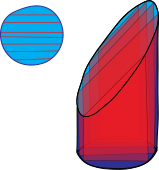{width=50%}

That's a top-down view, too, in addition to the **isometric**^[Fun CAD word!]/from-an angle view. Our calculation, in its outline, looked like:

\begin{align*}
\substack{\text{the volume of}\\\text{the pipe-organ-pipe}} &= \int \!\substack{\text{the area of}\\\text{its cross-sections}\\\text{parallel to $x$}} \\ \\
&= \int_{y=-3}^{y=+3} \int_{x=-\sqrt{3^2-y^2}}^{x=+\sqrt{3^2-y^2}} 5+x+y\,dx\,dy \\ \\
&\quad\quad\quad\vdots \\ \\
&= 45\pi
\end{align*}

Great! But there were a few problems with this approach.

* First of all, this shape is fundamentally circular. Slicing it rectangularly seemed to be disrespectful. It's ignoring what the shape *actually is*, and instead imposing our own values onto it. We've discussed how it's weird to take circular shapes and slice them up in non-circular ways. No one cuts a pizza into little square/rectangular slices. That's "psychotic," to use Avery Chen '21's word.

* Second, the integral we got by doing so was *hideous*. So hideous we couldn't solve it by hand, at least not without knowing a bunch of fancy trig integration techniques. Yet the answer we got was only $45\pi$. Sometimes hideous integrals are unavoidable. Sometimes beauty comes out of ugliness. But the answer being so simple seems to strongly suggest that there is (or at least *should* be) a method to find it that's comparably simple.

So then we tried to calculate it in a more elegant way. We tried to find the volume in a way more respectful of the actual shape. We decided to somehow use polar or circular coordinates, and had two specific ideas for how to do that. Instead of finding cross-sections parallel to an axis, we tried to:

1. find cross-sections that are **radial** (like pizza slices), and then add them up as we spin around the shape from $0$ to $2\pi$, and
2. find cross-sections that are circular (**crustial**, if you will), and add them up as we move along a radial line from the center of the shape to the outside of the shape.

(**Crustial** is a word I made up, to evoke the idea of a bunch of concentric pizza crusts; Charlotte Rosario '25 points out that the obvious imagery to use is that of an onion, and its concentric shells and circles.)

### Take two (polar, take one)

In our first method, the radial/pizza slice cross-sections looked something like:

{width=50%}

So we wanted to find the area of an arbitrary pizza slice, as a function of its angle $\theta$, and then add them up as we spin a full circle around the shape. To find the area of one of these radial pizza slices, we had to convert our function for the top of the shape, $f(x,y)=7+x+y$ into polar coordinates. With nostalgia for Math 3, we pulled out our beloved conversion formulas:

$$x=r\cos\theta$$

$$y=r\sin\theta$$

Giving us:

$$f(r,\theta)= 5+r\cos\theta+r\sin\theta$$

Then we were able to just integrate that from $r=0$ out to $r=3$ to find the area of a pizza slice, and then integrate *that* from $\theta=0$ to $\theta=2\pi$ to find the volume.

The full outline of our calculation looked like:

\begin{align*}
\substack{\text{total volume}\\\text{of this shape}} &= \substack{\text{add up all the volumes}\\\text{of all the radial pizza slices}} \\ \\
&= \int_{\theta = 0}^{\theta = 2\pi} \left(\substack{\text{the area/infinitely-tiny volume}\\\text{of a radial pizza slice}}\right) \, d\theta \\ \\
&= \int_{\theta = 0}^{\theta = 2\pi} \left(  \int_{r=0}^{r=3} 5 + r\cos\theta + r\sin\theta \, dr \right) \, d\theta \\ \\
&\quad \vdots \\ \\
&\quad\quad \text{etc.} \\
&\quad\quad \text{(this was a much cleaner pair of integrals we were able to work out by hand)} \\
&\quad \vdots \\ \\
&= 30\pi
\end{align*}

CALAMITY!!!! The answer's different!!!! We should be able to find the volume however we want, and we should get the same answer!!!!

$$\substack{\text{the volume of this shape}\\\text{found by adding up retcangular slices}} \quad=\quad \substack{\text{the volume of this shape}\\\text{found by adding up polar pizza slices}} $$

And yet:

$$30\pi \quad\neq\quad 45\pi$$

### Take three (polar, take two)

So that was upsetting. Then we tried our other polarly-inspired method, that of making circular/crustial/onion-ring slices, finding their area (as a function of $r$, their distance from the center), and adding them up as we slide in and out on a radial line, as the radius goes from $0$ out to $3$. 

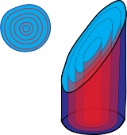{width=50%}

There were a couple of details to work out here. Each of the crustial cross-sections were curvy (unlike the radial cross-sections), which meant we had to do a full-fledged line integral. So to find the area of a crustial cross-section, we had to take a line integral under the top surface, along a concentric/crustial path. So we parameterized the function along that concentric/crustial path, and then we find the line element/differential arc length/curviness-correction-factor/infinitely-narrow-width. And, actually, we've already seen(/proven) that for circles, the curviness correction factor works out to be just their radius. In this case, that's $5$. Or rather, $r$, since we're finding the area of a crust-concentric slice at a distance $r$ from the center (not just the outermost crust slice at $r=5$). Anyway, so, in the outline, our calculation looked like:

\begin{align*}
\substack{\text{the volume of}\\\text{the pipe-organ-pipe}} &= \,\,\substack{\text{add up the areas}\\\text{of all the ``crust'' cross-sections}} \\ \\
&= \int_{r=0}^{r=3} \left( \substack{\text{area of a ``crust'' cross-section}\\\text{at distance $r$ from the center}} \right)\, dr \\ \\
&= \int_{r=0}^{r=3} \left( \substack{\text{the line integral}\\\text{along a crustial path}} \right)\, dr \\ \\
&= \int_{r=0}^{r=3} \left( \int_{\theta=0}^{\theta=2\pi} (5 + r\cos\theta + r\sin\theta)\cdot r  d\theta \right) \, dr \\ \\
&\quad \vdots \\ \\
&\quad\quad \text{etc.} \\
&\quad\quad \text{(this was also fine to do by hand)} \\
&\quad \vdots \\ \\
&= 45\pi
\end{align*}

OK, so this worked? Or, at least, gave us the same answer as the rectangular method??

### The wreckage

Still, we should be distressed. We should have:

$$\substack{\text{the volume of this shape}\\\text{found by adding up}\\\text{rectangular slices}} \quad=\quad \substack{\text{the volume of this shape}\\\text{found by adding up}\\\text{crustially-concentric slices}} \quad=\quad \substack{\text{the volume of this shape}\\\text{found by adding up}\\\text{polar pizza slices}} $$

But in fact we found:

$$\underbrace{\substack{\text{the volume of this shape}\\\text{found by adding up}\\\text{rectangular slices}}}_{=45\pi} \quad=\quad \underbrace{\substack{\text{the volume of this shape}\\\text{found by adding up}\\\text{crustially-concentric slices}}}_{=45\pi} \quad\neq\quad \underbrace{\substack{\text{the volume of this shape}\\\text{found by adding up}\\\text{polar pizza slices}}}_{=30\pi} $$

What's going on here???

Computer systems for aerospace applications---the avionics on the space shuttle, or even on the 737 you took to visit Grandma---typically have **[triple modular redundancy](https://en.wikipedia.org/wiki/Triple_modular_redundancy)**. There are actually *three* separate, independent computers doing all the calculations. So if one messes up for some reason, there are still two backups! Effectively, avionics calculations and decisions thus get made by a "best two out of three" style of voting. You don't want a flipped bit to make your flight fall out of the sky!

But good enough for NASA isn't good enough for us. We need **infinite modular redundancy**. No errors. No contradictions. 

A few people in class were joking that in the radial/polar pizza slice version, we need a "get the right answer" correction factor of $1.5$. In other contexts, the name people use for that is "fraud."

If we examine the two polar versions closely, we can see that we get the exact same integrals via either argument/method---*except* that the crustial method has an extra $r$ in the integral. And the crustial method is the one that appears to be correct, or rather, is the method whose answer agrees with the rectangular method. So it seems we need an extra $r$? But why? What's going on? 

## Zach's stripped-down version of this paradox

Zach Sayyah '23 came up with an even simpler, stripped-down, lower-dimensional version of this paradox.

Suppose we're trying to find the (two-dimensional) area of a (two-dimensional) rectangle, of width $w$ and height $h$:

{width=50%}

Of course the area is $w\cdot h$. But why? One way to think about why this is is that, to find the area of a rectangle, we add up the infinite number of infinitely-thin cross sectional lines:

{width=50%}

Each of these cross-sectional lines has length $l$, or some infinitely-tiny area $l dh$, and so we add up all infinity of them, using an integral, and we get $l \cdot h$:

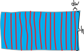{width=50%}

Great. What about a circle? What if we want to find the area of a circle? We know the area is $\pi r^2$, but why? Here's a similar argument. We have an infinite number of infinitely-thin cross-sectional (or rather, radial) lines, all of length $r$, and we add them up! Our radial lines are of length $r$, and look like:

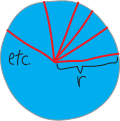{width=50%}

Let's say these radial cross-sections have an infinitely-narrow width $dt$:

{width=50%}

So each radial cross-section has an infinitely-tiny area of $r\cdot dt$. We add up all infinity of them by integrating and spinning them around the full $2\pi \cdot r$ of the circumference of the entire circle:

\begin{align*}
\text{total area of the circle}\,\, &=  \int_{0}^{2\pi r} r \, dt \\ \\
&= \Big[\, rt \,\Big]_{0}^{2\pi r} \\ \\
&= r\cdot 2\pi r\, \\ \\
&= 2\pi r^2
\end{align*}

Which is effectively the same as multiplying the cross-sectional length, $r$, by the circumference, $2\pi r$:

{width=50%}

But this... is obviously not true.

Aaaaaaghhhh!!!!

## Glimpses of truth

Sam Mazlish '24 was a prophet. We should have listened to him.

(Or rather, the prophets were speaking to Sam. We should have encouraged him to listen to them.)

Remember one of the first days in class when we were trying to use double integrals to compute volumes? I had brought those band-sawed-and-bolted reams of paper, as an example of how we can think of 3D shapes as being composed of an infinite number of infinitely-thin cross-sections. 

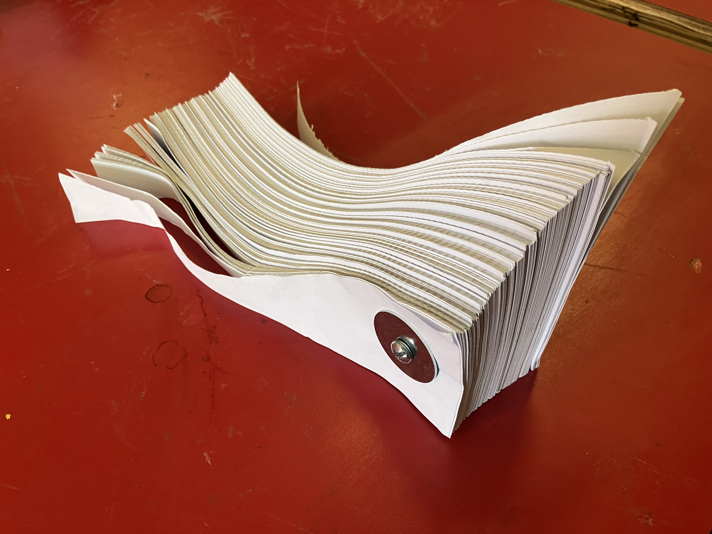{width=50%}

Lale Erbay '25 noticed that one of the shapes whose volume we were trying to compute was vaguely circular, and so was trying to convert it to polar coordinates to make it easier. Great idea! Great insight! Great strategy! In particular, she was trying to find the area of a radial cross-section and then add them up by spinning them around in a circle, much like we later tried to do with the organ-pipe shape. 

Sam, however, was uncertain. "If you have a finite number of sheets of paper and revolve them around, the density is higher at the center," he said. "They're less dense at the outside."

(Later, Sam asked: "Is that different if you have an infinite number of sheets of paper?" This was also a great observation! Infinite sets sometimes behave in ways that are very counterintuitive and different from how finite sets behave...)

## The way up

We had a beautiful world in which higher-dimensional integrals were just nested single integrals. That world is now gone. It's collapsed. We're standing in the ruins. Rubble everywhere. Postwar. How do we rebuild?

Here's my proposal. Rather than think of multiple integrals as iterated/nested single integrals, let's think of them as creatures in their own right. To actually *compute* them, we might want to translate them into iterated/nested single integrals. But that doesn't mean that's what they actually *are*, ontologically. 

Let's take double integrals as an example. The better way to think about a double integral is *not* to think of it as being two repeated/nested/iterated single integrals. Rather, the better way to think about it is as this *craaaaazy* machine that adds up an infinite-number of infinitely-small 3D boxes, all at once!^[I'm imagining the sort of 3D light installation where a bunch of random lights are blinking on and off in rapid succession inside a fixed 3D space---space-filling fireflies, illuminating every voxel integrated over time.] If we want to actually compute it, well, we can translate it into two repeated/nested/iterated 1D integrals. But that's distinct from the way we're *fundamentally thinking* about what a double integral *is*. Computation is just an implementation detail.

In other words, higher integrals aren't matryoshka dolls of iterated single integrals. We want to take our family heirloom matryoshka doll, move it to the kiln, and *melt it down*. We want all those layers to fuse into one!!! Nice matryoshka dolls, of the sort one might have as a family heirloom, are carved wood, so they won't melt, but so I'm imagining mid-century Soviet matryoshka doll made out of some early plastic, back when plastics were new and fancy and all the rage... anyway, from the haze of carcinogenic sublimed synthetic hydrocarbons, a truer, more singular, vision of integration will emerge. 

So, let's think about higher-dimensional integrals as machines that magically add up infinite numbers of infinitely-small $n$-dimensional boxes. For example:

* **A single integral**: a machine that adds up an infinite number of infinitely-small 2D boxes (to get a 2D area)
* **A double integral**: a machine that adds up an infinite number of infinitely-small 3D boxes (to get a 3D volume)
* **A triple integral**: a machine that adds up an infinite number of infinitely-small 4D boxes (to get a 4D “volume”)

In more detail, here's how we can think about them:

<ul>
	<li> **A single integral**:
		<ul>
			<li> each 2D box has height $f(x)$ and infinitely-narrow (1D) width $dx$:
        
{width=75%}

</li>
</li> so then each infinitely-small 2D box has area:
$$f(x)\,dx$$
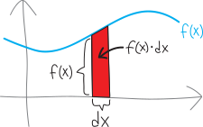{width=75%}
 </li>
<li> and when we add them up to get the total 2D area, we have:
$$\int f(x)\,dx$$
</li>
</ul></li>
<li> **A double integral**: 
<ul>
<li>each 3D box has height $f(x,y)$ and an infinitely-small 2D base area $dA$

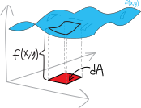{width=75%}
 </li>

<li> so then each infinitely-small 3D box has volume:
$$f(x,y)\,\cdot\, dA$$

{width=75%}
 </li>

<li> and when we add them up to get the total 3D volume, we have:
$$\int f(x,y)\,dA$$
</li>

<li> and to actually compute it, we might translate it into two nested single integrals, like so:

$$\iint f(x,y) \, dx\, dy$$
</li>
</ul>
</li>
<li> **A triple integral**:
<ul>
<li> each 4D box has “height” $f(x,y,z)$ and an infinitely-small 3D volume $dV$ </li>
<li> so then each infinitely-small 4D box has an infinitely-small “4D volume:”
$$f(x,y,z)\,\cdot \, dV$$ </li>
<li> and when we add them up to get the total “4D volume,” we have:
$$\int f(x,y,z)\,dV$$
</li>
<li> and to actually compute it, we might translate it into three nested single integrals, like so:

$$\iiint f(x,y,z)\, dx\, dy\, dz$$
</li>
</ul>
</li>
</ul>

The notation with higher-dimensional integrals can get misleading. Above, I've tried to use only a single $\int$ symbol for each integral, regardless of whether it's a single, double, or triple integral. But often people will use $\iint$ for all their double integrals, and $\iiint$ for all their triple integrals. I'm not a huge fan of that. It seems to imply that a triple integral (e.g.) is three things. After all, it's three $\int$'s. It's easy to think of $dx$, $dA$, and $dV$ as each being “one” thing ('cause they're each one symbol), but $\iint$ is two symbols! $\iiint$ is three symbols! Plus we use the words “double” and “triple,” which also imply that we're *repeating* something. The word “multiple integrals” implies that there are multiple things---not just one thing! Maybe we should just call them **2D integrals** and **3D integrals** or something instead. The point is, *fundamentally* a “multiple integral” is a single integral. It's just a single integral in some higher-dimensional space.

But we haven't yet resolved the paradox of what's going on when we try to do an integral in polar coordinates, and why thints break. Plus, I can hear your rejoinder: “Andrew! You're making a distinction without a difference! So we write a $dA$, and then we simplify it to $dx\cdot dy$. That's obvious. So what? Sure, it's 'one integral,' but really, it automatically becomes two.”

Here's the issue. All of the integrals we've done so far have been using functions in rectangular/Cartesian coordinates. We've [coordinate systems constructed from nice, orthogonal axes](https://en.wikipedia.org/wiki/Orthonormal_basis). $90^\circ$ angles everywhere. Safe, square, linear. A world made of graph paper, paregoric in its predictability.

Now, though, we're trying to take integrals that involve describing shapes in *circular* ways. Not straight ways. *Curvy* ways. Calculus gives us a way to talk about curvy things. That's the entire point, and that's what we've done for a long time: we take a curvy object; we zoom in infinitely-far; it becomes straight; we use our tried-and-true tools of Euclidean geometry. Everything works out.

But what if the way we're describing these objects is *itself* curvy? Not whether the objects are curvy, but whether our *language* is curvy? This is the situation we find ourselves in now. Not only are we trying to calculate properties of a curvy shape---the volume of the pipe-organ-pipe---we're trying to do so when we're describing it curvily, using curvy language. Curvy syntax. Curvy words. Block letters are out; beautiful cursive is in. We have an inkwell and a quill, when what we really need is a drafting pencil and a T-square. So what do we do?

We need to account for that curviness. We need some sort of correction factor. 

In principle, this isn't new. At the beginning of the year, we came up with our "curvy line correction factor" (alternatively called the differential arc length, line element, or things like that) which let us use integrals to measure the lengths of curvy lines. We used that again at the beginning of this semester when we came up with the idea of a line integral---a normal 1D integral to find a normal 2D area, *but* over a potentially-curvy base, for which we we need to account using this correction factor. 

Likewise here. How do we account for the fact that the way we're describing the objects we're trying to integrate is potentially curvy?!?

Let's back up and think even more deeply about what it means to take a double integral in rectangular coordinates. In our rectangular world, the fabric of reality (or at least the language we use to describe reality) is a rectangular lattice---graph paper turned into the universe; a land surveyor's deepest dream; the [Public Lands Survey System](https://en.wikipedia.org/wiki/Public_Land_Survey_System) repurposed for all reality:

{width=75%}

Zoom in infinitely far, and the world is still just made of tiny rectangular boxes:

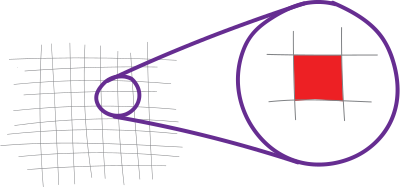{width=75%}

To do a "2D integral"/double integral in rectangular, we need to find the area of an infinitely-tiny little rectangle (an infinitesimal [Planck area](https://en.wikipedia.org/wiki/Planck_units) of our coordinate system):

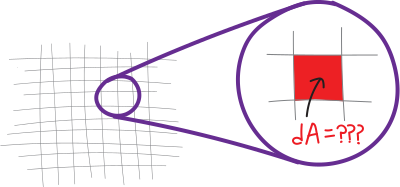{width=75%}

But how do we do that? Well, we know that one of these infinitely-tiny boxes that make up the fabric of our rectangular reality has an infinitely-tiny width, $dx$, and an infinitely-tiny height, $dy$:

{width=75%}

So then, because this is a rectangle, the area is just width times height, or $dA = dx\cdot dy$:

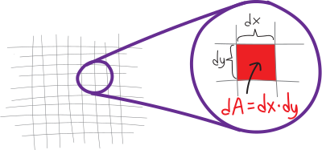{width=75%}

Great! 

But what about in our polar world??? In our polar world, the fabric of reality looks like:

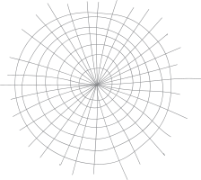{width=75%}

(I showed this to Jana. "Look at what happens at the center!," she remarked.) If we zoom in infinitely far in our polar world, an infinitely-tiny 2D region of space doesn't look like a rectangle. It looks like a *wedge*. A wedge chopped out of a circle, curvy and semicircular on two sides, straight and radial on the others:

{width=75%}

So to do a 2D integral/double integral in polar, we'll need to find the area of that infinitely-tiny region:

{width=75%}

But... how?

Let's suppose we have some infinitely-tiny wedge, with infinitely-tiny area $dA$, created by an infinitely-tiny angle of $d\theta$ (**subtended** by an angle is the fancy math word), with a width (in the radial direction) of an infinitely-tiny length $dr$:

{width=75%}

Because of how circles and wedges work, the further away from the origin it is, the bigger it'll be; the closer to the origin it is, the smaller it'll be. (... even though it's infinitely small in either case?!?) So let's say that its center is a distance $r$ from the origin:

{width=75%}

So then, the inner edge of the wedge is at $r-\frac{dr}{2}$ (that's how far away it is from the origin, radially); the outer edge of the wedge is at $r+ \frac{dr}{2}$:

{width=75%}

So... what's the area of that wedge??? We worked this out in class, but I'll run through the calculation here. We can conceptualize this as being *two* wedges, both starting at the origin; a smaller one going out to the inner edge of the wedge and a bigger one going all the way out to the outer edge. So if we take the area of the bigger wedge and subtract the area of the smaller wedge, we'll have the area of the wedge we care about:
So we have:

\begin{align*}
dA \quad=\quad \substack{\text{the area}\\\text{of the wedge}} \quad&= (\text{area of big wedge}) - (\text{area of small wedge})
\end{align*}

Each wedge will have an area that's a percentage of the total circle it's cut out of:

\begin{align*}
&= (\substack{\text{percentage of area}\\\text{of big circle}}) - (\substack{\text{percentage of area}\\\text{of little circle}})
\end{align*}

The total angle of a full circle is $2\pi$, but here we have a wedge that's carving out just $d\theta$ of a full $2\pi$ circle, so we have:

\begin{align*}
&= \%\cdot\left(\substack{\text{total area of }\\\text{big circle}}\right) - \%\cdot\left(\substack{\text{total area of }\\\text{little circle}}\right) \\ \\
&= \frac{d\theta}{2\pi}\cdot\left(\substack{\text{total area of }\\\text{big circle}}\right) - \frac{d\theta}{2\pi}\cdot\left(\substack{\text{total area of }\\\text{little circle}}\right) \\
\end{align*}

The area of a circle is $\pi(\text{its radius})^2$, and here the radii of the two corresponding circles are $r-\frac{dr}{2}$ and $r+\frac{dr}{2}$, so we have:

\begin{align*}
&= \frac{d\theta}{2\pi}\cdot \pi\left(r+\frac{dr}{2}\right)^2 \,\,-\,\, \frac{d\theta}{2\pi}\cdot\pi\left(r-\frac{dr}{2}\right)^2 \\
\end{align*}

Working this out takes a bunch of tedious algebra (not *that* much, tbh) but given that we're in multivariable calculus, I'm going to assume that you can work it out yourself. Or make you work it out yourself. Anyway, so, the outline of the full calculation, and its conclusion, is something like:

\begin{align*}
dA \quad=\quad \substack{\text{the area}\\\text{of the wedge}} \quad&= (\text{area of big wedge}) - (\text{area of small wedge}) \\ \\
&= \frac{d\theta}{2\pi}\cdot \pi\left(r+\frac{dr}{2}\right)^2 \,\,-\,\, \frac{d\theta}{2\pi}\cdot\pi\left(r-\frac{dr}{2}\right)^2 \\ \\
&\quad\quad\vdots \\ \\
&\text{algebraaaaaa} \\ \\
&\quad\quad\vdots \\ \\
&= r\, dr \, d\theta
\end{align*}

Yay! So our correction factor, as we've intuited or otherwise figured out, is $r$. We throw in an extra $r$, we integrate not over $dr\,d\theta$ but over $r\, dr\, d\theta$, and then VOILA, we can do *integrals in polar coordinates* to our hearts' contents. 

{width=75%}

Of course... polar and rectangular aren't the only coordinate systems that we can use to model two-dimensional reality. We could have some weird hipster DIY coordinate system, in which the fabric of reality looks like:

{width=75%}

(It's like those [soft-story buildings](https://en.wikipedia.org/wiki/Soft_story_building) in SF after the [1989 Loma Prieta earthquake](https://en.wikipedia.org/wiki/1989_Loma_Prieta_earthquake)!) Or we could have a world in which the coordinate system/fabric of reality looks like:

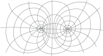{width=75%}

Seems terrifying! If we want to do integrals in either of those worlds, we'd need to work out the corresponding correction factors. And all this is just for two dimensions! We haven't even spoken about different coordinate systems and different correction factors for higher dimensions!

## Paradoxes resolved

Having deepened our understanding of integrals, can we now figure out what we did wrong in trying to find the volume of the organ-pipe shape? Let's go back to our erroneous integral, the one that supposedly involved radial pizza-slice cross-sections:
$$\substack{\text{total volume of this shape}\\\text{calculated by adding up radial pizza slices}} \quad \overset{\text{not actually!}}{=}\quad \int_{\theta = 0}^{\theta = 2\pi} \int_{r=0}^{r=3} 7+r\cos\theta+r\sin\theta \, dr d\theta$$
In fact what the above integral is doing is finding the total volume of all these infinitely-thin radial cross-sections, but when they're arranged in a *rectangle*, not a circle:
{width=75%}
It finds us the volume of something that's kind of like our original organ-pipe shape, but cut and stretched so that its base is a rectangle with sides of length $3$ and $2\pi$.

So, to actually compute the volume of all these radial cross-sections, arranged in a circle like our organ-pipe shape, we need to use this polar coordinates double integral correction factor, $r\, dr\, d\theta$. The full calculation (and I'm going to show the details now!) looks like:
\begin{align*}
\substack{\text{total volume}\\\text{of the organ pipe}} \quad&=\quad \substack{\text{add up the infinite number}\\\text{of infinitely-tiny}\\\text{radial pizza slices}} \\ \\
&= \int\limits_{\substack{\text{this}\\\text{shape}}} \substack{\text{the volume of}\\\text{an infinitely-tiny}\\\text{radial pizza slice}} \\ \\
&= \int\limits_{\substack{\text{this}\\\text{shape}}} \left(\substack{\text{the height of an}\\\text{infinitely-tiny radial pizza slice}}\right)\cdot\left(\substack{\text{the infinitely-tiny base area}\\\text{of a radial pizza slice}}\right) \\ \\
&= \int\limits_{\substack{\text{this}\\\text{shape}}} \underbrace{\left(\substack{\text{the height of an}\\\text{infinitely-tiny radial pizza slice}}\right)}_{=7+r\cos\theta + r\sin\theta}\cdot\underbrace{\left(\substack{\text{the infinitely-tiny base area}\\\text{of a radial pizza slice}}\right)}_{=dA}\end{align*}
Plugging in our function, this is:
\begin{align*}&= \int\limits_{\substack{\text{this}\\\text{shape}}} \big(\, 7+r\cos\theta + r\sin\theta \,\big) \cdot dA\end{align*}
In polar coordinates, $dA=r\,dr\,d\theta$, so this becomes:
\begin{align*}&= \int\limits_{\substack{\text{this}\\\text{shape}}} \big(\, 7+r\cos\theta + r\sin\theta \,\big) \cdot r\,dr\,d\theta \\ \\
&= \int_{\theta = 0}^{\theta = 2\pi}\int_{r=0}^{r=3} \big(\, 7+r\cos\theta + r\sin\theta \,\big) \cdot r\,dr\,d\theta \\ \\
&= \int_{\theta = 0}^{\theta = 2\pi}\int_{r=0}^{r=3} 7r+r^2\cos\theta + r^2\sin\theta \,\,  dr\,d\theta\end{align*}
OK, and now we this is two single integrals, one inside the other!!! Working out the innermost integral, the one with respect to $r$, we have:
\begin{align*}&= \int_{\theta = 0}^{\theta = 2\pi}\left(\int_{r=0}^{r=3}  7r+r^2\cos\theta + r^2\sin\theta \,dr\right) \,d\theta \\ \\
&= \int_{\theta = 0}^{\theta = 2\pi}\left[\,\frac72r^2+\frac13r^3\cos\theta + \frac13r^3\sin\theta \,\right]_{r=0}^{r=3} \,d\theta \\ \\
&= \int_{\theta = 0}^{\theta = 2\pi}\left(\,\frac723^2+\frac133^3\cos\theta + \frac133^3\sin\theta \,\right) \quad-\quad \left( \frac720^2+\frac130^3\cos\theta + \frac130^3\sin\theta \right) \,d\theta \\ \\
&= \int_{\theta = 0}^{\theta = 2\pi}\left(\,\frac{63}{2}+9\cos\theta + 9\sin\theta \,\right) \quad-\quad \left(0 \right) \,d\theta\end{align*}
And now we can do the outer integral, the one w/r/t $\theta$:
\begin{align*}&= \int_{\theta = 0}^{\theta = 2\pi} \frac{63}{2}+9\cos\theta + 9\sin\theta  \,d\theta \\ \\
&= \left[\, \frac{63}{2}\theta +9\sin\theta - 9\cos\theta \,\right]_{\theta = 0}^{\theta = 2\pi} \\ \\
&= \left(\, \frac{63}{2}\cdot 2\pi  +9\sin(2\pi) - 9\cos(2\pi) \,\right) \quad-\quad \left(\, \frac{63}{2}\cdot 0 +9\sin(0) - 9\cos(0) \,\right) \\ \\
&= \left(\, \frac{63}{2}\cdot 2\pi  +9\cdot 0 - 9\cdot 1 \,\right) \quad-\quad \left(\, \frac{63}{2}\cdot 0 +9\cdot 0 - 9\cdot 1 \,\right) \\ \\
&= \left(\, \frac{63}{2}\cdot 2\pi   - 9\,\right) \quad-\quad \left(\, - 9 \,\right) \\ \\
&= \frac{63}{2}\cdot 2\pi \\ \\
&= 63\pi
\end{align*}
Yay! $63\pi$! The (apparently) right answer! 

## Higher integrals, even more generally

Earlier, when we talked about how multiple integrals are their own creatures, we used a specific coordinate system. For example, we said that double integrals are made of infinitely-small boxes with an infinitely-small base area $dA$ and a finite height $f(x,y)$. But $(x,y)$ describes some point in $\mathbb{R}^2$ specifically in *rectangular*. Why restrict ourselves? Writing a 2D point using rectangular/Cartesian/Euclidean coordinates is overly particular. It's just a way of *describing* a point. We're trying to think of things more generally now. We're trying to generalize to other coordinate systems (like polar). We've done that partially. $dA$ is an infinitely-small 2D base area; it's more general than the specific, rectangularly-described 2D base area $dx\, dy$. 

Let's keep going! Instead of writing $(x,y)$, let's write "some point in $\mathbb{R}^2$" instead, and leave it unresolved precisely *how* we describe/articulate that point. We could describe it in rectangular, in polar, in some hipster DIY coordinate system, whatever. That's just an implementation detail!

So then, with more nuance, we can conceptualize double integrals as:

<ul>
<li>**A double integral:**
<ul>
<li>each 3D box has a height $f\left(\substack{\text{some point}\\\text{in }\mathbb{R}^2}\right)$ and an infinitely-small 2D base area $dA$:

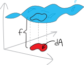{width=75%}
</li>
<li>so then each infinitely-small 3D box has volume:

$$ f\left(\substack{\text{some point}\\\text{in }\mathbb{R}^2}\right)\,dA $$

{width=75%}
</li>
<li>and when we add them up to get the total 3D volume, we have:
$$ \int f\left(\substack{\text{some point}\\\text{in }\mathbb{R}^2}\right)\,dA $$

(Note that here in my pictures, I've now drawn $dA$ as an arbitrary 2D blob, rather than the rectangle that I drew it as in the earlier picture. And I've just written "$f$" to denote the value of the function, at some arbitrary-but-unknown point in some arbitrary-but-unknown coordinate system!)
</li>
<li>If we actually want to *compute* one of these guys, we can translate them into a bunch of nested/iterated single integrals!
<ul>
<li>Translating a double integral into two single integrals in rectangular is easy:

\begin{align*}
&= \int f\left(\substack{\text{some point}\\\text{in }\mathbb{R}^2}\right)\,dA \\
&= \int f\left(x,y\right)\,dA \\
&= \int \int f\left(x,y\right)\,\underbrace{dx\, dy}_\mathclap{\substack{\text{rectangular coordinates}\\\text{``correction factor''}}}
\end{align*}

</li>
<li>Translating a double integral in polar coordinates into two single integrals involves adding (well, *multiplying*) a correction factor:

\begin{align*}
&= \int f\left(\substack{\text{some point}\\\text{in }\mathbb{R}^2}\right)\,dA \\
&= \int f\left(r,\theta\right)\,dA \\
&= \int \int f\left(r,\theta\right)\,\underbrace{r\, dr\, d\theta}_\mathclap{\substack{\text{polar coordinates}\\\text{correction factor}}}
\end{align*} 
</li>
<li>And translating a double integral in your own hipster DIY coordinate system involves figuring out the correction factor for your hipster DIY coordinate system!!!

\begin{align*}
&= \int f\left(\substack{\text{some point}\\\text{in }\mathbb{R}^2}\right)\,dA \\
&= \int f\left(\bigstar, \blacklozenge \right)\,dA \\
&= \int \int f\left(\bigstar, \blacklozenge \right)\,\underbrace{??? \, d\bigstar\, d\blacklozenge}_\mathclap{\substack{\text{hipster DIY coordinates}\\\text{correction factor}}} \\
\end{align*}

</li>
</ul>
</li>
</ul>
</li>
</ul>

## Integrating these ideas

There are two bigger ideas here. 

First, as we've now seen this year, integrals are much more than just the area of a curvy 2D shape. Rather, integrals are a way for us to add up an infinite number of infinitely-small things. We can use integrals to find the area of curvy 2D shapes---but we can also use them to find *so much more*. The lengths of curvy lines! The volumes of curvy 3D shapes! There's even more stuff that we haven't even begun to think about. If we want to calculate something, and we can find a way to phrase it as an integral, then we have a method with which to compute it (i.e., antidifferentiate and subtract). With integrals, we become *puppet masters of infinity*.

And second, maybe coordinate systems aren't as fundamental as we once thought they were. We learned about rectangular coordinates and the coordinate plane years and years ago, and for years we've thought of them as being the way---*the* way---to describe objects and functions. In Math 3, when we played with complex numbers in detail, we came up with this idea of polar coordinates, which helped us describe and play with complex numbers in a fashion that seemed more natural. But that idea extends. Functions (and mathematical objects) exist beneath the ways that we describe them. Coordinate systems aren't what these things *are*---they're just one way of *describing* them. It's like how $25$, $5^2$, $82-57$, $\sqrt{625},$ $\int_0^5 5 dt$, $\log_{2}(33554432)$, etc., are all describing the same number. It's not like "$25$" is the "right" or "true" representation, either. Rather, all of these (even "$25$") are just *representations* of the deeper reality.

