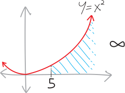
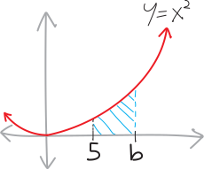
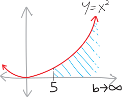

<ol class="problems">

<li>Consider the parabola $y=x^2$. What's the area underneath it, from, say, $x=5$ out to $\infty$?
    {width=50%}
Obviously it's infinite! It's an infinitely-wide area, and it's getting infinitely tall, so obviously the area is infinite. 
    
Buuuuuut just to be EXTRA THOROUGH, let's take an integral. We'll show our pedantic, persnickety, detail-obsessed auditors that we've done the work! Besides, it should be pretty straightforward to do an integral and get $\infty$. Think of how, when we started talking about integrals at the very end of Math 3, we used them (a couple times) to find the area of rectangles and triangles and trapezoids. We didn't *need* integrals to find those areas---but in general, if we have a complicated procedure, we should verify that it works by testing it against simple problems we know the answer to. (Philosophers call this **[abduction](https://plato.stanford.edu/entries/abduction/)**.)
    
Anyway, to find the area of this infinitely-large shape, I guess we set up an integral:
$$\text{this area } = \int_5^\infty x^2 \, dx$$
So now we can just find an antiderivative and plug things in. Except we can't *really* plug infinity in, since it's not a number. But we can do the next-best thing: just phrase this as a limit, and take the limit to infinity. So, for example, we can try to find the area underneath $x^2$ from $x=5$ to $x=b$:
{width=50%}
And then we can take the limit of that as $b$ goes to $+\infty$:
{width=50%}
So we get:
\begin{align*}
        \text{this area } &= \int_5^\infty x^2 \, dx \\
        &= \lim_{b\rightarrow \infty} \int_5^b x^2 \, dx \\
        &= \lim_{b\rightarrow \infty} \left[  \frac13x^3\right|_5^b \\
        &= \lim_{b\rightarrow \infty} \left[  \frac13b^3 - \frac135^3 \right] \\
        &= \infty
    \end{align*}
Okay. That all makes sense. We can do an integral, and indeed, the integral of this infinitely-tall, infinitely-wide arrea is indeed infinity.</li>

<li>Consider the function:
    $$f(x) = \frac{1}{x}$$
Draw a picture of it. What's the area under this function, from $x=1$ all the way out to $x=+\infty$? What's the area under this function, from $x=0$ to $x=1$? How about the area from $x=0$ to $x=5$? How about the area from $x=2$ to $x=+\infty$? Shade in all these areas on the picture, too.</li>

<li>Consider the function:
$$f(x) = \frac{1}{x^2}$$
Draw a picture of it. What's the area under this function, from $x=1$ all the way out to $x=+\infty$? What's the area under this function, from $x=0$ to $x=1$? How about the area from $x=0$ to $x=5$? How about the area from $x=2$ to $x=+\infty$? Label and shade in all these areas on the picture, too.</li>

<li>Consider the function:
    $$f(x) = \frac{1}{\sqrt x}$$
Same deal. Draw a picture of it, find the area under it from $x=1$ to $x=+\infty$, from $x=0$ to $x=1$, from $x=0$ to $x=5$, and from $x=2$ to $x=+\infty$.</li>
    
<li> Consider the function:
$$f(x) = x^p$$

* When is the area underneath $x^p$ from $x=0$ to $x=1$? infinite? When is it finite? What is that area, when it's finite? (Note that by "when" here I mean "for what values of $p$.")
* When is the area underneath $x^p$ from $x=1$ to $x=+\infty$ infinite? When is it finite? What is that area, when it's finite?

Draw some pictures, too.
    
If you're having trouble getting started, I can give you some more example problems to do with these mysterious integrals! I've got a whole bunch. But I'm trying to leave this intentionally open-meaned^["Open-meaned" being a word I just made up to distinguish between that and "open-ended," in the sense of ends versus means. This isn't open-ended; there's a specific question I want you to answer/thing I want you to figure out.]!</li>
    
<li>Can you plot the value of the area underneath $x^p$ from $x=1$ to $x=\infty$ as $p$ changes? In other words, can you plot what the function  $\displaystyle f(p) = \int_1^\infty x^p\,dx$ looks like? What about what $\displaystyle g(p) = \int_0^1 x^p\,dx$ looks like? (I had the idea to make this graph when I was a 19-year-old learning calculus for the first time, and I thought it was one of the most remarkable things I'd ever seen.)
<table style='text-align: center;'>
        <thead>
            <tr>
                <th style='width:30%;'>$\displaystyle \int_0^1 \! x^p \, dx$</th>
                <th style='text-align: center;'>$x^p$</th>
                <th class="integral-col">$\displaystyle \int_1^\infty \! x^p \, dx$</th>
            </tr>
        </thead>
        <tbody>
            <tr>
                <td class="integral-col"></td>
                <td class="function-col">$x^3$</td>
                <td class="integral-col"></td>
            </tr>
            <tr>
                <td class="integral-col"></td>
                <td class="function-col">$x^2$</td>
                <td class="integral-col"></td>
            </tr>
            <tr>
                <td class="integral-col"></td>
                <td class="function-col">$x$</td>
                <td class="integral-col"></td>
            </tr>
            <tr>
                <td class="integral-col"></td>
                <td class="function-col">$x^{1/2} = \sqrt{x}$</td>
                <td class="integral-col"></td>
            </tr>
            <tr>
                <td class="integral-col"></td>
                <td class="function-col">$x^{1/3} = \sqrt[3]{x}$</td>
                <td class="integral-col"></td>
            </tr>
            <tr>
                <td class="integral-col"></td>
                <td class="function-col">$x^{1/4} = \sqrt[4]{x}$</td>
                <td class="integral-col"></td>
            </tr>
            <tr>
                <td class="integral-col"></td>
                <td class="function-col">$x^0 = 1$</td>
                <td class="integral-col"></td>
            </tr>
            <tr>
                <td class="integral-col"></td>
                <td class="function-col">$\displaystyle x^{-1/4} = \frac{1}{\sqrt[4]{x}}$</td>
                <td class="integral-col"></td>
            </tr>
            <tr>
                <td class="integral-col"></td>
                <td class="function-col">$\displaystyle x^{-1/3} = \frac{1}{\sqrt[3]{x}}$</td>
                <td class="integral-col"></td>
            </tr>
            <tr>
                <td class="integral-col"></td>
                <td class="function-col">$\displaystyle x^{-1/2} = \frac{1}{\sqrt{x}}$</td>
                <td class="integral-col"></td>
            </tr>
            <tr>
                <td class="integral-col"></td>
                <td class="function-col">$\displaystyle x^{-2/3} = \frac{1}{x^{2/3}}$</td>
                <td class="integral-col"></td>
            </tr>
            <tr>
                <td class="integral-col"></td>
                <td class="function-col">$\displaystyle x^{-3/4} = \frac{1}{x^{3/4}}$</td>
                <td class="integral-col"></td>
            </tr>
            <tr>
                <td class="integral-col"></td>
                <td class="function-col">$\displaystyle x^{-1} = \frac{1}{x}$</td>
                <td class="integral-col"></td>
            </tr>
            <tr>
                <td class="integral-col"></td>
                <td class="function-col">$\displaystyle x^{-4/3} = \frac{1}{x^{4/3}}$</td>
                <td class="integral-col"></td>
            </tr>
            <tr>
                <td class="integral-col"></td>
                <td class="function-col">$\displaystyle x^{-3/2} = \frac{1}{x^{3/2}}$</td>
                <td class="integral-col"></td>
            </tr>
            <tr>
                <td class="integral-col"></td>
                <td class="function-col">$\displaystyle x^{-2} = \frac{1}{x^2}$</td>
                <td class="integral-col"></td>
            </tr>
            <tr>
                <td class="integral-col"></td>
                <td class="function-col">$\displaystyle x^{-3} = \frac{1}{x^3}$</td>
                <td class="integral-col"></td>
            </tr>
            <tr>
                <td class="integral-col"></td>
                <td class="function-col">$\displaystyle x^{-4} = \frac{1}{x^4}$</td>
                <td class="integral-col"></td>
            </tr>
            <tr>
                <td class="integral-col"></td>
                <td class="function-col">$\displaystyle x^{-5} = \frac{1}{x^5}$</td>
                <td class="integral-col"></td>
            </tr>
        </tbody>
</table>

</li>
</ol>
