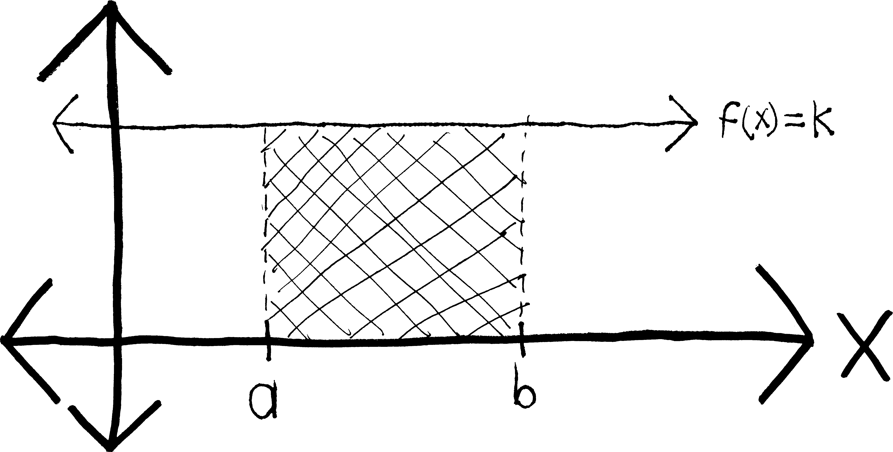
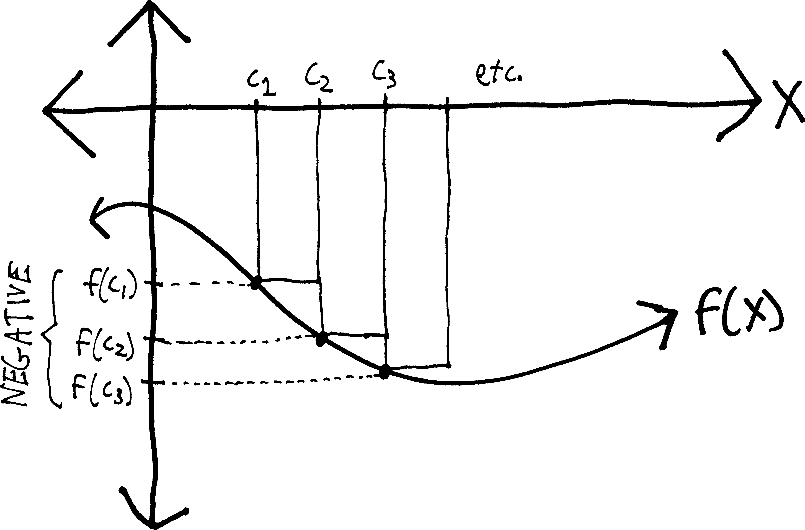

**There's a major caveat to integrals that we haven't mentioned yet**. Namely: in the way that we've constructed them, integrals measure not “area,” but rather something more like *net area*. Meaning: regions above the $x$-axis get counted as positive-area and regions below the $x$-axis get counted as negative area, like so:

For example, consider $\sin(\theta)$, between $\theta=0$ and $\theta=2\pi$:

There's a lot of area there! But both those lobes are the same size, so when we actually calculate the integral, they cancel out, giving us an integral of zero:

\begin{align*}
\int_0^{2\pi} \sin(\theta)\, d\theta &= \Big|\, -\cos\theta \,\Big|_0^{2\pi} \\ \\
&= \Big(\, -\cos(2\pi) \,\Big) - \Big(\, -\cos(0)\,\Big) \\ \\
&= \Big(\, - 1 \,\Big) - \Big(\, -1 \,\Big) \\ \\
&= -1 + 1 \\ \\
&= 0
\end{align*}

(How big is a single lobe of sine? If we wanted to find the actual area of sine from $0$ to $2\pi$---not the integral, not the net area, the *actual* area---how might we do it?)

That integrals are "net area" may seem odd, but it is a concept we've encountered many times before. The distinction between “integral” and “area” is the same as the distinction between “velocity” and “speed,” or as between “subtraction” and “distance.”

<table style = 'text-align:center;'>
<thead><td>**Measures of magnitude**</td><td>**Measures of magnitude *and* direction**</td></thead>
<tr><td> area </td> <td> integral </td></tr>
<tr><td> speed </td> <td> velocity </td></tr>
<tr><td> distance </td> <td> subtraction </td></tr>
</table>

Subtraction, for instance, measures the “distance” between two numbers----but if we do it in the wrong order, we get a negative:

\begin{align*}
5 - 2 &= +3 \\
2 - 5 &= -3
\end{align*}

If we want to *really* measure distance---the absolute distance, without any information about the direction---we need to use an absolute value
\begin{align*}
|5 - 2| &= +3 \\
|2 - 5| &= +3
\end{align*}

If you've taken physics, or perhaps certain other math classes, you might also recognize this as the distinction between a **vector** and a **scalar**:

<table style = 'text-align:center;'>
<thead><td>**Scalar quantities**</td><td>**Vector quantities**</td></thead>
<tr><td> area </td> <td> integral </td></tr>
<tr><td> speed </td> <td> velocity </td></tr>
<tr><td> distance </td> <td> subtraction </td></tr>
</table>

So, that's the distinction between integrals and areas. We think of "area" as being something that's never negative, just like how we think of "distance" as being something that's never negative. But integrals, in fact, consider any area above the $x$-axis to be “positive area” any area below the $x$-axis to be “negative” area. 

Why? What's going on here?

Let me give an example. Earlier, even before we learned that, as a result of the Fundamental Theorem of Calculus, integrals are really just antiderivatives, we were able to use basic geometry to come up with this formula:

$$\int_a^b \!k\,dx = (b-a)k$$

But the implicit assumption we made is that we have a situation like this:

Namely, we're assuming that $k$ is some positive number. We're assuming that this line $f(x)=k$ lies *above*, not below, the $x$-axis.  But what if $k$ were negative? Then by our formula, *the integral would be negative, too*. For example, if we had $f(x) = -5$, then according to this formula, we'd have:
\begin{align*}
 \int_3^7 \! (-5)\,dx &= (7-3)(-5) \\
 &= -20
 \end{align*}
But obviously the region in question doesn't have some sort of metaphysically-disturbing “negative area”---it has a positive area. The area of this region is $20$ units. It's just that the region has been flipped below the $x$-axis:

If we wanted that integral to be positive, we'd have to throw some sort of messy absolute-value into our formula. We'd have to say: 

$$\int_a^b \!k\,dx = (b-a)|k|$$

But obviously, that's a problem, because *then the integral would no longer be the same as the antiderivative*. Rather than simply have $F(b)-F(a)$ be a general formula that tells us how to evaluate any integral, we'd have to go back to the graph of the function every time and make sure it's above the $x$-axis (and throw in absolute values in the right places if it's not). The beauty and simplicity of the Fundamental Theorem of Calculus would be completely destroyed. 

It wouldn't work, by the way, just to throw in a single absolute value after the whole thing---to say, for instance, that given some function $g(x)$ and its antiderivative $G(x)$, that:

$$\int_a^b g(x)\,dx = |G(b) - G(a)|$$
This wouldn't work because we might have a region that is both above *and* below the $x$-axis between $a$ and $b$. Take $\sin(x)$, for instance:

If we try to find $\displaystyle \int_0^{2\pi} \sin(x)\,dx$ using the FTC, we just get zero. And taking an absolute value of zero won't change that:
\begin{align*}
\int_0^{2\pi} \sin(x)\,dx &= \Big[\, -\cos(x) \,\Big]_0^{2\pi} \\
&= [-\cos(2\pi)] - [-\cos(0)] \\
&= -\cos(2\pi) + \cos(0) \\
&= -1 + 1 \\
&= 0
\end{align*}

Note that if we *do* want to find the actual area beneath sine, or beneath any curve, we'll have to split it up at all of its $x$-intercepts, and *then* take integrals, and *then* absolute-value the integrals:

\begin{align*}
\text{absolute area } &= \left\vert \int_0^\pi \sin(x)\,dx \right\vert  + \left\vert \int_\pi^{2\pi} \sin(x)\,dx \right\vert \\
&= \Big\vert \Big[\, -\cos(x) \,\Big]_0^\pi \Big\vert + \left\vert \Big[\, -\cos(x) \,\Big]_\pi^{2\pi} \right\vert \\
&= \left\vert -\cos(\pi) - -\cos(0) \right\vert + \left\vert -\cos(2\pi) - -\cos(\pi) \right\vert \\
&= \left\vert 1 - -  1 \right\vert + \left\vert -1 - - - 1 \right\vert \\
&= \left\vert 1 + 1 \right\vert + \left\vert -1 - 1 \right\vert \\
&= \left\vert 2 \right\vert + \left\vert -2 \right\vert \\
&= 2 + 2 \\
&= 4
\end{align*}
So it seems that if we have a negative inside of an integral, it doesn't go away---rather, it keeps the entire integral negative:

$$\boxed{\int_a^b -f(x)\,dx = -\int_a^b f(x)\,dx}$$

Put differently: if we flip a function vertically (by multiplying it by $-1$), the integral's sign flips as well. Another way to interpret this formula is this: we can pull negatives out of integrals, just like we can with derivatives. In fact, integrals obey many of the same nice properties as derivatives---we can pull out constants, and we can split them up along addition:
\begin{align*}
\int_a^b k\cdot f(x)\,dx &= k \cdot \int_a^b f(x)\,dx \\
\int_a^b f(x)+g(x) \, dx &= \int_a^b f(x)\,dx + \int_a^b g(x)\,dx
\end{align*}
You've seen a lot of functions that obey these two properties---derivatives, integrals, sums (with the $\Sigma$), etc. (The general name for a function that obeys such properties is a **linear function**.)

Back to integrals. There's a second complication we haven't dealt with. We made another assumption in our sketch: 

In figuring out $\displaystyle \int_a^b k \,dx$, not only did we assume that $k$ was positive; we also assumed that $a$ is to the left of $b$ (algebraically, that $b>a$). Our formula works out fine as long as $a$ is to the left of $b$, like in the diagram. If $b>a$, then $(a-b)$ is a positive number, and thus we have a positive “width” for the box. But what if we swap $a$ and $b$? Imagine my same example with $f(x) = 5$. I'd have:
\begin{align*}
\int_3^7 \!5\,dx &= (7-3)\cdot5 = 4\cdot5 = 20 \\
\int_7^3 \! 5\, dx &= (3-7)\cdot5 = (-4)\cdot 5 = -20
\end{align*}
All of a sudden our box has a “negative” width, and thus a negative area. Yipes.

More generally, as another consequence of the whole “net area” thing, the order in which we write the little numbers to the right of the integral sign---the “limits” or “bounds” of integration---matters. Namely: **switching the bounds switches the signs**: 

$$\boxed{\int_a^b \!f(x)\,dx = - \int_b^a \!f(x)\,dx}$$

Ordinarily we write them with the leftmost bound on the bottom, and the rightmost bound on the top, and then we don't have to worry about this---if we do that, then we only need to keep track of whether the area is above or below the $x$-axis.

As before, we could fix this simply by throwing an absolute value into our equation:
$$\int_a^b \!k\,dx = |b-a|\cdot k$$
but the problem now is that, like before, I have this messy absolute value. This is unpleasant for many reasons, not least of which is that {\bf integrals would no longer be antiderivatives}. The fundamental theorem of calculus would no longer hold. (Or at least not without considerably more caveats and details.) 

If we return to our definition of an integral (as being a limit of Riemann sums), we can see where these negatives come from. We defined an integral as:
$$\int_a^b\!f(x)\,dx = \lim_{n\rightarrow \infty} \left[ \sum_{k=0}^{k=n} f(c_k)\Delta x_k \right]$$
But if we have a shape that's below the $x$-axis, then the $f(c_k)$'s will be negative:

And so if the $f(c_k)$'s are negative, then $f(c_k)\Delta x_k$ will be negative, too, and I'll be adding up a bunch of “negative” areas.

Likewise, by $\Delta x_k$,  we mean something like $x_k - x_{k-1}$. And we make our sum by saying that the leftmost point on the region is $x_0$, and then the side of the next box is $x_1$, and then the next box to the right is $x_2$, and so forth. We go from left to right. So as long as we're going from left to right---as long as $x_k > x_{k-1}$---then $x_k - x_{k-1}$ will be positive. But if we go from right to left, then I'll be subtracting bigger numbers from smaller numbers, and so $x_k - x_{k-1}$ willl be *negative}. And then, as before,  $f(c_k)\Delta x_k$ will be negative, and I'll be adding up a bunch of “negative” areas.

Again, we could totally make this into a non-issue by defining a Riemann integral as:
$$\int_a^b\!f(x)\,dx = \lim_{n\rightarrow \infty} \left[ \sum_{k=0}^{k=n} |f(c_k)| \cdot|\Delta x_k| \right]$$
But then our integral would no longer be an antiderivative. The signs would be all messed up. And then, if it weren't an antiderivative, it would be a huge pain to compute. The whole joy and beauty of an integral is that this giant mess of Riemann sums simplifies down just to an easy antiderivative.

Besides, there are plenty of times when we are far more interested in *net} quantity rather than *absolute* quantity. If I go online to look at my bank account, I want it to show me the *net* amount of money I have: the amount of money I've earned, minus the money I've spent. I don't want it to add the money I've spent to the money I've earned. That would be bizarre, confusing, and useless.  If I want to sail down Cayuga Lake, I want to know that there's a lot of wind. But I want to know not only that there's a lot of wind, but that the wind is blowing *north*---otherwise I'd be sailing directly into the wind. So we'll leave the integral as telling us net area, and if we ever need to find the absolute area, we can just deal.
