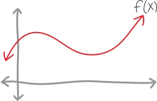
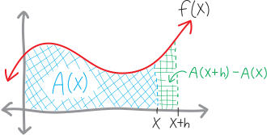
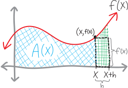
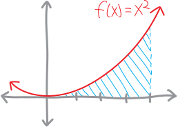
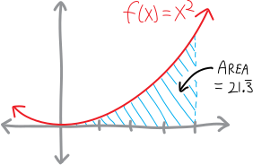
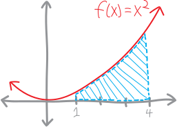
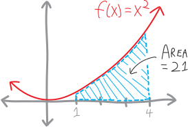
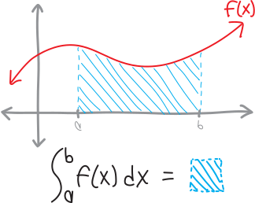

**For all the formulas and the formalism**, despite the rigors of the difference quotient and the difficulties of the quotient rule, calculus is about just two ideas: slopes and areas. These are two ideas that seem to have nothing in common with each other. And yet---as Newton and Leibniz discovered---these two operations are not only related, *they are the same operation*. Or, rather, they are inverses of each other: if we have a function, and we take its derivative, we get its slope. If we have a function and we take an antiderivative, we get its area. It makes sense that “slope” and “derivative” should be equivalent, since that was our very purpose in coming up with the formal idea of the derivative, but Newton and Leibniz's remarkable realization was that *area is just an antiderivative*.

Let me try to show you why. Imagine we have some function $f(x)$:

And imagine that the area beneath this function, from the origin out to some point $x$, is given by the function $A(x)$:

Obviously, we don't yet know what $A(x)$ is; our goal is to find some sort of formula for it. So bear with me. What if we want to find not the area underneath $f(x)$ from $0$ to $x$, but just the area of a little sliver---from $x$ to a point, say, $h$ units beyond it, $x+h$.

We can actually come up with a formula for this little sliver using our function $A(x)$. We know that the area from $0$ to $x$ is $A(x)$. But $x$ could be anything---it could be $5$, it could be $6$, it could even be $x+h$. So the area from $0$ to $x+h$ must be $A(x+h)$. But we don't want to find the area from $0$ to $x+h$---we want to find the area from $x$ to $x+h$. So all we need to do is take the area from $0$ to $x+h$, and subtract that big chunk we don't want---subtract the area of the region from $0$ to $x$.

So then the area of our little sliver is $A(x+h)-A(x)$:

But there's another way that we can find this area. Namely: this is a little sliver, not a giant plank. $h$ is pretty small. So then the region from $x$ to $x+h$ is probably pretty close to a rectangle. Sure, there's that curvy bit at the top, but because $h$ is reasonably small, that doesn't make that much of a difference. 

But we already know how to find the area of a rectangle: width times height. The width of this little sliver is $h$, and the height is approximately $f(x)$:

So then the area must be roughly $f(x)\cdot h$:

But then we have two different ways of writing the area of this sliver: the area is $A(x+h)-A(x)$, and the area is also (approximately) $f(x)\cdot h$. So we must have:

\begin{align*}
\text{approximate area } &\approx \text{  exact area}\\ \\
f(x)\cdot h \,\,&\approx \,\,A(x+h)-A(x)
\end{align*}

Or just:

\begin{align*}
f(x) \,\,&\approx\,\, \frac{A(x+h)-A(x)}{h}
\end{align*}

Moreover, as $h$ gets smaller and smaller, this approximation gets better and better---as $h$ goes to zero, these two things become *equal*:

\begin{align*}
\hspace{1in}\text{as }h \text{ gets}\, &\Bigg\downarrow\, \text{really small...} \\ \\
f(x) \,\,&=\,\, \lim_{h \rightarrow 0} \frac{A(x+h)-A(x)}{h}
\end{align*}

(One of the things I dislike about writing, as opposed to teaching in person, is that it's harder to toy with the timing. Because what I really want you to do right now is stare at that equation and let it sink in and realize what just happened.)

This looks horrifyingly familiar. We tried to find the area of this shape---and we ended up with Fermat's difference quotient. What this is telling us is that if we take the derivative of this equation for the area, $A(x)$, we get the equation for the curve, $f(x)$. Conversely, if we had the equation for the curve, and took an antiderivative, we'd get the equation for the area. Or: *the area beneath a curve is just the antiderivative of the curve.*

This is startling. 

{style='width:75%;margin-top:10em;margin-bottom:10em;'}

## Let's Use an Antiderivative To Find an Area!

Let's do a specific example of using an antiderivative to find an area! What we just found is that if we want to know the area underneath some curvy function, we can  take an antiderivative:
$$\substack{\text{the area between $f(x)$,}\\\text{the $x$-axis,}\\\text{and a vertical line at some point $x$}}\quad=\quad \text{the antiderivative of }f(x)$$
So, let's use that to find a curvy area! In particular, let's find the area underneath $x^2$ from $x=0$ out to $x=4$. The area looks like this:

It's a curvy shape! It's kinda triangular---and we know how to find the areas of triangles; we've known that for *years*---but it's not a triangle! It's curvy!

We just learned that if we want to find the area underneath $f(x)$ from $0$ out to $x$, it's just the antiderivative of $f(x)$. Here we want to find not the area from $0$ out to $x$, but from $0$ out to $4$. So we'll take the antiderivative of $x^2$, and then plug in $4$ for $x$. The antiderivative is:
$$\big(\text{antiderivative of }x^2\big) \,\,=\,\, \frac{1}{3}x^3$$
So then, for the area underneath $x^2$, we have:
\begin{align*}
\big( \text{area underneath $x^2$ from $0$ to $x$}\big) \,\, &=\,\, \frac{1}{3}x^3 \\ \\
\text{And when $x$ is $4$, this becomes:} \\
\big( \text{area underneath $x^2$ from $0$ to $4$}\big) \,\,&=\,\, \frac{1}{3}4^3 \\ \\
&= \frac1364 \\ \\
&= \frac{64}{3}\\ \\
&=21.\overline{3}
\end{align*}
So we have:

Yay! It's a curvy area! We calculated our first curvy area!!!

So, to summarize and generalize what we just did:

$$\boxed{  \substack{\text{the area between $f(x)$ and the $x$-axis}\\\text{from $x=0$ out to $x=b$}} \quad=\quad \substack{\text{the antiderivative of }f(x)\\\text{but with  }b\text{ plugged in for }x} }$$

## Let's Use an Antiderivative To Find a More Complicated Area!

What if we want to find the area beneath $x^2$, not from $x=0$ out to $x=4$, but from (say) $x=1$ out to $x=4$? 

We know how to find the areas under curvy shapes from $0$ out to some number, but how do we find the areas from some non-zero number out to some other number?? We can figure it out just using basic geometry! After all, the total area from  from $x=0$ to $x=4$ is just the area from $x=0$ to $x=1$, plus the area from $x=1$ to $x=4$:

$$\Big(\substack{\text{the total area between $x^2$ and the $x$-axis}\\\text{between the vertical lines $x=0$ and $x=4$}}\Big) \quad=\quad \Big(\substack{\text{the area between $x^2$ and the $x$-axis }\\\text{between $0$ and $1$  }}\Big) \quad+\quad \Big(\substack{\text{the area between $x^2$ and the $x$-axis }\\\text{between $1$ and $4$  }}\Big)$$

So then, to find *just* the area between $x=1$ and $x=4$, we can rearrange and subtract:

\begin{align*}
\Big(\substack{\text{the area between $x^2$ and the $x$-axis}\\\text{between the vertical lines $x=1$ and $x=4$}}\Big) &= \Big(\substack{\text{the area between $x^2$ and the $x$-axis }\\\text{between $0$ and $4$  }}\Big) - \Big(\substack{\text{the area between $x^2$ and the $x$-axis }\\\text{between $0$ and $1$  }}\Big) \\ \\
&= \Big(\substack{\text{the antiderivative of }x^2\\\text{but with  }4\text{ plugged in for }x}\Big) - \Big(\substack{\text{the antiderivative of }x^2\\\text{but with  }1\text{ plugged in for }x}\Big) \\ \\
&= \frac{1}{3}(4)^3 -\frac13(1)^3 \\ \\
&= \frac{1}{3}64 - \frac13 \\ \\
&= \displaystyle\frac{63}{3} \\ \\
&= 21
\end{align*}

Yay! So the area is just $21$! 

So, let's summarize and generalize what we did here! We wanted to find the area of some curvy shape, between two points on the $x$-axis (or two vertical lines), and we did that by subtracting antiderivatives:

$$\boxed{\substack{\text{the area between $f(x)$ and the $x$-axis}\\\text{between the vertical lines $x=a$ and $x=b$}} \quad=\quad \substack{\text{the antiderivative of }f(x)\\\text{but with  }b\text{ plugged in for }x} \quad-\quad  \substack{\text{the antiderivative of }f(x)\\\text{but with  }a\text{ plugged in for }x}}$$

# Let's Make Some Notation For the “Area” Function

\noindent Since we're talking about these areas, let's make some notation to make our lives a little easier. Let's call this function for the area an **integral**, and define it thusly:

\begin{align*}\Large \int_a^b \! f(x)\,dx \,\,&=\quad \substack{\text{\Large the area between $f(x)$ and the $x$-axis,}\\\text{\Large between $x=a$ and $x=b$}} \\ \\
&= \Big( \substack{\text{the antiderivative of }f(x)\\\text{but with  }b\text{ plugged in for }x} \Big) \quad-\quad \Big( \substack{\text{the antiderivative of }f(x)\\\text{but with  }a\text{ plugged in for }x} \Big)\end{align*}

We pronounce this as “the integral from $a$ to $b$, of $f(x) \, dx$.” This is just a fancy notation for a very simple idea: the idea of area. So, for example, in the first example, to find the area of $x^2$ from $0$ out to $4$, we found:
$$\int_0^4 x^2\,dx = 21.\overline{3}$$
In the second example, to find the area of $x^2$ from $0$ out to $4$, we found:
$$\int_1^4 x^2\,dx = 21$$
Don't worry about the “$dx$” part. For now, you can just think of it as being like a closing parentheses, telling us what's inside the content of the integral and what's not (as well as telling us what the variable is).\footnote{I wonder, though, if there's any relationship between this “$dx$” and the “$dx$” in our $\frac{dy}{dx}$ notation for a derivative...}

## Problems

For each of the following: sketch the area,  describe it using integral notation, and then calculate it (using antiderivatives).

<ol class='problems'>
<li> The area between the $x$-axis, the function $f(x)=x^2$, and the vertical lines $x=0$ and $x=5$. </li>
<li> The area between the $x$-axis, the function $f(x)=x^2$, and the vertical lines $x=2$ and $x=5$. </li>
<li> The area between the $x$-axis, the function $f(x)=x^2+7$, and the vertical lines $x=0$ and $x=5$. </li>
<li> The area between the $x$-axis, the function $f(x)= 4x^3$, and the vertical lines $x=0$ and $x=2$. </li>
<li> The area between the $x$-axis, the function $f(x)= 4x^3+2$, and the vertical lines $x=0$ and $x=3$. </li>
<li> The area between the $x$-axis, the function $f(x)= 4x^3+2$, and the vertical lines $x=1$ and $x=3$. </li>
<li> The area between the $x$-axis, the function $x^4$, and the vertical lines $x=2$ and $x=10$ </li>
<li> The area between the $x$-axis, the function $f(x)=5$, and the vertical lines $x=0$ and $x=7$. (You can do this one using calculus, but you can also do it without using calculus---explain!) </li>
<li> The area between the $x$-axis, the function $f(x)=2x+1$, and the vertical lines $x=3$ and $x=6$. (You can do this one using calculus, but you can also do it without using calculus---explain!) </li>
<li> The area between the $x$-axis, the function $f(x) = -(x-5)^2+9$, and the vertical lines $x=2$ and $x=8$ </li>
<li> The area between the $x$-axis, the function $f(x) = \sin x$, $x=0$, and $x=\pi$.  </li>
<li> The area between the $x$-axis, the function $f(x) = \cos (x) + 4$, $x=0$, and $x=2\pi$.  </li>
<li> The area between the $x$-axis, the function $f(x)=1/x^2$, and the vertical lines $x=1$ and $x=3$ </li>
<li> The area between the $x$-axis, the function $f(x)=-\frac{1}{x^2} + 5$, and the vertical lines $x=1$ and $x=10$ </li>
</ol>