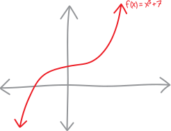
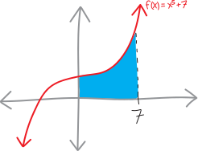
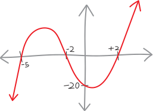
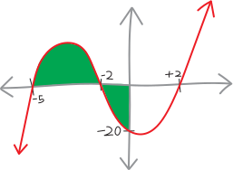
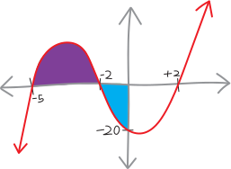
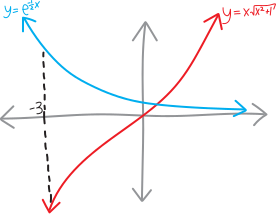
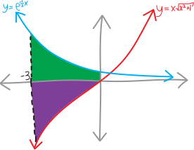

## problem one!

> Sketch the polynomial $f(x) = x^5 + 3$, and find the area bounded on the top by the polynomial, on the left by the $y$-axis/the line $x=0$; on the right by the line $x=7$, and on the bottom by the $x$-axis/the line $y=0$.

Let's start by drawing this! This looks like $x^5$ (which looks basically like $x^3$), but shifted up by three:

{ width=75% }

Meanwhile, the line $x=7$ is just a vertical line at $x=7$. So the area we want to find is this blue shape:

{ width=75% }

To calculate it, we can just take an integral:
\begin{align*}
\text{total area} &= (\text{the integral}) \\ \\
&= \left( \int_{0}^{7} x^3 + 5 \, dx \right) \\ \\
&= \Bigg[ \frac{1}{4}x^4 + 5x  \Bigg|_{0}^{7} \\ \\
&= \Bigg(\, \frac{1}{4}7^4 + 5\!\cdot\!7 \,\Bigg) - \Bigg(\, \frac{1}{4}0^4 + 5\!\cdot\!0 \,\Bigg) \\ \\
&= \Bigg(\, \frac{2401}{4} + 35 \,\Bigg) - \Bigg(\, 0 \,\Bigg) \\ \\
&= \frac{2541}{4} \\ \\ 
&= 635.25
\end{align*}
Yay!

Note how this shape is like a rectangle on the base (with width $7$ and height $7$) and then the curvy part on top---and how we see that come out in the algebra! The rectangular block gives us the $5\cdot7=35$ in the integral; the curvy parts give us the rest. 

## problem two!

> Consider the polynomial $f(x)=x^{3}+5x^{2}-4x-20$. Sketch it! What’s the total area (the total *area*, note, as distinct from the *integral*) between it and the horizontal/$y$-axis, between $x=-5$ and $x=0$? 

Let's draw this, too! But first we need to factor it. We can factor it by grouping. We have:
\begin{align*}
f(x) &= x^3 + 5x^2 - 4x - 20 \\
&= x^2(x+5) - 4(x+5) \\
&= \left(x^2-4\right)(x+5) \\
&= (x+2)(x-2)(x+5)
\end{align*}
Great! So then this is a cubic polynomial with a $y$-intercept at $y=-20$, and roots at $x=-2$, $x=+2$, and $x=-5$. So it looks like:

{ width=75% }

And the area we want to find is green shape:

{ width=75% }

But note the complication! Part of this area is above the $x$-axis; part of it is below the $x$-axis. If we just take an integral from $x=-5$ to $x=0$, then that chunk below the $x$-axis will count as *negative*. We'll find the *net area* of this shape, but not its absolute area:

\begin{align*}
\substack{\text{the area}\\\text{of this shape}} \quad\neq\quad \substack{\text{the NET area}\\\text{of this shape}} \quad &= \text{(the integral from $x=-5$ to $x=0$)} \\
&=  \int_{-5}^{0} x^3 + 5x^2 - 4x - 20  \, dx \\ \\
&= \Bigg[  \frac{1}{4}x^4 + \frac{5}{3}x^3 - 2x^2 - 20x      \Bigg|_{-5}^{0} \\ \\
&= \left(  \frac{1}{4}(0)^4 + \frac{5}{3}(0)^3 - 2(0)^2 - 20(0)  \right) - \left(  \frac{1}{4}(-5)^4 + \frac{5}{3}(-5)^3 - 2(-5)^2 - 20(-5)  \right) \\ \\
&= \frac{25}{12}
\end{align*}

So $25/12$ (or about $2.08$) is the *net* area of this shape---the area of the shape above the $x$-axis, minus the area beneath the $x$-axis. 

But that's not what we want! We want the total area. So to find that, we can just split this up into TWO regions. We'll find the area of the shape from $x=-5$ using one integral, and then find the area of the shape from $x=-2$ to $x=0$ using a second integral. But that second integral will be negative. So to find the actual area of that second part, we'll just absolute-value (or negate, or erase the existing negative) what we get! 

Let's split it up visually:

{ width=75% }

In other words, we'll have a calculation like:
\begin{align*}
\substack{\text{the area}\\\text{of this shape}} &= {\color{purple}  (\text{area of left purple chunk})} + {\color{blue} (\text{area of right blue chunk})}  \\ \\
&= {\color{purple} (\text{integral of left purple chunk})} + {\color{blue} (\text{NEGATIVE integral of right blue chunk})} \\ \\
&= {\color{purple}  \left( \int_{-5}^{-2} x^3 + 5x^2 - 4x - 20  \, dx \right) }+ \, {\color{blue} -\left(\int_{-2}^{0} x^3 + 5x^2 - 4x - 20  \, dx \right)} \\ \\
&= {\color{purple}  \Bigg[  \frac{1}{4}x^4 + \frac{5}{3}x^3 - 2x^2 - 20x      \Bigg|_{-5}^{-2}} + \, {\color{blue} -\Bigg[  \frac{1}{4}x^4 + \frac{5}{3}x^3 - 2x^2 - 20x  \Bigg|_{-2}^0 } \\ \\
&= {\color{purple}  \left(  \frac{1}{4}(-2)^4 + \frac{5}{3}(-2)^3 - 2(-2)^2 - 20(-2)  \right) - \left(  \frac{1}{4}(-5)^4 + \frac{5}{3}(-5)^3 - 2(-5)^2 - 20(-5)  \right)} + \\
&\quad\quad {\color{blue} - \Bigg(\,\, \left( \frac{1}{4}(0)^4 + \frac{5}{3}(0)^3 - 2(0)^2 - 20(0)  \right) - \left( \frac{1}{4}(-2)^4 + \frac{5}{3}(-2)^3 - 2(-2)^2 - 20(-2)  \right) \,\Bigg)}  \\ \\
& \text{...perhaps consider whether doing all that arithmetic by hand is the best use of your finite time ...} \\ \\
&= {\color{purple} \frac{99}{4}} \quad+\quad {\color{blue} - \left(\frac{-68}{3}\right)} \\ \\
&= \frac{569}{12} \\ \\ 
&= 41.41\overline{6}
\end{align*}

Yay!

## problem three!

> Find the area between $y=x\sqrt{x^2 + 1}$, $y= e^{-0.5x}$, $x=-3$, and the $y$-axis.

Another fun area problem! Let's draw this. 

{ width=75% }

This is weird, because the area we want to calculate lies simultaneously above and below the $x$-axis! But we can just split it up into two shapes, like so:

{ width=75% }

And then, similar as to the last problem, calculate two seperate integrals. We'll do an integral from $-3$ to $0$ of $e^{-0.5x}$ to find the green area. Then we'll do an integral from $-3$ to $0$ of $x\sqrt{x^2+1}$ to find the purple area---except that integral will turn out to be negative, so to find the actual purple *area*, we can just negate (or absolute-value) it. Then we'll add them together!

<!-- from sage.symbolic.integration.integral import definite_integral
    
n(definite_integral( e^(-0.5*x) ,x,-3,0) - definite_integral( x*sqrt(x^2+1) ,x,-3,0)) -->

\begin{align*}
\text{total area} &= {\color{green} (\text{area of top green chunk}) }\,\,+\,\, {\color{purple}  (\text{area of bottom purple chunk}) } \\
&= {\color{green}(\text{integral of top green chunk})} \,\,+\,\, {\color{purple} (\text{NEGATIVE integral of bottom purple chunk})} \\ \\
&= {\color{green}\left( \int_{-3}^0 e^{-\frac12 x}dx \right)} + \,{\color{purple}  -\left(\int_{-3}^{0} x\sqrt{x^2+1}\, dx \right) } \\ \\
&= {\color{green}\Bigg[ -2e^{-\frac12 x}  \Bigg|_{-3}^0 }\,\,+\, \, {\color{purple} -\Bigg[  \frac{1}{6}\left(x^2 + 1\right)^{3/2} \Bigg|_{-3}^0  } \\ \\
&= {\color{green}\Bigg(\, \left(-2e^{-\frac12 0} \right) -  \left(-2e^{-\frac12 (-3)} \right)} \Bigg) \\
&\quad\quad + {\color{purple} - \Bigg(\, \left( \frac{1}{6}\left(0^2 + 1\right)^{3/2}  \right) - \left( \frac{1}{6}\left((-3)^2 + 1\right)^{3/2}  \right) \Bigg) } \\ \\
&= {\color{green} -2 + 2e^{-3/2}  } + {\color{purple} - \left(\frac16 - \frac16\sqrt10^{3/2}\right)  } \\
&\approx {\color{green} 6.963  } + {\color{purple}- -10.21 } \\
&\approx 17.171
\end{align*}

Note that we actually could have done this in a single integral! In our conception of integrals, ignoring the nuances of ``net area,'' we've seen that the relationship between integrals and areas is:
$$\substack{\text{area between $f(x)$}\\\text{and the $y$-axis}} \quad=\quad \int f(x)\, dx $$
Of course, the $y$-axis is really just the line $y=0$, so this is:
$$\substack{\text{area between $f(x)$}\\\text{and the line $y=0$}} \quad=\quad \int f(x)\, dx $$
And... what's actually been going on is that we've actually been *subtracting* these two lines/curves! We've been taking the line/curve on the top, $f(x)$, and subtracting the line/curve on the bottom, $y=0$:
$$\substack{\text{area between $f(x)$}\\\text{and the line $y=0$}} \quad=\quad \int f(x) - 0\, dx $$
But we could also have a bottom side of the shape that isn't just the $y$-axis/the line $y=0$! It cound be any random function!!! So if we have some shape with $f(x)$ on the top and $g(x)$ on the bottom, the area between these two curves is:
$$\substack{\text{area between $f(x)$}\\\text{and $g(x)$}} \quad=\quad \int f(x) - g(x)\, dx $$
Or:
$$\substack{\text{area between some top function}\\\text{and some bottom function}} \quad=\quad \int (\text{top function}) - (\text{bottom function})\, dx $$
So the calculation we just did would have looked like:
\begin{align*}
\substack{\text{area between $e^{-0.5x}$}\\\text{and the line $x\sqrt{x^2+1}$}} \quad&= \int_{-3}^0 \left( e^{-0.5x} \right) \,\,-\,\, \left( x\sqrt{x^2+1} \right) \,\,dx \\ \\
&\text{etc.}
\end{align*}
Integrals split up along addition and subtraction, so this would have resulted in all the same calculations (and the same answer). But we would have set it up with just a single integral, which feels cleaner!