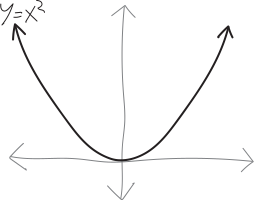
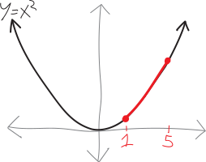
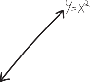
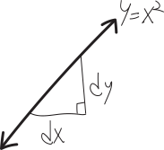
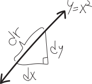
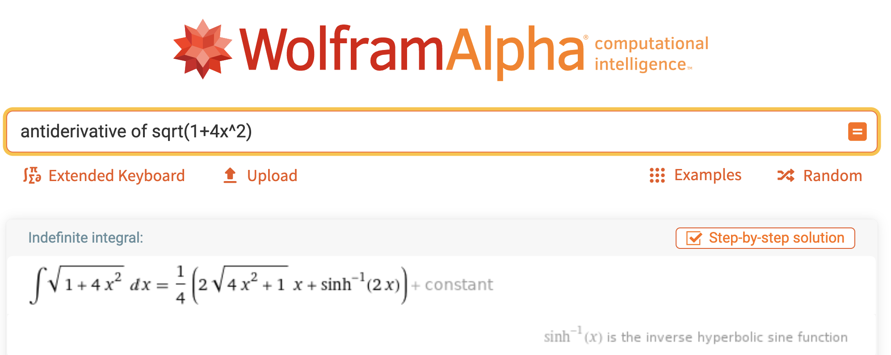
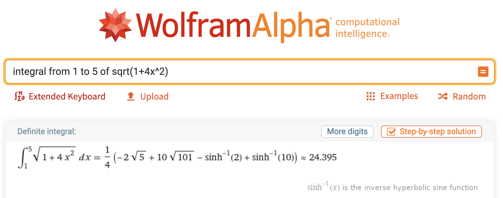

> *This is a bit of a digression. We're actually going to start the year by doing a lot of* not*-calculus. In order to do calculus in higher dimensions, we first need to learn how to live in the higher-dimensional world. That's what we're going to spend the first few months of this class doing---learning a hacky, quick-and-dirty version of **linear algebra**, as the fundamental tool we use to do higher-dimensional calculus with. But, because this* is *a calculus class, I wanted to start us off with some calculus! This is a fun derivation in one-dimensional calculus that you probably haven't seen before, and a lot of the ideas that come up foreshadow some big themes in MVC.*

How long are curvy lines? We know how to find the slopes of curvy lines. We know how to find the areas beneath curvy lines. But how do we find the *lengths* of curvy lines???

Let's think about our favorite function: a parabola!
{width=50%}
How long is this parabola? Okay, dumb question. Obviously it's infinitely long. It's going from $-\infty$ to $+\infty$. But what if we just think about a finite segment of it? Consider the chunk of this parabola from $x=1$ to $x=5$. How long is it?!?!
{width=50%}
If we were to take a piece of string, and place it perfectly parallel to every point on that parabola, how long of a piece of string would we need?

Hmm.

If it were a straight line, we could just make a triangle, a/k/a use the Pythagorean Theorem. But it's not a straight line.

OK. Not sure what to do.

The distance in the $x$-direction is $5-1=4$. So the length of the parabola must be longer than that. (Fancy word: the distance of its **projection** along the $x$-axis is $4$.) Likewise, its distance in the $y$-direction is $5^2-1^2=24$. So the length must be longer than that. (Same fancy word: the distance of its projection onto the $y$-axis is $24$.) But "longer than $24$" isn't that specific.

I guess we could think of this as being like a triangle. If we plop a triangle down on top if it, we could maybe get a better approximation for how long the parabola is?
{width=50%}
The relevant vertices of the triangle are $(1, 1)$ and  $(5,25)$, so if we find the length/distance between them, we'll get:
\begin{align*}
    \text{length} &= \sqrt{(25-1)^2 - (5-1)^2} \\
    &= \sqrt{24^2 + 4^2} \\
    &= \sqrt{592} \\
    &= 24.3311\dots
\end{align*}
{width=50%}
Of course, that's not the length of the parabola. It's probably *close* to the length. But parabolas are curvy! Triangles are straight! This is just an approximation! How can we get a better approximation? Can we get a *perfect* approximation? Maybe we could use a *lot* of tiny triangles!!!

Here's another idea. (Or rather, a different approach to the same idea: "approximating the length with an infinite number of tiny triangles" is, in fact, exactly how we'll figure this out.) Let's zoom in really, really, really close to this parabola. If we zoom in infinitely close, $x^2$, like any line, no matter how curvy, *will look like a straight line*:
{width=50%}
So we've zoomed in infinitely far, and now $y=x^2$ just looks like a straight line. We can go an infinitely-tiny amount $dx$ in the $x$-direction, and then $y=x^2$ will go up by an infinitely-tiny amount $dy$ in the $y$-direction:
{width=50%}
This is just like how when we're not infinitely-zoomed-in, we can go some distance in the $x$-direction, and the curve will move some distance in the $y$-direction. 

Meanwhile, $y=x^2$---i.e., the length of the curve itself---will move some infinitely-tiny length. Let's label that as $dr$:
{width=50%}
But because this is just a straight line, we just have a right triangle here, and so we can use the Pythagorean theorem to figure it out! We have just:
\begin{align*}
    (dr)^2 &= (dx)^2 + (dy)^2 \\
    dr &= \sqrt{ (dx)^2 + (dy)^2 }
\end{align*}
WAIT. Hold on a second. What's going on here? What do I mean by "infinitely-tiny length"? Isn't that be the same as $0$? Why did I label them as "$dx$" and "$dy$"? Does that have any connection to the Leibniz notation of a derivative, $dy/dx$??

OK, guys... we're getting back to the *core conceptual weirdness* at the heart of calculus. "`Weirdness" isn't even a strong enough word. We're getting back to the *core contradiction* at the heart of calculus. (And, more fundamentally, at the heart of the real numbers.) Namely: *how can things be infinitely close to zero, and yet not equal to zero?* How can we have a slope *at a single point*? How can we add up an infinite number of infinitely-narrow rectangles, and yet somehow get a (non-zero, non-infinite) area? This is the deep strangeness at the heart of calculus (and, equivalently, the real numbers). Ultimately, stuff like the epsilon-delta proofs you learned how to do last year are what (in some sense) resolves ("resolves") this conflict. But it took two hundred years from the time calculus was invented before people were reasonably confident that calculus wasn't, fundamentally, a pile of malarkey. (After all, you all remember the seventh grade proof that $0.\overline{9}=1$.) 

Does this make any sense? Because *it shouldn't*. It took the smartest people in the world hundreds of years to even begin to get a handle on it.

Anyway. So, here, $dx$ and $dy$ and $dr$ are quantities that are a) infinitely close to $0$, but b) not so infinitely-close to zero that they actually are zero. And there will indeed be a surprising connections to derviatives in a bit!

But first, let's bash through some algebra. Our goal here is that we want to find the infinitely-tiny length of an infinitely-tiny piece of the parabola $y=x^2$, and then add up all infinity of the infinitely-tiny lengths of $y=x^2$ between $x=1$ and $x=5$! That's the plan.

But there's a bunch of irritating algebra we need to do to make that a viable strategy. So far, we have:
\begin{align*}
    (dr)^2 &= (dx)^2 + (dy)^2 \\
    dr &= \sqrt{ (dx)^2 + (dy)^2 }
\end{align*}

This isn't helpful, because we don't really know what $dx$ or $dy$ are. They're just "an infinitely-tiny distance in the $x$-direction" and "an infinitely-tiny distance in the $y$-direction," respectively. So, let's do an algebra trick! We'll do one of the tricks where you multiply something by $1$, but a *special kind* of $1$. In particular, we'll multiply all this by $\frac{dx}{dx}$:
\begin{align*}
dr &= \sqrt{ (dx)^2 + (dy)^2}\cdot \underbrace{\frac{dx}{dx}}_{=1} 
\end{align*}

We know that $\frac{dx}{dx}$ is just $1$, so we can multiply random things by it without actually changing anything. Next, we're going to split *part* of that fraction up, and move *part* of it inside the square root (but not all of it):

\begin{align*}
dr &= \sqrt{ (dx)^2 + (dy)^2} \cdot\left( \frac{1}{dx} \cdot dx\right) \\
dr &= \sqrt{ (dx)^2 + (dy)^2} \cdot \frac{1}{dx} \cdot dx 
\end{align*}

We'll move the $1/dx$ part inside the square root. But to do so, we need to simultaneously square-and-square-root it:

\begin{align*}
dr &= \sqrt{ (dx)^2 + (dy)^2} \cdot \sqrt{\left(\frac{1}{dx}\right)^2} \, \cdot dx
\end{align*}

We're not actually changing anything, since we're square-rooting a square, but doing so lets us combine the square roots, and then bring $1/dx$ inside:

\begin{align*}
dr &= \sqrt{ \bigg( (dx)^2 + (dy)^2\bigg) \cdot \left(\frac{1}{dx}\right)^2 } \,\cdot dx\\
dr &= \sqrt{ \bigg( (dx)^2 + (dy)^2\bigg) \cdot \frac{1}{(dx)^2} } \,\cdot dx
\end{align*}

Then we can distribute things:

\begin{align*}
dr &= \sqrt{ (dx)^2\cdot\frac{1}{(dx)^2}  + (dy)^2\cdot\frac{1}{(dx)^2}  }\, \cdot dx \\
dr &= \sqrt{ \frac{(dx)^2}{(dx)^2}  + \frac{(dy)^2}{(dx)^2}  }\, \cdot dx
\end{align*}

Some stuff cancels:

\begin{align*}
dr &= \sqrt{ 1 + \frac{(dy)^2}{(dx)^2}  }\, dx
\end{align*}

Let's clean it up a bit:

\begin{align*}
dr &= \sqrt{ 1 + \left(\frac{dy}{dx}\right)^2  }\, dx
\end{align*}
And, golly gee, look at that!!! We have a $\frac{dy}{dx}$ in there! Is that a derivative? It is!!! We went from this magical "$dx$" and "$dy$" into a derivative! (And since we're talking about a parabola here, we know what its derivative is.) This seems like a lot of voodoo and hocus-pocus with notation---and it sort of is---but also---it works!!! You should be suspicious---you shouldn't totally trust this---but---just bear with me for a bit.

In this particular case, we have the parabola $y=x^2$, so we know what its derivative is, and we can plug that in:
$$y=x^2 \quad\implies\quad \frac{dy}{dx}=2x$$
Then the infinitely-small "length" of a parabola curve, at the point $x$, is:
\begin{align*}
\substack{\text{the infinitely-small length}\\\text{of the parabola $y=x^2$}\\\text{at an $x$-value of $x$}} =\, dr \,&= \sqrt{ 1 + \left(2x\right)^2  }\, dx \\
&= \sqrt{ 1 + 4x^2  }\, dx 
\end{align*}
So, we just need to add up all the infinitely-small lengths between $x=1$ and $x=5$. No problem! We'll find the infinitely-small length when $x=1$, and when $x=1.1$, and $x=1.01$, and I guess we'll need $x=1.001$, too, and all the other numbers between $1$ and $5$! And then we'll just add them up! Which... oh, darn. How many numbers are there between $1$ and $5$? There are *infinity* of them.
\begin{align*}
\substack{\text{the total length}\\\text{of the parabola $y=x^2$}\\\text{between $x=1$ and $x=5$}} \,=\, &\,\,\sqrt{ 1 +4\cdot \left(1 \right)^2  }\, dx \\
&+ \sqrt{ 1 +4\cdot \left(1.1 \right)^2  }\, dx \\
&+ \sqrt{ 1 +4\cdot \left(1.01 \right)^2  }\, dx \\
&+ \sqrt{ 1 +4\cdot \left(1.001 \right)^2  }\, dx \\
&+ \sqrt{ 1 +4\cdot \left(\substack{\text{ALL THE OTHER REAL NUMBERS}\\\text{BETWEEN $1$ AND $5$}} \right)^2  }\, dx \\
&\quad\vdots
\end{align*}
Okay, this is obviously a problem. 

Among the reasons it's a problem is that the real numbers are **[uncountable](https://www.google.com/search?q=countability+of+the+reals)**---meaning that even if we wanted to write them in an infinitely-long list, we couldn't. We can write the integers in an infinitely-long list:
$$1, 2, 3, \cdots,  n, \cdots$$
But there's no way to do this for the reals. (This was [originally proved by Cantor](https://www.google.com/search?q=uncountability+of+the+reals).) 

But even before all that, there's the more fundamental issue that we're adding up an infinite amount of things. How do we do that?!?

That part is easy! That's what an integral is! An integral is a way to add up an infinitely-large number of infinitely-small things, and get some normal finite number! You did this a million times last year!

\begin{align*}
\substack{\text{the total length}\\\text{of the parabola $y=x^2$}\\\text{between $x=1$ and $x=5$}} \quad&=\quad \substack{\text{add up all the }\\\text{infinitely-small lengths}}
\end{align*}

Phrasing this as an integral, it's just:
\begin{align*}
&= \int \text{all the infinitely-small lengths}
\end{align*}

We gave the label $dr$ to our infinitely-small lengths:

\begin{align*}
&= \int dr
\end{align*}

And we worked out an equation for $dr$, so we'll plug that in:

\begin{align*}
&= \int \sqrt{ 1 + \left(\frac{dy}{dx}\right)^2  }\, dx
\end{align*}

For the parabola $y=x^2$, this becomes:

\begin{align*}
&= \int \sqrt{ 1 + 4x^2  }\, dx
\end{align*}

Of course, it's not *all* the infinitely-small lengths we want to add up; it's just the ones between $x=1$ and $x=5$. But integrals already give us a way of dealing with that!!! We just integrate from $x=1$ to $x=5$:

\begin{align*}
&= \int_1^5 \sqrt{ 1 + 4x^2  }\, dx 
\end{align*}
Okay, now we have yet another problem. Namely: we don't know how to antidifferentiate that. If it looked like $x\sqrt{1+4x^2}$ we could use the chain rule, but there's no extra $x$ hanging around. Hmm. What to do?

Um, okay, don't tell anyone I'm doing this:

Huh. Okay, yeah, I definitely couldn't have figured that out myself. There's an inverse hyperbolic sine involved!!! What does that even mean??? **[Hyperbolic trig functions](https://en.wikipedia.org/wiki/Hyperbolic_functions)** are really cool---you know how normal trig functions are, like, points on a circle? Hyperbolic trig functions are *points on a hyperbola*. But, anyway, even though it's antidifferentiable, that's clearly not an antiderivative that any of us would have known.

To actually figure out the length of this parabola, we'll integrate the full thing:

Wolfram Alpha is based on Mathematica, a powerful computer algebra system/programming language/IDE. Nueva has a site license for it if you want to try it out. (Leonard sometimes uses it in his classes.) We also have a site license for Matlab, which is a competing computer algebra system. (Ted prefers Matlab.) I use Sage, which is an open-source computer algebra system---it's a Python superset that wraps together a bunch of helpful libraries (`NumPy`, `SymPy`, etc.) into a single package. In Sage, I'd calculate the antiderivative like so:

<pre>
from sage.symbolic.integration.integral import indefinite_integral
    indefinite_integral(
        sqrt( 1 + 4*x^2 ),
        x
    )

> 1/2*sqrt(4*x^2 + 1)*x + 1/4*arcsinh(2*x)
</pre>

And then to actually evaluate it, I'd calculate:

<pre>
from sage.symbolic.integration.integral import definite_integral
definite_integral( 
    sqrt( 1 + 4*x^2 ),
    x,
    1,
    5
 )
 
> 5/2*sqrt(101) - 1/2*sqrt(5) + 1/4*arcsinh(10) - 1/4*arcsinh(2)
</pre>

We can get a numerical approximation by the calling the `numerical_approximation()` method on it, abbreviated with just `n()`:

<pre>
definite_integral( 
    sqrt( 1 + 4*x^2 ),
    x,
    1,
    5
 ).n(digits=6)
 
> 24.3953
</pre>
I like Sage, because it's just Python, and so it's easily programmable---I can have a lot of control over what's going on, and compose things into larger programs. You can do that in Mathematica or Matlab, too, but Python is a language I already know and use for other purposes. Plus, Sage/Python is free and open-source, unlike Mathematica and Matlab. The advantage with Wolfram Alpha, though, is that it accepts input in natural language, so it can be very easy to quickly do a one-off calculation!

Anyway, how 'bout that answer?!?!
$$\substack{\text{the total length}\\\text{of the parabola $y=x^2$}\\\text{between $x=1$ and $x=5$}} \quad\approx\quad \ 24.3953$$
It's a little bit disappointing. The length of a straight line between $(1,1)$ and $(5,25)$, as we figured out, is just $\sqrt{592}\approx 24.3311$. So a parabola is only *slightly* longer. Parabolas aren't very curvy! I guess that's the lesson here. (Maybe I should have chosen a more exciting example.)

Of course, there's a more general lesson here as well. Namely, we now have a formula for the length of a curvy line:

$$\boxed{\substack{\text{the total length}\\\text{of the curve $y=f(x)$}\\\text{between $x=x_1$ and $x=x_2$}} \quad=\quad \int_{x_1}^{x_2} \sqrt{ 1 + \left(\frac{dy}{dx}\right)^2  }\, dx}$$

It's a formula that involves a derivative *and* an integral---what fun! 

Some vocab: the quantity $dr$---the infinitely-tiny distance along the curve---usually gets called the **differential arc length**, or the **differential curve length**. Sometimes people call it the **[line element](https://en.wikipedia.org/wiki/Line_element)**, especially if you're talking about fancier stuff. The two-dimensional analogue is the **surface element** (an infinitely-tiny two-dimensional area); the three-dimensional analogue is the **volume element** (an infinitely-tiny volume). In general this process (in 2D) gets called finding the **arc length** of a curve, or something like that.

Also: I wanted to do this construction with you guys right now, at the beginning of the year, less for its own sake (although it is a cool formula, and it is something we'll use again), and more because it foreshadows some big themes in MVC. Namely:
<ul>
<li> **Integrals are hard.** Sometimes they're easy. Sometimes they're dreadful. Analogously, think of division and logarithmancy:
<ul>
<li> We can easily calculate $10/5$ by hand, but not $10/7$. </li>
<li> We can easily calculate $\log_{2}(32)$ by hand, but not $\log_2(33)$.</li>
</ul>
Likewise with integrals. Integration is a *messy* operation. We've got to put on our gloves. Sometimes integrals are nice... other times, we'll have to use our silicon friends.</li>
<li> **Differentials and their ambiguous ontology**. Maybe $dx$ and $dy$ aren't just bits of notation that we toss into derivatives and integrals... maybe they're actual *numbers*, or actual *mathematical objects* that we can play with just like we can play with all our other mathematical objects!
</ul>

## Problems

OK, it's kinda plug-and-chug, but, uh, figure out the length of the following curves (and do so *without a calculator*, unless you absolutely can't, in which case you can use a technological tool, so long as you feel guilty about it). 

Sketch each of the following curves, too.
<ol class='problems'>
<li> The length of $f(x)=x^{3/2}$ between $x=0$ and $x=2$.</li>
<li> The length of $f(x)=\frac{x^2}{8} - \ln(x)$ between $x=1$ and $x=2$.</li>
<li> The length of $f(x)=\frac{1}{3}\left(x^2+2\right)^{3/2}$ between $x=0$ and $x=a$.</li>
<li> The length of $f(x)=\ln\left(\sin x\right)$ between $x=\pi/4$ and $x=\pi/3$.</li>
<li> The length of $f(x)=\sin(x)$ between $x=0$ and $x=\pi$.</li>
<li> The length of $f(x)=xe^{-x}$ between $x=2$ and $x=3$.</li>
<li> The length of $f(x)=e^x$ between $x=0$ and $x=1$.  <!-- hard but cool? parts??? good review of integration --> </li>
</ol>

<ol class='problems'>
<li> Let's think a bit more about the parabola $y=x^2$. Its  average slope between $x=1$ and $x=5$ is:
$$\frac{\text{change in $y$}}{\text{change in $x$}} =  \frac{25-1}{5-1} = \frac{24}{4}  = 6$$
But it doesn't have a slope of $6$ the entire time between $x=1$ and $x=5$. It's curvy! At first, the parabola is shallower; at the end, it's steeper. At first, the slope is less than six; at the end, it's greater than six. But at some point in between, the parabola will have a slope of exactly $6$! Where? </li>
<li> How *curvy* are curvy lines??? We can measure the lengths of curvy lines; we can measure the slopes of curvy lines... what if we want to somehow come up with a measurement of the *curviness* of a line? </li>
</ol>
