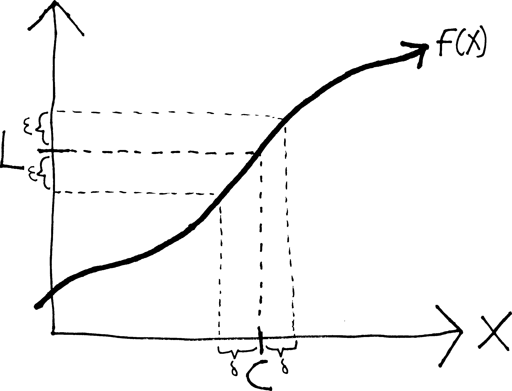
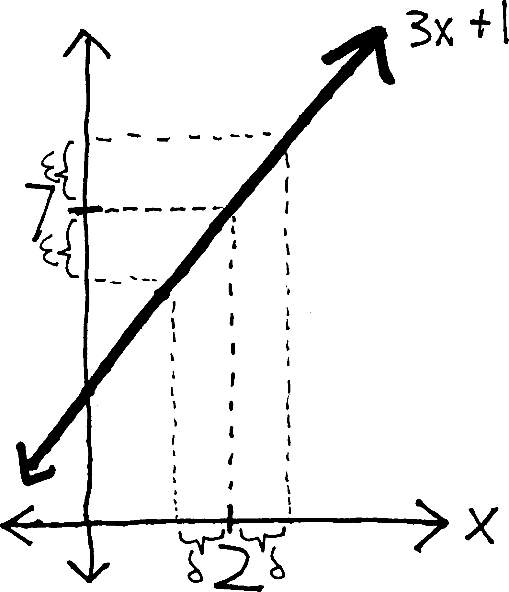
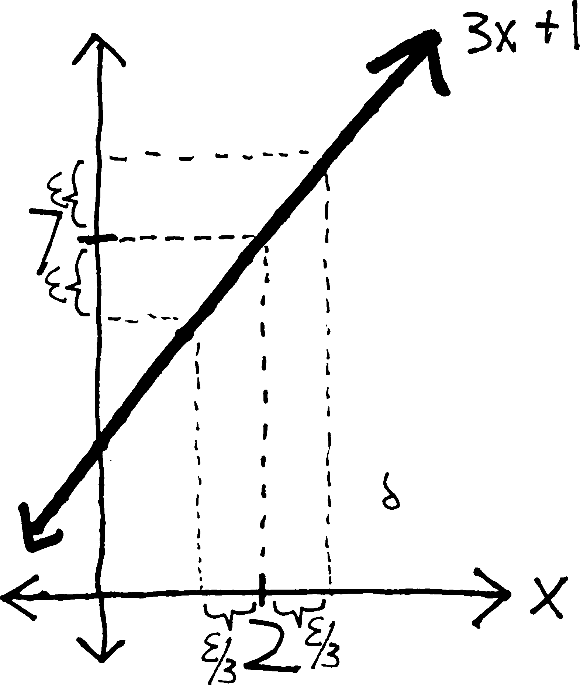
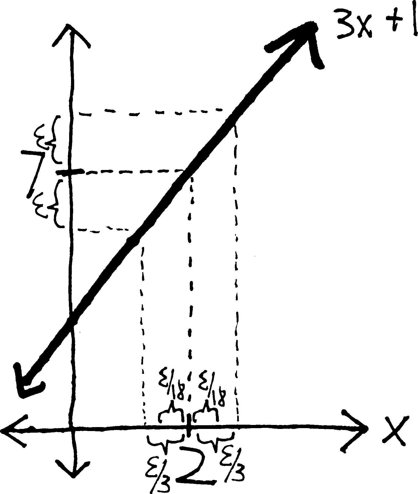
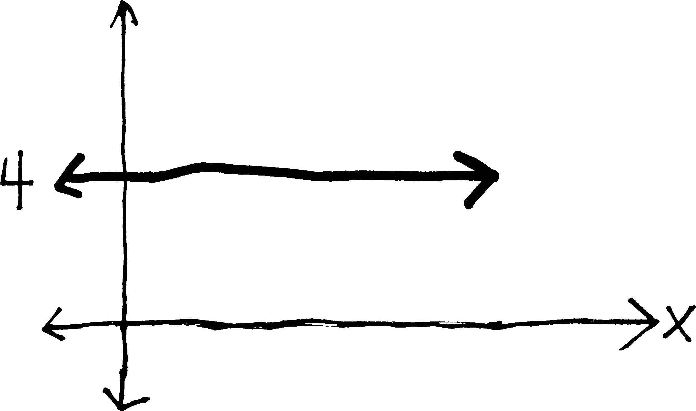
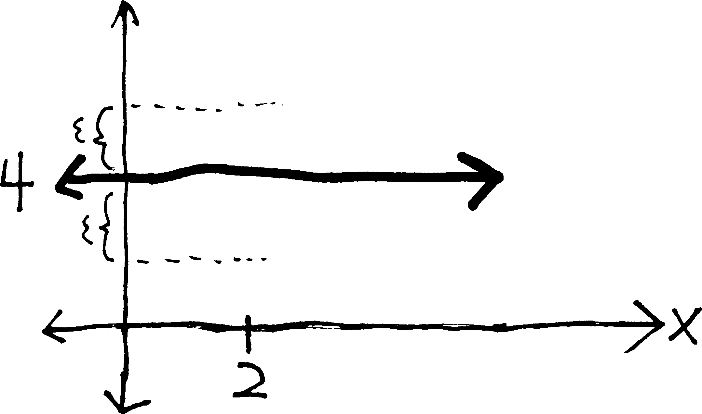
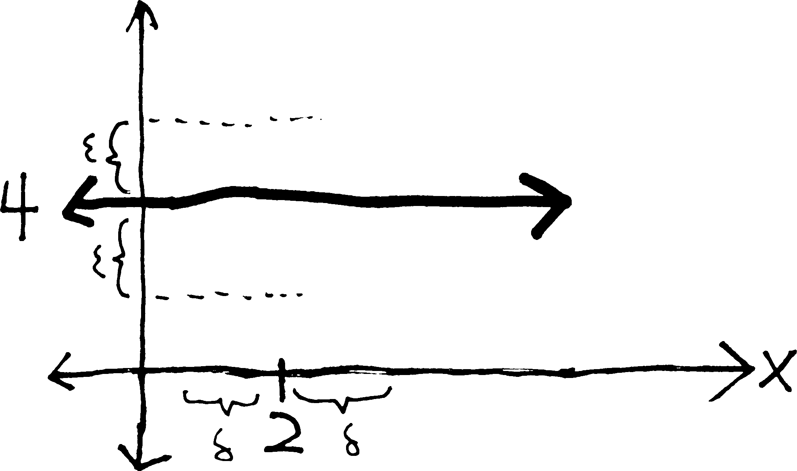

## A Brief History of The Calculus:

* Late 1660s. Isaac Newton (1643-1727) and Gottfried Leibniz (1646-1716) invent calculus, more-or-less simultaneously. Though their methods have some differences, they are both essentially based on the idea of the infinitesimal---of making the $h$ in Fermat's difference quotient infinitely small. Calculus immediately proves to be immensely useful, but there is nervousness over the question of "aren't we just dividing by zero?". The philosopher George Berkeley (1685-1783), better known for his metaphysical positions, writes an entire treatise (c. 1734) attacking the foundations of calculus, famously calling infinitesimals "ghosts of departed quantities."
    * The infinitesimal method has the added complication of involving the concept of "infinity," which brings in all sorts of philosophical and theological concerns. The prevailing belief until the end of the 19th century is that anything involving "infinity" is *ipso facto* divine and thus intractable. Infinitesimals, the belief is, do not exist.
* The early-to-mid 19th century. After 150-plus years of foundational uncertainty and embarrassment, calculus is finally saved when Augustin-Louis Cauchy (1789-1857), Bernhard Bolzano (1781-1848), and Karl Weierstrass (1815-1897), among others, develop the concept of a limit and give it a rigorous definition. Nowhere in their formulation of a limit do they use the idea of an infinitesimal---their limit only involves variables becoming "closer and closer" or "arbitrarily close" to points. They then define the derivative using a limit, and calculus is saved.

* Mathematicians move on to other interesting questions. But in the late 1950s, UCLA mathematician Abraham Robinson (1918-1974) shows that infinitesimal numbers *do* actually exist---that in the same way that we can add on to the integers to make the rational numbers, or add on to the real numbers to make the complex numbers, we can add on infinitesimals to the real numbers (to make the **hyperreals**). And then we can do calculus just in the way that Newton and Leibniz intended. (The actual proof of the existence of infinitesimals is quite elaborate, and requires quite a bit of modern mathematics.)

## Some More Background

Let's remind ourselves of where we are. We wanted to find a way of finding the slopes of smooth curves. So we derived Fermat's difference quotient ($f(x+h)-f(x) \,\, /h$), and then said that as $h$ gets smaller, the difference quotient (the approximate slope) approaches the derivative (the exact slope). But it wasn't quite clear what we meant by "as $h$ gets smaller," because we were basically just plugging in $0$ for $h$. And we soon realized that this was quite terrible, because it meant we were dividing by zero. So we tried to fix this by elaborating on what we meant by "as $h$ gets smaller." We generalized this by considering what a function $f(x)$ gets close to as $x$ gets close to something else, and we called this a "limit." Thus, we decided that we could formalize this concept of a derivative by including a limit in it; i.e., if we were to take the limit of the difference quotient, we would have the derivative:
$$f'(x) = \lim_{h\rightarrow 0}\frac{f(x+h)-f(x)}{h}$$
But there is a problem with all this. Namely, *we still don't know what a limit is*. I mean, we "know" what it is, in an intuitive sense---$\displaystyle \lim_{x\rightarrow c}f(x)$ is what $f(x)$ gets close to, as $x$ gets close to $c$---but this is not a particularly rigorous/formal/mathematical definition. We are still saying "close to," and what does that mean???

In a very serious way, then, we are in no better a place than we were when we realized that our procedure for finding a derivative involves dividing by zero. *We haven't actually improved our situation*. We have a better grasp of what goes on when we take a derivative (the difference quotient has a hole at $h=0$, and so we find the presumptive $y$-value of the hole), but all we've really done to fix this problem---to find the $y$-value of the hole---is to make up this nonsense about ``closer and closer''. We've tried to talk around the problem---we've said "well, $h$ isn't actually zero, blah blah, but it gets close to $0$, and then the difference quotient gets close to the derivative"---but this is really no different than what we started our investigation of derivatives by saying. We are still saying that "$h$ gets closer to $0$," and it is totally unclear what this actually *means*, in a real, mathematical sense. It is totally unclear *whether we actually can do this*, or whether, like some interlocutor in a Socratic dialogue, we have simply been building a grander and grander rhetorical edifice in top of something that is, fundamentally, sophistry. We've given a fancy name to this procedure---we've called it a "limit"---but we don't actually understand it. Put differently: *we still don't know that all of calculus isn't a lie*. 

We would like to have some certainty. We'd like to know whether calculus works or not (and if it works, why it works). As it turns out, calculus *does* work. There are two ways to explain it. One way is to say that

* infinitesimal numbers exist,
* the $h$ in the difference quotient is an infinitesimal number, and
* thus, calculus works. 

The other way is to say that:

* limits exist,
* the derivative is an example of a limit (the limit of F.'s D.Q. as $h\rightarrow 0$), and
* thus, calculus works.

The second method is the method we have already begun developing, and which we will continue. This is the method of the great 19th century mathematicians---Cauchy, Bolzano, Dedekind, Weierstrass---who solved the 200-year-old problem of calculus's foundations, and saved it from metaphysical gloom. We will follow their method, not because it is neccesarily better or worse than the first method---in fact, I actually believe that the first method---the method of developing calculus through infinitesimals---by the way, the formal name for that is "non-standard analysis" (because "analysis" is the mathy word for "calculus"---I actually believe that method is somewhat superior---we will develop calculus using the method of limits, because

* Nearly every other calculus class uses that method, as does every advanced "real analysis" class. Thus, when you go on to take more calculus classes in college, you'll be familiar with the method of $\epsilon$-$\delta$ proofs, and already good at them.
* To actually prove that infinitesimal numbers exist requires a substantial amount of mathematics---far more than what you guys know. However, to prove that limits exist is not as onerous---you are more than capable of understanding them. Thus, you can actually understand, for yourselves, how this remarkable problem was solved, whereas with the infinitesimal method, you'd have to be content with me assuring you that infinitesimals do, in fact, exist.
* That said, to actually understand the deep, foundational, mathematical machinery of a limit (i.e., why and how limits actually exist) is not particularly easy. The level of abstraction involved in the formal definition of a limit is substantial. It will be difficult. It will be challenging. And this will be good for you---it will be a brutal mathematical workout, from which you will emerge much stronger. 

I guess there is actually a third way of developing calculus. Namely, we could:

* pretend that the $h$-gets-smaller/division-by-zero problem isn't actually a problem, and
* just continue finding formulas for derivatives and whatnot.

This is how we started doing calculus. And we were able to get pretty far---we found a formula for the derivative of any polynomial, and we had an educated guess about the formulas for the derivative of sine and cosine. In fact, this is how people did calculus for 200 years. They pretended that these very basic, very foundational problems weren't actually problems, and they plowed ahead, to much success. So in a sense, whether we develop calculus using infinitesimals or limits or sophistry is irrelevant---because when we actually *do* calculus, when we actually find formulas for derivatives and integrals and do word problems and whatnot, none of this will actually come into play. It is, in a sense, useless. 

But we are not concerned with utility. We are concerned with truth---with the truth of the calculus.

## What We Talk About When We Talk About Limits

What do we mean when we say^[Where do I put the question mark? I've asked a question, but I can't put the question mark until the question is finished. Do I put it beneath the equations? to the right side of them? do I do the Spanish thing and start with an upside-down question mark???]: 
$$\lim_{x \rightarrow c} f(x) = L\hspace{.3in}\text{or equivalently:} \quad f(x) \,\, \xrightarrow[\quad c \quad]{x} \,\, L$$
We mean:

> As $x$ gets closer and closer to $c$,
>
> 

 $f(x)$ gets closer and closer to $L$

or, put differently:

> The closer that $x$ gets to $c$, 
>  the closer that $f(x)$ gets to $L$.''

or, yet differently:

> We can make $f(x)$ as close to $L$ as we want, 
>
> simply by making $x$ close enough to $c$.

The important thing is, we're never saying that $x$ is infinitesimally close to $c$---we're never using this idea of the infinite. If you're a 19th century mathematician, this is very important. But can we make this more mathematical? Let's start with the third definition. In many ways this is the worst of the lot, because we have agency in there (will the limit still exist if "we" aren't around to take it?) and desire (why should we "want" $f(x)$ to be anything?). 

We can note that this definition really has two parts. In order for something to be a limit, we need

* to know how close we want $f(x)$ to be to $L$, and
* determine how close $x$ must be to $c$ to ensure this.

But how can we say this more mathematically? We are still saying "close," which is vague. Can we measure it? How do we measure closeness? Imagine the following dialogue:

> **Ezra**: I live close to the Metropolitan Museum of Art.
>
> **Cornelius**: That's kind of vague. How close?
>
> **Ezra**: Really close.
>
> **Cornelius**: Well, I live "really close" to the sun, compared to someone who lives in another galaxy. Seriously, how close are you to the Met?
>
> **Ezra** : Three blocks.

We measure closeness---i.e., distances---with numbers! In particular, we usually measure them with real numbers (since we think of distance as being a continual thing---distance (usually) doesn't jump in increments, like the integers do), and we usually have those real numbers be nonnegative (since if we're just talking about distance, we don't have a sense of direction, and thus negatives). Positive real numbers (or $0$). That's how we measure distance.

So let's rephrase this, however awkwardly:

> No matter what positive real number we use in specifying how close we want $f(x)$ to be to $L$, 
> 
> we must be able to find how close $x$ must be to $c$ (measured as a positive real number), 
>
> in order to ensure that $f(x)$ is that close to $L$. 

But let's be a bit more clear here:

* The small positive real number used in measuring how close we want $f(x)$ to be to $L$---let's call that $\epsilon$.
* And the small positive real number used in measuring how close $x$ needs to be to $c$---let's call that $\delta$.

{width=50%}

Presumably $\epsilon$ and $\delta$ are related to each other---presumably, as $\delta$ gets smaller, $\epsilon$ will get smaller, too. If we want $\epsilon$ to be smaller, we'll need to have a smaller $\delta$. And, of course, $\epsilon$ could be anything---we could want $f(x)$ to be within $10$ units of $L$, within $2.3$ units of $L$, or within $1/1,000,000$ of a unit of $L$. Whatever that distance is, is $\epsilon$.

So we mean:

> For every positive real number $\epsilon$, 
>
> there is a positive real number $\delta$ (that depends on $\epsilon$), such that
>
> if $x$ is within $\delta$ of $c$, then $f(x)$ is within $\epsilon$ of $L$.

But again, can we phrase this more mathematically? How can we say "within such-and-such-distance of such-and-such" in a more formal way?

"$f(x)$ is within $\epsilon$ of $L$" means that

the distance between $f(x)$ and $L$ is less than $\epsilon$,

which means that $f(x) - L < \epsilon$, \medskip

except when we talk about distance, we don't care about direction, and so we'll take an absolute value: $| f(x) - L | < \epsilon$

Likewise...

$x$ is within $\delta$ of $c$ means that 

the distance between $x$ and $c$ is less than $\delta$, 

which means that $x- c < \delta$, 

except with distance we don't care about direction, so let's absolute-value that: $| x - c | < \delta$

 So then, if we clean up our definition some more, what we mean by $\displaystyle \lim_{x \rightarrow c} f(x) = L$ is:

> For every positive real number $\epsilon$, there is a positive real number $\delta$ (that depends on $\epsilon$), such that if $|x - c| < \delta$, then $|f(x) - L| < \epsilon$

Put differently:

$$\overbrace{\text{For every positive real number }\epsilon}^{\mathclap{\text{no matter how close we want} f(x) \text{ to be to }L}},  \,\, \underbrace{\text{there is a number } \delta}_{\mathclap{\text{we can find how close }x\text{ must be to }c}}, \,\,  \overbrace{\text{such that if }|x - c| < \delta\text{, then }|f(x) - L| < \epsilon}^{\mathclap{\text{so that }f(x)\text{ actually is that close to }L}}
$$

Let us state this formally:\medskip

**The Epsilon-Delta Definition of a Limit**

The limit of $f(x)$ as $x$ approaches $c$ is $L$ if, for every positive real number $\epsilon$, there is a corresponding (positive real) number $\delta$ such that the following is true:

$$\text{if }| \, x - c \, | < \delta\text{, then }| \, f(x) - L \, | < \epsilon$$

And we write this as

$$\displaystyle \lim_{x \to c} f(x) = L \quad\text{ or }\quad f(x) \xrightarrow[\quad c \quad]{x}  L$$

<ul>
<li> First of all, it's hard. The $\epsilon$-$\delta$ definition of a limit, and resulting $\epsilon$-$\delta$ proofs are easily the hardest topic in first-year calculus---in fact, they are often skipped altogether (the "let's pretend dividing by zero isn't a problem" approach to calculus). The definition is abstract, abstruse, and hard to *feel*. I spent two pages (and an hour in class) simply explaining *where the definition comes from*. Most of the time, when we define mathematical objects, we just throw the definitions out there, because they're easy to understand. For instance, we define a rational function $f(x)$ as 
$$f(x) = \frac{p(x)}{q(x)},\,\text{where }p(x)\text{ and }q(x)\text{ are both polynomials.}$$
That's totally simple. All this junk about epsilons and deltas... much less so. </li>

<li> Note that this definition only works for a limit in which $x$ is approaching a finite number, and $f(x)$ is also approaching a finite number. If we had a limit either to or from $\pm \infty$, or where the function approaches $\pm \infty$, we'd have to make a slightly different definition. Because in those cases, we wouldn't have $x$ "getting closer and closer" to infinity; strictly speaking, what we'd have would be $x$ "getting bigger and bigger." So we'd need to modify things a bit. </li>

<li> Obviously $\epsilon$ and $\delta$, while they represent numbers, they are not explicit numbers *per se*. $\epsilon$ could be anything, and consequently, so could $\delta$. We want to simultaneously consider all the possible values of $\epsilon$---to account for letting $f(x)$ be within $2$ units of $L$, and $15$ units of $L$, and $1/3$ of a unit of $L$, and one-twenty-three-millionth of a unit of $L$---all at once. That we discuss $\epsilon$ and $\delta$ and not specific numbers is just one of the many layers of abstraction in this definition and these proofs.  </li>

<li> The other really weird thing about this definition is that (to use a mathy word) it's **non-constructive**. Meaning: it tells you what a limit *is*, but it doesn't tell you *how to find it*. If we want to find a limit, we still have to use the *ad hoc* methods we've been using all along. And then this definition can tell us whether the things we *think* are limits actually *are* limits. It is like having a calculator that doesn't tell you what $200\cdot374$ is, but will tell you whether $74,800$ is the correct answer or not. (A calculator that knows the answer, and will tell you if your answer is correct, but won't help you come up with the answer.)

As an analogy, compare these two ways of defining the number $e$:

* $e$ is the number such that the function $e^x$ is its own derivative (i.e., that $(e^x)' = e^x$).
* $\displaystyle e = \sum_{n = 0}^\infty \frac{1}{n!} = \frac{1}{0!} + \frac{1}{1!} + \frac{1}{2!} + \frac{1}{3!} + \frac{1}{4!} + \cdots$

The second way^[Note that $0! = 1$, so the first term isn't undefined or anything.] tells you how to actually *compute* $e$ as a decimal; the first way doesn't. Put differently, the second way is an *explicit* definition (a *construction*); the first way is an *implicit* definition. (This is not a perfect analogy and a mathematician might quibble a bit, but it gets the idea across.) </li>
</ul>

Having defined a limit, then, our next question is: can we use this definition to show that our intuitive calculations of limits are actually correct? that what we think are limits actually *are* limits, in accordance with this definition? Can we use this definition to show that $\displaystyle \lim_{x\rightarrow 5}3x + 1$ actually *does* equal $16$ (for example), or more importantly (for example) to show that $\displaystyle \lim_{h \rightarrow 0}\frac{(x+h)^2 - x^2}{h}$ actually does equal $2x$? 

As an analogy: we feel^[Meaning, "most of us."], intuitively, that murder is wrong. And we we write laws saying that if you murder someone, you go to jail. If you're a judge, you can't convict^[Granted, capital cases in the US are tried by jury. But some in some other countries (e.g., Japan) they are tried by judges. In any case, juries have to apply the law, too, rather than "feelings."] a murderer because you "feel" they did something wrong. You can only convict them because they violated the law. We might base the law in intuition, but for the sake of consistency and due process, we must formalize it.

Likewise with a limit. We've developed, over the past few weeks, a strong intuition for what a limit is. We can compute them pretty well. But we want to formalize that: we want to put our intuition down on paper, and make it clear enough so that a computer, or a robot, (or a judge) with no sense of what "closer and closer" or "approaches" means could still understand a limit. We want to make it mathematically valid. We want to find a way of giving it a logical basis, because only if we do that can we be sure that limits actually work/exist, and that they're not sophistical, and thus, that derivatives and the rest of calculus all work/exist, too. And we want to not just say "Here it is! This is the logical basis of a limit!" We want to connect it to our intuition---to show that it matches up with what our intuition for a limit is.

## Example

What if we have $\displaystyle \lim_{x\rightarrow 2} 3x+1$? Obviously, we know this limit is just $7$... but do we? how do we really *know* that the limit is $7$? Can we prove this? Using our definition of a limit?

Because here is the thing: it is our obvious intuition that the limit is 7. But we want to be totally formal and totally symbolic. Not being formal/rigorous is what got us into this mess in the first place---it was a lack of formality that had us happily dividing by zero to take all those derivatives, and convinced that this was fine. 

So if we want to prove that the limit is 7, we'll need to show that the statement "$\displaystyle \lim_{x \rightarrow 1} 3x + 1 = 7$" actually is in conformity/compliance with our rigorous, mathematical definition of a limit. Meaning we'll need to show that there *does* actually exist a number $\delta$, such that for every possible positive real number $\epsilon$, it is the case that if $|x - 2| < \delta$, then $| (3x + 1) - 7 | < \epsilon$.

{width=50%}

So in principle, all we need to do is show that if $x$ is within $\delta$ of $2$, then $3x+1$ is within $\epsilon$ of $6$. Put differently, we need to start with the statement $|x-2|<\delta$ and algebraically manipulate it to get $|3x+1 \,-\,7| < \epsilon$:
\begin{center}
\begin{tabular}{ r l p{7cm}}
$| x-c | $ &$< \delta$& (start) \smallskip \\
$| x - 2|$&$<\delta$& (substituting)\medskip \\

\multicolumn{2}{c}{etc.}\medskip \\

\multicolumn{3}{l}{ALGEBRA MAGIC GOES HERE!}\medskip \\

\multicolumn{2}{c}{etc.}\medskip \\

$|3x+1 \,-\,7|$ &$< \epsilon$& \smallskip \\
$| f(x) - L | $ &$< \epsilon$& (finished!) \smallskip \\
\end{tabular}
\end{center}
Here is the difficulty: we start with $\delta$ on the right side of the inequality, but then at the end we need to end up with $\epsilon$ on the right side. How do we get from $\delta$ to $\epsilon$? What is the relationship between $\delta$ and $\epsilon$? That's the algebraic way of putting that question; put graphically, this is the same as asking: if $3x+1$ is within $\epsilon$ of $6$, how close must $x$ be to $2$? (Because the distance from $x$ to $2$ is, by definition, $\delta$.) Maybe the distance between $x$ and $2$ has to be a third of the distance between $3x+1$ and $6$ (i.e., maybe $\delta = \epsilon/3$). Or maybe we'll be okay if the distance between $x$ and $2$ is less than twice the distance between $3x+1$ and $2$ (i.e., if $\delta = 2\epsilon$). We don't know. We could guess, and then just try to do the proof for various random values of $\delta$, but this wouldn't be particularly efficient. 

So here's a method we can use, at least for relatively simply functions, to make an educated guess about the relationship between $\epsilon$ and $\delta$. What if we, in a sense, work backwards? We want to prove $|x-2|<\delta \Rightarrow |3x+1 \,-\,7| < \epsilon$; what if we start with $|3x+1 \,-\,7| < \epsilon$ and try to manipulate it to get it to look like $|x-2| < (\text{epsilon and stuff})$? Then we could compare it to $|x-2|<\delta$, set $\delta = (\text{epsilon and stuff})$, and see if that works in our proof. 
\begin{center}
\begin{longtable}{ r l p{5cm}}
$| f(x) - L | $ &$< \epsilon$&  \smallskip \\
$| 3x +1 - 7|$&$<\epsilon$& (substituting)\smallskip \\
$| 3x - 6|$&$< \epsilon$& \smallskip \\
$| 3(x - 2)|$&$< \epsilon$&\smallskip \\
$|3|\cdot|x - 2|$&$< \epsilon$& (can factor out of abs. value) \smallskip \\
$3|x - 2|$&$< \epsilon$& \smallskip \\
$|x - 2|$&$< \epsilon/3$&\medskip \\
which looks a lot like: \\
$|x - 2|$&$< \delta$& 
\end{longtable}
\end{center}
We end up with $|x-2|<\epsilon/3$, which looks a lot like $|x-2|<\delta$! So perhaps the relationship between $\epsilon$ and $\delta$ is this: perhaps $\delta = \epsilon/3$. So this is suggesting (suggesting, not proving) that if we want $3x+1$ to be within $\epsilon$ units of $6$, then $x$ needs to be within $\epsilon/3$ units of $2$. 

{width=50%}

Put differently,

* if we want the function to be within $3$ units of $7$ (between $4$ and $10$), then $x$ has to be within $1$ unit of $2$; 
* if we want the function to be within $1$ units of $7$ (between 6 and 8), then $x$ has to be within $1/3$ of a unit of $2$ (between 1 and two-thirds and 2 and a third); 
* if we want the function to be within $1/10$ of a unit of $7$, then $x$ has to be within $1/30$ of a unit of $2$. 

Let's see if this is actually true---let's see if we can prove that if $x$ is within $\epsilon/3$ units of $2$, then $3x+1$ will be within $\epsilon$ units of $6$. If we can do so, then we'll prove that no matter how close we want $3x+1$ to be to $6$, we can make $x$ close enough to $2$ to make that the case. (We can make this jump because $\epsilon$ could be any number---hence "no matter how close...")
\begin{center}
\begin{longtable}{ r l p{7cm}}
$| x-c | $ &$< \delta$& (start) \smallskip \\
$| x - 2|$&$<\delta$& (substituting)\smallskip \\
$| x-2 |$&$< \epsilon/3$& (if $\delta = \epsilon/3$) \smallskip \\
$3|x - 2|$&$< \epsilon$& (multiplying) \smallskip \\
$| 3(x - 2)|$&$< \epsilon$& (can distribute into abs. value)\smallskip \\
$| 3x - 6|$&$< \epsilon$& (distributing) \smallskip \\
$| 3x +1 - 7|$&$<\epsilon$& (because $-6 = 1-7$)\smallskip \\
$| f(x) - L | $ &$< \epsilon$& (finished!) \smallskip \\
& \includegraphics[scale=.25]{andrewproof.png} &
\end{longtable}
\end{center}
YAY!!!! So the limit as $x$ approaches $2$ of $3x+1$ *is* 7!!!

Here's a question: what if $\delta$ were even smaller than $\epsilon/3$? Meaning: we've shown that if $x$ is within $\epsilon/3$ of $2$, then $3x+1$ is within $\epsilon$ of $7$. But what if $x$ were within, say, $\epsilon/18$ of $2$? what if it were even closer to $2$? 

Well, presumably if $x$ is even closer to $2$, then $3x+1$ will certainly still be within $\epsilon$ of $7$. Put differently: if we make the distance between $x$ and $2$ really really really small, presumably $f(x)$ will still be within the normal distance away from $L$.  ("Within" and the inequality are the key concepts here---we're *not* saying that $3x+1$ has to be *exactly* $\epsilon$ away from $7$; we're saying that it can be *at most* $\epsilon$ away from $7$, but if it's closer, more the better.)

{width=50%}

We can prove this:
\begin{center}
\begin{longtable}{ r l p{7cm}}
$| x-c | $ &$< \delta$& (start) \smallskip \\
$| x - 2|$&$<\delta$& (substituting)\smallskip \\
$| x-2 |$&$< \epsilon/18$& (if $\delta = \epsilon/18$) \smallskip \\
$18|x - 2|$&$< \epsilon$& (multiplying) \smallskip \\
$6\cdot3| x - 2|$&$< \epsilon$& (because $18=6\cdot3$)\smallskip \\
$6\cdot| 3(x - 2)|$&$< \epsilon$& (distributing the $3$) \smallskip \\
$6\cdot| 3x - 6|$&$< \epsilon$& (distributing more) \smallskip \\
$6\cdot| 3x +1 - 7|$&$<\epsilon$& (because $-6 = 1-7$)\smallskip \\
$| 3x +1 - 7|$&$<\epsilon/6$& (dividing $6$)\smallskip \\
$| 3x +1 - 7|$&$<\epsilon/6<\epsilon$& (because $\epsilon/6$ is certainly smaller than $\epsilon$)\smallskip \\
$| 3x +1 - 7|$&$<\epsilon$& (getting rid of middle (``transitivity''))\smallskip \\
$| f(x) - L | $ &$< \epsilon$& (finished!) \smallskip \\
& \includegraphics[scale=.25]{andrewproof.png} &
\end{longtable}
\end{center}
Yay! So, $\epsilon/3$ is sort of like an upper bound for $\delta$---it's the largest that $\epsilon$ can be and still have $3x+1$ be within $\epsilon$ of $6$. If we were to try this with, say, $\delta = \epsilon/2$, it wouldn't work---$3x+1$ might be further than $\epsilon$ away from $6$. But it certainly can be closer. 

You might think, "aren't we doing the same thing twice here? didn't we just do all of this, but backwards?" In a sense, this is true. But the direction in which we do this proof is very important. Here's what I mean by that: essentially, these types of very simple $\epsilon$-$\delta$ proofs have two steps. First, you find a relationship between $\epsilon$ and $\delta$; second, you prove that it works. Why isn't the first step sufficient for showing that it works?

Because as far as logic goes, direction *does* matter in if-then statements. Consider the two statements:

> If I kill someone, then I will go to jail.

and

> If I go to jail, then I killed someone.

These are not equivalent! The former is (hopefully) true; the latter, false. There are other reasons I might go to jail. I might have committed tax fraud. Consider another example:

> If I'm in Ithaca, then it's cold outside.

and

> If it's cold outside, then I'm in Ithaca.

Again, these are clearly not the same statement---one is always true, and the other, always false. (Ithaca is not the only place that is cold. Chicago is cold, too. And Archangel^[the city in northern Russia, where that scene from *Frankenstein* takes place].) So in the case of our $\epsilon$-$\delta$ proofs, we are trying to prove
> if $| x-c | < \delta$, then $| f(x) - L | < \epsilon$.

which is NOT the same as proving that:

> if $| f(x) - L | < \epsilon$, then if $| x-c | < \delta$.

Trying to use the fact that $| f(x) - L | \!<\! \epsilon \,\Rightarrow \,| x-c | \!<\! \delta$ to prove that $|x - c| \!<\! \delta \,\Rightarrow \,|f(x) - L| \!< \!\epsilon$ is like saying "It is cold outside; therefore, I am in Ithaca!" or "I am in jail; therefore, I killed someone!" It does not logically follow. (Remember that the double arrow $\Rightarrow$ is the way of writing if-then (a *conditional* or *implication*) in logical notation.)

You might also want to remember the truth-table for implication:
\begin{center}
\begin{tabular}{ c c c}
$A$ & $B$ & $A \Rightarrow B$ \\ \hline
$T$ & $T$ & $T$ \\
$F$ & $T$ & $T$ \\
$T$ & $F$& $F$ \\
$F$ & $F$ & $T$ 
\end{tabular}
\end{center}

## Weird Example

What if we want to prove that $\displaystyle \lim_{x \rightarrow 2}4$? Obviously this is just equal to $4$. The function $f(x) = 4$ is shockingly boring---no matter what $x$ is, it's always $4$.

{width=50%}

But how do we prove that $\displaystyle \lim_{x \rightarrow 2}4 = 4$? The first step, of course, is finding a relationship between $\epsilon$ and $\delta$---of finding out, if we want $f(x)$ to be within $\epsilon$ of $4$, how close $x$ has to be to $2$.

{width=50%}

But obviously, $x$ can be as close or far away from $2$ as we like. No matter how close $x$ is to $2$, $f(x)$ will always be within $\epsilon$ of $4$---because $f(x)$ always *is* $4$. Put differently: $\delta$ *can be absolutely anything*. It doesn't matter what $\delta$ is. 

{width=50%}

How do we show this algebraically? Well, we know, by our construction of the $\epsilon$-$\delta$ definition, that $\epsilon$ must be greater than $0$. (Part of the definition is that $\epsilon$ is a positive real number.) But if $0 < \epsilon$, then surely 
\begin{center}
\begin{tabular}{ r l p{7cm}}
$| 0 |$ &$< \epsilon$& (because $|0| = 0$) \smallskip \\
$| 4 - 4|$&$<\epsilon$& (because $4-4=0$)\smallskip \\
$| f(x) - L|$&$< \epsilon$& \smallskip \\
& \includegraphics[scale=.25]{andrewproof.png} &
\end{tabular}
\end{center}
We've proven it---surprisingly quickly! We never even had to use any knowledge of $x$ or $c$ or $\delta$. Because regardless of what $x$ and $c$ and $\delta$ are, $f(x) - L$ will *always* be less than $\epsilon$. Because $f(x) - L$ is *always* 0, and $\epsilon$ has to be a positive number. So then $|f(x) - L| = 0 < \epsilon$. Which is just what we showed up there.

If you're skeptical about our lack of inclusion of $|x-c| <\delta$, think about the logic^[Logic in the real, LOGICAL sense---not in the sense of, "Um, Mr. Alexander, can't we just do this problem using logic? Because it, like, makes sense. So it's logical. Right?"]. We want to show that $|x - c| < \delta \,\Rightarrow \,|f(x) - L| < \epsilon$, and the truth table for implication ("if-then") looks like this: 

\begin{center}
\begin{tabular}{ c c m{2.9cm}}
$|x - c| \!<\!\delta$ & $|f(x) - L| \!<\! \epsilon$ & $|x - c| \!< \!\delta$ \quad\quad\quad\quad 

$\Rightarrow \, |f(x) - L| \!<\! \epsilon$ \smallskip \\ \hline
$T$ & $T$ & $T$ \\
$F$ & $T$ & $T$ \\
$T$ & $F$& $F$ \\
$F$ & $F$ & $T$ 
\end{tabular}
\end{center}

If $|f(x) - L| < \epsilon$ is true, then $|x - c| < \delta \,\Rightarrow \,|f(x) - L| < \epsilon$ will always be true, regardless of whether $|x-c|$ is less than $\delta$ or not. And $|f(x) - L| < \epsilon$ *is* true. That's what we showed with algebra above. So it is true that $|x - c| < \delta \,\Rightarrow \,|f(x) - L| < \epsilon$; thus, we have satisfied the definition of a limit, and thus, $\displaystyle \lim_{x \rightarrow 2}4 = 4$.

## Weirder Example

TO COME

## We Mean Multiple Things When We Talk About Limits

Earlier, I used a legal analogy to describe the $\epsilon$-$\delta$ definition of a limit and $\epsilon$-$\delta$ proofs. I said that the definition was an attempt to formalize our intuition---to give limits a solid basis outside of our human minds, in the same way that we codify laws in order to be consistent and give due process. 

Now, occasionally, we might feel that the law doesn't accurately represent our intuition---that there is some loophole through which "bad guys" are, legally, doing the wrong thing. So then we might change the law such that the loophole is closed. Then what they are doing is illegal, and then they will go to jail. But even if we do that, we still have to rely on the law. We might be basing the law in intuition, but for the sake of consistency and due process, we must formalize it^[Of course---and this continues the analogy with morality---there are plenty of situations in which we *don't* have intuition about how things should be. If we are standing on a bridge next to a fat person, and see, below  the bridge, a train speeding out of control towards a half-dozen unsuspecting railworkers, should we push the fat guy off the bridge so that he falls onto the switch and diverts the runaway train onto a different track, saving the lives of the railworkers but losing the life of the fat guy? It is not clear. In this sort of situation we might want to revert to the formalism to develop our intuition---e.g., "I don't know, intuitively, what is right and wrong in this situation, but if we apply the laws..."].

Allow me to assert, then, that our current $\epsilon$-$\delta$ definition of a limit does *not* capture our complete intuition about what we mean by a limit. Consider, for instance:$$\displaystyle \lim_{x\rightarrow c} f(x) = \infty$$(Such as in the case of a vertical asymptote) What do we mean when we say this? We do *not* mean literally the same thing as in the case of $\displaystyle \lim_{x\rightarrow c} f(x) = L$; we do not mean ``as $x$ gets closer and closer to $0$, $f(x)$ gets closer and closer to infinity.'' It is somewhat oxymoronic to talk about something getting ``closer'' to an infinite magnitude. Previously, we have only discussed the cases of limits approaching finite numbers and becoming finite numbers; what if we have a function that (again, using the math terminology), "increases without bound"? What we mean is simply:

> as $x$ gets closer and closer to $0$,
>
> $f(x)$ gets bigger and bigger."

Or, put differently:

> I can make $f(x)$ as big as I want,
>
> simply by making $x$ close enough to $c$."

But, as before, we can measure distance (i.e., "big"ness and "close"ness) using a number!

> "No matter what positive number I use in specifying how big I want $f(x)$ to be, 
>
> I can find how close $x$ has to be to $c$ (measured as a positive number)
>
> such that $f(x)$ is, in fact, actually that big."

See a pattern here in our definition-construction? Let's be slightly clearer:

*  The positive real number used in measuring how big we want $f(x)$ to be---let's call that $M$.
* And the small positive real number used in measuring how close $x$ needs to be to $c$---let's call that $\delta$.

So then we can say:

>  For every positive real number $M$, 
>
> there is a positive real number $\delta$ (that depends on $M$), such that
>
> if $x$ is within $\delta$ of $c$, then $f(x)$ is greater than $M$.

But again, let's phrase this more mathematically.

"$f(x)$ is greater than $M$" means that $f(x) > M$ 

And...

"$x$ is within $\delta$ of $c$" means that 

the distance between $x$ and $c$ is less than $\delta$, 

which means that $|x- c| < \delta$.

So then what we mean by $\displaystyle \lim_{x \rightarrow c} f(x) = \infty$ is:

> For every positive real number $M$, there is a positive real number $\delta$ (that depends on $M$), such that if $|x - c| < \delta$, then $f(x) > M$.

Put differently:
$$\overbrace{\text{For every positive real number }M}^{\mathclap{\text{no matter how big we want} f(x) \text{ to be}}},  \,\, \underbrace{\text{there is a number } \delta}_{\mathclap{\text{we can find how close }x\text{ must be to }c}}, \,\,  \overbrace{\text{such that if }|x - c| < \delta\text{, then }f(x) > M}^{\mathclap{\text{so that }f(x)\text{ is at least that big}}}
$$

We could come up with analogous definitions for $\displaystyle \lim_{x\rightarrow \infty} f(x) = L$ and $\displaystyle \lim_{x\rightarrow \infty} f(x) = \infty$. In fact, you'll do just that in the homework. In fact, you could come up with a whole table of various limit definitions for the various possible limits of $x$ and $f(x)$:

\begin{center}
\begin{tabular}{ m{2cm} |m{3cm}| m{3cm}|}
 &\vfill $f(x)\rightarrow$ finite & $f(x)\rightarrow$ infinite \\ \hline
$x\rightarrow$ finite & \vspace{1.5cm}. &  \\ \hline
$x \rightarrow$ infinite &  &\vspace{1.5cm}.  \\ \hline

\end{tabular}
\end{center}

## Problems

For the following problems:

*  Find the value of the limit.
* Sketch the function, being sure to label the limit point (on the $x$) and a little $\delta$-neighborhood around it, and the limit value (on the $y$) and a little $\epsilon$-neighborhood around it.
* Write down the $\epsilon$-$\delta$ definition of a limit. Seriously. I know it's on this sheet, but you'll need to have more-or-less memorized, so you may as well practice.
* Using the  $\epsilon$-$\delta$ definition, find a feasible relationship between $\epsilon$ and $\delta$. (Graphically, does this make sense? does it seem, based on your sketch of the situation, that the relationship should be so?)
* Then do the actual proof: show that if $| \, x - c \, | < \delta$, then $| \, f(x) - L \, | < \epsilon$. You can do this by starting with $| \, x - c \, | < \delta$ and then, via substitution and algebraic manipulation (possibly painful manipulation, and keeping in mind the various properties of absolute values that you'll need), ending up with $| \, f(x) - L \, | < \epsilon$.

<ol class='problems'>
<li> $\displaystyle \lim_{x \rightarrow 3} (3x - 2)$ </li>
<li> $\displaystyle \lim_{x\rightarrow 1} (4x + 2)$ </li>
<li> $\displaystyle \lim_{x\rightarrow 5} (x)$ </li>
<li> $\displaystyle \lim_{x\rightarrow 0} (-x + 2)$ </li>
<li> $\displaystyle \lim_{x\rightarrow 4} \left(\frac{1}{2}x + 7\right)$ </li>
<li> $\displaystyle \lim_{x\rightarrow 2} (6x + 3)$ </li>
<li> $\displaystyle \lim_{x\rightarrow 7} (-2x + 19)$ </li>
<li> $\displaystyle \lim_{x\rightarrow 0} \left(\frac{5}{2}x + 3\right)$ </li>
<li> $\displaystyle \lim_{x\rightarrow 1} (4)$ </li>
<li> $\displaystyle \lim_{x\rightarrow \pi} (\pi)$ </li>
<li> $\displaystyle \lim_{x\rightarrow c} (k)$, where $c$ and $k$ are both constants. </li>
<li> $\displaystyle \lim_{x\rightarrow 4} (x - 6)$ </li>
<li> $\displaystyle \lim_{x\rightarrow 1} (2x - 7)$ </li>
<li> $\displaystyle \lim_{x\rightarrow -3} \left(\frac{1}{3}x - 4\right)$ </li>
<li> $\displaystyle \lim_{x\rightarrow c} (ax + b)$, where $a$, $b$, and $c$ are all constants. (This is the general case of the previous dozen or so problems... which, note, are all relatively simple linear functions. Epsilon-delta proofs get quite a bit tougher as the functions get more interesting. But, if you do an $\epsilon$-$\delta$ proof for this function, you've basically done it for every other linear function (and you can get the particular results by plugging in the appropriate values of $a$, $b$, and $c$.) </li>
<li> $\displaystyle \lim_{x\rightarrow 0} \frac{1}{x^2}$ </li>
<li> $\displaystyle \lim_{x\rightarrow 0} \frac{1}{x^4}$ </li>
<li> $\displaystyle \lim_{x\rightarrow -7} \frac{1}{(x+7)^2}$ </li>
<li> $\displaystyle \lim_{x\rightarrow 3} \sqrt{x+1}$ </li>
<li> $\displaystyle \lim_{x\rightarrow 0} (x^2)$ </li>
<li> $\displaystyle \lim_{x\rightarrow 0} (x^2 - 1)$ </li>
<li> $\displaystyle \lim_{x\rightarrow 3} \sqrt{3-x}$ </li>
<li> $\displaystyle \lim_{x\rightarrow 1} (x^2 + 3)$ </li>
<li> $\displaystyle \lim_{x\rightarrow -1} (x^2 + 3)$ </li>
<li> $\displaystyle \lim_{x\rightarrow 2} (3x^2 - x)$ </li>
<li> $\displaystyle \lim_{x\rightarrow 0} (x^2 + x -2)$ </li>
<li> $\displaystyle \lim_{x\rightarrow 0} (x^2 -4x - 5)$ </li>
<li> $\displaystyle \lim_{x\rightarrow 0} (x^3)$  </li>
<li> $\displaystyle \lim_{x\rightarrow c} (\, f(x) + g(x) \,) = \lim_{x\rightarrow c} f(x) +  \lim_{x\rightarrow c} g(x)$ (This is a fundamental property of limits! Hint: use the triangle inequality (one of the properties of absolute values).)
<li> $\displaystyle \lim_{x\rightarrow c} kf(x) = k\lim_{x\rightarrow c} f(x)$, where $k$ is a constant. (Again, this is another important limit property!) </li>
<li> $\displaystyle \lim_{x\rightarrow c} (\, f(x) - g(x) \,) = \lim_{x\rightarrow c} f(x) -  \lim_{x\rightarrow c} g(x)$  </li>
<li> $\displaystyle \lim_{h\rightarrow 0} \frac{(x+h)^2-x^2}{h}$  </li>
<li> $\displaystyle \lim_{h\rightarrow 0} \frac{(a(x+h) +b) -(ax+b)}{h}$ </li>
</ol>

<ol class='problems'>
<li> In the same manner in which we constructed the definitions for $\displaystyle \lim_{x\rightarrow c} f(x) = L$ and $\displaystyle \lim_{x\rightarrow c} f(x) = \infty$, come up with a suitable definition for $\displaystyle \lim_{x \rightarrow \infty}f(x) = L$. (Explain your reasoning!)</li>
<li> Using the definition you constructed above, prove that $\displaystyle \lim_{x \rightarrow \infty} \frac{1}{x} = 0$. 
<li> Likewise, construct a definition for $\displaystyle \lim_{x\rightarrow c} f(x) = -\infty$, and then prove that $\displaystyle \lim_{x\rightarrow 5} \frac{-1}{(x - 5)^2} = -\infty$ </li>
<li> Now come up with a definition for $\displaystyle \lim_{x\rightarrow \infty} f(x) = \infty$ (i.e., the case in which $x$ and $f(x)$ both get bigger and bigger), and then show that $\displaystyle \lim_{x\rightarrow \infty} x^2 = \infty$ </li>
</ol>
