> *Not the intense moment*  
> *Isolated, with no before and after,*  
> *But a lifetime burning in every moment*  
> ---T.S. Eliot, *East Coker*, 192-4

Our entire exploration of calculus began back in December with a single question:

> You are a lifeguard at the municipal beach in Churchill, Manitoba. One day, as you are sitting on your lifeguard chair next to Hudson Bay, you see a swimmer being attacked by a polar bear. The swimmer appears to be roughly 120 metres out to sea (on a straight line between the swimmer and the shore), and the lifeguard station is roughly 300 metres down the beach from the nearest point on shore to the swimmer. You can run at 13 metres per second along the beach, and you can swim at 5 metres per second. Given that you want to reach the swimmer as quickly as possible, how far down the beach do you run, and how far do you swim?

The problem is that we need to find the perfect balance between two competing desires. On one hand, we want to take the shortest possible route to the swimmer. But if we do that, we'd swim all the way, and we can't swim very fast. So maybe we want to spend the least amount of time swimming. But if we do that---if we run all the way down the beach and then hop in the water when we're only a short swim away---the total distance we travel will be quite long. That doesn't seem like it'll be the fastest route, either.

What we really want to do is find the perfect median between these two extremes: *find the path that minimizes the amount of time it takes to reach the swimmer*. 

Back in December, when we faced this question, we were only able to get as far as coming up with a function for the amount of time it takes to reach the swimmer (as a function of how far down the beach we run and how far we swim). To find what choice takes the *minimum* amount of time, we would have had to somehow have found the minimum of this function---but how were we to do that? 

We're finally in a position to be able to do that. Using our tools of calculus, we can finally find the minimum of that function---and, in doing so, save the swimmer. As we've discussed, the essential idea is that the minimum (or, for that matter, any extremum) is a point at which the function is neither increasing nor decreasing---a point at which the derivative of the function is zero. So all we need to do is come up with a function for the amount of time it takes to reach the swimmer, take a derivative, and then find what value(s) of $x$ make it equal to zero.

Let's first refresh our memory by coming up with the function for how long it takes to reach the swimmer. Our situation looks something like this:

Let's say that we run all but the last $x$ feet down the beach---i.e., we run $300-x$ feet down the beach---and then swim on a straight line out to the swimmer. If we abstract the relevant details, we get:

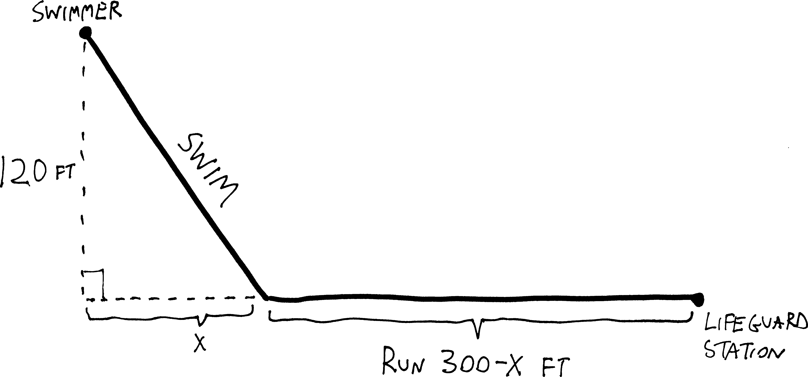

So what we want to do here is come up with a function for the amount of time it takes to reach the swimmer:
$$\text{total time} \quad=\quad \text{time running} \quad+ \quad \text{time swimming}$$
We're running at a constant rate of $13$ feet/second, and swimming at a constant rate of $5$ feet/second. And we know that if rate is constant, $\text{distance} = \text{rate}\cdot\text{time}$, or $\text{time} = \frac{\text{distance}}{\text{rate}}$. So the time it takes me to reach the swimmer will be:
$$\text{total time} \quad=\quad \frac{\text{distance running}}{\text{speed running}} \quad+\quad \frac{\text{distance swimming}}{\text{speed swimming}}$$
Or just:
$$\text{time}(x) = \frac{300-x}{\text{13}} + \frac{\text{distance swimming}}{\text{5}}$$
What's the total distance we swim? We can figure it out! We have a right triangle, with sides $x$ and $120$, so we can use the Pythagorean Theorem. So we  have:
$$120^2 + x^2 = (\text{distance swimming})^2$$
So:
\begin{align*}
x^2 &=  (\text{distance swimming})^2 - 120^2 \\ \\
x &=  \sqrt{120^2 + x^2 \,\,}
\end{align*}
So then, the total amount of time it takes to get to the swimmer, if we run $300-x$ yards down the beach, is:
$$\text{time}(x) = \frac{300-x}{\text{13}} + \frac{\sqrt{120^2 + x^2}}{\text{5}}$$
Were we to graph this---which we can't, because all those years of saltwater lifeguarding has corroded our TI-83s beyond use---but were we to graph this, presumably we'd see something like:

{width=75%}

How can we find where time is minimal? We just need to find where the slope of this function is zero. In other words, we need to find where its derivative is zero. So if we take the derivative, we get:
\begin{align*}
\text{time}'(x) &= \left(  \frac{300-x}{\text{13}} + \frac{\sqrt{120^2 + x^2}}{\text{5}} \right)'  \\
&= \left(\,  \frac{300}{13} \,-\, \frac{1}{13}x \,+\, \frac{1}{5}\sqrt{120^2 + x^2} \,\right)'  \\ \\
&= \left(\,  \frac{300}{13} \,-\, \frac{1}{13}x \,+\, \frac{1}{5}\left(120^2 + x^2\right)^{1/2} \,\right)'  \\ \\
 &= 0 - \frac{1}{13} \,\,+\,\, \frac{1}{5}\cdot\frac{1}{2}\cdot\left( 120^2 + x^2\,\right)^{-1/2} \cdot  \left(120^2+x^2\right)'\\ \\
 &= 0 - \frac{1}{13} \,\,+\,\, \frac{1}{5}\cdot\frac{1}{2}\cdot\frac{1}{\,\, \left(\,120^2 + x^2\,\right)^{1/2}\,\,}\cdot  2x\\ \\
&=  -\frac{1}{13} +\frac{x}{5\sqrt{120^2 + x^2\,}\,}
\end{align*}
And if we want to find what value of $x$ makes this zero, we can set it equal to zero and do some algebra. This algebra is gross, but oh well:
\begin{align*}
0 &= -\frac{1}{13} +\frac{x}{5\sqrt{120^2 + x^2\,}\,} \\ \\
\frac{1}{13} &= \frac{x}{5\sqrt{120^2 + x^2\,}\,} \\ \\
5\sqrt{120^2 + x^2} &= 13x \\ \\
5^2\left(120^2 + x^2\right) &= 13^2x^2 \\ \\
120^2 &= \frac{13^2}{5^2}x^2 -x^2 \\ \\
120^2 &= \left(\frac{13^2}{5^2} -1\right)x^2 \\ \\
\frac{120^2}{\,\,\frac{13^2}{5^2} -1\,\,} &=x^2 \\ \\
x &= \sqrt{ \frac{120^2}{\,\,\frac{13^2}{5^2} -1\,\,} } \\ \\
x&= 50
\end{align*}
So if we want to reach the swimmer in the least amount of time, we need to run all but the last $50$ yards down the beach, and swim from there! This means we'll need to run:
\begin{align*}\text{distance running: } &= 300-x \\
&= 250 \text{ feet}\end{align*}
and swim:
\begin{align*}\text{distance swimming: } &=\sqrt{120^2 + x^2} \\
&=  \sqrt{120^2 + 50^2} \\
&= 130 \text{ feet}\end{align*}
Great. How long does it take us to get out to the swimmer? We know how to get there in the minimal amount of time, but *how minimal is this minimum*? Well, we already have a function for how long it takes us to reach the swimmer as a function of $x$, and now we have an $x$ (i.e., $50$), so we can just plug that in:
\begin{align*}\text{time}(50) &= \frac{300-50}{\text{13}} + \frac{\sqrt{120^2 + 50^2}}{\text{5}}\\ \\
&\approx \underbrace{19.231}_\text{time running} + \underbrace{26}_{\text{time swimming}} \\ \\
& \approx 45.2 \text{ seconds}\end{align*}
So it will take us about $45$ seconds to reach the swimmer. Hopefully that's zippy enough to save them from the polar bear! 

## A video, not a photograph

There's a major flaw in the reasoning we just used. Namely: how do we know we didn't *maximize* the amount of time it takes to rescue the guy? If all we're doing is finding where the slope is zero, that could be a minimum. Or it could be a maximum. Or it could have been one of those weird cubicky indecisive points!

That's a big difference. If we're trying to minimize the amount of time it takes to reach the guy, and we end up *maximizing* the amount of time it takes to reach the guy... then we're no longer going to have a rescue situation; we're going to have a recovery situation. If we're a junior analyst at Goldman Sachs and we end up *minimizing* profit rather than *maximizing* profit... we're going to also minimize our paycheck. If we're trying to do such-and-such, and we end up not only not doing such-and-such, but *doing the exact opposite of such-and-such*, that's pretty bad!

So we need more nuance. Let's think about how to find maxima and minima in more detail. Say we have a function, and it has a minimum:

{width=75%}

What's the derivative of the function at that minimum? Zero! The function is flat. So its slope is zero! Let's sketch the slope, too:

{width=75%}

Now let's say that function continues, and we have a maximum:

{width=75%}

What's the derivative at that maximum? Also zero! Let's sketch that, too:

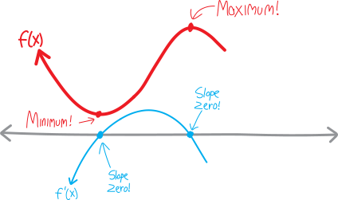{width=75%}

Hmm. Both minima *and* maxima have derivatives that are zero.

Let's say the function continues some more and we have one of those weird cubicky indecisive points, where it flattens out and *almost* becomes a minimum, but then changes its mind at the last moment and returns to going down:

{width=75%}

What's the derivative at that point? Well, the function is basically always decreasing, so the derivative is always negative, except for that one moment where it's flat, where the derivative is zero. So the derivative *bounces* off the axis at that point:

{width=75%}

So the derivative is zero at that cubicky indecisive point, too.

Eeek. All these points where the derivative is zero, corresponding to maxima and minima and neither!!! How do we tell the difference? How do we distinguish between maxima and minima and indecisive points!?! How do we figure that out, *algebraically* and *symbolically*, without needing a computer to graph things, only using *symbols on the page*? If we're just looking at places where the derivative is zero, we're lost in the fog of ambiguity. If the derivative is zero, we could have any of these three possibilities.

Here's the trick: we need to look at the *shape* of the derivative near where it's zero. We need to think about what's happening not *when* the derivative is zero---we know what's happening; it's zero; that's a tautology---but what's happening *near* when the derivative is zero. *We have a photograph, when what we need is a video*.

Let's look back at that drawing. The maximum and minimum happen where the derivative crosses the $x$-axis. But the indecisive point happens where the derivative *bounces* off the axis. So for a function to have an extremum, the derivative has to *cross through* the axis. It has to go from being positive to being negative, or from being negative to being positive. The derivative has to have not just a root, but a root of odd multiplicity, to use the language we learned last fall. If it bounces off the axis---if the derivative has a root of even multiplicity, to use our fancy throwback word---then we won't have an extremum. We'll have an indecisive point. 

So, there's some clarity.

But how do we distinguish between a minimum and a maximum? It's not just that the derivative crosses the axis. If we look closely at that drawing, we can see that the minimum happens when the function goes from decreasing to flat to increasing, i.e. when its derivative goes from negative to zero to positive. That means that the derivative itself has a positive slope! But the maximum, by contrast, happens when the function goes from increasing to flat to decreasing, i.e. when its derivative goes from positive to zero to negative, which is like saying that the derivative itself has a negative slope. 

Let's argue this in more detail. Visually, if the function goes from decreasing to flat to increasing:

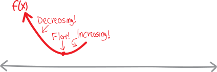{width=75%}

I.e., if the derivative goes from negative to zero to positive:

{width=75%}

Then that point is a minimum!!!

{width=75%}

But hold up a second. This minimum happens when the function goes from decreasing to flat to increasing, i.e. when its derivative goes from negative to zero to positive... but if the derivative goes from negative to zero to positive, isn't that the same as saying that the derivative *itself* has a positive slope??? Like, the derivative is increasing?

{width=75%}

But then we're talking about the derivative of the derivative... so really, we're just saying that the *second derivative* is positive!!! Let's sketch the second derivative:

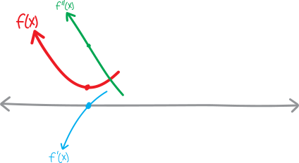{width=75%}

So at this point that's a minimum, the first derivative is zero, and the second derivative is positive!!! (It's the *value* of the second derivative, note, that's positive, not its own slope. Thought of as a function in its own right, the second derivative here has negative slope, but here we're interested in the slope of the slope, i.e. the *value* of the second derivative.)

{width=75%}

So in other words, if we have a point where the derivative is zero, AND the second derivative is positive, then that point must be a minimum!!!

$$\large \boxed{\quad \substack{\text{first derivative is zero}\\ \\ \text{AND}\\ \\ \text{second derivative is positive}} \implies \text{minimum} \quad}$$

Meanwhile... what's going on with our maximum? At the maximum, the function is going from increasing to flat to decreasing:

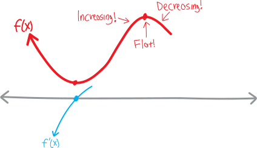{width=75%}

I.e., its derivative/slope goes from positive to zero to negative:

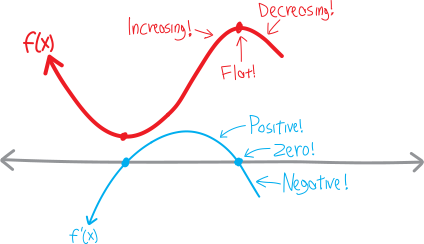{width=75%}

So, in other words, the derivative itself has negative slope:

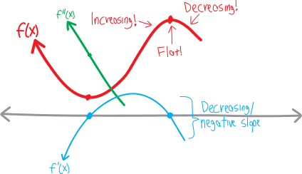{width=75%}

And that's the same as saying that the second derivative (the *value* of the second derivative) is negative at that point!!!

{width=75%}

So then if we have a point where the derivative is zero, and the second derivative is negative, then we know we have a maximum!!!

$$\large \boxed{\quad \substack{\text{first derivative is zero}\\ \\ \text{AND}\\ \\ \text{second derivative is negative}} \implies \text{maximum} \quad}$$

What about this weird ambiguous cubicky indecisive point?

{width=75%}

Well... what's making it an indecisive point is the fact that, although the derivative has a root/zero/$x$-intercept, it doesn't actually cross the $x$-axis. It *touches*, but doesn't *cross*. It *bounces*. And so the derivative itself has an extremum there. So its own slope---the slope of the slope---is zero there.

{width=75%}

Here's the full final diagram:

Textbooks call this stuff the **second derivative test**, but as always, that's not a word that's important, nor is it an algorithm you should try to memorize. Rather, we want to *feel* how these functions work. We want to understand functions and their curviness so deeply and thoroughly that it feels *impossible* for any of this to be otherwise. We want it to feel *impossible* that we never once understood all this. That's a big goal. It takes a while, and some work. But that's what we're aiming at.

## Did we actually save the guy?!?

Now that we have more nuance in our understanding of how maxima and minima work... are we really sure that that minimum we found trying to save the guy from the polar bear actually was a minimum??? It was a point where the derivative was zero, sure, but how do we know it wasn't a maximum??? 

In the case of this particular problem, we could probably make various non-calculus arguments for why the point we found (i.e., running all but the last $50$ metres down the beach and swimming the rest of the way) was a minimum. But that's not *always* going to be true, so let's see how these fancy calculus tools work!

In order to prove (or verify? or find out?) that the point we found actually is a minimum, we'll need to not only know that the first derivative is zero (which we already did), but we'll *also* need to prove that the second derivative is positive. So we'll take a *second* derivative of our original time-to-reach-the-guy function, and then plug in the $x$-value that makes the first derivative zero (i.e., $x=50$, the $50$ yards we don't run down the beach), and then see whether the resulting number is negative or positive. That'll tell us whether we have a maximum or a minimum! (Hopefully the number will be positive, giving us a minimum.)

So, just as a reminder, the function for how long it takes to reach the guy, as a function of how long we don't run down the beach, is:

$$\text{time}(x) = \frac{300-x}{13} + \frac{\sqrt{120^2 + x^2}\,}{5}$$

And its derivative is:

$$\text{time}'(x) =  -\frac{1}{13} +\frac{x}{5\sqrt{120^2 + x^2\,}\,}$$

So if we take a second derivative, we get:

\begin{align*}
\text{time}''(x) &= \Big(\, \text{time}'(x) \, \Big)'  \\ \\
&= \left( \, \frac{-1}{13} +\frac{x}{5\sqrt{120^2 + x^2} } \,\right)' \\ \\
&=  \left( \, \frac{-1}{13} \,\right)'  \,+\, \left(\, \frac{x}{5\sqrt{120^2 + x^2} } \,\right)' \\ \\
&= 0 \quad+\quad \frac{ (x)'\cdot  5\sqrt{120^2 + x^2} \,-\,  x\cdot \left(5\sqrt{120^2 + x^2}\right)'  }{ \left(  5\sqrt{120^2 + x^2} \right)^2 } \\ \\
&= \frac{ 1 \cdot  5\sqrt{120^2 + x^2} \quad-\quad  x\cdot 5\cdot \frac{1}{ 2\sqrt{120^2 + x^2} }\cdot (2x) }{ \left(  5\sqrt{120^2 + x^2} \right)^2 } \\ \\
&= \frac{  5\sqrt{120^2 + x^2} \quad-\quad  \frac{5x^2}{ 2\sqrt{120^2 + x^2} } }{ \left(  5\sqrt{120^2 + x^2} \right)^2 } \\ \\
&= 1 - \frac{x^2}{2\left(  \sqrt{120^2 + x^2}\right)^2} \\ \\
&= 1 - \frac{x^2}{2\left( 120^2 + x^2\right) }
\end{align*}
OK. So that's the second derivative. What's its value when $x=50$? We have:
\begin{align*}
\text{time}''(50) &= 1 - \frac{50^2}{2\left( 120^2 + 50^2\right) }
\end{align*}

Ugh, this is gross, and we don't have a calculator. *But* we only need to find out whether this expression is positive or negative---we don't actually need to know its precise value. So, without doing any gross arithmetic, and just by thinking about it, we can figure out that it's positive. Here's my argument: whatever $50^2$ is, it's smaller than $120^2+50^2$ (and certainly smaller than twice that), which means that the whole fraction is less than $1$:

$$  \frac{50^2}{2\left( 120^2 + 50^2\right) } \quad = \quad \text{something less than $1$}$$

Which means that when we subtract it from $1$, we'll still have a positive number:

\begin{align*}
\text{time}''(50) &= 1 - \frac{50^2}{2\left( 120^2 + 50^2\right) } \\ \\
&= 1 - (\text{something less than $1$}) \\
&= (\text{some positive number})
\end{align*}

Great. So at $x=50$, the first derivative of this function is zero, and the second derivative is positive. That means that we do, indeed, have a minimum! And it means that in order to save the guy in the minimal amount of time, we do indeed need to run all but the last $50$ yards down the beach. Yay!

## Optimization, more globally

The stuff we're doing here---finding maxima and minima---is known as **optimization**. This is, in general, a hard thing to do. As we've seen, it's more complicated than simply finding where the derivative is zero. That itself is a hard problem. Finding where the derivative is zero is essentially a problem of algebra---the problem of finding where a certain equation is zero, i.e., the problem of finding roots of an equation, i.e., factoring. This is *hard*. Factoring is *not* easy, as we've discussed. (And what if our equation is **transcendental**, i.e., we can't solve it even by factoring?) We've hardly saved the world. We've just reduced one problem that we don't know how to solve (finding extrema) to another problem that we sometimes know how to solve (finding roots).

> A mathematician is tired of teaching and tired of research, so he decides to become a firefighter. He goes down to the New Haven Fire Department to interview, and the fire chief says, “Your record is excellent, and we'd love to hire you, but before we do, I have just two questions: you're walking down the street one day, and you see a fire in a dumpster. What do you do?”
>
> The mathematician responds, “I put it out.”
>
> “Great!,” the fire chief says. “Now, what if you're walking down the street and you see a dumpster that's not on fire? What do you do?''
>
> The mathematician responds, “Well, I light it on fire, and then I put it out.”
>
> The fire chief is flabbergasted. “You light it on fire---even though it's not already on fire? Why would you do that??”
>
> “Well, because that way, I've reduced it to a problem I already know how to solve.”

There's a bigger problem. We've only figured out how to find extrema of nice, simple, smooth functions. Our strategy relies on taking derivatives. We can only take derivatives of things like polynomials and trig functions and exponentials and whatnot. The world isn't always so smooth. There are plenty of functions (in math, in the world) that are *not* smooth and continuous like polynomials. The world is chaotic. The world is unpredictable. The world is full of randomness and jumpiness and disorder. When our functions have those features, the problem of finding maxima and minima can be incredibly difficult. 

Here's an example. I spent four years at the University of Chicago working at the student cinema, Doc Films. Every quarter, the hundred-odd volunteers would have to sign up for shifts. We'd rank our top five shifts and positions, in order of preference, and send them in to the person in charge of scheduling. There were fourteen shows per week (average of two per night), and seven jobs per show, so that gave $7\cdot 14 = 98$ possible slots. So the question was: how do you schedule slots so that the largest number of people get the slots they want the most? how do you schedule such that you create the greatest benefit for the greatest number?

This *doesn't* reduce to an easy problem of “take the derivative!” We could make a function for the net happiness of the volunteers, but it wouldn't be the sort of smooth curve that we could differentiate. It would be somewhat random and arbitrary, based on the whims of the volunteers. There would be no Platonic foundation. It wouldn't be like how each of the infinite number of points on the function $y=x^2$ satisfies that equation. It wouldn't have some beautiful, smooth, continuous, *pattern*. 

Of course, the advantage the scheduling-the-student-cinema-staff problem has over finding the extrema of $x^2$ is that there are only finite number of possibilities. With $y=x^2$, one way to find the extrema would be to look at every point, and then look at the points immediately to the left and to the right. If both points are lower, we have a maximum; if both points are higher, we have a minimum. But there are an infinite number of points on $y=x^2$. Any one of them *could* be an extremum. We'd have to look at an infinite number of points. And... take some random point on $y=x^2$, like $(x=3,y=9)$. What's the point immediately to the left of it? What's the number immediately below $3$? $2.9$? $2.99$? $2.999$?

In the scheduling problem, there are only a finite number of ways we can schedule our finite number of volunteers into a finite number of slots. So in principle, we could look at all the possible arrangements, calculate how optimal each arrangement is, and choose the best one. For example, we could say that a volunteer has a happiness-score of $98$ if they get the job they wanted most, a score of $97$ if they get their second-most-wanted job, and so forth, and then add up all the happiness-scores of all the volunteers. Then we'd just need to calculate this total-happiness-score for each possible arrangement of volunteers into slots, and choose the arrangement that gives us the highest total-happiness-score. With $98$ slots and $98$ volunteers, there are $98!$ possible ways to assign slots. So that's $98!$ possible arrangements. $98!$ is about $9.4\cdot10^{152}$. 

The number of atoms in the universe is about $10^{80}$. 

Uh-oh. 

We can't check every possible arrangement. If the number of possibilities is greater than the number of atoms in the universe, good luck getting your MacBook to go through each possibility and find the best one. Good luck getting *any* computer to do that. With a nice smooth curve like $y=x^2$, we have an infinite number of points, yes, but we also have a *pattern*. We have *predictability*. With the scheduling-student-cinema-volunteers problem, we just have a bunch of discrete, randomly-ordered states. 

So we have to give up hope that we can ever find the optimal solution. Instead, we'll have to find some procedure that gives us a pretty good solution---some algorithm that will *approximate* a solution, that will *estimate* the extremum---and hope that our approximation is be pretty close to the actual optimum.

Here's a cartoon about another movie-theater-related optimization problem (one that you may me more familiar with):

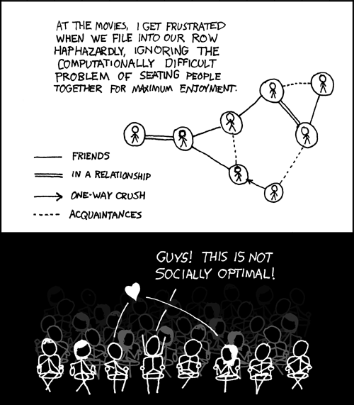^[http://xkcd.com/173/]

## Problems

<ol class='problems'>
<li> Consider the function $f(x)=x^8$. 

<ol class=''>
<li> Draw it. </li>
<li> Take its derivative! Draw that, too. </li>
<li> Take its second derivative! Draw that, too. </li>
<li> It ($f(x)$, that is) has a minimum at $x=0$, right? Which means that, via the logic we outlined above, its first derivative should be zero there, and its second derivative should be positive, right? </li>
<li> Wait, it doesn't? Why not? What's going on? What happened? Was I lying to you in these notes?!?!? </li>
</ol>

<li> Same questions as above, but for $f(x) = -x^6$ (sub in "maximum" for minimum, etc.). </li>

</ol>	

Find where each of the following functions are increasing and where they are decreasing. Then find the extrema, and say whether each extremum is a maximum or a minimum. (And, for good measure, sketch the function.) 

<ol class='problems'>
<li> $f(x) = x^2 - 3x + 2$ </li>
<li> $f(x) = x^3 -3x^2 + 6$ </li>
<li> $\displaystyle f(x) = x + \frac{1}{x}$ </li>
<li> $\displaystyle f(x) = x^2 + \frac{1}{x}$ </li>
<li> $\displaystyle f(x) = x + \frac{1}{x^2}$ </li>
<li> $f(x) = (x-3)^3$ </li>
<li> $f(x) = x^3(1+x)$ </li>
<li> $f(x) = x(x+1)(x+2)$ </li>
<li> $\displaystyle f(x) = (x+1)^4$ </li>
<li> $\displaystyle f(x) = 2x - \frac{1}{x^2}$ </li>
<li> $\displaystyle f(x) = \frac{x}{1+x^2}$ </li>
<li> $\displaystyle f(x) = \frac{x^2+1}{x^2-1}$ </li>
<li> $\displaystyle f(x) = \frac{x^2}{x^2+1}$ </li>
<li> $\displaystyle f(x) = x^2(1+x)^2$ </li>
<li> $\displaystyle f(x) =\frac{x-1}{x+1}$ </li>
<li> $\displaystyle f(x) = x^2+\frac{16}{x^2}$ </li>
<li> $f(x) = x-\cos(x)$ </li>
<li> $f(x) = x+\sin(x)$ </li>
<li> $f(x) = \cos(2x)+2\cos(x)$ </li>
<li> $f(x) = \cos^2(x)$ </li>
<li> $\displaystyle f(x) = \left(\frac{x-2}{x+2} \right)^3$ </li>
<li> $f(x) = \sqrt[3]{1-x}$ </li>
<li> $f(x) = x\sqrt[3]{1-x}$ </li>
<li> $\displaystyle f(x) =  \frac{1}{x+1} - \frac{1}{x-2}$ </li>
<li> $f(x) = x^{7/3} -7x^{1/3}$ </li>
<li> $f(x) = x^{2/3} +2x^{1/3}$ </li>
<li> $f(x) = (x - \sqrt{x})^2$ </li>
<li> $\displaystyle f(x) = (4x-1)^{1/3}(2x-1)^{2/3}$ </li>
<li> $y= \sqrt{x}e^{-x}$ (for $x \ge 0$, obviously) </li>
<li> $y= x^2e^{-x}$ </li>
<li> $f(x) = 2e^{\sin(x/2)}$ </li>
<li> $f(x) = 1 - e^{1+\cos(\pi x)}$ </li>
<li> $f(x) = e^{x/(x^2+1)}$ </li>
<li> $g(x) = e^{x/\sqrt{x^4+1}}$ </li>
<li> $h(t) = e^{t\sqrt{4-t^2}}$ </li>
<li> $f(x) = x^2\ln(1/x)$ </li>
<li> $y = \ln(\cos x)$ </li>
<li> $y = \cos(\ln x)$ </li>
<li> $y = x^2\ln(x)$ </li>
<li> $y = x\ln(x)$ </li>
<li> $f(x) = (1-x)e^x$ </li>
<li> $f(x) = e^{1/x^2}$ </li>
<li> $f(x) = e^{-x^2}$ </li>
<li> $f(x) = x^2e^{-x}$ </li>
<li> $f(x) = x^2\ln(x)$ </li>
<li> $f(x) = (x-x^2)e^{-x}$ </li>
</ol>

The following are derivatives of functions. Sketch both the derivatives and the original functions (i.e., both $f$ and $f'$). Where does $f$ have minima? where does $f$ have maxima?

<ol class='problems'>
<li> $f'(x) = (x+1)(x-2)^2$ </li>
<li> $f'(x) = x^4(x-3)$ </li>
<li> $f'(x) = x^3(x-1)^2(x+1)(x-2)$ </li>
<li>  $f'(x) = x^4(x-2)^3(x+3)(x-6)$ </li>
<li> $f'(x) = (x + 1)(x- 5)^2(x^2 + 3)$ </li>
<li> $f'(x) = (x - a)(x+b)^2(x+5b)$ </li>
</ol>

<ol class='problems'>
<li> Imagine you have the function $f(x) = ax^2 + bx + c$. Where does $f(x)$ have an extremum? When (i.e., under what conditions of $a$, $b$, and $c$) is this extremum a maximum? when is it a minimum? </li>
<li> Imagine you have $f(x) = ax^3 + bx^2 + cx + d$. When will $f(x)$ have two extrema? one extrema? no extrema? where are they? (Give $(x,y)$-coordinates.) </li>
<li> Consider the function $\displaystyle f(x) = x^2 + \frac{a}{x}$. What value of $a$ makes it have  \begin{enumerate}\item a minimum at $x=2$ \item an inflection point at $x=1$?\end{enumerate} </li>
<li> Where does $\displaystyle f(x) = x^2 + \frac{a}{x}$ have a maximum? </li>
<li> What values of $a$ and $b$ make $f(x) = x^3 + ax^2 + bx$ have 
	<ol>
		<li> a maximum at $x=1$?</li> 
		<li> a minimum at $x=1$?</li> 
		<li> an inflection point at $x=1$?</li>
	</ol>
</li>
<li> Imagine you have the equation $f(x) = x^4 - 8x^3 + 22x^2 - 24x + 4$. If you wanted to find out where the roots of this equation are (and how many of them there are), you'd need to factor it---but good luck doing so. Without factoring it, though, can you figure out how many roots this equation has (and roughly where they are)? (Hint: find the extrema.) </li>
<li> Is the function $f(x) = x^2 - x + 1$ ever negative? </li>
<li> Is the function $f(x) = 3+4\cos(x) + \cos(2x)$ ever negative? </li>
<li> Suppose the function $f(x) = ax^2 + bx + c$ has a minimum at $x=2$ and passes through the points $(-1,3)$ and $(3,-1)$. Find $a$, $b$, and $c$. </li>
<li> If you want the function $\displaystyle f(x)=\frac{ax}{x^2+b^2}$ to have a minimum at $x=-2$ and for the derivative at $0$ to be $-1$ (i.e., $f'(0)=-1$), what must $a$ and $b$ be? </li>
<li> Imagine you have the function $f(x) = x^p(1-x)^q$. Where might $f$ have extrema? Where does $f$ have a maximum? If $p$ is even, where does $f$ have a minimum? If $q$ is even, where does $f$ have a minimum? </li>
<li> How many extrema can a polynomial of degree $n$ have, at most? Why?</li>
<li> Imagine you have a function whose first derivative is never zero. What can you say about the function? </li>
<li> Imagine you have a function whose second derivative is never zero. What can you say about the function? </li>
<li> Imagine you have a point where the derivative is zero, and the second derivative is *also* zero. Does this mean that the point is not an extremum? </li>
</ol>

<ol class='problems'>

<li> Find the dimensions of the rectangle of perimeter $24$ that has largest area. (What is that area?)
 Prove that, of all the rectangles with a fixed perimeter, the one with largest area is a square. </li>

<li>The sum of two positive numbers is $20$. If you want the product of the numbers to be as large as possible, what must the numbers be? If you want the sum of the squares of the numbers to be as large as possible, what must the numbers be? If you want the sum of one number plus the square root of the other number to be as large as possible, what must the numbers be? </li>

<li>Imagine you have a rectangle inscribed in an isoceles right triangle whose hypotenuse is $2$ units long:

<ol>
	<li>Express the $y$-coordinate of point $P$ in terms of $x$. (It might help to first come up with an equation for line $AB$.) </li>
<li>Express the area of the rectangle in terms of $x$. </li>
<li>What is the largest possible area the rectangle could have? What are its dimensions? </li>
</ol>
</li>

<li>A rectangular garden $200$ square feet in area is to be fenced off against deer. Find the dimensions that will require the least amount of fencing if one side is already protected by a barn. </li>

<li>Find the largest possible area for a rectangle whose base is on the $x$-axis and whose vertices are on the curve $y=4-x^2$. </li>

<li>Find the largest possible area for a rectangle inscribed in a circle of radius $4$. </li>

<li>A rectangular warehouse will have $5000$ square feet of floor space and will be seperated into two rectangular rooms by an interior wall. The cost of the exterior walls is $\$1500$ per linear foot and the cost of the interior walls is $\$1000$ per linear foot. Find the dimensions that will minimize the cost of building the warehouse. </li>

<li>I once returned home to find that my cat had taken to sleeping in a box that was far too small for it, resulting in ripples of fat spilling out over the edges. (I thought I had photo of the cat in the box on my cell phone, but alas.) Why she found this comfortable, I have no idea. But imagine that you plan to build a similar catbox out of an eight-by-fifteen inch sheet of cardboard. You construct it by cutting squares out from the corners, and folding up the sides. 

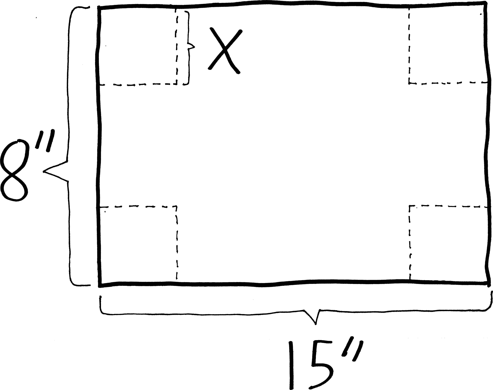

Assuming you want your cat to be comfortable, and thus to not spill out from the edges of the box, what size squares should you cut out if you want to maximize the volume of the box? </li>

<li>More generally, what if you have a piece of material that is $w$ units wide and $l$ units long? What is the largest-volume open-topped box you can make with it? </li>

<li>A rectangular box with square base and top is to be made to contain $1250$ cubic feet. The material for the base costs $35$ cents per square foot, for the top $15$ cents per square foot, and for the sides $20$ cents per square foot. Find the dimensions that will minimize the cost of the box.</li>
<li>You want to break into a building. The building is surrounded by an eight-foot fence, exactly one foot away from the building. What is the shortest-length ladder that can go over the fence and reach the building? </li>

<li>More generally, what if you have a fence $h$ feet tall that is $w$ feet away from a tall building? What is the length of the shortest ladder that will reach the building from outside the fence? </li>

<li>Conical paper cups are usually made so that the depth is $\sqrt{2}$ times the radius of the rim. Show that this design requires the least amount of paper per unit volume. </li>

<li>You have to escape from Isle Royale and make it back to the Minnesotan mainland before the wolves eat you alive! Your rowboat is docked at a point that's ten miles away from the closest point on shore. You can row at three miles per hour, and you can walk at four miles per hour. Where should you land the boat in order to make it to Grand Marais in the least amount of time? (Assume the shoreline of Lake Superior is straight, which it basically is at that point, and assume that Grand Marais is thirty miles away from the point on shore closest to your dock.) How long does it take you to get there?

</li>

<li>You have enough pure germanium to coat one square meter of surface. You plan to coat a sphere and a cube. What dimensions should they be if you want the total volume of germanium-covered solids to be maximal? minimal?</li>

<li>A rectangle has one side on the $x$-axis, and the upper two corners on the graph of $y=e^{-x^2}$. Where should the vertices be placed in order to maximize the area of the rectangle? </li>

<li>A poster you are designing needs to contain fifty square inches of printed material, with two-inch margins at the top and bottom and one-inch margins on the sides. What dimensions for the poster minimize the amount of paper used? </li>

<li>As the deputy director for operations of the Central Arizona Project, you are trying to design a new canal from Tempe to Tucson. The canal will be above ground, for some reason, and built using prefabricated sheets of an advanced polymer composite imported from Norway. The polymer sheets are ten feet wide, and come in sections 39 feet long (to fit in standard shipping containers). Sensibly enough, you'll assemble them into a quasi-U shape, with one section as the bottom of the canal, and two sections as sides. Since you want to maximize the volume of delicious, life-providing water that this canal carries, what should the angle between the two side pieces and the bottom piece be? (At some point in the answer, trig identities may be helpful.)

\centerline{\includegraphics[scale=.3]{canal1.png}}

\centerline{\includegraphics[scale=.3]{canal2.png}}

</li>

<li>Imagine you want to fit $12$ ounces (about $21.6$ cubic inches) into a cylindrical can---like a soda can! You could have a really narrow and really long can, but that'd take a lot of aluminum and would be expensive; you could have a really short and really wide can, but that'd take a lot of aluminum and'd be expensive. Somewhere in between these two extremes is the perfect median that minimizes the amount of surface area in your can! Calculate it. What are the dimensions of this optimal soda can? Then go out, find a soda can, measure it, and compare it to your result. </li>

<li>More generally, if you want to enclose $k$ ml of liquid into a cylindrical can, and you want the surface area of the can to be minimal, what should the dimensions of the can be? (Compare your result to whatever cans you find lying around the house!) </li>

<li>You are designing a soda cans, and in your calculations for the most efficient design, you want to take waste into account. There is no waste in cutting the aluminum for the sides, but the tops and bottoms of radius $r$ must be cut from squares that measure $2r$ on a side. Thus, the total amount of aluminum used by each can will be:$$A= 2\cdot (2r)^2 + 2\pi rh$$What should $r$ and $h$ be to minimize the amount of aluminum used? </li>

<li>What is the maximum possible area for a triangle inscribed in a circle of radius $r$? </li>

<li>A power line is needed to connect a power station on the shore of a river to an island $4$ kilometers downstream and $1$ kilometer offshore. Find the minimum cost for such a line, given that it costs $\$50,000$ per kilometer to lay wire under water and $\$30,000$ per kilometer to lay wire under ground. </li>

<li>The U.S. Postal Service will only accept a box for domestic shipment if  the sum of its length and girth (distance around) does not exceed $108$ inches. What dimensions will give a box with a square end the largest possible volume?

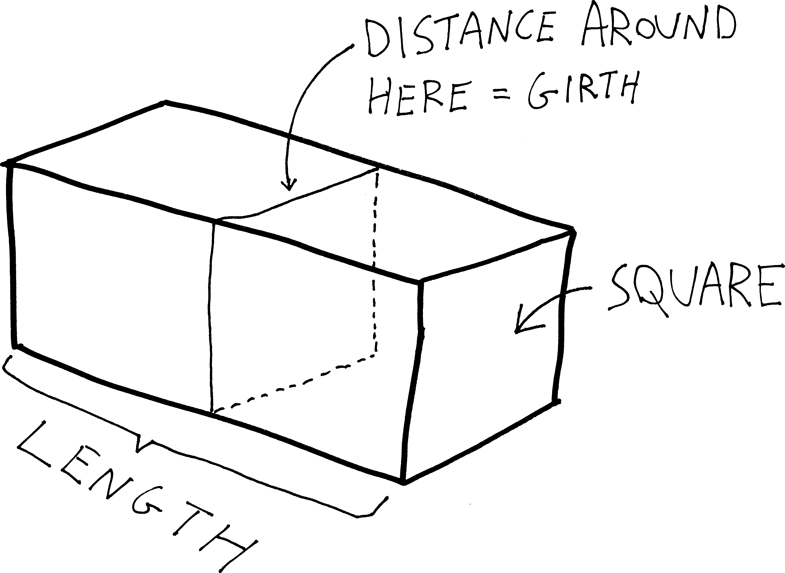

</li>

<li>How close does the semicircle $y=\sqrt{16-x^2}$ come to the point $(1,\sqrt{3})$? (Suggestion: what is it you want to minimize?) </li>

<li>A tapestry $7$ feet high hangs on the wall of your castle. The lower edge is $9$ feet above your eye. If you're really close, then when you want to observe it you'll have to bend your head upwards and it'll be really small (as a fraction of your visual field); if you're really far away, the tapestry will look really small (and thus the angular space it takes up in your visual field will be really small). How far from the wall should the you stand to obtain the most favorable view? Namely, what distance from the wall maximizes the angle that the tapestry takes up in your visual field? </li>

<li>Suppose that at some time $t$, the position of an object moving back and forth along the $x$-axis is given by $x(t)=(t-1)(t-4)^4$. 
	<ol>
<li>When is the particle at rest? Where is it when it is at rest? </li>
<li>When is the particle moving leftwards? </li>
<li>When is the particle going the fastest?</li>
<li>Graph $x$ as a function of $t$ between $t=0$ and $t=6$. </li>
</ol>
</li>

<li>An object of weight $W$ is dragged along a horizontal plane by means of a force $P$ whose line of action makes an angle of $\theta$ with the plane. The magnitude of the force is given by the equation: $$P = \frac{\mu W}{\mu \sin(\theta)+\cos(\theta)}$$where $\mu$ is the coefficient of friction. For what value of $\theta$ is it easiest to pull the object? </li>

<li>Light travels along the path that takes it the least amount of time to get from one place to another. Prove Fermat's principle: that the angle of incidence of light on a planar, reflective surface, is equal to the angle of reflection:

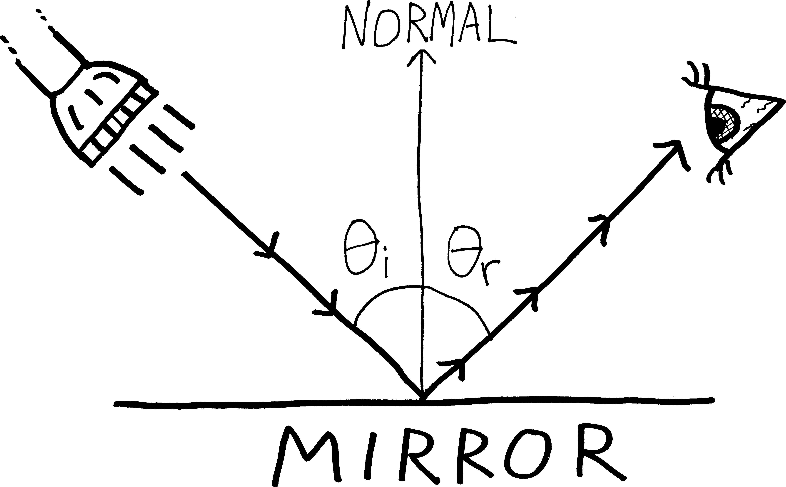

You can prove this geometrically or analytically (i.e., using calculus); do it using calculus. Suggestion: imagine that light travels from some point $A$ (the flashlight) to another point $B$ (the eye). Can you come up with a function for the total distance the light travels, and minimize that? I always do this one wrong, because I try to write a function for distance in terms of $\theta_i$ and $\theta_r$---that doesn't seem to get you anywhere. Instead, try appealing to Pythagoras. </li>

<li>What if you have a curved mirror---i.e., a mirror whose surface is not given by a straight line (as in the above problem) but whose surface is given by some function $f(x)$? Can you prove that Fermat's principle still holds? </li>

<li>Two sources of heat are placed $s$ meters apart---a source of intensity $a$ at $A$ and a source of intensity $b$ at $B$. The intensity of heat at a point $P$ on the line between $A$ and $B$ is given by the formula: $$I = \frac{a}{x^2}+\frac{b}{(s-x)^2}$$If you plan on sticking your hand in between the two heat sources, where should you put it? </li>

<li>Your bus company offers charter trips to the Adirondack Museum in Blue Mountain Lake at a fare of $\$37$ per person if $16$ to $35$ passengers sign up. You don't charter trips for fewer than $16$ passengers. The bus has $48$ seats. If more than $35$ passengers sign up, the fare for every passenger is reduced by $50$ cents for each passanger in excess of $35$ who signs up. Determine the number of passengers that maximizes your revenue. </li>

<li>You are driving a truck on a freeway at a constant speed of $x$ miles per hour. The maximum speed on the freeway is $55$ mph, and the minimum speed is $35$ mph. Assume that fuel costs $\$1.35$ per gallon (how old is this textbook!?!), and is consumed at a rate of $2 + \frac{1}{600}x^2$ gallons per hour. Given that the driver is paid $\$13$ per hour, at what speed should the truck be driven to minimize the truck owner's expenses? </li>

</ol>

