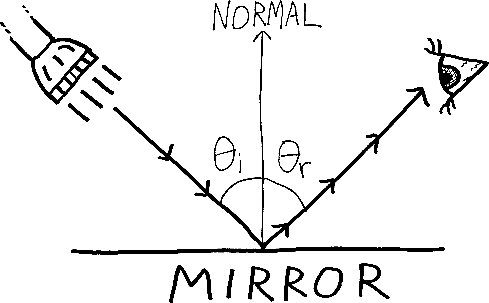
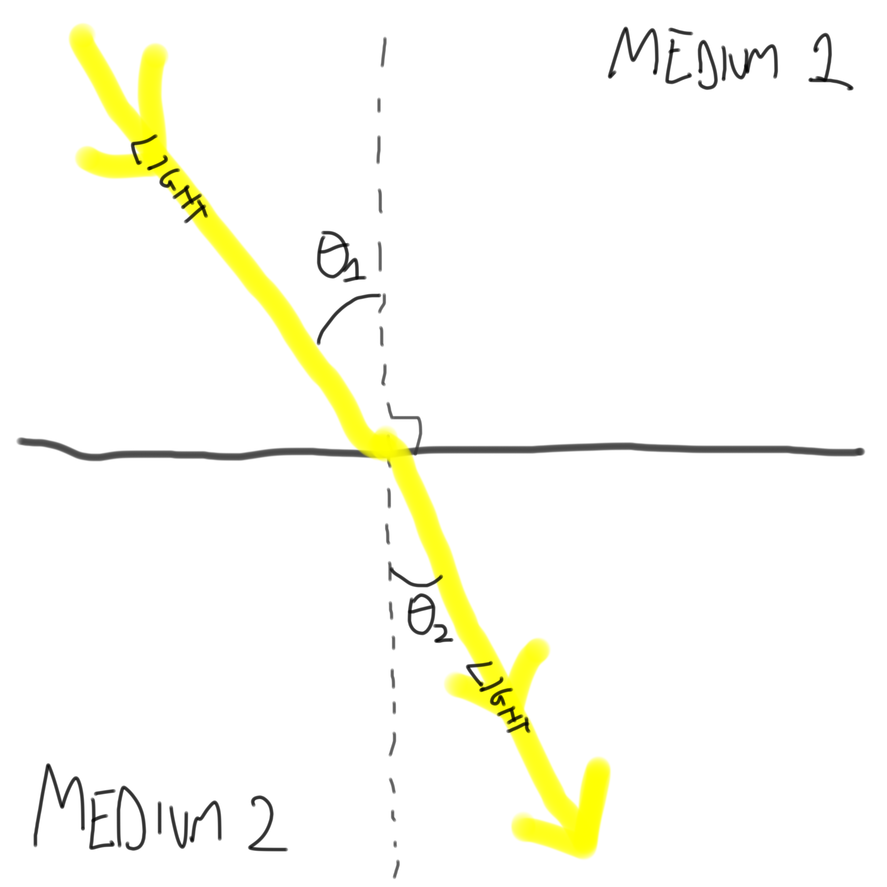

Let's do some physics! If you've already learned this stuff in your physics class, now you get to prove it! If you haven't (or if you haven't taken physics at all), now you get to learn it! Here are two facts about light:

* We usually say that light travels at "the speed of light." That's about $670$ million miles per hour.  But actually, it only travels that fast in a vacuum. In air, it travels somewhat slower, because there are all the air molecules (i.e., oxygen and nitrogen) in the way. In water, it travels even slower, because there's even more stuff in the way (water is denser than air).
* Light travels in a straight line, right? Wrong! Light travels along the path that takes it the *least amount of time* to get from one place to another. That's not necessarily a straight line. Light calculates the Google Maps driving directions from one place to another, and chooses the fastest route. It doesn't choose the route which has the least distance^[Or so it seems to us; maybe we shouldn't, uh, be so confident we know how to measure distances, or understand what distance *is*.]---it chooses the route that takes the least amount of time. In other words, light is a *minimizer*. Light *knows calculus*. 

Here are two consequent theorems for us to prove:

<ol>
<li>**Prove Fermat's principle**: that the angle of incidence of light on a flat, reflective surface, is equal to the angle of reflection:

{width=75%}
$$\text{ Fermat's Principle: } \theta_i = \theta_r$$

We can prove this geometrically or analytically (i.e., using calculus); do it using calculus. Suggestion: imagine that light travels from some point $A$ (the flashlight) to another point $B$ (the eye). Can you come up with a function for the total time it takes for the light to travel, and minimize that? I always do this one wrong, because I try to write a function for distance in terms of $\theta_i$ and $\theta_r$---that doesn't seem to get us anywhere. Instead, try appealing to Pythagoras.</li>

<li> **Prove Snell's Law**. In order to take the shortest route between any two points, light changes direction when it moves from one medium to another, based on its relative speeds in the two media. (This is basically the same as our polar-bear-attacking-the-swimmer optimization problem---the lifeguard swims through water at a different speed than he/she runs on land, and so doesn't travel to the swimmer in a straight line.) In particular, if light moves at speed $v_1$ in one medium, and at speed $v_2$ in another medium, then we have the following situation:

{width=75%}

$$\text{Snell's Law: } \frac{\sin \theta_1}{\sin \theta_2} = \frac{v_1}{v_2}$$

Prove this! Again, suppose light is traveling from some point $P$ in medium one to some point $Q$ in medium two. What path must it take to minimize its travel time?

Snell's Law is an example of **refraction**, which people usually demonstrate by showing a picture of a pencil in a cup of water, with the in-water part of the pencil seemingly disconnected from the out-of-water part of the pencil. Here's a better example: a six-month-old baby sea lion, half-immersed in water, as seen through the window by me in March 2017 at the National Zoo in Washington, D.C.:

{width=100%}
</li>
<ol>