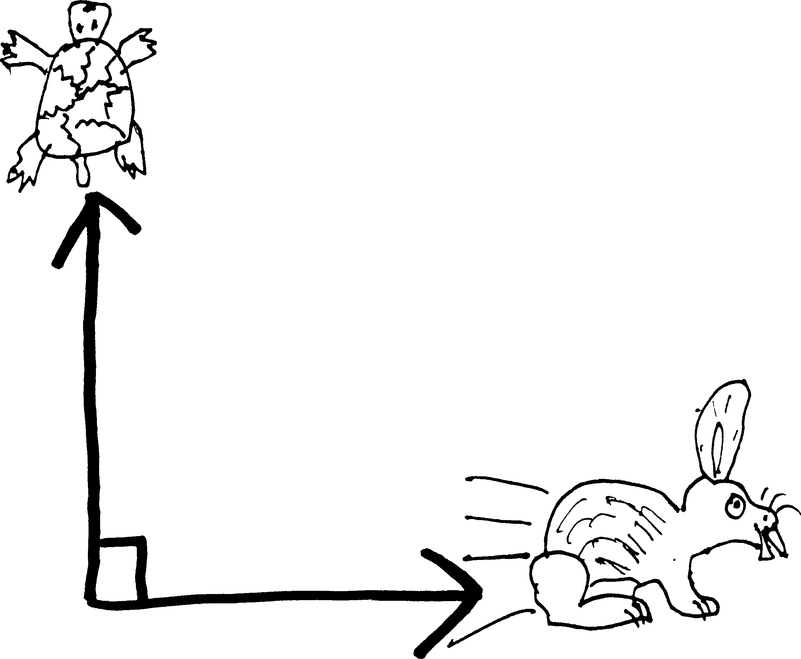

Imagine the following scenario: a tortoise and a hare decide to go on an Aesopian footrace, the prize of which will be eternal glory. Except rather than race down a straight path, or even race down the *same* path, a Darwinian glitch in the hare's navigational systems has caused it to hop off at an orthogonal angle^[the adult version of "right angle."] to the tortoise:

This is bad for any number of reasons, among them the fact the winner of the race will not be known until each animal has circumambulated the surface of the earth---the primitive technology available to the tortoises and hares doesn't allow them to directly measure velocity or distance. Hence the need for direct *comparison*. Which, I guess, is what one always does in a race---everyone starts and finishes at the same points.

Uh, anyway, as a third complication, a practical jokester (perhaps an otter?) has attached a spool of string to the back of the tortoise, and tied the end of the strong to one of the hare's ears. So as soon as they start their race, the string starts unspooling, unbeknownst to either of them.

A couple of questions: first of all, when will they run out of string? that is to say, when will the tortoise and the hare feel a sudden jerk back towards each other, and realize that they're tied together? And, secondly: the amount of internal injuries they suffer will be directly proportional to the force exerted by the string at the moment that it stops them from running independently, which in turn will be proportional to the rate at which the distance between them is changing---i.e., the speed at which the string is coming of the spool. So at the instant they run out of string, how fast is the distance between the tortoise and the hare changing?

(If they were both running in the same direction, we'd just subtract their speeds; if they were both running in opposite directions, we'd add their speeds. You did this in physics last year---you discussed relative motion.) (Note how I've used the word "speed" rather than "velocity,
" since velocity includes information about direction.))

Let's assume that the tortoise can run ("run") $5m/h$ (where "m" means 
"meter" and not "mile") and the hare can run $200m/h$, and that at the beginning of the race, there's $1000m$ of string on the tortoise's back. (Assume, for simplicity's sake, that the weight of the string doesn't slow the tortoise down.) And let's let:

* $T(t)$ be the position of the tortoise as a function of time
    * then $T'(t)$ (or $dT/dt$) is the velocity of the tortoise (as a fxn of time) (which, incidentally, we know is $5m/h$.) 
* *$H(t)$ be the position of the hare as a function of time
    * then $H'(t)$ (or $dH/dt$) is the velocity of the hare (as a fxn of time) (which, incidentally, we know is $200m/h$.)

Furthermore, let's assume there's $1km$ (i.e., $1000m$) of string on the tortoise's back. Let's call $S(t)$ be the amount of string that has been unspooled (as a function of time)---which, note, is just the distance between the tortoise and the hare. And then $S'(t)$ (or $dS/dt$) will be the rate at which the string is unspooling (i.e., the rate at which the distance between the tortoise and the hare is increasing).

So our situation looks something like this:

(So $S(t)$ is really just the hypotenuse of this right triangle---which means that the Pythagorean theorem might come into play...)

We want to find a couple things: first, **when do they run out of string?** Meaning, when is the distance between the tortoise and the hare $1000m$? Meaning, when is $S(t) = 1000$? (And here "when" means "for what value of $t$ is $S(t)=1000$?")

Because of the Pythagorean theorem, we must have: 
$$(T(t))^2 + (H(t))^2 = (S(t))^2 $$
For ease of writing, you might wish to drop the "$(t)$"'s: 
$$T^2 + H^2 = S^2 $$
We want to find when $S=1000$, so we can plug that in: 
$$T^2 + H^2 = 1000^2 $$
But how do we solve for $t$? We'll need more information. Luckily, we have more information. We know the velocities of both the tortoise and the hare, and we know that both of these velocities are constant (neither the tortoise nor the hare speed up or slow down). so then after $t$ hours, the tortoise has travelled $T(t) = 5\cdot t$ meters, and after $t$ hours, the hare has travelled $H(t) = 200\cdot t$ meters^[If their velocities *weren't* constant---if they were speeding up or slowing down; if their speedometer weren't stuck---then it wouldn't be so easy. We'd need to use an integral.  Distance---and this is just one of the many, many lies that evil Mr. Ward told you last year---distance is *not* always equal to rate times time. $d=rt$ is only true if rate is constant.] So we know:
\begin{align*}
T(t) &= 5t \\
H(t) &= 200t
\end{align*}
If we plug these into our Pythagorean thing, we get:
\begin{align*}
(5t)^2 + (200t))^2 &= 1000^2 \\
25t^2 + 200^2t^2 &= 1000^2
\intertext{I haven't bothered squaring $1000$ and $25$, because that's too much writing---and I can always let the calculator take care of it. Now, if I solve for $t$:}
t^2(25+200^2) &= 1000^2\\
t^2 &= 1000^2/(25+200^2)\\
t &= \sqrt{1000^2/(25+200^2)}\\
t &\approx  4.99
\end{align*}
So the hare and the tortoise will be running for about five hours before they run out of string. It'll take about four hours before they notice that they're tied to each other. 

Second question: **what is the rate at which the distance between the animals is changing at the instant they run out of string?** (I.e., when $S(t) = 1000$.) Put differently, what is $S'(t)$ (or $dS/dt$) when $S=1000$? **This is the crucial idea here**: we can think of the derivative as a *rate of change*. $dy/dx$ is the amount that $y$ changes for every change in $x$. By "rate" we usually mean "change per unit time," and so something like $dS/dt$ or $S'(t)$ is the rate at which $S$ changes, per some change in $t$. Velocity is a rate---e.g., miles **per** hour. And it's just a derivative---the derivative of position. So I guess we'll want to find $S'(t)$ to find the speed at which the distance is changing (at any time $t$), and then plug in $4.99$ for $t$ to find the speed at that moment.

We already know: $$(T(t))^2 + (H(t))^2 = (S(t))^2 $$
So I guess if we want to find $S'(t)$, we'll need to take a derivative! We could do it in two ways: either solve for $S(t)$ and then differentiate, or differentiate and then solve for $S'(t)$.

If we differentiate and then solve, we get:
\begin{align*}
(T(t))^2 + (H(t))^2 &= (S(t))^2\\
\frac{d}{dt}\left[ (T(t))^2 + (H(t))^2\right] &= \frac{d}{dt}\left[ (S(t))^2\right] \\
2T(t)\cdot T'(t) + 2H(t)\cdot H'(t) &= 2S(t)\cdot S'(t) \\
S'(t) &= \frac{2T(t) T'(t) + 2H(t) H'(t)}{2S(t)} \\
S'(t) &= \frac{T(t) T'(t) + H(t) H'(t)}{S(t)}
\end{align*}
Alternatively, if I first solve for $S(t)$ and then differentiate:
\begin{align*}
(T(t))^2 + (H(t))^2 &= (S(t))^2
\intertext{so then}
S(t) &= \sqrt{(T(t))^2 + (H(t))^2}\\
\intertext{differentiating...}
\frac{d}{dt}\left[ S(t) \right] &= \frac{d}{dt}\left[\sqrt{(T(t))^2 + (H(t))^2}\right] \\\\
S'(t) &= \frac{1}{2\sqrt{(T(t))^2 + (H(t))^2}}\cdot \left(2T(t) T'(t) + 2H(t) H'(t) \right) \\\\
&= \frac{2T(t) T'(t) + 2H(t) H'(t)}{2\sqrt{(T(t))^2 + (H(t))^2}} \\\\
&= \frac{T(t) T'(t) + H(t) H'(t)}{\sqrt{(T(t))^2 + (H(t))^2}} \\\\
\intertext{but since we know that $S(t) = \sqrt{(T(t))^2 + (H(t))^2}$, we can simplify this to:}
S'(t) &= \frac{T(t) T'(t) + H(t) H'(t)}{S(t)}
\end{align*}
So, either way I get the same thing! We get that:
$$S'(t) = \frac{T(t) T'(t) + H(t) H'(t)}{S(t)}$$
(I'm sorry if these two derivations were hard to read; I think all the "$(t)$"s made it needlessly messy, but I wanted to put them in there just so you wouldn't forget that $S$, $T$, and $H$ are all functions of $t$... I dunno. If you find them confusing, try writing them out without the ``$(t)$''s, and see if it's clearer.)

So this tells us the rate (the speed) at which the distance between the tortoise and the hare is changing as a function of time. Or rather, as a function of the distance the tortoise and the hare have each travelled, as well as their speeds and the distance between them. We can simplify it a bit. First of all, we know the speeds of the tortoise and the hare (we know $T'(t) = 5$ and $H'(t) = 200$), so we can plug those in:
$$S'(t) = \frac{T(t)\cdot 5+ H(t)\cdot 200}{S(t)}$$
Likewise, we also know that $S(t) = \sqrt{(T(t))^2 + (H(t))^2}$, so if we plug that in:
$$S'(t) = \frac{T(t)\cdot 5+ H(t)\cdot 200}{\sqrt{(T(t))^2 + (H(t))^2}}$$
And since we know that $H(t) = 200t$ and $T(t) = 5t$, we have:
\begin{align*}
S'(t) &= \frac{5t\cdot 5+ 200t\cdot 200}{\sqrt{((5t)^2 + (200t)^2}}
\intertext{or:}
 &= \frac{25t+ 200^2t}{\sqrt{25t^2 + 200^2t^2}} \\
&= \frac{t(25+ 200^2)}{\sqrt{(t^2)(25 + 200^2)}} \\
&= \frac{t(25+ 200^2)}{\sqrt{t^2}\sqrt{25 + 200^2}} \\
&= \frac{t(25+ 200^2)}{t\sqrt{25 + 200^2}} \\
&= \frac{25+ 200^2}{\sqrt{25 + 200^2}} \\
&\approx 200.0625 \,m/s
\end{align*}
So that means that the distance between the tortoise and the hare is increasing at a constant rate---at a speed of a little more than $200$ meters per second! So at the instant that the string runs out, the tortoise and the hare are getting further apart at a rate of about 200 meters per second. (Which is close to the hare's speed---that's because the difference in speeds is so great. If they were going at similar speeds, we'd get something different... this is close to the scenario in which the hare is speeding along and the tortoise is standing still.)

velocity: change in position per change in time
interest: change in money per change in time
flux
power: change in energy per change in time(?)
other physics examples

usuaally by ``rate'' we mean change in X per change in time
though, of course, we could measure change relative to somethijng othter than time. for instance, i could 
\

\vspace{3pc}
\noindent{\bf \large Another Example}

Here's another good example. You're in Arizona. You're trying to get to Tombstone, but your party was massacred by Indians/bandits/wild animals somewhere north of Nogales. You're the only survivor. So you've been walking for days, with no sign of anything living. And then you see it: train tracks. They extend to the horizon like a pencil line in two-point perspective, and just before the vanishing point rises an object that you remember from your boyhood days studying Euclid: a cone. Are you hallucinating? Are you so close to death that time is melting? Are you in the desert or in Mr. Dick's class? Are you entering the Platonic world of shapes?

The cone, though, isn't quite a cone: it's an inverted cone, raised up above the ground and supported on an iron lattice. It's a water tower. You straggle forth. The water tower must be miles away but in what seems like minutes you're underneath it, lapping up the drip-drip-dripping coming from the leak at the very vertex of the cone. The water tastes like rust, but it also tastes like water, which is delicious and revivifying. So you lie down directly underneath the leak and open your mouth. You don't have a cup or anything to catch the water with. All you have is your mouth. But that's OK, because you could lie there and drink water all day. 

Unfortunately, that won't be possible. There's only a finite amount of water in the tank. Moreover: the rate at which the water is dripping out of the tank is {\em decreasing} over time. The rate at which the water drips will be proportional to the amount of water in the tank---the more water there is in the tank, the greater the water pressure at the vetex will be, and the faster it'll drip---and so the more water that drips out, the less water there is, and the less the pressure there is, and the slower it drips. 

Let's imagine you don't actually care about the amount of water in the tank. Let's imagine, instead, that the water is sort of like an IV for you---that you need to drink a certain amount of water per unit time, lest you lapse back into unconsciousness. You do not want to return to your dessicated desert delerium. You need to be drinking at least $10$ cubic centimeters of water per minute to remain conscious. 

Uh. Crud. I just realized that this problem, the way I'm setting it up, is a bit beyond your level. This always happens when I write word problems---I get way too involved and write stuff that's too complicated and elaborate. Look, let's just do a dumb problem involving a stupid cone and water dripping.

OK, so imagine you have a cone or a funnel or something and water is dripping out of it. Let's imagine that cone is 10 feet in diameter at the opening and 15 feet tall, and that the water is dripping at a constant rate of one cubic foot per hour. That's a stupid assumption to make---the water {\em won't} drip at a consant rate---but all of the textbooks love making that assumption. So, anyway, water drips out, the water leve in the cone changes, and the surface area of the water in the cone changes, too. Let's say that the height of the water at any given time $t$ is $h_\text{water}(t)$. Then I have a situation like this:

\centerline{\includegraphics[scale=.7]{cone1.png} }

I've labelled the radius of the water level in the cone as $r_\text{water}(t)$. So, the typical textbook question to ask now---not like you'd really care, were you dying of thirst in the Sonoran desert---the typical question to ask is ``at what rate is the water level falling?''

So really we are asking, at what rate is the height of the water changing? Or: what is $dh_\text{water}/dt$ a/k/a $h_\text{water}'(t)$? I guess we'll need to find an equation with $h(t)$ in it that we can differentiate.  

What do we know? We know the rate at which water is leaving the cone: if the volume of water is $V_\text{water}$, then $$\frac{dV_\text{water}}{dt} = V_\text{water}'(t) = -1ft^3/h$$
We also know that the volume of a cone with radius $r$ and height $h$ is:$$V = \frac{1}{3}\pi r^2h$$

Here, of course, we have two cones: we have the actual container, with a permanent height of $15ft$ and radius of $10ft$. And inside of that, we have a cone of water, whose height and radius are changing (as the water is leaking out). 

$$V_\text{water} = \frac{1}{3}\pi r_\text{water}^2h_\text{water}$$
Or if I write it to remind myself that these things are all functions of time:
$$V_\text{water}(t) = \frac{1}{3}\pi (r_\text{water}(t))^2h_\text{water}(t)$$

Our question is ``at what rate is the water level falling?''? So really we are asking, at what rate is the height of the water changing? Or: what is $dh_\text{water}/dt$ a/k/a $h_\text{water}'(t)$? We want to find this. We could do this a couple ways: we could solve this equation for $h_\text{water}$ and take a derivative, or we could differentiate what we have implicitly and then solve for $h_\text{water}'(t)$.

But let's simplify it a bit before we do either. We have three functions here---the volume, the height, and the radius. We can simplify this. We can reduce $h(t)$ and $r(t)$ to just one function. We know that the radius of the container cone is $10ft$ and the height of the container cone is $15ft$, and we know that any cone inside of this one will have the same proportions (because of similar triangles or something):
\centerline{\includegraphics[scale=.7]{cone2.png} }
\begin{align*}\frac{r_\text{cone}}{h_\text{cone}} &= \frac{r_\text{water}}{h_\text{water}} \\
\frac{10}{15} &= \frac{r_\text{water}}{h_\text{water}}\\
r_\text{water} &= \frac{10}{15}h_\text{water}\\
r_\text{water} &= \frac{2}{3}h_\text{water}\\
\end{align*}
So really, we know that:$$r_\text{water}(t) = \frac{2}{3}h_\text{water}(t)$$
We can plug this back into our formula for the volume of water and get:
\begin{align*}V_\text{water}(t) &= \frac{1}{3}\pi (r_\text{water}(t))^2h_\text{water}(t)\\
 &= \frac{1}{3}\pi \left(\frac{2}{3}h_\text{water}(t)\right)^2h_\text{water}(t)\\
 &=\frac{1}{3}\pi\cdot\frac{4}{9}(h_\text{water}(t))^2\cdot h _\text{water}(t) \\
&=\frac{4}{27}\pi (h_\text{water}(t))^3 \\
\end{align*}
This is a bit easier to deal with. So. So I know $V_\text{water}(t)$. I want to find $h'(t)$. I should probabaly take a derivative! I could either take what I have and solve it for $h(t)$ and then differentiate; alternatively, I could just differentiate what I have implicitly, and solve for $h'(t)$. 
\begin{align*}
\frac{d}{dt}\left( V_\text{water}(t)\right) &= \frac{d}{dt}\left( \frac{4}{27}\pi (h_\text{water}(t))^3  \right) \\
V_\text{water}'(t) &= \frac{4}{27}\pi\cdot3 (h_\text{water}(t))^2\cdot h_\text{water}'(t) \\
V_\text{water}'(t) &= \frac{4}{9}\pi\cdot (h_\text{water}(t))^2\cdot h_\text{water}'(t) \\
\intertext{so then if I solve for $h'(t)$}
h_\text{water}'(t) &= \frac{V_\text{water}'(t)}{\frac{4}{9}\pi\cdot (h_\text{water}(t))^2}
\end{align*}
We've found it! But we can simplify this a bit. We already know another way of writing $V'_\text{water}(t)$. We know it's just equal to $-1ft^3/hr$. So if we plug this in:
$$h'(t) = \frac{-1}{\frac{4}{9}\pi\cdot (h_\text{water}(t))^2}$$
simplifying:
$$h'(t) = \frac{-9}{4\pi (h_\text{water}(t))^2}$$
There it is! There's the rate at which the water level is falling! I might be curious about a specific case: for instance, at the instant that the water is $7$ feet deep, how fast is the water level falling? I don't know at what time that will be, so I can't plug something in for $t$, but i don't need to---I can just plug in $7$ for $h_\text{water}(t)$:
\begin{align*}
h'(t) &= \frac{-9}{4\pi (7)^2} \\
&= \frac{-9}{4\pi\cdot49} \\
&\approx -0.0146
\end{align*}
So at that instant, the water level is dropping at about $0.0146$ feet per hour!

## Problems

In the following problems: an object is moving along a line such that its position at any time $t$ is given by the function $x(t)$. Find the velocity and acceleration of the particle any any time $t$, and then find the position, velocity, and acceleration of the particle at the given instant.

<ol class="problems">
<li> $x(t) = 4+3t-t^2$, when $t=5$ </li>
<li> $x(t) = 5t-t^3$, when $t=3$ </li>
<li> $x(t) = 18/(t+2)$, when $t=1$ </li>
<li> $x(t) = (2t)/t+3)$, when $t = 3$ </li>
<li> $x(t) = (t^2+5t)(t^2+t-2)$, when $t=1$ </li>
<li> $x(t) = (t^2-3t)(t^2+3t)$, when $t=2$ </li>
</ol>

\vspace{1pc}

<ol class="problems">
<li> Imagine that the radius of a circle is changing over time. Can you come up with a function for the area of the circle as a function of time? Can you come up with a function for the rate at which the area of the circle changes (possibly in terms of the radius and the rate at which the radius is changing)? </li>

<li>Likewise, imagine that the radius of a sphere is changing over time. (Like, you're inflating a balloon or something.) Can you come up with an expression for the volume of the sphere as a function of time? Can you come up with an expression for the rate at which the volume changes (again, as a function of the radius and the rate the radius changes)? </li>

<li> Or imagine this. Imagine you have a balloon-inflating machine that inflates balloons at a rate of three cubic centimeters per second. Assume that the balloon is a sphere. You know two different ways of writing $V'(t)$ (or $dV/dt$)---you know it's $3cm/s$, and since you also know the equation for the volume of a sphere, you can differentiate it (with respect to time, $t$) and get the second way of writing $dV/dt$. Do that. Can you come up with an expression for the rate at which the radius of the balloon changes over time? </li>

<li>Assuming that Ohm's law holds (which it doesn't always), the power $P$ of an electrical circuit is given by $P = Ri^2$, where $R$ is the resistance of the circuit and $i$ is the current.
<ol>
<li>If the resistance of the circuit changes over time, but current remains constant, how does the power through the circuit change over time?</li>
<li>If the current through the circuit changes over time, but the resistance remains constant, how does the power of the circuit change over time?</li>
<li> If both the current and the resistance change over time, how does the power through the circuit change? </li>
<li> If neither the current nor the resistance change, how does the power through the circuit change? </li>
</ol>
Note that in none of these questions do you know {\em how} this stuff changes with time. You simply know, for example, that $i$ is *somehow* a function of time---that if $t$ changes, $i$ changes, too. (The usual abbreviation for this would be "$i=i(t)$.") You don't know, for example, that it changes at three amps per second. You know that it *doesn't* change at zero units per second (it's not constant), but that's all you know.
</li>

<li>The volume of a cylinder with radius $r$ and height $h$ is $V= \pi r^2 h$
<ol>
<li>If the radius changes with time but the height does not, how does the volume of the cylinder change with time?</li>
<li>If the height of the cylinder changes with time but the radius doesn't, how does the volume change with time?</li>
<li>If both the radius and the height change with time, how does the volume change?</li>
<li>If neither the radius nor the height of the cylinder change, how does the volume of the cylinder change?</li>
</ol>
</li>

<li>The length of the diagonals $d$ in a rectangle of sides length $x$ and $y$ is given by $d = \sqrt{x^2 + y^2}$. 
<ol>
<li>Imagine that one of the two sets of paralell sides is changing over time, but the other set of sides is not. How is the length of the diagonal changing?</li>
<li> Imagine that all of the sides are changing over time (but such that the rectangle is remaining a rectangle). How is the length of the diagonal changing? </li>
<li> Imagine that none of the sides of the rectangle are changing over time. How is the length of the diagonal changing?</li>
</ol>

<li> The area of a triangle with sides $a$ and $b$ and an angle $\theta$ between them is $A=\frac{1}{2}ab\sin(\theta)$. 
<ol>
<li> If $a$ changes with time, but $b$ and $\theta$ are constant w.r.t.^["`with respect to"] time, how does the area of the triangle change with time?</li>
<li> If $\theta$ changes with time but $a$ and $b$ remain constant w.r.t. time, how does the area change with time? </li>
<li> If both $a$ and $b$ change with time (but $\theta$ doesn't), how does the area change with time? </li>
<li> If $a$, $b$, and $\theta$ all change over time, how does the area change? </li> 
<li> What if none of them change over time? How does the area change?</li>
</ol>
</li>

<li>Each edge of a cube is increasing at a rate of three miles per second. How fast is the volume of the cube increasing when the edges are each 12 miles long?</li>

<li>A metal disk expands during heating. If its radius increases at a rate of $0.02$ inches per second, how fast is the area of one of its sides increasing at the instant the radius is $8.1$ inches?</li>

<li> How fast is the radius of a soap bubble increasing if air is blown into it at a rate of three cubic inches per second? Come up with an expression as a function of time. How fast is the radius increasing at the instant that the radius is four inches?</li>

<li> You are drinking out of a conical paper cup (height 10cm, diameter of top 6cm, like the kind you find next to water dispensers) at a rate of three cubic centimeters of water per second. Come up with a function for the rate at which the water level drops. How fast is the water level falling when the water is only one centimeter from the top of the cup?</li>

<li> A 747 flying west at 550 miles per hour goes over the air traffic control tower at the Ithaca-Tompkins Regional Airport (ITH) at noon. An hour later, a stealth fighter at the same altitude flies over the tower headed due north at 1000 miles per hour. Come up with a function for the rate at which the distance between the airplanes is changing as a function of time. How fast is the distance between the planes changing at $2:00$ PM?</li>

<li> A 20-foot ladder is leaning against a building. If the bottom of the ladder is sliding away from the building along the ground at one foot per second, how fast is the top of the ladder falling when the bottom of the ladder is five feet from the wall?</li>

<li> Sand is pouring out of a pipe at the rate of 16 cubic feet per second. The falling sand forms a conical pile that makes an angle with the ground, thanks to research by Sidney Nagel and others^[GRANULAR MATERIAL IS SO COOL: http://en.wikipedia.org/wiki/Angle\_of\_repose], of about $30\degree$. How fast is the height of the pile increasing at the instant the pile is four feet high?</li>

<li>Let's go fly a kite! You are flying a kite that is 90 feet above your hand level. The wind is blowing it horizontally away from you at 5 feet per second. How fast are you letting out cord? How fast are you letting out cord at the instant that the kite is 150 feet away? (Assume that the cord is straight from your hand to the kite.)</li>

<li> A particle is moving along the line $x+2y=2$. Find a) the rate of chang of the $y$-coordinate, if the $x$-coordinate is increasing at a rate of $4$ units per second, and b) the rate of change of the $x$-coordinate, if the $y$-coordinate is decreasing at a rate of $2$ units per second. </li>

<li> A rectangle has two sides on the positive $x$ and $y$-axes and one corner at a point $P$ that moves along the curve $y=e^x$ in such a way that $y$ increases at a rate of $1/2$ units per minute. How fast is the area of the rectangle changing at the instant when $y=3$?</li>

<li> A tank contains $1000$ cubic feet of natural gas at a pressure of $5psi$. Find the rate of change of the volume of gas if the pressure decreases at a rate of $0.05$ psi/hour. (Assume Boyle's law: $\text{pressure}\cdot\text{volume} = \text{a constant}$.)</li>

<li> The volume of a spherical balloon is increasing atr a constant rate of $8$ cubic feet per minute. How fast is the radius increasing at the instant the radius is exactly $10$ feet? How fast is the surface area increasing at that instant?</li>

<li> At a certain instant the side of an equilateral triangle is $\alpha$ centimeters long and increasing at the rate of $k$ centimeters per minute. How fast is the area increasing?</li>

<li> The perimeter of a rectangle is fixed at $24$ centimeters. If the length $l$ of the rectangle is increasing at a rate of $1$ centimeter per second, when (meaning, for what value of $l$) does the area of the rectangle start to decrease?</li>

<li>A spherical snowball is melting in such a manner that its radius is changing at a constant rate, decreasing from $16cm$ to $10cm$ iin $30$ minutes. How fast is the volume of the snowball changging at the instant the radius is $12cm$?</li>

<li> A man standing three feet from the base of a lamppost casts a shadow four feet long. If the man is six feet tall and walks away from the lamppost at a speed of 400 feet per minute, at what rate will his shadow lengthen? How fast is the tip of his shadow moving?</li>

<li> An object that weighs $150$ pounds on the surface of the earth will weigh $150\left( 1+\frac{1}{4000}r\right)^{-2}$ pounds when it is $r$ miles above the surface. Given that the altitude of the object is increasing at the rate of $10$ miles per second, how fast is the weight decreasing at the instant it is $400$ miles above the surface?</li>

<li> According to special relativity, the mass of a particle moving at velocity $v$ is $$\frac{m_r}{\sqrt{1-v^2/c^2}}$$where $m_r$ is the mass at rest and $c$ is the speed of light. At what rate is the mass changing when the particle's velocity is $0.5c$ and the rate of change of the velocity is $0.01c$ per second?</li>

<li> Water is dripping through the bottom of a conical cup four inches across and six inches deep. Given that the cup loses half a cubic inch of water per minute, how fast is the water level dropping when the water is three inches deep?</li>

<li> A revolving searchlight a half-mile from shore makes one revolution per minute. How fast is the light travelling along a straight beach at the instant it passes over a shorepoint one mile away from the shorepoint nearest to the searchlight?</li>

<li> A searchlight is trained on a plane that flies directly above the light at an altitude of two miles and a speed of $400$ miles per hour. How fast must the light be turning $2$ seconds after the plane passes directly overhead? </li>

<li><blockquote>When the shadow of the sash appeared on the curtains it was between seven and eight oclock and then I was in time again, hearing the watch. It was Grandfather's and when Father gave it to me he said I give you the mausoleum of all hope and desire; it's rather excruciating-ly apt that you will use it to gain the reducto absurdum of all human experience which can fit your individual needs no better than it fitted his or his father's. I give it to you not that you may remember time but that you might forget it now and then for a moment and not spend all your breath trying to conquer it. Because no battle is ever won he said. They are not even fought. The field only reveals to man his own folly and despair, and victory is an illusion of philosophers and fools.</blockquote>

---William Faulkner, *The Sound and the Fury*

The minute hand on a clock is five inches long, and the hour hand is four inches long. How fast is the distance between the tips of the hands changing at 3:00?</li>
</ol>