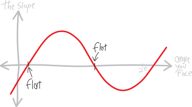
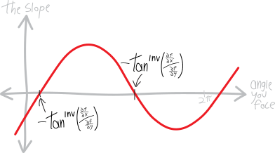
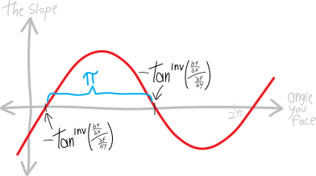
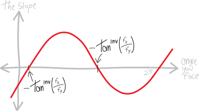
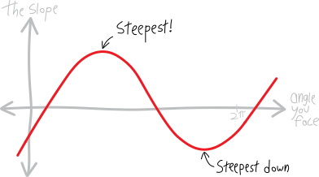
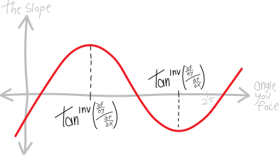
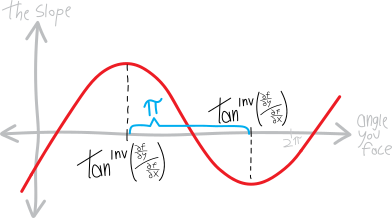
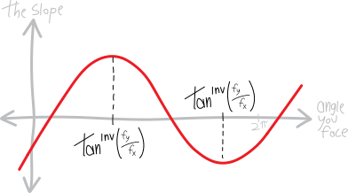
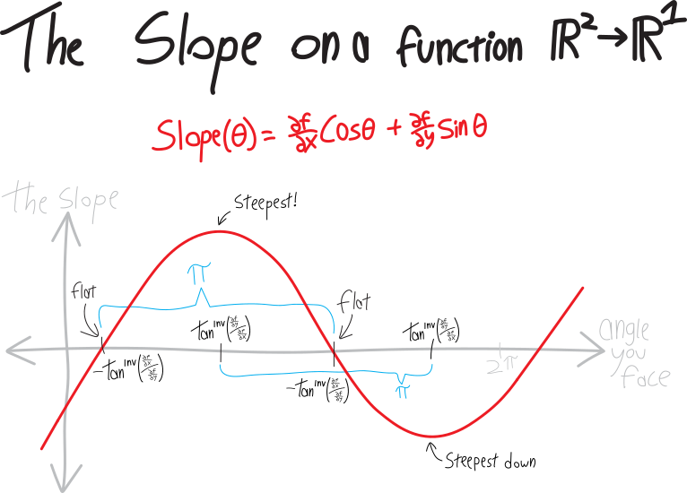

NOTES ON 2D SRUFACE DERIVATIVES ETC ETC ETC 

in 2VC-world things are a little simpler than the more general MVC-world. For one thing, we can *draw pictures*. A nice two-dimensional surface needs two inputs and one output; three dimensions, total; that's something we can easily visualize! If we have a surface/scalar function that takes three inputs (and gives one output), or four inputs, or $n$ inputs, life is much trickier. 

Plus, in 2VC, we can easily think of direction vectors as just a friendly sine-and-cosine pair. In general, a direction vector is a vector in $n$ dimensions whose components all Pythagorean-add to $1$ (by Pythagorean-add I mean the square-root-of-all-of-them-squared-added-up). In two dimensions, that works out to just being $\cos\theta$ for the $x$ and $\sin\theta$ for the $y$, if we want to use an angle $\theta$ in the usual way on the $xy$-plane.

we zoom in really far, and everything becomes a---not a straight *line*, but a straight *plane*. "straight" might not be the best word here; i don't mean "straight" in the "paralell to the ground" sense; i mean "straight" in the "not curvy" sense. (or you can just say **linear** if you want to sound fancy)

that has ramifications

Perhaps we should understand planes better!

in 1VC, every straight line is just:

* a slope
* an offset (or a ``$y$-intercept,'' as we might call it)
$$y = \text{(slope)}x + \text{(offset)}$$

in 2VC, every straight plane is just:

* a slope in the $x$-direction
* a slope in the $y$-direction
* an offset (or a ``$z$-intercept,'' you might call it)
$$y = \text{(slope \#1)}x + \text{(slope \#2)}y  +\text{(offset)}$$

if we're standing at some point
then there's a direction we can turn to make our perspective the steepest:

PICTURE, with gradient vector labelled

there's also a direction we can turn to point in the steepest DOWNHILL direction:

PICTURE, with second neg gradient vector labelled

that direction is also 180 away from steepest uphill!

PICTURE, with angle labelled

meanwhile, there's also a direction we can turn in that will be FLAT!:

PICTURE, with one contour direction labelled

actually, there are TWO such directions:

PICTURE, with other labelled

which, by the way, are both halfway (90 degrees) between the two steepest directions:

PICTURE, with those other angles labelled

maybe picture with contours

slope(angle) = blah

y = acos\theta + b\sin\theta

PIC with labels

kayla lin: "this is such an iconic pod! it's like the avengers in here"

Suppose we have some function:

Here's one of the key steps: now we can think of the slope of $f$, at the point $(x,y)$, in the direction of $\theta$, as being a function of $\theta$:
$$\substack{\text{slope of $f$}\\\text{at $(x,y)$}\\\text{in the direction of $\theta$}}(\theta) = \frac{\partial f}{\partial x}\cos\theta + \frac{\partial f}{\partial y}\sin\theta$$

TKTKTKKTT

We've figured out that if we're on a surface/scalar function---meaning a function that takes in some number of inputs and returns only one output---and we're facing in some direction, then to find the slope (``directional derivative''), we can just dot-product the derivative vector with the unit/direction vector:
$$\substack{\text{the slope}\\\text{in some direction}\\\text{at some point}} = (\text{the gradient/derivative vector})\cdot (\text{the direction vector})$$
If we're in a 2D situation, it gets slightly simpler. The gradient/derivative vector just consists of the two partial derivatives (the one in the $x$ and the one in the $y$):
$$\substack{\text{the slope}\\\text{in some direction}\\\text{at some point}} = \begin{bmatrix}\frac{\partial f}{\partial x} \\ \\ \frac{\partial f}{\partial y} \end{bmatrix} \cdot (\text{the direction vector})$$
Likewise, in 2D, it's easier to talk about the direction. In addition to representing it as a unit/direction vector, we can also represent it as just a single number, an angle:
$$\substack{\text{a direction in $\mathbb{R}^2$}\\\text{as an angle}} : \theta$$
And any direction/unit vector we can write as just a cosine/sine pair of that angle:
$$\substack{\text{a direction in $\mathbb{R}^2$}\\\text{as a unit vector}} : \left\langle \cos\theta, \sin\theta \right\rangle$$
So the slope on a 2D surface, when you're facing the direction $\theta$, will be:
\begin{align*}
   \substack{\text{the slope}\\\text{in some direction}\\\text{at some point}}  &= \left(\text{gradient/derivative vector}\right) \cdot \left(\text{unit/direction vector}\right) \\
   &= \begin{bmatrix}\frac{\partial f}{\partial x} \\ \frac{\partial f}{\partial y} \end{bmatrix} \cdot \begin{bmatrix} \substack{\text{the unit/direction vector}\\\text{in the $x$-direction}} \\ \substack{\text{the unit/direction vector}\\\text{in the $y$-direction}} \end{bmatrix} \\ \\
    &= \begin{bmatrix} \frac{\partial f}{\partial x} \\ \frac{\partial f}{\partial y}\end{bmatrix} \cdot \begin{bmatrix} \cos\theta \\ \sin\theta \end{bmatrix} \\ \\
    &= \frac{\partial f}{\partial x}\cos\theta  \,\,+\,\, \frac{\partial f}{\partial y}\sin\theta
\end{align*}
The two partial derivatives are just constants, note:
$$ \underbrace{\frac{\partial f}{\partial x}}_{\mathclap{\substack{\text{just some}\\\text{number}}}}\cos\theta  \quad+\quad \underbrace{\frac{\partial f}{\partial y}}_{\mathclap{\substack{\text{just some}\\\text{number}}}}\sin\theta$$
Once we plug in the specific values for $x$ and $y$, i.e. the specific values of the partials at that point, then the partials are just numbers. It's like we basically have:
$$\text{slope} = a\cos\theta + b\sin\theta$$
Or, with more detail:
$$\text{slope}(\theta) = \frac{\partial f}{\partial x}\cos\theta  + \frac{\partial f}{\partial y}\sin\theta$$
So we have just a simple equation, which is a function of only one variable, $\theta$!!! That means that if we want, we can do all of our one-dimensional algebra and calculus on that function! We can even draw it!! It'll look like:

Exactly where the intercepts and extrema are will depend on the values of $\frac{\partial f}{\partial x}$ and $\frac{\partial f}{\partial x}$. But basically it looks just like this! Just like a standard trig function! It's just a cosine and a sine, with different coefficients (but the same angles), added together! Any sum of a cosine and sine will look like this!

So, what we're looking at is the angle you're facing on the horizontal axis, and the resulting slope in the direction you're facing on the vertical axis. So, for example, there's a place where this graph has a maximum---and that corresponds to the direction on the original surface in which the surface is steepest!

Likewise, this graph has a minimum---which corresponds to the direction on the original surface in which the surface is steepest *downwards*:

And the graph has two places where it's zero (at least between zero and $2\pi$), which correspond to the two directions you can turn in on the surface to make it flat (the contour directions):

So, where do all these things actually happen?? For example, these two places where the original surface is flat (and the graph is zero). Can we compute what angle makes that happen? 

(Note that the slope-graph ITSELF isn't flat at those points---in other words, the slope of the slope isn't zero. This is a graph whose *output* is the slope of the original surface.)

If we want to calculate the angle we have to turn at to make the surface flat, then that's the same as just finding what angle makes the slope $0$, so we need to find the $\theta$ that makes this slope-function zero: 
$$\text{slope}\left(\theta_\text{flat}\right) = 0$$
I.e.:
$$\frac{\partial f}{\partial x}\cos\theta_\text{flat} + \frac{\partial f}{\partial y}\sin\theta_\text{flat}= 0 $$
So, if we move around the sine:
$$ - \frac{\partial f}{\partial y}\sin\theta_\text{flat} = \frac{\partial f}{\partial x}\cos\theta_\text{flat} $$
And divide by the cosine:
$$ \frac{- \frac{\partial f}{\partial y}\sin\theta_\text{flat}}{\cos\theta_\text{flat}} = \frac{\partial f}{\partial x} $$
And now divide off one of the partials:
$$ \frac{\sin\theta_\text{flat}}{\cos\theta_\text{flat}} = - \frac{\,\,\frac{\partial f}{\partial x}\,\,}{\frac{\partial f}{\partial y} } $$
This is sine over cosine, so it's a tangent:
$$ \tan\theta_\text{flat} = -\frac{\,\,\frac{\partial f}{\partial x}\,\,}{\frac{\partial f}{\partial y} } $$
And then to find the angle we just take the inverse tangent:
$$ \theta_\text{flat} = \tan^\text{inv}\left(- \frac{\,\,\frac{\partial f}{\partial x}\,\,}{\frac{\partial f}{\partial y} } \right)$$
You might or might not remember that negatives can float in and out of tangents^[Just like they can with cubic functions---they're an **odd function**, if you insist on using the fancy name for that phenomenon)($f(-x) = -f(x)$).]:
$$\text{fun fact: }\quad \tan(-\theta)=-\tan\theta$$
So if you want to float the negative out here, this becomes:
$$ \theta_\text{flat} = -\tan^\text{inv}\left(\frac{\,\, \frac{\partial f}{\partial x}\,\,}{\frac{\partial f}{\partial y} } \right)$$
Yay!!!! So we have:

Note that tangent repeats every $\pi$ (every $180^{\circ}$), so in a full $2\pi$ revolution (a full $360^{\circ}$), there are TWO values that work here---i.e., two directions we can point in to make the surface flat/the slope zero!
$$ \theta_\text{flat} = -\tan^\text{inv}\left(\frac{\,\, \frac{\partial f}{\partial x}\,\,}{\frac{\partial f}{\partial y} } \right)\quad\substack{\text{two solutions}\\\text{between $0$ and $2\pi$!}}$$

We've already seen that intuitively---every point has a contour line in both directions; there are two directions you can turn in to make the surface flat. This is the math behind that!

And if you prefer using the $f_x$ and $f_y$ notation for partial derivatives, which avoids the aesthetic ugliness of these fractions of fractions, you can write this as:
$$ \theta_\text{flat} = -\tan^\text{inv}\left(\frac{f_x}{f_y} \right)$$

Yay!

How about the angle that makes the slope the biggest? Can we find that??

We can just use 1VC!!! We have a function for the slope---so we can just take its derivative, set the derivative equal to zero, and solve for the angle!!! To take the derivative, we have:
\begin{align*}
\text{slope}'\left(\theta\right) &= \left(\, \frac{\partial f}{\partial x}\cos\theta + \frac{\partial f}{\partial y}\sin\theta \right)' \\ \\
&= -\frac{\partial f}{\partial x}\sin\theta + \frac{\partial f}{\partial y}\cos\theta
\end{align*}
So then we need to find what angle makes this derivative zero:
$$\text{slope}'\left(\theta_\text{steepest}\right) = 0$$
Which will be:
$$ -\frac{\partial f}{\partial x}\sin\theta_\text{steepest} + \frac{\partial f}{\partial y}\cos\theta_\text{steepest}  = 0 $$
Of course, note that setting the derivative equal to zero won't necessarily give us the *biggest* slope; it'll also give us the *smallest* slope. Derivatives being zero give us maxima AND minima (also potentially cubicky indecisive points). But that's fine; we can deal with that later. So, solving this for theta, we can first move things around:
$$ \frac{\partial f}{\partial y}\cos\theta_\text{steepest} = \frac{\partial f}{\partial x}\sin\theta_\text{steepest} $$
And then put the partials on one side and the triggies on the other side:
$$ \frac{\,\, \frac{\partial f}{\partial y}\,\,}{\frac{\partial f}{\partial x}} = \frac{\sin\theta_\text{steepest}}{\cos\theta_\text{steepest}} $$
That's just a tangent:
$$ \frac{\,\, \frac{\partial f}{\partial y}\,\,}{\frac{\partial f}{\partial x}} = \tan\theta_\text{steepest} $$
Which we can invert:
$$ \tan^\text{inv}\left( \frac{\,\, \frac{\partial f}{\partial y}\,\,}{\frac{\partial f}{\partial x}} \right)= \theta_\text{steepest} $$
Or:
$$\theta_\text{steepest}  = \tan^\text{inv}\left( \frac{\,\, \frac{\partial f}{\partial y}\,\,}{\frac{\partial f}{\partial x}} \right)$$
Yay!!! And like before, tangent repeats every $\pi$ (every $180^\circ$), so there are two solutions here in a full $2\pi$ a.k.a $360^\circ$ revolution of the circle. In other words, there are two points where the ``slope'' graph is flat---one of which corresponds to the maximum slope and one of which corresponds to the minimum slope. (A derivative being zero doesn't distinguish between the max and the min.)
$$ \theta_\text{steepest} = \tan^\text{inv}\left(\frac{\,\, \frac{\partial f}{\partial y}\,\,}{\frac{\partial f}{\partial x} } \right)\quad\substack{\text{two solutions}\\\text{between $0$ and $2\pi$!}}$$
So we have:

These are both $180^\circ$, i.e. $\pi$ apart:

And again, maybe it's more clear to represent the partials as $f_x$ and $f_y$:

In summary:
{ style="border-width:0.25pt solid black;" }

 so in a full $2\pi$ revolution (a full $360^\circ$), there are TWO values that work here---i.e., two directions we can point in to make the surface flat/the slope zero!

we could also do all of this in terms of direction/unit vectors instead of angles. that'll generalize better to higher dimensions!

