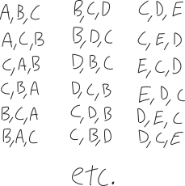
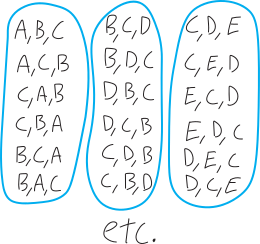

Counting is hard.

No, seriously.

It's easy to count when we know how many things we want to count. 

We can all count to three, or even three hundred, but what if we want to count the number of ways we could choose some things? 

One of the distinctions that we need to make is whether we care about the *order* in which we count things. Sometimes there might be times when the order in which we count things matters (does it matter which thing we pick first? which thing we pick second?); other times, that order might not matter.

## neat and clean: counting when order matters

Here's an example. Suppose we're picking three letters from the alphabet. All caps, no repeats. How many different ways are there of picking those three letters? Let's assume, for starters, that we care about the order in which we pick the letters:

$$\text{If order matters: }A,B,C \text{ is different from }C,B,A$$

If the order we pick them in matters, our possibilities are things like:

{ width=75% }

I'm not going to draw out all the possibilities, because there are way too many! How many? There are:

* $26$ choices for the first letter
* $25$ choices for the second letter
* $24$ choices for the third letter

So then, the total number of possible three-letter sequences we can make is:

$$\substack{\text{the total number of ways}\\\text{to pick three letters}\\\text{when order matters}} = 26\cdot 25\cdot 24$$

This works out to be $15,600$. I'll leave it as $26\cdot 25 \cdot 24$, because that shows *where that number comes from*. If we write it as just $15,600$, it just shows the answer. But writing it as $26\cdot 25 \cdot 24$ shows the *bones*! It shows the *construction*! It's a window into what's going on! 

What are some other ways we can express this number? It kinda seems like a factorial. Factorials involve multiplying numbers. But factorials multiply all the numbers down to $1$. For example, $26$ factorial is:
$$26 \text{ factorial} \,\,=\,\, 26! \,\,=\,\, 26\cdot 25 \cdot 24 \cdot 23 \cdot 22 \cdot 21 \cdots \text{etc.} \cdots 3 \cdot 2 \cdot 1 = \substack{\text{a ginormous number}\\\text{that we're not going to write out}}$$
In our case, $26\cdot 25 \cdot 24$ is like $26!$, but only going down to $24$, not down to $1$. 
$$\substack{\text{the total number of ways}\\\text{to pick three letters}\\\text{when order matters}} \quad=\quad 26\cdot 25\cdot 24 \quad= \quad \substack{\text{like a factorial}\\\text{but only going down to $24$}}$$
Hmm... maybe we could write this with a factorial by taking $26!$ and getting rid of the stuff we don't want?
$$26! = \underbrace{26\cdot 25 \cdot 24}_{\mathclap{\text{this is what we want}}} \cdot \underbrace{23 \cdot 22 \cdot 21 \cdots 3 \cdot 2 \cdot 1}_{\text{can we get rid of this?}}$$
We can get rid of all that other stuff by dividing! We want to divde by all the integers $23$ and less:
$$\frac{26\cdot 25 \cdot 24 \cdot 23 \cdot 22 \cdot 21 \cdots 3 \cdot 2 \cdot 1}{23 \cdot 22 \cdot 21 \cdots 3 \cdot 2 \cdot 1} $$
Because then things will cancel:
$$\frac{26\cdot 25 \cdot 24 \cdot \cancel{23} \cdot \cancel{22} \cdot \cancel{21} \cdots \cancel{3} \cdot \cancel{2} \cdot \cancel{1}}{\cancel{23} \cdot \cancel{22} \cdot \cancel{21} \cdots \cancel{3} \cdot \cancel{2} \cdot \cancel{1}} $$
... but on the bottom, that's just a factorial! It's just $23!$ in the denominator!
$$\frac{26!}{23!} = \frac{26\cdot 25 \cdot 24 \cdot \cancel{23} \cdot \cancel{22} \cdot \cancel{21} \cdots \cancel{3} \cdot \cancel{2} \cdot \cancel{1}}{\cancel{23} \cdot \cancel{22} \cdot \cancel{21} \cdots \cancel{3} \cdot \cancel{2} \cdot \cancel{1}} $$
So we're left with: 
$$\frac{26!}{23!}  \quad=\quad \frac{26\cdot 25 \cdot 24 \cdot \cancel{23} \cdot \cancel{22} \cdot \cancel{21} \cdots \cancel{3} \cdot \cancel{2} \cdot \cancel{1}}{\cancel{23} \cdot \cancel{22} \cdot \cancel{21} \cdots \cancel{3} \cdot \cancel{2} \cdot \cancel{1}} \quad=\quad 26\cdot 25 \cdot 24$$
Or just:
$$26\cdot 25 \cdot 24 = \frac{26!}{23!}$$
So we have:

$$\substack{\text{the number of ways we can pick three things}\\\text{from a set of 26 things}\\\text{where order matters}} \quad=\quad 26\cdot 25 \cdot 24 \quad = \quad \frac{26!}{23!}$$

In this formula, as we've written it, it feels a bit like the $23$ is coming out of nowhere. Where's the $23$ coming from? It's coming from the fact that we're choosing from a set of $26$ things, but only choosing three things, and $26-3=23$. So another way to write this is:

$$\substack{\text{the number of ways we can pick three things}\\\text{from a set of 26 things}\\\text{where order matters}} \quad=\quad \frac{26!}{(26-3)!}$$

I'm writing it that way because it makes the more general idea more clear!!! What if we have not $26$ things, but $n$ things, and what if we choose not $3$ of them, but $k$ of them?

$$\substack{\text{the number of ways we can pick $k$ things}\\\text{from a set of $n$ things}\\\text{where order matters}} \quad=\quad \frac{n!}{(n-k)!}$$

Mathematicians call this a **permutation**. The typical notation people use to express it is ${}_n \mathrm{ P }_k$, where we have $n$ things and we pick $k$ of them, and we care about order. 

Don't worry too much about the notation. Worry about the *ideas*, not the *symbols*. Notation is how we *express* mathematics, but it's not what mathematics *is*.

$$\substack{\text{the number of ways we can pick $k$ things}\\\text{from a set of $n$ things}\\\text{where order matters}} \quad = \quad {}_n \mathrm{ P }_k \quad=\quad \frac{n!}{(n-k)!} \quad= \quad \left(\substack{\text{kinda like a factorial}\\\text{but from $n$}\\\text{only down to $n-k$}}\right)$$
Don't try to memorize this! It'll be worse if you try to memorize it! Try to understand it, and understand where it comes from!

If you want a scary abstract way to write $\frac{n!}{(n-k)!}$, you could write it like this:

\begin{align*}
\frac{n!}{(n-k)!}  &= \frac{n (n-1)(n-2)(n-3) \cdots \big(n-\,(k+2)\,\big) \big(n-\,(k+1)\,\big)  (n-k)\cdot (n-k-1) \cdots \cdot 3\cdot2 \cdot 1}{(n-k)(n-k-1)(n-k-2)\cdots \cdot 3\cdot2 \cdot 1} \\ \\
&= \frac{n (n-1)(n-2)(n-3) \cdots \big(n-\,(k+2)\,\big) \big(n-\,(k+1)\,\big)  \cancel{(n-k)} \cancel{(n-k-1)} \cdots \cancel3\cancel2 \cancel1}{\cancel{(n-k)}\cancel{(n-k-1)}\cancel{(n-k-2)}\cdots \cancel3\cdot\cancel2 \cancel1} \\ \\
&= n\cdot (n-1)\cdot(n-1)\cdot (n-1) \cdots \text{ etc. } \cdots \big(n-\,(k+2)\,\big)\cdot \big(n-\,(k+1)\,\big) \\ \\
&= \quad\text{kinda like a factorial, but from $n$ only down to $n-k$} \\ \\
\end{align*}

This looks scary, but it's no different than just multiplying together all the integers starting with $26$ and going down through the next three integers! It's just an abstract way of phrasing/formulating that. Note that the last factor is $\big(n-\,(k+1)\,\big)$ and not $(n-k)$, because $(n-k)$ is the first factor we're *not* including. In the example with $26$ letters, we start at $26$ and go down three to $24$, so $26\cdot 25\cdot 24$, and $26-3$, i.e. $23$, is the first number we *don't* include. So $26-(3+1)$ gets us $26-2=24$, which is the last number we *do* want.

In summary, our specific example is:
$$\substack{\text{the number of ways we can pick three things}\\\text{from a set of 26 things}\\\text{when order matters}} = 26\cdot 25 \cdot 24 = \frac{26!}{23!} = \frac{26!}{(26-3)!}$$
More generally, we have:
$$\boxed{\quad\text{a ``permutation:'' }\,\, \substack{\text{the number of ways we can pick $k$ things}\\\text{from a set of $n$ things}\\\text{when order matters}} = \frac{n!}{(n-k)!} = {}_{n} P_k \quad}$$

## messy and chaotic: counting when order doesn't matter

What if we don't care about the order in which we pick things? What if we pick three letters, but we don't care about the order in which we get out those letters?
 
$$\text{if order doesn't matter: }\quad A,B,C \text{ is the same as }C,B,A$$

This means we're going to have *fewer* options! If we think about our original list of all the ways to pick out three letters, and if we don't care about the order of those three letters, then some of those are going to be the same:

{ width=75% }

To use the fancy word, we're **overcounting**. If we care about order, then $A,B,C$ is different than $B,C,A$. If we don't care about order, then those are the same! Our vision is blurrier. Things that were once different are now the same. Things are crystallizing. We're zooming out. 

Our question now is: how many options are there? We know how many ways to pick three letters if order matters; how many ways are there to pick three letters if order doesn't matter? Presumably it's less:

$$ \substack{\text{the number of ways we can pick three things}\\\text{from a set of 26 things}\\\text{when order DOESN'T matter}} \quad<\quad \substack{\text{the number of ways we can pick three things}\\\text{from a set of 26 things}\\\text{when order DOES matter}}$$

But how much less? How do we figure it out? 

We need to somehow compensate for the overcounting:

$$\substack{\text{the number of ways we can pick things}\\\text{when order DOESN'T matter}} = \frac{\text{number of ways we can pick things, when order DOES matter}}{\text{amount by which that overcounts}}$$

If we look at the diagram above, it seems like that if we don't care about order, our original possibilities crystallize into groups of $6$. So it seems like we're overcounting by a factor of $6$. It seems like, in order to figure out the number of ways to pick three things from a set of $26$ things when order *doesn't* matter, we just divide by six:

\begin{align*}
\substack{\text{the number of ways we can pick three things}\\\text{from a set of 26 things}\\\text{when order DOESN'T matter}} &= \frac{\quad \substack{\text{the number of ways we can pick three things}\\\text{from a set of 26 things}\\\text{when order DOES matter}} \quad }{6} \\ \\
&= \frac{15600}{6} \\ \\
&= 2600
\end{align*}

Why? Why six?

It's coming from the number of different ways there are to arrange these sets of three items. If we've already chosen three things, how many different orders are there that we can order them in? How many different ways are there to arrange three things, when the order *does* matter? We've already figured this out! It's just:

\begin{align*}
\substack{\text{the number of ways to arrange three things}\\\text{when order matters}} \,\,&=\,\, 3\cdot 2 \cdot 1 \\
&= 3! \\ 
&= 6
\end{align*}

So that's how many DIFFERENT ways there are of ordering these same things! That's the amount (the factor) we've overcounted by!

We can even phrase it in terms of permuatations and whatnot. This just just the number of ways to "choose" three things from a set of three things, when the order matters. It's a permutation!
\begin{align*}
\substack{\text{the number of ways to arrange $3$ things}\\\text{when order DOES matter}} \,\,&=\,\,  \substack{\text{the number of ways to pick}\\\text{$3$ things from a set of $3$ things}\\\text{when order DOES matter}}\\ \\
&= {}_3 \mathrm{ P }_3 \\ \\
&=  \frac{3!}{(3-3)!} \\ \\
&=  \frac{k!}{0! } \\ \\
&=\frac{3!}{1 } \quad\quad(\text{because }0!=1) \\ \\
&= 3! \\
&= 3\cdot 2 \cdot 1 \\
&= 6
\end{align*}

Admittedly, choosing three things from a set of three things doesn't feel like much of a "choice"... but that's the language!

More generally, using this big fancy formulation of permutatations, the number of ways we can arrange $k$ things is:

\begin{align*}
\substack{\text{the number of ways to arrange $k$ things}\\\text{when order DOES matter}} &=  \substack{\text{the number of ways to pick}\\\text{$k$ things from a set of $k$ things}\\\text{when order DOES matter}}\\ \\
&= {}_k \mathrm{ P }_k \\ \\
&=  \frac{k!}{(k-k)!} \\ \\
&=  \frac{k!}{0! } \\ \\
&=\frac{k!}{1 } \quad\quad(\text{because }0!=1) \\ \\
&= k!
\end{align*}

So, a fuller calculation, to find the number of ways to pick three letters, when we don't care about the order, might look like:

\begin{align*}
\substack{\text{the number of ways to pick three things from a set of 26 things}\\\text{where order DOESN'T matter}} \,\,&=\,\, \frac{\quad \substack{\text{the number of ways to pick}\\\text{three things from a set of 26 things}\\\text{when order DOES matter}}\quad}{\text{the amount that overcounts}} \\ \\
&=\frac{\quad \substack{\text{the number of ways to pick $3$ things from a set of 26 things}\\\text{when order DOES matter}}\quad}{\quad\substack{\text{the number of ways to arrange $3$ things}\\\text{when order DOES matter}}\quad} \\ \\
&= \frac{\quad  \frac{26!}{(26-3)!}  \quad}{3!} \\ \\
&=   \frac{26!}{3!(26-3)!} \quad \quad\text{(algebra)} \\ \\
&= \frac{26\cdot 25 \cdot 24}{3\cdot2\cdot 1} \\ \\
&= \frac{15600}{6} \\ \\
&= 2600
\end{align*}

Mathematicians call this kind of counting a **combination**: when we're counting things, and we don't care about the order. There are a couple different notations in standard rotation: 

$$\text{a ``combination:''}\quad \substack{\text{the number of ways we can choose $k$ things}\\\text{from a set of $n$ things}\\\text{where order DOESN'T mater}} = {}_n \mathrm{ C }_k = \binom{ n }{ k } = \text{``$n$ choose $k$''}$$

``$n$ choose $k$'' is how it usually gets pronounced. We have $n$ things; we choose $k$ of them, without caring about order. As a formula, it works out to be:

\begin{align*}
\substack{\text{the number of ways we can choose $k$ things}\\\text{from a set of $n$ things}\\\text{where order DOESN'T mater}} &= \frac{\quad  \substack{\text{the number of ways to pick $k$ things from a set of $n$ things}\\\text{when order DOES matter}}\quad}{\quad \text{the amount that overcounts}\quad} \\ \\ \\
&=\frac{\quad \substack{\text{the number of ways to pick $k$ things from a set of $n$ things}\\\text{when order DOES matter}}\quad}{\quad\substack{\text{the number of ways to arrange $k$ things}\\\text{when order DOES matter}}\quad} \\ \\
&= \frac{\quad  \frac{n!}{(n-k)!}  \quad}{k!} \\ \\
&= \frac{n!}{k!(n-k)!}
\end{align*}

That extra $k!$ factor on the bottom is like an "overcounting correction factor:"
$$\substack{\text{the number of ways we can choose $k$ things}\\\text{from a set of $n$ things}\\\text{where order DOESN'T mater}} = \frac{n!}{\underbrace{k!}_{\mathclap{\substack{\text{overcounting}\\\text{correction factor}}}}(n-k)!}$$

So, in summary, we have:

$$\boxed{\quad \substack{\text{the number of ways we can choose $k$ things}\\\text{from a set of $n$ things}\\\text{where order DOESN'T mater}} = {}_n \mathrm{ C }_k = \binom{ n }{ k } = \text{``$n$ choose $k$''} = \frac{n!}{k!(n-k)!} \quad} $$

## enthusiasm

One of the things I love about the particular notational and typographical choices that happen to have arisen here in combinatorics---all these factorials!---is the inherent *enthusiasm*.

(... he writes, ending his sentence with a full stop.)

## problem

What if we have this same collection of three letters, and we care about how they're ordered... *kinda*. Like we care about how they're ordered, but we don't care *that much*. (Is that like being a little bit pregnant? Isn't this a discrete situation?) What I mean here is, suppose we 