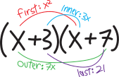
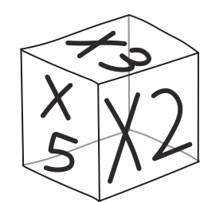
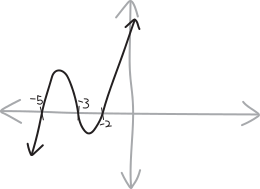

Life is about making choices.

Multiplication, too, is about making choices.

We've spent so much time this semester learning how to count. Let's stay in elementary school, and learn how to *multiply*.

## FOIL revisited

You've got a quadratic. It's factored:
$$(x+3)(x+7)$$
If this were a function:
$$f(x) = (x+3)(x+7)$$
... then it'd be easy to graph! Factoring lets us *see* polynomials. It looks like:
{ width=50% }
If we want to multiply it out, how do we do that? We all know the FOIL algorithm:

* multiply together the **first** terms of each factor (the $x$ and the $x$)
* multiply together the **outer** terms (the $x$ and the $7$)
* multiply together the **inner** terms (the $3$ and the $x$)
* multiply together the **last** terms (the $3$ and the $7$)
* add 'em all up

{ width=50% }

So our multiplication looks like:
$$(x+3)(x+7) \quad=\quad \begin{matrix}\text{(the first terms)} \\ + \\
\text{(the outer terms)} \\ + \\
\text{(the inner terms)} \\ + \\
\text{(the last terms)}  \end{matrix} \quad=\quad \begin{matrix} x\cdot x \\ + \\
x \cdot 7\\ + \\
3\cdot x \\+ \\
3\cdot 7 \end{matrix} \quad=\quad \begin{matrix}x^2 \\+\\ 7x\\ +\\  3x \\+\\ 21\end{matrix} \quad=\quad x^2 + 10x + 21 $$
Or, put differently:
$$(x+3)(x+7) \,\,=\,\, \begin{matrix}\left(\substack{\text{the first term}\\\text{from the first factor}}\right)\left(\substack{\text{the first term}\\\text{from the second factor}}\right)\\ + \\
\left(\substack{\text{the first term}\\\text{from the first factor}}\right)\left(\substack{\text{the second term}\\\text{from the second factor}}\right)\\ + \\
\left(\substack{\text{the second term}\\\text{from the first factor}}\right)\left(\substack{\text{the first term}\\\text{from the second factor}}\right)\\ + \\
\left(\substack{\text{the second term}\\\text{from the first factor}}\right)\left(\substack{\text{the second term}\\\text{from the second factor}}\right) \end{matrix} \,\,=\,\, \begin{matrix} x\cdot x \\ + \\
x \cdot 7\\ + \\
3\cdot x \\+ \\
3\cdot 7 \end{matrix} \,\,=\,\, \begin{matrix}x^2 \\+\\ 7x\\ +\\  3x \\+\\ 21\end{matrix} \,\,=\,\, x^2 + 10x + 21 $$
Fair enough. But FOIL doesn't generalize much beyond this case of two factors with two things added up. What if we have three factors? or four? 
$$\text{how do we multiply out this: }\quad (x+3)(x+5)(x+7) \quad ???$$
What if there are not two things added up in each factor, but *three* things? Or four??
$$\text{how do we multiply out this: }\quad (x+3 + y)(x+5)(x+7) \quad ???$$
FOIL is nice, but it doesn't help us out in those more complicated situations.

Maybe some of you like using boxes! We want to multiply out a factored quadratic; we draw a $2\times 2$ grid/box; we arrange the two terms from one of the factors on the top and the others on the side:
$$
\begin{array}{ccc}
&x & 3 \\[2pt]
\hline
x &  &  \\[8pt]
7 & &  \\
\end{array}
$$
And then we multiply together the corresponding rows and columns:
$$
\begin{array}{ccc}
& {\color{gray} x} & {\color{gray} 3} \\[2pt]
\hline
{\color{gray} x} &  x^2 &  3   \\[8pt]
{\color{gray} 7} &  7x & 21  \\
\end{array}
$$
And then we just add up all four of the terms in the boxes!

The cool thing with this method is that it can let us deal with situations in which we have more than just two terms in a factor! For instance, if we have:
$$(x+3 + y)(x+5)$$
We can multiply it with this method by making a box like:
$$
\begin{array}{ccc}
&x & 3 & y\\[2pt]
\hline
x &  &  \\[8pt]
5 &  &  \\
\end{array}
$$
And filling it in:
$$
\begin{array}{ccc}
& {\color{gray} x} & {\color{gray} 3} & {\color{gray} y} \\[2pt]
\hline
{\color{gray} x} & x^2 & 3x & xy  \\[8pt]
{\color{gray} 5} & 5x & 15 & 5y  \\
\end{array}
$$
And adding the resulting terms up:
\begin{align*}
(x+3 + y)(x+5) =& \quad x^2 + 3x + xy \\
&+ 5x + 15 + 5y \\ \\
=&\,\, x^2 + xy + 8x + 5y + 15
\end{align*}
AND, this method even generalizes to more than two factors!!! For instance, if we want to multiply together 
$$(x+5)(x+3)(x+2)$$
We can do it, just by making a *three*-dimensional box, with each factor along each of the three dimensions! So it's a $2\times 2 \times 2$ box, with $8$ total cells! Here's the box:
{ width=50% }
And here it is, with all eight of the cells filled in!!!
{ width=50% }
So we have:
\begin{align*}
(x+5)(x+3)(x+2) & = x^3 + 3x^2 + 5x^2 + 2x^2 + 6x + 10x + 30 \\
&= x^3 + 10x^2 + 31x + 30
\end{align*}
But... this is hard to do in practice, because paper has only two dimensions. Look at what a mess my illustration is! And if we have *four* factors, then we'd need a *four*-dimensional box! It's a great strategy in theory; it's less great in practice.

## why does any of this work?

These are some cool strategies for how to multiply out quadratics. But *why* do these strategies work in the first place? Like, yeah, we've got these cool methods, but *why* do they work?

When we're scientists, trying to develop novel new drugs, sometimes we find drugs that seem to work (based on our essays, clinical trials, experimentation, etc.). But then we want to try to figure out *why* the drugs work. What's the fundamental mechanism? What receptors are being activated? What ion channels are being blocked? *What's actually happening*? 

When it comes to multiplying out binomials, it's fundemantally about the **distributive property**. Remember that one? You might not; that's fine. The distributive property is the arithmetic law that says that if we're multiplying some number by two numbers added up, then what we need to do is multiply the number by each of the two numbers, seperately, and then add up the result:
$$a(b+c) = a\cdot b \,\,+\,\, a\cdot c$$
This one big term splits up into *two* terms added up. Maybe we could represent that by dooding some arrows:
$$a(b+c)\quad
\begin{matrix}
{\color{LightGray} \nearrow}  \\
= \\ 
{\color{LightGray} \searrow}  \\
\end{matrix}
\quad
\begin{matrix}
ab \\
\\
+ \\ 
\\
bc \\
\end{matrix}$$
So if we're multiplying out a quadratic-style thing, with *two* factors consisting of two things added up each:
$$(a+b)(c+d)$$
then we do the distributive property TWICE! First, we distribute once, and we get:
$$(a+b)(c+d) \quad=\quad
\begin{matrix}
\\
\\ 
a\cdot(b+c) \\ 
\\
+ \\
\\
b\cdot(c+d) \\
\\ \\
\end{matrix}
$$
Then, we take each of the two things we get, and we distribute AGAIN, a second time:
$$(a+b)(c+d) \quad=\quad
\begin{matrix}
\\
\\ 
a\cdot(b+c) \\ 
\\
+ \\
\\
b\cdot(c+d) \\
\\ \\
\end{matrix}\quad=\quad
\begin{matrix}
\\
a\cdot c 
\\ 
+ \\
a \cdot d 
\\
+ \\
b\cdot c 
\\
+ \\
b\cdot d
\\ \\
\end{matrix}
$$
Or just:
$$(a+b)(c+d) \quad=\quad
\begin{matrix}
\\
\\ 
a\cdot(b+c) \\ 
\\
+ \\
\\
b\cdot(c+d) \\
\\ \\
\end{matrix}\quad=\quad
\begin{matrix}
\\
a\cdot c 
\\ 
+ \\
a \cdot d 
\\
+ \\
b\cdot c 
\\
+ \\
b\cdot d
\\ \\
\end{matrix}
\quad=\quad
\begin{matrix}
\\
ac 
\\ 
+ \\
ad 
\\
+ \\
bc 
\\
+ \\
bd
\\ \\
\end{matrix}
$$
I'm using vertical space in the equations above, to show how the distributive property makes things *branch*, like a tree. Written without all of the details, this looks like:
$$(a+b)(c+d) \quad=\quad ac+ad+bc+bd$$
Yay! So this gives us, basically a recursive algorithm for how to multiply out polynomials; it gives us a recursive algorithm for how to multiply things out when we have repeated chunks of stuff added up, multiplied out. 

Let's re-do that same multiplication with $(x+3)(x+7)$ again, but visualizing/displaying it as a tree, to make all the distributive property parts clear:
$$(x+3)(x+7) \quad=\quad
\begin{matrix}
\\
\\ 
x\cdot(x+7) \\ 
\\
+ \\
\\
3\cdot(x+7) \\
\\ \\
\end{matrix}\quad=\quad
\begin{matrix}
\\
x\cdot x 
\\ 
+ \\
x \cdot 7 
\\
+ \\
3\cdot x 
\\
+ \\
3\cdot 7
\\ \\
\end{matrix}
$$
If we keep going and simplify things, this becomes:
$$(x+3)(x+7) \quad=\quad
\begin{matrix}
\\
\\ 
x\cdot(x+7) \\ 
\\
+ \\
\\
3\cdot(x+7) \\
\\ \\
\end{matrix}\quad=\quad
\begin{matrix}
\\
x\cdot x 
\\ 
+ \\
x \cdot 7 
\\
+ \\
3\cdot x 
\\
+ \\
3\cdot 7
\\ \\
\end{matrix} \quad=\quad
\begin{matrix}
\\
x^2
\\ 
+ \\
7x
\\
+ \\
3x 
\\
+ \\
21
\\ \\
\end{matrix} \quad=\quad
\begin{matrix}
\\
\\ 
x^2 \\
+
\\
10x \\
+ \\
21
\\ \\ \\
\end{matrix}
$$
One thing that happens when we multiply out polynomials like this (which dosn't happen if we're multiplying out generic bundles like $(a+b)(c+d)$) is that we get a bunch of terms with the same number of $x$'s. Then, to clean our answer up, we can add together like terms. So one way to organize all of our resulting multiplications is to group them by how many $x$'s they have, e.g.:
$$\begin{matrix} 
x \cdot x
 \end{matrix} \quad+\quad \begin{matrix} 
x \cdot 7 \\ + \\ 
3 \cdot x\end{matrix}\quad+\quad  \begin{matrix} 3 \cdot 7\end{matrix}$$
Or just
$$\begin{matrix}x^{2}
 \end{matrix} \quad+\quad \begin{matrix} 
7 \, x \\ + \\ 
3 \, x
 \end{matrix} \quad+\quad \begin{matrix} 
21\end{matrix}$$
That way, it's easy to see how to add like terms---just add up the columns! Here perhaps it doesn't matter that much, but with more complicated polynomials, this might be useful!

$$\begin{matrix} x^{2} + 10 \, x + 21 \end{matrix}$$

## cubics: getting serious

OK, let's go back to the same cubic we saw earlier. Here it is, factored:
$$(x+5)(x+3)(x+2)$$
Visually, it looks like:
{ width=75% }
What if we want to multiply it out? Using a 3D box seems annoying (and in any case, not easily generalizable beyond a a cubic). What if we try multiplying this out using this same idea of recursively applying the distributive property?

Because of distributivity, this is going to result in eight total terms! At each factor, we have two choices for which of the two terms to pick and then multiply:
$$\underbrace{(x+5)}_{\mathclap{\text{choose one}}}\cdot\underbrace{(x+3)}_{\mathclap{\text{choose one}}}\cdot  \underbrace{(x+2)}_{\mathclap{\text{choose one}}} $$
So if we want to know how many total multiplications we end up with, it's something like:
\begin{align*}
\text{(two choices)}\text{(two choices)}\text{(two choices)} &= 2^3 \\
&= 8\text{ total terms, before simplifying and combining things}
\end{align*}
Let's do the actual multiplication! Just like with our counting problems, we can visualize this as a tree. At every juncture we're making one of two choices. So at every factor, we split into two branches, and ultimately, we end up with our $2^3=8$ different choices of multiplying one thing from each factor. 

So, first, we distribute/choose from the $(x+5)$ term:
$$(x+5)(x+3)(x+2)\quad
\begin{matrix}
{\color{LightGray} \nearrow}  \\
\\
\\
= \\ 
\\
\\
{\color{LightGray} \searrow}  \\
\end{matrix}
\quad
\begin{matrix}
\\ 
x\cdot (x+3)(x+2)
\\
\\
\\
\\
+\\ 
\\
\\
\\
5\cdot (x+3)(x+2)
\\
\end{matrix}
$$
That gives us two terms. Let's distribute the $(x+3)$ next, which will give us two more terms for each term, so we'll have a total of four terms:
$$(x+5)(x+3)(x+2)\quad
\begin{matrix}
\\ 
\\
\\
\\
\\
\\
{\color{LightGray} \nearrow}  \\
\\
\\
= \\ 
\\
\\
{\color{LightGray} \searrow}  \\
\\
\\
\\
\\
\\
\\
\end{matrix}
\quad
\begin{matrix}
\\ 
\\
\\
\\
\\
\\
x\cdot (x+3)(x+2)
\\
\\
\\
\\
+\\ 
\\
\\
\\
5\cdot (x+3)(x+2)
\\
\\
\\
\\
\\
\\
\\
\end{matrix}
\quad\begin{matrix}
\\ 
\\
\\
\\
\\
{\color{LightGray} \nearrow} \\
\\
{\color{LightGray} \searrow}  \\
\\
\\
= \\
\\
\\
{\color{LightGray} \nearrow} \\
\\
{\color{LightGray} \searrow}  \\
\\
\\
\\
\\
\\
\end{matrix}
\quad
\begin{matrix}
\\
\\
x\cdot x (x+2)
\\
\\
+\\ 
\\
x\cdot 3 (x+2)
\\
\\
+\\
\\
5\cdot x (x+2)
\\
\\
+\\
\\
5\cdot 3 (x+2)
\\
\\
\\
\end{matrix}
$$
And finally, let's distribute out the last factor:
$$(x+5)(x+3)(x+2)\quad
\begin{matrix}
\\ 
\\
\\
\\
\\
\\
{\color{LightGray} \nearrow}  \\
\\
\\
= \\ 
\\
\\
{\color{LightGray} \searrow}  \\
\\
\\
\\
\\
\\
\\
\end{matrix}
\quad
\begin{matrix}
\\ 
\\
\\
\\
\\
\\
x\cdot (x+3)(x+2)
\\
\\
\\
\\
+\\ 
\\
\\
\\
5\cdot (x+3)(x+2)
\\
\\
\\
\\
\\
\\
\\
\end{matrix}
\quad\begin{matrix}
\\ 
\\
\\
\\
\\
{\color{LightGray} \nearrow} \\
\\
{\color{LightGray} \searrow}  \\
\\
\\
= \\
\\
\\
{\color{LightGray} \nearrow} \\
\\
{\color{LightGray} \searrow}  \\
\\
\\
\\
\\
\\
\end{matrix}
\quad
\begin{matrix}
\\
\\
x\cdot x (x+2)
\\
\\
+\\ 
\\
x\cdot 3 (x+2)
\\
\\
+\\
\\
5\cdot x (x+2)
\\
\\
+\\
\\
5\cdot 3 (x+2)
\\
\\
\\
\end{matrix}
\quad
\begin{matrix}
\\ \\
{\color{LightGray} \nearrow} \\
{\color{LightGray} \searrow} \\
 \\ \\
{\color{LightGray} \nearrow} \\
{\color{LightGray} \searrow} \\
\\
= \\
{\color{LightGray} \nearrow} \\
{\color{LightGray} \searrow} \\
 \\
 \\
{\color{LightGray} \nearrow} \\
{\color{LightGray} \searrow} \\
\\
\end{matrix}
\quad
\begin{matrix}
x\cdot x \cdot x  \\
+\\
x\cdot x \cdot 2  \\
+\\
x\cdot 3 \cdot x  \\
+\\
x\cdot 3 \cdot 2  \\
+\\
5\cdot x \cdot x  \\
+\\
5\cdot x \cdot 2   \\
+\\
5\cdot 3 \cdot x \\
+\\ 
5\cdot 3 \cdot 2
\end{matrix}
$$
Cleaning this this up, we get:
$$(x+5)(x+3)(x+2)\quad
\begin{matrix}
\\ 
\\
\\
\\
\\
\\
{\color{LightGray} \nearrow}  \\
\\
\\
= \\ 
\\
\\
{\color{LightGray} \searrow}  \\
\\
\\
\\
\\
\\
\\
\end{matrix}
\quad
\begin{matrix}
\\ 
\\
\\
\\
\\
\\
x\cdot (x+3)(x+2)
\\
\\
\\
\\
+\\ 
\\
\\
\\
5\cdot (x+3)(x+2)
\\
\\
\\
\\
\\
\\
\\
\end{matrix}
\quad\begin{matrix}
\\ 
\\
\\
\\
\\
{\color{LightGray} \nearrow} \\
\\
{\color{LightGray} \searrow}  \\
\\
\\
= \\
\\
\\
{\color{LightGray} \nearrow} \\
\\
{\color{LightGray} \searrow}  \\
\\
\\
\\
\\
\\
\end{matrix}
\quad
\begin{matrix}
\\
\\
x\cdot x (x+2)
\\
\\
+\\ 
\\
x\cdot 3 (x+2)
\\
\\
+\\
\\
5\cdot x (x+2)
\\
\\
+\\
\\
5\cdot 3 (x+2)
\\
\\
\\
\end{matrix}
\quad
\begin{matrix}
\\ \\
{\color{LightGray} \nearrow} \\
{\color{LightGray} \searrow} \\
 \\ \\
{\color{LightGray} \nearrow} \\
{\color{LightGray} \searrow} \\
\\
= \\
{\color{LightGray} \nearrow} \\
{\color{LightGray} \searrow} \\
 \\
 \\
{\color{LightGray} \nearrow} \\
{\color{LightGray} \searrow} \\
\\
\end{matrix}
\quad
\begin{matrix}
x\cdot x \cdot x  \\
+\\
x\cdot x \cdot 2  \\
+\\
x\cdot 3 \cdot x  \\
+\\
x\cdot 3 \cdot 2  \\
+\\
5\cdot x \cdot x  \\
+\\
5\cdot x \cdot 2   \\
+\\
5\cdot 3 \cdot x \\
+\\ 
5\cdot 3 \cdot 2
\end{matrix}
\quad=\quad
\begin{matrix}
x^3 \\+\\
2x^2  \\+\\
3x^2 \\+\\
6x \\+\\
5x^2 \\+\\
10x \\+\\
15 x \\+\\
30
\end{matrix}
\quad=\quad
\begin{matrix}
\\
\\
\\
x^3 \\
+\\
10x^2 \\
+ \\
31x \\
+ \\ 
30 \\
\\
\\
\\
\end{matrix}
$$
So that's a way of showing how we could come up with each of those terms, systemetically, so that we know we don't leave any out (or accidentally do the same multiplication twice). If we already have all eight of those terms, one way we could organize them---different from the way we create them in the tree above---one way we could organize them is by the number of $x$'s in each term. So, for example, we could list the term with all three $x$'s in one column, the term with two $x$'s in another column, and so forth:
$$\overbrace{\begin{matrix} 
\\ \\ x \cdot x \cdot x \\ \\ \\
 \end{matrix}}^{\text{three $x$'s}} \quad+\quad \overbrace{\begin{matrix} 
x \cdot x \cdot 5 \\ + \\ 
x \cdot 3 \cdot x \\ + \\ 
2 \cdot x \cdot x
 \end{matrix}}^{\text{two $x$'s}} \quad+\quad \overbrace{\begin{matrix} 
x \cdot 3 \cdot 5 \\ + \\ 
2 \cdot x \cdot 5 \\ + \\ 
2 \cdot 3 \cdot x\end{matrix}}^{\text{one $x$}} \quad+\quad \overbrace{\begin{matrix}\\ \\ 2 \cdot 3 \cdot 5 \\ \\ \\\end{matrix}}^{\text{zero $x$'s}}$$
Simplifying things a bit, this becomes:
$$\begin{matrix}x^{3}
 \end{matrix} \quad+\quad \begin{matrix} 
x^{2} \cdot 5 \\ + \\ 
x^{2} \cdot 3 \\ + \\ 
x^{2} \cdot 2
 \end{matrix} \quad+\quad \begin{matrix} 
x \cdot 3\cdot 5 \\ + \\ 
x \cdot 2\cdot 5 \\ + \\ 
x \cdot 2\cdot 3
 \end{matrix} \quad+\quad \begin{matrix} 
 2\cdot 3\cdot 5\end{matrix}$$
Or just:
$$\begin{matrix}x^{3}
 \end{matrix}\quad+\quad \begin{matrix} 
5 \, x^{2} \\ + \\ 
3 \, x^{2} \\ + \\ 
2 \, x^{2}
 \end{matrix} \quad+\quad \begin{matrix} 
15 \, x \\ + \\ 
10 \, x \\ + \\ 
6 \, x
 \end{matrix} \quad+\quad \begin{matrix} 
30\end{matrix}$$
And so when we add everything together and combine like terms and simplify, we get:
$$\begin{matrix} x^{3} + 10 \, x^{2} + 31 \, x + 30 \end{matrix}$$
So, in much simpler form, we have:
$$(x+5)(x+3)(x+2) \quad=\quad x^3 + 10x^2 + 31x + 30$$

## Let's do a SERIOUS multiplication

Here's a polynomial:
$$(x+2)(x+5)(x+7)(x+11)(x+17)$$
If we think of this as a function, and we graph it, it looks like this:
$$f(x) = (x+2)(x+5)(x+7)(x+11)(x+17)$$
{ width=75% }
Let's try to multiply it out!!! Doing so is going to be ... tedious ... so first, let's procrastinate by beating around the bush and delaying the inevitable. 

(Actually we could make our lives substantially easier by realizing that we just multiplied out the first three factors of this polynomial in the previous problem... but let's pretend we didn't! If we wanted our lives to be easy we wouldn't be doing any of this in the first place!)

To multiply this out, we'll need multiply together one of the two terms from each of these five factors, and then add up all the results. So, needing to choose one of the terms from each of these five factors gives us $2\cdot 2 \cdot 2 \cdot 2 \cdot 2 = 2^5 = 32$ total multiplications. Ugh. (Or it gives us $32$ total terms, at least, before simplifying.) 

Perhaps one way we can start to attack this is to think of the most *extreme* choices we can make. One extreme choice is that we can choose all the first terms of each factor, i.e., all the $x$'s. That'll give us, as a resulting term:
\begin{align*}
\substack{\text{the term we get}\\\text{if we choose only $x$'s}}&= \underbrace{(x+2)}_{\mathclap{\text{choose }x }}\cdot \underbrace{(x+5)}_{\mathclap{\text{choose }x }}\cdot \underbrace{(x+7)}_{\mathclap{\text{choose }x }}\cdot \underbrace{(x+11)}_{\mathclap{\text{choose }x }}\cdot \underbrace{(x+17)}_{\mathclap{\text{choose }x }} \\ \\
&= x\cdot x \cdot x \cdot x \cdot x \cdot x \\
&= x^5
\end{align*}
Orginizationally, when we multiply out a big polynomial like this, we usually write the term with only $x$'s first. It gets called the **leading term**. The exponent on it gets called the **degree** of the polynomial. So this polynomial is fifth-degree  (a **quintic**, if you know your Latin).

There's another extreme choice we could make! We could choose *all the second terms* of each factor, i.e., choose only numbers:
\begin{align*}
\substack{\text{the term we get}\\\text{if we choose only numberss}}&=\underbrace{(x+2)}_{\mathclap{\text{choose }2 }}\cdot \underbrace{(x+5)}_{\mathclap{\text{choose }5 }}\cdot \underbrace{(x+7)}_{\mathclap{\text{choose }7 }}\cdot \underbrace{(x+11)}_{\mathclap{\text{choose }11 }}\cdot \underbrace{(x+17)}_{\mathclap{\text{choose }17 }} \\ \\
&= 2\cdot 5 \cdot 7 \cdot 11 \cdot 17 \\
&= 13090
\end{align*}
Well, the $x$'s are numbers, too, so perhaps I should say that this is the term we get if we choose only **constants**, i.e., *fixed* numbers. And, in the typical organizational strategy for when we write these things out, this term---the **constant term**---goes last. Putting it last doesn't *matter*, note, mathematically---you can put the constant term wherever you want and it's still the exact same thing. Addition is commutative: $a+b$ is the same as $b+a$. It's just that writing this constant term last is the standard practice; it makes polynomials easy to quickly inspect and compare, for us finite feeble humans. 

So, were we to actually multiply out this polynomial, our result might look something like this:
$$x^5 + \cdots \text{(other stuff)} \cdots + 13090$$ 
The terms in the middle we call the **cross terms**. They're the ones that come from varying combinations of *some* of the $x$'s and *some* of the numbers:
$$ x^5 + \,\,\cdots\,\, \substack{\text{varying combinations}\\\text{of $x$'s and numbers}} \,\,\cdots\,\, + 13090$$
So, to put all these words in context, the *anatomy* of a multiplied-out/unfactored polynomial is:
$$ \underbrace{x^5}_{\mathclap{\text{``leading term''}}} + \,\,\cdots \,\, \underbrace{\text{(other stuff)}}_{\mathclap{\text{``cross terms''}}} \,\,\cdots\,\, + \underbrace{13090}_{\mathclap{\text{``constant term''}}}$$
Or, described more generally:
$$ \text{(just the $x$'s)} + \,\,\cdots\,\, \substack{\text{varying combinations}\\\text{of $x$'s and numbers}} \,\,\cdots\,\, + \text{(just the numbers)}$$
Just for fun, let's imagine what one of these cross-terms looks like! This polynomial has $2^5=32$ total terms, before we simplify it, so that means there are $30$ cross-terms. One of them might look like this:
\begin{align*}
\text{one of the cross terms} &= \underbrace{(x+2)}_{\mathclap{\text{choose }x }}\cdot \underbrace{(x+5)}_{\mathclap{\text{choose }5 }}\cdot \underbrace{(x+7)}_{\mathclap{\text{choose }7 }}\cdot \underbrace{(x+11)}_{\mathclap{\text{choose }x }}\cdot \underbrace{(x+17)}_{\mathclap{\text{choose }17 }}\\ \\ 
&= x\cdot 7 \cdot 5 \cdot x \cdot 17 \\ \\
&= 595x^2
\end{align*}
So the fully-mutiplied-out thing might look like:
$$ x^5 + \cdots \text{(some cross terms)} \cdots +  595x^2 + \cdots \text{(more cross terms)}+ 13090$$
But actually, there will probably be some other $x^2$ terms that the $595x^2$ term gets combined with, so it might disappear from the final result. 

Actually, the final result will look simple, or at least *relatively* simple, in contrast to those $32$ multiplications we have to do. We'll have a bunch of terms with four $x$'s times some numbers, so we'll be able to combine those, and get a term that's just $x^4$ times some number. We'll have a bunch of terms with three $x$'s times some numbers, so we'll be able to combine those into a term that's just $x^3$ times some number. And so forth! In total, once we add like terms, we'll end up with six terms---a bunch of powers of $x$, plus a constant:
$$x^5 + \text{(some number)}x^4 + \text{(another number)}x^3 + \left(\substack{\text{yet another}\\\text{number}}\right)x^2 + \left(\substack{\text{guess}\\\text{what}}\right)x + 13090$$
Though, actually, there's an $x$ next to the $13090$, too. It's just that there are *zero* $x$'s! And remember how $x^0=1$? So if you want to make this look more visually symmetric, you can tack on an $x^0$ next to the $13090$:
$$x^5 + \text{(some number)}x^4 + \text{(another number)}x^3 + \left(\substack{\text{yet another}\\\text{number}}\right)x^2 + \left(\substack{\text{guess}\\\text{what}}\right)x + 13090x^0$$
If you're *really* obsessive about symmetry, and you *really* want to see a number in front of *every* $x$ term, you could notice that there's an invisible $1$ in front of the $x^5$:
$$1\cdot x^5 + \text{(some number)}x^4 + \text{(another number)}x^3 + \left(\substack{\text{yet another}\\\text{number}}\right)x^2 + \left(\substack{\text{guess}\\\text{what}}\right)x + 13090x^0$$
The numbers in front of the $x$ terms we call **coefficients**. And the one in front of the highest term, the leading term, in this case the $x^5$ term, we call the **leading coefficient**. Here, it's just $1$ (albeit an invisible $1$). 
$$\underbrace{1\cdot}_{\mathclap{\text{leading coefficient}}}x^5 + \underbrace{\text{(some number)}}_{\mathclap{\text{coefficient}}}x^4 + \underbrace{\text{(another number)}}_{\mathclap{\text{coefficient}}}x^3 + \left(\substack{\text{yet another}\\\text{number}}\right)x^2 + \left(\substack{\text{guess}\\\text{what}}\right)x + 13090x^0$$
OK, we're beating around the bush here! It's going to be tedious, but let's actually do it: let's acutally multiply out this big bad boy!!!!! I'm going to show all $32$ of the multiplications, and I'm going to organize them so that the choice with all five $x$'s is in one column, the choices with four $x$'s is in the next column, the choices with three $x$'s in the next column, and so on. Here we go!!! 

I'm not going to write out the process of distributing each factor like I did in the previous examples, because (a) space reasons, and (this is the real-er reason) I did the previous examples by hand and I can't get Claude to accurately write a script to automate it (well) and I gosh-darn sure don't want to have to make that gorgeous but excruciating-to-code-by-hand diagram by hand!

Anyway, assuming we do all the distributions and do all the multiplications and make sure we aren't missing any, here's what the multiplications all look like, grouped in columns by number of $x$'s:
$$\begin{matrix} 
x \cdot x \cdot x \cdot x \cdot x
 \end{matrix} \,\,+\,\, \begin{matrix} 
x \cdot x \cdot x \cdot x \cdot 17 \\ + \\ 
x \cdot x \cdot x \cdot 11 \cdot x \\ + \\ 
x \cdot x \cdot 7 \cdot x \cdot x \\ + \\ 
x \cdot 5 \cdot x \cdot x \cdot x \\ + \\ 
2 \cdot x \cdot x \cdot x \cdot x
 \end{matrix} \,\,+\,\, \begin{matrix} 
x \cdot x \cdot x \cdot 11 \cdot 17 \\ + \\ 
x \cdot x \cdot 7 \cdot x \cdot 17 \\ + \\ 
x \cdot x \cdot 7 \cdot 11 \cdot x \\ + \\ 
x \cdot 5 \cdot x \cdot x \cdot 17 \\ + \\ 
x \cdot 5 \cdot x \cdot 11 \cdot x \\ + \\ 
x \cdot 5 \cdot 7 \cdot x \cdot x \\ + \\ 
2 \cdot x \cdot x \cdot x \cdot 17 \\ + \\ 
2 \cdot x \cdot x \cdot 11 \cdot x \\ + \\ 
2 \cdot x \cdot 7 \cdot x \cdot x \\ + \\ 
2 \cdot 5 \cdot x \cdot x \cdot x
 \end{matrix} \,\,+\,\, \begin{matrix} 
x \cdot x \cdot 7 \cdot 11 \cdot 17 \\ + \\ 
x \cdot 5 \cdot x \cdot 11 \cdot 17 \\ + \\ 
x \cdot 5 \cdot 7 \cdot x \cdot 17 \\ + \\ 
x \cdot 5 \cdot 7 \cdot 11 \cdot x \\ + \\ 
2 \cdot x \cdot x \cdot 11 \cdot 17 \\ + \\ 
2 \cdot x \cdot 7 \cdot x \cdot 17 \\ + \\ 
2 \cdot x \cdot 7 \cdot 11 \cdot x \\ + \\ 
2 \cdot 5 \cdot x \cdot x \cdot 17 \\ + \\ 
2 \cdot 5 \cdot x \cdot 11 \cdot x \\ + \\ 
2 \cdot 5 \cdot 7 \cdot x \cdot x
 \end{matrix} \,\,+\,\, \begin{matrix} 
x \cdot 5 \cdot 7 \cdot 11 \cdot 17 \\ + \\ 
2 \cdot x \cdot 7 \cdot 11 \cdot 17 \\ + \\ 
2 \cdot 5 \cdot x \cdot 11 \cdot 17 \\ + \\ 
2 \cdot 5 \cdot 7 \cdot x \cdot 17 \\ + \\ 
2 \cdot 5 \cdot 7 \cdot 11 \cdot x\end{matrix} \,\,+\,\, \begin{matrix}
2 \cdot 5 \cdot 7 \cdot 11 \cdot 17\end{matrix}$$
Look at that!!! It's a *de facto* histogram, showing how there's only one way to choose only $x$'s, but so many different ways to choose (for example) exactly three $x$'s! Entropy, man.

If we group the $x$'s together, this becomes:
$$\begin{matrix}x^{5}
 \end{matrix} \,\,+\,\, \begin{matrix} 
x^{4} \cdot 17 \\ + \\ 
x^{4} \cdot 11 \\ + \\ 
x^{4} \cdot 7 \\ + \\ 
x^{4} \cdot 5 \\ + \\ 
x^{4} \cdot 2
 \end{matrix} \,\,+\,\, \begin{matrix} 
x^{3} \cdot 11\cdot 17 \\ + \\ 
x^{3} \cdot 7\cdot 17 \\ + \\ 
x^{3} \cdot 7\cdot 11 \\ + \\ 
x^{3} \cdot 5\cdot 17 \\ + \\ 
x^{3} \cdot 5\cdot 11 \\ + \\ 
x^{3} \cdot 5\cdot 7 \\ + \\ 
x^{3} \cdot 2\cdot 17 \\ + \\ 
x^{3} \cdot 2\cdot 11 \\ + \\ 
x^{3} \cdot 2\cdot 7 \\ + \\ 
x^{3} \cdot 2\cdot 5
 \end{matrix} \,\,+\,\, \begin{matrix} 
x^{2} \cdot 7\cdot 11\cdot 17 \\ + \\ 
x^{2} \cdot 5\cdot 11\cdot 17 \\ + \\ 
x^{2} \cdot 5\cdot 7\cdot 17 \\ + \\ 
x^{2} \cdot 5\cdot 7\cdot 11 \\ + \\ 
x^{2} \cdot 2\cdot 11\cdot 17 \\ + \\ 
x^{2} \cdot 2\cdot 7\cdot 17 \\ + \\ 
x^{2} \cdot 2\cdot 7\cdot 11 \\ + \\ 
x^{2} \cdot 2\cdot 5\cdot 17 \\ + \\ 
x^{2} \cdot 2\cdot 5\cdot 11 \\ + \\ 
x^{2} \cdot 2\cdot 5\cdot 7
 \end{matrix} \,\,+\,\, \begin{matrix} 
x \cdot 5\cdot 7\cdot 11\cdot 17 \\ + \\ 
x \cdot 2\cdot 7\cdot 11\cdot 17 \\ + \\ 
x \cdot 2\cdot 5\cdot 11\cdot 17 \\ + \\ 
x \cdot 2\cdot 5\cdot 7\cdot 17 \\ + \\ 
x \cdot 2\cdot 5\cdot 7\cdot 11
 \end{matrix} \,\,+\,\, \begin{matrix} 
 2\cdot 5\cdot 7\cdot 11\cdot 17\end{matrix}
$$
And if we actually multiply the numbers together, this becomes:
$$\begin{matrix}x^{5}
 \end{matrix} \,\,+\,\, \begin{matrix} 
17 \, x^{4} \\ + \\ 
11 \, x^{4} \\ + \\ 
7 \, x^{4} \\ + \\ 
5 \, x^{4} \\ + \\ 
2 \, x^{4}
 \end{matrix} \,\,+\,\, \begin{matrix} 
187 \, x^{3} \\ + \\ 
119 \, x^{3} \\ + \\ 
77 \, x^{3} \\ + \\ 
85 \, x^{3} \\ + \\ 
55 \, x^{3} \\ + \\ 
35 \, x^{3} \\ + \\ 
34 \, x^{3} \\ + \\ 
22 \, x^{3} \\ + \\ 
14 \, x^{3} \\ + \\ 
10 \, x^{3}
 \end{matrix} \,\,+\,\, \begin{matrix} 
1309 \, x^{2} \\ + \\ 
935 \, x^{2} \\ + \\ 
595 \, x^{2} \\ + \\ 
385 \, x^{2} \\ + \\ 
374 \, x^{2} \\ + \\ 
238 \, x^{2} \\ + \\ 
154 \, x^{2} \\ + \\ 
170 \, x^{2} \\ + \\ 
110 \, x^{2} \\ + \\ 
70 \, x^{2}
 \end{matrix} \,\,+\,\, \begin{matrix} 
6545 \, x \\ + \\ 
2618 \, x \\ + \\ 
1870 \, x \\ + \\ 
1190 \, x \\ + \\ 
770 \, x
 \end{matrix} \,\,+\,\, \begin{matrix} 
13090\end{matrix}
$$
Hey! There's that $595x^2$! The term we found as a random example of a cross term! There it is! But it's going to disappear now. Tragic. If we combine like terms and add all the stuff up, we get:
$$x^5 + 42x^4 + 638x^3 + 4340x^2 + 12993x + 13090$$
Thirty-two multiplications, collapsing down to just six terms!

I'm not a masochist---I didn't actually do any of this by hand! I wrote some short scripts in Sage (a Python superset for symbolic mathematics and algebra) to do the math and the typesetting. (Claude did a lot of the work! It would have been really fun to have written the code entirely myself---I love coding---but it would have taken a lot longer, and I only have so much time. Sadface.)