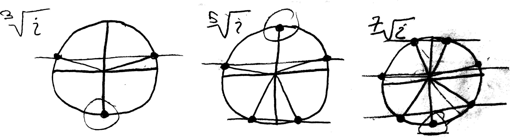

There are a couple things I like about Cole's Conjecture and Maya's Musing. One is that your classmates (albeit classmates from the class of 2022) came up with them just by being curious and making observations and asking questions! That's awesome. Second is that both of these ideas are, in the strict sense, *wrong*. But they're close to being correct. It's easy, if you're a pedantic intellectual, to just give a counterexample and shout, "WRONG!!!" It's harder---but more important---to think about *the ways in which your interlocutor is right*. To think, in other words, not about what's wrong about what they said (that's easy), but to think about *what's right* about what they said. That's a lot harder. Most of the things we say are a mixture of truths and falsehoods. We should correct the falsehoods, but we should also look for the truths.

You may recall the BBC documentary we watched on Fermat's Last Theorem, and the way in which the Japanese mathematician Goro Shimura described his deceased colleague Yutaka Taniyama:

> Taniyama was not a very careful person as a mathematician. He made a lot of mistakes. But he made mistakes in a good direction. So eventually he got to the right answers. I tried to imitate him, but I found out that it is very difficult to make good mistakes.

These problems are both good mistakes. They're the kind of mistake we should all be striving to make!

## Cole's Conjecture

> Cole Bregman was very excited to find that the (fraternal!) third cube root of $i$ is just $-i$. He hypothesized that because of the cyclic nature of the powers of $i$, any multiple-of-three'th root of $i$ will *also* have $-i$ as one of the possibilities. Was he correct? Prove or disprove. Clearly there are *some* multiple-of-three'th roots of $i$ that have $-i$ as a possibility (the cube root). Do all of them? Is there a similar true conjecture involving which roots of $i$ will have $-i$ as a solution?

**This is a good observation, but it's not precisely correct**. It's true that one of the cube roots of $i$ is $-1$:
$$\sqrt[3]{i} = -i \quad\quad\text{(among others)}$$
But it's not true that one of the $6$th roots of $i$ is $-i$:
$$\sqrt[6]{i} \neq -i $$
$$\text{because:}$$
$$(-i)^6 = (-1)^6i^6 = i^6 = -1 \neq i$$
But is there some relationship? Which roots of $i$ have $-i$ as one of their possibilities?

$$\sqrt[???]{i} = -i$$

$$(i)^{1/???} = -i$$

This is the same as asking:
$$(-i)^n = i$$
There are a couple of ways we could work this out. One is to just brute force it, and start writing out all the powers of $-i$:
$$(-i)^n = \underset{n=0}{+1},\, \underset{n=1}{-i},\, -1,\, +i,\, +1,\, -i,\, -1, +i,\,  +1,\, -i,\, -1,\, +i, \,\cdots$$
If you think about this geometrically, we're adding $270^\circ$ at each iteration---not $90^\circ$, like when we multiply by $+i$. So, when do $+i$'s show up? They show up when:
$$(-i)^n =+1,\, -i,\, -1,\, \underset{n=3}{+i},\, +1,\, -i,\, -1, \underset{n=7}{+i},\,  +1,\, -i,\, -1,\, \underset{n=11}{+i}, \,\cdots$$
$$(-i)^n = i \text{ when } n=3, 7, 11, 15, \cdots$$
So it repeats every $4$ iterations, and in particular, it repeats when the remainder divided by $4$ is $3$. So, in conclusion, any $4k+3$'th root of $i$, where $k$ is some integer (or, equivalently, any $4k-1$'th root of $i$) will have $-i$ as one of the solutions.

So, that's one way to solve it. Here's another way. If you want to think about it a bit more algebraically, you could set up an equation. We want to solve this equation for $n$:
$$i^n = -i$$
In polar form, this is:
$$\left(1\angle90^\circ\right)^n = 1\angle 270^\circ$$
Which is:
$$1^n\angle90n = 1\angle 270^\circ$$
Or just:
$$1\angle90n = 1\angle 270^\circ$$
The radii don't really matter here, because no matter what we raise $i$ to, we'll stay on the unit circle. ($1^n$ is always just $1$.) So we only have to worry about the angles. So, we have:
$$90n = 270$$
But actually, we can have extra multiples of $360^\circ$, so really this should be:
$$90n = 270 + 360k \quad\text{for any }k\in\mathbb{Z}$$
So:
$$n = \frac{270 + 360k}{90}$$
Or just:
$$n = 3+4k$$
So, in conclusion, we have:
$$\sqrt[3+4k]{i} =(i)^{1/(3+4k)} =  -i \quad\text{(among others)}\quad(k \in \mathbb{Z})$$
Note how this is in fact describing *multiples of four*. The linguistic way of rephrasing this would be that every (multiple-of-four)-plus-three'th root of $i$ has $-i$ as a solution.

   

**Many of you found and described a related---but less all-encompassing---pattern**. Many of you approached this problem by listing all of the multiple-of-three'th powers of $-i$ to see which of them were $i$, and thus when this conjecture was true. You came up with something like:
\begin{align*}
\sqrt[3]{z} &= -i  \\
\sqrt[6]{z} &\neq -i  \\
\sqrt[9]{z} &\neq -i  \\
\sqrt[12]{z} &\neq -i  \\
\sqrt[15]{z} &= -i \\
\sqrt[18]{z} &\neq -i  \\
\sqrt[21]{z} &\neq -i \\
\sqrt[24]{z} &\neq -i  \\
\sqrt[27]{z} &= -i  \\
\sqrt[30]{z} &\neq -i  \\
&\vdots
\end{align*}
So, if you stare at this list for a minute or two, what you can conclude (as many of you did) is that it's not every multiple-of-three'th root that is $-i$. Rather, it's *every other odd* multiple-of-three'th root has $-i$ as one of the solutions:
\begin{align*}
\sqrt[3]{z} &= -i  \quad\text{(works!)} \\
\sqrt[6]{z} &\neq -i \quad\text{(not odd)} \\
\sqrt[9]{z} &\neq -i \quad\text{(skip)} \\
\sqrt[12]{z} &\neq -i \quad\text{(not odd)} \\
\sqrt[15]{z} &= -i \quad\text{(works!)} \\
\sqrt[18]{z} &\neq -i \quad\text{(not odd)} \\
\sqrt[21]{z} &\neq -i \quad\text{(skip)} \\
\sqrt[24]{z} &\neq -i \quad\text{(not odd)} \\
\sqrt[27]{z} &= -i \quad\text{(works!)} \\
\sqrt[30]{z} &\neq -i \quad\text{(not odd)} \\
&\vdots
\end{align*}
So your refined version of Cole's conjecture then becomes:
$$\sqrt[\text{every other odd multiple of three}]{i} = (i)^{1/(\text{every other odd multiple of three})} = -i \quad\text{(among others)}$$
If you want to phrase this a little more compactly, you can let $k$ be any integer, and then you can describe every other odd multiple of three as $12k+3$, so we get:
$$\sqrt[12k+3]{i} \quad=\quad  (i)^{1/(12k+3)} \quad=\quad -i \quad\text{(among others)}\quad(k \in \mathbb{Z})$$
This is true, and very interesting! But, here's my criticism: it leaves out plenty of other roots of $i$ that have $-i$ as a solution! For example, it doesn't describe the fact that $\sqrt[7]{i} = -i$. Your conjecture is true... *but it's not true enough*. In another sense, Cole's conjecture is TOO aggressive in its truth-seeking: it says that things are true that are actually false! This conjecture doesn't do that---everything it says is true is true---but there are true things that it leaves out. (I'm imagining dueling Venn diagrams or something, in which Cole's conjecture is too large, and this conjecture is too small.) 

On the other hand, this conjecture deals with multiples of threes, like Cole's original conjecture, whereas my version deals with multiples of *four*. So perhaps this version is closer to the spirit of what Cole was trying to describe? Or perhaps my pattern was? Unclear!

## Maya's Musing

> Maya Bodnick found two of the roots, $\pm\frac{\sqrt{3}}{2}+\frac{1}{2}i$ in the straightforward ordinary way. She found the third root, $-i$, though, in a more novel method: by assuming that all three of the roots have to multiply together to create $i$:
>
> $$(\text{the first root})\cdot(\text{the second root})\cdot(\text{the unknown third root}) = i$$
>
> And then assuming that the unknown root is another complex number in the form $a+bi$, giving this equation:
>
> $$\left(\frac{\sqrt{3}}{2}+\frac{1}{2}i\right)\cdot\left(-\frac{\sqrt{3}}{2}+\frac{1}{2}i\right)\cdot(a+bi) = i$$
>
> And then solving for $a$ and $b$. And indeed, she calculated that the third root should be $-i$! 
>
> Muse on this method. It worked in this case---will it always work? Clearly, if we take an $n$'th root of $z$, and multiply it by itself $n$ times, we get $z$. That's what a root is. But is the product of *all the distinct* $n$'th roots of $z$ together always equal to $z$? Prove or disprove. Can you find a counterexample? If it's not always equal to $z$, is it sometimes equal to $z$? When? 

**This is a good observation, but it's not precisely correct**. It's *not* true that the product of all the $n$ distinct $n$'th roots of some complex number is always the original complex number. For example, $+2$ and $-2$ are the two distinct square roots of $+4$, but:
$$(+2)(-2) = -4 \neq +4$$
However, it's kind of cool that this appears to work at least for the cube roots of $i$. So, was that just a totally random coincidence, or is there some deeper truth here? Is it sometimes the case that the product of all the $n$ distinct $n$'th roots of some complex number is the original complex number? If so, when? What's the pattern?

If you play around with different examples, it's not too hard to make a guess at what's going on: **Maya's Musing seems to be true for odd roots** (like the cube roots of $i$) **and false for even roots** (like the square roots of $4$). For even roots, moreover, it's *almost* true: the product of all the even roots of a number is *negative* the original number. 

Writing a formal proof takes a bit of work, so I wasn't really expecting any of you to do that here. I was hoping you'd be able to figure out the pattern, if not prove it. There's probably a nice proof/argument you could make involving symmetries or geometry---that's probably the cleanest, fastest, and most elegant proof. But I'm not totally sure how I'd phrase or argue it.

**Here's my attempt at a proof**. We only need to worry about the angles here---we know (in part from the George Jemmott-inspired question) that if we multiply together distinct roots, the radii all multiply together properly. Basically what we want to prove or calculate or figure out is:

* if we take all the $n$ distinct $n$th roots of some complex number and multiply them together
* i.e., if we add up all their angles
* do we get back to where we started?

This doesn't work for the two distinct roots of $4$ (angle $0^\circ$), because the angle of $+2$ is $0^\circ$, and the angle of $-2$ is $180^\circ$. So we add them, and get $180^\circ$, which is not the angle of $4$.

So, what if we think about this for all the $n$ distinct $n$th roots of $r\angle\theta$? The angles of those roots are:
$$\frac{\theta}{n},\,\, \frac{\theta + 2\pi}{n},\,\, \frac{\theta + 2\cdot 2\pi}{n},\,\, \frac{\theta + 3\cdot 2\pi}{n},\,\, \cdots,\,\, \frac{\theta + (n-1)\cdot 2\pi}{n}$$
If we add them all up, we get:
$$\frac{\theta + (\theta + 2\pi) + (\theta+ 4\pi) + (\theta+6\pi) + \dots + (\theta +(n-1)\cdot2\pi)}{n}$$
Or:
$$\frac{n\theta \,+\, 2\pi\cdot(1 + 2 + 3 + \cdots + (n-1)) }{n}$$
Can we simplify all those integers added up? Fun fact: the sum of the first $n$ $\cancel{\text{integers}}$ natural numbers is $\frac{n(n+1)}{2}$, so then the sum of the first $n-1$ integers is $\frac{n(n+1)}{2} - n$, so we can plug that in:
$$\frac{n\theta \,+\, 2\pi\cdot \left(\frac{n(n+1}{2} -n\right)}{n}$$
We can cancel out some $n$'s:
$$\theta \,+\, 2\pi\cdot \left(\frac{n+1}{2} - 1\right)$$
So we have:
$$\text{the angle of the product of the $n$ distinct $n$th roots of $r\angle\theta$}: \quad = \quad \theta \,+\, 2\pi\cdot \left(\frac{n+1}{2} - 1\right)$$
Our question is, when is that equal to $\theta$ itself? What values of $n$ make Maya's Musing true?
$$\text{for what $n$ is: }\theta =  \theta \,+\, 2\pi\cdot \left(\frac{n+1}{2} - 1\right)$$
This is the same as asking:
$$\text{for what $n$ is: }0 =  2\pi\cdot \left(\frac{n+1}{2} - 1\right)$$
Well, $2\pi$ will be the same ("the same") as $0$ whenever it's multiplied by an integer! So our question becomes:
$$\text{when is }\frac{n+1}{2} - 1 \text{ an integer?}$$
But subtracting $1$ won't change whether it's an integer, so we have just:
$$\text{when is }\frac{n+1}{2} \text{ an integer?}$$
When is it? Whenever $n$ is odd! If $n$ is even, then this will be a fraction; if $n$ is odd, we can divide $2$ and get an integer.

So the somewhat more refined and accurate version of Maya's Musing is:

**The product of all the $n$ distinct $n$th roots of $r\angle\theta$ is:**

if $n$ is odd: $\quad r\angle\theta$

if $n$ is even:  $\quad r\angle\left( \theta + 180^\circ\right)$

### Update!

Syliva Larsen, in Spring 2024, had some brilliant geometric intuition for this problem. Here's how she wrote it up:

> 
>
> I misread the problem and focused on when $z$ is $i$. This is what I found out about $i$. Using this method does not work on even roots. You end up with $-i$ when you multiply odd roots together you get the correct answer: $i$. When you try to solve for that $n$th root, it also does work. This is because odd roots have a pair reflected across the $y$-axis. See examples of the $3$rd, $5$th, and $7$th roots of $i$ above. When you multiply these two roots, the product is $-1$. Therefore, depending on how many of those pairs there are, odd roots of $i$ will end up with the equation $-1\cdot x = i$ or $1\cdot x = i$, where $x$ is the last root, the $i$ or $-i$. When you solve this equation you get the correct last root. If you try solving for another one of those roots, you will get the answer: $\sin\theta + i\cos\theta$. When I tried to put this in Euler's form to see if it would simplify down to the last root, I was unsuccessful. So it seems that you can only use this method if solving for odd roots, possibly only the $i$ or $-i$. 
