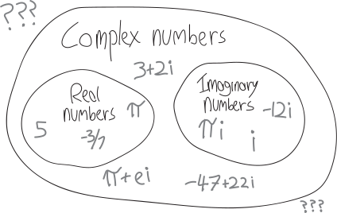
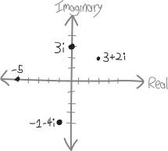

**You cannot take the square root of a negative number.** Imagine you want to find the square root of $-25$:

$$\sqrt{-25} = \,\, ???$$

It can't be $-5$, because a negative times a negative is a positive; negative five times negative five is positive $25$:

$$(-5)\cdot(-5) = +25$$

It can't be $+5$, because then where would the negative come from?
$$(+5)\cdot(+5) = +25$$

So you cannot take the square root of a negative number. 

  

But...

  

*What if you could???*

  

**We're about to start talking about complex numbers.** The complex numbers are what arise when we say, yes, we *can* take the square root of a negative number. It's just that when we do so, we get a new sort of number, which we denote with $i$:

$$ \sqrt{-1} = i $$

Any other negative square root we can write in terms of this imaginary made-up new number. For example:

\begin{align*}
\sqrt{-25} &= \sqrt{25\cdot(-1)} \\
&= \sqrt{25}\cdot\sqrt{-1} \\
&= 5\sqrt{-1} \\
&= 5i
\end{align*}

Or:

\begin{align*}
\sqrt{-2} &= \sqrt{2\cdot(-1)} \\
&= \sqrt{2}\cdot\sqrt{-1} \\
&\approx (1.4142\dots )\sqrt{-1} \\
&\approx (1.4142\dots )i
\end{align*}

The theory of complex numbers rivals calculus as the most intellectually profound thing we can do in high school.^[At least, at a *normal* high school, since obviously Nueva's math curriculum goes pretty far beyond that!] It's all so exciting.

You've probably dealt with complex numbers before in Math 2 and previous classes. We'll start at the beginning anyway. You haven't all seen exactly the same stuff (or remember all the same stuff), and having strong foundations is the most important part of building huge skyscrapers. If you're bored, don't worry---you'll see new stuff soon enough!

Actually, we won't start totally at the beginning. I don't think we'll spend too much time justifying the existence of complex numbers, or motivating them. That's too bad, because the motivation and justification behind complex numbers is really cool! But it's also way harder to talk about. (In some sense, the most fundamental things are often the hardest.^[relatedly: [https://www.smbc-comics.com/comic/2011-04-04](https://www.smbc-comics.com/comic/2011-04-04)] ^["The end of all our exploring/will be to arrive where we started/and know the place for the first time."]) And I think most of you have done at least *some* of that in previous years. (Maybe I'll give you some readings (by other people) or we'll watch a video to that effect.) 

Instead, we'll start *in media res*. Is $\sqrt{-1}$ actually a valid mathematical object? Does $\sqrt{-1}$ actually exist?!? For now, let's just suspend our disbelief. Suspension of disbelief is an important skill in math as well as in literature. Refusing to read or disliking *The Lord of the Rings* because hobbits don’t exist misses the point. If the internal logic of a world creates contradictions, then by all means call them out. Otherwise: live by the internal logic, suspend your disbelief, and see what you can discover. That's what we'll do. We'll act like $\sqrt{-1}$ is the most ordinary mathematical object in the world, and play with it just like we would any other mathematical object. If the universe ends up exploding---well, then I guess we'll learn that maybe we shouldn't have suspended our disbelief. If the universe doesn't appear to explode---then we've got a brand-new mathematical friend!

So we'll just act all casual about the existence and reality of complex numbers. Nevertheless, every time you interact with a complex number in this class, there should still be a voice somewhere in the back of your head screaming, "IS THIS ALL MADE UP??!! IS THIS ACTUALLY REAL?!?!" In fact, that voice in your head should be screaming that not just every time you use complex numbers, but also every time you use transcendental numbers (like $\pi$ or $e$), irrational numbers, negative numbers, zero. How do you know that ANY of those numbers exist or make any sense as concepts?!? People way, way smarter than you and I spent *hundreds of years* arguing about those questions.

We must suspend our disbelief---but not fully.

## But Anyway 

Back to suspending our disbelief in the existence and objectivity of $i$. Now that we have these new numbers, the complex numbers, we need to (re-)learn how to do math with them. Namely:

* How do we do **arithmetic** with complex numbers? We're pretty good at arithmetic with real numbers. What about with complex numbers?
    *  How do we **add** and **subtract** complex numbers?
    *  How do we **multiply** and **divide** complex numbers?
    *  How do we takes **powers** and **roots** of complex numbers?
    *  How do we **exponentiate** and **logarithm...ate** complex numbers?

And we know a lot more math than just arithmetic! We'd also like to learn:

* How do we do **algebra** with complex numbers? How do **functions** of complex numbers work? What do they look like?
* How do we do **geometry** with complex numbers?
* How do we do **calculus** with complex numbers? (Well, I guess we should probably learn how to do calculus with real numbers first!)

When we generalize and zoom out, things can get weird. We've already seen this: we played around with polynomials, which were very nice. Then we generalized to rational functions. Every polynomial is also a rational function, but there are plenty of rational functions that aren't polynomials. (Rational functions are what we get if we allow the exponents to be negative!) And it turns out that if we zoom out to thinking about all rational functions, things can get pretty weird. We get asymptotes! (Both the horizontal and vertical kind!) 

Similarly, **do strange new things happen when we zoom out from the real numbers to the complex numbers?** <!-- Which new uncontacted tribes do we, as mathematical anthropologists, discover and try to understand? --> T.S. Eliot writes:

> Home is where one starts from. As we grow older  
> The world becomes stranger, the pattern more complicated ... ^[*East Coker*, 190-191]

Of course, he wasn't writing about math *per se*, but he might as well have been, since the poem continues, a few lines later:

> We must be still and still moving  
> Into another intensity  
> For a further union, a deeper communion ... ^[*East Coker*, 204-206]

Let us move into the intensity of the complex numbers, and in so doing have a deeper communion with mathematical reality. 

## The First Really Cool Thing About $i$

Well, maybe this is the *second* really cool thing about $i$. The first cool thing is that it exists at all! (Does it?) But this second really cool thing about $i$ is that if we multiply it by itself, a really cool pattern emerges.

We define $i$ as the square root of negative one. *But what happens when we square it*? By definition, squaring a square root destroys it. Squares and square roots cancel each other out. They're inverses. So if we multiply $\sqrt{-1}$ by $\sqrt{-1}$, we just get $-1$. Put more mathematically:

$$
\begin{align*}
i^2 &= i\cdot i \\
&= \sqrt{-1}\cdot \sqrt{-1} \\
&= -1\end{align*}
$$

If this is confusing, think of what happens when we square other square roots:

$$ \sqrt{5}\cdot\sqrt{5} = 5 $$

$$ \sqrt{374}\cdot\sqrt{374} = 374 $$

$$ \sqrt{2x}\cdot\sqrt{2x} = 2x $$

$$\sqrt{\text{your favorite number}}\,\cdot\,\sqrt{\text{your favorite number}} = \text{your favorite number} $$

So that's what happens when we multiply $i$ by itself. But what if we keep going, and keep multiplying the result, and keep raising $i$ to a successively higher power? 

To start with, does $i^3$ work out to be anything nice? Well, $i^3$ is just $i^2$ times another $i$, so this becomes:

$$ 
\begin{align*}
i^3 &= \left(i^2\right)\cdot i \\
&= (-1)\cdot i \\
&= -i
\end{align*}
 $$

What about $i^4$? Similar to before, $i^4$ is just $i^3$ times another $i$, so we have:

$$ 
\begin{align*}
i^4 &= i^3 \cdot i\\
\text{but we just learned that }i^3=-i\text{, so this is:}\\
&= (-i)\cdot i \\
&= -i^2 \\
\text{but we also learned that }i^2=-1\text{, so this is:}\\
&= -(-1)\\
&= +1
\end{align*}
 $$

Let's keep going! How about $i^5$? We have:

\begin{align*}
i^5 &= i^4\cdot i \\
&= 1\cdot i \\
&= i
\end{align*}

More! More! 

\begin{align*}
i^6 &= i^5 \cdot i \\
&= i\cdot i \\
&= i^2 \\
&= -1
\end{align*}

We could keep going---*but it's repeating*! We took $i$, multiplied it by itself, and we get this pattern that repeats every four multiplications. We start with $i$, then get $-1$, then $-i$, then $1$, then back to $i$, then back to $-1$, and so on and so forth, *ad infinitum*! 

$$ 
\begin{align*}
i^{0} &= +1 \\
i^{1} &= +i \\
i^{2} &= -1 \\
i^{3} &= -i \\
i^{4} &= +1 \\
i^{5} &= +i \\
i^{6} &= -1 \\
i^{7} &= -i \\
i^{8} &= +1 \\
i^{9} &= +i \\
&\vdots
\end{align*}
$$

It's weird, because it's like multiplying something by $-1$, *but even more so*. If we multiply things by $-1$ over and over again, we get a pattern that repeats every two iterations:

$$(-1)^n = +1, -1, +1, -1, +1, \cdots $$

But if we multiply $i$ by itself, over and over again, we get a pattern that repeats *every four iterations*! Wacky. Why *four*??? 

I guess if we squint, we can see the powers of $i$ repeating their parity (positive/negativeness) every two iterations:

$$ (i)^n = \underbrace{1, i}_{+},\, \underbrace{-1, -i}_{-},\, \underbrace{1, i}_{+},\, \underbrace{-1, -i}_{-},\,  \cdots$$

Likewise, they repeat their one-or-$i$-ness every two iterations:

$$ |i^n| = 1,i, 1, i, 1,i, \cdots$$

I guess we can summarize the pattern of powers of $i$ more concisely:

$$ 
\begin{align*}
i^{(\text{a multiple of }4)} &= +1 \\
i^{(\text{a multiple of }4) \,+\,1} &= +i \\
i^{(\text{a multiple of }4)\,+\,2} &= -1 \\
i^{(\text{a multiple of }4)\,+\,3} &= -i
\end{align*}
$$

This is cool! It's kind of annoying to memorize though---we have to keep track of whether it's $1$ or $i$, and whether it's $+$ or $-$. That's annoying! I wish there were a better way. Is there some underlying logic to the reason these four elements are in the order they're in? In other words, why is the pattern this:

$$ \cdots, +i, -1, -i, +1, \cdots$$

And not this:

$$ \cdots, +i,-i,+1,-1, \cdots\quad???$$

or this:

$$ \cdots, +i,+1,-i,-1, \cdots\quad???$$

One answer is "because that's what we got when we worked out the algebra," but that doesn't seem very *satisfying*. Is there a better reason? A deeper reason?

This is all *super cool* and I hope it's inspiring us to want to discover even more about $i$! Clearly, $i$ is a weird number, that behaves in ways that are unexpected and counterintuitive. Why? What other weird behaviors do complex numbers have?

## Small-Print Legalese

OK, that header is a bit too dismissive. But like with any new mathematical topic, there's some new vocabulary and notation that we should quickly get up to speed on. The vocabulary and the notation isn't the *point*, but it is *antecedent* to the point. When you're learning how to fly a plane, you need to learn how to adjust the fuel/oxygen mixture in the engine, and it's not like anyone is particularly excited about that, or thinks that achieving the perfect mixture of fuel:oxygen for efficient combustion is why they love flying planes, but if you get it wrong, the engine stalls and you die. 

Here's the first thing to know: *there's nothing imaginary about the imaginary numbers!* Here's the second thing to know: *there's nothing complex about the complex numbers!* Imaginary numbers aren't any more "imaginary" than any other numbers (and the "real" numbers are no more or less real than them); complex numbers aren't any more complicated than non-complex numbers (which are already very complicated and intricate and beautiful![^3]

[^3]: The real numbers AREN'T ACTUALLY REAL! None of this is! None of this has material form!

Gauss supposedly proposed calling imaginary numbers **lateral numbers**, deliberately to get rid of the idea that they were "imaginary" (or at least more imaginary than real numbers, which he wanted to call **direct numbers**). I really like that, because it removes the value judgments slash other connotations associated with our vernacular definitions of "real," "complex," and "imaginary."

An **imaginary number** is a multiple of $i$, that is, a multiple of $\sqrt{-1}$. Here are some imaginary numbers:

$$\text{examples of imaginary numbers: } i,\, 5i,\, -2i,\, \pi i,\, \frac{i}{12}$$

A **complex number** is a twofer: a hybrid chimera with one real-numbered parent and one imaginary-numbered parent. It consists of two real numbers added together, with the second one multiplied by $i$. So any complex number $z$ we can write as:

$$z = a + bi$$

where $a$ and $b$ are both real numbers. $a$ is the **real component** (or the **real part**) and $b$ is the **imaginary component** (or the **imaginary part**). Note that $b$ is itself a real number---it's the *coefficient* on the $i$ term, but it doesn't include the $i$ itself. Here's another way to put that:

$$\text{a complex number} = (\underbrace{\text{a real number}}_{\text{real component}}) + (\underbrace{\text{another real number}}_{\text{imaginary component}})\cdot \underbrace{i}_{i}$$

As a practical matter, we tend to use the variables $z$ and $w$ to denote complex numbers (and $x$ and $y$ to denote real numbers)^[Sometimes I think we should take more inspiration from functional programming and strongly-typed programming languages, and be more explicit about the types of our variables, and in lots of more formal math textbooks people do just that, but oh well.].

Here's an observation: *every real number is also a complex number*. It's just that real numbers have imaginary part of $0$. For example, we can think of the real number $5$ as being also a complex number: it's $5+0i$. It has real part $5$, and imaginary part $0$. This is like how every integer is *also* a rational number: $7$ is a rational number, because we can write it as the ratio of two integers, $7/1$. 

Likewise, every imaginary number is also a complex number: we can think of the imaginary number $7i$ as being $0+7i$, so it has real part $0$ and imaginary part $7$.

Here are some more examples of numbers and where they fit in our typology/cladogram of numbers:

* $5$ is a real number. It's also a complex number. It's not an imaginary number.
* $i$ is a complex number. It's also an imaginary number. It's not a real number.
* $2+7i$ is a complex number. It's neither real nor imaginary.
* $12i$ is a complex number. It's also an imaginary number. It's definitely not a real number.

And here's a Venn diagram---well, more like an ordinary set-containment diagram---of how the complex numbers relate to the real and imaginary numbers:

{ width=90% }

(What's outside of complex numbers? Can we zoom out and discover an even-weirder, even-more-encompassing number system?!?)

Often if we just want to talk about the real part or the imaginary part of a number, we'll describe it with function notation:

\begin{align*}
Re(z) &= \text{the real part of } z \\
Im(z) &= \text{the imaginary part of } z
\end{align*}

So, for example:

\begin{align*}
Re(2+7i) &= 2 \\
Im(2+7i) &= 7
\end{align*}

Note that $Im(2+7i)$ is *not* $7i$! It's just $7$. The imaginary part is only the *coefficient* on the $i$ part.

Somewhat more generally, we can write:

\begin{align*}
Re(a+bi) &= a \\
Im(a+bi) &= b
\end{align*}

Question: can we come up with a formula that takes in a complex number and churns out the real and/or imaginary parts? Like, something more algebraic? Something somewhat more mathematically sophisticated than just pointing to the real or imaginary component and saying "it's that thing!"

## Adding

We can add two complex numbers together to get a *third* complex numbers! All we do is add the real part, and add the imaginary part! The two parts stay totally seperate from each other! So, for example:

$$
\begin{align*}
(5+2i)\,+\,(3+7i) &= (5+3) \,+\,(2+7)i \\
&= 8 + 9i
\end{align*}
$$

## Subtracting

We can subtract complex numbers, too.

## Multiplying

We can multiply complex numbers! But it's *not* quite as simple as addition and subtraction. We *don't* independently multiply the real and complex parts:

$$(5+2i)\cdot(3+7i) \,\neq\, (5\cdot3) + (2\cdot7)i$$

Adding complex numbers is easy, because a complex number is just two real numbers added, and so things play together nicely. But when we try to multiply a complex number, then all of a sudden we're combining *multiplication* with *addition*! So we need to think about how those two operations interact. They interact via our old friend, the distributive property: 

$$a(b+c) = ab + ac$$  

So to multiply two complex numbers, we do the same thing as we would to multiply any other binomial. We can use the distributive law or FOIL it or what-have-you. So, for example: 

$$
\begin{align*}(3+2i)(5+7i) &= 3\cdot 5 \,+\, 3\cdot7i\,+\,3\cdot2i + 2i\cdot7i \quad \text{(by FOIL or whathaveyou)} \\
&= 15 + 30i + 14i^2 \quad \text{(combining terms)} \\
\text{But wait! $i^2=-1$, so this becomes:}\\
&= 15 + 30i + 14\cdot(-1) \\
&= 1 + 30i
\end{align*}
$$

If we wanted to make a formula into which we could plug any two complex numbers, we could just take two arbitrary complex numbers, multiply them together, and see what happens. By "arbitrary" I mean that we could take two complex numbers *that in fact stand in for all complex numbers*. In other words, we could have $a+bi$ as one complex number, where $a$ and $b$ could be any real number, and we could have $c+di$, where $c$ and $d$ could be any real number. What happens when we multiply them togther?

$$
\begin{align*}(a+bi)(c+di) &= a\cdot c \,+\, a\cdot di\,+\,c\cdot bi + bdi^2 \\
&= ac + (ad + cb)i + bdi^2  \\
&= ac + (ad + cb)i + bd\cdot(-1) \\
&= \underbrace{(ac-bd)}_{\text{real part}} \,+\,  \underbrace{(ad + cb)}_{\text{imaginary part}}\cdot i
\end{align*}
$$

I guess you could memorize this formula if you want to, but there's no point---since you're already comfortable and familiar with multiplying out binomials, you should probably just do the same thing you do there (FOIL it or distribute it or whatever). Of course, if you were going to write a computer program that dealt with complex numbers, you'd probably want to write in a formula like this. 

## Dividing

Division is trickiest. Suppose we want to divide two complex numbers, $2+3i$ and $5+7i$:

$$\frac{2+3i}{5+7i}$$

Our first question here ought be: is it going to be another complex number, or some more weird and esoteric type of number?? More generally, when we divide two complex numbers, do we always a complex number? If we divide integers, we don't always get another integer---e.g., $5/7$ is a rational number, not an integer. Of all our four basic arithmetic operations, division is the scariest, and the hardest. We do long division, but we don't do "long addition." Division is sometimes wormholes us out to extra dimensions of numbers. We take two nice, clean, well-behaved integers like $5$ and $7$, divide them, and we get a horrible non-integer:

$$\text{two nice integers} \rightarrow\quad \frac{5}{7} \,=\, \underbrace{0.714285714285714285714285714285714285714285714285714285714\dots\dots}_{\text{terrifying thing that's definitely not an integer}}$$

So, if we divide two complex numbers, what happens?

We'll answer that broader question in a minute. But first, back to dividing these two specific complex numbers. *If* their quotient does indeed turn out to be another complex number, *then* we should be able to write it in $a+bi$ form. We should be able to figure out what both the real and imaginary parts are. In other words, we should end up with:  

$$\frac{2+3i}{5+7i} = (\underbrace{\text{something}}_{\text{the real part}}) + (\underbrace{\text{something else}}_{\text{the imaginary part}})\cdot i$$

But how do we actually figure out what those parts are? Fractions are hard. Division is messy (even with real numbers and variables.) 

Somehow, we need to bribe, bully, convince, or cajole our quotient to get into that form. The problem is that we've got two separate things on the bottom, $5$ and $7i$. So we can't just cleanly split the fraction up along those two things. Many of you were trying to do that last semester, and it made me quite sad:

$$\frac{a}{b+c} \neq \frac{a}{b} + \frac{a}{c}$$

However, *if* we could somehow turn the two things on the bottom into *one* thing, we'd be set, because then we *can* split the tops up:

$$\frac{(\text{something})+(\text{something else})\cdot i}{\text{one thing}} \,=\, \frac{\text{something}}{\text{one thing}} + \frac{\text{something else}}{\text{one thing}}\cdot i$$

So if we could do that, then we'd have a complex number, in standard $(\text{real part})+(\text{imaginary part})\cdot i$ form. So, how can we do that? Can we get the $i$ out of the denominator, so that we only have a real number on the bottom?

Here's the idea: let's multiply the denominator by itself, but not *quite* by itself. Let's change the sign between the real part and the imaginary part, from $+5i$ to $-5i$. If we do that, what happens?

$$
\begin{align*}
(5+7i)\cdot(5-7i) &= 5\cdot5 \,+\, 5\cdot7i \,-\, 5\cdot7i \,-\, (7i)^2 \\
&= 25 \,\,\, \cancel{+\, 5\cdot7i} \,\,\, \cancel{-\,5\cdot7i} \,-\, 7^2i^2 \\
&= 25- 49\cdot(-1) \\
&= 74
\end{align*}
$$

The $i$ goes away!!!! The two $i$ terms cancel each other out! We get an $i^2$ term, sure, but $i^2$ is just $-1$, so that turns into an ordinary real number, too. No $i$s!!!

So if we multiply the bottom of this fraction by this thing, we'd get rid of the $i$:

$$\frac{2+3i}{5+7i}\cdot \frac{}{5-7i} = \frac{}{74}$$

There's a major catch: we can't go willy-nilly multiplying random parts of our expression by random other numbers. That's not licit. We can't do that. It'd turn into something totally different. So if we want to multiply the bottom of the expression by $5-7i$, then we need to multiply the top by $5-7i$, too, so that we're not actually changing anything. Instead, we're just multiplying it by $1$---a weird form of $1$, but $1$ nonetheless.

$$\frac{(2+3i)}{(5+7i)}\cdot\underbrace{\frac{(5-7i)}{(5-7i)}}_{=1}$$

So, there's a cool trick! What if we try multiplying this thing by $1$---but by a very special form of $1$:

$$\frac{(2+3i)}{(5+7i)}\cdot\underbrace{\frac{(5-7i)}{(5-7i)}}_{=1}$$

Anything over itself is equal to $1$, and we can multiply anything by $1$ without changing it. We're not violating any laws of algebra. We've found this special form of $1$ by taking the denominator, and flipping the sign on the imaginary part (i.e., going from $5+7i$ to $5-7i$), and then putting that over itself.

Anyway, let's do the full division, and see what happens:

$$
\begin{align*}
\frac{(2+3i)}{(5+7i)}\cdot\frac{(5-7i)}{(5-7i)} &= \frac{2\cdot5 \,-\, 2\cdot7i \,+\, 5\cdot3i \,-\, 3i\cdot7i}{5\cdot5 \,\underbrace{-\, 5\cdot7i \,+\, 5\cdot7i}_{=0} \,-\, 7i\cdot7i} \quad\quad \text{(just FOIL'ing)} \\ \\
&= \frac{10+i-21i^2}{5\cdot5 \,\underbrace{-\, 5\cdot7i \,+\, 5\cdot7i}_{=0} \,-\, 7i\cdot7i} \quad\quad\text{(combining terms on the top)} \\ \\
&= \frac{10+i-21i^2}{5\cdot5 \,-\, 7i\cdot7i} \quad\quad \text{(the $i$ terms cancel out on the bottom!)} \\ \\
&= \frac{10+i-21i^2}{25 \,-\, 49i^2} & \\ \\
&= \frac{10+i+21}{25 + 49} \quad\quad (i^2=-1)\\ \\
&= \frac{31+i}{74} \quad\quad \text{(combining terms)}\\ \\
&= \frac{31}{74} + \frac{i}{74} \quad\quad\text{(separating into real and imaginary components)}\\ \\
&= \frac{31}{74} + \frac{1}{74}i
\end{align*}
$$

If we multiply by that very special form of $1$, the $i$ terms cancel out on the bottom, and we get just a single real term on the bottom! Then we can split up the fraction, and we can write the quotient as a genuine complex number, with the real and imaginary parts clear and obvious and isolated:

$$\frac{(2+3i)}{(5+7i)}= \frac{31}{74} + \frac{1}{74}i$$

What was that special form of $1$ that we multiplied by? It's called the **conjugate** (or the **complex conjugate**). For any given complex number $a+bi$, its conjugate is $a-bi$. We often denote it by writing $\text{Conj}(z)$, or putting a little $\overline{\text{flat hat}}$ on top of the number, or superscripting an asterisk, like $z^*$. It's pronounced "[zee] conjugate" or "[zee] star."^[Unless you're my Canadian grandfather, in which case it's "[zed] conjugate" or "[zed] star."] More formally,

$$\text{ if } z=a+bi,\quad \text{ then $\quad$ Conj}(z)=\overline{z} = z^*= a-bi$$

We've seen conjugates before; we just haven't used that name for them. Suppose we're multiplying together two binomials which are identical except for their signs:

$$(a+b)(a-b)$$

The cool thing that happens is that the cross terms (i.e. the $ab$ terms) cancel out and disappear!

$$
\begin{align*}
(a+b)(a-b) &= a^2 + ab - ab -b^2 \\
&= a^2 - b^2
\end{align*}
$$

And we're left with just powers of $a$ and $b$. So if we do this with a complex number written as a binomial (i.e., $a+bi$), the $i$ terms disappear, and we're left with just real terms and $i^2$ terms, and since $i^2=-1$, we're left in fact with ONLY real terms:

$$
\begin{align*}
(a+bi)(a-bi) &= a^2 +abi - abi -b^2i^2 \\
&= a^2 -b^2(-1) \\
&= a^2+b^2
\end{align*}
$$

Hey! You know, this also shows us something ELSE that's kind of cool. We multiply these two complex numbers together, *and we get a real number*:

$$\underbrace{(a+bi)(a-bi)}_{\text{complex numbers}} = \underbrace{a^2+b^2}_{\text{a real number}}$$

That's exactly the point---we made up this "conjugate" thing specifically as a way of getting rid of $i$. But still, it's a little weird, because it's like we're putting together these two complicated objects, and the object we get as a result isn't an equally-complicated object (or a *more* complicated object); it's a *simpler* object.

That's... a little weird? I mean, I guess it's something we've seen before. We can multiply two rational numbers and get an integer:

$$\frac{6}{5}\cdot\frac{10}{6} = 2$$

But still, it's like, we're putting together these two complicated objects, and the object we get as a result isn't an equally-complicated object (or a *more* complicated object); it's a *simpler* object.

The contrasting example, I guess, is with division: we can divide two integers, and potentially get a number that's not an integer:

$$\frac{3}{5} = \text{not an integer}$$

So in that case, we take two simple objects, combine them, and get a more-complicated object.

Anyway, so we've found that if we divide $2+3i$ by $5+7i$, we get another complex number, $\frac{31}{74} + \frac{1}{74}i$. But that still leaves us with the broader question: if we divide two complex numbers, do we *always* get another complex number? Or do we sometimes get a scarier and more exotic form of number? When we divide two integers, *sometimes* we get a scary non-integer, but not *always*. Sometimes we divide two nice integers, and we get another nice integer:

$$\text{two integers} \rightarrow\quad \frac{10}{2} = 5 \quad \longleftarrow\text{another integer}$$

Division, then, is like a dog with aggression problems. Sometimes it acts cute---but other times it tears your face off. You're never totally sure which you're going to get. So even when it's being cute, you can never *fully* trust it. Likewise here. Can we ever fully trust division of complex numbers? (You'll work out the answer in one of the homework problems.)

Anyway, the main point to take away from this very long and rambling section is this: **if we want to divide two complex numbers, we can multiply by the conjugate of the denominator (over itself)** to then be able to figure out the resulting complex number (cleanly). 

**Dividing complex numbers, in summary:**

$$\underbrace{\frac{a+bi}{c+di}}_{\substack{\text{trying to }\\\text{divide these}}}\cdot\underbrace{\frac{c-di}{c-di}}_{\substack{\text{multiplying by the}\\\text{ conj. of the denom.}\\\text{over itself, i.e. $1$}}} \quad=\quad  (\underbrace{\text{something}}_{\text{the real part}}) \,+\, (\underbrace{\text{something else}}_{\text{the imaginary part}})\cdot i$$

(This still seems kind of messy! If only there were an easier way...)

## Graphing Complex Numbers

One way we can think about the real numbers visually is to graph them on a number line! It's not all that interesting---real numbers are one-dimensional, so they're just points on a line. (*Functions* of real numbers is where things start to get interesting, because then we've got two dimensions---one for the input, one for the output---and we can start having pretty shapes.)

Complex numbers, on the other hand, *are two dimensional*. In our construction of them, each complex number is the *unified fusion of two real numbers*. So if we want to think about complex numbers visually, we need *two* dimensions---one for each number. Usually we do this by plotting the real component along the horizontal axis (or the **real axis**), and the imaginary component along the vertical axis (or **imaginary axis**).

Here are a few examples of complex numbers plotted on the complex plane:

{ width=75% }

## Some Basic Algebra With Complex Numbers

Suppose we have an equation involving a complex number:

$$4i = z^2 + z$$

We'd like to be able to find what values of $z$ make this equation true. Maybe there's one value, maybe there are multiple values, maybe there are no values. We're pretty good at solving equations with real numbers! But what about with complex numbers? I guess we could factor the right-hand side:

$$4i = z(z+1)$$

But that's not very helpful, since the left side is $4i$, not $0$, so it's not as easy as just solving the factors individually. 

Here's a better idea. There's a useful trick for solving equations with complex numbers: every complex number is *made up of two real numbers*, so **if we have one equation relating one complex number, we can turn it into two equations relating two real numbers**. Let's continue this example so that I can show you what I mean.

We have this complex number $z$, and we know that any complex number can be written in the form $a+bi$, where $a$ and $b$ are both real numbers. So then we can turn this equation about a complex number into an equation about some real numbers, $a$ and $b$:

$$4i = (a+bi)^2 + (a+bi)$$

If we simplify that a bit, we get:

$$
\begin{align*}
4i &= a^2 + 2bi + b^2i^2 +a+bi \\
4i&= a^2 + 2bi - b^2 + a + bi &\text{(because $i^2=-1$)}\\
4i&= a^2 - b^2 + a + 3bi
\end{align*}
$$

Then we've got two complex numbers---one on the left side of the equation, and one on the right side:

$$
\begin{align*}
0+4i &= \left(a^2 - b^2 + a\right) + 3bi\\ \\
\underbrace{0}_{\text{real part}} + \underbrace{4}_{\text{imaginary part}}\cdot i \quad&=\quad (\underbrace{a^2 - b^2 + a}_{\text{real part}}) +\underbrace{3b}_{\text{imaginary part}}\cdot i
\end{align*}
$$

This looks like one equation with two unknowns---but actually it's *two* equations! Since these two complex numbers on the left and on the right are equal, **their real and imaginary parts must also be equal**. So then, we can set the imaginary parts equal to each other:

$$4 = 3b$$

$$b = 4/3$$

And we've found $b$! We're halfway there to finding the complex number we're looking for, $z=a+bi$. Now we just need to find $a$. So we can set the real parts equal:

$$0 = a^2 - b^2 + a$$

Since we've found out that $b=4/3$, we can plug that in:

$$0 = a^2 - \left(\frac{4}{3}\right)^2 - a$$

Looks like we have a quadratic! 

$$0 = a^2 + a - \left(\frac{4}{3}\right)^2$$

We can try to factor it, but it turns out to be a mess. Let's use the quadratic equation:

$$
\begin{align*}
a &= \frac{-1 \pm \sqrt{1^2- 4\cdot1\cdot \left(\frac{4}{3}\right)^2 }}{2} \\\\
&\quad\quad\vdots \\
&\text{a whole bunch of arithmetic...} \\
&\quad\quad\vdots \\\\
&= \frac{-1}{2} \pm\frac{\sqrt{13}}{4} \\
\end{align*}
$$

So we've found what $a$ can be! There are two possibilities! So we have:

$$a= \left\{\frac{-1}{2} +\frac{\sqrt{13}}{4} , \quad \frac{-1}{2} -\frac{\sqrt{13}}{4} \right\}\quad\text{and}\quad b=4/3$$

So then there are two possible solutions for $z$:

$$
\begin{align*}
z =& a+bi \\
= &\left(\frac{-1}{2} +\frac{\sqrt{13}}{4}\right)  \quad+\quad\frac43i ,\\
&\left(\frac{-1}{2} -\frac{\sqrt{13}}{4} \right) \quad+\quad\frac43i 
\end{align*}
$$

Boy, that's a lot of work! Maybe I should have made a simpler example. Oh well! If we want to verify that those are both solutions, we could plug them back into the original equation (but this seems like a lot of work).

## Wait, One More Fun Thing

$i$ is the square root of negative one---but what if we take *the square root of $i$*?!? Can we even do that?? We saw that cool things happen when we take powers of $i$; do cool things happen when we take roots of $i$? 

Like with dividing numbers, our first question should be: if we take the square root of $i$, do we even still get a complex number? Or will we get a type of number that's maybe more complex than a complex number? Or a type of number that's more simple? Or what???

I guess one way we could start to think about this is to realize that $i$ is itself a square root, and so maybe we should write that out:

$$\sqrt{i} = \sqrt{\sqrt{-1}\quad} = \left((-1)^{1/2}\right)^{1/2} = (-1)^{1/4} = \sqrt[4]{-1}$$

Hmm. That doesn't seem to tell us a whole lot. Let's try something else.

Let's assume, for a moment, that if we take the square root of $i$, we get another complex number as a result. If this complex number has real part $a$ and imaginary part $b$, then we should have:

$$\sqrt{i} = a + bi$$

Or, in other words:

$$i = (a+bi)^2$$

This is something we might be able to do something with! Let's expand the right side and see what happens. Maybe we'll be able to solve for $a$ and $b$, and thus find the square root of $i$:

$$
\begin{align*}
i &= (a+bi)^2 \\
 &= a^2 + 2abi + bi^2 \\
 &= a^2 - b^2 + 2abi &\text{because } i^2=-1
 \end{align*}
 $$

But now, we've proven that $i$ (on the left) must be equal to this more complicated thing (on the right). We have a complex number on the left, and a complex number on the right. They're equal. They're the same number. So then their real and imaginary components must also be equal. Showing that a bit more explicitly:

$$
\begin{align*}
0 \quad &+ \quad1\cdot i \\
&\,\,|| \\
(a^2 - b^2) \,&+\,\,(2ab)\cdot i
\end{align*}
$$

The real parts and imaginary parts must be equal---so we get two equations! And we have two unknowns, so we can solve them!

Our first equation, from the real component, is:

$$0 = a^2-b^2$$

So then $a^2=b^2$, or just that:

$$a = \pm b$$

We need the plus-or-minus, because of course the squaring will destroy it. 

Meanwhile, the other equation (the imaginary component) gives us:

$$2ab = 1$$

Let's plug the stuff from the first equation into this one. If we plug in $a=-b$, we get:

$$
\begin{align*}
2(-b)b &= 1 \\
-2b^2 = 1 \\
b = \pm \sqrt{-1/2}
\end{align*}
$$

BUT we know that $b$ (as well as $a$ has to be a real number! That's part of the setup here. Ultimately we're talking about complex numbers, but we've split our complex number into its components $a$ and $b$. Both of those numbers are real. There's no real number equal to $\sqrt{-1/2}$. So this begets no solution. In other words, $a$ can't be equal to $-b$. It can thus only be equal to the other alternative, $+b$.

What about if we plug in $a=+b$? Then we get:

$$
\begin{align*}
2(b)b &= 1 \\
2b^2 &= 1 \\
b &= \pm 1/\sqrt{2}
\end{align*}
$$

So we've found $b$! And we know, from the first equation, that $a$ and $b$ are equal, possibly modulo their sign, except we also found out that $a$ can't be negative $b$. So we have two possibilities:

$$a = b = \frac{1}{\sqrt{2}}$$

$$a = b = \frac{-1}{\sqrt{2}}$$

And then we've done it! We've found the square root of $i$!!! We have:

$$\sqrt{i} = \left\{ \frac{1}{\sqrt{2}}+\frac{1}{\sqrt{2}}i \,,\quad \frac{-1}{\sqrt{2}}+\frac{-1}{\sqrt{2}}i \right\}$$

That's so weird! Where does this come from? Is there a better explanation for why $\sqrt{i}$ is this weird number with fractions and $\sqrt{2}$? What if we want to find not just the square root of $i$, but the cube root? or the quartic root? or the quintic root? or the $n$'th root? Do we have to do all this nasty, nasty algebra (which, no doubt, will just get worse)? By the way, can we graph these two solutions? What happens? Where are they on the complex plane? Incidentally, doesn't $1/\sqrt{2}$ seem familiar?? Have we seen that anywhere else recently??

If you don't believe that that really is the square root of $i$---if you think our procedure, what with its assumptions, equating real and imaginary components, etc., was a bunch of malarkey---try squaring one (or both) of these. What happens?

\begin{align*}
\left(\frac{1}{\sqrt{2}}+\frac{1}{\sqrt{2}}i\right)^2 &= \hspace{3in}  \\ \\
\left(\frac{-1}{\sqrt{2}}+\frac{-1}{\sqrt{2}}i\right)^2 &= \hspace{3in}
\end{align*}

Incidentally, we've answered our question about whether the square root of $i$ is itself a complex number---it is! We can write it in the form $a+bi$, so it is indeed complex.

COMPLEX NUMBERS ARE SO WEIRD, eh???

## Problems

*Many/most of these problems, especially the hard ones are stolen from the Art of Problem Solving's *Intermediate Algebra *text (which in turn stole many of its problems from various math contests!).* 

 

For each of the following pairs of complex numbers $z$ and $w$:
<ol class='lettered-list'>
	<li> Plot $z$ and $w$ on the complex plane.
	<li> Perform the following arithmetic operations, and plot the result (clearly labelled) on the same complex plane (i.e., the same axes):
<ol>
<li> $z+w$
<li> $z-w$
<li> $z\cdot w$
<li> $z/w$
</ol>
<li> Also, find $\overline{z}$ and $\overline{w}$. Draw them on your (hopefully not too messy? maybe you could use colors?) graph, too\footnote{These problems, though, I (mostly) randomly generated with three lines of Python!}
</ol>

<ol class="problems">
<li> $z=0$; $w=0$
<li> $z=1$, $w=0$
<li> $z=5$; $w=3$
<li> $z=1$; $w=i$
<li> $z=3+4i$; $w=12-5i$
<li> $z=2i$; $w=7-2i$
<li> $z=2-5i$; $z=-3+i$
<li> $z=1$; $w=2+i$
<li> $z=3+2i$; $w=4$
<li> $z=5-3i$; $w=2-i$
<li> $z=1+2i$; $w=-1+4i$
<li> $z=2-i$; $w=7+9i$
<li> $z=11+4i$; $w=2+15i$
<li> $z=10-5i$; $w=3+10i$
<li> $z=9+13i$; $w=5+9i$
<li> $z=2+i$; $w=2+15i$
<li> $z=15-5i$; $w=-2-5i$
<li> $z=14+10i$; $w=15+7i$
<li> $z=7+12i$; $w=13+12i$
<li> $z=11+2i$; $w=-4+14i$
<li> $z=11+i$; $w=6+3i$
<li> $z=8+13i$; $w=9+2i$
<li> $z=8+10i$; $w=10+10i$
<li> $z=-5+5i$; $w=7+12i$
<li> $z=4+9i$; $w=3$
<li> $z=7+8i$; $w=14+14i$
<li> $z=12+-3i$; $w=12+8i$
<li> $z=-2+i$; $w=-1+8i$
<li> $z=-4$; $w=12-3i$
<li> $z=8+8i$; $w=3+4i$
<li> $z=2+6i$; $w=15+10i$
<li> $z=1+15i$; $w=8+6i$
</ol>

  

Let's do some algebra with complex numbers! Solve each of the following equations for $z$. (Since we know that we can represent any complex number as its real part plus its imaginary part times $i$, it might be a good idea to rewrite $z$ like that! Or it might not.)

<ol class="problems">
<li> $z+5 = 8+2i$
<li> $z-i = 12$
<li> $z+9+8i = 6$
<li> $5z = 3i$
<li> $7z = 2+4i$
<li> $z^2 + 5z + 1 = 0$
<li> $z^2 + 9z + 15 = 0$
<li> $(6+3i)^2=4i-30z$
<li> $\frac{2z-3i}{z+4} = -5+i$
<li> $z^2+81 = 0$
<li> $\frac{z+3i}{z-3} = 2$
<li> $\frac{1+2i}{3z} = 4+5i$
<li> $3z+\frac{z}{1+i} = 10-4i$
<li> $z + 2\overline{z} = 6-4i$
<li> $z^2 = 21 - 20i$
<li> $\frac{z-2}{z+1} =3i$
<li> $z^2 + 5z = -6$
</ol>

  

More algebra! Solve for $x$ and $y$, where $x$ and $y$ are both real numbers! (It might help to remember that two complex numbers are equal if and only if their real and imaginary components are equal---so from an equation relating two complex numbers, we can actually get *two* equations relating *two each* real numbers.)

<ol class="problems">
<li> $(x+yi)(2-i)=-i$
<li> $(x+2i)(1-i) = 5+yi$
<li> $(x-2)(3yi+5i) = 4+x-i$
<li> $3x + (3x - y)i = 4 - 6i$ 
<li> $2y+xi= 4+x-i$
<li> $2x+3yi = -x-6i$
<li> $(x+yi)(2-i)=8+i$
<li> $x^2+xi=4-2i$
<li> $(3+2i)(x+yi)=-i$
<li> $2(x+yi)=x-yi$
<li> $(x+i)(3-iy)=1+13i$
<li> $(x+2i)(y-i)=-4-7i$
<li> $(x+yi)(2+i) = 2x- (y+1)i$
</ol>

  

<ol class="problems">
<li>  Simplify: $\displaystyle \frac{a+bi}{b-ai}$ (where $a$ and $b$ are real numbers)
<li>  Simplify: $\displaystyle \left(2i^{18}-3\right)\frac{2+6i}{4+i}$
<li>  Find all values of $k$ such that $(3+2i)(3+ki)$ is a real number.
<li>  Simplify $\displaystyle \frac{z+\overline{z}}{2}$. Is it something cool?!? (To be clear about what I mean by "simplify," I mean, if we write $z$ as $z=a+bi$, and then simplify things, what's the new complex number we get?)
<li>  Likewise, simplify $\displaystyle \frac{z-\overline{z}}{2i}$. What happens?!?
<li>  What is $\left(i-i^{-1}\right)^{-1}$? 
<li>  Simplify $\displaystyle \frac{1}{\,\,1+\frac{1}{\,\,1-\frac{1}{1+i}\,\,}\,\,}$
<li>  Simplify:
<ol class="lettered-list">
<li>  $\displaystyle \sum_{k=0}^{k=\infty}i^k$
<li>  $i+i^2+i^3+i^4$
<li>  $\displaystyle \sum_{k=1}^{k=2000}i^k$
<li>  $\displaystyle \sum_{k=1}^{k=347}i^k$
<li>  $\displaystyle \sum_{k=0}^{k=100}i^{2k+1}$ 
<li>  $\displaystyle \sum_{k=0}^{k=1000}i^{8k+2}$
</ol>
<li> We didn't answer our original question about dividing complex numbers. Namely, when we divide two complex numbers, is the result *always* also a complex number? Or is the result potentially sometimes a weirder and more bizarre form of number? 
<ol class="lettered-list">
<li>Figure it out! Here's my suggestion: suppose we have two complex numbers:

$$z_1 = a+bi$$

$$z_2=c+di$$

Because $a$, $b$, $c$, and $d$ are real numbers, and can be *any* real number, these two complex numbers are in fact *any* and *every complex number!* Then, try dividing $z_1$ and $z_2$ (in either order). As usual when dividing complex numbers, you should eventually get something like:

$$\frac{a+bi}{c+di} = (\text{a whole buncha stuff}) +(\text{a whole bunch more stuff})\cdot i$$

In order for $\frac{a+bi}{c+di}$ to be a complex number, its real and imaginary components (i.e., "a whole buncha stuff" and "a whole bunch more stuff") must both be real numbers. Are they? Why, or why not?

<li>Now that you've worked that out, you have a formula that tells you how to divide complex numbers. Which would you rather do (when it comes time for you to divide two complex numbers): memorize the formula and then plug things in, or memorize the "multiply by the conjugate of the denominator" procedure? (There's not a right answer!)
</ol>

<li> Complex conjugates are cool! Let's prove some stuff about them:
<ol class="lettered-list">
<li> Prove that any complex number times its conjugate is a real number. (Actually, we did this already.)
<li> Prove that we can split complex conjugates up along addition. In other words, show that for any two complex numbers $z$ and $w$, we have $\overline{z+w} = \overline{z}+\overline{w}$
<li> Prove that we can split complex numbers up along multiplication, in other words, show that for any two complex numbers $z$ and $w$, we have $\overline{z\cdot w} = \overline{z}\cdot\overline{w}$
<li> Can we split complex conjugates up along subtraction? Prove or disprove. (Note that to disprove, all you need to do is find a counterexample!)
<li> Can we split complex conjugates up along division? Prove or disprove.
</ol>
<li> Can you come up with a *visual* description of complex conjugation? If we have a complex number, and we take its conjugate, what does that mean, *geometrically*?
<li> More questions about complex conjugates!
<ol class="lettered-list">
<li> What's the conjugate of a conjugate? In other words, for some complex number $z$, simplify $\overline{\overline{z}}$.
<li> When (if ever) is $\overline{z}=z$?
<li> When (if ever) is $\overline{z} = -z$?
</ol>
<li> Let $w$ and $z$ be complex numbers.
<ol class="lettered-list">
<li> Show that $w\overline{z} + \overline{w}z$ is always real.
<li> Show that $w\overline{z} - \overline{w}z$ is always imaginary.
</ol>
<li> **Sebastian's question**. We saw that the powers of $i$, i.e. $\sqrt{-1}$, have a cool repeating pattern. What about the powers of some other negative root? Like, what happens if we take successive powers of, e.g., $\sqrt{-4}$? What's $\left(\sqrt{-4}\right)^2$, $\left(\sqrt{-4}\right)^3$, $\left(\sqrt{-4}\right)^4$, etc.? (Can we graph these? What happens?)</li>
<li>**Gracie's question**. We saw that $\sqrt{i} = \frac{1}{\sqrt{2}}+\frac{1}{\sqrt{2}}i$. If we're trying to find the fourth root of $i$ (the quartic root), is it just $\frac{1}{\sqrt{4}}+\frac{1}{\sqrt{4}}i$? (Or perhaps I forgot precisely how she phrased it: perhaps the question was, is the fourth root of $i$ just $\frac{1}{\sqrt[4]{2}}+\frac{1}{\sqrt[4]{2}}i$ ?)   </li>
<li> **William's conjecture:** William hypothesized that $\displaystyle\frac{a}{i^n} = a i^{3n}$ (for any real number $a$). Is he right? Is he wrong?? If he's right, prove it (and dub it **William's Theorem**)! If he's wrong, disprove it (by coming up with a counterexample!)(and then call it **William's Fallacy**).</li>
<li> One fun property of the real numbers (also the rationals) is that they've got a special number that when we multiply any other number by it, we always get the original number back:
$$5\cdot 1 = 5$$
$$\pi \cdot 1 = \pi$$
$$\text{(any real number)}\cdot 1 = \text{(that real number)}$$
People call this the **multiplicative identity**; in this context, it's just a fancy name for $1$ Relatedly, just like matter and antimatter, every real number has a corresponding number such that, when we multiply the two together, they annihiliate each other and poof back into just $1$:
$$5 \cdot \left(\frac15\right) = 1$$
$$\left(\frac23\right)\cdot\left(\frac32\right) = 1$$
$$\text{etc.}$$
**Multiplicative inverse** is the fancy name people give to that. (So, $5$ and $1/5$ are multiplicative inverses, for example.) Here's a question: does every complex number have a multiplicative inverse? If so, what is it? If we have some random complex number like $a+bi$, what's its multiplicative inverse??
$$(a+bi)\cdot(???) = 1$$
Of course you could say "it's just $1/(a+bi)$!," but that's kind of boring, and not very elucidatory... be more specific! 

(This question inspired by a passing comment in a linear algebra textbook I was flipping through, *Linear Algebra* by Meckes and Meckes, recommended to me by Nick Mahdavi '23.)</li>
<li> **Pascal's IMAGINARY Triangle!** You might be familiar with **Pascal's Triangle**, which gives the coefficients when we multiply out things like $(a+b)^2$, $(a+b)^3$, $(a+b)^3$, and so forth:
$$\begin{align*}
(a+b)^1 & = a + b \\
(a+b)^2 & = a^2 + 2ab + b^2 \\
(a+b)^3 & =  a^3 + 3a^2b + 3ab^2 + b^3\\
(a+b)^4 & = a^4 + 4a^3b +6a^2b^2 + 4ab^3 + b^4 \\
(a+b)^5 & = a^5 + 5a^4b + 10a^3b^2 + 10a^2b^3 + 5a^4b  +b^5 \\
\text{etc.}
\end{align*}$$
Or, aligned a bit more fancily:
\begin{array}{rccccccccccccc}
(a+b)^0= & & & & & & 1 & & & & & \\
(a+b)^1= && & & & a &+ & b & & & & \\
(a+b)^2= && & & a^2 &+  & 2ab & + & b^2 & & & \\
(a+b)^3= && & a^3 & + & 3a^2b & + & 3ab^2 & + & b^3 & & \\
(a+b)^4= && a^4 &+ & 4a^3b & +& 6a^2b^2 & +& 4ab^3 & +& b^4 & \\
(a+b)^5 = &a^5 & + & 5a^4b & + & 10a^3b^2 & + & 10a^2b^3 &+ & 5a^4b & +& b^5 \\
\text{etc.}
\end{array}
Or, if we just look at the coefficients:
\begin{array}{ccccccccccccc}
& & & & & 1 & & & & & \\
& & & & 1 & & 1 & & & & \\
& & & 1 & & 2 & & 1 & & & \\
& & 1 & & 3 & & 3 & & 1 & & \\
& 1 & & 4 & & 6 & & 4 & & 1 & \\
1 & & 5 & & 10 & & 10 & & 5 & & 1 \\
 & & & &  & \text{etc.} &  & &  & & 
\end{array}
We get this pretty triangle of numbers, where every number is the sum of the two numbers diagonally above it! (Imagine all the blank spots outside the triangle are filled with zeroes.)

Anyway. What if we have something *like* Pascal's Triangle, but instead of coming from the expansion of the coefficients of $(a+b)^n$, coming from the expansion of $(a+bi)^n$? It won't be precisely the same, 'cause once we simplify out the powers of $i$, some of those powers of $i$ will turn into $1$s and negatives and other forms of $i$. See if you can work it out!

</ol>