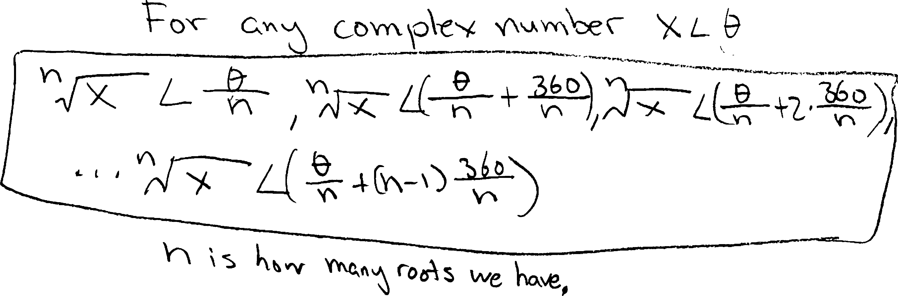
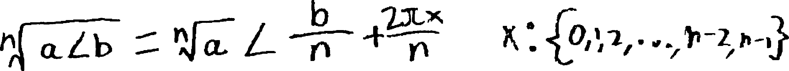
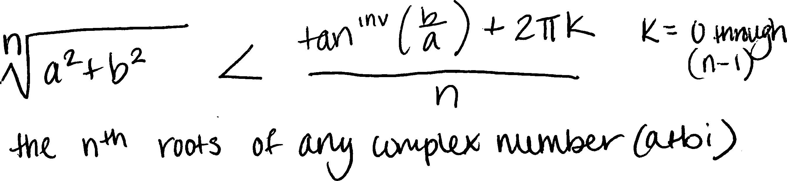
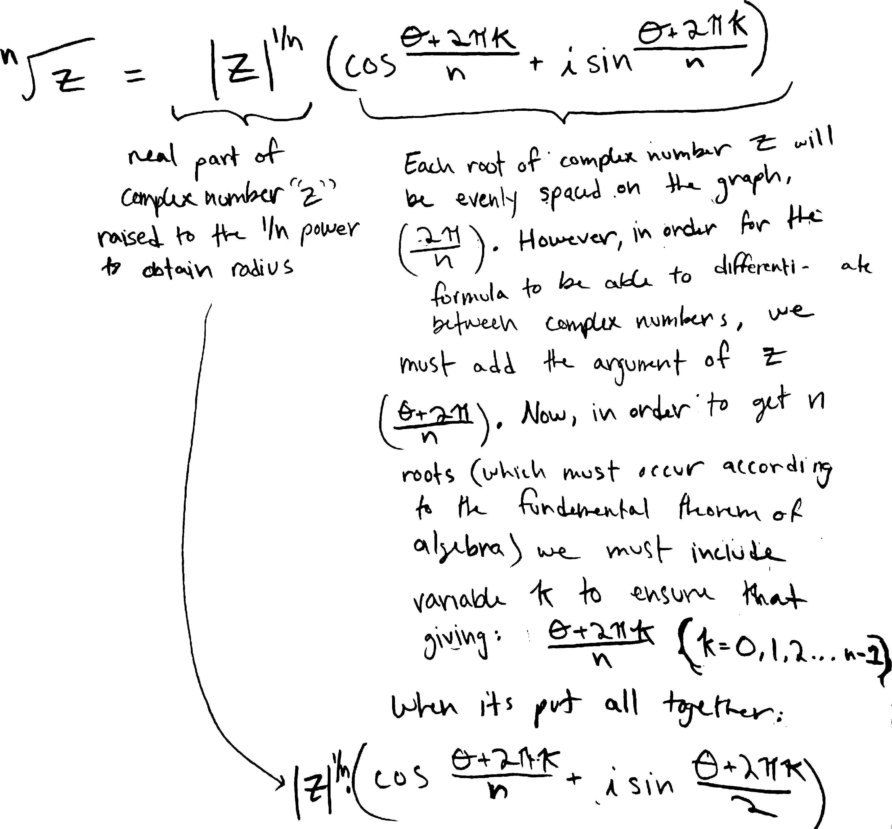
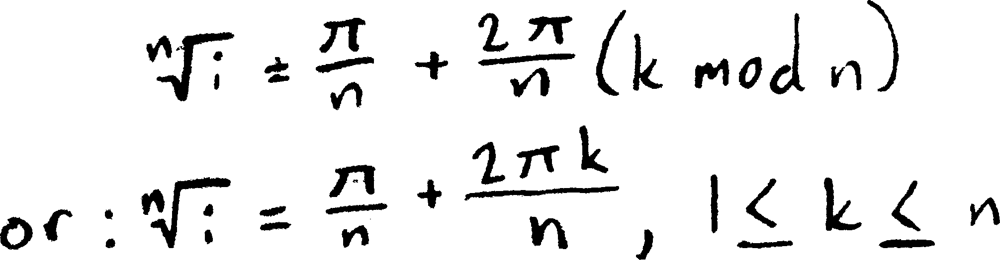

*these are the example formulas for complex roots that some of the kids in Math 3 Spring 2022 came up with and that I excerpted for that year's set of notes*

---

Of course, many of you already know this, since you managed to figure it out yourselves in class! Since there are so many ways to write this formula---so many ways to describe this/these numbers---I want to show some examples.

Some of you wrote all the roots as a long list, like Landon X.:

{ width=75% }

Landon's brother, like many of you, decided not to write a long list, and instead create a new variable to describe all the roots more succinctly:

{ width=50% }

Some of you made analogies to coding and the counters/indices in `for`-loops! That's exactly what we need here---a counter to describe each of the $n$ $n$'th roots as we rotate around the complex plane.

In Block 4, a bunch of you decided to write it in terms of its rectangular form (i.e., in terms of its real and imaginary parts). Here's a representative example, from Charlotte R.:

{ width=50% }

Note how you're all using different letters to represent different things in all these forms. For instance, in Landon's version of the formula, $x$ is the number we're taking the roots of; in Logan's, $x$ is the counter. Logan used $a$ and $b$ to represent the radius and angle; Charlotte used them to represent the real and imaginary parts. All of those are perfectly valid choices, but they do make it harder to quickly read and scan.

Here's how a big group of you in Block 8 wrote it (credit for this particular version to Sam Z.):

{ width=80% }

Kate K. was reminded of all the **[modular arithmetic](https://www.google.com/search?q=modular+arithmetic)** she's learned in Jana's cryptology class this semester, and decided to write it using that language. Here's how she wrote the roots of $i$ (as opposed to the roots of any complex number) using those ideas:

{ width=50% }

Her fundamental idea, as she told me, was that the angles are all mod $2\pi$. That's an excellent insight---and exactly the way to think about the relationship between angles and positions.