> *Hi everyone! Andrew here, in a preamble. I'm giving you these notes as* my *take on how complex roots work. I'm almost reluctant to do so, because I don't want to get in the way of* your own *understanding. I don't want to imply that my understanding is dispositive---that you did all this exploration, but that was just for kicks and giggles, and now you can read the "right" answer. There* are *right answers and wrong answers---but there are also many many ways to* express *the right answer, and also many ways to* come to *and* think about *the right answer*.
>
> *Remember the problem I gave us all a few weeks ago? That infinitely-iterated complex fraction? Where I just asked, "see if you can figure out anything cool about this"? I ended up not showing you the stuff I figured out about it (it was only my second time thinking about that problem), because the stuff you all came up with was so much cooler (and deeper) than my own meager findings. So I didn't want to give you the impression that there was some "right" answer I was hiding.*
>
> *Here it's a little different, because complex roots are something I've thought about deeply for a long time, and these notes are pretty good. So there probably is some wisdom you can gain from them. But do read them in the spirit of them being* Andrew's *take on the question, rather than the definitive, revealed, final answer. I'm not writing* ex cathedra *here.*

**Angles are not the same as positions.** Every skateboarder and figure-skater knows this. Spin $1440^\circ$ or spin $0^\circ$: you end up in the same place. In one of those maneuvers, you win gold; in the other, you're laughed at. *How many revolutions you make is not the same as where you end up*. (You might interpret this as an observation about politics.) We can ask two questions:

* If we spin a certain amount, where do we end up? (*There's only one answer.*)
* If we end up at a certain place, how much did we spin to get there?  (*There are lots of possible answers.*)

As we've grown to understand complex numbers better, we've realized that *numbers spin*. We raise a number to an exponent, and it spins around the complex plane. But also, numbers can *un-spin*. We can *un-raise* a number to an exponent---better known as taking a root. And when we do that, we have lots of possible answers.

## Complex Roots, Revisited

Let's back up a bit. You spent a day in class working out problems from the worksheet titled $\sqrt{\text{Complex!}}$. The problems all increased in difficulty and generality. At the end, you worked out a formula for all of the $n$th roots of any complex number. Hopefully you found something like this:

$$\sqrt[n]{r\angle\theta} = \left(r^{\frac1n}\right) \angle \left( \frac{\theta + 2k\pi}{n} \right)\quad\quad\text{for }k\in\{0,1,2,\dots,n-1\}$$

You probably wrote it in a different form or with different variable and notational choices; that's fine. 

In a sense, this is what our work this semester has been building to. We started the semester, on the very first day, by squaring these two expressions to prove that they're both square roots of $i$:

$$\left(\pm\frac{1}{\sqrt{2}} \pm\frac{1}{\sqrt{2}}i \right)^2 = i$$

But that was unsatisfying, since I had just pulled those expressions out of a hat and given them to you. Sure, if we square them, we get $i$, proving that they're both square roots of $i$. But that doesn't tell us *where they came from*. That doesn't tell us *why* they're square roots of $i$. 

Then we learned how to find those two square roots algebraically, by setting up an equation and solving it:

$$\sqrt{i} = a+bi$$

That gave us a *procedure* for finding the square roots, which was better. At least we weren't pulling things out of a hat. By using that procedure, we were able to also find the cube roots and quartic roots of $i$:

$$\text{to find the cube roots of $i$, we solved: } \sqrt[3]{i} = a+bi$$

$$\text{to find the quartic roots of $i$, we solved: } \sqrt[4]{i} = a+bi$$

But those procedures involved increasingly tedious and unsustainable amounts of algebra. Expanding things to the fourth power? Egads! Plus, we got all these weird, nasty answers. They didn't make any intuitive sense. 

Then we realized that complex numbers have this amazing geometric behavior. We realized that if we multiply two complex numbers together, their radii multiply and their angles add. By extension, we realized that if we exponentiate a complex number, its radius gets exponentiated, and its angle gets multiplied by the exponent. We created polar coordinates as a way to take advantage of these observations. With polar coordinates, and our newfound geometric understanding of complex numbers, we were able to start understanding why complex numbers have the roots they do. That's what you figured out (I hope) on that worksheet. 

For instance, one of the square roots of $i$, in polar, is: 

$$\sqrt{i} = \frac{1}{\sqrt2} + \frac{1}{\sqrt2}i = 1\angle 45^\circ$$

If we square it, what happens? Let's think about this geometrically. In fact, let's rewind a bit. What if we just raise it to the $0$? Then we'll get:

\begin{align*}
\left(1 \angle 0 \right)^0 &= 1^0 \angle\, 45^\circ \cdot 0 \\
&= 1 \angle 0
\end{align*}

So we get just the real number $1$. Then, if we raise it to the first, we can think of rotating out from $1\angle0$ by $45^\circ$ to $1\angle 45^\circ$:

{ width=75% }

Then, if we raise that root to the $2$nd, it rotates another $45^\circ$, and ends up at $45^\circ + 45^\circ = 90^\circ$. (The radius doesn't change, because the radius is just $1$, and $1$ raised to any power is still $1$.)

{ width=75% }

Here's the full algebra:
\begin{align*}
\left(\sqrt i\right)^2 = \left(\frac{1}{\sqrt2} + \frac{1}{\sqrt2}i \right)^2 &= \left(1\angle 45^\circ\right)^2 \\
&= 1\!\cdot\!1 \,\angle\, \left( {\color{red} 45^\circ } + {\color{green}45^\circ} \right)  \\
&= 1^2 \,\angle\, 2\!\cdot\!45^\circ \\
&= 1\angle 90^\circ \\
&= i
\end{align*}

But this isn't the only square root of $i$. There's a second one:

$$\sqrt{i} = -\frac{1}{\sqrt2} - \frac{1}{\sqrt2}i = 1\angle 225^\circ$$

If we raise that root from the zeroth to the first, we rotate from $1\angle 0$ out to $1\angle225^\circ$:

{ width=75% }

And then if we raise it from the first to the second (i.e., square it), we rotate another $225^\circ$ to end up at $225^\circ + 225^\circ = 450^\circ$. But that's the same as $360^\circ+90^\circ$, i.e. the same as $90^\circ$, i.e. just $i$!

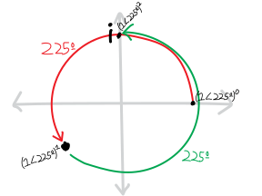{ width=75% }

Here's the algebra:
\begin{align*}
\left(\sqrt i\right)^2 = \left(-\frac{1}{\sqrt2} - \frac{1}{\sqrt2}i \right)^2 &= \left(1\angle 225^\circ\right)^2 \\
&= 1\!\cdot\! 1 \,\angle\, \left( {\color{red} 225^\circ} + {\color{green}225^\circ} \right)\\
&= 1^2 \,\angle\, 2\!\cdot\!225^\circ \\
&= 1 \,\angle\, 450^\circ \\
&= 1 \,\angle\, 360^\circ + 90^\circ \\
&\cong 1 \,\angle\, 90^\circ \\
&= i
\end{align*}

(I'm using this $\cong$ "congruence" symbol to mean something like "is in the same place as.") 

## The cube roots of $i$ spin, too!

Likewise, you spent all that time, and put all that work into, figuring out the three cube roots of $i$:

\begin{align*}
\sqrt[3]{i} = &+\frac{\sqrt3}{2} + \frac{1}{2}i,\\
&-\frac{\sqrt3}{2} + \frac{1}{2}i,\\
&-i.
\end{align*}

Written in all the various forms we know, they are:

$$ \sqrt[3]{i} =  i^{1/3} = \begin{Bmatrix}
+\frac{\sqrt3}{2} + \frac{1}{2}i &= 1\angle 30^\circ &= \cos\left(30^\circ\right) + i\sin(30^\circ) &= e^{i\pi/6}\\ \\
-\frac{\sqrt3}{2} + \frac{1}{2}i &= 1\angle 150^\circ &= \cos\left(150^\circ\right) + i\sin(150^\circ) &= e^{i\cdot5\pi/6}\\ \\
-i &= 1\angle 270^\circ &= \cos\left(270^\circ\right) + i\sin(270^\circ) &= e^{i\cdot7\pi/6}
\end{Bmatrix}
$$

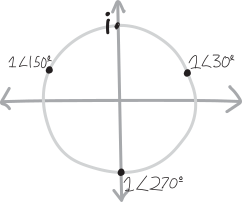{ width=75% }

Just like with the square roots of $i$, when each of the cube roots get cubed, they turn into $i$. They each spin around the origin different amounts, but they all end up at $i=90^\circ$. The first cube root looks like this:

\begin{align*}
\left(\sqrt[3]{i}\right)^3 &= \left(1\angle 30^\circ\right)^3 \\
&= \left( 1\!\cdot\!1\!\cdot\!1 \, \right)\, \angle\, \left( {\color{red} 30^\circ}+{\color{green}30^\circ}+{\color{blue}30^\circ }  \right)\\
&= 1 \,\angle\, 90^\circ \\
&= i
\end{align*}

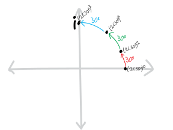{ width=75% }

Each time we multiply $1\angle 30^\circ$ by itself, it rotates another $30^\circ$! So we raise it to the $3$, and it rotates $3\cdot30^\circ$ to get to $1\angle 90^\circ$, also known as $i$! That makes sense. But what about the others? Why are they also cube roots? 

As it turns out, they just spin *more*! Take the second cube root, for instance, $1\angle 150^\circ$. Each time we multiply it by itself, it rotates another $150^\circ$! So when we cube it, it rotates $150^\circ+150^\circ+150^\circ = 450^\circ$. But that's the same as $90^\circ$, or just $i$! So $1\angle 150^\circ$, when raised to the $3$, *also* winds up^["Winds" up? Get it?!? Like "winding"???] at $1\angle 90^\circ = i$. It's just that it travels a lot further to get there. It makes one full revolution around the origin (plus an extra $90^\circ$). 

\begin{align*}
\left(\sqrt[3]{i}\right)^3 &= \left(1\angle 150^\circ\right)^3 \\
&= \left( 1\!\cdot\!1\!\cdot\!1 \, \right)\, \angle\, \left( {\color{red} 150^\circ}+{\color{green} 150^\circ}+{\color{blue} 150^\circ } \right)\\
&= 1 \,\angle\, 450^\circ \\
&= 1 \,\angle\, 360^\circ + 90^\circ \\
&\cong 1 \,\angle\, 90^\circ \\
&= i
\end{align*}

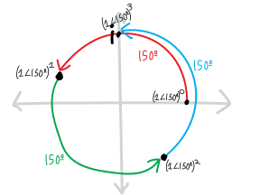{ width=75% }

And finally, the third cube root spins *twice* around the origin, making *two* full rotations:

\begin{align*}
\left(\sqrt[3]{i}\right)^3 &= \left(1\angle 270^\circ\right)^3 \\
&= \left( 1\!\cdot\!1\!\cdot\!1 \, \right)\, \angle\, \left( {\color{red} 270^\circ}+{\color{green}270^\circ}+{\color{blue}270^\circ } \right)\\
&= 1 \,\angle\, 810^\circ \\
&= 1 \,\angle\, 360^\circ + 360^\circ +  90^\circ \\
&\cong 1 \,\angle\, 90^\circ \\
&= i
\end{align*}

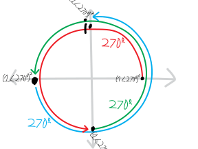{ width=75% }

Whee!!!!!!!

## Unspinning a *new* number

OK. So we've used polar coordinates, and complex exponentiation, to justify why the square and cube roots of $i$ are what they are. We've figured out some visual, geometric explanations. But can we use ideas like this to find roots of complex numbers that we don't already know??? What if we want to figure out the roots of some number *ab initio* (from the beginning), instead of coming up with a *post hoc* (after-the-fact) justification?

Here's an example. Let's think about the following complex number (written in so many different forms):

$$1\angle 120^\circ \quad=\quad e^{(2\pi/3)i} \quad=\quad \cos\left(120^\circ\right) + i\sin\left(120^\circ\right) \quad=\quad -\frac{\sqrt3}{2} + \frac{1}{2}i $$

{ width=75% }

Can we find its quartic (fourth) roots??

$$\sqrt[4]{1\angle 120^\circ \,} = \sqrt[4]{e^{(2\pi/3)i}\,\,} = \sqrt[4]{\cos\left(120^\circ\right) + i\sin\left(120^\circ\right) \,\,} = \sqrt[4]{ -\frac{\sqrt3}{2} + \frac{1}{2}i \,\,\, }=  \quad ???$$

Presumably, there are four of them:

\begin{align*}
\sqrt[4]{1\angle 120^\circ \,\,}  =& \,\rule{1cm}{0.5pt} \,, \\
& \,\rule{1cm}{0.5pt} \, , \\
& \,\rule{1cm}{0.5pt} \, , \\
& \,\rule{1cm}{0.5pt} \, .
\end{align*}

Doing this in rectangular would be unpleasant, because we'd have to solve:

$$ \sqrt[4]{-\frac{\sqrt3}{2} + \frac{1}{2}i \quad} = a+bi$$

$$-\frac{\sqrt3}{2} + \frac{1}{2}i = \left(a+bi\right)^4$$

$$\text{aaaaaghhhh}$$

But maybe we can do it in polar!!! When we raise things to an exponent in polar, we multiply the angle by the exponent. So if we want to un-raise something to an exponent---in other words, take a root---we just have to divide the angle by the exponent. In other words, we just have to ask:

What angle, when we multiply it by $4$, becomes $120^\circ$?

This is easy and silly. It's just a fourth-grade division problem. So we divide $120^\circ$ by four, and get:

$$\sqrt[4]{1\angle120^\circ \,\,} = 1\angle\frac{120^\circ}{4} = 1\angle30^\circ$$

It's easy to check that this works:

\begin{align*} 
\left(1\angle30^\circ\right)^4 &= \left( 1\!\cdot\!1\!\cdot\!1\!\cdot\!1\right) \,\angle\, \left(30^\circ+30^\circ+30^\circ+30^\circ \right)\\
&= 1^4 \angle 30\!\cdot\!4 \\
&= 1 \angle 120^\circ
\end{align*}

Visually, we can think of this as starting at $1\angle 0$ on the complex plane, and then just rotating $30^\circ$ each time we multiply it by itself. 

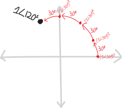{ width=75% }

In fact, if we use the exponential/Euler form of this complex number, it's even easier, because then finding the root consists of just doing some familiar exponent laws:

\begin{align*}
\sqrt[4]{1\angle120^\circ \,\,} = \sqrt[4]{e^{\frac{2\pi}{3}i}\,} &= \left( e^{\frac{2\pi}{3}i} \right)^{1/4} \quad\text{(definition of a root)} \\
&= e^{\frac{2\pi}{3}i\cdot\frac14} \quad\text{(by exponent rules)} \\
&= e^{\frac{2\pi}{12}i} \\
 &= e^{\frac{\pi}{6}i} \\
 &= 1\angle30^\circ
\end{align*}

But what about the other three roots? Where do they come from? 

## The Fundamental Multiplicity of Reality

**Here's the key insight**: $120^\circ$ isn't $120^\circ$. Or rather, $120^\circ$ isn't *just* $120^\circ$. If we're thinking about *where we actually are* on the complex plane, we can describe the point on the unit circle using a whole bunch of different angles. An infinitude of them, in fact. We can add or subtract any multiple of $2\pi$, a/k/a $360^\circ$, and we'll be in the same place:

\begin{align*}
&\hfill \quad\vdots \hfill\hfill & &\hfill \quad\vdots \hfill\hfill  \\
& 120 + 360\!\cdot\!4, && +1560^\circ,\\
& 120 + 360\!\cdot\!3, && +1200^\circ,\\
& 120 + 360\!\cdot\!2, && +840^\circ,\\
& 120 + 360\!\cdot\!1, && +480^\circ,\\
120^\circ \cong\quad& 120 + 360\!\cdot\!0, & \quad\quad\quad \cong \quad & +120^\circ, \\
& 120 + 360\!\cdot\!(-1), && -240^\circ, \\
&  120 + 360\!\cdot\!(-2), && -600^\circ,\\
& 120 + 360\!\cdot\!(-3), && -960^\circ,\\
& \hfill \quad \vdots \hfill\hfill && \hfill \quad\vdots \hfill\hfill
\end{align*}

In other words:

\begin{align*}
&\hfill \quad\vdots \hfill\hfill  \\
& +1560^\circ,\\
& +1200^\circ,\\
& +840^\circ,\\
& +480^\circ,\\
120^\circ \cong\quad& +120^\circ, \\
& -240^\circ, \\
&  -600^\circ,\\
& -960^\circ,\\
& \hfill \quad\vdots \hfill\hfill
\end{align*}

So, if we want to find out what angles become $120^\circ$ when we multiply them by four, we need to divide *all* of these by four! In other words, we need to ask not:

What angle, when we multiply it by $4$, becomes $120^\circ$?

But rather:

What angle*s*, when we multiply *them* by $4$, become $120^\circ$?

So we actually have:

\begin{align*}
&\quad\quad\vdots\\
& \frac{+1560^\circ}{4},\\
& \frac{+1200^\circ}{4},\\
& \frac{+840^\circ}{4},\\
& \frac{+480^\circ}{4},\\
\frac{120^\circ}{4} \cong\quad & \frac{+120^\circ}{4},\\
& \frac{-240^\circ}{4},\\
& \frac{-600^\circ}{4},\\
& \frac{-960^\circ}{4},\\
&\quad\quad\vdots
\end{align*}

Which, simplified, is just:

\begin{align*}
\vdots\quad \\
+390^\circ,\\
+300^\circ,\\
+210^\circ,\\
+120^\circ,\\
+30^\circ,\\
-60^\circ,\\
-150^\circ,\\
-240^\circ,\\
\vdots\quad
\end{align*}

If we simplify a bit more to just write these all as angles between $0^\circ$ and $360^\circ$, this becomes:

\begin{align*}
\vdots \quad \\
+30^\circ,\\
+300^\circ,\\
+210^\circ,\\
+120^\circ,\\
+30^\circ,\\
+300^\circ,\\
+210^\circ,\\
+120^\circ,\\
\vdots\quad
\end{align*}

So there are four distinct angles between $0^\circ$ and $360^\circ$ that, when multiplied by $4$, end up in the same place as $120^\circ$!!! So those are the four fourth roots of $1\angle 120^\circ$!!! Let me outline all that a little bit more compactly:

\begin{align*}
&\quad\quad\vdots\\
& 1\angle\frac{1560^\circ}{4} = 1\angle390^\circ = 1\angle30^\circ,\\
& 1\angle\frac{1200^\circ}{4} = 1\angle300^\circ,\\
& 1\angle\frac{840^\circ}{4} \,\,\, = 1\angle210^\circ,\\
& 1\angle\frac{480^\circ}{4} \,\,\, = 1\angle120^\circ,\\
\sqrt[4]{1\angle120^\circ} \quad= \quad& 1\angle\frac{120^\circ}{4} \,\,\, = 1\angle30^\circ,\\
& 1\angle\frac{-240^\circ}{4} = 1\angle-60^\circ = 1\angle300^\circ,\\
& 1\angle\frac{-600^\circ}{4} = 1\angle-150^\circ = 1\angle210^\circ,\\
& 1\angle\frac{-960^\circ}{4} = 1\angle-240^\circ = 1\angle120^\circ,\\
&\quad\quad\vdots
\end{align*}

Woweee!!!! It's all the fourth roots of $1\angle 120^\circ$!!! There aren't just four of them---there are an *infinite* number of them!!! Though, if we're thinking only about different positions on the unit circle, there are indeed only *four* distinct roots. Here's how we could write them in radius$\angle$angle notation:

\begin{align*}
\sqrt[4]{1\angle120^\circ \,\,} =\,& 1\angle30^\circ, \\ 
& 1\angle120^\circ,\\
& 1\angle210^\circ,  \\
& 1\angle300^\circ.
\end{align*}

Or, in exponential/Euler form:

\begin{align*}
\sqrt[4]{e^{2i\pi/3}\,\, } =\,& e^{i\pi/6}, \\ 
& e^{2i\pi/3}, \quad\\
& e^{7i\pi/6}, \quad \\
& e^{5i\pi/3}. \quad 
\end{align*}

Or, in rectangular form:

\begin{align*}
\sqrt[4]{ -\frac{\sqrt3}{2} + \frac{1}{2}i \quad} =\,& +\frac{\sqrt3}{2} + \frac{1}{2}i,\\ 
& -\frac{\sqrt3}{2} + \frac{1}{2}i,\\
& -\frac{\sqrt3}{2} - \frac{1}{2}i,\\
& -\frac{\sqrt3}{2} - \frac{1}{2}i.
\end{align*}

(By the way, you may note the cool coincidence that $1\angle120^\circ$ is its own fourth root! Why is that?)

If we want to summarize this, or write all the roots without needing a terrifying tower of an infinite number of angles, we could just write $120^\circ$ as being the same as $120^\circ$ plus any integer multiple of $360^\circ$:

$$120^\circ \cong 120^\circ + 360k ,\quad \text{for } k\in \mathbb{Z}$$

So then, for our roots, we get:

\begin{align*}
\sqrt[4]{1\angle120^\circ} &= \sqrt[4]{1\,\angle\, \left( 120^\circ + 360k \right)} ,\quad \text{for } k\in \mathbb{Z} \\ \\
&= 1\,\angle\, \frac{120^\circ + 360k}{4} \\ \\
&\text{If we wanted, we could simplify this fraction to:} \\ \\
&= 1\,\angle\, \left( 30^\circ + 90k\right)
\end{align*}

So the roots "start" at $30^\circ$, and then are spread $90^\circ$ apart!

If we want to write just the *finite* number of non-repeating roots---i.e. the four distinct ones---then I guess we could have $k$ be not just any integer, but just $0$, $1$, $2$, or $3$:

\begin{align*}
\sqrt[4]{1\angle120^\circ} &=   1\,\angle\, \frac{120^\circ + 360k}{4},\quad \text{for } k\in \{0,1,2,3\} \\
&=1\,\angle\, \left( 30^\circ + 90k\right)
\end{align*}

If you want a fun word, **degenerate** is one that gets used in this sort of context. For instance, we could say that the numbers $1\angle30^\circ$, $1\angle 390^\circ$, $1\angle 750^\circ$, i.e. $1\angle 30+360k$, are all degenerate cases of each other. (I'm not trying to accuse them of moral turpitude; that's just the word people use.)

So, in summary, we can describe all the fourth roots of $e^{2i\pi/3}$ as:

\begin{align*}
\sqrt[4]{1\angle 120^\circ} &\,=\,1 \angle \frac{120 + 360k}{4} = 1\angle (30+90k) \quad\quad\text{for $k\in\mathbb{Z}$ (but with repeats)}\\
&\,= \,1\angle \frac{120 + 360k}{4} = 1\angle (30+90k)  \quad\quad\text{for $k\in\{0,1,2,3\}$ (without repeats)
}\end{align*}

By the way, I've been a little casual with the formalism here---I've been slipping into different representations of complex numbers in these notes, as well as going back and forth between radians and degrees. I don't think I've introduced any ambiguities (eep), but please do let me know if something is unclear, or if you think I've made a mistake.

How about some pictures?!? Here's what the first of the roots looks like, as it gets raised to the fourth and spins around the complex plane. Notice how it touches the $+x$ axis once, and crosses it zero times:

{ width=75% }

Here's the next fourth root, $1\angle120^\circ$. It touches the $+x$-axis twice, and crosses it once:

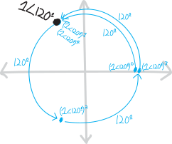{ width=75% }

The next root, $1\angle210^\circ$, touches the $+x$-axis three times, and crosses it twice:

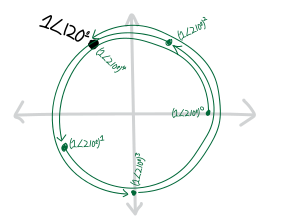{ width=75% }

And finally, the last (distinct) root, $1\angle300^\circ$, touches the $+x$-axis four times, and crosses it thrice:

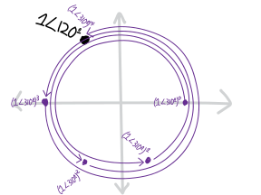{ width=75% }

Let's plot all four of the roots together:

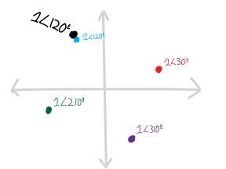{ width=75% }

Look at how beautiful they are! They form a perfect little square, rotated $30^\circ$ off-axis!

## Every Root of Every Number!!!!

So. What about our ultimate goal here: to come up with a formula describing *every* root of *every* complex number? (Or, if you want it to sound less intimidating, *any* root of *any* complex number.) 

Through these examples, we've gotten a good handle on how the angles of complex roots work. We've been able to see that if we take a root of a complex number, we get $n$ roots, each of which has an angle something like this:

$$\left(\substack{\text{the $n$'th root of}\\\text{some complex number}}\right) \quad\sim\text{has an angle of}\sim\quad \frac{\text{the original angle}}{n} +  \Big(\substack{\text{how much each root is }\\\text{rotated away from each other}}\,\Big)$$

If we want to describe that "how much each root is rotated away from each other" part with a bit more formalism, we can note that the $n$ roots are spread evenly around a full circle, so they're spaced $360/n$ (or $2\pi/n$) apart: 

$$\left(\substack{\text{the $n$'th root of}\\\text{some complex number}}\right) \quad\sim\text{has an angle of}\sim\quad \frac{\text{the original angle}}{n} +  \frac{360}{n}$$

Although, then, to actually get $n$ different roots, I guess we'll have to multiply $360/n$ by some factor that changes for each root:

$$\left(\substack{\text{the $n$'th root of}\\\text{some complex number}}\right) \quad\sim\text{has an angle of}\sim\quad \frac{\text{the original angle}}{n} +  \frac{360}{n}\cdot k$$

So there $k$ is some counter, running from $0$ up to $n-1$, i.e. $k=\{0,1,2\dots\,n-1\}$. Actually, if $k$ is more than that (like if $k$ is any integer), this formula still works; it's just that we'll start getting repeats. So that's how the angles of complex roots work.

There's one thing we haven't talked about, though: the radius! If we take a root of a complex number, how does the radius change? I asked you a couple questions on the worksheet to try to get you to figure out the answer:

> * Revisit our other favorite complex-numbers-model-organism: the sixth roots of $64$! Find them in polar coordinates. Then find the sixth roots of $729$ in polar (note that $729=3^6$). How do the answers differ?
> * Find all the quartic roots of $16$. Then find all the quartic roots of $81$. Like in the previous problem, how are these two sets of roots similar and different from each other?

Each of these pairs of numbers have the same angle (zero, 'cause they're real numbers), but different radii. What you found is that their roots have the same angle---the only difference is that they're shrunken into or stretched away from the origin, by the same amount that the original numbers were! The radius was just the normal, old-school, boring real-numbered root. In other words:

$$\left(\substack{\text{the $n$'th root of}\\\text{some complex number}}\right) \quad\sim\text{has a radius of}\sim\quad \left(\substack{\text{its ``normal'' real-}\\\text{-numbered $n$'th root}}\right)$$

Or, with slightly more detail:

$$\left(\substack{\text{the $n$'th root of}\\\text{some complex number}}\right) \quad\sim\text{has a radius of}\sim\quad \left(\substack{\text{the ``normal'' real-}\\\text{-numbered $n$'th root}\\\text{of its radius}}\right)$$

So, putting it all together, we have:

$$\left(\substack{\text{the $n$'th root of}\\\text{some complex number}}\right) \quad=\quad \left(\substack{\text{the ``normal'' real-}\\\text{-numbered $n$'th root}}\right) \,\,\angle\,\, \Big( \, (\text{the starting angle}) \,\,+\,\, \left(\substack{\text{how much each root is }\\\text{rotated away from each other}}\right)\,\Big)$$

Or in fancier math notation:

\begin{align*}
\sqrt[n]{r\angle\theta} &= \left(r^{\frac1n}\right)\angle \left( \frac{\theta + k\cdot2\pi}{n} \right),\quad\quad k\in\mathbb{Z}  \quad\text{(with repeats)}\\
&= \left(r^{\frac1n}\right)\angle \left( \frac{\theta + k\cdot2\pi}{n} \right),\quad\quad k\in\{0,1,2,\cdots,n-1\}\quad\text{(without repeats)}
\end{align*}

(The notation here is a little wacky, because it looks recursive/self-referential: we're trying to find the $n$th root of $r\angle \theta$, and our formula has an $n$th root of $r$ in it! So by "$r^{\frac1n}$" in that formula, I mean "the normal, ordinary, positive, real-numbered root." Radii are always positive real numbers---there's nothing messy about them.)

  

Of course, many of you already know this, since you managed to figure it out yourselves in class! Since there are so many ways to write this formula---so many ways to describe this/these numbers---I want to show some examples.

Some of you wrote all the roots as a long list, like Landon X.:

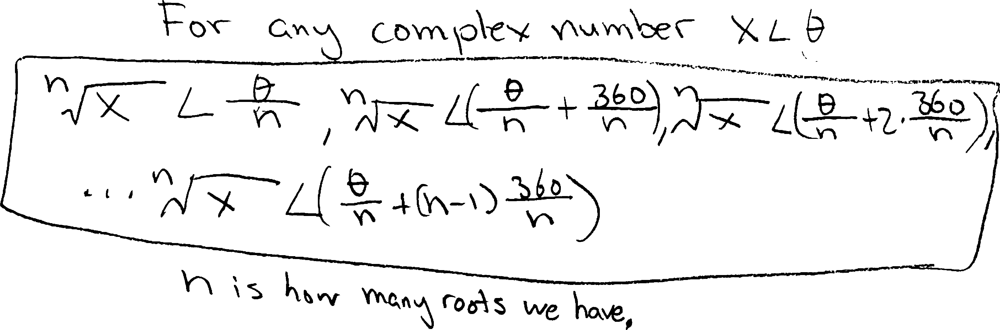{ width=75% }

Landon's brother, like many of you, decided not to write a long list, and instead create a new variable to describe all the roots more succinctly:

{ width=50% }

Some of you made analogies to coding and the counters/indices in `for`-loops! That's exactly what we need here---a counter to describe each of the $n$ $n$'th roots as we rotate around the complex plane.

In Block 4, a bunch of you decided to write it in terms of its rectangular form (i.e., in terms of its real and imaginary parts). Here's a representative example, from Charlotte R.:

{ width=50% }

Note how you're all using different letters to represent different things in all these forms. For instance, in Landon's version of the formula, $x$ is the number we're taking the roots of; in Logan's, $x$ is the counter. Logan used $a$ and $b$ to represent the radius and angle; Charlotte used them to represent the real and imaginary parts. All of those are perfectly valid choices, but they do make it harder to quickly read and scan.

Here's how a big group of you in Block 8 wrote it (credit for this particular version to Sam Z.):

{ width=80% }

Kate K. was reminded of all the **[modular arithmetic](https://www.google.com/search?q=modular+arithmetic)** she's learned in Jana's cryptology class this semester, and decided to write it using that language. Here's how she wrote the roots of $i$ (as opposed to the roots of any complex number) using those ideas:

{ width=50% }

Her fundamental idea, as she told me, was that the angles are all mod $2\pi$. That's an excellent insight---and exactly the way to think about the relationship between angles and positions.

## An Infinite Kaleidoscope

There's one thing that makes me nervous about showing you those pictures above of roots spinning around the complex plane. Those pictures imply there's *continuous motion*, with a complex number being a point particle and exponentiation being like moving it along a trajectory. And that's sort of true. But there's also an important way in which things are even weirder than that.

The distinction I made at the beginning of these notes, about spinning versus un-spinning a number, was in some sense false. Roots and exponents are, after all, the same thing. It's just that "root" is the name we give when we want to think about exponents as fractions; "exponent" is the name we use when we want to think about them as non-fractions. That has some direct implications for the way we think about them geometrically. Suppose we raise the complex number $z$ from $z^0$ to $z^1$. If we're trying to think of this as "moving" $z$ along an arc or a spiral, as we gradually and continuously increase its exponent, $z^{0\rightarrow 1}$, we can't "move" $z$ from $z^0$ to $z^1$ without passing through $z^{1/2}$. But we know there are two possibilities for that. Not one. Moreover, we can't move $z$ from $z^0$ to $z^1$ without passing through $z^{1/3}$, and we know there are three possibilities for that. To move $z$ from $z^0$ to $z^1$, we have to pass through each rational number between $0$ and $1$. And... that's going to get very messy, in terms of the number of possible roots/options/solutions we have. And it gets worse. If we think of moving $z$ from $z^0$ to $z^1$ by way of each *real* number in between, then... things are even messier.

Remember the day we played around with polar graphs in Desmos in class, and we graphed things like $r=\cos(\theta)$, $r=\cos(2\theta)$, $r=3\cos(\theta)$, and the like? And how they looked like beautiful flower petals? $r=\cos(2\theta)$ had four petals and $r=3\cos(\theta)$ had three petals? Remember how we then tried graphing fractions like $r=\cos(2.5\theta)$, $r=\cos(2.6\theta)$, and so forth? And how the number of  flower petals exploded? $r=\cos(2.5\theta)$ had ten (overlapping) petals and $r=\cos(2.6\theta)$ had $13$? The more "complicated" the number---the "further away" it got from being an integer---the bigger its denominator when written as a fraction---the more petals we got. Same thing here with the fractional roots. It's not so much that things are moving as single point particles when we try to rotate them. Rather, they *explode like a kaleidoscope*. 

With a bit of care and precision we can define or restrict a root operation to only ever give a single output, and perceive these roots as point particles perambulating around the plane. This is basically what your middle school teachers hammered into you about square roots---all that nonsense about how $\sqrt{x}$ is only the *positive* square root of $x$! But I prefer thinking of roots, and complex numbers, in terms of multiple-valued functions, often called **multifunctions**, i.e. functions that can return multiple (or even an infinitude of) outputs. That seems to be the natural way to think about them. (That seems to be how they *want us* to think about them.) And if we do that, things can get pretty weird. In this example here, we can think of what happens when we raise $z$ from $z^0$ to $z^1$ as $z$ starting at $z^0$, splintering into a kaleidoscope of possibilities, sometimes finite, sometimes infinite, and then settling back down on a single value at $z^1$. 

(None of this is really intended to make any sense to you, or, frankly, to me, not in this form of describing it; I'm just... trying to help you get a glimpse at some of the deeper beauties of complex numbers.)

