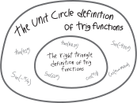
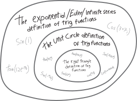

Let's digress for a bit and talk about something cool that *definitely doesn't have anything to do with complex numbers*. If you were in my section in the fall, you probably remember that we talked in passing a few times about *infinitely-long polynomials*, and how if we could make polynomials with an infinite number of terms, then all of a sudden *everything would be a polynomial*, including things like trig functions and exponential functions!

In class, we played around in Desmos---polluting pure reason with evil empiricism!---and eventually figured out how to write sine, cosine, and $e^x$ (the **exponential function**) as infinitely-long polynomials:

\begin{align*}
\sin x &= x - \frac{x^3}{3!} + \frac{x^5}{5!} - \frac{x^7}{7!} + \frac{x^9}{9!} -  \frac{x^{11}}{11!} + \cdots\\ \\
\cos x &= 1 - \frac{x^2}{2!} + \frac{x^4}{4!} - \frac{x^6}{6!} + \frac{x^8}{8!} - \frac{x^{10}}{10!}  + \cdots\\ \\
e^x &= 1 + x + \frac{x^2}{2!} + \frac{x^3}{3!} + \frac{x^4}{4!} +\frac{x^5}{5!} +\cdots
\end{align*}

The infinitely-long-polynomial versions of sine and cosine sure look a lot like the infinitely-long-polynomial version of $e^x$! Sine has all the odd terms; cosine has all the even terms; $e^x$ has both. What if we combine them? If we combine sine and cosine, will we get $e^x$??

$${\color{blue}\cos x} + {\color{red}\sin x} = {\color{blue}  1} {\color{red}  +x   }  {\color{blue} - \frac{x^2}{2!} } {\color{red}   - \frac{x^3}{3!}   }    {\color{blue}+ \frac{x^4}{4!}  } {\color{red}    + \frac{x^5}{5!}   }    {\color{blue} - \frac{x^6}{6!}  } {\color{red} - \frac{x^7}{7!}     }  +    \cdots$$

Well, not quite, because we've got those negatives. $e^x$ has all positive terms; sine and cosine alternate positive and negative terms. But is there some way we could manipulate them, so that we somehow add together cosine and sine, and maybe some other stuff, and get $e^x$?? In class I asked you to play around with this, and see if you could do it, and see what you could figure out. 

$$\begin{array}{r c c c c c c c c c}
{\color{blue}\cos x} + {\color{red}\sin x} =& {\color{blue}  1} &{\color{red}  +x   }  &{\color{blue} - \displaystyle\frac{x^2}{2!} } &{\color{red}   - \displaystyle\frac{x^3}{3!}   }    &{\color{blue}+ \displaystyle\frac{x^4}{4!}  } &{\color{red}    + \displaystyle\frac{x^5}{5!}   }    &{\color{blue} - \displaystyle\frac{x^6}{6!}  } &{\color{red} - \displaystyle\frac{x^7}{7!}     }  & +    \cdots\\ \\
\text{whence each term: } &{\color{blue} \substack{\text{from}\\\text{cosine}}} &{\color{red} \substack{\text{from}\\\text{sine}}}  &{\color{blue} \substack{\text{from}\\\text{cosine}}} &{\color{red} \substack{\text{from}\\\text{sine}}}  &{\color{blue} \substack{\text{from}\\\text{cosine}}} &{\color{red} \substack{\text{from}\\\text{sine}}} &{\color{blue} \substack{\text{from}\\\text{cosine}}} &{\color{red} \substack{\text{from}\\\text{sine}}}  \\ \\
\text{the signs: }  &{\color{blue} +} &{\color{red} +} &{\color{blue} -} &{\color{red} -} &{\color{blue} +} &{\color{red} +} &{\color{blue} -} &{\color{red} -}
\end{array}$$

Many of you noticed something interesting: the signs are cycling every four terms.\footnote{At least, this is what I hope happened; I'm writing these notes on Saturday night before we've done it yet!} What else do we know that repeats every four cycles? Plus plus, minus minus, plus plus, minus minus? How about *the powers of $i$*?!?!?!

$$\begin{array}{r c c c c c c c c c}
i^n =& i^0, &i^1, &i^2, &i^3, &i^4, &i^5, &i^6, &i^7, &\cdots \\
=& 1, &i, &-1, &-i,  &1, &i, &-1, &-i,  &\cdots\\
=& +, &+, &-, &-,  &+, &+, &-, &-, &\cdots \\ \\
\left|i^n\right| =& 1, &i, &1, &i,  &1, &i, &1, &i,  &\cdots
\end{array}
$$

So, does $i$ somehow come up here?!? It's already pretty crazy that there seems to be some sort of possible potential connection between trig functions and exponential functions. How does $i$ get involved?!? Three separate suspects, with little or no relation to each other, all caught on surveillance camera footage at the site of the crime! (Maybe extend or improve this metaphor!)

I hope some of you were able to figure it out by yourselves in class! I have no idea yet whether you were able to. There *is* a connection, but it's algebraically easier to work out if we already know what it is (as always). Let's take $e^x$, but instead of using $x$ as the variable, let's use $ix$. Then we have:

\begin{align*}
e^{ix} &= 1 + ix + \frac{(ix)^2}{2!} + \frac{(ix)^3}{3!} + \frac{(ix)^4}{4!} +\frac{(ix)^5}{5!} +\frac{(ix)^6}{6!} +\cdots\\\\
&= 1 + ix + \frac{i^2x^2}{2!} + \frac{i^3x^3}{3!} + \frac{i^4x^4}{4!} +\frac{i^5x^5}{5!} +\frac{i^6x^6}{6!} +\cdots\\\\
 &= 1 + ix - \frac{x^2}{2!} - i\frac{x^3}{3!} + \frac{x^4}{4!} +i\frac{x^5}{5!} -\frac{x^6}{6!} +\cdots\\
 \text{separating the terms with an $i$:}\\
  &= \left(1 - \frac{x^2}{2!}  + \frac{x^4}{4!} -\frac{x^6}{6!} +\cdots \right) \, +\, \left(ix  - i\frac{x^3}{3!}  +i\frac{x^5}{5!} +\cdots \right)\\
   \text{factoring out the $i$:}\\
  &=\underbrace{\left(1 - \frac{x^2}{2!}  + \frac{x^4}{4!} -\frac{x^6}{6!} +\cdots \right)}_{\text{but this is cosine!}} \, +\, i\underbrace{\left(x  - \frac{x^3}{3!}  +\frac{x^5}{5!} +\cdots \right)}_{\text{and this is sine!}} \\ \\
&= \cos(x) + i\sin(x)
\end{align*}

So then we have that:

$$e^{ix} = \cos(x)+i\sin(x)$$

So that's the connection! If we have an $i$ in the exponent of $e^x$, and also multiply sine by $i$, things work out. We can write exponential functions as trig functions! Or, put more strongly: **exponential functions are just trig functions. Trig functions are just exponential functions.** This equation, by the way, usually gets known as **Euler's Formula**:

**Euler's Formula:**

$$e^{ix} = \cos(x)+i\sin(x)$$ 

We'll get back to that idea in a moment. But for now, let's see what the connection to complex numbers and polar coordinates is. The right side of that equation above is just a complex number in polar form, with radius $1$ and angle $x$! So if we swap out $x$ for $\theta$, and multiply everything by some generic radius $r$, we have:

$$re^{i\theta} = r\left(\cos\theta + i\sin\theta\right)$$

So then we have *yet another* way of writing complex numbers! We can write any complex number in polar form, not just in its coordinate pair, $r\angle\theta$, and not as some lengthy sum of trig functions, $r\left(\cos\theta + i\sin\theta\right)$, but also as the nice, lovely, concise $re^{i\theta}$. 

**\large we can write any complex number with radius $r$ and angle $\theta$ as**:

$$re^{i\theta}$$

This is my favorite way to write complex numbers, because the angle is in the exponent, and that makes so so so much of what we're doing so clear. It often gets called **exponential form** or **Euler form** (we'll see where that last name comes from in a bit). *Everything just becomes exponent laws.* For example, we know that if we multiply two complex numbers together, their angles add. And this is *so easy to see*, algebraically, if we use exponential form. Say we have two complex numbers $r_1\angle \theta_1$ and $r_2\angle\theta_2$. In exponential form, these are $r_1e^{i\theta_1}$ and $r_2e^{i\theta_2}$. If we multiply them together:

\begin{align*}
\left(r_1e^{i\theta_1}\right)\cdot\left(r_2e^{i\theta_2}\right) &= r_1r_2 e^{i\theta_1}e^{i\theta_2}\\
\text{by exponent laws, this just becomes:}\\
&= r_1r_2\cdot e^{i\theta_1+i\theta_2}\\
&= r_1r_2\cdot e^{i(\theta_1+\theta_2)}
\end{align*}

So that's another explanation of why the angles of complex numbers add when we multiply them---the angles are just exponents!!! Likewise, the radii multiply, because the radii are just coefficients. In a sense, that's the fundamental *reason* angles add. We figured out that the angles add *empirically*, i.e., by multiplying together a whole bunch of complex numbers and noticing the pattern. But we didn't actually figure out what *causes* that pattern. We didn't use logical deduction to prove that the angles add when we multiply complex numbers. But now, we have.

We've learned a *lot* of different ways to write complex numbers. Let's summarize.

* We can write complex numbers in **rectangular form**, describing them as how far right and how far up from the origin they are:
    * We can write then as a coordinate pair: $$(a,b)$$
    * We can write them as a single expression: $$a+bi$$
* We can write complex numbers in **polar form**, describing how far away from the origin they are and at what angle:
    * We can write them as a coordinate pair: $$r\angle\theta$$
    * We can write them as a single expression, as a power of $i$: $$ri^{\frac{\theta}{\pi/2}}\quad(\theta\text{ in radians})$$
    * We can write them as a single expression, using an exponential function:$$re^{i\theta}$$
* We can write them in the hybrid polar/rectangular form with cosine and sine (*technically* rectangular but a way that makes the radius and angle clear), termed  by Gracie Fisher-Owens either **rectolar** or **polangular** (class vote strongly preferred the latter): $$r\left(\cos\theta + i\sin\theta\right)$$

Here's a $\LaTeX$ diagram of all this that I'm going to include not because it's particularly clear or pretty, but because it took forever to make. A hand-drawn version of that would be better. Make your own!!!

$$\overbrace{(a,b) = \underbrace{a}_{\substack{\text{real}\\\substack{\text{component}}}}+\underbrace{b}_{\substack{\text{imaginary}\\\substack{\text{component}}}}\cdot i }^{\text{rectangular/Cartesian forms}}= \overbrace{r\angle\theta =ri^{\frac{\theta}{\pi/2}}  = \overbrace{r}^{\text{radius}}\cdot\left( \underbrace{\cos\overbrace{\theta}^{\text{angle}}}_{\substack{\text{real}\\\substack{\text{component}}}}+i\cdot\underbrace{\sin\overbrace{\theta}^{\text{angle}}}_{\substack{\text{imaginary}\\\substack{\text{component}}}}\right) = \underbrace{\overbrace{r}^{\text{radius}}e^{i\cdot\overbrace{\theta}^{\text{angle}}}}_{\substack{\text{exponential/}\\\substack{\text{Euler form}}}} }^{\text{polar/mod-arg forms}}$$

\vspace{8pc}

## Trig functions really are just exponential functions!

The cool thing we saw at the beginning was that trig functions have this very close relationship to exponential functions! If we add together sine and cosine, and do some finagling, we get an exponential function! Let's make that connection a little bit more clear. Ultimately, we'll come up with *an equation for sine and cosine*, one that isn't infinitely-long, and doesn't involve triangles or unit circles. And that'll be pretty cool.

You may recall that in one of our earlier problem sets, we came up with a formula for the real part of an imaginary number:

\begin{align*}
\frac{z+\overline{z}}{2} &= \frac{(a+bi)+\overline{(a+bi)}}{2} \\
&= \frac{(a+bi)+(a-bi)}{2} \\
&= \frac{2a+\cancel{bi}-\cancel{bi}}{2} \\
&=\frac{2a}{a}\\
&= a \\
&= Re(z) \\
&=\text{the real part of }z
\end{align*}

We also came up with a formula for the imaginary part:

\begin{align*}
\frac{z-\overline{z}}{2i} &= \frac{(a+bi)-\overline{(a+bi)}}{2i} \\
&= \frac{(a+bi)-(a-bi)}{2i} \\
&= \frac{\cancel{a} + bi -\cancel{a} + bi}{2i} \\
&=\frac{2bi}{2i}\\
&= b \\
&= Im(z) \\
&=\text{the imaginary part of }z
\end{align*}

Many of you objected, quite reasonably, that the formulas seem useless and overly complicated, since if we have a complex number written in $a+bi$ form, we know its real and imaginary parts are just $a$ and $b$---we don't need a fancy formula. Indeed! But, since then, we've seen different ways of writing and describing complex numbers, that might not be so explicit about what the real and imaginary parts are. For example, consider this complex number:

$$z= 5e^{2i\pi/3}$$

It's a lovely complex number, with radius $5$ and angle $2\pi/3$. But what if we want to know its real and imaginary parts (i.e., its $x$ and $y$ components)? One way to figure them out would be to use trig functions:

$$Re(z) = 5\cos(2\pi/3) = 5\cdot \frac{-1}{2}$$

$$Im(z) = 5\sin(2\pi/3) = 5\cdot\frac{1}{\sqrt3}$$

Another way would be to use these formulas! We have:

\begin{align*}
Re(z) &= \frac{z+\overline{z}}{2} \\
&= \frac{5e^{2i\pi/3}+\overline{5e^{2i\pi/3}}}{2}\\
\text{but a conjugate is just a horizontal reflection, so this is: }\\
&= \frac{5e^{2i\pi/3}+5e^{-2i\pi/3}}{2}
\end{align*}

Um, okay, I guess that's actually a way less helpful form. Anyway! Here's the cool thing I really want to show you. Remember that equation we came up with:

$$e^{i\theta} = \cos\theta + i\sin\theta$$

We can take the real parts of both sides:

$$Re\left(e^{i\theta} \right)= Re\left(\cos\theta + i\sin\theta\right)$$

On the right, the real part is clearly just $\cos\theta$---we can just look at it and see it. 
$$Re\left(e^{i\theta} \right)=\cos\theta$$

But on the left? We can't easily dissect $e^{i\theta}$ into its real and imaginary parts! They're all tied together! What we can do instead, though, is use our formula for the real part:

$$\frac{e^{i\theta} +\overline{e^{i\theta}}}{2}=\cos\theta $$

Complex conjugates are just vertical reflections, so to take the complex conjugate of something in polar form, we just add a negative to the angle:

$$\frac{e^{i\theta} +e^{-i\theta}}{2}= \cos\theta $$

And look! We've got this lovely formula for cosine. It's not an infinitely-long polynomial, and it's not some hokey algorithm about rotating things around a unit circle---it's a single, closed form for cosine. That's actually pretty cool!

We can do the same for sine. We have:

$$\cos\theta + i\sin\theta = e^{i\theta}$$

To find sine, we'll take the *imaginary* part, since sine corresponds to the imaginary/vertical axis:
$$Im\left(\cos\theta + i\sin\theta\right) = Im\left(e^{i\theta} \right)$$

On the left, the imaginary part is  just $\sin\theta$:

$$\sin\theta = Im\left(e^{i\theta} \right)$$

But on the right? Like above, we'll apply our formula for the imaginary part:

\begin{align*}
\sin\theta &=\frac{e^{i\theta}-\overline{e^{i\theta}}}{2i}  \\
\text{working out the conjugate, this is: }\\
&= \frac{e^{i\theta}-e^{-i\theta}}{2i} 
\end{align*}

Woweee! So we have:

$$\sin\theta= \frac{e^{i\theta}-e^{-i\theta}}{2i}$$

So then, if we want to write sine and cosine *as single equations*, without having to describe them as ratios of sides of a triangle, or components of a unit circle, and without having to write them as infinitely-long polynomials, we can just use $i$ and an exponential function to write them in nice, compact, closed forms:
$$\sin\theta= \frac{e^{i\theta}-e^{-i\theta}}{2i} \quad\text{and}\quad \cos\theta = \frac{e^{i\theta} +e^{-i\theta}}{2}$$

## zooming out

There's a point here that we haven't made explicitly enough, about our deepening understanding of trig functions.

When you're a child, you learn that trig functions are ratios of the sides of right triangles. This is a delightful way to understand trig functions, and it lets you take the sine/cosine/whatever of any angle you can fit into a right triangle:

But it doesn't let you take the sine/cosine/whatever of angles that can't fit into a right triangle. Using this definition, you can't take the sine of a negative angle, or the tangent of an angle greater than $\pi/2$. So you zoom out. You come up with a broader, deeper, more fundamental conception of what trig functions are. You realize that trig functions are fundamentally not about triangles, but about *circles.* And with this definition, you can take the sine/cosine/whatever of angles that are *any real number*:

But now our conception of numbers themselves has broadened. The real numbers aren't enough for us. We've learned there's more to reality than what's real. The world's more complex. Now we believe in imaginary numbers, and so now, we've extended our understanding of trig functions to fit:

\begin{align*}
\sin(x) \quad&=\quad  \frac{e^{ix}-e^{-ix}}{2i}  \quad&=\quad x - \frac{x^3}{3!} + \frac{x^5}{5!} - \frac{x^7}{7!} + \frac{x^9}{9!} -  \frac{x^{11}}{11!} + \cdots \\ \\
\cos(x) \quad&=\quad \frac{e^{ix} +e^{-ix}}{2} \quad&=\quad 1 - \frac{x^2}{2!} + \frac{x^4}{4!} - \frac{x^6}{6!} + \frac{x^8}{8!} - \frac{x^{10}}{10!}  + \cdots
\end{align*}

Once again, we've peeled away one more layer of the onion from the inside---what a topologically-tortuous image---OK, we're peeling away layers of an onion from the outside, but it's infinitely large, or perhaps the layers are proportional to density and it's like an infinite black hole---turtles all the way down, except no, they're all different turtles---anyway, our understanding of what trig functions really are---"really" "are"---has broadened yet further:

## The Most Important Thing In These Notes

Maybe you weren't impressed by that. Here is something we all must genuflect before. Let's go back to this equation:

$$e^{i\theta} = \cos\theta + i\sin\theta$$

What if $\theta=\pi$? Then this just becomes:

$$e^{i\pi} = \cos\pi + i\sin\pi$$

$$e^{i\pi}  = -1 + 0$$

Rearranging this slightly, we have:

$$e^{i\pi} + 1 = 0$$

**This is amazing.** We have here, in a single equation, a relationship between the five most important numbers in math---$e$, $i$, $\pi$, $0$, and $1$---the three most important operations---addition, multiplication, exponentiation---and the most important relationship---equality. This is wonderous and beautiful.

**\Huge Euler's Identity:**
 $$e^{i\pi} + 1 = 0$$

</em>

## Problems

Write the following complex numbers in all six of the forms we now know, simplifying as far as reasonably possible without a calculator. (Draw them, if that's useful in this task.)

<ol class='problems'>
<li> $9\cdot i^{7/6}$
<li> $1 \angle (\pi/4)$
<li> $\displaystyle e^{\frac{i\pi}{6}}$
<li> $e^{2\pi i}$
<li> $\frac{1}{\sqrt{2}} + \frac{1}{\sqrt{2}}\cdot i$
<li> $\displaystyle \frac{\sqrt{3}+1}{\sqrt{2}} + \frac{\sqrt{3}-1}{\sqrt{2}}\cdot i$
<li> $\displaystyle 200e^{\frac{i\pi}{4}}$
<li> $4 \angle (5\pi/4)$
<li> $i^{5/7}$
<li> $\displaystyle e^{\frac{7i\pi}{6}}$
<li> $4 + 2i$
<li> $0.4 \angle (\pi/3 )$
<li> $\displaystyle\left(-\frac{1}{\sqrt{2}},\frac{1}{\sqrt{2}}\right)$
<li> $1 \angle (\pi/2)$
<li> $17 i^{373}$
<li> $1 \angle 17^\circ$
<li> $1 + \sqrt{2}i$
<li> $3 \angle 135^\circ$
<li> $5\sqrt{3} + 2i$
<li> $e^{i\pi/2}$ (huh...)
<li> $5 \angle 75^\circ$
<li> $\displaystyle e^{i\cdot\pi/4}$
<li> $9\cdot\left(\cos(5\pi/12) + i\sin(5\pi/12)\right)$
<li> $\cos(\pi/12) + i\sin(\pi/12)$
<li> $9 \angle 32^\circ$
<li> $1 \angle (-4\pi/3 )$
<li> $2 \angle 285^\circ$
<li> $-22+3i$
<li> $0.1\cdot\left(\cos(7\pi/6) + i\sin(7\pi/6)\right)$
<li> $2 i^{4}$
<li> $1 \angle 75^\circ$
<li> $e^{i\cdot0}$
<li> $i^{-281}$
<li> $\left(\frac{\sqrt{3}+1}{2\sqrt{2}},\frac{\sqrt{3}-1}{2\sqrt{2}}\right)$
<li> $e^{2i\pi}$
<li> $60 \angle 45^\circ$
<li> $4\cdot i^{135/90}$
<li> $1 \angle (\pi/3)$
</ol>

  

<ol class='problems'>
<li> Write $\left(1+\cos\theta+i\sin\theta\right)^2$ in exponential/Euler (i.e., $re^{i\theta}$) form. </li>
<li> Write $\displaystyle \left(\frac{1+\cos\theta+i\sin\theta}{1+\cos\theta-i\sin\theta}\right)^n$ in exponential/Euler (i.e., $re^{i\theta}$) form.  </li>
<li> Write $e^{i\alpha}\cdot e^{i\beta}$ in terms of $\cos\alpha$, $\cos\beta$, $\sin\alpha$, and $\sin\beta$. (Does this relate to anything we did in December?) </li>
<li> What's the sine of $i$?? </li>
<li> What's the cosine of $i$? </li>
<li> placeholder for unwritten problems with hyperbolic sine, cosine, tan

$$\sinh \theta = \frac{e^\theta - e^{-\theta}}{2}$$
$$\cosh \theta = \frac{e^\theta + e^{-\theta}}{2}$$
$$\tanh \theta = \frac{e^\theta - e^{-\theta}}{e^\theta + e^{-\theta}}$$

the pythagorean identity equivalent for hyberbolic trig functions: $\cosh^2\theta-\sinh^2\theta=1$

how hyberbolic trig fxns split up under additiojn $\sinh(\alpha+\beta) = \sinh\alpha\cosh\beta + \cosh\alpha\sinh\beta$
$\cosh(\alpha+\beta)$
</li>
<li> $\overline{e^z} = e^{\overline{z}}$</li>
</ol>

