**The problems with complex numbers we've done have involved increasingly tedious amounts of algebra**. Many of you have noticed that in a lot of the problems, the answers (and even the ingredients) have been somewhere on the unit circle. For example, we found that (one of) the square root(s) of $i$ is:

$$\sqrt{i} = \frac{1}{\sqrt{2}} + \frac{1}{\sqrt{2}}i$$

In other words, it's at:

$$ \left(\frac{1}{\sqrt{2}} , \frac{1}{\sqrt{2}}\right)$$

And that's the same as where the tip of a $\pi/4-\pi/4-\pi/2$ special right triangle is on the unit circle:

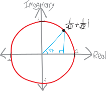{ width=50% }

If so many of the complex numbers we talk about sit on the unit circle, maybe it makes sense to talk about them *not in terms of their $x$ and $y$ coordinates*, but rather *in terms of their angle*. After all, those fractions with square roots are ugly. Instead of saying:

$$\text{the square root of $i$ is at} \left(\frac{1}{\sqrt{2}} , \frac{1}{\sqrt{2}}\right)$$

how about we just say:

$$\text{the square root of $i$ is at } \pi/4 \quad\text{(or $45^\circ$ if you're a heathen)}$$

In fact, let's generalize a bit further. What if we have a point on the complex plane that's *not* on the unit circle? For example, $3+3\sqrt{3}i$:

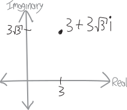{ width=50% }

What's its angle and distance from the origin? One way of finding out would be to recognize that this is just a blown-up version of a $\pi/3-\pi/6-\pi/2$ special right triangle. Another way would be to use a tangent (for the angle) and the Pythagorean theorem (for the radius). 

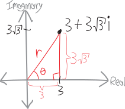{ width=50% }

For the radius, we have:

\begin{align*}
r^2 &= 3^2 + \left(3\sqrt{3}\right)^2\\
r &= \sqrt{3^2 + \left(3\sqrt{3}\right)^2} \\
&= \sqrt{9 + 27}\\
&= \sqrt{36}\\
&= 6
\end{align*}

So its radius is $6$. What about its angle? We can use a tangent, or rather, an *inverse* tangent, because we know:

$$\tan\theta = \frac{\text{opp}}{\text{adj}} = \frac{3\sqrt{3}}{3} = \sqrt{3}$$

So:

$$\theta = \tan^\text{inv}\left(\sqrt{3}\right) = \pi/3$$

So then we know how to describe this point in terms of its angle and radius! 

\begin{center}
\begin{tabular}{ c c }
\multicolumn{2}{c}{**two ways to describe the same point}}\\
  using imaginary and real components & using radius and angle\\
 \hline
 \hline \\
real component: $3$ &radius: $6$\\
imaginary component: $3\sqrt{3}$ & angle: $\pi/3$
  \end{tabular}
\end{center}
Let's draw it:

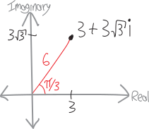{ width=50% }

This is the key insight and generalization. **We can describe *any* point on the complex plane in terms of its distance from the origin and its angle**. We can describe it in terms of either:

* how far it is to the right of the origin and how far it is up from the origin (normal $(x,y)$ coordinates), 

OR

* how far away it is from the origin (on a straight line), and what its angle from the origin is.

Two totally different ways to describe the same number!

Our traditional way of describing numbers we normally call **rectangular** or **Cartesian^[after Descartes] coordinates**. This new way of describing numbers we call **polar coordinates**, because if we make a graph on which the lines represent not constant left-right and up-down distance from the origin, but constant angle and radius from the origin, we get something that looks like a top-down or bottom-up view of the earth from one of the poles (looking at the lines of latitude and longitude). If you've played around with the settings in Desmos, you may have stumbled across it:

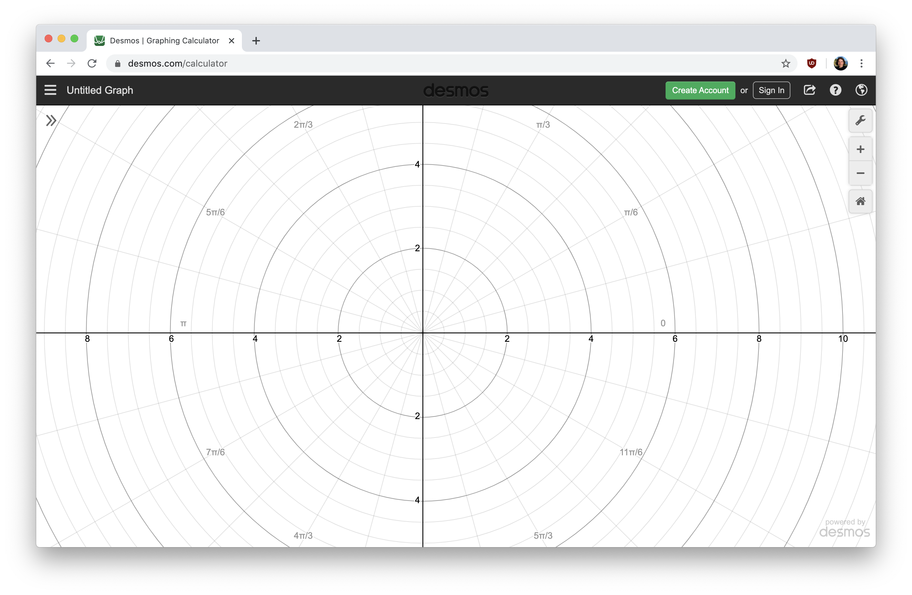{ width=75% }

New York City, like many cities, is organized on a rectangular/Cartesian grid system:

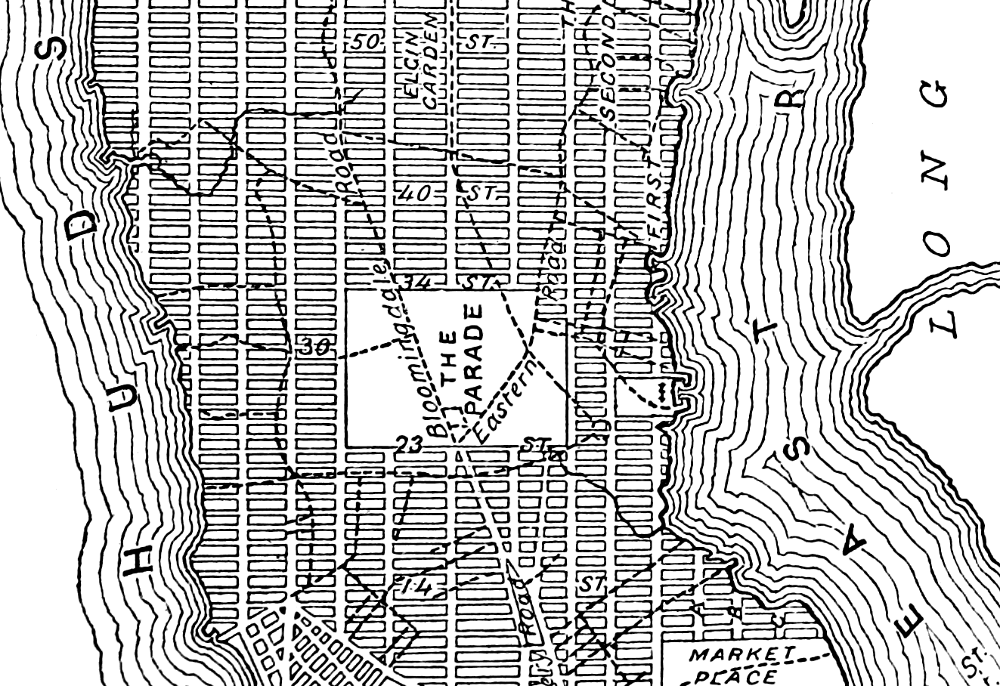{ width=75% }^[https://en.wikipedia.org/wiki/Commissioners\%27\_Plan\_of\_1811\#/media/File:NYC-GRID-1811.png]

But if you've spent time in Santa Cruz, or at Burning Man, you know what it's like to live on a polar grid:

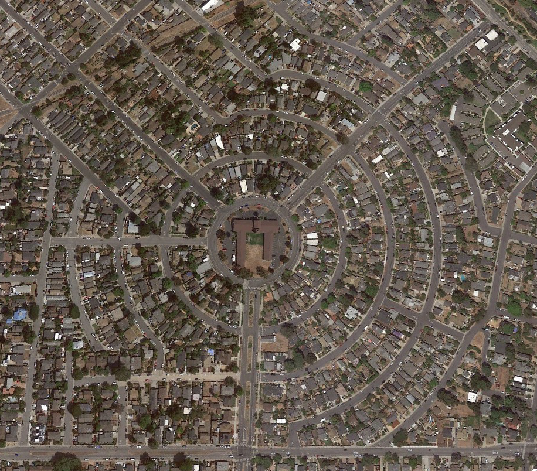{ width=75% }^[via Google Earth]

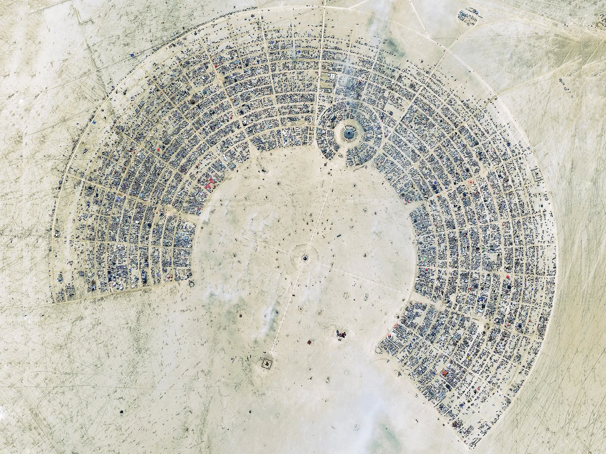{ width=75% }^["What The Controlled Chaos of Burning Man Reveals About Cities," *WIRED*, 27 August 2017, https://www.wired.com/story/burning-man-reveals-chaos-cities/]

(What other coordinate systems could we make up? Suppose we can describe any point on a two-dimensional plane with two numbers---what are other systems of coordinates that we could use? I am very fond of **loxodromic coordinates**, partly because they're cool and partly because it's a cool word, from the Greek *loxodromos*. But there are so many more cool coordinate systems we could make up!)

Often people use the notation **$\text{radius}\angle\text{angle}$** for polar coordinates, with the radius coming first, then a little angle symbol, and then the angle. Contrast this with the $(x,y)$ notation for rectangular coordinates, where we separate the two coordinates with a comma, and surround them with parentheses.

\begin{center}
\begin{tabular}{ c c }
  **Rectangular/Cartesian} &**Polar}\\
 \hline
 \hline
 \\
 $\left( \parbox{1in}{distance right\\from the origin} \,,\,\, \parbox{1in}{distance up\\from the origin} \right)$ & $\left( \parbox{1in}{distance/radius\\from the origin}\right) \,\angle\, \left(\parbox{1in}{angle\\from the origin} \right)$
  \end{tabular}
\end{center}

What if we want to write a point in polar coordinates as a single number? We do that in rectangular coordinates:

$$\text{we can write } (a,b) \text{ as } z=a+bi$$

What about with polar? All we need is some trig! If we think about our number as being the tip of a right triangle, with hypotenuse $r$ and angle $\theta$, we can find the real and imaginary components (i.e., $a$ and $b$) just by using sine and cosine:

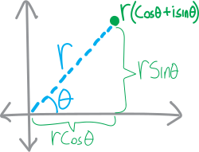{ width=75% }

So we can write any point in polar as:

\begin{align*}
\text{we can write } r\angle\theta \text{ as } z&= r\cos\theta + i\cdot r\sin\theta \\
&= r\left(\cos\theta+i\sin\theta\right)
\end{align*}

Likewise, if we have a number in rectangular form---if we know its real and imaginary components---we can use trig to find its radius and angle, and convert to polar form:

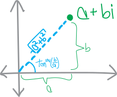{ width=75% }

So for example, we can write the number $z=3+3\sqrt{3}i$ either in rectangular/Cartesian form, or we can write it in $r\angle \theta$ form:

\begin{align*}
\text{in rectangular/Cartesian form: }(x,y) &= \left(3,3\sqrt{3}\right)\\
\text{in polar form: }r\angle\theta &=6\angle{\frac{\pi}{3}}
\end{align*}

Writing it out as a single number, we have:

\begin{align*}
z &= 3+3\sqrt{3}i \quad\text{(rectangular)} \\
 &= 6\big(\, \cos(\pi/3) + i\cdot\sin(\pi/3)\, \big)\quad\text{(polar)}
\end{align*}

Here's another example. Let's get back to $\left(\frac{1}{\sqrt{2}},\frac{1}{\sqrt{2}}\right)=1\angle(\pi/4)$. It's ugly! But it's way prettier if we think of it as being a point on a unit circle, $45^\circ = \pi/4$ up from the axis. Here are three ways we can write it:

\begin{align*}
\text{in rectangular:}& \quad \left(\frac{1}{\sqrt{2}} , \frac{1}{\sqrt{2}}\right)\\
\text{in polar:}& \quad 1\angle \frac{\pi}{4}\\
\text{in polar, if you're a heathen who likes degrees:}& \quad 1\angle45^\circ\\
\end{align*}

If we actually write out the coordinate pairs as a single number, we have:

\begin{align*}
\sqrt{i} &=  \frac{1}{\sqrt{2}} + \frac{1}{\sqrt{2}}i \quad\quad\text{(in rectangular)} \\
 &= \cos(\pi/4) + i\cdot\sin(\pi/4) \quad\quad\text{(in polar)}
\end{align*}

This is the same number! Just written two different ways:

There's some more terminology. In polar form, the distance from the origin is sometimes called the **modulus** (I usually call it the **radius**, though), and the angle is sometimes called the **argument** (I usually just call it the **angle**).

$$\text{(modulus)}\angle\text{(argument)}$$

$$\text{(radius)}\angle\text{(angle)}$$

Sometimes polar form gets called **mod-arg form**, as an abbreviation of those two terms for the components.

Sometimes people use the abbreviation/notation **$\text{cis}(\theta)$** to mean $\cos(\theta)+i\sin(\theta)$. I don't really use it, but it can be helpful, and save us from having to write $\cos(\text{blah blah}) + i\sin(\text{blah blah})$ over and over again:

$$\text{cis}(\theta) \equiv \cos(\theta) + i\cdot\sin(\theta)$$

(That triple equals sign I'm using to mean a definition, i.e. the left side is  *defined* as the right side, rather than being equal through some subsequent deduction. If you code, you can think of it as being like an **assignment operator** in various programming languages.)

## Polar coordinates aren't just cool: they're useful

There are lots of questions we can ask about complex numbers that are way easier to answer in polar coordinates than rectangular coordinates. Conversely, there are lots of questions about complex numbers that are way easier to answer in rectangular coordinates than polar coordinates. One of the things we're trying to learn is not just *how* to convert back and forth between polar and rectangular coordinates, but *when* to do so.

It's kind of like asking your parents for permission. Say you want to buy a new book. Your mom is all in favor of learning and reading and buying books, whereas your dad is a penny-pincher. So you ask your mom! Conversely, maybe you want to go to some cool party, and your dad is usually in favor of you socializing with your friends, whereas your mom thinks you need to spend more time doing math homework. So you ask your dad! Likewise with complex numbers. Sometimes it's easier to do things if they're written in rectangular form; other times it's easier to do things if they're written in polar form.

For example, suppose we have the complex number $z=3+3\sqrt{3}i$, and we want to add 5. If we have $z$ written in rectangular form, this is easy:

\begin{align*}
z+5 &= \left(3+3\sqrt{3}i\right)+5 \\
&= 8+3\sqrt{3}i
\end{align*}

We add $5$, and it's easy to see that now the real component of $z$ is $8$, and the imaginary component is unchanged at $3\sqrt{3}$. 

But what if we try adding $5$ if the number is in polar form? As we found in the last section, $3+3\sqrt{3}i$ in polar form is $6\angle\pi/3$, so it is:

$$z = 3+3\sqrt{3}i= 6\left(\cos\frac{\pi}{3}+i\sin\frac{\pi}{3}\right)$$

So if we want to add $5$, we get:

$$z+5 =6\left(\cos\frac{\pi}{3}+i\sin\frac{\pi}{3}\right) + 5$$

And while that's, like, *fine*, it's kind of useless. Does it tell us what the new radius and angle are? No, not unless we somehow figure out how to mash it together. Does it tell us what the new real and imaginary components are? Definitely not. It's this Frankenstein number---neither in fully polar form, nor in fully rectangular form---a useless chimera. I guess if we wanted to, we could do some nasty algebra to convert it to a single form. But that seems hard. The moral of the story: **it's easier to add numbers if they're in rectangular form**.

What about multiplication? If we're multiplying a complex number by just a real number, both representations work about equally well. Suppose we multiply our number by $5$. In rectangular coordinates, this looks like this:

\begin{align*}
5\cdot z &= 5\cdot\left(3+3\sqrt{3}i\right) \\
&= 15 + 15\sqrt{3}i
\end{align*}

So we can easily see that now both the real and imaginary components get multiplied by $5$.

Meanwhile, in polar form this looks like:

\begin{align*}
5\cdot z &= 5\cdot6\left(\cos\frac{\pi}{3}+i\sin\frac{\pi}{3}\right) \\
&= 30\left(\cos\frac{\pi}{3}+i\sin\frac{\pi}{3}\right)
\end{align*}

So we can easily see that the angle has remained the same, whereas the radius has gone up by a factor of $5$, to $30$.

What if we're multiplying a complex number by another complex number? This is where things get slightly trickier. We've seen a few examples. For instance, we know that if we multiply $\sqrt{i}$ by itself, we get just $i$ back:

$$\left( \frac{1}{\sqrt{2}} + \frac{1}{\sqrt{2}}i \right) \cdot \left( \frac{1}{\sqrt{2}} + \frac{1}{\sqrt{2}}i \right) = i$$

This is the same as just adding the angles together!

$$\underbrace{\left( \frac{1}{\sqrt{2}} + \frac{1}{\sqrt{2}}i \right)}_{=45^\circ} \cdot \underbrace{\left( \frac{1}{\sqrt{2}} + \frac{1}{\sqrt{2}}i \right)}_{=45^\circ} = \underbrace{i}_{=90^\circ}$$

If we add the other form of $\sqrt{i}$, the one with the negatives, we also end up at $i$. We can also do this by adding the angles together---it's just that we go around the unit circle a full turn, and then an additional $90^\circ$, to end up at $i$. 

$$\underbrace{\left( \frac{-1}{\sqrt{2}} + \frac{-1}{\sqrt{2}}i \right)}_{=225^\circ} \cdot \underbrace{\left( \frac{-1}{\sqrt{2}} + \frac{-1}{\sqrt{2}}i \right)}_{=225^\circ} = \underbrace{i^5}_{=450^\circ} = \underbrace{i}_{=90^\circ}$$

I gave you that really hard problem involving multiplying together a whole bunch of complex numbers:

$$\left( \frac{1}{\sqrt{2}} - \frac{1}{\sqrt{2}}i \right)\cdot \left(\frac{1}{2} + \frac{\sqrt{3}}{2}i \right)\cdot \left( -i \right)\cdot \left( -\frac{1}{\sqrt{2}} + \frac{1}{\sqrt{2}}i \right)\cdot \left( \frac{\sqrt{3}+1}{2\sqrt{2}} + \frac{\sqrt{3}-1}{2\sqrt{2}} i \right)$$

And many of you figured out that we can do this way way way easier, just by noticing that all the factors are points on the unit circle, and we can just add up the angles:

$$\underbrace{\left( \frac{1}{\sqrt{2}} - \frac{1}{\sqrt{2}}i \right)}_{=-45^\circ}\cdot \underbrace{\left(\frac{1}{2} + \frac{\sqrt{3}}{2}i \right)}_{=60^\circ}\cdot \underbrace{\left( -i \right)}_{=270^\circ}\cdot \underbrace{\left( -\frac{1}{\sqrt{2}} + \frac{1}{\sqrt{2}}i \right)}_{=135^\circ}\cdot \underbrace{\left( \frac{\sqrt{3}+1}{2\sqrt{2}} + \frac{\sqrt{3}-1}{2\sqrt{2}} i \right)}_{=15^\circ}$$

So then the total angle of the resulting number will be:

\begin{align*}
-45^\circ + 60^\circ + 270^\circ + 135^\circ + 15^\circ &= 435^\circ \\
&= 360^\circ + 75^\circ \\
&\cong 75^\circ
\end{align*}

So we just need a point on the unit circle with an angle of $75^\circ$, a/k/a $5\pi/12$. So we have just:
$$= \frac{\sqrt{3}-1}{2\sqrt{2}} + \frac{\sqrt{3}+1}{2\sqrt{2}} i $$

If we want to write this just as a power of $i$, it's:

$$=i^{5/6}$$

We know that because $i^1$ would be at $90^\circ$, and $75^\circ$ is $5/6$ of the way from $0^\circ$ to $90^\circ$. Hence $i^{5/6}$!^[Okay... there is some ambiguity here insofar as we're taking a root of $i$, and there are multiple roots; we can sort of resolve that by saying that by "$i^{1/6}$" in this context we mean "the sixth root of $i$ with the smallest angle" (and the raise that to the $5$ to get $i^{5/6}$. The fancy word people sometimes use for "the root with the smallest angle" is **principal root**.]

What did we learn from all that? The amazing trick, and awesome insight, is: if we're multiplying complex numbers, **we just add the angles together**! If we're dividing, we subtract the angles, since division is the opposite of multiplication.

But, actually, that only works if we're on the unit circle. What if we have a point that's *not* on the unit circle? What happens then? 

On that worksheet I gave you, the last problem involved complex numbers off the unit circle. You took one of the sixth roots of $64$, $1+i\sqrt{3}$, which you had calculated in that problem set last week, and repeatedly multiplied it by itself. What you found (I hope) was something like this:

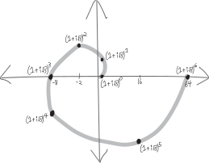{ width=75% }

You found is that the angles do indeed add---but also, the distance from the origin changes! We can summarize it in a table:

|        |  |  radius          | angle |
|---------:|:-|:---|:----:|:-----:|
| $\left(\sqrt[6]{64}\right)^0$ | $=+1+0i$ | $1$ | $0^\circ$ |
| $\sqrt[6]{64} = \left(\sqrt[6]{64}\right)^1$ | $=+1+\sqrt3i$ | $2$ | $60^\circ$ |
| $\sqrt[6]{64}\cdot\sqrt[6]{64} =\left(\sqrt[6]{64}\right)^2$ | $=-2 + 2\sqrt3i$ | $4$ | $120^\circ$ |
| $\sqrt[6]{64}\cdot\sqrt[6]{64}\cdot\sqrt[6]{64}=\left(\sqrt[6]{64}\right)^3$ | $=+8 + 0i$ | $8$ | $180^\circ$| |
| $\sqrt[6]{64}\cdot\sqrt[6]{64}\cdot\sqrt[6]{64}\cdot\sqrt[6]{64}=\left(\sqrt[6]{64}\right)^4$ | $=-8-8\sqrt3i$ | $16$ | $240^\circ$ |
| $\sqrt[6]{64}\cdot\sqrt[6]{64}\cdot\sqrt[6]{64}\cdot\sqrt[6]{64}\cdot\sqrt[6]{64}=\left(\sqrt[6]{64}\right)^5$ | $=-16+16\sqrt3i$ | $32$ | $300^\circ$ |
| $\sqrt[6]{64}\cdot\sqrt[6]{64}\cdot\sqrt[6]{64}\cdot\sqrt[6]{64}\cdot\sqrt[6]{64}\cdot\sqrt[6]{64}=\left(\sqrt[6]{64}\right)^6$ | $=+64+0i$ | $64$ | $360^\circ$ |

Here's the animated version, with *all six* sixth roots being exponentiated continuously from $0$ all the way to $6$:

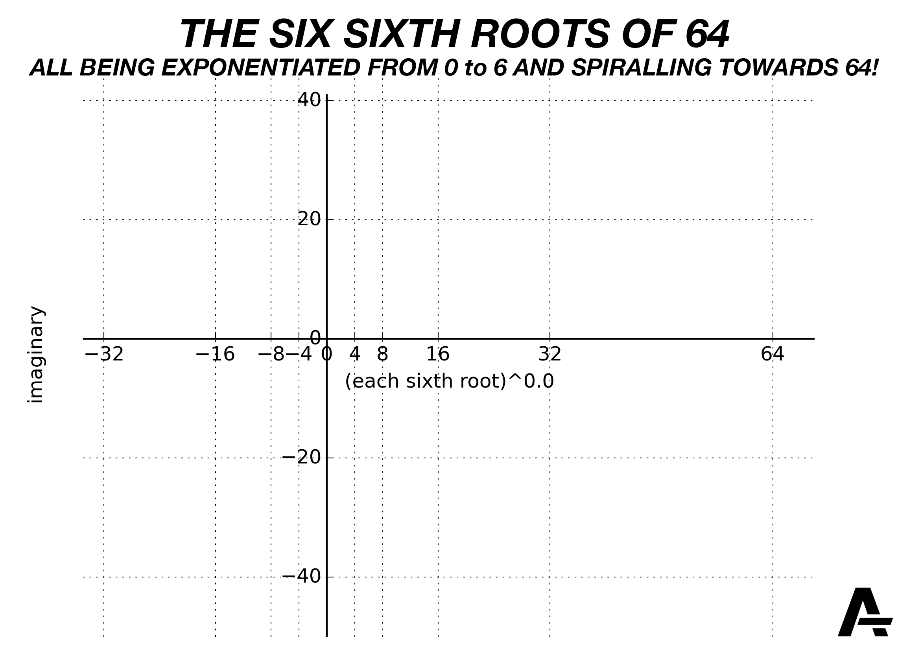{ width=75% }

Ultimately, we have something like:

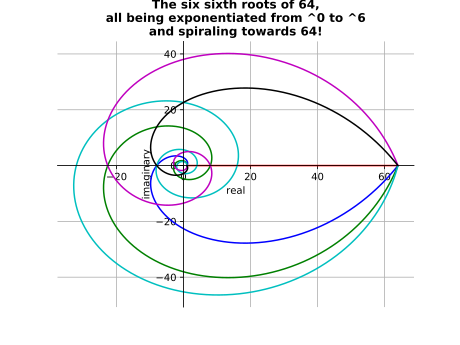{ width=75% }

So, what I hope you found from your exploration with this problem is that if we multiply complex numbers that aren't on the unit circle, we still add the angles, but the distance from the origin changes. 

How does the distance from the origin change? The sixth root of $64$ is two units away from the origin. (It doesn't matter which sixth root we choose---they're *all* two units away from the origin.) Each time we multiply it by itself, our number gets two times further away from the origin. Each multiplication by $\sqrt[6]{64}$ adds $60^\circ\,$ to the angle,^[Okay, $\pi/3$; I'm a heathen, too. In my defense, the reason I've been slipping into degrees in these notes is because it's so much easier to add things in degrees than it is in radians. $\frac{\pi}{2}+\frac{\pi}{3}+\frac{\pi}{6}$??? Adding that is hard! You've got to combine fractions! Common denominatorizing? Who has time for *that*???] and multiplies the distance from the origin (the radius) by $2$. So, the additional insight we have from this problem is that when we're multiplying complex numbers together, in addition to adding the angles, **we multiply the radii**. 

**to multiply together two complex numbers in polar form,**

**we multiply the radii and add the angles:**

$$\left(r_1\angle \theta_1\right)\cdot\left(r_2\angle \theta_2\right) = \left(r_1r_2\right)\angle \left(\theta_1+\theta_2\right)$$

put differently:

$$\big(r_1\left(\cos\theta_1+i\sin\theta_2\right)\big)\cdot \big(r_1\left(\cos\theta_1+i\sin\theta_2\right)\big)\,=\, r_1r_2\big(\, \cos(\theta_1+\theta_2)+i\sin(\theta_1+\theta_2)\, \big)$$

Since the radius of a complex number in polar form often gets called the **modulus**, a mellifluous way you can remember this is to "multiply the moduli, and add the angles." Or you could call it the **magnitude**---that's another term that gets used. 

What if we're multiplying a complex number by itself a whole bunch of times (also known as **exponentiation**)? For example, what if we have:

$$\left(r\angle \theta\right)^3$$

Well, then we just multiply the radii together three times, and add the angles together three times:

\begin{align*}
\left(r\angle \theta\right)^3 &= \left(r\angle \theta\right)\cdot\left(r\angle \theta\right)\cdot\left(r\angle \theta\right)\\
&= \left(r\cdot r \cdot r\right)\angle \left(\theta+\theta+\theta\right)\\
&\text{Or just:}\\
&= \left(r^3\right)\angle \left(3\theta\right)
\end{align*}

I guess we can write this down as a more general observation:

$$\left(r\angle \theta\right)^n= \left(r^n\right)\angle \left(n\theta\right)$$

If we write this out on the $\cos+i\sin$ form, it gets known as **De Moivre's Theorem**:

$$\big(r\left(\cos\theta + i\sin\theta\right)\big)^n = r^n\left(\cos n\theta + i\sin n\theta\right)$$

So, as such, **if we want to exponentiate complex numbers, it's way easier to do so in polar coordinates than rectangular coordinates**. For example, what if we want to take $3+3\sqrt{3}i$ and raise it to the $450$th? Here's how we'd do that in rectangular coordinates:

\begin{align*}
z^{450} &= \left(3+3\sqrt{3}i\right)^{450} \\
&= \underbrace{\left(3+3\sqrt{3}i\right)\left(3+3\sqrt{3}i\right)\left(3+3\sqrt{3}i\right)\cdots}_{450\text{ times}} \\
&= \text{AAAAAAAAAAGH}
\end{align*}

Okay, that's definitely not something we're going to work out by hand. But what if we do it in polar?? We just need to find the radius, raise it to the $450$th, and multiply the angle by $450$. We have:

\begin{align*}
\big(6\,\angle\,(\pi/3)\big)^{450} &= \left(6\right)^{450}\,\angle\,\left(450\cdot \pi/3\right) \\
&= 6^{450}\,\angle\, 150\pi \\
&= 6^{450} \,\angle\, \pi \quad\text{(because $150\pi \cong 1\pi$)}
\end{align*}

Writing it out with trig functions, we have:

\begin{align*}
&= 6^{450}\left(\cos\pi + i\sin\pi\right) \\
\text{Simplifying that, we get:}\\
&= 6^{450}\left(-1 + i\cdot 0\right) \\
&= -6^{450}
\end{align*}

There! So much easier! We've worked out $\left(3+3\sqrt{3}i\right)^{450}$ without having to do $450$ horrible binomial multiplications! We just converted it to polar form, and then it was so much easier! Totally doable, by hand, in a way that multiplying a binomial by itself $450$ times wouldn't be!

\begin{align*}
\left(3+3\sqrt{3}i\right)^{450} = -&6^{450} \\
=-&147,252,498,583,517,385,317,586,164,069,238,\\
&032,896,112,058,351,438,757,983,014,769,693,\\
&372,565,232,993,881,469,948,991,217,709,137,\\
&019,461,037,145,294,592,020,173,701,375,168,\\
&912,282,334,484,871,403,174,767,655,880,386,\\
&045,910,084,758,703,074,415,025,299,415,269,\\
&171,925,628,511,937,032,731,984,012,897,986,\\
&591,707,883,502,506,548,247,671,311,183,326,\\
&452,554,217,858,802,386,703,514,003,611,399,\\
&224,036,192,306,226,210,075,368,787,167,671,\\
&873,479,497,761,345,765,376.
\end{align*}

## In $\sum$mary

Let's summarize what we've learned so far. **Sometimes things are easier in polar, and sometimes things are easier in rectangular.** More specifically:

* It's usually easier to add and subtract numbers when they're in rectangular form.
* It's usually easier to multiply and divide, and exponentiate and take roots, of numbers when they're in polar form.

| | **Rectangular/Cartesian** | **Polar/Mod-Arg** |
|---:|:--:|:---:|
| **description of points**   | (how far right, how far up) | (how far away) $\angle$ (angle) |
| |   (real component, imaginary component) | (radius)$\angle$(angle) |
| |  |  (modulus)$\angle$(argument) |
| **notation** | $$(x,y)$$ | $$r\angle\theta$$ |
| **as an equation** |   $$z=x+iy$$  | $$z=r\left(\cos\theta + i\sin\theta\right)$$ |
| | | $$z=r\text{cis}\theta$$ |
|**converting from the other representation** | $$(r\cos\theta, r\sin\theta)$$ | $$\displaystyle\left(\sqrt{x^2+y^2}\right)\,\angle\,\tan^\text{inv}\left(\frac{y}{x}\right)$$ |

{ width=50% }

{ width=50% }

## Problems

For each of the following pairs of complex numbers:

<ol class='lettered-list'>
<li> Draw them on the two-dimensional complex plane
<li> Write them out in both polar and rectangular coordinates (i.e., so you have both numbers in both representations).
<li> Add them together, both in rectangular and polar. Draw the result on the graph.
<li> Subtract them, both in rectangular and polar, and draw the result.
<li> Multiply them both in rectangular and polar, and draw the result.
<li> Divide them (the first by the second) in both rectangular and polar, and draw the result
</ol>

<ol class='problems'>
<li> $z=1$ and $w=\frac{1}{\sqrt{2}}+\frac{1}{\sqrt{2}}i$
<li> $z=\cos(\pi/3)+i\sin(\pi/3)$ and $w=i$
<li> $z=-\frac{\sqrt{3}}{2}+\frac{1}{2}i$ and $w=\cos(-\pi/4)+i\sin(-\pi/4)$
<li> $z=32+32i\sqrt{3}$ and $w=-7+i$
<li> $z=\frac{1}{\sqrt{2}}-\frac{1}{\sqrt{2}}i$ and $w=5+4i$
<li> $z=\frac{\sqrt{3}}{2}+\frac{1}{2}i$ and $w=\frac{1}{2}+\frac{\sqrt{3}}{2}i$
<li> $z=500+500i$ and $w=-1$
<li> $z=12\cos(5\pi/6)+12i\sin(5\pi/6)$ and $w=3(\cos(\pi)+i\sin(\pi))$
<li> $z=k-ki$ where $k<0$, and $w$ is the same.
<li> $z=\frac{-1}{2}-\frac{\sqrt{3}}{2}i$ and $w=42i$
<li> $z=\frac{1}{\sqrt{2}}+\frac{1}{\sqrt{2}}i$ and $w=\frac{\sqrt{3}}{2}-\frac{1}{2}i$
<li> $z=\frac{-1}{2}-\frac{\sqrt{3}}{2}i$ and $w=22-i$
<li> $z=5\sqrt{3}+i$ and $w=5$
<li> $z=\frac{+1}{2}-\frac{\sqrt{3}}{2}i$ and $w=\frac{\sqrt{3}}{2}+\frac{1}{2}i$
<li> $z=1$ and $w=5\sqrt{3}+i$
<li> $z=-\frac{\sqrt{3}}{2}-\frac{1}{2}i$ and $w=42i$
<li> $z=\frac{-1}{2}+\frac{\sqrt{3}}{2}i$ and $w=-i$
<li> $z=\frac{1}{\sqrt{2}}-\frac{1}{\sqrt{2}}i$ and $w=500+500i$
<li> $z=3+2i$ and $w=3+2i$
<li> $z=-7+i$ and $w=5\sqrt{3}+i$
<li> $z=-i$ and $w=\frac{+1}{2}-\frac{\sqrt{3}}{2}i$
<li> $z=5+4i$ and $w=3+2i$
</ol>

  

Simplify:

<ol class='problems'>
<li>  $(1+i)^{15}$
<li>  $\left(1-i\sqrt{3}\right)^{11}$
<li>  $\left(\sqrt{2}-i\sqrt{2}\right)^{-19}$
<li>  $(-1+i)^{-11}$
<li>  $\left(\sqrt{3}-i\right)^{1/2}$
<li>  $\left(2+2i\sqrt{3}\right)^{-5/2}$
<li>  $\left(\sqrt{2}\left(\cos\frac{\pi}{5} + i\sin\frac{\pi}{5}\right)\right)^{10}$
<li>  $\left(\cos\frac{\pi}{12} + i\sin\frac{\pi}{12}\right)^{36}$
<li>  $\left(\sqrt{2}\left(\cos\frac{\pi}{8} + i\sin\frac{\pi}{8}\right)\right)^{12}$
<li>  $\sqrt{8\cos\frac{\pi}{2} + 8i\sin\frac{\pi}{2}}$
<li>  $\left(8\left(\cos\frac{\pi}{5} + i\sin\frac{\pi}{5}\right)\right)^{5/3}$
<li>  $\left(\sqrt{2}\left(\cos\frac{\pi}{5} + i\sin\frac{\pi}{5}\right)\right)^{10}$
</ol>

  

<ol class='problems'>
<li> Simplify: $(i+1)^{3200} - (i-1)^{3200}$
<li> Find all the fifth roots of $2+2i$, i.e., find $\sqrt[5]{2+2i}$.
<li> Suppose that $z=(1+bi)^2$, where $b$ is real and positive, and also the angle/argument of $z$ is $\pi/3$. Find $b$. 
<li> Find the cube roots of $-8i$. Give your answers in rectangular form.
<li> Find the fifth roots of $2+2i$.
<li> When is $\left(-1+i\sqrt{3}\right)^k$ real (i,.e., for what values of $k$)?
<li> What are the cube roots of $-27$?
<li> Simplify: $$\displaystyle \frac{\left( \frac{\sqrt{3}}{2} - \frac{1}{2}i \right)^2}{\left( \cos\left(\frac{\pi}{10}\right) - i\sin\left(\frac{\pi}{10}\right) \right)^5\left( \cos\left(\frac{\pi}{30}\right) + i\sin\left(\frac{\pi}{30}\right) \right)^{25}}$$

Note that that's a negative sign, not a positive sign, in the lower left, so I guess that factor *isn't* written in standard polar form. 
<li> For what value(s) of $n$ is $\left(2-2\sqrt{3}i\right)^n$ real? For what values is it imaginary? For what values is it non-real non-imaginary complex?
<li> For what value(s) of $n$ is $(-5)^n$ real? For what values is it imaginary? For what values is it non-real non-imaginary complex?
<li> We've seen that if we multiply complex numbers, the angles add. Is the converse true? In other words, if we *add* complex numbers, do the angles *multiply*? Test out a few examples and see what happens. You'll have to come up with the examples yourself---I think you're capable of coming up with a handful of random complex numbers, adding them, and seeing if the angles have multiplied! Then, either prove this (if you think it's true) or disprove it (i.e., give a counterexample).
<li> Consider the two points in polar coordinates:
$$2\angle\frac\pi6 \quad\quad\text{and}\quad\quad 2\angle\frac{-11\pi}{6}$$
<ol class='lettered-list'>
<li> Are these two points actually different points?
<li> Come up with *another* way of writing this point in polar coordinates!
</ol>

<li> You know the distance formula in rectangular coordinates. It's great. (It's just a modified version of the Pythagorean Theorem.) It's great:
\begin{align*}
\text{the distance between $\left(x_1, y_1\right)$ and $\left(x_2,y_2\right)$}\quad &= \sqrt{\left(\substack{\text{the distance}\\\text{in the $x$-direction}} \right)^2 +  \left(\substack{\text{the distance}\\\text{in the $x$-direction}} \right)^2} \\
&=  \sqrt{\left(x_2-x_1\right)^2 +  \left(y_2-y_1 \right)^2}
\end{align*}
<ol class='lettered-list'>
<li> What if you have two points in polar coordinates, $r_1\angle \theta_1$ and $r_2\theta_2$? Can you come up with a formula for the distance between these two points---a *polar* version of the distance formula??? That'd be super.
<li> Using that formula, can you find the distance between the points $3\angle\frac{3\pi}{4}$ and $1\angle\frac{7\pi}{6}$?
<li> Convert the points in the above problem to rectangular coordinates, and then using the rectangular distance formula to find the distance between them. you get the same answer, right??
</ol>

<li> How can we write complex conjugates in polar form? Obviously one way is just to flip the sign on the imaginary component:
$$\overline{r\cos\theta + ir\sin\theta} = r\cos\theta - ir\sin\theta$$
But the unsatisfying thing with that way is that the negative sign destroys the symmetry---now we don't have something in nice polar, cosine-plus-i-sine form. So, can you think of *another* way to write $\overline{r\cos\theta + ir\sin\theta}$? (Think about the angle. How does $\theta$ change when we take a conjugate?)
<li> We proved a bunch of theorems about complex conjugates. But we proved them using the rectangular form of a complex number! Can you prove them using the polar forms? In other words, if $z=r_1(\cos\theta_1+i\sin\theta_1)$ and $w=r_2(\cos\theta_2+i\sin\theta_2)$, prove:
<ol class='lettered-list'>
<li>$\overline{z+w} = \overline{z}+\overline{w}$
<li>$\overline{z-w} = \overline{z}-\overline{w}$
<li>$\overline{z\cdot w} = \overline{z}\cdot\overline{w}$
<li>$\overline{z/w} = \overline{z}/\overline{w}$
</ol>
As before, the logical way to prove these theorems is **not** to start with the equation and simplify both sides until they match, **but rather** to start with one side of the equation and simplify until you get the other side.

Also, these proofs may seem less straightforward in polar form. Hint: the previous problem.

<li> OH NO!!!! You've been blinded by the beauty of complex numbers, and now you can no longer discern their angle. Two complex numbers with the same magnitude (but different angles) look exactly the same to you! $+5$ and $-5$---they're exactly the same! $12i$ and $-12i$---the same! $2\angle\frac{\pi}{4}$ and $2\angle\frac{\pi}{6}$---the same!

Fumbling around in the metaphorical darkness, you come across your box full of the sixth roots of $64$. The box has a whole bunch of copies of the sixth roots (multiple copies of each). So, for instance, there are a bunch of $(1 + \sqrt{3}i)$’s, a bunch of $(+2)$’s, a bunch of $(−1 − \sqrt{3}i)$’s, and so on. Can you tell them apart from each other? Why or why not? 

You start randomly pulling out sixth roots and multiplying them together. If you multiply six of them together, what do you see? You don't know *which* sixth roots you've multiplied together; just that you multiplied six of them together. Maybe it was six copies of the same sixth root; maybe it was three copies of one sixth root and three copies of a different sixth root; maybe it was one copy of each sixth root; maybe it was some other combination. What happens??

*(Inspired by a conversation in the i-Lab with George Jemmott. Or, should I say, the $\sqrt{-1}\cdot$Lab.)*

<li> **Lucas Tan's observation**. Lucas noticed that:

$$\left(\cos 72^\circ + i\sin72^\circ\right)^5 = i$$
and
$$i^5 = i$$
but obviously:
$$\cos 72^\circ + i\sin72^\circ \neq i$$
What's going on here? Verify Lucas's observation (like, show that the first two lines there are true), and, more importantly... what??? is this a contradiction somehow?? Did Lucas just break all of complex numbers??

<li> **Kaiyan's Supposed Theorem**: Kaiyan Nageswaran '27 noticed that when we add two complex numbers with the same radius, their angles seem to *average*. In other words, the resulting complex number has an angle that's halfway in between the angles of the two input complex numbers (with the exception of zero). Is he right? Wrong? Prove it!!!

<li> Let's talk about the radius/modulus/magnitude of a complex number a little bit! We didn't introduce any special notation for it, but the notation that often gets used is the same as absolute value notation:
$$|z| \equiv \text{ the distance $z$ is away from the origin/its radius/magnitude/modulus}$$
In other words:
$$\text{if }z=a+bi\text{, then }|z| = \sqrt{a^2+b^2}$$
$$\text{if }z=r(\cos\theta+i\sin\theta)\text{, then }|z| = r$$
This notation should make sense, because if $z$ is a real number, its distance from the origin is just the absolute value. We're just generalizing it!

Here are some fun properties to prove! (Remember, to prove these equalities, start with one side of the equation, and simplify forwards until you get to the other side. It might be easier to start from the right side, or it might be easier to start from the left side!)
<ol class='lettered-list'>
<li> Show that for all complex numbers $z$, $|z| = |\overline{z}|$
<li> Show that for all complex numbers $z$, $z\overline{z} = |z|^2$
<li> Show that for all complex numbers $z$, $|z\cdot w| = |z|\cdot|w|$
<li> True or false? $|z|\ge|Re(z)|$. Why?
<li> True or false? $|z|\ge|Im(z)|$. Why?
</ol>
<li> Suppose $z_1$ and $z_2$ are both points on the unit circle. Show that $\displaystyle \frac{z_1-z_2}{z_1+z_2}$ is purely imaginary.
<li> Another cool thing about polar coordinates is that they give us a new potential way of making pictures! Our traditional way of defining functions and equations and pictures has been to define them in terms of rectangular coordinates. So, for example, we have something like a parabola:
$$y=x^2$$
But what if we write an equation relating not $x$ and $y$, but $r$ and $\theta$? What, for example, does this look like:
$$r=\theta^2$$
So, go on Desmos or Geogebra or your favorite graphing utility, and play around with polar coordinates! I have some suggestions for things you can play with below. Can you think about what's going on, and *why* the graphs look the way they do?

<ol class='lettered-list'>
<li> $r = 5$
<li> $r = \theta$
<li> $r=3\theta$
<li> $r=\theta^2$
<li> $r=\sqrt{\theta}$
<li> $r=1/\theta$
<li> $r=1/(\theta-1)$
<li> $r=\cos\theta$
<li> $r=5\cos\theta$
<li> $r=a\cos\theta$
<li> $r=\cos(2\theta)$
<li> $r=\cos(3\theta)$
<li> $r=\cos(5\theta)$
<li> $r=\cos(n\theta)$
<li> $r=\cos(2.5\theta)$
<li> $r=\cos(2.6\theta)$
<li> $r=\cos(2.9\theta)$
<li> $r=a+b\cos\theta$, where $a>b$, $a=b$, $a<b$, and also where $a=0$, and where $b=0$
</ol>

</ol>