

Introduction to Logic 
Deep Springs College 
February 2026

Logic! We thought it was about *math* and *philosophy* and *searching for truth*---but no, my Silicon Valley bait-and-switch is that it's in fact about *building computers*^[Inspirational credit here goes to Wes Chao, who, when I was teaching baby logic to ninth-graders during covid, suggested we play [Nandgame](https://nandgame.com/), an interactive online game based on the classic text/course [Nand2Tetris](https://www.nand2tetris.org/), which walks the students through building a working game of Tetris (and computer) starting from nothing but basic logic gates.]. 

## Addition, revisited

From problem set \#7:
<blockquote>Add, by hand, using the elementary school algorithm where you carry the digits and whatnot---I haven't done this since elementary school either; I swear I have a good reason for asking you to do this!---the numbers:

$$\begin{array}{r}
  345{,}648 \\
+ \quad 92{,}905 \\
\hline\\
\end{array}$$
</blockquote>
In high school, you added together two- and three-digit numbers. Now we're in *college*. Now it's time to add together SIX-DIGIT NUMBERS!

In particular, suppose we want to add these numbers:
$$\begin{array}{r}
  345{,}648 \\
+ \quad 92{,}905 \\
\hline\\
\end{array}$$
How do we do it??? Using our beloved elementary-school algorithm, we start at the right side (the smallest place value digit), and work to the left (to the largest). Starting out, $8+5$ is $13$, so we'll put down a $3$, and then carry/overflow the $1$ into the next column:
$$\begin{array}{r}
{\color{gray} 1}\phantom{0} \\
  345{,}648 \\
+ \quad 92{,}905 \\
\hline
3
\end{array}$$
Next, we add together all *three* of these numbers in the tens column. We add not just $4$ and $0$, but also the carried/overflowed $1$ from the top. So $1+4+0$ is $5$, so we'll put that down. There's nothing to carry; equivalently, we can imagine "carrying" a zero:
$$\begin{array}{r}
{\color{gray} 0 }{\color{gray} 1}\phantom{0} \\
  345{,}648 \\
+ \quad 92{,}905 \\
\hline
53
\end{array}$$
Same computation again: we add all three of the numbers in the hundreds column; the two numbers from the hundreds places of our original **addends** (fun word!), plus the carry digit (which is just zero). So $0+6+9$ is $15$, so we'll put the $5$ down and carry the $1$:
$$\begin{array}{r}
{\color{gray} 1 }\phantom{,}{\color{gray} 0 }{\color{gray} 1}\phantom{0} \\
  345{,}648 \\
+ \quad 92{,}905 \\
\hline
553
\end{array}$$
Then $1+5+2$ is $8$, no carry, so we'll just put the $8$ down (and "carry" a zero):
$$\begin{array}{r}
{\color{gray} 0 }{\color{gray} 1 }\phantom{,}{\color{gray} 0 }{\color{gray} 1}\phantom{0} \\
  345{,}648 \\
+ \quad 92{,}905 \\
\hline
8,553
\end{array}$$
Same procedure. $0+4+9$ is $13$, so we'll put down the $3$ and carry the $1$:
$$\begin{array}{r}
{\color{gray} 1 }{\color{gray} 0 }{\color{gray} 1 }\phantom{,}{\color{gray} 0 }{\color{gray} 1}\phantom{0} \\
  345{,}648 \\
+ \quad 92{,}905 \\
\hline
38,553
\end{array}$$
Finally, $1+3$, plus the invisible zero in front of $92,905$, is $4$:
$$\begin{array}{r}
{\color{gray} 1 }{\color{gray} 0 }{\color{gray} 1 }\phantom{,}{\color{gray} 0 }{\color{gray} 1}\phantom{0} \\
  345{,}648 \\
+ \quad {\color{gray} 0}92{,}905 \\
\hline
438,553
\end{array}$$
Yay! So we have our addition:
$$345,648 + 92,905 = 438,553$$
Note that we did *the same procedure over and over*. At the core, we were just doing a procedure/algorithm/machine that:

* takes in three single-digit numbers
* spits out two single-digit numbers

Or, in more detail, a procedure that:

* takes in three single-digit numbers
    * two digits from the two original numbers we're adding
    * one carry/overflow digit from the previous step
* spits out two single-digit numbers
    * one "ones" digit
    * and one "tens" digit that we carry/overflow into the next step

We can think of adding big numbers like this together as just stringing together a bunch of identically-operating magic addition machines! Visually, here's how that might look. First we input $8$ and $5$. The magic addition machine gives us $13$ as the sum, so we put down a $3$, and carry a $1$:
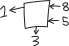{ width=25% .right-align }
Then, in the next step, we have three numbers to add together: the carried $1$, and then the $4$ and the $0$. The magic addition machine tells us their sum is $5$, so we put that down, and "carry" a zero:
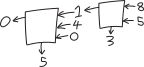{ width=40% .right-align}
Then we add the next three numbers together. Zero plus six plus nine is $15$, so we put down a $5$ and carry a $1$:
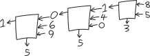{ width=55% .right-align}
Et cetera:
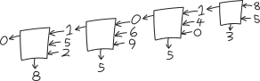{ width=70% .right-align}
Et cetera:
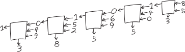{ width=85% .right-align}
And finally:
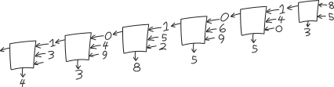{ width=100% .right-align}
So if we have this magic addition machine that can take in three single-digit numbers, and spit out two single-digit numbers (or, equivalently, one two-digit number), then we can copy and paste that machine over and over again (... like I did in Adobe Illustrator to make that image) to add together numbers as big as we want! How exactly that magic addition machine works is a different story. Perhaps it memorizes addition tables, or something like that? Regardless, *if* we can add together small numbers, we can use that to add together arbitrarily big numbers.

## Addition, revisited, *but in binary*

If we're trying to add numbers in binary, the deal is exactly the same! It's the same algorithm---the only thing that's different is how the digits work. 

For example, let's add $345$ and $82$. I guess we have to convert them to binary first. We have:
\begin{align*}
345 & = 256 + 64 + 16 + 8 + 1 \\
&= 2^8 + 2^6 + 2^4 + 2^3 + 2^0 \\
&= 1\!\cdot\! 2^8 + 0\!\cdot\! 2^7 + 1\!\cdot\! 2^6 + 0\!\cdot\! 2^5 + 1 \!\cdot\! 2^4 + 0\!\cdot\! 2^3 + 0\!\cdot\! 2^2 + 0\!\cdot\! 2^1 + 1\!\cdot\! 2^0 \\
&= \mathtt{1}\mathtt{0}\mathtt{1}\mathtt{0}\mathtt{1}\mathtt{1}\mathtt{0}\mathtt{0}\mathtt{1}
\end{align*}
And:
\begin{align*}
43 & = 32 + 8 + 2 + 1 \\
&=  2^5 + 2^3 + 2^1 + 2^0 \\
&= 1\!\cdot\! 2^5 + 0 \!\cdot\! 2^4 + 1\!\cdot\! 2^3 + 0\!\cdot\! 2^2 + 1\!\cdot\! 2^1 + 1\!\cdot\! 2^0 \\
&= \mathtt{1}\mathtt{0}\mathtt{1}\mathtt{0}\mathtt{1}\mathtt{1}
\end{align*}
So to add then, we'll have:
$$\begin{array}{r}
\mathtt{1}\mathtt{0}\mathtt{1}\mathtt{0}\mathtt{1}\mathtt{1}\mathtt{0}\mathtt{0}\mathtt{1}\\
+ \mathtt{1}\mathtt{0}\mathtt{1}\mathtt{0}\mathtt{1}\mathtt{1} \\
\hline \\
\end{array}$$
OK, let's do this! From the right, the first column, we have $\mathtt{1}+\mathtt{1}=\mathtt{10}$, so we'll put a $\mathtt{0}$ down and carry the $\mathtt{1}$:
$$\begin{array}{r}
{\color{gray}\mathtt{1}}\phantom{\mathtt{1}} \\
\mathtt{1}\mathtt{0}\mathtt{1}\mathtt{0}\mathtt{1}\mathtt{1}\mathtt{0}\mathtt{0}\mathtt{1}\\
+ \mathtt{1}\mathtt{0}\mathtt{1}\mathtt{0}\mathtt{1}\mathtt{1} \\
\hline
\mathtt{0}
\end{array}$$
Then next, we have $\mathtt{1}+\mathtt{0}+\mathtt{1}$, which is $\mathtt{10}$, so we'll put a $\mathtt{0}$ down and carry the $\mathtt{1}$:
$$\begin{array}{r}
{\color{gray}\mathtt{1}} {\color{gray}\mathtt{1}} \phantom{\mathtt{1}}\\
\mathtt{1}\mathtt{0}\mathtt{1}\mathtt{0}\mathtt{1}\mathtt{1}\mathtt{0}\mathtt{0}\mathtt{1}\\
+ \mathtt{1}\mathtt{0}\mathtt{1}\mathtt{0}\mathtt{1}\mathtt{1} \\
\hline
\mathtt{0}\mathtt{0}
\end{array}$$
Then $\mathtt{1}+\mathtt{0}+\mathtt{0}$ is $\mathtt{1}$, so we'll put that down, and ``carry'' a zero:
$$\begin{array}{r}
{\color{gray}\mathtt{0}} {\color{gray}\mathtt{1}} {\color{gray}\mathtt{1}} \phantom{\mathtt{1}}\\
\mathtt{1}\mathtt{0}\mathtt{1}\mathtt{0}\mathtt{1}\mathtt{1}\mathtt{0}\mathtt{0}\mathtt{1}\\
+ \mathtt{1}\mathtt{0}\mathtt{1}\mathtt{0}\mathtt{1}\mathtt{1} \\
\hline
\mathtt{1}\mathtt{0}\mathtt{0}
\end{array}$$
Then we have $\mathtt{0}+\mathtt{1}+\mathtt{1}$, which is $\mathtt{10}$, so we'll put down a $\mathtt{0}$ and carry that $\mathtt{1}$:
$$\begin{array}{r}
{\color{gray}\mathtt{1}} {\color{gray}\mathtt{0}} {\color{gray}\mathtt{1}} {\color{gray}\mathtt{1}} \phantom{\mathtt{1}}\\
\mathtt{1}\mathtt{0}\mathtt{1}\mathtt{0}\mathtt{1}\mathtt{1}\mathtt{0}\mathtt{0}\mathtt{1}\\
+ \mathtt{1}\mathtt{0}\mathtt{1}\mathtt{0}\mathtt{1}\mathtt{1} \\
\hline
\mathtt{0}\mathtt{1}\mathtt{0}\mathtt{0}
\end{array}$$
Etc., I'm getting bored typing all this \LaTeX\, out by hand, so I'm just going to zoom forwards to the result:
$$\begin{array}{r}
{\color{gray}\mathtt{1}}{\color{gray}\mathtt{1}}{\color{gray}\mathtt{1}}{\color{gray}\mathtt{1}} {\color{gray}\mathtt{0}} {\color{gray}\mathtt{1}} {\color{gray}\mathtt{1}} \phantom{\mathtt{1}}\\
\mathtt{1}\mathtt{0}\mathtt{1}\mathtt{0}\mathtt{1}\mathtt{1}\mathtt{0}\mathtt{0}\mathtt{1}\\
+ \mathtt{1}\mathtt{0}\mathtt{1}\mathtt{0}\mathtt{1}\mathtt{1} \\
\hline
\mathtt{1}\mathtt{1}\mathtt{0}\mathtt{0}\mathtt{0}\mathtt{0}\mathtt{1}\mathtt{0}\mathtt{0}
\end{array}$$
Translating this binary number back into decimal, we get:
\begin{align*}
\mathtt{1}\mathtt{1}\mathtt{0}\mathtt{0}\mathtt{0}\mathtt{0}\mathtt{1}\mathtt{0}\mathtt{0} &= 1\!\cdot\! 2^8 + 1\!\cdot\! 2^7 + 0\!\cdot\! 2^6 + 0\!\cdot\! 2^5 + 0 \!\cdot\! 2^4 + 0\!\cdot\! 2^3 + 1\!\cdot\! 2^2 + 0\!\cdot\! 2^1 + 0\!\cdot\! 2^0 \\
&= 2^8 + 2^7 + 4 \\
&= 256 + 128 + 4 \\
&= 388
\end{align*}
Yay! Here's that process, visualized:
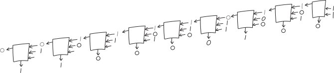{ width=100% }

Procedurally, this works the same way as for adding numbers in decimal. The magic addition machine at the center is inputting and outputting numbers in binary, not decimal, but once we have that magic addition machine (maybe a binary magic addition machine, maybe a decimal magic addition machine), we can add together any two numbers. 

So what is this magic black box at the center of this recursive algorithm?!?!? It's some magic function (or really, *two* magic functions, one for each output), that:

* takes as input:
    * one addend ($\mathtt{1}$ or $\mathtt{0}$)
    * a second addend  (also $\mathtt{1}$ or $\mathtt{0}$)
    * a third carry/overflow digit (still just $\mathtt{1}$ or $\mathtt{0}$)
* beget as output:
    * the first digit (to put down for the result for that place)
    * the second/carry/overflow digit (to feed into the next step)

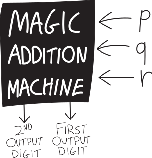{ width=50% }

... which brings us to the quiz problem. 

##  Adding numbers using logic!

Here's one of the problems we had on the quiz:
<blockquote>
**6.** Addition! It's fun! Suppose you want to *use logic* to *add numbers*. Can you do it???

In particular, let's be unambitious, and say you just want to add two numbers, each of which is either $0$ or $1$, and so can be represented each with one truth variable. Zero plus zero is zero, zero plus one is one; same with one plus zero; one plus one is two. So can you come up with a way of combining these two numbers-disguised-as-truth-variables that corresponds to addition?? Note that two is not either zero or one, so if you want to use logical functions to add together these two *one-bit* numbers---"one bit" meaning that they can be represented with a single logical variable---you'll need two bits for the output---i.e., you need two separate logical functions for the output, one for the $2^0$ digit of the output, and one that begets the $2^1$ digit of the output. 
</blockquote>
This is what we talked about briefly in class on Monday 2/2, and what (in a trickier version) was on the problem set for Monday 2/9! 

The key is that *we can think of truth variables as representing numbers*. Usually we think of them as representing---well---truth-values---but we can equivalently think of them as representing either the number zero, or the number one. That means we can secretly encode numbers in truth variables! We just have to represent them in binary. Say we want to add together two numbers, each of which is either zero or one:
\begin{align*}
1+1&=2 \\
1+0 &= 1 \\
0+1 &= 1 \\
0 + 0 &= 0
\end{align*}
In binary, this looks like:
\begin{align*}
\mathtt{1}+\mathtt{1} &=\mathtt{1}\mathtt{0} \\
\mathtt{1}+\mathtt{0} &=\mathtt{0}\mathtt{1} \\
\mathtt{0}+\mathtt{1} &=\mathtt{0}\mathtt{1} \\
\mathtt{0}+\mathtt{0} &=\mathtt{0}\mathtt{0}
\end{align*}
So we can think of this as being already a truth table: we have these two inputs (the two things added together) on the left side of the equation, and then two outputs (the two binary digits/two truth values) on the right side. As a truth table, this might be:
<table class="truth-table">
  <thead>
    <tr>
      <th></th>
      <th>$P$</th>
      <th>$Q$</th>
      <th  style='font-size:85%;'>second output digit (i.e., $2^1$ coefficient)</th>
      <th  style='font-size:85%;'>first output digit (i.e., $2^0$ coefficient)</th>
    </tr>
  </thead>
  <tbody>
    <tr class="shaded">
      <td>"$1+1=2$," i.e. $\mathtt{1}+\mathtt{1}=\mathtt{10}$</td>
      <td></td>
      <td></td>
      <td></td>
      <td></td>
    </tr>
    <tr>
      <td>"$1+0=1$," i.e. $\mathtt{1}+\mathtt{0}=\mathtt{01}$</td>
      <td></td>
      <td></td>
      <td></td>
      <td></td>
    </tr>
    <tr class="shaded">
      <td>"$0+1=1$," i.e. $\mathtt{0}+\mathtt{1}=\mathtt{01}$</td>
      <td></td>
      <td></td>
      <td></td>
      <td></td>
    </tr>
    <tr>
      <td>"$0+0=0$," i.e. $\mathtt{0}+\mathtt{0}=\mathtt{00}$</td>
      <td></td>
      <td></td>
      <td></td>
      <td></td>
    </tr>
  </tbody>
</table>
Note that I'm using "first" and "second" in the "reading from right to left" sense. The second output digit also often gets called the **carry**, like how when you're doing addition by hand and things overflow you carry it over to the next column. 

We can fill this in, since we know how to add $0$ and $1$, so this is:
<table class="truth-table">
  <thead>
    <tr>
      <th></th>
      <th>$P$</th>
      <th>$Q$</th>
      <th style='font-size:85%;'>second output digit (i.e., $2^1$ coefficient)</th>
      <th style='font-size:85%;'>first output digit (i.e., $2^0$ coefficient)</th>
    </tr>
  </thead>
  <tbody>
    <tr class="shaded">
      <td>"$1+1=2$," i.e. $\mathtt{1}+\mathtt{1}=\mathtt{10}$</td>
      <td>1</td>
      <td>1</td>
      <td>1</td>
      <td>0</td>
    </tr>
    <tr>
      <td>"$1+0=1$," i.e. $\mathtt{1}+\mathtt{0}=\mathtt{01}$</td>
      <td>1</td>
      <td>0</td>
      <td>0</td>
      <td>1</td>
    </tr>
    <tr class="shaded">
      <td>"$0+1=1$," i.e. $\mathtt{0}+\mathtt{1}=\mathtt{01}$</td>
      <td>0</td>
      <td>1</td>
      <td>0</td>
      <td>1</td>
    </tr>
    <tr>
      <td>"$0+0=0$," i.e. $\mathtt{0}+\mathtt{0}=\mathtt{00}$</td>
      <td>0</td>
      <td>0</td>
      <td>0</td>
      <td>0</td>
    </tr>
  </tbody>
</table>
But this is just describing our existing knowledge of how to add numbers together in binary. The question is, what ARE those two output functions????
\begin{align*}
\substack{\text{second output digit}\\\text{i.e., $2^1$ coefficient}} \quad&= \quad ???\\ \\
\substack{\text{first output digit}\\\text{i.e., $2^0$ coefficient}} \quad&= \quad ???
\end{align*}
Meaning, we know what the ANSWERS are, but what are the logical functions that get us there? How do we take $P$ and $Q$, combine them with $\land$, $\sim$, $\lor$, $\implies$, or whatever, and get those answers? 

Let's look closely. I'll copy down just $P$, $Q$, and the result we want for the $2^0$ digit:

<table class="truth-table">
  <thead>
    <tr>
      <th>$P$</th>
      <th>$Q$</th>
      <th style='font-size:85%;'>first output digit (i.e., $2^0$ coefficient)</th>
    </tr>
  </thead>
  <tbody>
    <tr class="shaded">
      <td>1</td>
      <td>1</td>
      <td>0</td>
    </tr>
    <tr>
      <td>1</td>
      <td>0</td>
      <td>1</td>
    </tr>
    <tr class="shaded">
      <td>0</td>
      <td>1</td>
      <td>1</td>
    </tr>
    <tr>
      <td>0</td>
      <td>0</td>
      <td>0</td>
    </tr>
  </tbody>
</table>

Look! It looks like $XOR$, sometimes symbolized $\oplus$!!! It's true only when $P$ and $Q$ have different truth values---when exactly one of them is true---not both, and not neither!!! So that's our output for the $2^0$ digit:
\begin{align*}
\substack{\text{first output digit}\\\text{i.e., $2^0$ coefficient}} \quad&= \quad \oplus
\end{align*}
Great. What about the $2^1$ digit? The truth table, if we strip all the extraneous stuff, is:
<table class="truth-table">
  <thead>
    <tr>
      <th>$P$</th>
      <th>$Q$</th>
      <th style='font-size:85%;'>second output digit (i.e., $2^1$ coefficient) (aka "carry digit")</th>
    </tr>
  </thead>
  <tbody>
    <tr class="shaded">
      <td>1</td>
      <td>1</td>
      <td>1</td>
    </tr>
    <tr>
      <td>1</td>
      <td>0</td>
      <td>0</td>
    </tr>
    <tr class="shaded">
      <td>0</td>
      <td>1</td>
      <td>0</td>
    </tr>
    <tr>
      <td>0</td>
      <td>0</td>
      <td>0</td>
    </tr>
  </tbody>
</table>
Look at that! It's $AND$! $P\land Q$!

Let's summarize: 
<table class="truth-table">
  <thead>
    <tr>
      <th></th>
      <th>$P$</th>
      <th>$Q$</th>
      <th style='font-size:85%;'>second output digit (i.e., $2^1$ coefficient) (aka "carry digit") $P \land Q$</th>
      <th style='font-size:85%;'>first output digit (i.e., $2^0$ coefficient) $P \oplus Q$</th>
    </tr>
  </thead>
  <tbody>
    <tr class="shaded">
      <td>"$1+1=2$," i.e. $\mathtt{1}+\mathtt{1}=\mathtt{10}$</td>
      <td>1</td>
      <td>1</td>
      <td>1</td>
      <td>0</td>
    </tr>
    <tr>
      <td>"$1+0=1$," i.e. $\mathtt{1}+\mathtt{0}=\mathtt{01}$</td>
      <td>1</td>
      <td>0</td>
      <td>0</td>
      <td>1</td>
    </tr>
    <tr class="shaded">
      <td>"$0+1=1$," i.e. $\mathtt{0}+\mathtt{1}=\mathtt{01}$</td>
      <td>0</td>
      <td>1</td>
      <td>0</td>
      <td>1</td>
    </tr>
    <tr>
      <td>"$0+0=0$," i.e. $\mathtt{0}+\mathtt{0}=\mathtt{00}$</td>
      <td>0</td>
      <td>0</td>
      <td>0</td>
      <td>0</td>
    </tr>
  </tbody>
</table>
So we've figured out how to build a machine that takes in two numbers from $0$ to $1$ and adds them together, using only our logical connectives/truth functions! We just need one logical variable for the output, and then these two different functions, $\land$ and $\lor$, give us the two output truth values!

It's not exactly what we need for our add-any-number-however-big algorithm. For that, we need some magic addition machine that takes *three* inputs. This one only takes two. I guess it's just a *partial* magic addition machine:

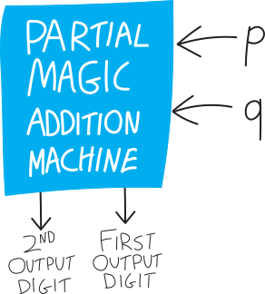{ width=50% }

(In class I used the name **half-adder** for it, which is indeed the name most people use. But I think that name gives away too much about how to make a **full adder**, i.e. the full magic addition machine that takes three inputs. So I'm going to call it a **partial magic addition machine** instead.)

If we write it as a circuit diagram, exploding the innards, we have something like:

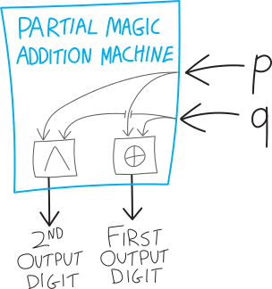{ width=50% }

## So how to make this magic addition machine?

But how do we make the *full* magic addition machine?? Or, as I put it on PS \#8:
<blockquote>
Build a full adder! Meaning, can you build a function (or rather, a set of two functions, as we discussed) that takes in three binary digits as input, adds them together, and returns the result (which requires two outputs, one for each digit/place value)?

(Of course you can look up how to do it, just like how you can look up everything/anything for this class, but... don't! That spoils the fun!</blockquote>

Here's what we want:

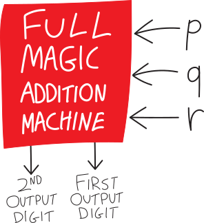{ width=50% }

How, exactly, do we build this magic addition machine? We know what we want it to output. We want to add together three single-digit numbers, and output one two-digit number, so we want:
<table class="truth-table">
  <thead>
    <tr>
      <th></th>
      <th>$P$</th>
      <th>$Q$</th>
      <th>$R$</th>
      <th style='font-size:85%;'>second output digit (i.e., $2^1$ coefficient) (aka "carry digit")</th>
      <th style='font-size:85%;'>first output digit (i.e., $2^0$ coefficient)</th>
    </tr>
  </thead>
  <tbody>
    <tr class="shaded">
      <td>"$1+1+1=3$," i.e. $\mathtt{1}+\mathtt{1}+\mathtt{1}=\mathtt{11}$</td>
      <td>1</td>
      <td>1</td>
      <td>1</td>
      <td>1</td>
      <td>1</td>
    </tr>
    <tr>
      <td>"$1+1+0=2$," i.e. $\mathtt{1}+\mathtt{1}+\mathtt{0}=\mathtt{10}$</td>
      <td>1</td>
      <td>1</td>
      <td>0</td>
      <td>1</td>
      <td>0</td>
    </tr>
    <tr class="shaded">
      <td>"$1+0+1=2$," i.e. $\mathtt{1}+\mathtt{0}+\mathtt{1}=\mathtt{10}$</td>
      <td>1</td>
      <td>0</td>
      <td>1</td>
      <td>1</td>
      <td>0</td>
    </tr>
    <tr>
      <td>"$1+0+0=1$," i.e. $\mathtt{1}+\mathtt{0}+\mathtt{0}=\mathtt{01}$</td>
      <td>1</td>
      <td>0</td>
      <td>0</td>
      <td>0</td>
      <td>1</td>
    </tr>
    <tr class="shaded">
      <td>"$0+1+1=2$," i.e. $\mathtt{0}+\mathtt{1}+\mathtt{1}=\mathtt{10}$</td>
      <td>0</td>
      <td>1</td>
      <td>1</td>
      <td>1</td>
      <td>0</td>
    </tr>
    <tr>
      <td>"$0+1+0=1$," i.e. $\mathtt{0}+\mathtt{1}+\mathtt{0}=\mathtt{01}$</td>
      <td>0</td>
      <td>1</td>
      <td>0</td>
      <td>0</td>
      <td>1</td>
    </tr>
    <tr class="shaded">
      <td>"$0+0+1=1$," i.e. $\mathtt{0}+\mathtt{0}+\mathtt{1}=\mathtt{01}$</td>
      <td>0</td>
      <td>0</td>
      <td>1</td>
      <td>0</td>
      <td>1</td>
    </tr>
    <tr>
      <td>"$0+0+0=0$," i.e. $\mathtt{0}+\mathtt{0}+\mathtt{0}=\mathtt{00}$</td>
      <td>0</td>
      <td>0</td>
      <td>0</td>
      <td>0</td>
      <td>0</td>
    </tr>
  </tbody>
</table>
But how do we actually make this? Staring at the truth table trying to figure out what logical functions will work doesn't seem like a great plan. It seems... hard. 

What if we try using the *smaller*, partial magic addition machines we already have? Those ones take in only two one-digit numbers. But that's a start. What if we use two of the partial magic addition machines? We could add $p$ and $q$ using one of the partial magic addition machines, then take the result, and use a second partial magic addition machine to add it to $r$. Addition, after all, is fundamentally *binary*. There's no such thing as adding three numbers together; there's only adding two numbers together:
$$\underbrace{p+q+r}_{\mathclap{\text{this doesn't actually exist!}}} \quad=\quad \underbrace{(p+q)+r}_{\mathclap{\text{this does}}}$$
Or in syntax tree form:
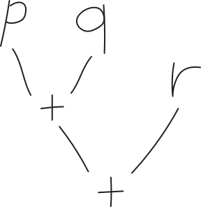{ width=25% }
Put differently, perhaps we should think of this as two smaller additions:
$$\text{the first addition: }\quad p + q$$
$$\text{the second addition: }\quad \left(\substack{\text{whatever p}\\\text{plus q was}}\right) + r$$
The tricky thing is how to deal with the carry. The ~~half-adder~~ partial magic addition machine tells us how to add two one-bit/one-digit numbers together, but the result is two bits/two digits. The naiive way to string together two half-adders is:
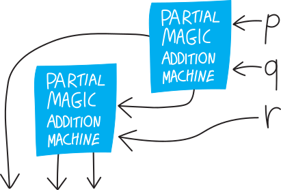{ width=50% }
But this can't be what we want. It gives us THREE outputs. It's not clear how we deal with the fact that we have a carry from both the half-adders... how do we deal with that when we add $r$?

Let's imagine that we start by adding $p$ and $q$, using our partial magic addition machine, and that gives us the number $d_1d_0$ as output. Here I mean that $d_1$ and $d_0$ are the *digits* of the output number; I don't mean that we're multiplying together $d_1$ and $d_0$. So $d_0$ is the $2^0$ digit and $d_1$ is the carry/$2^1$ digit. (If you're reading this closely, note that I changed the indexing---in class I called this $d_2d_1$. But this way the indexing matches the power of $2$!)

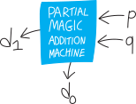{ width=50% }

Note that $d_1d_0$ is at most $2$, i.e. $\mathtt{10}$:
$$d_1d_0 \text{ can be } \left\{ \begin{matrix}\mathtt{10},\\\mathtt{01},\\ \text{or } \mathtt{00} \end{matrix} \right\}$$
Put differently, $d_1$ and $d_0$ can't both be $1$. They can both be $\mathtt{0}$, or one can be $\mathtt{1}$, but we can't have both of them be one:
$$d_1d_0 \text{ CAN'T be }\mathtt{11}$$
(This is vaguely relevant later.)

So let's imagine we're somehow trying to add the number $d_1d_0$ to $r$. ($r$, meanwhile, is one-bit/one digit). Ignoring how this works in terms of logic gates, and thinking just back to elementary-school multiplication, we have:
$$\begin{array}{r}
 d_1d_0 \\
+ r\\
\hline \\
\end{array}$$
I'll list all of the six concrete possibilities for what this step could look like. (This might or might not be helpful; ignore if it's too much information.) 
$$\begin{array}{r}
\mathtt{10} \\
+ \mathtt{1}\\
\hline\\
\end{array}\hspace{1cm}
\begin{array}{r}
\mathtt{01} \\
+ \mathtt{1}\\
\hline\\
\end{array}\hspace{1cm}
\begin{array}{r}
\mathtt{00} \\
+ \mathtt{1}\\
\hline\\
\end{array}\hspace{1cm}
\begin{array}{r}
\mathtt{10} \\
+ \mathtt{0}\\
\hline\\
\end{array}\hspace{1cm}
\begin{array}{r}
\mathtt{01} \\
+ \mathtt{0}\\
\hline\\
\end{array}\hspace{1cm}
\begin{array}{r}
\mathtt{00} \\
+ \mathtt{0}\\
\hline\\
\end{array}$$
Let's try to do this addition! We had:
$$\begin{array}{r}
 d_1d_0 \\
+ r\\
\hline \\
\end{array}$$
The first step is to add $d_0$ and $r$. Those are just two bits/two digits, so it just takes a single partial magic addition machine. So we have something like:
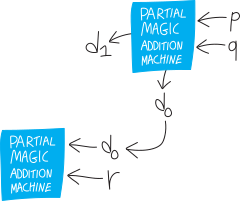{ width=50% }
So we add these, and we get either $\mathtt{00}$, $\mathtt{01}$, or $\mathtt{10}$. (Like in the previous step, we can't get $\mathtt{11}$, because our inputs are at most both $\mathtt{1}$.) Let's call the first digit of the output $s_0$. We might or might not need to carry a $\mathtt{1}$. Let's say we do. Actually, let's be more general, and call the carry/overflow just $c$ (which could be $0$). So then our diagram looks like:
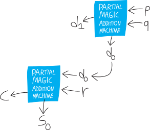{ width=50% }
Here's what we've done elementary-school-addition-wise:
$$\begin{array}{r}
 {\color{gray} c} \phantom{{}_2d_1} \\
 d_1d_0 \\
+ \quad\quad r\\
\hline
s_0
\end{array}$$
If you want to see all six possibilities so far listed out, we have:
$$\begin{array}{r}
{\color{gray} \mathtt{0}} \phantom{\mathtt{0}} \\
\mathtt{10} \\
+ \mathtt{1}\\
\hline
\mathtt{1}
\end{array}\hspace{1cm}
\begin{array}{r}
{\color{gray} \mathtt{1}} \phantom{\mathtt{1}} \\
\mathtt{01} \\
+ \mathtt{1}\\
\hline
\mathtt{0}
\end{array}\hspace{1cm}
\begin{array}{r}
{\color{gray} \mathtt{0}} \phantom{\mathtt{0}} \\
\mathtt{00} \\
+ \mathtt{1}\\
\hline
\mathtt{1}
\end{array}\hspace{1cm}
\begin{array}{r}
{\color{gray} \mathtt{0}} \phantom{\mathtt{0}} \\
\mathtt{10} \\
+ \mathtt{0}\\
\hline
\mathtt{0}
\end{array}\hspace{1cm}
\begin{array}{r}
{\color{gray} \mathtt{0}} \phantom{\mathtt{1}} \\
\mathtt{01} \\
+ \mathtt{0}\\
\hline
\mathtt{1}
\end{array}\hspace{1cm}
\begin{array}{r}
{\color{gray} \mathtt{0}} \phantom{\mathtt{0}} \\
\mathtt{00} \\
+ \mathtt{0}\\
\hline
\mathtt{0}
\end{array}$$
Then, for the next step, we need to add $c$ and $d_1$:
$$\begin{array}{r}
 {\color{gray} c} \phantom{{}_2d_1} \\
 d_1d_0 \\
+ \quad\quad r\\
\hline
s_0
\end{array}$$
But this, too, only requires a partial magic addition machine! There are only two digits we need to add! $r$ is just one bit, so we don't have a third digit to add! We can do this! If we're deeper in our multiplication algorithm, we might need to add *three* things together, but in the first step, we only need to add two things together. So we can use our existing partial magic addition machine technology! Let's pop in a THIRD partial magic addition machine!!!
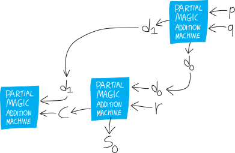{ width=75% }
But here's the fun insight: the carry from this third partial magic addition machine will always be $0$! So we can just ignore it! And the output of this third partial magic addition machine, along, gives us the final/second digit of the result!!! 

Why must the carry be $0$? 

* If we're carrying something, that means the answer from the previous, $d_0+r$ step, was $\mathtt{10}$
* i.e. $d_0$ and $r$ were both $\mathtt{1}$
* but if $d_0$ was $\mathtt{1}$, then $d_1$ has to be $\mathtt{0}$. ($d_1d_0$ can't be equal to $\mathtt{11}$; the biggest it can be is $\mathtt{11}$.)
* so if $d_1$ is $\mathtt{0}$, then regardless of what $c$ is, the biggest $d_1+c$ can be is $\mathtt{01}$. 

(HW problem: prove this symbolically!)

So then our full computation, in its elementary-school-arithmetic form, looks like:
$$\begin{array}{r}
 {\color{gray} c \phantom{{}_2d_1}} \\
 d_1d_0 \\
+ \quad\quad r\\
\hline
s_1 s_0
\end{array}$$
Actually, I'll "carry" a zero just to emphasize that no matter what, we always carry a zero:
$$\begin{array}{r}
 {\color{gray} \mathtt{0} c \phantom{{}_2d_1}} \\
 d_1d_0 \\
+ \quad\quad r\\
\hline
s_1 s_0
\end{array}$$
Here are its six concrete instantiations:
$$\begin{array}{r}
{\color{gray} \mathtt{0}} \phantom{\mathtt{0}} \\
\mathtt{10} \\
+ \mathtt{1}\\
\hline
\mathtt{11}
\end{array}\hspace{1cm}
\begin{array}{r}
{\color{gray} \mathtt{1}} \phantom{\mathtt{1}} \\
\mathtt{01} \\
+ \mathtt{1}\\
\hline
\mathtt{10}
\end{array}\hspace{1cm}
\begin{array}{r}
{\color{gray} \mathtt{0}} \phantom{\mathtt{0}} \\
\mathtt{00} \\
+ \mathtt{1}\\
\hline
\mathtt{01}
\end{array}\hspace{1cm}
\begin{array}{r}
{\color{gray} \mathtt{0}} \phantom{\mathtt{0}} \\
\mathtt{10} \\
+ \mathtt{0}\\
\hline
\mathtt{10}
\end{array}\hspace{1cm}
\begin{array}{r}
{\color{gray} \mathtt{0}} \phantom{\mathtt{1}} \\
\mathtt{01} \\
+ \mathtt{0}\\
\hline
\mathtt{01}
\end{array}\hspace{1cm}
\begin{array}{r}
{\color{gray} \mathtt{0}} \phantom{\mathtt{0}} \\
\mathtt{00} \\
+ \mathtt{0}\\
\hline
\mathtt{00}
\end{array}$$
And our circuit diagram looks like:
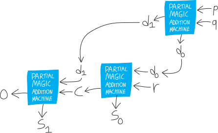{ width=75% }
Actually, we can strip this down further. A partial magic addition machine is really just two logical functions, $\oplus$ for the first bit/digit and $\land$ for the second:
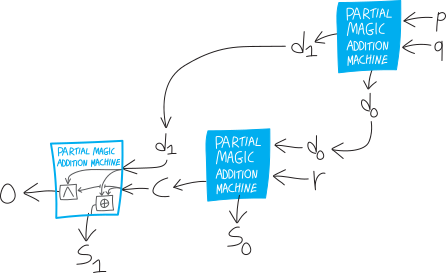{ width=100% }
But we don't care about the second digit/bit/carry, so we can just delete that, and just think of this as a final $\oplus$:
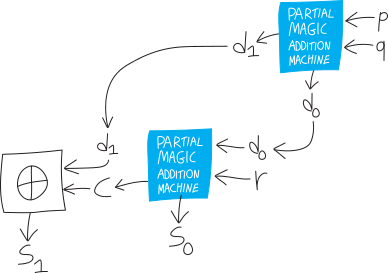{ width=100% }
So that's our full magic addition machine!!!!
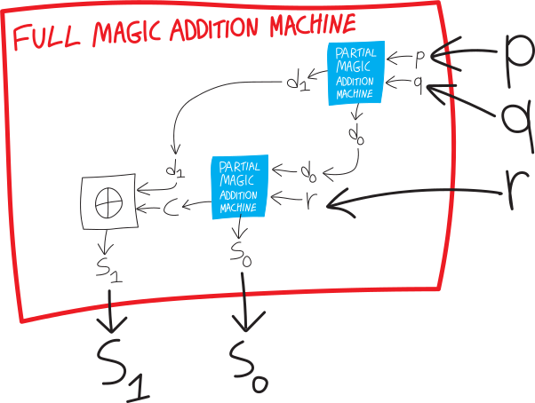{ width=100% }

<!-- 
## an excuse to verify

From PS\#9:

<blockquote>
In class I showed how I built the full adder by wiring together three half-adders, and then we simplified the last half-adder to just an XOR gate (XOR'ing the carries from the two half-adders). Brendan said that he had just used an OR gate for that purpose; Luca pointed out that it'll be equivalent, because even though XOR and OR are different functions, they're only different when their inputs are both true/both $1$, and that will never happen (the carries will never both be $1$). Can you prove this symbolically??? I don't mean "argue linguistically why the carries can never both be $1$" (as we did in class, and as I do in the notes); I mean, using the formulas for these two carries, prove, symbolically, that they can never both be $1$!!! You could do a Quine-style analysis, you could do a truth table... just do it symbolically, with no reference to the external meaning of what we're trying to do in building this adder! Actually I think this is a good moment to try to implement some of Quine's techniques...</blockquote>

<!-- 
$$d_1 = p\land q$$
$$c = r \land d_0 = r\land (p\oplus q)$$

these can't be both $1$

$\sim d_1 \land \sim c$ must be a tautology (or, in quine's word, valid); it must always be true

(equivelantly, $\sim d_1 \land \sim c$ must always be false, a contradiction

$$\sim d_1 \land \sim c$$

$$\sim(p\land q) \land \sim (r\land (p\oplus q) )$$

$$(\sim p\lor \sim q)  \land (\sim r \lor \sim(p\oplus q) )$$ 
For ease of manipulation, I'm going to expand $(p\oplus q)$ into $(p\lor q)\and \sim(p\land q)$. 
$$(\sim p\lor \sim q)  \land (\sim r \lor (p\lor q)\and \sim(p\land q) )$$ 

$$(\sim p\lor \sim q)  \land (\sim r \lor (p\lor q)\and  \sim r  \lor \sim(p\land q) )$$ 

## let's *really* add

Also on PS\#9: 

<blockquote>
As the main followup to building a full adder: suppose you want to add together the numbers $a_3a_2 a_1 a_0$ (where each of the $a_i$ is one of the digits; we're concatenating them not multiplying them) and  $b_3 b_2 b_1 b_0$. Can you do it using a bunch of full adders?!?!
$$\begin{array}{r}
a_3a_2a_1a_0 \\
+ \quad b_3b_2b_1b_0 \\
\hline\\
\end{array}$$
(Note I start the indexing/subscripts at $0$, to match the corresponding powers of $2$.) A few specific sub-problems. **First**, can you come up with formulas for each of the resulting digits? As we sort of saw, they get more and more complicated the further out you get. In other words, here's our addition
$$\begin{array}{r}
a_3a_2 a_1 a_0 \\
+ \quad b_3 b_2 b_1 b_0 \\
\hline
s_4s_3s_2s_1s_0
\end{array}$$
Can you come up with formulas for $s_0$, $s_1$, $s_2$, and so forth? Here, I'll even be generous and give you the first answer: $s_0 = a_0 \oplus b_0$! You're welcome.

**Second**, can you actually *draw out* this network of adders? I am envisioning something like what Brendan (bless him) drew on the board at the end of class, but more clear. Brendan's diagram was beautiful but its disadvantage was that it didn't make it clear (at least to me) what the original numbers he was adding were. But I think this fixes that! What I want you to do is draw out the *full* network, down to just the AND and XOR gates ("gates" is the name people in electronics usually give to logical functions), but also showing the half-adders and the full-adders as well. (For notational consistency, and so it's easier for us to cross-check, perhaps outline all the half-adders in blue, and the full adders in red?) You could start by writing out a big network of full adders and then expanding; you could try bottom-up and start with just AND and XOR gates (which it seems is what Brendan did?)

(If any of you in the analog electronics class have the components to build simple logic gates, feel free to do so as well!)
</blockquote> 

-->