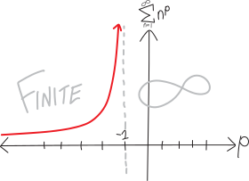

Lots of the sums we've been talking about have been of the form $\displaystyle \sum_{n=1}^{n=\infty}n^p$. Sometimes they converge (they're finite), and sometimes they diverge (they're infinite). Sometimes it's been easy to figure this out; other times, it's been harder. We can summarize what we've learned so far:

<table style='border-collapse: separate; border:0px;'>
<tr> <td> </td> <td> $$\sum_{n=1}^{\infty} {n^3} =$$ </td> <td> $$1 + 8 + 27 + 64 + \dots$$</td> <td> $$= \infty$$ </td> </tr>
<tr> <td> </td> <td> $$\sum_{n=1}^{\infty} {n^2} =$$ </td> <td> $$1 + 4 + 9 + 16 + \dots$$</td> <td> $$= \infty$$ </td> </tr>
<tr> <td> </td> <td> $$\sum_{n=1}^{\infty} {n^1} =$$ </td> <td> $$1 + 2 + 3 + 4 + \dots$$</td> <td> $$= \infty$$ </td> </tr>
<tr> <td> </td> <td> $$\sum_{n=1}^{\infty} {n^0} =$$ </td> <td> $$1 + 1 + 1 + 1 + \dots$$</td> <td> $$= \infty$$ </td> </tr>
<tr> <td> $$\sum_{n=1}^{\infty} \frac{1}{\sqrt{n}} =$$ </td> <td> $$\sum_{n=1}^{\infty} {n^{-0.5}} =$$ </td> <td> $$1 + \frac{1}{\sqrt2} + \frac{1}{\sqrt3} + \frac{1}{\sqrt4} + \dots$$</td> <td> $$= \infty$$ </td> </tr>
<tr> <td> $$\sum_{n=1}^{\infty} \frac{1}{n} =$$</td> <td> $$\sum_{n=1}^{\infty} {n^{-1}} =$$ </td> <td> $$1 + \frac{1}{2} + \frac13 + \frac14 + \dots$$</td> <td> $$= \infty$$ </td> </tr>
<tr> <td>$$\sum_{n=1}^{\infty} \frac{1}{n^2} =$$ </td> <td> $$\sum_{n=1}^{\infty} {n^{-2}} =$$ </td> <td> $$1 + \frac{1}{4} + \frac{1}{9} + \frac{1}{16} + \dots$$</td> <td> $$= \text{finite!}$$ </td> </tr>
<tr> <td> $$\sum_{n=1}^{\infty} \frac{1}{n^3} =$$ </td> <td> $$\sum_{n=1}^{\infty} {n^{-3}} =$$ </td> <td> $$1 + \frac{1}{8} +\frac{1}{27} + \frac{1}{64} + \dots$$</td> <td> $$= \text{finite!}$$ </td> </tr>
<tr> <td> $$\sum_{n=1}^{\infty} \frac{1}{n^4} =$$ </td> <td> $$\sum_{n=1}^{\infty} {n^{-4}} =$$ </td> <td> $$1 + \frac{1}{16} +\frac{1}{81} + \frac{1}{256} + \dots$$</td> <td> $$= \text{finite!}$$ </td> </tr>
</table>

But all of this induces a question: when do series like this magically flip over from being infinite to being finite?!?! $\sum1/n$ is infinite, but $\sum 1/n^2$ is finite. WHAT'S HAPPENING IN BETWEEN?!?!?! 

For example, what about $\sum n^{-1.5} = \sum 1/n^{1.5}$? Does it converge, or diverge? Is it finite, or infinite???
$$\sum_{n=1}^{n=\infty} n^{-1.5} \quad=\quad \sum_{n=1}^{n=\infty} \frac{1}{n^{1.5}} \quad=\quad \sum_{n=1}^{n=\infty} \frac{1}{n\sqrt{n}} \quad=\quad  \text{??!?!??}$$

Put more formally, if we have $\sum n^p$, then:

* if $-1\le p$, then $\sum n^p$ will diverge and be infinite
* if $-2 < p <-1$, then... ????
* if $p \le -2$, then $\sum n^p$  will converge and be finite

Somewhere in between $p=-1$ and $p=-2$, this sum has to flip over from being finite to being infinite. But where??!?! When?!? When does it somehow---in a moment of metaphysical glory; in a flash of phosphorus; in a delta-function burst of electromagnetic energy---go from being finite to being infinite?

More generally:

<table style='border-collapse: separate; border:0px;'>
<tr>  <td> $$\vdots$$ </td> <td> $$\vdots$$</td> <td> $$\vdots$$ </td> </tr>
<tr> <td> $$\vdots$$ </td> <td> $$\vdots$$</td> <td> $$= \infty$$ </td> </tr>
<tr>  <td> $$\sum_{n=1}^{\infty} {n^0} =$$ </td> <td> $$1 + 1 + 1 + 1 + \dots$$</td> <td> $$= \infty$$ </td> </tr>
<tr>  <td> $$\sum_{n=1}^{\infty} {n^{-0.5}} =$$ </td> <td> $$1 + \frac{1}{\sqrt2} + \frac{1}{\sqrt3} + \frac{1}{\sqrt4} + \dots$$</td> <td> $$= \infty$$ </td> </tr>
<tr> <td> $$\sum_{n=1}^{\infty} {n^{-1}} =$$ </td> <td> $$1 + \frac{1}{2} + \frac13 + \frac14 + \dots$$</td> <td> $$= \infty$$ </td> </tr>
<tr>  <td> </td> <td> $$???$$ </td> <td> </td> </tr>
<tr>  <td colspan=3 style='text-align:center;'> WHAT'S HAPPENING IN HERE?!? </td> </tr>
<tr>  <td> </td> <td> $$???$$ </td> <td> </td> </tr>
<tr>  <td> $$\sum_{n=1}^{\infty} {n^{-2}} =$$ </td> <td> $$1 + \frac{1}{4} + \frac{1}{9} + \frac{1}{16} + \dots$$</td> <td> $$= \text{finite!}$$ </td> </tr>
<tr> <td> $$\sum_{n=1}^{\infty} {n^{-3}} =$$ </td> <td> $$1 + \frac{1}{8} +\frac{1}{27} + \frac{1}{64} + \dots$$</td> <td> $$= \text{finite!}$$ </td> </tr>
<tr>  <td> $$\vdots$$ </td> <td> $$\vdots$$</td> <td> $$= \text{finite!}$$ </td> </tr>
<tr>  <td> $$\vdots$$ </td> <td> $$\vdots$$</td> <td> $$\vdots$$ </td> </tr>
</table>

In Fall 2019, Block 4 wanted to have a betting pool on where it flips. "I bet it's something weird, like $-\pi/e$," several people in Block 7 said. We took an anonymous survey:

* $-\ln(e)$
* If it is less than $-1$, it converges
* $-\pi/e$
* $-e^{1/\pi}$
* $e^{i\pi}$
* $??????? -\pi/e ?????$
* $-1.\overline{000}00000000$
* anything over $-1$ is finite
* $-\ln{\pi}$
* $-1.9$

But mathematics is not a democracy!!! We don't get  to *decide* where $\sum n^p$ flips from being finite to infinite. We don't get to *vote*!!! You don't get to choose, and I don't get to choose, either---*mathematical reality is not an act of will*---yours, mine, or anyone else's---all of us have to submit to the external truth. "Free to Choose"? Not when it comes to mathematics.

If we knew calculus, all of this would have been much more straightforward. We could have done one very simple proof, using calculus techniques, and then figured out where $\sum n^p$ flips, and we could have avoided doing all of the algebraic proofs we've done, for $\sum 1/n$, for $\sum 1/n^2$, and also the one we're about to do. But we don't know calculus yet! Rats. So, instead, we'll have to do an algebraic proof.

Back in 2019, I couldn't figure out how to do this myself without calculus, so I simultaneously [posted about it on Math StackExchange](https://math.stackexchange.com/questions/3423618/how-to-prove-that-sum-frac1nk-converges-for-1k2-without-calculus), and also emailed the Nueva math department. Several people quickly replied to my post, and Kathy Paur to my email, so this proof comes from them! 

What I like about this proof, as I reflect on it years later, is how it pulls together a lot of disparate ideas about infinite series. We've thought of series like $\sum n^p$ and series like $\sum a^n$ as being very different. They behave in different ways; they require different tools for us to understand them; they have different energies. But the cool thing here is that we'll end up translating this not-a-geometric-series into a geometric series, and then using our geometric series knowledge to figure out what happens!

More specifically, here's what we're going to do. We're going to use our favorite strategy: comparison. (You shouldn't compare yourself, as a person, to other people, but you can feel free to compare sums to other sums!) We're going to compare $\sum n^p$ to another series. That other series will sometimes converge and sometimes diverge, and that'll tell us when $\sum n^p$ converges and diverges.

The series we're going to compare $\sum n^p$ to we're going to build in a way that's similar to how we proved that $\sum 1/n$ diverged. When we proved that $\sum 1/n$ diverged, we did that by showing that we could group terms into bunches that were always more than $1/2$, and thus we showed that $\sum 1/n$ is always greater than $\sum 1/2$. That's infinite, so then $\sum 1/n$ must be, too. 

The series we compare $\sum n^p$ is going to turn out to be a geometric series, so let's quickly remind ourselves of the geometric series formula:
$$ \sum_{n=0}^{n = \infty} a^n = \frac{1}{1-a} $$
But remember, there's an important caveat to this formula. Namely, *it only works when $a$ is less than $1$* (and greater than $-1$). If $a$ is bigger than $1$ (or rather, if the absolute value of $a$ is bigger than $1$), we get something that is explodingly-infinite. For example, if $a=5$:
$$ \sum_{n=0}^{n = \infty} 5^n = 1 + 5 + 5^2 + 5^3 + 5^4 + \cdots = \infty \neq \frac{1}{1-5} $$

So the truer version of our geometric series formula is:

$$\sum_{n=0}^{n=\infty} a^n = 
  \begin{cases}
                                   \infty  & \text{if $|a|>1$ } \\ \\
                                   \displaystyle\frac{1}{1-a}  & \text{if $-1<a<+1$} \\
  \end{cases}
$$

This is an important caveat. It's going to be decisive in our proof. 

Enough with the preambulation! Let's begin. Let's try to figure out what happens when we have the series $n^p$, and $p$ is some negative number:
$$ \sum_{n=1}^{n=\infty} n^p \quad\text{for }p<0$$ 
But actually, just to make this more clear, let's write this as a fraction. Let's set $q = -p$, so that:
$$ \sum_{n=1}^{n=\infty} n^p =  \sum_{n=1}^{n=\infty} \frac{1}{n^q}$$
Then we'll do our proof with the $\sum 1/n^q$ version. It'll just be a little easier to see it this way. Writing it as a fraction will remind us that we're interested in the case when it's a fraction. So, if we write out a bunch of terms, we get:
$$ \sum_{n=1}^{n=\infty} n^p = 1+\frac{1}{2^q}+\frac{1}{3^q}+\frac{1}{4^q}+\frac{1}{5^q}+\frac{1}{6^q}+\frac{1}{7^q}+\frac{1}{8^q}+\frac{1}{9^q}+\frac{1}{10^q}+\frac{1}{11^q}+\frac{1}{12^q}+\cdots$$
Anyway, let's take a look at the second and third terms. We have:
$$\frac{1}{2^q}+\frac{1}{3^q}$$
These must be less than:
$$\frac{1}{2^q}+\frac{1}{2^q}$$
$2^q < 3^q$, since $q$ is some positive number, so then $1/2^q > 1/3^q$. So we have:
$$ \sum_{n=1}^{n=\infty} \frac{1}{n^q} = 1+\underbrace{\frac{1}{2^q}+\frac{1}{3^q}}_{\substack{\wedge \\ \frac{1}{2^q}+\frac{1}{2^q}\\ \\ 2\cdot\frac{1}{2^q}}}+\frac{1}{4^q}+\frac{1}{5^q}+\frac{1}{6^q}+\frac{1}{7^q}+\frac{1}{8^q}+\frac{1}{9^q}+\frac{1}{10^q}+\frac{1}{11^q}+\frac{1}{12^q}+\cdots$$
We can do the same thing with the next four terms. Each of those terms must be less than $1/4^q$, so we have:
$$ \sum_{n=1}^{n=\infty} \frac{1}{n^q} = 1+\underbrace{\frac{1}{2^q}+\frac{1}{3^q}}_{\substack{\wedge \\ \frac{1}{2^q}+\frac{1}{2^q}\\ \\ 2\cdot\frac{1}{2^q}}}+\underbrace{\frac{1}{4^q}+\frac{1}{5^q}+\frac{1}{6^q}+\frac{1}{7^q}}_{\substack{\wedge \\ \frac{1}{4^q}+\frac{1}{4^q}+\frac{1}{4^q}+\frac{1}{4^q}\\ \\ 4\cdot\frac{1}{4^q}}}+\frac{1}{8^q}+\frac{1}{9^q}+\frac{1}{10^q}+\frac{1}{11^q}+\frac{1}{12^q}+\cdots$$
Let's continue! We can do that with the next eight terms:
$$ \sum_{n=1}^{n=\infty} \frac{1}{n^q} = 1+\underbrace{\frac{1}{2^q}+\frac{1}{3^q}}_{\substack{\wedge \\ \frac{1}{2^q}+\frac{1}{2^q}\\ \\ 2\cdot\frac{1}{2^q}}}+\underbrace{\frac{1}{4^q}+\frac{1}{5^q}+\frac{1}{6^q}+\frac{1}{7^q}}_{\substack{\wedge \\ \frac{1}{4^q}+\frac{1}{4^q}+\frac{1}{4^q}+\frac{1}{4^q}\\ \\ 4\cdot\frac{1}{4^q}}}+\underbrace{\frac{1}{8^q}+\frac{1}{9^q}+\frac{1}{10^q}+\frac{1}{11^q}+\frac{1}{12^q}+\frac{1}{13^q}+\frac{1}{14^q}+\frac{1}{15^q}}_{\substack{\wedge \\ \frac{1}{8^q}+\frac{1}{8^q}+\frac{1}{8^q}+\frac{1}{8^q}+\frac{1}{8^q}+\frac{1}{8^q}+\frac{1}{8^q}+\frac{1}{8^q}\\ \\ 8\cdot\frac{1}{8^q}}}+\cdots$$
This is so much writing! Let's simplify it a bit. We can use properties of exponents:
$$2\cdot\frac{1}{2^q} = \frac{2}{2^q} = \frac{2^1}{2^q} = 2^{1-q}$$

So we have:

$$ \sum_{n=1}^{n=\infty} \frac{1}{n^q} = 1+\underbrace{\frac{1}{2^q}+\frac{1}{3^q}}_{\substack{\wedge \\ \\ 2^{1-q}}}+\underbrace{\frac{1}{4^q}+\frac{1}{5^q}+\frac{1}{6^q}+\frac{1}{7^q}}_{\substack{\wedge \\ \\ 4^{1-q} }}+\underbrace{\frac{1}{8^q}+\frac{1}{9^q}+\frac{1}{10^q}+\frac{1}{11^q}+\frac{1}{12^q}+\frac{1}{13^q}+\frac{1}{14^q}+\frac{1}{15^q}}_{\substack{\wedge \\ \\  8^{1-q} }}+\cdots$$

So then, the series we're comparing $\sum 1/n^q$ to becomes:
$$ \sum_{n=1}^{n=\infty} \frac{1}{n^q} \quad<\quad 1 + 2^{1-q} + 4^{1-q} + 8^{1-q} + \cdots$$
This is starting to have some geometric series energy! There's a $2$, a $4$, an $8$---a whole bunch of powers of $2$! Let's write the $1$ so that it matches up with the other terms. $1$ raised to anything is just $1$, so we can write it as:
$$ \sum_{n=1}^{n=\infty} \frac{1}{n^q} \quad<\quad 1^{1-q} + 2^{1-q} + 4^{1-q} + 8^{1-q} + \cdots$$
OK, what else is going on here? We've got these weird exponents. They're the same for every term. But the bases are all different. Or are they??! After all, they're all just powers of $2$. So let's rewrite them to make that more explicit:
$$ \sum_{n=1}^{n=\infty} \frac{1}{n^q} \quad<\quad \left(2^0\right)^{1-q} + \left(2^1\right)^{1-q} + \left(2^2\right)^{1-q} + \left(2^3\right)^{1-q} + \cdots$$
OK, now it has even stronger geometric series energy! But the powers of $2$ are trapped inside these other exponents. Let's see if we can free the geometric series within! Let's see if we can bring out even more geometric series energy! We know, from properties of exponents, that we can swap the exponents on the outside and inside of these parentheses:
$$\left(a^b\right)^c = a^{b\cdot c} = a^{c\cdot b} = \left(a^c\right)^b$$
So if we do that here, we get:
$$ \sum_{n=1}^{n=\infty} \frac{1}{n^q} \quad<\quad \left(2^{1-q}\right)^0 + \left(2^{1-q}\right)^1 + \left(2^{1-q}\right)^2 + \left(2^{1-q}\right)^3 + \cdots$$
Look at this pattern!!!! $q$ is just a constant here---it's a number, like $1$ or $2$ or $3$---so we've got $2$ raised to some constant, which is just some number, raised to a power that increases every term! This is just a geometric series! We can write it in $\sum$-form as:
$$ \sum_{n=1}^{n=\infty} \frac{1}{n^q} \quad<\quad \sum_{n=1}^{n=\infty}\left(2^{1-q}\right)^n$$
So, this is a geometric series on the right, so we can use our geometric series formula! At least we can use it *sometimes*. 
$$ \sum_{n=1}^{n=\infty} \frac{1}{n^q} \quad<\quad \sum_{n=1}^{n=\infty}\left(2^{1-q}\right)^n \quad \stackrel{\text{sometimes}}{=} \quad \frac{1}{1-2^{1-q}} - 1$$
Note that we had to subtract $1$ there, because the geometric series on the right starts at $n=1$, not $n=0$. Anyway, this geometric series will only converge when its base is less than $1$! (Or, more precisely, when its *absolute value* is less than $1$, since it can be between $-1$ and $+1$.)

$$ \sum_{n=1}^{n=\infty} \frac{1}{n^q} \quad<\quad \sum_{n=1}^{n=\infty}\left(2^{1-q}\right)^n \quad =\quad \begin{cases} \infty \text{, if } \left| 2^{1-q} \right| \ge 1 \\ \\
\text{finite, if } \left| 2^{1-q} \right| < 1 \end{cases} $$

So when is $2^{1-q}$ less than $1$?? In order to make $2^{1-q}$ less than $1$, the exponent needs to be less than $0$ (because then we have $2^0=1$). But that means we need $1-q$ to be less than $0$, so $q$ needs to be greater than $1$.

That's a linguistic explanation, which might or might not have made sense. If it doesn't, then we can argue it with some algebra. To figure out when this series converges, i.e., when this series is finite, we need to find what value of $q$ makes $2^{1-q}$ less than $1$, Algebraically, this is:

$$2^{1-q} < 1$$

So, can we solve this for $q$? It's trapped in an exponent, so let's take the $\log_2$ of both sides:

$$\log_2\left( 2^{1-q} \right) < \log_2(1)$$

Logarithms and exponentials with the same base cancel out (they're inverses), so this becomes:

$$1 - q < 0$$

Alternatively, you could take our original inequality, $2^{1-q} < 1$, rewrite $1$ as $2^0$, and get: 

$$2^{1-q} < 2^0$$

Either way, we end up with:

$$1 - q < 0$$

I.e.:

$$1 < q$$

So if $q>1$, our geometric series will converge, and then so will $\sum 1/n^q$! If $q\le 1$, then we already know (by the proof we did a while ago) that $\sum 1/n^q$ diverges. So that's the threshold!!!

$$\boxed{
 \sum_{n=1}^{n=\infty} \frac{1}{n^q} = 
  \begin{cases}
                                   \infty  & \text{if $q\le1$} \\ \\
                                   \text{finite} & \text{if $q> 1$} \\
  \end{cases}
  }
$$
Or, in the different form:
$$ \boxed{
 \sum_{n=1}^{n=\infty} n^p = 
  \begin{cases}
                                   \infty  & \text{if $p\ge-1$} \\ \\
                                   \text{finite} & \text{if $p<-1$} \\
  \end{cases}
  }
$$
In other words---to give some concrete examples here---we have:
\begin{align*}
\sum_{n=1}^{n=\infty} \frac{1}{n^{0.999999999998999997}} &= \infty \\ \\
\sum_{n=1}^{n=\infty} \frac{1}{n^{1.000000000000000000}} &= \infty \\ \\
\sum_{n=1}^{n=\infty} \frac{1}{n^{1.000000000000000001}} &= \text{some finite number! it converges!!!}
\end{align*}

Here's another way to put it:

$$\sum_{n=1}^{n=\infty} \frac{1}{n^{\text{anything less than $1$}}} = \infty$$
$$\sum_{n=1}^{n=\infty} \frac{1}{n^{\text{anything bigger than $1$}}} = \text{finite}$$

We can update our helpful little chart, too:

$$
\begin{align*}
\infty \quad &\begin{cases} \quad \vdots \\ \\
\displaystyle\sum n^3 \\ \\
\displaystyle\sum n^2 \\ \\
\displaystyle\sum n^1 \\ \\
\displaystyle\sum n^0 \\ \\
\displaystyle\sum \frac1n 
\end{cases} \\
\text{finite}\quad  &\begin{cases}
   \\ \\
  \displaystyle\sum \frac{1}{n^2} \\ \\
  \displaystyle\sum \frac{1}{n^3} \\ \\
  \displaystyle\sum \frac{1}{n^4} \\ \\
  \quad \vdots
\end{cases}
\end{align*}
$$

What if we plot the value of $\sum n^p$, as $p$ changes? Like, if we plot $p$ on the horizontal, and the total value of the sum on the vertical (maybe infinite, maybe finite, depending on $p$), we'll have something like:

{width=100%}

So the series is finite when $p<-1$, and then, as $p$ approaches $-1$, it gets bigger and bigger and bigger and vertically asymptotes up, and then it's just infinite after that, for any bigger value of $p$!!!

Why does this happen? What's so special about $-1$ as the threshold??? I mean, we did this symbolic, formal, rigorous proof, but *why*??? I believe this proof, but I'm not sure that I feel, in my gut, *why* this is true. (*Maybe* if I think about the calculus-based reasoning, I can feel a deeper reasoning, but even then...)