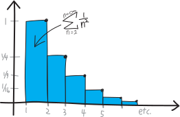
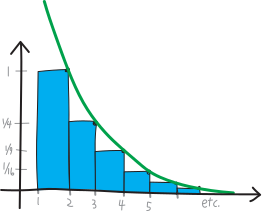
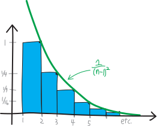
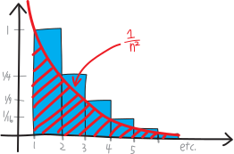

We've figured out that $1/n$ diverges. But what about $1/n^2$?

$$\sum_{n=1}^{n=\infty} \frac{1}{n^2} = 1 + \frac{1}{4} + \frac{1}{9} + \frac{1}{16} + \frac{1}{25} + \frac{1}{36} + \cdots$$

Its terms are going to $0$. They're going to $0$ much faster than the terms of $1/n$ do. (They're squared!). But that doesn't mean the series converges. $1/n^2$ is less than $1/n$, but all that tells us is that $1/n^2$ is less than $\infty$. It could be less than $1/n$, and still be infinite. It could be less than $1/n$, but be finite (it'd have to be waaaaay less). 

So what's its deal?

## initial point

It's worth pointing out, before we go too far, that this series *doesn't* have the same energy as $1/2^n$ (to use Kayla Ling's delightful and delightfully-Californian phrase). We've spent all this time with geometric series like $1/2^n$, $1/5^n$, $\left(2^n-1\right)/2^n$, etc., but what they all have in common is that they're a *constant* raised to the *variable*. Two raised to $n$. But $n^2$ is the variable raised to a constant. That's different!

$$\underbrace{\sum_{n=0}^{n = \infty} (\text{constant})^\text{variable} \quad=\quad \frac{1}{1-(\text{constant})} }_{\text{the geometric series stuff}} \quad\neq\quad \underbrace{\sum (\text{variable})^\text{constant}}_{\text{totally different}}$$

It's not better, or worse; it doesn't automatically mean that it does or doesn't converge; it's just... different. 

## try \#1

Lacking any other immediate ideas, we could compare it to a series we already understand! For example, we could compare it to the series $\sum \frac{1}{2^n}$, which we know converges. Let's write out some terms: 

<table>
<thead> <td></td> <td>$$\sum_{n=1}^{n=\infty} \frac{1}{2^n}$$ </td> <td> </td> <td> $$\sum_{n=1}^{n=\infty} \frac{1}{n^2}$$</td> </thead>
<tr> <td> $n=1$ </td> <td> $$\frac12$$ </td> <td> $$ < $$ </td> <td> $$1$$ <td> </tr>
<tr> <td> $n=2$ </td> <td> $$\frac14$$ </td> <td> $$ = $$ </td> <td> $$\frac{1}{4}$$<td> </tr>
<tr> <td> $n=3$ </td> <td> $$\frac18$$ </td> <td> $$ > $$ </td> <td> $$\frac{1}{9}$$<td> </tr>
<tr> <td> $n=4$ </td> <td> $$\frac{1}{16}$$ </td> <td> $$ = $$ </td> <td> $$\frac{1}{16}$$<td> </tr>
<tr> <td> $n=5$ </td> <td> $$\frac{1}{32}$$ </td> <td> $$ <$$ </td> <td> $$\frac{1}{25}$$<td> </tr>
<tr> <td> $n=6$ </td> <td> $$\frac{1}{64}$$ </td> <td> $$ < $$ </td> <td> $$\frac{1}{36}$$ <td> </tr>
<tr> <td> $n=7$ </td> <td> $$\frac{1}{128}$$ </td> <td> $$ < $$ </td> <td> $$\frac{1}{49}$$ <td> </tr>
<tr> <td> $n=8$ </td> <td> $$\frac{1}{256}$$ </td> <td> $$ < $$ </td> <td> $$\frac{1}{64}$$ <td> </tr>
<tr> <td> $n=9$ </td> <td> $$\frac{1}{512}$$ </td> <td> $$ < $$ </td> <td> $$\frac{1}{81}$$ <td></tr>
<tr> <td> $$\vdots$$ </td> <td> etc. </td> <td> $$ < $$ </td> <td> etc.<td></tr>
</table>

This is kind of wacky! It takes a while for it to settle down into a consistent pecking order. At first $1/n^2$ is bigger, then they're equal, then it's smaller, then they're equal again, then $1/n^2$ is bigger again. But after that---after the $n=5$ term---the $1/n^2$ series is always going to be bigger. $2^n$ just gets so big, so fast, that squaring isn't going to be able to keep up. It's slower to get started---but faster once it gets going. 

So, in other words, the $1/n^2$ series is going to be bigger than the $1/2^n$ series:

$$\sum_{n=1}^{n=\infty} \frac{1}{2^n} \quad<\quad \sum_{n=1}^{n=\infty} \frac{1}{n^2}$$

And since the $1/2^n$ series is $1$ (when we start at $n=1$), this means:

$$1 \quad<\quad \sum_{n=1}^{n=\infty} \frac{1}{n^2}$$

But... saying that the $1/n^2$ series is bigger than $1$ doesn't tell us very much. It could be a LOT bigger than $1$, and thus diverge (to $\infty$). It could be a little bit bigger than $1$, and thus converge to some finite number. We don't know. And using a geometric series other than $1/2^n$ won't improve things. If we try this same strategy with $1/3^n$ or $1/4^n$ or $1/\text{whatever}^n$, we'll have the same problem. Eventually, the $\text{(whatever)}^n$ is always going to be bigger than $n^2$. Exponentials grow so, so fast. 

So, not much insight.

## try \#2

If we knew calculus, we might be able to figure out what $1/n^2$'s deal is!!!! We'd be able to do it visually, by comparing its blocky-staircaseness to a smooth-and-curvy ski slope.

Let me sketch out in more detail what that argument might look like. We can think of $\sum_{n=1}^{n=\infty}\frac{1}{n^2}$ as being, visually, a blocky staircase. Each stair is $1$ unit wide and $1/n^2$ units tall, thus having an area of $1/n^2$, and thus the area under the entire staircase has an area of $\sum 1/n^2$. So the total value of the series is the area of this blue blocky staircase:

{width=75%}

Skiing is fun! But this wouldn't be a very fun hill to ski on. What if we buy a snowmaker and fill in and groom the area above this staircase, giving us a great groomer green ski slope:

{width=75%}

If you remember from the fall semester, we could represent that smooth ski slope curve with the function $1/(n-1)^2$. So it's $1/n^2$, but shifted one to the right:

{width=75%}

What's the total area underneath that green groomer ski slope?

{width=75%}

If we could find the area of the green groomer ski slope, we might be able to figure out whether our blue blocky staircase $1/n^2$ converges! We know that the area of the green groomer ski slope is greater than the area of the blocky blue $1/n^2$ staircase:

$$\substack{\text{area of the}\\\text{blocky blue staircase}} \quad<\quad \substack{\text{area of the}\\ \text{green groomer ski slope}}$$

So if the area of the smooth green ski slope is finite, then the area of the blocky staircase has to be finite as well! We don't know how to calculate the area of the smooth green ski slope, but if we did, and if it turned out to be finite, then we'd learn that $\sum 1/n^2$ converges! 

On the other hand, if the area of the smooth green ski slope turns out to be infinite, we wouldn't learn anything. $\sum 1/n^2$ is less than it, sure, but "less than infinity" could mean a *lot* less than infinity (and thus be finite and converge), or only *a little* less than infinity (and thus still be infinite and diverge). So then perhaps we could make a second ski slope, one slightly *smaller* than the blocky staircase---like, go about the problem from the other direction---and see if we can calculate its area, and perhaps that would resolve our quandry.

{width=75%}

The red ski slope is smaller than the blue blocky staircase, so if the red ski slope is infinite, then we'd know the blocky blue staircase also must be infinite! (But if the red ski slope is finite, then we wouldn't learn anything.) Overall, I guess we have something like:

$$\substack{\text{area of the}\\\text{radical red run}} \quad < \quad \substack{\text{area of the}\\\text{blocky blue staircase}} \quad<\quad \substack{\text{area of the}\\ \text{green groomer ski slope}}$$

But, given that we don't know how to find the areas of curvy shapes, we're blocked from actually working out this line of argument. Rats!

(Also, if you do happen to know calculus, you'll note that there are a few more subtle details I gloss over here!)

## try \#3

Here's another idea. When we worked out the fact that $1/n$ diverges, we did so by grouping its terms into buckets, all of which were greater than $1/2$:

\begin{align*}
\sum_{n=1}^{n=\infty} \frac{1}{n} \quad&= 1+\frac{1}{2}+\underbrace{\frac13+\frac14}_{\substack{\vee \\ \frac12}}+\underbrace{\frac15+\frac16+\frac17+\frac18}_{\substack{\vee \\ \frac12}}+\underbrace{\frac{1}{9}+\frac{1}{10}+\frac{1}{11}+\frac{1}{12}+\frac{1}{13}+\frac{1}{14}+\frac{1}{15}+\frac{1}{16}}_{\substack{\vee \\ \frac12}}+\cdots \\ \\
&> 1 + \frac12 + \frac12 + \frac12 + \cdots
\end{align*}

Maybe we could do something similar here???

\begin{align*}
\sum_{n=1}^{n=\infty} \frac{1}{n^2} \quad&= \underbrace{1 + \frac{1}{4} + \frac{1}{9} + \frac{1}{16} + \frac{1}{25} + \frac{1}{36} + \cdots}_{\substack{\text{collect into buckets,}\\\text{all of which are bigger than $1/2$ or some other number???}}}
\end{align*}

??? Idk.

## try \#5

OK, we're still throwing things at the wall here. Lacking any better ideas, maybe we could use a computer or something to try to get some idea of what's going on? Like, maybe it'd help us make a guess as to whether the series converges or diverges? It wouldn't *prove* that, let alone tell us *why* the series converges or diverges, but it might at least help give us some directions to try.

Back in my day, if you wanted to estimate an infinite series, you had to use a spreadsheet, or write a Python script! You kids all can just do it in Desmos. Lucky! So, if we sum this out to $10$ in Desmos, we get:

$$\sum_{n=1}^{n=10} \frac{1}{n^2} \approx 1.54976773117\dots$$

Let's zonk it up by another order of magnitude. What if we sum to $100$?

$$\sum_{n=1}^{n=100} \frac{1}{n^2} \approx 1.63498390018\dots$$

Compute is cheap! Let's crank it up a few more orders of magnitude (no GPU required):

\begin{align*}
\sum_{n=1}^{n=1000} \frac{1}{n^2} &\approx 1.64393456668\dots \\ \\
\sum_{n=1}^{n=10,000} \frac{1}{n^2} &\approx 1.64393456668\dots \\ \\
\sum_{n=1}^{n=100,000} \frac{1}{n^2} &\approx 1.64483407185\dots 
\end{align*}

OK, this sure *seems* like it's converging. But we need a *proof*. 

## try \#6

OK, let me finally show you an argument that's actually going to work and that we're actually going to be able to implement. (I'm cribbing this proof from [a surprisingly excellent YouTube video by some guy named Jim Fowler](https://www.youtube.com/watch?v=9euTxoCC8Hk))

We're going to compare $\sum 1/n^2$ to a series, and it'll be one that we know converges. But, for the series we compare it to, we're going to have to do a little bit of work to show that it converges. We're going to have to do some fancy algebra to split it up into two fractions and then show that a lot of stuff cancels out.

The series we're going to compare $\sum \frac{1}{n^2}$ to is this one:

$$\sum_n \frac{1}{n^2-n}$$

I'm... just pulling that series out of a hat. Which is unsatisfying! How would you come up with this series if you didn't already know to use it??? 

I don't have a good answer here.

But, anyway, we know that $1/n^2$ will always be less than $1/(n^2 - n)$. We know this because we know that $n^2$ is always greater than $n^2-n$ (at least for $n>0$, which is the domain we care about):
$$n^2 > n^2 - n$$
So if we take a reciprocal, that flips the greater-than sign:
$$\frac{1}{n^2} < \frac{1}{n^2-n}$$
Well, actually, I guess this only happens if $n\ge2$, because if $n=1$, then $1/(n^2-n)$ gives us a divide by zero error. So for $n\ge 2$ this is true. And then their sums must have the same relationship:
$$\sum_{n=2}^{n=\infty} \frac{1}{n^2} \quad<\quad \sum_{n=2}^{n=\infty} \frac{1}{n^2-n}$$
So, if we can prove that the sum on the right is finite (converges), then we'll know that the sum on the left is finite (converges). *If*! So that's what we need to do: prove that the sum on the right converges. Then we'll have shown that $\sum 1/n^2$ converges.

(Of course, these two sums start at $n=2$, and actually we want to prove that what converges is the sum starting at $n=1$, but that's a minor detail we'll resolve at the end.)

So, let's try to prove that  $\sum 1/(n^2 - n)$ converges. What do we know about $1/(n^2 - n)$? Here's the key step: we can do a **partial fraction decomposition**, which is a fancy way of saying we can turn a single fraction into two fractions. Once we do that, we'll be able to re-write the sum, and see (very neatly, and very cleanly) that it converges. 

Now, partial fraction decomposition isn't something I particularly like to do. It's a lot of work, and it's one of the many things I ignored during my own high school math classes. But the basic idea is very simple. We're already very good at finding common denominators to go from two fractions added together to just one fraction:

$$\frac{2}{3}+\frac{4}{5}\quad \xrightarrow[\quad \frac{2\cdot 5 + 4\cdot 3}{3\cdot 5} \quad]{\quad\text{finding a common denominator!}\quad } \quad \frac{22}{15}$$

Partial fraction decomposition is doing that in reverse: taking one fraction, and splitting it up into two fractions! 

$$\frac{22}{15} \quad \xrightarrow{\quad\text{partial fraction decomposition!}\quad} \quad \frac{2}{3}+\frac{4}{5}$$

So, a partial fraction decomposition is UN-finding common denominators!

$$\text{two fractions} \quad \substack{   \xrightarrow{\quad\text{finding a common denominator!}\quad }\\  \xleftarrow[\quad\text{partial fraction decomposition!}\quad ]{} } \quad  \text{one fraction}$$

So, we're going to take $1/(n^2 - n)$ and un-find common denominators/do a partial fraction decomposition to split it up into two fractions. Don't worry too much about *how* we do that, or about how you might take some random fraction and partial-fraction-decompose it. But do take a minute to stare at this line of algebra and convince yourself that you can indeed go from left to right (combining common denominators) and thus also go from right to left:
$$\frac{1}{n-1}-\frac{1}{n} = \frac{n}{(n)(n-1)} - \frac{(n-1)}{(n)(n-1)} = \frac{n-(n-1)}{(n)(n-1)} = \frac{1}{n^2-n}$$
The key step there, in going from the rightmost expression to the second-rightmost expression, is adding $0$ to the numerator in a magical, *deus ex machina* sort of way. Namely:
$$n - (n-1) = n - n + 1 = 1$$
So we're just changing the *appearance* of the numerator, without changing its actual *substance*. Again, don't worry about how you might actually come up with this on your own---just convince yourself that, however pulled-out-of-a-hat this might seem, that it is, in fact, true.

So now we can write this single fraction as two fractions subtracted:
$$ \frac{1}{n^2-n} = \frac{1}{n-1}-\frac{1}{n}$$
And so we can rewrite our series:
$$\sum_{n=2}^{n=\infty} \frac{1}{n^2-n} = \sum_{n=2}^{n=\infty}\left( \frac{1}{n-1}-\frac{1}{n}\right)$$
What happens if we write out a few terms of this sum, when we express it in the form on the right? We get:
$$ \sum_{n=2}^{n=\infty} \left(\frac{1}{n-1}-\frac{1}{n} \right)= \left(\frac{1}{1} - \frac{1}{2}\right) + \left(\frac{1}{2} - \frac{1}{3}\right) + \left(\frac{1}{3} - \frac{1}{4}\right) + \left(\frac{1}{4} - \frac{1}{5}\right) + \cdots $$
So much stuff cancels! We've got a $-1/2$ in the $n=2$ term, and a $+1/2$ in the $n=3$ term, so those obliterate each other. We've got a $-1/3$ in the $n=3$ term, and a $+1/3$ in the $n=4$ term, so those obliterate each other. We've got a $-1/4$ in the $n=4$ term, and a $+1/4$ in the $n=5$ term, so those obliterate each other. And so on and so forth, *ad infinitum*! Writing it all out, we have:

\begin{align*}
\sum_{n=2}^{n=\infty} \frac{1}{n^2-n} &= \sum_{n=2}^{n=\infty} \left(\frac{1}{n-1}-\frac{1}{n}\right) \\ \\
&=  \left(\frac{1}{1} - \frac{1}{2}\right) + \left(\frac{1}{2} - \frac{1}{3}\right) + \left(\frac{1}{3} - \frac{1}{4}\right) + \left(\frac{1}{4} - \frac{1}{5}\right) + \cdots \\ \\
&= \frac{1}{1} - \frac{1}{2} + \frac{1}{2} - \frac{1}{3} + \frac{1}{3} - \frac{1}{4} + \frac{1}{4} - \frac{1}{5} + \cdots \\ \\
 &= \frac{1}{1} - \cancel{\frac{1}{2}} + \cancel{\frac{1}{2}} - \cancel{\frac{1}{3}} + \cancel{\frac{1}{3}} - \cancel{\frac{1}{4}} + \cancel{\frac{1}{4}} - \frac{1}{5} + \cdots \\ \\
 &= 1
\end{align*}
Everything but the very first term and the very last term cancel out! And as $n\rightarrow \infty$, the very last term, $1/n$, goes to $0$. So we're just left with:
$$\sum_{n=2}^{n=\infty} \left(\frac{1}{n-1}-\frac{1}{n} \right)= 1$$
The fancy name for this is that this is a **telescoping series**, because all of the terms (except a few) collapse in on each other, kind of like an old-timey pirate telescope that collapses down in on itself to become more compact.

This is the crux of our argument. Now we have a series that we know converges, and we know it's always greater than $1/n$. So now we can finish our argument. We know that:

$$ \sum_{n=2}^{n=\infty} \frac{1}{n^2} \quad<\quad \sum_{n=2}^{n=\infty} \frac{1}{n^2-n}$$

Which is:

$$ \sum_{n=2}^{n=\infty} \frac{1}{n^2} \quad<\quad \underbrace{\sum_{n=2}^{n=\infty} \left( \frac{1}{n-1}-\frac{1}{n} \right) }_{=1}$$

So we have:

$$ \sum_{n=2}^{n=\infty} \frac{1}{n^2} \quad<\quad 1$$

So the sum is less than $1$ (and it's never negative), so we know it converges! We don't know where it converges to---somewhere less than $1$ and greater than $0$, I guess---but we know *that* it converges, and that's pretty cool.

There's one final detail. The sum we were originally wondering about was the series $1/n^2$ starting *not* at $n=2$, *but instead* at $n=1$. But all the stuff we just did was for the sum starting at $n=2$. That's not a big deal, because we can just do some surgery. The sum starting at $n=1$ will just have one more term:

\begin{align*}
\sum_{n=1}^{n=\infty} \frac{1}{n^2} &= \underbrace{\frac{1}{1^2}}_{\text{the }n=1\text{ term}} + \underbrace{\sum_{n=2}^{n=\infty} \frac{1}{n^2}}_{\text{the }n\ge 2\text{ terms}}\\ \\
&= 1 + \left(\text{something that's less than } 1\right) \\ \\
&= \text{ something between }1\text{ and }2\\ \\
&= \text{ so it converges!}
\end{align*}
The first term is just $1$, and we can't add a finite number to another finite number and get infinity. Adding $1$ won't make our series diverge! So, it converges. Now have one more series we know about, which we can add to our arsenal of things to compare other series to:
$$\boxed{ \quad \sum_{n=1}^{n=\infty} \frac{1}{n^2} \quad \text{converges}\quad}$$

What does it converge to? Who knows! Well, we estimated it with a computer already; we saw that it works out to be roughly:
$$ \sum_{n=1}^{n=\infty} \frac{1}{n^2}  \approx 1.6449\dots$$

Actually, here's something that's totally nuts, originally proven by Euler, which Theo Rode reminded me of back in 2019. Where's that number $1.6449\dots$ coming from? What's the *actual number* this series converges to (not just its dastardly decimal approximation)? It is, stunningly, just $\pi^2/6$:

$$ \sum_{n=1}^{n=\infty} \frac{1}{n^2}  = \frac{\pi^2}{6}$$

It's already crazy enough that we can add up an infinite number of numbers and get some finite number---but $\pi$!?! Where's THAT coming from?!? Doesn't $\pi$ normally relate to circles? If you don't believe this, try punching $\pi^2/6$ into a calculator, and you'll see that it's basically $1.6449$. It's called, famously, the **[Basel problem](https://en.wikipedia.org/wiki/Basel_problem)**. There's a really beautiful proof/derivation of it that involves writing sine as a Taylor series and then doing some factoring!

## Questions

* We've shown that $\sum 1/n$ diverges, when we sum it from $n=1$ to $n=\infty$, but what if we sum fewer numbers? What if we start our sum from $n=10$, or $n=100$, or $n=\text{ten billion}$? Can we make it converge? If we start it from a big enough $n$, can we make $\sum 1/n$ finite?  If we're ending ("ending") at $n=\infty$, does it matter where we start?

* We now know about $1/n$ and $1/n^2$, but what about $1/n^3$? Does that converge, or diverge? Why? What about $1/n^4$? What about $1/n^{2.3853}$? Can you use a calculator or write a short computer program to try to make a hypothesis about the answer? Can you prove it?

* What about $\sum n^p$? For what values of $p$ does it converge? For what values does it diverge? When does it flip over from converging to diverging? When does it somehow---in a moment of metaphysical glory; in a flash of phosphorus; in a delta-function burst of electromagnetic energy---go from being finite to being infinite?