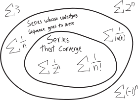

We've seen the startling result that if we add up an infinite number of one-over-powers-of-two, we get just $2$:

$$1+\frac{1}{2}+\frac{1}{4}+\frac{1}{8}+\frac{1}{16}+\frac{1}{32}+\cdots = 2$$

This perplexity should provoke our curiosity. If we can sometimes add up an infinite number of things and get some finite number, why does that happen? When does it happen? Who are these alien creatures, these **infinite series**? How do they behave? When do they **converge** (approach some finite number), and when do they **diverge** (not)? 

Sometimes in math, as in life, we have a master formula. If we want to factor any quadratic, we can just use the quadratic formula! No thinking involved. Plug 'n' chug. Follow the rules and get the answer! Sometimes that happens. It's nice when it does. It makes the world simpler and more legible. 

But sometimes in math, as in life, there's no formula. Think of how you treat your friends: do you treat them like they're all identical, and just apply your interact-with-a-friend algorithm every time you hang out? Of course not! Friendship isn't formulaic. Your friends aren't cogs in a machine. They're *individuals*. We think about *who they are*, as distinct individuals, and what they, *specifically*, need and want. If we make a lot of friends, then perhaps we'll be able to discern general patterns of human behavior. But the general patterns that come out of the specific examples. Not the other way around. 

That's the situation we're in now. We've made first contact with these extrafinite extraterrestrials known as infinite series. We've met a whole bunch of them at a party. We've talked to them, asked them questions, listened to them, and tried to understand them better. There hasn't been a master formula or a master algorithm. Rather, we've gained a better understanding slowly and intuitively, bit by bit, problem by problem, series by series.

In class, after I showed you that this $(1/2)^n$ series converges to $2$, I gave us the following twenty-odd infinite series problems to ponder. We tried to figure out whether each of these infinite series converge or diverge, and if they do converge, to what they converge. We tried to do so without looking anything up, without giving away any spoilers, just using our minds. The point wasn't just to get to answer. (If figuring out the convergence/divergence were our only goal, then flipping a coin would take us halfway there.) Rather, the point was to *think* and reason through these problems and *make an argument*. 

In what follows, I'll sketch out some of the ways we can think through how all these series behave. There are general truths and trends and patterns, and maybe, in thinking through each of these series, those patterns can come into sharper focus. 

<ol class='problems'>
<li> $\displaystyle \sum_{n=0}^{n=\infty} \frac{1}{2^n}$ </li>
<li> $\displaystyle \sum_{n=3}^{n=\infty} \frac{1}{2^n}$ </li>
<li> $\displaystyle \sum_{n=0}^{n=\infty} 2^{-n}$ </li>
<li> $\displaystyle \sum_{n=0}^{n=\infty} 2^{n}$ </li>
<li> $\displaystyle \sum_{n=0}^{n=\infty} (-1)^n$ </li>
<li> $\displaystyle \sum_{n=0}^{n=\infty} 3$ </li>
<li> $\displaystyle \sum_{n=0}^{n=\infty} \frac{1}{3}$ </li>
<li> $\displaystyle \sum_{n=0}^{n=\infty} \frac{1}{5^n}$ </li>
<li> $\displaystyle \sum_{n=1}^{n=\infty} \frac{1}{n}$ </li>
<li> $\displaystyle \sum_{n=0}^{n=\infty} \frac{1}{n!}$ </li>
<li> $\displaystyle \sum_{n=0}^{n=\infty} \frac{1}{n! + 5^n + 200}$ </li>
<li> $\displaystyle \sum_{n=1}^{n=\infty} \frac{1}{\sqrt{n}}$ </li>
<li> $\displaystyle \sum_{n=-4}^{n=\infty} \frac{1}{2^n}$ </li>
<li> $\displaystyle \sum_{n=0}^{n=\infty} \frac{12}{2^n}$ </li>
<li> $\displaystyle \sum_{n=0}^{n=\infty} \frac{1}{7.842^n}$ </li>
<li> $\displaystyle \sum_{n=0}^{n=\infty} \frac{1}{2^{n+3}}$ </li>
<li> $\displaystyle \sum_{n=0}^{n=\infty} 2^{n}$ revisited</li>
<li> $\displaystyle \sum_{n=0}^{n=\infty} \frac{1}{2^n} + \frac{1}{3^n}$ </li>
<li> $\displaystyle \sum_{n=0}^{n=\infty} \frac{3^n + 2}{4^n}$ </li>
<li> $\displaystyle \sum_{n=0}^{n=\infty} \frac{1}{2^{2n+3}}$ </li>
</ol>

$${\color{lightgray} \sum \quad \sum \quad \sum \quad \sum \quad \sum \quad \sum \quad \sum \quad \sum  }$$

## $\displaystyle \sum_{n=0}^{n=\infty} \frac{1}{2^n} = \,\, ???$

This was the first infinite series we saw! And we realized in class, through that remarkable proof, that it converges to just $2$.

I'll recap our proof here. We have:

\begin{align*}
\sum_{n=0}^{n=\infty}\frac{1}{2^n} &= \frac{1}{2^0} + \frac{1}{2^1} + \frac{1}{2^2} + \frac{1}{2^3} + \frac{1}{2^4} + \frac{1}{2^5} + \frac{1}{2^6} + \cdots \\ \\
&=  1 + \frac12 + \frac{1}{4} + \frac{1}{8} + \frac{1}{16} + \frac{1}{32} + \frac{1}{64} + \cdots
\end{align*}

For simplicity, let's call this $S$:

$$ S = 1+\frac{1}{2}+\frac{1}{4}+\frac{1}{8}+\frac{1}{16}+\frac{1}{32}+\cdots $$

So now we've got this delightful equation. What if we multiply both sides by $1/2$? We'll get:

$$\frac{1}{2}S = \frac{1}{2}\left(1+\frac{1}{2}+\frac{1}{4}+\frac{1}{8}+\frac{1}{16}+\frac{1}{32}+\cdots \right)$$

Or just:

$$ \frac12S = \frac{1}{2}+\frac{1}{4}+\frac{1}{8}+\frac{1}{16}+ \cdots$$

(Wait, what? Why $1/2$? Where's that coming from? I mean, what we did there was *true*---we can multiply both sides of an equation y $1/2$ and still get a true equation, but that doesn't explain *why* we'd want to multiply it by $1/2$ instead of $1/4$ or $1/7$ or whatever, or, for that matter, why we'd want to multiply it by something in the first place. It's *true*, but it's also *deus ex machina*.)

Anyway, let's think now about the quantity $S-(1/2)S$. We know what $S$ is, and we just figured out what $(1/2)S$ is, so we should have:

$$S-\frac{1}{2}S = \underbrace{\left(1 + \frac{1}{2} + \frac{1}{4} + \frac{1}{8} + \cdots\right)}_{S} - \underbrace{ \left(\frac{1}{2} + \frac{1}{4} + \frac{1}{8} + \frac{1}{16} \cdots\right)}_{(1/2)S}$$

But now we can distribute that negative sign and combine these two parentheses. When we do so, almost everything cancels out: we have a $+(1/2)$ and a $-(1/2)$; we have a $+(1/4)$ and a $-(1/4)$, and so forth. The only thing that's left is the $+1$:
$$S-\frac{1}{2}S = 1 + \cancel{\frac{1}{2}} + \cancel{\frac{1}{4}} + \cancel{\frac{1}{8}} + \cdots - \cancel{\frac{1}{2}} - \cancel{\frac{1}{4}} - \cancel{\frac{1}{8}} - \cancel{\frac{1}{16}} \cdots$$
$$S-\frac{1}{2}S = 1$$

But of course we can easily rearrange this to solve for $S$:
\begin{align*}
S\left(1-\frac{1}{2}\right) &= 1\\ \\
\frac{1}{2}S &= 1 \\ \\
S &= 2
\end{align*}

Wow!!!! So we have this infinitely-long infinite series, and it all just adds up to two:
$$\sum_{n=0}^{n=\infty} \left(\frac{1}{2}\right)^n = 1 + \frac{1}{2} + \frac{1}{4} + \frac{1}{8} + \frac{1}{16} + \cdots = 2$$

Incredible. We have an infinite number of things, and yet when we add them all up, we don't get infinity---we get *a finite number*. Totally nuts. Or, perhaps your philisophical views prevent you from believing that we can ever *actually* add up an infinite number of things (valid!); in which case, you might prefer to phrase this as this sum **approaches** $2$. "The more and more terms of $1/2^n$ we add together, the closer and closer it becomes to $2$," or something like that.

$${\color{lightgray} \sum \quad \sum \quad \sum \quad \sum \quad \sum \quad \sum \quad \sum \quad \sum  }$$

## $\displaystyle \sum_{n=3}^{n=\infty} \frac{1}{2^n} = \,\, ???$

This is... almost the same as what we have above. But in the above example, the counter starts at $n=0$. Here it starts at $n=3$. How does that change things?

Wanna play doctor???

Sometimes it's time to *take out the scalpel* and *do some surgery*. 

Here's our series:

$$\sum_{n=3}^{n=\infty}\frac{1}{2^n} = \,\, ???$$

Does it converge? Does it diverge? If it converges, what does it converge to??? It looks *kind of* like our $1/2^n$ series, which we've figured out equals $2$, except that one starts at $n=0$:

\begin{align*}
\sum_{n=0}^{n=\infty}\frac{1}{2^n} &= \frac{1}{2^0} + \frac{1}{2^1} + \frac{1}{2^2} + \frac{1}{2^3} + \frac{1}{2^4} + \frac{1}{2^5} + \frac{1}{2^6} + \cdots \\ \\
&=  1 + \frac12 + \frac{1}{4} + \frac{1}{8} + \frac{1}{16} + \frac{1}{32} + \frac{1}{64} \cdots \\ \\
&= 2
\end{align*}

That's a key difference! In both these series, we're taking powers of $2$ ($2^0$, $2^1$, $2^2$, etc.) reciprocal'ing them, and then adding them up. But we start at a different power! 

Let's take our series starting at $n=3$ and write out the first few terms, to get some intuition. We have:

\begin{align*}
\sum_{n=3}^{n=\infty}\frac{1}{2^n} &= \frac{1}{2^3} + \frac{1}{2^4} + \frac{1}{2^5} + \cdots \\ \\
&= \frac{1}{8} + \frac{1}{16} + \frac{1}{32} + \cdots \\  \\
&= \,\,\, ???
\end{align*}

It's so close to the series that starts at $n=0$! It... it's just missing the first few terms. Actually, let's rewrite our the series $1/2^n$ starting at $n=0$:

$$ \overbrace{1 + \frac12 + \frac{1}{4} + \frac{1}{8} + \frac{1}{16} + \frac{1}{32} + \frac{1}{64} + \cdots }^{\displaystyle\sum_{n=0}^{n=\infty}\frac{1}{2^n}}= 2 $$

What we're trying to find here is the series of all these terms, but starting at $n=3$, i.e., not including the first few terms:

$$ \overbrace{1 + \frac12 + \frac{1}{4} + \underbrace{\frac{1}{8} + \frac{1}{16} + \frac{1}{32} + \frac{1}{64} + \cdots}_{\displaystyle\sum_{n=3}^{n=\infty}\frac{1}{2^n}} }^{\displaystyle\sum_{n=0}^{n=\infty}\frac{1}{2^n}}= 2 $$

So we can find the sum from $n=3$ just by subtracting off the first three terms!!! We'll take $2$, which is the entire sum from $0$ out to $\infty$, and subtract off the terms when $n=0$, $n=1$, and $n=2$. In other words:

\begin{align*}
\sum_{n=3}^{n=\infty}\frac{1}{2^n} &= \left( \substack{\text{the full series}\\\text{starting at $n=0$}}\right) - \left(\substack{\text{the first}\\\text{three terms}}\right) \\ \\
&= \left( \sum_{n=0}^{n=\infty}\frac{1}{2^n} \right) - \left( 1 + \frac12 + \frac14\right) \\ \\
&= 2 - \left( 1 + \frac12 + \frac14\right) \\ \\
&= 2 - 1 - \frac12 - \frac14 \\ \\
&= \frac{1}{4}
\end{align*}

Yay! It just required a bit of surgery.

$${\color{lightgray} \sum \quad \sum \quad \sum \quad \sum \quad \sum \quad \sum \quad \sum \quad \sum  }$$

## $\displaystyle \sum_{n=0}^{n=\infty} 2^{-n} = \,\, ???$

Wait, how is this even a problem? This is just the same as $1/2^n$. By exponent rules:

$$\frac{1}{a^b} = a^{-b}$$

So then:

\begin{align*}
\sum_{n=0}^{n=\infty} 2^{-n} &= \sum_{n=0}^{n=\infty} \frac{1}{2^n} \\ \\
&= 2
\end{align*}

Okay. Fine.

$${\color{lightgray} \sum \quad \sum \quad \sum \quad \sum \quad \sum \quad \sum \quad \sum \quad \sum  }$$

## $\displaystyle \sum_{n=0}^{n=\infty} 2^{n} = \,\, ???$

It's the same thing, but... now it's not a fraction! And it's terrifying:

\begin{align*}
\sum_{n=0}^{n=\infty} 2^n &= 2^0 + 2^1 + 2^2 + 2^3 + 2^4 + 2^5 + \cdots \\ \\
&= 1 + 2 + 4 + 8 + 16 + 32 + \cdots
\end{align*}

We're adding together bigger and bigger numbers!!!! To use the inappropriately subdued mathematical term of art, this sum is **increasing without bound**!!! In other words, it's zooming off to infinity. So this series diverges, to infinity.

$$\sum_{n=0}^{n=\infty} 2^n  = \infty$$

$${\color{lightgray} \sum \quad \sum \quad \sum \quad \sum \quad \sum \quad \sum \quad \sum \quad \sum  }$$

## $\displaystyle \sum_{n=0}^{n=\infty} (-1)^n$

Let's write out a few terms:

\begin{align*}
\sum_{n=0}^{n=\infty} (-1)^n &= (-1)^0 + (-1)^1 + (-1)^2 + (-1)^3 + (-1)^4 + \cdots \\ 
&= 1 + (-1) + 1 + (-1) + 1 + \cdots \\
&= 1 - 1 + 1 - 1 -1 + \cdots
\end{align*}

Uhhhh...

I mean, it's not zooming off to infinity. But... it's definitely not settling down to one single finite number, either. It's just bouncing back and forth between $+1$ and $-1$. It's tempting to say that it averages out to zero, I guess, but it doesn't really actually average. There's no asymptote! There's no convergence! So... this doesn't diverge by zooming up or down to $\pm \infty$, but it does diverge. 

$${\color{lightgray} \sum \quad \sum \quad \sum \quad \sum \quad \sum \quad \sum \quad \sum \quad \sum  }$$

## $\displaystyle \sum_{n=0}^{n=\infty} 3= \,\, ???$

This is... just a bunch of threes added up.

There's... no $n$ in the sum, in the formula that we're iterating over. When $n=0$, what's $3$? It's three. When $n=1$, what's three? Still three. When $n=2$, what's three? ...

So... we add up an infinite number of threes. We just get infinity. 

So this is:

\begin{align*}
\sum_{n=0}^{n=\infty} 3 & = 3 + 3 + 3 + 3 + \cdots \\
&= \infty
\end{align*}

So this series diverges, to infinity.

$${\color{lightgray} \sum \quad \sum \quad \sum \quad \sum \quad \sum \quad \sum \quad \sum \quad \sum  }$$

## $\displaystyle \sum_{n=0}^{n=\infty} \frac{1}{3}= \,\, ???$

Aha! Like last time, but this time, it's *fractions*!!! And fractions get small!!!

Or... not. This is just a bunch of $1/3$s added up.

\begin{align*}
\sum_{n=0}^{n=\infty} \frac13 & = \frac13 + \frac13 + \frac13 + \frac13 + \cdots \\
&= \infty
\end{align*}

Yeah.

The general observation here is that if we want a series to converge, then, at a minimum, the underlying sequence has to go to $0$. If the underlying sequence stays the same size---or worse, gets bigger---then the series definitely won't converge. Just because the underlying sequence/the terms go to $0$ doesn't mean that the series/sum always will converge. It might still diverge. It might not go to $0$ fast enough. But it at least has a *chance* of converging. 

$${\color{lightgray} \sum \quad \sum \quad \sum \quad \sum \quad \sum \quad \sum \quad \sum \quad \sum  }$$

## $\displaystyle \sum_{n=0}^{n=\infty} \frac{1}{5^n}= \,\, ???$

Hm! What's going on here?

\begin{align*}
\sum_{n=0}^{n=\infty}\frac{1}{5^n} &= \frac{1}{5^0} + \frac{1}{5^1} + \frac{1}{5^2} + \frac{1}{5^3} + \frac{1}{5^4} + \frac{1}{5^5} + \frac{1}{5^6} + \cdots \\ \\
&=  1 + \frac15 + \frac{1}{25} + \frac{1}{125} + \frac{1}{625} + \cdots
\end{align*}

It's kind of like our $1/2^n$ series, except with fives!!! So what do we do?

### good argument

How is the $1/5^n$ series different from the $1/2^n$ series? Well, every term of this $1/5^n$ series is less than the corresponding term of the $1/2^n$ series:

<table>
<thead> <td> </td> <td> $$ \sum_{n=0}^{n=\infty} \frac{1}{5^n}$$ </td><td> </td> <td>$$ \sum_{n=0}^{n=\infty} \frac{1}{2^n}$$ </td> </thead>
<tr> <td> $$n=0$$ </td> <td> $$1$$ </td> <td> $$=$$ </td> <td> $$1$$ </td> </tr>
<tr> <td> $$n=1$$ </td> <td> $$+\frac{1}{5}$$ </td> <td> $$<$$ </td> <td> $$+\frac{1}{2}$$ </td> </tr>
<tr> <td> $$n=1$$ </td> <td> $$+\frac{1}{25}$$ </td> <td> $$<$$ </td> <td> $$+\frac{1}{4}$$ </td> </tr>
<tr> <td> $$n=1$$ </td> <td> $$+\frac{1}{125}$$ </td> <td> $$<$$ </td> <td> $$+\frac{1}{8}$$ </td> </tr>
<tr> <td> $$n=1$$ </td> <td> $$+\frac{1}{625}$$ </td> <td> $$<$$ </td> <td> $$+\frac{1}{16}$$ </td> </tr>
</table>

(Well, the first terms are equal, but that's not going to make a big difference.) If all the terms of the $1/5^n$ series are less than all the corresponding terms of the $1/2^n$ series, then the total terms (the total sum) has to be less:

$$  \sum_{n=0}^{n=\infty} \frac{1}{5^n} \quad<\quad \sum_{n=0}^{n=\infty} \frac{1}{2^n}$$

But we know that the $1/2^n$ series converges! It converges to $2$. So the $1/5^n$ series can't go zooming off to infinity---it has to be less than $2$! Every term is less than in the $1/2^n$ series, and that doesn't zoom off to infinity!

$$ \sum_{n=0}^{n=\infty} \frac{1}{5^n} \quad<\quad 2 $$

So it has to converge. Well, actually, I guess it might potentially fly *down* to negative infinity, but we know that can't happen, because all the terms are positive. So it has to converge to somewhere between $0$ and $2$:

$$  0 \quad<\quad \sum_{n=0}^{n=\infty} \frac{1}{5^n} \quad<\quad 2$$

Yay! It's like we're *trapping* the series between two finite numbers. It can't escape!

### better argument

We can do even better. It's good to know and argue and figure out that the series converges---but it's even better to figure out *what it converges to*. Which we can do! We can make basically the same argument that we made for the $1/2^n$ series. Let's call this $1/5^n$ series $S$:

$$ S = 1+\frac{1}{5}+\frac{1}{25}+\frac{1}{625}+\frac{1}{3125}+\cdots $$

So now we've got this delightful equation. What if we multiply both sides by $1/5$? We'll get:

$$\frac{1}{5}S = \frac{1}{5}\left( 1+\frac{1}{5}+\frac{1}{25}+\frac{1}{625}+\frac{1}{3125}+\cdots\right)$$

Or just:

$$ \frac15S = \frac{1}{5}+\frac{1}{25}+\frac{1}{625}+\cdots$$

Let's think about the quantity $S-(1/5)S$. We know what $S$ is, and we just figured out what $(1/5)S$ is, so we should have:

$$S-\frac{1}{5}S = \underbrace{\left( 1+\frac{1}{5}+\frac{1}{25}+\frac{1}{625}+\frac{1}{3125}+\cdots \right)}_{S} - \underbrace{ \left( \frac{1}{5}+\frac{1}{25}+\frac{1}{625}+\frac{1}{3125}+\cdots \right)}_{(1/5)S}$$

But now we can distribute that negative sign and combine these two parentheses. When we do so, almost everything cancels out: we have a $+(1/5)$ and a $-(1/5)$; we have a $+(1/25)$ and a $-(1/25)$, and so forth. The only thing that's left is the $+1$:
$$S-\frac{1}{5}S = 1 + \cancel{\frac{1}{5}} + \cancel{\frac{1}{25}} + \cancel{\frac{1}{625}} + \cdots - \cancel{\frac{1}{5}} - \cancel{\frac{1}{25}} - \cancel{\frac{1}{625}} \cdots$$
$$S-\frac{1}{5}S = 1$$

But of course we can easily rearrange this to solve for $S$:
\begin{align*}
S\left(1-\frac{1}{5}\right) &= 1\\ \\
\frac{4}{5}S &= 1 \\ \\
S &= \frac{5}{4}
\end{align*}

Woweeee!!! So we have:

$$ \sum_{n=0}^{n=\infty} \frac{1}{5^n} = \frac{5}{4} $$

So it converges, and it converges to $5/4$! Which is, indeed, as we previously argued, between $0$ and $2$:

$$ 0 \quad<\quad \sum_{n=0}^{n=\infty} \frac{1}{5^n} \quad<\quad  \sum_{n=0}^{n=\infty} \frac{1}{2^n} $$

$$  0 \quad<\quad \frac54 \quad<\quad 2$$

Is this going to be a more general pattern??? In the arguments we've made for the $1/2^n$ and $1/5^n$ series, there's been nothing special about $2$ or $5$. What if we have a series like $1/a^n$? Will it converge? I guess we'll get to that soon...

### best argument

Actually, yeah, let's see if we can derive the general formula. Suppose we have the infinite sum:

$$\sum_{n=0}^{n=\infty} \frac{1}{b^n} = 1 + \frac1b + \frac{1}{b^2} + \frac{1}{b^3}+\frac{1}{b^4}+\cdots $$

Let's call it $S$:

$$S = 1 + \frac1b + \frac{1}{b^2} + \frac{1}{b^3}+\frac{1}{b^4}+\cdots $$

Let's multiply both sides by $1/b$:

$$\frac{1}{b}S = \frac{1}{b}\left(1 + \frac1b + \frac{1}{b^2} + \frac{1}{b^3}+\frac{1}{b^4}+\cdots \right)$$

Distributing:

$$\frac{1}{b}S  =  \frac1b + \frac{1}{b^2} + \frac{1}{b^3}+\frac{1}{b^4}+\cdots$$

Meanwhile, we know what $S$ is, and we just figured out what $(1/b)S$ is, so we should have:

$$S-\frac{1}{b}S = \underbrace{\left( 1  \frac1b + \frac{1}{b^2} + \frac{1}{b^3}+\frac{1}{b^4}+\cdots \right)}_{S} - \underbrace{ \left(  \frac1b + \frac{1}{b^2} + \frac{1}{b^3}+\frac{1}{b^4}+\cdots  \right)}_{(1/b)S}$$

So:

$$S-\frac{1}{b}S = 1 + \cancel{\frac{1}{b}} + \cancel{\frac{1}{b^2}} + \cancel{\frac{1}{b^3}} + \cdots - \cancel{\frac{1}{b}} - \cancel{\frac{1}{b^2}} - \cancel{\frac{1}{b^3}} \cdots$$
$$S-\frac{1}{b}S = 1$$

But we can rearrange this to solve for $S$:
\begin{align*}
S\left(1-\frac{1}{b}\right) &= 1\\ \\
S &= \frac{1}{1-\frac{1}{b}}
\end{align*}

So we have:

$$ \sum_{n=0}^{n=\infty} \frac{1}{b^n}  = \frac{1}{\,\, 1-\frac{1}{b} \,\, } $$

Or, if we write this slightly differently:

$$\sum_{n=0}^{n=\infty} a^n = \frac{1}{\, 1-a\,\,}$$

Yay! So now we have a formula for any series that looks like $(\text{some number})^n$. People call this type of series a **geometric series**.

a **geometric series**:
$$\sum_{n=0}^{n=\infty} \left(\frac{1}{b}\right)^n = \frac{1}{\,\,1-\frac{1}{b}\,\,}$$
phrased differently:
$$ \sum_{n=0}^{n=\infty} a^n = \frac{1}{\, 1-a\,\,}$$

$${\color{lightgray} \sum \quad \sum \quad \sum \quad \sum \quad \sum \quad \sum \quad \sum \quad \sum  }$$

## $\displaystyle \sum_{n=1}^{n=\infty} \frac{1}{n}= \,\, ???$

Oooh! Here we have:

\begin{align*}
\sum_{n=1}^{n=\infty} \frac{1}{n} &= 1 + \frac{1}{2} + \frac{1}{3} + \frac{1}{4} + \frac{1}{5} + \cdots
\end{align*}

(I started it at $n=1$, note, because if $n=0$, we'd have a divide-by-zero issue.)

So!!! What's going on here? The terms, considered individually, are all going to zero:

$$1, \, \frac{1}{2}, \,  \frac{1}{3}, \, \frac{1}{4}, \, \frac{1}{5}, \, \cdots, \, \frac{1}{n}, \, \cdots \quad\xrightarrow[\quad \infty \quad]{ n }\quad 0$$

But... does that mean that the series/sum will be finite? The terns are going to zero, so it *might* converge. But it might not. How can we figure it out?

We can't use the geometric series formula here (the one we figured out about $\sum a^n$). The geometric series formula tells us what happens if we have a *constant* raised to a *variable*, like $a^n$. But $1/n$, which is just $n^{-1}$, is a *variable* raised to a *constant*. It's backwards from the geometric series formula:

$$\underbrace{\sum_{n=0}^{n = \infty} (\text{constant})^\text{variable} \quad=\quad \frac{1}{1-(\text{constant})} }_{\text{the geometric series stuff}} \quad\neq\quad \underbrace{\sum (\text{variable})^\text{constant}}_{\text{totally different}}$$

I'll save you the suspense: this sum diverges:

$$\sum_{n=1}^{n=\infty} \frac{1}{n} = 1+\frac{1}{2}+\frac13+\frac14+\frac15+\frac16+\frac17+\frac18+\cdots = \infty$$

But *why*? We have to actually figure out *why*. It's not enough to say "the terms aren't getting smaller fast enough." How do we *actually know that*??? 

There's a really nice proof/argument that uses calculus! But we don't know calculus (... *yet*). So here's a proof of its divergence that only uses algebra.  

Here's the idea: we'll strategically group together the terms and then compare them to a series we know diverges. 

* We'll take a bunch of terms and argue that they have to be greater than $1/2$, 
* take a few more terms, argue that *they* have to be greater than $1/2$, 
* take a few more terms, argue that *they* have to be greater than $1/2$,
* et cetera, et cetera,
* and then argue that the entire series has to be greater than $\frac12+\frac12+\frac12+\cdots$, which diverges to $\infty$. 

OK, let's actually make this argument, in detail! Consider the third and fourth terms:

$$\cdots + \frac13 + \frac14 + \cdots$$

What are they, added together? 

$$ \frac13 + \frac14 \quad=\quad ???$$

$7/12$ or something? Who knows! Adding fractions is hard! But whatever they are, they're bigger than $\frac14+\frac14$. Why? $1/3$ is greater than $1/4$, and $1/4$ is $1/4$, so $1/3+1/4$ is greater than $1/4+1/4$, which is greater than $2\cdot \frac14$, which is $1/2$:

$$\frac13+\frac14 \quad>\quad\frac14+\frac14 \quad=\quad  2\cdot \frac 14 \quad=\quad \frac12$$

Or, showing this in context of the entire sum:

$$\quad \sum_{n=1}^{n=\infty} \frac{1}{n} = 1+\frac{1}{2}+\underbrace{\frac13+\frac14}_{\substack{\vee \\ \\ \frac14+\frac14 \\ \\ 2\cdot\frac14 \\ \\ \frac12}}+\frac15+\frac16+\frac17+\frac18+\frac{1}{9}+\frac{1}{10}+\frac{1}{11}+\frac{1}{12}+\frac{1}{13}+\frac{1}{14}+\frac{1}{15}+\frac{1}{16}+\cdots$$

So we know that the $3$rd and $4$th terms have to be greater than $1/2$. 

How about the terms from $\frac15$ to $\frac 18$? 

$$ \cdots \frac15 + \frac 16 + \frac17 + \frac18 + \cdots$$

What do we get when we add them up?

$$\frac15 + \frac16 + \frac17 + \frac18 = ???$$

Beats me! Adding fractions is hard! I sure don't want to add *four* fractions with different denominators. But, whatever it is, it's bigger than $\frac18 + \frac18 + \frac18 + \frac18$! But that's just four $\frac18$s, or just $\frac12$:

$$\frac15 + \frac16 + \frac17 + \frac18 \quad>\quad \frac18 + \frac18 + \frac18 + \frac18 \quad=\quad 4\cdot\frac18 \quad=\quad \frac12$$

Showing this in the context of the whole sum:

$$\quad \sum_{n=1}^{n=\infty} \frac{1}{n} = 1+\frac{1}{2}+\underbrace{\frac13+\frac14}_{\substack{\vee \\ \\ \frac14+\frac14 \\ \\ 2\cdot\frac14 \\ \\ \frac12}}+\underbrace{\frac15+\frac16+\frac17+\frac18}_{\substack{\vee \\ \\ \frac18+\frac18+\frac18+\frac18\\ 4 \cdot \frac 18 \\ \\ \frac12}}+\frac{1}{9}+\frac{1}{10}+\frac{1}{11}+\frac{1}{12}+\frac{1}{13}+\frac{1}{14}+\frac{1}{15}+\frac{1}{16}+\cdots$$

So, again, we've bunched a few of the terms together, and we've gotten something that's bigger than $1/2$! Let's keep going! What if we add up the next *eight* terms, down to $1/16$? We definitely don't want to actually add them all up:

$$ \frac{1}{9}+\frac{1}{10}+\frac{1}{11}+\frac{1}{12}+\frac{1}{13}+\frac{1}{14}+\frac{1}{15}+\frac{1}{16} \quad=\quad ??? \quad \substack{\text{adding fractions}\\\text{is hard}}$$

But, again, whatever they are all added up, they're bigger than eight $1/16$ths, i.e., they're bigger than $1/2$:

$$\sum_{n=1}^{n=\infty} \frac{1}{n} = 1+\frac{1}{2}+\underbrace{\frac13+\frac14}_{\substack{\vee \\ \frac14+\frac14\\ \frac12}}+\underbrace{\frac15+\frac16+\frac17+\frac18}_{\substack{\vee \\ \frac18+\frac18+\frac18+\frac18\\ \frac12}}+\underbrace{\frac{1}{9}+\frac{1}{10}+\frac{1}{11}+\frac{1}{12}+\frac{1}{13}+\frac{1}{14}+\frac{1}{15}+\frac{1}{16}}_{\substack{\vee \\ \frac{1}{16}+\frac{1}{16}+\frac{1}{16}+\frac{1}{16}+\frac{1}{16}+\frac{1}{16}+\frac{1}{16}+\frac{1}{16}\\ \frac12}}+\cdots$$

We can keep going! We can keep doing this procedure, *ad infinitum*, collecting together terms into buckets that are all bigger than $1/2$. We collect together the next (power-of-two) terms, and show that they're collectively equal to more than just $1/2$. So, in other words, our series has to be bigger than a series of just a bunch of $1/2$s added together (plus that initial $1$):

$$\sum_{n=1}^{n=\infty} \frac{1}{n} \quad>\quad 1 + \frac12 + \frac12 + \frac12 + \frac12 + \cdots$$

But then if our sum is greater than infinity, our sum must also be infinite! So $\sum 1/n$ diverges. \includegraphics[scale=.25]{andrewproof.png}

$$\boxed{ \quad \sum_{n=1}^{n=\infty} \frac{1}{n} = \infty\quad}$$

(The fancy name for this series, by the way, is the **harmonic series**.)

Here's a more vertical way of visualizing this argument:

\begin{align*}
\sum_{n=1}^{n=\infty} \frac{1}{n} = \\
&\, \, 1 &\ge \frac12  \\ \\
&+ \frac{1}{2} &\ge \frac12 \\ \\
&+ \frac13+\frac14 &\ge \frac12 \\ \\
&+ \frac15+\frac16+\frac17+\frac18 &\ge \frac12 \\ \\
&+ \frac{1}{9}+\frac{1}{10}+\frac{1}{11}+\frac{1}{12}+\frac{1}{13}+\frac{1}{14}+\frac{1}{15}+\frac{1}{16} &\ge \frac12  \\ \\
&\quad \vdots \\ \\
\end{align*}
So:
\begin{align*}
\sum_{n=1}^{n=\infty} \frac{1}{n} \quad&>\quad \frac12 + \frac12 + \frac12 + \frac12 + \cdots \\ \\
&= \quad \infty
\end{align*}

Did we have to collect the series terms into buckets that are greater than $1/2$? No! We could have grouped them differently. Zandra Feland '22 suggested (back in like 2019) that we could group them into chunks that are always bigger than $2/3$:

$$ \sum_{n=1}^{n=\infty} \frac{1}{n} = 1+\underbrace{\frac12+ \frac13}_{\substack{\vee \\ \\ \frac13+\frac13\\ \\ \frac23}}+\underbrace{\frac14+\frac15+\frac16+\frac17+\frac18+\frac19}_{\substack{\vee \\ \\ \frac19+\frac19+\frac19+\frac19+\frac19+\frac19 \\ \\ \frac23}}+\frac{1}{10}+\frac{1}{11}+\frac{1}{12}+\cdots$$

The next chunk would have to be $18$ terms long, and consist of terms that are greater than a bunch of $1/27$ths. There's not enough space to show that on this page! So I'll abbreviate it a bit:

$$\sum_{n=1}^{n=\infty} \frac{1}{n} = 1+\underbrace{\frac12+ \frac13}_{\substack{\vee \\ \\  \frac13+\frac13 \\ \\ \frac23}}+\underbrace{\frac14+\frac15+\frac16+\frac17+\frac18+\frac19}_{\substack{\vee \\ \\ \frac19+\frac19+\frac19+\frac19+\frac19+\frac19 \\ \\ \frac23}}+\underbrace{ \frac{1}{10}+\cdots + \frac{1}{27}}_{\substack{\vee \\  \\ \frac{1}{27}+\cdots+\frac{1}{27} \\ \\ \frac23}} + \cdots$$

And so forth! So then we have:

\begin{align*}\sum_{n=1}^{n=\infty} \frac{1}{n} &> 1 + \frac23 + \frac23 + \frac23 + \frac23 + \cdots \\
&= \infty
\end{align*}

And likewise, the sum still diverges, even though we're using different numbers to prove that it does.

Mia Luh, in 2024, suggested we could group the terms into chunks that were always bigger than $1$. The fractional math is messier, but if you can make the argument, rigorously and in detail, it's certainly valid! (... tautologically.) (*What if you want to prove that this series diverges by grouping the terms into chunks/buckets, all of which are greater than some number $x$? Can you design the chunks and deal with the fractions to make that argument work???*)

There's a general point here. Even though the terms of this series are going to zero, the series still diverges. The terms are getting smaller:

$$\text{the sequence $\frac{1}{n}$:} \quad 1,\, \frac{1}{2},\,\frac{1}{3},\,\frac{1}{4},\,\frac{1}{5},\, \cdots\xrightarrow[\quad \infty \quad]{ n } 0 $$

They're just not getting smaller fast enough.

So what we've figured out is that just because the terms of a series (the underlying sequence) go to zero, that doesn't neccesarily mean that the series itself converges. If the terms get bigger (like in our $\sum 2^n$ series), or even just stay the same size (like in our $\sum 3$ series), then it'll definitely diverge. But having the underlying sequence go to zero means that we at least have a *hope* that it'll converge. Not a certainty. But a hope.

$${\color{lightgray} \sum \quad \sum \quad \sum \quad \sum \quad \sum \quad \sum \quad \sum \quad \sum  }$$

## $\displaystyle \sum_{n=0}^{n=\infty} \frac{1}{n!}= \,\, ???$

Ooooh! This is new. We have a bunch of fractions, but the denominators are now factorials!!!! So it's something like:

\begin{align*}
\sum_{n=0}^{n=\infty}\frac{1}{n!} &= \frac{1}{0!} + \frac{1}{1!} + \frac{1}{2!} + \frac{1}{3!} + \frac{1}{4!} + \cdots \\ \\
&= \frac{1}{1} + \frac{1}{1} + \frac{1}{2} + \frac{1}{6} + \frac{1}{24} + \cdots \\  \\
&= 1 + 1 + \frac{1}{2} + \frac{1}{6} + \frac{1}{24} + \cdots \\  \\
&= \,\,\, ???
\end{align*}

Hmm. The underlying sequence is definitely going to zero. (Note that $0! = 1$, so we don't have a divide-by-zero issue with the first ("first," i.e. zeroth) term.) But is it going to zero fast enough to converge to some finite number???

Let's compare it to our $1/2^n$ series?

<table>
<thead> <td> </td> <td> $$ \sum_{n=0}^{n=\infty} \frac{1}{n!}$$ </td><td> </td> <td>$$ \sum_{n=0}^{n=\infty} \frac{1}{2^n}$$ </td> </thead>
<tr> <td> $$n=0$$ </td> <td> $$1$$ </td> <td> $$=$$ </td> <td> $$1$$ </td> </tr>
<tr> <td> $$n=1$$ </td>  <td> $$+\frac{1}{1}$$ </td> <td> $$>$$ </td> <td> $$+\frac{1}{2}$$ </td> </tr>
<tr> <td> $$n=2$$ </td>  <td> $$+\frac{1}{2}$$ </td> <td> $$>$$ </td> <td> $$+\frac{1}{4}$$ </td> </tr>
<tr> <td> $$n=3$$ </td>  <td> $$+\frac{1}{6}$$ </td> <td> $$>$$ </td> <td> $$+\frac{1}{8}$$ </td> </tr>
<tr> <td> $$n=4$$ </td>  <td> $$+\frac{1}{24}$$ </td> <td> $$<$$ </td> <td> $$+\frac{1}{16}$$ </td> </tr>
<tr> <td> $$n=5$$ </td>  <td> $$+\frac{1}{120}$$ </td> <td> $$<$$ </td> <td> $$+\frac{1}{32}$$ </td> </tr>
<tr> <td> $$n=6$$ </td>  <td> $$+\frac{1}{720}$$ </td> <td> $$<$$ </td> <td> $$+\frac{1}{64}$$ </td> </tr>
<tr> <td> $$n=7$$ </td>  <td> $$+\frac{1}{5040}$$ </td> <td> $$<$$ </td> <td> $$+\frac{1}{128}$$ </td> </tr>
<tr> <td> $$n=8$$ </td>  <td> $$+\frac{1}{40320}$$ </td> <td> $$<$$ </td> <td> $$+\frac{1}{256}$$ </td> </tr>
<tr> <td> $$n=9$$ </td>  <td> $$+\frac{1}{362880}$$ </td> <td> $$<$$ </td> <td> $$+\frac{1}{512}$$ </td> </tr>
<tr> <td> $$n=\text{etc}$$ </td> <td> $$\vdots$$ </td> <td> $$<$$ </td> <td> $$\vdots$$ </td> </tr>
</table>

OK, the $1/n!$ series takes a while to get going, kind of like a train with a lot of mass and a lot of inertia that has to start very slowly, but, also like a train, once it gets going, it's *really* going!!! The factorial function grows *really* fast. Faster even than $2^n$!!! So, at least after $n=4$, all of the terms of the $1/n!$ series are going to be less than the terms of the $1/2^n$ series. So then this definitely converges.

$$\sum_{n=0}^{n=\infty} \frac{1}{n!} \quad<\quad  \sum_{n=0}^{n=\infty} \frac{1}{2^n}$$

It converges, I guess, to something less than $2$ (and greater than $0$, since all these terms are positive):

$$ 0 \quad<\quad \sum_{n=0}^{n=\infty} \frac{1}{n!} \quad<\quad 2$$

But... what does it converge to? More precisely than just "somewhere between $0$ and $2$"? Idk!!!! We'd have to think further about what's going on here.

Actually, if you remember the day we faked our way through Taylor series to figure out the Taylor series/infinite-polynomialization of $e^x$, then you might be able to figure out what this converges to! Major props to Sylvia and Molly in Block 2, and Ellenor, Gracie, and Sebastian in Block 4, for making this connection! Of course, to *really* make the connection, we need to use calculus, so that we can *actually* understand how Taylor series work...

## $\displaystyle \sum_{n=0}^{n=\infty} \frac{1}{n! + 5^n + 200}= \,\, ???$

Yeah, I dunno. This looks terrifying. I'm not even going to write out the first few terms. But, whatever it is, it's clearly less than the $1/n!$ series. The denominator is, like, even bigger than $1/n!$:

$$\text{when $n>0$:}\quad \left(n! + 5^n + 200 \right) > \left(n!\right)$$
So:
$$\text{when $n>0$:}\quad \frac{1}{n! + 5^n + 200} < \frac{1}{n!}$$

We could make the same argument even if there was just the $5^n$ in the denominator. That's bigger than $5^n$, and we know that series converges!

$$\text{when $n>0$:}\quad \left(n! + 5^n + 200 \right) > \left(5^n\right)$$
So:
$$\text{when $n>0$:}\quad \frac{1}{n! + 5^n + 200} < \frac{1}{5^n}$$

So this definitely has to converge! To what? Who knows! But at least it converges to *some* finite number:

$$ \sum_{n=0}^{n=\infty} \frac{1}{n! + 5^n + 200} \quad=\quad \substack{\text{idk some}\\\text{finite number}}$$

I mean, it has to be some finite number less than $5/4$, since that's what we figured out the $1/5^n$ series converges to:

$$0 \quad<\quad \sum_{n=0}^{n=\infty} \frac{1}{n! + 5^n + 200} \quad<\quad \frac54$$

$${\color{lightgray} \sum \quad \sum \quad \sum \quad \sum \quad \sum \quad \sum \quad \sum \quad \sum  }$$

## $\displaystyle \sum_{n=1}^{n=\infty} \frac{1}{\sqrt{n}}= \,\, ???$

Hrm. This is kinda like the $1/n$ series, but with $n$ raised to an exponent that's not $1$, but rather, is $1/2$:

$$ \sum_{n=1}^{n=\infty} \frac{1}{n^{1/2}} \quad \text{versus} \quad  \sum_{n=1}^{n=\infty} \frac{1}{n^{1}} $$

Or, sans fractions:

$$ \sum_{n=1}^{n=\infty} n^{-1/2} \quad \text{versus} \quad  \sum_{n=1}^{n=\infty} n^{-1} $$

The $1/n$ series diverges. But what about this $1/\sqrt{n}$ series? Let's write out a few terms?

\begin{align*}
\sum_{n=1}^{n=\infty} \frac{1}{\sqrt{n}} &= \frac{1}{\sqrt{1}} + \frac{1}{\sqrt{2}} + \frac{1}{\sqrt{3}} + \frac{1}{\sqrt{4}} + \frac{1}{\sqrt{5}} + \cdots \\ \\
\end{align*}

We could simplify a few things there---$\sqrt1$ is $1$; $\sqrt{4}$ is $2$---but I'll leave it like that.

Here's the insight: *square rooting makes things smaller*. (At least when we're square-rooting numbers bigger than $1$.) The square roots here are in the denominators. Meaning, we have *smaller denominators*. So the fractions themselves are... bigger than they'd be had we not square-rooted them.

\begin{align*}
2 &> \sqrt2 \\
3 &> \sqrt3 \\
4 &> \sqrt4 \\
5 &> \sqrt5 \\
6 &> \sqrt6 \\
\,\,\vdots\,\, &< \,\,\vdots
\end{align*}

So then:
\begin{align*}
\frac{1}{2} &< \frac{1}{\sqrt2} \\
\frac{1}{3} &< \frac{1}{\sqrt3} \\
\frac{1}{4} &< \frac{1}{\sqrt4} \\
\frac{1}{5} &< \frac{1}{\sqrt5} \\
\frac{1}{6} &< \frac{1}{\sqrt6} \\
\,\,\vdots\,\, &< \,\,\vdots
\end{align*}

So then, we have to have:

$$ \sum_{n=1}^{n=\infty} \frac{1}{n} \quad < \quad \sum_{n=1}^{n=\infty} \frac{1}{\sqrt{n}} $$

But... we already know that if we add up all of these $1/n$ terms, we get something that diverges. The terms are too big, and so they zoom off to infinity! And all the terms in the $1/\sqrt{n}$ series are bigger than the terms in the $1/n$ series!!!! (I mean, except for the $n=1$ term, because $\sqrt1=1$, but that won't make a difference here.) So then this has to diverge. 
$$ \infty < \quad \sum_{n=1}^{n=\infty} \frac{1}{\sqrt{n}} $$
So:
$$ \sum_{n=1}^{n=\infty} \frac{1}{\sqrt{n}} = \infty $$

Kevin Shen made a similar, but slightly different argument, which I found delightful. If we look closely at this series, and look at only the terms for which $n$ is a perfect square, then we have something like:

\begin{align*}
\sum_{n=1}^{n=\infty} \frac{1}{\sqrt{n}} &= \frac{1}{\sqrt{1}} +\cdots + \frac{1}{\sqrt4} + \cdots + \frac{1}{\sqrt9} + \cdots + \frac{1}{\sqrt{16}} + \cdots + \frac{1}{\sqrt{25}} + \cdots\\ \\
&= 1 +\cdots + \frac{1}{2} + \cdots + \frac{1}{3} + \cdots + \frac{1}{4} + \cdots + \frac{1}{5} + \cdots
\end{align*}
But that's just the $1/n$ series!!! It's there, contained, *within* the $1/\sqrt{n}$ series! So the $1/\sqrt{n}$ series has everything the $1/n$ series has, *and more*! 

$$ \sum_{n=1}^{n=\infty} \frac{1}{\sqrt{n}} \,\,=\,\, \left(\sum_{n=1}^{n=\infty} \frac{1}{n} \right) + \left(\text{a buncha other stuff}\right)$$

Since the $1/n$ series diverges (it zooms up to $\infty$), then the $1/\sqrt{n}$ series has to diverge, too. 

\begin{align*}
\sum_{n=1}^{n=\infty} \frac{1}{\sqrt{n}} \,\,&=\,\, \left(\sum_{n=1}^{n=\infty} \frac{1}{n} \right) + \left(\text{a buncha other stuff}\right) \\ \\
&= \infty +  \left(\text{a buncha other stuff}\right) \\ \\
&= \infty
\end{align*}

$${\color{lightgray} \sum \quad \sum \quad \sum \quad \sum \quad \sum \quad \sum \quad \sum \quad \sum  }$$

## $\displaystyle \sum_{n=-4}^{n=\infty} \frac{1}{2^n} = \,\, ???$

We need to do surgery, *but in the opposite direction*!!! Instead of *removing* things with our scalpel, we need to get out the sutures and the super-glue and *add things* to our series!!! Like Dr. Frankenstein!!!

This is like our $1/2^n$ series, but it starts not at $n=0$, nor even $n=3$, but at $n=-4$! So it's something like:

\begin{align*}
\sum_{n=-4}^{n=\infty}\frac{1}{2^n} &= \frac{1}{2^{-4}} + \frac{1}{2^{-3}}  + \frac{1}{2^{-2}}  + \frac{1}{2^{-1}} + \frac{1}{2^0} + \frac{1}{2^1} + \frac{1}{2^2} + \frac{1}{2^3} + \frac{1}{2^4} + \frac{1}{2^5} + \frac{1}{2^6} + \cdots \\ \\
&=  \frac{1}{\,\,\frac{1}{16}\,\,} + \frac{1}{\,\,\frac{1}{8}\,\,}  + \frac{1}{\,\,\frac{1}{4}\,\,} + \frac{1}{\,\,\frac{1}{2}\,\,}  +1 + \frac12 + \frac{1}{4} + \frac{1}{8} + \frac{1}{16} + \frac{1}{32} + \frac{1}{64} \cdots \\ \\
&\text{because of fractions, this is:} \\ \\
&= 16 + 8  + 4 + 2  + 1 + \frac12 + \frac{1}{4} + \frac{1}{8} + \frac{1}{16} + \frac{1}{32} + \frac{1}{64} \cdots \\ \\
&= ???
\end{align*}

So here, we've got just the $1/2^n$ series starting at $n=0$ contained in this bigger series:

$$ \underbrace{ 16 + 8  + 4 + 2  + \overbrace{1 + \frac12 + \frac{1}{4} + \frac{1}{8} + \frac{1}{16} + \frac{1}{32} + \frac{1}{64} \cdots }^{\displaystyle\sum_{n=0}^{n=\infty}\frac{1}{2^n}}   }_{\displaystyle\sum_{n=-4}^{n=\infty}\frac{1}{2^n}}$$

And we know the series starting at $n=0$ is just two:

$$ \underbrace{ 16 + 8  + 4 + 2  + \overbrace{1 + \frac12 + \frac{1}{4} + \frac{1}{8} + \frac{1}{16} + \frac{1}{32} + \frac{1}{64} \cdots }^{=2}   }_{\displaystyle\sum_{n=-4}^{n=\infty}\frac{1}{2^n}}$$

So really, we have just:

$$ \underbrace{ 16 + 8  + 4 + 2  + 2 }_{\displaystyle\sum_{n=-4}^{n=\infty}\frac{1}{2^n}}$$

Which, if we actually add that all up, gives us:

$$ \underbrace{32}_{\displaystyle\sum_{n=-4}^{n=\infty}\frac{1}{2^n}}$$

Or, written more normally:

$$\displaystyle\sum_{n=-4}^{n=\infty}\frac{1}{2^n} = 32$$

So this series converges, and it converges to $32$! Yay! Surgery! (We're, uh, adding filler, or something, here, rather than removing stuff... figure out your own plastic surgery metaphor.)

$${\color{lightgray} \sum \quad \sum \quad \sum \quad \sum \quad \sum \quad \sum \quad \sum \quad \sum  }$$

## $\displaystyle \sum_{n=0}^{n=\infty} \frac{12}{2^n} = \,\, ???$

\begin{align*}
\sum_{n=0}^{n=\infty}\frac{12}{2^n} &= \frac{12}{2^0} + \frac{12}{2^1} + \frac{12}{2^2} + \frac{12}{2^3} + \frac{12}{2^4} + \frac{12}{2^5} + \frac{12}{2^6} + \cdots \\ \\
&=  12 + \frac{12}{2} + \frac{12}{4} + \frac{12}{8} + \frac{12}{16} + \frac{12}{32} + \frac{12}{64} \cdots \\ \\
\end{align*}

It's tempting to simplify things:

\begin{align*}
&=  12 + 6 + 3 + \frac{3}{2} + \frac{3}{4} + \frac{3}{8} + \frac{3}{16} \cdots \\ \\
\end{align*}

Are those... imperial bolt sizes??? I think simplifying the fractions makes things more obscure. Let's leave the twelves alone! Because look! All those twelves! Everything is just multiplied by twelve... so we can factor out a twelve!

\begin{align*}
&=  12\cdot\left(1 + \frac{1}{2} + \frac{1}{4} + \frac{1}{8} + \frac{1}{16} + \frac{1}{32} + \frac{1}{64} \cdots \right)
\end{align*}

And... now it just looks like the normal $1/2^n$ series!!!
\begin{align*}
&=  12\cdot\left( \sum_{n=0}^{n=\infty}\frac{1}{2^n}  \right)
\end{align*}

Which is just $2$:

\begin{align*}
&=  12\cdot\left(2 \right)
\end{align*}

So we have:

$$\sum_{n=0}^{n=\infty}\frac{12}{2^n} = 24$$

Yay!!!

More generally, here's the insight here: we can pull constants out of sums! In other words, what we did here was:

\begin{align*}
\sum_{n=0}^{n=\infty}\frac{12}{2^n} &= \sum_{n=0}^{n=\infty}12\cdot\frac{1}{2^n} \\ \\
&= 12\cdot \sum_{n=0}^{n=\infty}\frac{1}{2^n} \\ \\
&= 12 \cdot 2 \\ \\
&= 24
\end{align*}

Phrased most generally (maybe you want to write this down on a list of summation Fun Facts?), if we have some iterated/infinite sum, using the variable $n$ as our counter, summing up some constant $k$ times some function of $n$, then:

$$\boxed{ \sum_n k\cdot f(n) = k\cdot \sum_n f(n) }$$

Useful fact!

$${\color{lightgray} \sum \quad \sum \quad \sum \quad \sum \quad \sum \quad \sum \quad \sum \quad \sum  }$$

## $\displaystyle \sum_{n=0}^{n=\infty} \frac{1}{7.842^n}= \,\, ???$

I do not want to compute powers of $7.842$! Not even *integer* powers. But... maybe this is a moment where we can just plug-and-chug our geometric series formula:

$$ \sum_{n=0}^{n=\infty} \left(\frac{1}{b}\right)^n = \frac{1}{\, 1-\frac{1}{b}\,\,}$$

So then:

\begin{align*}
 \sum_{n=0}^{n=\infty} \frac{1}{7.842^n} &= \sum_{n=0}^{n=\infty} \left(\frac{1}{7.842}\right)^n \\ \\
 &= \frac{1}{\,\,1-\frac{1}{7.842}\,\,} \\ \\
 &= \,\,\text{ugh} \\ \\
 &\text{okay I'll use a stupid calculator} \\ \\
 &\approx 1.1462\dots
 \end{align*}

Or, you know what? Calculators *are* stupid. We totally don't need them here (even though I wrote this problem to sort of force that). Because $7.842$ is just:

$$7.842 = \frac{7842}{1000}$$

So then this series is:

\begin{align*}
 \sum_{n=0}^{n=\infty} \frac{1}{7.842^n} &= \sum_{n=0}^{n=\infty} \left(\frac{1}{7.842}\right)^n \\ \\
 &= \frac{1}{\,\,1-\frac{1}{7.842}\,\,} \\ \\
 &= \frac{1}{\,\,1-\frac{1}{\,\, \frac{7842}{1000} \,\, }\,\,} \\ \\
 &= \frac{1}{\,\,1-\frac{1000}{7842} \,\,} \\ \\
  &= \frac{1}{\,\,\frac{7842}{7842}-\frac{1000}{7842} \,\,} \\ \\
&= \frac{1}{\,\,\frac{6842}{7842} \,\,} \\ \\
&= \frac{7842}{6842} \\ \\
 \end{align*}

Yay!! No calculator required!!!!!!!!!!

$${\color{lightgray} \sum \quad \sum \quad \sum \quad \sum \quad \sum \quad \sum \quad \sum \quad \sum  }$$

## $\displaystyle \sum_{n=0}^{n=\infty} \frac{1}{2^{n+3}} = \,\, ???$

### argument #1

So here, we have something that looks a lot like our $1/2^n$ series:

\begin{align*}
\sum_{n=3}^{n=\infty}\frac{1}{2^n} &= \frac{1}{2^3} + \frac{1}{2^4} + \frac{1}{2^5} + \frac{1}{2^6} + \frac{1}{2^7} + \frac{1}{2^8} + \frac{1}{2^9} + \cdots \\ \\
&= \frac{1}{8} + \frac{1}{16} + \frac{1}{32} + \frac{1}{64} + \frac{1}{128} + \frac{1}{256} + \frac{1}{512} \cdots \\ \\
\end{align*}

One way to think about this is to do some surgery! It looks like the $1/2^n$ series, but minus the first few terms: 

$$ \overbrace{1 + \frac12 + \frac{1}{4} + \underbrace{\frac{1}{8} + \frac{1}{16} + \frac{1}{32} + \frac{1}{64} + \cdots}_{\displaystyle\sum_{n=0}^{n=\infty}\frac{1}{2^{n+3}}} }^{\displaystyle\sum_{n=0}^{n=\infty}\frac{1}{2^n}}= 2 $$

So we can find the sum from $n=3$ just by subtracting off the first three terms!!! We'll take $2$, which is the entire sum from $0$ out to $\infty$, and subtract off the terms when $n=0$, $n=1$, and $n=2$. In other words:

\begin{align*}
\sum_{n=0}^{n=\infty}\frac{1}{2^{n+3}} &= \left( \sum_{n=0}^{n=\infty}\frac{1}{2^n} \right) - \left( 1 + \frac12 + \frac14\right) \\ \\
&= 2 - \left( 1 + \frac12 + \frac14\right) \\ \\
&= 2 - 1 - \frac12 - \frac14 \\ \\
&= \frac{1}{4}
\end{align*}

Yay!

### a generalization!

Note that this was *actually a series we already thought about*. This series was, in fact, the same as the $2^n$ series starting from $n=3$:

\begin{align*}
\sum_{n=0}^{n=\infty}\frac{1}{2^{n+3}} \quad&=\quad \sum_{n=3}^{n=\infty}\frac{1}{2^{n}} \\ \\
\frac{1}{8} + \frac{1}{16} + \frac{1}{32} + \frac{1}{64} + \cdots \quad&=\quad \frac{1}{8} + \frac{1}{16} + \frac{1}{32} + \frac{1}{64} + \cdots
\end{align*}

This is a more general truth! If we're shifting the counter, $n$, around, we could shift it around in the statement of the sum (the big $\sum$), or we could shift it around in the formula itself. Say we have some sum, starting from some random number $m$, with some random function $f(n)$:

$$\sum_{n=m} f(n) = f(m) + f(m+1) + f(m+2) + f(m+3) + \cdots $$

Then this is the same as starting from a different spot, say $m+k$, but using a different function, in which instead of inputting $n$, we input $n-k$:
\begin{align*}
\sum_{n=m+k} f(n-k) &= f\Big( (m+k) - k \Big ) + f\Big( (m+k+1) - k \Big ) + f\Big( (m+k+ 2) - k\Big ) \\ \\
&= f\Big( m \Big ) + f\Big(  m+1\Big ) + f\Big( m + 2\Big ) + \cdots \\ \\
&= \sum_{n=m} f(n)
\end{align*}
That's an abstract way of putting it, which might be a bit confusing; the point is, we can shift the indices in the summation notation, or we can shift the indices in the formula. 

$$ \sum_{n=0}^{n=\infty}\frac{1}{2^{n+3}} \quad=\quad \sum_{n=0+3}^{n=\infty}\frac{1}{2^{(n+3)-3}} \quad=\quad \sum_{n=3}^{n=\infty}\frac{1}{2^{n}} $$

### argument #3

Here's an alternate way we could think about this series. Instead of writing out the terms and doing surgery, we could do algebra! We can use properties of exponents to turn $2^{n+3}$ into $2^n\cdot 2^3$, so this could become:

\begin{align*}
\sum_{n=0}^{n=\infty} \frac{1}{2^{n+3}} &= \sum_{n=0}^{n=\infty} \frac{1}{2^n \cdot 2^3} \\ \\
 &= \sum_{n=0}^{n=\infty} \frac{1}{2^n\cdot 8} \\ \\
 &= \sum_{n=0}^{n=\infty} \frac{1}{8\cdot 2^n} \\ \\
 &= \sum_{n=0}^{n=\infty} \frac{1}{8}\cdot\frac{1}{2^n} \\ \\
 &\text{but we figured out we could pull constants out of sums, so this is:} \\
 &= \frac{1}{8}\sum_{n=0}^{n=\infty} \frac{1}{2^n} \\ \\
 &= \frac{1}{8} \cdot 2 \\ \\
&= \frac{2}{8} \\ \\
 &= \frac{1}{4}
\end{align*}

Yay! Algebra! I think the algebra method is nice and fast and easy.

$${\color{lightgray} \sum \quad \sum \quad \sum \quad \sum \quad \sum \quad \sum \quad \sum \quad \sum  }$$

## $\displaystyle \sum_{n=0}^{n=\infty} 2^{n} = \,\, ???$

OK, we already figured this out, but now we have our fun fancy geometric series formula, so we can use that!!!

$$ \sum_{n=0}^{n=\infty} a^n = \frac{1}{\, 1-a\,\,}$$

So here we have:

\begin{align*}
\displaystyle \sum_{n=0}^{n=\infty} 2^{n} &= \frac{1}{1-2} \\ \\
&= \frac{1}{-1} \\ \\
&= -1
\end{align*}

Yay! So this converges, to just $-1$!

\begin{align*}
\sum_{n=0}^{n=\infty} 2^{n} &= 1 + 2 + 4 + 8 + \cdots \\ \\
&= -1
\end{align*}

Uhhh.... wait.

$${\color{lightgray} \sum \quad \sum \quad \sum \quad \sum \quad \sum \quad \sum \quad \sum \quad \sum  }$$

## $\displaystyle \sum_{n=0}^{n=\infty} \frac{1}{2^n} + \frac{1}{3^n} = \,\, ???$

Okay, so this is:

$$\displaystyle \sum_{n=0}^{n=\infty} \frac{1}{2^n} + \frac{1}{3^n} \quad=\quad \frac11 + \frac11 \quad+\quad \frac{1}{2}+\frac{1}{3} \quad+\quad \frac{1}{4}+\frac{1}{9} \quad+\quad \frac{1}{8}+\frac{1}{27} \quad+\quad \cdots$$

But addition is commutative! We're adding up all this stuff, but we can just rearrange it:

\begin{align*}
\sum_{n=0}^{n=\infty} \frac{1}{2^n} + \frac{1}{3^n} &= \quad1+1 \quad+\quad \frac{1}{2}+\frac{1}{3} \quad+\quad \frac{1}{4}+\frac{1}{9} \quad+\quad \frac{1}{8}+\frac{1}{27} \quad+\quad \cdots \\ \\
&= \left(1+\frac12 + \frac14 + \frac18 + \cdots  \right) + \left(1 + \frac13 + \frac19 + \frac{1}{27} + \cdots \right) \\ \\
&\text{but these are just geometric series!} \\ \\
&= \left( \sum_{n=0}^{n=\infty} \frac{1}{2^n} \right) + \left( \sum_{n=0}^{n=\infty}\frac{1}{3^n}\right) \\ \\
&= \frac{1}{\,\,1-\frac12\,\,} + \frac{1}{\,\,1-\frac13\,\,} \\ \\
&= 2 + \frac32 \\
&= \frac72
\end{align*}

Yay! So apparently the lesson we've learned is that we can split sums across addition:

$$\boxed{ \sum_n \Big( f(n) + g(n) \Big) = \left(\sum_n f(n) \right) + \left(\sum_n g(n)\right) }$$

$${\color{lightgray} \sum \quad \sum \quad \sum \quad \sum \quad \sum \quad \sum \quad \sum \quad \sum  }$$

## $\displaystyle \sum_{n=0}^{n=\infty} \frac{3^n + 2}{4^n} = \,\, ???$

Wow!!! This looks like a mess. Let's write out some terms:

\begin{align*}
\displaystyle \sum_{n=0}^{n=\infty} \frac{3^n + 2}{4^n}  &=  \frac{3^0+2}{4^0} + \frac{3^1+2}{4^1} + \frac{3^2+2}{4^2} + \frac{3^3+2}{4^3} + \frac{3^4+2}{4^4} + \cdots \\ \\
&= \frac{1+2}{1} + \frac{3+2}{4} + \frac{9+2}{16} + \frac{27+2}{64} + \frac{81+2}{256} + \cdots \\ \\
&= \frac{3}{1} + \frac{5}{4} + \frac{11}{16} + \frac{29}{64} + \frac{83}{256} + \cdots \\ \\
\end{align*}

Here's the idea: it's hideous, and if we were just trying to stare at the terms and make sense of them, we'd probably cry. But also, I see some $3^n$s and $4^n$s in there. That looks *kinda* like a geometric series!!! We know geometric series really well. So maybe we can algebra bash this complicated expression so that it looks like just some sort of geometric series, and so then we'd be able to use our geometric series formula!

$$\sum \frac{3^n + 2}{4^n} \quad\overset{???}{=}\quad \sum \text{(something)}^n \quad=\quad \frac{1}{\,\, 1-\text{(something)} \,\,}$$

So, let's give this a shot. We have:

\begin{align*}
\sum_{n=0}^{n=\infty} \frac{3^n + 2}{4^n} &= \sum_{n=0}^{n=\infty} \frac{3^n}{4^n} +\frac{2}{4^n} \quad\text{(fractions)} \\ \\
&=  \sum_{n=0}^{n=\infty} \left(\frac34\right)^n + 2\cdot\left(\frac14\right)^n \\ \\
&=  \sum_{n=0}^{n=\infty} \left(\frac34\right)^n +  \sum_{n=0}^{n=\infty} 2\cdot\left(\frac14\right)^n \quad\text{(we figured out we can split sums across addition)}\\ \\
&=  \sum_{n=0}^{n=\infty} \left(\frac34\right)^n +  2\cdot \sum_{n=0}^{n=\infty} \left(\frac14\right)^n  \text{(and that we can pull constants out)}\\ \\
&\text{now we can chonk in the geometric series formula!}\\ \\
&=  \frac{1}{1-\frac34} \,\,+\,\,  2\cdot \frac{1}{1-\frac14} \\ \\
&=  \frac{1}{\,\, \frac14 \,\,} \,\,+\,\,  2\cdot \frac{1}{\,\, \frac34 \,\,} \\ \\
&=  4 \,\,+\,\,  2\cdot \frac43 \\ \\
&=  4 + \frac83 \\ \\
&= \frac{20}{3} \\ \\
&= 6.\overline{6}
\end{align*}

Yay! So simple!!! So this series converges, and converges to $20/3$:

$$\boxed{ \sum_{n=0}^{n=\infty} \frac{3^n + 2}{4^n}  = \frac{20}{3} }$$

$${\color{lightgray} \sum \quad \sum \quad \sum \quad \sum \quad \sum \quad \sum \quad \sum \quad \sum  }$$

## $\displaystyle \sum_{n=0}^{n=\infty} \frac{1}{2^{2n+3}} = \,\, ???$

OK, similar deal here! We can write out a few terms:

\begin{align*}
 \sum_{n=0}^{n=\infty} \frac{1}{2^{2n+3}} &= \frac{1}{2^{2\cdot 0 +3}}  + \frac{1}{2^{2\cdot 1 +3}}  + \frac{1}{2^{2\cdot 2+3}}  + \cdots \\ \\
 &= \frac{1}{2^{3}}  + \frac{1}{2^{5}}  + \frac{1}{2^{7}}  + \cdots \\ \\
 &= \frac{1}{8}  + \frac{1}{32}  + \frac{1}{128}  + \cdots \\ \\
 \end{align*}

Every other power of two, but starting a little ways in? Hmm.

In the formula for this series, there's something that looks like a constant raised to a variable ($2^\text{stuff}$). So maybe this is also a disfigured geometric series! Maybe we can algebra-bash it to get it to look *something* like $1/2^n$, maybe with some other junk. Let's see:

\begin{align*}
\frac{1}{2^{2n+3}} &= \frac{1}{2^{2n}\cdot 2^3} \\ \\
&= \frac{1}{2^3 \cdot 2^{2n}} \\ \\
&= \frac{1}{8\cdot 2^{2n}} \\ \\
&= \frac{1}{8\cdot \left(2^{2}\right)^n} \\ \\
&= \frac{1}{8\cdot 4^n} \\ \\
&= \frac{1}{8}\cdot\frac{1}{4^n} \\ \\
\end{align*}

OK, this looks more tractable!!!

So we have:

\begin{align*}
\sum_{n=1}^{n=\infty} \frac{1}{2^{2n+3}} &= \sum_{n=1}^{n=\infty} \frac{1}{8}\cdot\frac{1}{4^n} \\ \\
&= \frac{1}{8}\cdot \sum_{n=1}^{n=\infty} \frac{1}{4^n} \\ \\
&= \frac{1}{8}\cdot \frac{1}{1-\frac14} \\ \\
&= \frac{1}{8}\cdot \frac{1}{\,\,\frac34 \,\,} \\ \\
&= \frac{1}{8}\cdot \frac{4}{3} \\ \\
&= \frac{4}{24} \\ \\
&= \frac{1}{6}
\end{align*}

Yay! So this series converges, and converges to $1/6$:

$$ \sum_{n=0}^{n=\infty} \frac{1}{2^{2n+3}} = \frac16 $$

## Questions

* What are some of the general facts/properties/algebraic rules about infinite/iterated sums that we've figured out?
* What are some of the general arguments we've used to figure out whether infinite sums converge or diverge (and, if they converge, what they converge to)?