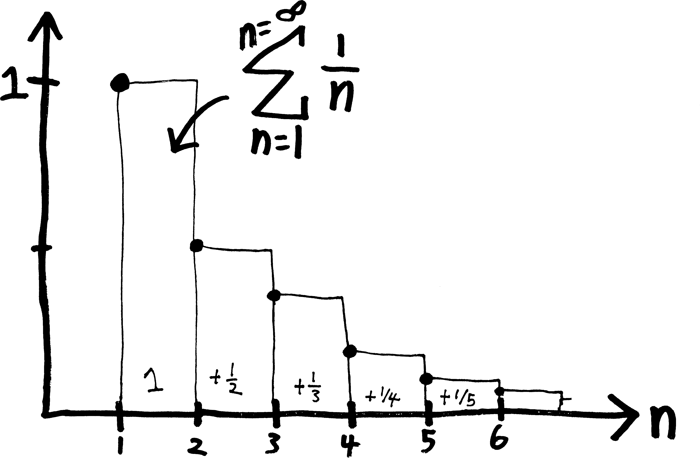
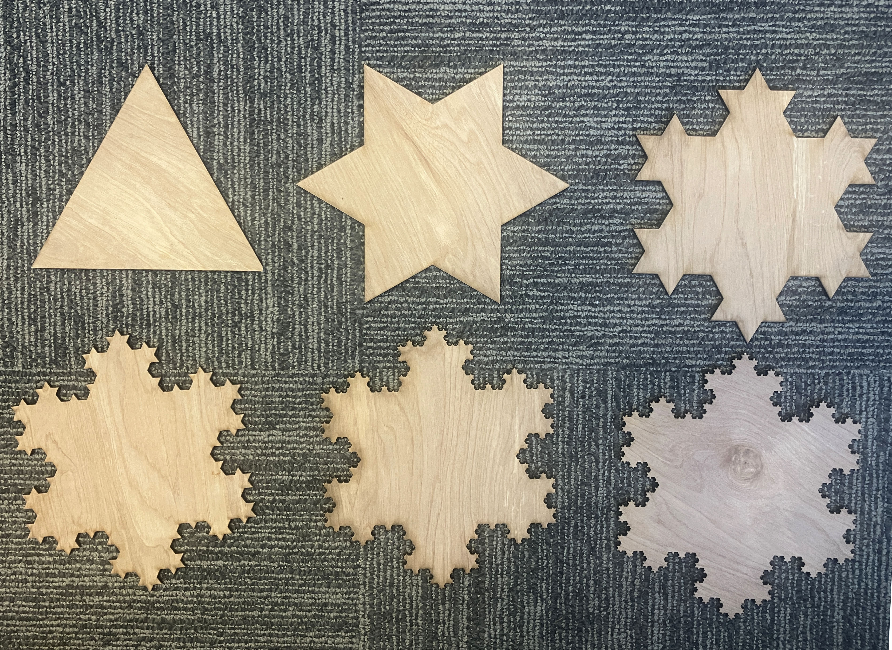

We're trying to begin our investigation into the *infinite*. We're trying to unravel and unwrap the *mysteries of infinity*. But to do so, we need some tools. So here, we'll define a few basic concepts and a few basic bits of notation, so that we can then

## Sequences

We've spent a lot of time in talking about functions. But the functions we've been talking about have been a very specific type: they've been functions that we can think about as being nice, smooth curves in the plane. They've been things that we can easily draw and think of as pretty curves. (**Analytic** is the fancy word for this sort of function. It means, basically, they're things that are kinda like polynomials, or at least that they're things we could write as infinitely-long polynomials!)

But the mathematical concept of a *function* is actually pretty primitive. It just requires that we take elements of one set and turn them into members of another set. Most functions are not smooth, pretty curves! Most functions are weird and unpredictable. We're not going to talk about those weird unpredictable functions, at least not right now, but we are right now going to talk about a slightly different type of function: a function for which the input is not “all real numbers,” but for which the input is “only the natural numbers, i.e., $1, 2, 3,$ etc.” 

We call those functions **sequences**. The name is self-explanatory: they're just an ordered list of numbers. Here are some examples: 

* $1,2,3,4,5,6,\cdots \quad$ (the natural numbers)
* $\displaystyle 1, \frac{1}{2}, \frac{1}{3}, \frac{1}{4}, \cdots\quad$ (fractions!)
* $-1,+1,-1,+1,\cdots  \quad$ (it's flipping back and forth!)
* $3,3,3,3,3,\cdots \quad$( kind of boring)
* $1,4,9,16,25,\cdots \quad$ (squares!)
* $2,4,6,8,\cdots \quad$ (even numbers!)
* $x,x^2,x^3,x^4,\cdots  \quad$ (a sequence of functions, rather than numbers!)
* $15, 23, 8, 14, 4, 9, \cdots \quad$ (no idea what's going on here)

These are all examples of **infinite sequences**, i.e., sequences that could go on forever. We could have finite sequences, too.

Here's a question: above, we listed a bunch of terms of the sequence---the first term, the second term, the third term, etc., etc.---but what will the $n$th term look like?

* $1,2,3,4,5,6,\cdots,n,\cdots$ 
* $\displaystyle 1, \frac{1}{2}, \frac{1}{3}, \frac{1}{4}, \cdots,\frac{1}{n},\cdots$ 
* $-1,1,-1,1,-1,\cdots,(-1)^n,\cdots$
* $3,3,3,3,3,\cdots,3,\cdots$
* $1,4,9,16,25,\cdots,n^2,\cdots$
* $2,4,6,8,\cdots,2n,\cdots$
* $x,x^2,x^3,x^4,\cdots,x^n,\cdots$  
* $15, 23, 8, 14, 4, 9, \cdots, ???, \cdots\quad$ (I literally made this up by using a random number generator, so we can't say too much about it. It's still a sequence, though!)

To come up with those formulas for the $n$'th term of a sequence, I implicitly assumed that we start counting at $n=1$. But that's not carved in stone! We could also start counting at zero. That's popular. (Lots of programming languages, including Python, start counting at $0$!) Or we could start counting from a different first number. Whatver you do, just make it clear where you begin.

If you really like drawing pictures of functions, then I hope you like pointillism, because that's the only way to draw sequences. The output of a sequence can be any real number, but the input is just the natural numbers, so it's just a series of dots. Here's a sketch of what the sequence $f(n) = 1/n$ looks like:

{width=50%}

If we want to fully describe a sequence, then rather than list terms, it's probably a better idea to just give the formula for the $n$th term. Sometimes people do this using normal function notation, like $S(n)$ or $f(n)$; sometimes people do this by putting the variable as a subscript, like $S_n$, rather than in parentheses like normal function notation. 

* $S_n = n \text{ or } f(n) = n \text{ is the sequence } 1,2,3,4,5,6,\cdots,n,\cdots$ 
* $\displaystyle S_n = \frac{1}{n} \text{ or } f(n) = \frac{1}{n} \text{ is the sequence } 1, \frac{1}{2}, \frac{1}{3}, \frac{1}{4}, \cdots,\frac{1}{n},\cdots$ 
* $S_n = (-1)^n \text{ or } f(n) = (-1)^n \text{ is the sequence } -1, 1,-1,1,-1,1,\cdots,(-1)^n,\cdots$
* $S_n = 3 \text{ or } f(n) = 3 \text{ is the sequence } 3,3,3,3,3,\cdots,3,\cdots$
* $S_n = n^2 \text{ or } f(n) = n^2 \text{ is the sequence } 1,4,9,16,25,\cdots,n^2,\cdots$
* $S_n = 2n \text{ or } f(n) = 2n \text{ is the sequence } 2,4,6,8,\cdots,2n,\cdots$
* $S_n = x^n \text{ or } f(n) = x^n \text{ is the sequence } x,x^2,x^3,x^4,\cdots,x^n,\cdots$  

I'm using the letter $n$ there rather than $x$, because, by convention, we tend to use $n$ to represent integers (or natural numbers). That's not a hard-and-fast rule; it's just a typical practice, like how when we're talking about complex numbers we tend to use $z$ rather than $x$. Other letters that tend to represent integers or natural numbers include $i$ (no, not *that* $i$), $j$, $k$, $m$, and $n$. (I don't see $l$ used very often? I guess lowercase $l$ looks too much like $1$.) Context helps, too, to show whether a variable ranges over all possible real numbers (like the $x$ in $f(x)=x^2$) or just over the natural numbers (like the $n$ in $S_n = 2n$). 

Some more related vocab reminders:

* $\mathbb{N}$ is the symbol for the **natural numbers**, i.e. $1,2,3,4,\cdots$. (People argue over whether $0$ should be included.)
* $\mathbb{Z}$ is the symbol for the **integers**, i.e., the natural numbers but with the negatives, i.e. $\cdots -3,-2,-1,0,+1,+2,+3\cdots$. 
* $\mathbb{R}$ are the real numbers
* $\mathbb{C}$ are our beloved complex numbers, which sadly we won't be playing with much anymore
* $\mathbb{H}$ are the Hamiltonians (wait, what are those?)
* and $\in$ is the fancy set-theory suymbol for "is an element/member of," so, e.g., if we write "$n\in\mathbb{N}$" means "the variable $n$ is a member of the set of natural numbers," or just "$n$ is a natural number." So if there's any ambiguity over what possible numbers you intend your variable to represent, toss in a qualifier like this!

Oh! And if you want to waste your time on a mathematical equivalent of Wikipedia, go check out the **[The On-Line Encyclopedia of Integer Sequences (OEIS)](https://oeis.org/)** (``oeis.org``), which is... exactly what it sounds like!!!!

## Whither a sequence???

One of the main questions we can ask about a sequence is: does it **converge** or **diverge**? Meaning:

as $n \rightarrow \infty$, does the sequence either:

approach some single, finite number (**converge**), or 

not? (**diverge**)

As a secondary question, we can ask: 

if it does converge,

 **what does it converge to**?

For example:

* The sequence $S_n = n$, i.e., the sequence $1,2,3,4,\cdots$ diverges, because as $n \rightarrow \infty$, the sequence just keeps getting bigger and bigger, i.e., $S_n \rightarrow \infty$. 
* The sequence $S_n = 1/n$ (i.e., $1, \frac{1}{2}, \frac{1}{3}, \frac{1}{4}, \cdots$) converges, because as $n\rightarrow \infty$, $S_n \rightarrow 0$. So it converges, and moreover, it converges to $0$.
* The sequence $S_n = \frac{(-1)^n}{n}$, i.e., the sequence $-1, \frac{1}{2}, \frac{-1}{3}, \frac{1}{4}, \frac{-1}{5}, \cdots$ converges, because as $n \rightarrow \infty$, $S_n \rightarrow 0$, just as in the last example. Note that, because of the $(-1)^n$, it bounces around---it keeps alternating between being positive and negative. But it still approaches $0$. 
* The sequence $S_n = (-1)^n$, i.e., the sequence $-1,1,-1,1,-1,\cdots$ diverges, because as $n\rightarrow \infty$, the sequence keeps alternating between $+1$ and $-1$. It doesn't reach $\pm \infty$, but nor does it settle down.
* The sequence of functions $S_n = x^{1/n}$, i.e., the sequence $1,x,x^{1/2}, x^{1/3}, x^{1/4}, \cdots$ converges to $x^0$, or just $1$. 

Note that so far we've just been talking about **infinite sequences**, but we could have **finite sequences** as well. Here are some examples:

* $2, 4, 6, 8, 10$ (the first five even numbers)
* $20, 21, 22, 23, 24, 25, 26, 27$ (the eight numbers between $20$ and $27$)
* $-\frac58, -\frac78, -\frac98, -\frac{10}{8}$ (numbers of the form $-\frac{n}{8}$, for $n\in \{ 5,7,9,10\}$)

Usually we're more interested in infinite sequences and series, so if we're not explicit about whether a sequence is finite or infinite, you can assume that it's infinite.

The word we often use for describing what happens to a sequence as we get more and more terms is a **limit**. For example, if we think about the sequence:

$$S_n = \frac{1}{n} = 1,\, \frac{1}{2},\, \frac{1}{3},\, \frac{1}{4},\, \frac{1}{5},\, \cdots$$

The **limit** of this sequence as $n$ goes to infinity is $0$, since that's what all the terms approach. Here's one way of notating that, with an arrow:

$$ S_n \xrightarrow[\quad \infty \quad]{ n } 0 $$

And here's another way of notating that:

$$\lim_{n\rightarrow\infty}S_n = 0$$

## Recursive Sequences

Another fun way to define sequences is **recursively**! In other words, rather than giving an explicit formula for the $n$th term of a sequence, we can just give a formula for how to get from one term to the next. Or, in mathier terms, we have a formula for the $(n+1)$th (st?) term of the sequence, in terms of the $n$th term. Usually if we do this, to define a sequence uniquely, we also have to define what number(s) it starts with (the **base case**). 

Here's a simple example: consider the sequence whose first term is $2$, and for which, if we know the $n$th term, we can get the $(n+1)$nd term by adding $2$ to the $n$th term:
$$S(0) = 2; \quad S(n+1) = n+2$$
Of course this is just another way of defining the even numbers:
$$2, 4, 6, 8, \cdots$$
Let's see something slightly more interesting. You're probably familiar with the **Fibonacci sequence**, given by two starting numbers:
$$F_0 = 0; \quad F_1 = 1$$
And the recursive formula:
$$\displaystyle F_n =F_{n-1}+F_{n-2}$$
(I'm using an $F$ for the label rather than an $S$ or some other letter, because $F$ stands for Fibonacci.) So in other words, we find the $n$th term by adding together the previous two terms:
$$0, 1, 1, 2, 3, 5, 8, 13, 21, 34, 55, \cdots$$
Having a recursive formula is cool, because recursion is a cool concept (and very cool and useful when it comes to programming!). There are some situations where having a formula written recursively is more convenient (or easier to find) than an **explicit formula** or **closed-form solution**, i.e., a formula that actually tells us how to find the $n$th term for any $n$. On the other hand, the thing that's more useful about having an explicit formula for the sequence is that it gives us a way of finding the one zillionth term directly without having to find all the one zillion terms that go before it. 

It takes a lot of work to derive, but as it so happens there's also a way to write the Fibonacci numbers explicitly, i.e., find a closed-form solution for the sequence:
$$F_n={\cfrac {1}{\sqrt {5}}}\left({\cfrac {1+{\sqrt {5}}}{2}}\right)^{n}-{\cfrac {1}{\sqrt {5}}}\left({\cfrac {1-{\sqrt {5}}}{2}}\right)^{n}$$
This formula, if you just look at it, is totally nuts---somehow, for any value of $n$ we plug on (or at least, any positive integer $n$), we get out another positive integer! There are all those fractions, and the square roots of five, and the powers---if you just looked at it, you'd expect it to **not** be an integer!!! And yet it always works out to be an integer. Crazy. 

## Series 

So, those are sequences. They're kind of cool, but not *that* cool, because they're easy to deal with. If we want to find whether a sequence converges, we just take a limit!^[You may not have seen that word yet, but it's the same basic idea as when we're finding the end behavior of a polynomial or rational function. As a function gets bigger and bigger, what happens to it?] Not too difficult. (At least, not if you know limits.) But what if we add all the terms in a sequence together? For instance:
$$\text{rather than having the sequence: } 1,\frac{1}{2},\frac{1}{3},\frac{1}{4},\cdots$$
$$\text{what if we have the series: } 1+\frac{1}{2}+\frac{1}{3}+\frac{1}{4}+\cdots$$
This is a different creature. We know that the sequence converges, but we don't know whether the series (in which we add everything together) converges. The sequence converges to $0$, because that's where all the terms go, but what if we add up all the terms? Does it still converge? (If so, to what?)

More formally, a **series**, or a **sum**, is when we add the terms of a sequence together, rather than simply listing them. They could be **finite** (we add together a finite number of terms) or **infinite** (we add together an infinite number of terms). 

Here's an example of a finite series:

$$5+10+15+20$$

Here's an example of an infinite series:

$$5 + 10 + 15 + 20 + 25 + \cdots$$

That second infinite series isn't very interesting. It's just $\infty$. But what we'll see, soon, is that we can have some serieses, with an infinite number of things added together, *that actually aren't infinite*. We add together *an infinite number of things*, and yet rather than getting infinity, *we get a finite number*. 

But more mechanics first. There are three different ways (at least?) that we can write series:

* We could show each term explicitly: $5+10+15+20$
* We could write it as a single number: $50$
* or we could write it using $\Sigma$-notation for sums: $\displaystyle \sum_{k=1}^{k=4} 5k$

You may or may not have seen $\sum$-notation before. It works something like this:

\begin{align*}
\displaystyle \sum_{k=1}^{k=4} 5k \,&=\, \underbrace{5\!\cdot \!1}_{\mathclap{\text{the }k=1\text{ term}}} \,+\, \overbrace{5\!\cdot \!2}^{\mathclap{\text{the }k=2\text{ term}}} \,+\,\underbrace{5\!\cdot \!3}_{\mathclap{\text{the }k=3\text{ term}}} \,+\,\overbrace{5\!\cdot \!4}^{\mathclap{\text{the }k=4\text{ term}}} \\ \\
&= 5+10+15+20 \\ \\
&= 50
\end{align*}

$\Sigma$ is the Greek letter analagous to our "S" (capital S), hence its use to represent a *s*um. (Lowercase sigma, which you might have seen if you've done any statistics, is this cute little curlicue: $\sigma$).

If you've done any coding, you can think of $\Sigma$-notation as a `for`-loop. We have some dummy variable (in the above case, $k$), and we iterate over it, first setting $k$ equal to $1$, then $k$ equal to $2$, and so forth, until we finally get to $k=4$, substituting that into the expression, and then add together all the results. The bounds are **inclusive**, meaning we include both the starting and the ending numbers (as opposed to those being the last ones not included).

More generally, we could define this notation by writing something like:

\begin{align*}
\sum_{k=a}^{k=b} f(k) \,&=\, f(a) + f(a+1) + f(a+2) + \cdots + f(b-2) + f(b-1) + f(b)
\end{align*}

Most people tend to write $\sum$-notation with the dummy variable/counter only on the bottom, like this:

$$\text{more mainstream:}\quad \sum_{k=a}^{b} \text{(blah blah)}$$

But I find it more clear to repeat it on top and bottom:

$$\text{Andrew's slight variation: } \quad \sum_{k=a}^{k=b} \text{(blah blah)}$$

When I first learned it, I found it hard to keep track of which variable represented the counter, which represented the starting index, and which represented the ending index. So repeating the counter on top and on bottom was a way for me of making that easier to see. It's redundant, and more writing, but that's fine! More clarity and more understanding is (by definition) worth sacrificing minimalism for (although there's lots of nuance I could add there). The broader lesson here is that *notation is meant to serve us*, the humans. We humans don't serve the notation. If you find a particular piece of mathematical notation confusing, or if you find yourself 

Sometimes people don't like my version, because if we have an infinite series, then it implies that something is *equal* to infinity, which some people object to:

$$\text{ontologically suspect implications: } \quad \sum_{k=a}^{k=\infty} \text{(blah blah)}$$

But, you know, we'll save that discussion for a later date.

If you like drawing pictures of things (which you should!), you don't have to like pointillism to like drawing series, but you do have to like staircases (rather than ramps). Here's an example of a way you might draw the series $1/n$ (starting at $n=1$):

{width=50%}

In this picture, the top of each stair corresponds to the value of each term; the width of each stair is $1$, so the total area underneath that blocky staircase corresponds to the value of the series itself. 

If we have an infinite series, we can't write every term explicitly. There are an infinite number of them! But we can ask the same question we ask of sequences: given a series, **does it converge or diverge?** Meaning:

* is the infinite sum finite (does it **converge**?)
* or is it infinite? (does it **diverge**?)
* or does it maybe bounce around between finite numbers, not zooming off to infinity, but also not approaching some single finite number (a different type of **divergence**)

For series, this is a much harder question to answer^[Also note that it's really only an interesting question to ask about *infinite* series, since finite series obviously converge to whatever they add up to.]. With sequences, we can just take a limit; with series, we have a smattering of *ad hoc* methods, some of which might or might not work for a given series. That can be frustrating! There's no, like, master equation we can plug a series in to to figure out whether it converges. But this, too, is meaningful. It's deeply reflective of how we have to approach reality as human beings. There are two fallacies we can fall into:

* we can know nothing
* we can know everything

Neither of these are true. Our reality, as humans, is somewhere in between. We can know things, and we should strive to know things, while also accepting and acknowledging that we'll never know things perfectly and completely. Here's an excerpt from something I was reading recently to that effect:

> I’m convinced we need a fundamental shift in human psychology from arrogance
and hubris to humility. My years at [this college] have helped me refect very differently on education and its purpose. And it has made me value what I think a liberal arts education is supposed to inculcate, differently. I deeply believe that the major outcome of a liberal arts education should be humility.
>
> We know we can have glimmers of understanding. We also know that what we don’t know dwarfs what we do know. We don’t know why we’re on this planet. We don’t know what our lives were intended to be or what our species is intended to be. One of the best things [this college] does for students is help them understand how important it is to increase our knowledge, and how limited it is even at
its peak.^[*A Presidential Conversation on the State of the College* (2024 St. John's College annual report), https://www.sjc.edu/application/files/7317/1053/2012/2024-State-of-the-College-Report-St-Johns-College.pdf]

Perhaps we should think of our knowledge as being like a sequence or a limit or an asymptote. It can get better and better but it can never actually *be* perfect, just like how the series:

$$1 + \frac{1}{4} + \frac{1}{8} + \frac{1}{16} + \frac{1}{32} + \cdots$$

gets closer and closer to $2$ but (depending on your philosophical beliefs) never actually *is* 2.

Lacking perfection, and lacking the God's-eye-view of a formula, instead we can try to come up with a plethora of particular methods and techniques and make a toolbox. One method might be useful for telling us something about one series, but useless in telling us anything about a different series. (Once we know calculus, we'll have even *more* tools which which to analyze series!)

So, next time, let's start poking at series, and see if we can come up with some simple rules and observations. 

## Sequences are not series!

One last thing: don't get the terms **sequence** and **series** confused. I do it all the time. Don't follow my example:

$$\begin{align*}
\text{\bf This is a sequence: }\,\,& 1,2,3,4,5,6,\cdots,n,\cdots \\ \\
\text{\bf This is a series: } \,\,&1+2+3+4+5+6+\cdots +n+\cdots
\end{align*}$$

The mnemonic I use to remember which is which is that **series** and **sum** both start with "**s**." 

## Problems 

Find a formula for the $n$th term of the sequence. (You can have $n$ start at $0$ or at $1$ or at wherever you want; just be clear what your choice is and where it starts.)

<ol class='problems'>
<li> $1,3,5,7,9, \cdots$ </li>
<li> $2,4,6,8,10,\cdots$ </li>
<li> $1,-1,1,-1,1, \cdots$ </li>
<li> $-1,1,-1,1,-1,\cdots$ </li>
<li> $1,-4,9,-16,25, \cdots$ </li>
<li> $1,-\frac{1}{4},\frac{1}{9},-\frac{1}{16},\frac{1}{25},\cdots$ </li>
<li> $0,3,8,15,24,\cdots$ </li>
<li> $-3,-1,-1,0,1,\cdots$ </li>
<li> $1,5,9,13,17, \cdots$ </li>
<li> $2,6,10,14,18,\cdots$ </li>
<li> $2,3,5,7,11,13,17,19,23,29, \cdots$ </li>
</ol>

 

Here are a bunch of series written in $\Sigma$-notation! Write them out explicitly, without the giant $\Sigma$.

<ol class='problems'>
<li> $\displaystyle \sum_{k=0}^{k=3}(3k+1)$ </li>
<li> $\displaystyle \sum_{k=0}^{k=4}\left(2^k\right)$ </li>
<li> $\displaystyle \sum_{k=3}^{k=6}\left(\frac{(-1)^k}{k!}\right)$ </li>
<li> $\displaystyle \sum_{k=2}^{k=5}\frac{1}{3^{k-1}}$ </li>
</ol>

 

Here are a bunch of sums written out explicitly! Write them more compactly in $\Sigma$-notation.

<ol class='problems'>
<li> $1+3+5+7+\cdots+21$ </li>
<li> $1-3+5-7+\cdots - 19$ </li>
<li> $1\cdot2 + 2\cdot3 + 3\cdot4 + \cdots + 35\cdot36$ </li>
<li> $f(x_1)\Delta x_1 + f(x_2)\Delta x_2 + \cdots + f(x_n)\Delta x_n$ </li>
<li> $1 + \frac{1}{10} + \frac{1}{100} + \frac{1}{1000} + \cdots$ </li>
<li> $\cos(3\theta) + \cos(4\theta) + \cos(5\theta) + \cdots$ </li>
</ol>

For each of the following sequences, write out the first few terms, and then determine whether it converges or diverges. If it converges, what does it converge to? 

<ol class='problems'>
<li> $\displaystyle S_n = \frac{1-n}{n^2}$ </li>
<li> $\displaystyle f(n) = \frac{1}{n!}$ </li>
<li> $\displaystyle f(n) = \frac{1}{n} + 7$ </li>
<li> $\displaystyle f(n) = \frac{1}{2^n}$ </li>
<li> $\displaystyle f(n) = \frac{1}{\ln(n)}$ </li>
<li> $\displaystyle f(n) = \frac{n!}{2^n}$ </li>
<li> $\displaystyle f(n) = \frac{2^n}{n!}$ </li>
<li> $\displaystyle f(n) = \frac{n^2}{n!}$ </li>
<li> $\displaystyle f(n) = \frac{n^2}{n!} + 2$ </li>
<li> $\displaystyle f(n) = \frac{n!}{n^2}$ </li>
<li> $\displaystyle f(n) = \frac{\ln(n)}{n^2}$ </li>
<li> $\displaystyle f(n) = \frac{n^2}{\ln(n)}$ </li>
<li> $\displaystyle f(n) = \frac{\sqrt{n}}{\ln(n)}$ </li>
<li> $\displaystyle f(n) = \frac{\ln(n)}{\sqrt{n}}$ </li>
<li> $\displaystyle f(n) = \frac{(-1)^{n+1}}{2n-1}$ </li>
<li> $S_n = 2 + (-1)^n$ </li>
<li> $S_n = 2 + (0.1)^n$ </li>
<li> $S_n = 2 + (-0.1)^n$ </li>
<li> $S_n = 2 + (1)^n$ </li>
<li> $S_n = (-1)^n$ </li>
<li> $\displaystyle f(n) = \frac{1}{(-1)^n}$ </li>
<li> $\displaystyle S_n = \frac{n + (-1)^n}{n}$ </li>
<li> $\displaystyle S_n = 4 - \frac{3}{n^2}$ </li>
<li> $\displaystyle S_n = \frac{1-2n}{1+2n}$ </li>
<li> $\displaystyle f(n) = \frac{2n+1}{1-3\sqrt{n}}$ </li>
<li> $\displaystyle S_n = \frac{1-5n^4}{n^4 + 8n^3}$ </li>
<li> $\displaystyle f(n) = \frac{n+3}{n^2 + 5n + 6}$ </li>
<li> $\displaystyle f(n) = \frac{n^2 - 2n + 1}{n-1}$ </li>
<li> $\displaystyle f(n) = \frac{5n^3+1}{10n^3-3n^2+7}$ </li>
<li> $\displaystyle S_n = \frac{1-n^3}{70-4n^2}$ </li>
<li> $S_n = 1 + (-1)^n$ </li>
<li> $\displaystyle f(n) = (-1)^n \left( 1-\frac{1}{n} \right)$ </li>
<li> $\displaystyle S_n = \left( \frac{n+1}{2n} \right) \left( 1- \frac{1}{n} \right)$ </li>
<li> $\displaystyle S_n = \left( 2 - \frac{1}{2^n} \right) \left( 3+\frac{1}{2^n} \right)$ </li>
<li> $\displaystyle f(n) = \frac{(-1)^{n+1}}{2n-1}$ </li>
<li> $\displaystyle S_n = \left(-\frac{1}{2} \right)^n$ </li>
<li> $\displaystyle f(n) = \frac{\sin(n)}{n}$ </li>
<li> $\displaystyle f(n) = \frac{\sin^2(n)}{2^n}$ </li>
<li> $\displaystyle S_n = \sqrt{\frac{2n}{n+1}}$ </li>
<li> $\displaystyle f(n) = \sin\left(\frac{\pi}{2} + \frac{1}{n}\right)$ </li>
<li> $f(n) = \ln(n) - \ln(n+1)$ </li>
<li> $\displaystyle f(n) = \frac{n}{2^n}$ </li>
<li> $\displaystyle f(n) = \frac{3^n}{n^3}$ </li>
<li> $\displaystyle f(n) = \frac{\ln(n+1)}{\sqrt{n}}$ </li>
<li> $\displaystyle f(n) = \frac{\ln(n)}{\ln(2n)}$ </li>
<li> $f(n) = 8^{1/n}$ </li>
<li> $f(n) = (0.03)^{1/n}$ </li>
<li> $\displaystyle f(n) =\frac{(n+1)!}{n}$ </li>
<li> $\displaystyle f(n) =\frac{(3n-1)!}{(3n+1)!}$ </li>
</ol>

Which of the following series converge, and which diverge? Why? For those that converge, can you determine what they converge to? Don't just give an answer---write out an actual *argument*, with your thinking and reasoning!

<ol class='problems'>
<li> $\displaystyle\sum_{n=0}^{n=\infty} \left(\frac{1}{5}\right)^n$ </li>
<li> $\displaystyle\sum_{n=2}^{n=\infty} \left(\frac{1}{5}\right)^n$ </li>
<li> $\displaystyle\sum_{n=0}^{n=\infty} \frac{1}{5^n}$ </li>
<li> $\displaystyle\sum_{n=0}^{n=\infty} \frac{1}{2^{n+3}}$ </li>
<li> $\displaystyle\sum_{n=0}^{n=\infty} \frac{2^{n+3}}{3^n}$ </li>
<li> $\displaystyle\sum_{n=0}^{n=\infty} \frac{3^{n-1}}{4^{3n+1}}$ </li>
<li> $\displaystyle\sum_{n=0}^{n=\infty} (-1)^n\left(\frac{1}{5}\right)^n$ </li>
<li> $\displaystyle\sum_{n=0}^{n=\infty} \left(\frac{1}{\sqrt{2}}\right)^n$ </li>
<li> $\displaystyle\sum_{n=1}^{n=\infty} \ln(n)$ </li>
<li> $\displaystyle\sum_{n=1}^{n=\infty} \frac{1}{n}$ </li>
<li> $\displaystyle\sum_{n=20}^{n=\infty} \frac{1}{n}$ </li>
<li> $\displaystyle\sum_{n=1}^{n=\infty} \frac{1}{n\cdot2^n}$ </li>
<li> $\displaystyle\sum_{n=1}^{n=\infty} \ln(1/n)$ </li>
<li> $\displaystyle\sum_{n=1}^{n=\infty} (-1)^{n+1}\frac{3}{2^n}$ </li>
<li> $\displaystyle\sum_{n=1}^{n=\infty} \left(\sqrt{2}\right)^n$ </li>
<li> $\displaystyle\sum_{n=0}^{n=\infty} \cos(n\pi)$ </li>
<li> $\displaystyle\sum_{n=0}^{n=\infty}\frac{\cos(n\pi)}{5^n}$ </li>
<li> $\displaystyle\sum_{n=0}^{n=\infty} e^{-n}$ </li>
<li> $\displaystyle\sum_{n=0}^{n=\infty} e^{-2n}$ </li>
<li> $\displaystyle\sum_{k=0}^{k=\infty} \left( \frac{5}{2} \right)^{-k}$ </li>
<li> $\displaystyle\sum_{k=0}^{k=\infty} \frac{1}{k^2}$ </li>
<li> $\displaystyle\sum_{k=1}^{k=\infty} \frac{1}{k^2}$ </li>
<li> $\displaystyle\sum_{k=1}^{k=\infty} \frac{2}{k^4}$ </li>
<li> $\displaystyle\sum_{k=1}^{k=\infty} \frac{\ln k}{k^2}$ </li>
<li> $\displaystyle\sum_{n=1}^{n=\infty}\frac{n^2+1}{n}$ </li>
<li> $\displaystyle\sum_{n=1}^{n=\infty}(-1)^{n+1}n$ </li>
<li> $\displaystyle\sum_{n=1}^{n=\infty} \frac{2}{10^n}$ </li>
<li> $\displaystyle\sum_{n=0}^{n=\infty} \frac{2^n-1}{3^n}$ </li>
<li> $\displaystyle\sum_{n=1}^{n=\infty} \frac{n!}{1000^n}$ </li>
<li> $\displaystyle\sum_{n=0}^{n=\infty} x^n$ </li>
<li> $\displaystyle\sum_{n=0}^{n=\infty} (-1)^nx^n$ </li>
<li> $\displaystyle\sum_{n=0}^{n=\infty} (-1)^nx^{2n}$ </li>
<li> $\displaystyle\sum_{k=1}^{k=\infty} \frac{\ln \left(\sqrt{k}\right)}{k^2}$ </li>
<li> $\displaystyle\sum_{k=0}^{k=\infty} \frac{1}{2+3^{-k}}$ </li>
<li> $\displaystyle\sum_{k=0}^{k=\infty} \frac{1}{2+3^{k}}$ </li>
<li> $\displaystyle\sum_{n=1}^{n=\infty} \ln\left(\frac{n}{n+1}\right)$ </li>
<li> $\displaystyle\sum_{n=1}^{n=\infty} \left(\frac{1}{\sqrt{n}} + \frac{1}{\sqrt{n+1}} \right)$ </li>
<li> $\displaystyle\sum_{n=1}^{n=\infty} \left(\frac{1}{2^{1/n}} - \frac{1}{2^{1/(n+1)}} \right)$ </li>
<li> $\displaystyle\sum_{n=1}^{n=\infty} \left( \frac{1}{\ln(n+2)} - \frac{1}{\ln(n+1)} \right)$ </li>
<li> $\displaystyle\sum_{n=1}^{n=\infty} \left( \frac{1}{n^2+n} \right)$ </li>
<li> $\displaystyle\sum_{n=1}^{n=\infty} \left( \frac{1}{n} - \frac{1}{n+1} \right)$ </li>
<li> $\displaystyle\sum_{k=0}^{k=\infty} \frac{k}{k^2+1}$ </li>
<li> $\displaystyle\sum_{k=0}^{k=\infty} \frac{1}{3k+2}$ </li>
<li> $\displaystyle\sum_{n=0}^{n=\infty} e^n$ </li>
<li> $\displaystyle\sum_{k=0}^{k=\infty}ke^{-k^2}$ </li>
<li> $\displaystyle\sum_{k=0}^{k=\infty} k^2 2^{-k^3}$ </li>
<li> $\displaystyle\sum_{n=0}^{n=\infty} \left(\frac{1}{\sqrt{2}}\right)^n$ </li>
</ol>

<ol class='problems'>

<li> The formula we came up with for a geometric series requires that the series starts at $n=0$:

$$\sum_{n=0}^{n=\infty}a^n = \text{(whatever the formula was)}$$

a. But what if we have a geometric series that starts not at $n=0$, but $n=1$, like $\displaystyle\sum_{n=1}^{n=\infty}a^n$? Can you come up with a formula for it?

b. What about $\displaystyle\sum_{n=-2}^{n=\infty}a^n$? Can you come up with a formula? 

c. How about, more generally, if we have a series that starts at some random index $k$ (where $k$ could be any integer)? Can you come up with a formula???
$$\displaystyle \sum_{n=k}^{n=\infty}a^n \quad=\quad ???$$
</li>

<li> We've made up this cool $\sum$ notation for iterated (and possibly even infinite) sums! When we make up new notations, it's helpful to figure out what algebraic properties they have, so we can, like, do algebra and simplify and transform and manupulate stuff.

We've figured out that we can pull constants out of sums: 
$$\sum_{n} c \cdot f(n) \, =\, c \cdot \sum_{n} f(n)$$

<ol>
<li> Can we also split up sums along addition?
$$\sum_{n} f(n) + g(n) \,\stackrel{???}{=}\, \sum_{n} f(n) + \sum_{n}  g(n)$$
</li>

<li> What about along multiplication?
$$\sum_{n} f(n) \cdot g(n) \,\stackrel{???}{=}\, \sum_{n} f(n) \cdot \sum_{n}  g(n)$$ </li>

<li> What about division?</li>
<li> Subtraction? </li>
</ol>
For all of these questions, give some examples to show that we either can or can't, and then prove it. (To prove that we *can't* do this, a single counter-example is enough.) (Is there a difference in how these theorems hold or don't hold if the sum is finite or infinite?) </li>

<li> Remind yourself, or go look up, how to do a "partial fraction decomposition" (a fancy method for turning *one* fraction into *two* fractions). Then use it to help determine whether this series converges:
$$\displaystyle\sum_{n=1}^{n=\infty} \frac{3+2n}{n^2+3n+2}$$ </li>

<li> Do the same for this series:
$$\displaystyle\sum_{n=2}^{n=\infty} \frac{1}{n^3-n}$$ </li>

<li>And this: 
$$\displaystyle\sum_{n=2}^{n=\infty} \frac{1}{n^2-n}$$ </li>

<li>For what values of $p$ does the series $\displaystyle\sum_{k=1}^{k=\infty} k^p$ converge? for what values of $p$ does it diverge? </li>

<li> Decide how to properly pluralize "series." </li>

<li> Elizabeth S. was thinking about all this series stuff, and about the classic proof that:
$$0.\overline{9}=1$$
Probably many of you have seen that proof (indeed, I have a *vivid* memory of seeing it myself first in Mrs. Richards' math class in 7th grade). You say that $x=0.\overline{9}$, then multiply $x$ by $10$, getting:
\begin{align*}
x &= 0.9999\overline{9} \\
10x &= 9.9999\overline{9}
\end{align*}
And then you subtract $x$ from both sides, getting:
\begin{align*}
10x - x &= 9.9999\overline{9} - x \\
10x - x &= 9.9999\overline{9} - 0.\overline{9} \\
9x &= 9 \\
x &= 1
\end{align*}
So:
$$0.\overline{9} = 1$$
Voila. But, anyway, Elizabeth was thinking about how $0.\overline{9}$ feels kinda like a series! It feels like:
$$0.\overline{9} = 0.9 + 0.09 + 0.009 + 0.0009 + \cdots$$
So... can you link up these ideas? Can you use these ideas of infinite geometric series to come up with a *second* proof that $0.\overline{9}=1$???

<li>Here's a fun series:

$$\sum_{n=0}^{n=\infty} \frac{(-1)^n}{2n+1} $$

Does it converge? Does it diverge? Can you figure out what it converges to? (If you can't figure out analytically (i.e., symbolically) what it converges to, can you try to estimate it using a computer?) 

<li> You want to measure how tall a particular skyscraper in downtown San Francisco is, and for some reason you lack conventional measuring instruments, but you do have a giant bouncy rubber ball, equipped with some fancy sensors. You know that the ball rebounds $75\%$ after each bounce. So you drop it off the very top of the skyscraper, and it bounces a bunch, and eventually settles down, and the sensors tell you that the total vertical distance the ball travelled is $3,412$ feet. (Why the sensors can tell you this, and not how long the initial drop was, I have no idea.) How tall is the skyscraper? Which skyscraper are you atop? </li>

<li> The following is a sketch of a fractal, constructed by taking a square, drawing a square inside of it using the midpoints as corners, drawing a square inside of that using the midpoints as corners, and so forth, *ad infinitum*. Find a) the total area enclosed by all the squares, and b) the total perimeter of all the squares.

{width=50%}

</li>

<li> Here are the first six iterations of a beautiful fractal I laser-cut in the i-Lab:

{width=75%}

This fractal is Helge von Koch's snowflake curve, known generally as the **Koch curve** or **Koch snowflake**. It is drawn by taking an equilateral triangle, then pasting on three equilateral triangles in the center-third of each side, then pasting on equilateral triangles into the center-third of the sides of the triangles constructed in the previous step, and so forth.

<ol>
<li> When I cut these out on the laser-cutter, the first iteration had a side length of seven inches. The sixth and final iteration, with tiny triangle nubs just a few hundredths of an inch wide, took about $20$ minutes for the laser cutter to completely cut out. How fast was the laser cutter moving during that final iteration? </li>
<li> What's the total area enclosed by a Koch snowflake? (By this I mean in the limiting case; the snowflake as the numer of iterations becomes infinite.)</li>
<li> What's the perimeter of a Koch snowflake?</li>
<li> Here's a better way to phrase the previous two questions: suppose you go to the i-Lab and laser-cut the actual, infinite version of the Koch snowflake. How long would it take to cut it out? How much material would it take?
</ol>

</li>

<li> Just like we can make iterated and infinite sums with a giant $\Sigma$, we can also make iterated and infinite products! In other words, rather than *adding* a whole bunch of things together, we can *multiply* a whole bunch of things! The notation we use for it is a giant $\Pi$---it's a giant **p**i for **p**roduct, contra the giant **s**igma for **s**um.
<ol>
<li> Write out all the terms---well, I guess we should say, *factors*---of $\displaystyle \prod_{k=0}^{k=3}\left(2^k + 3\right)$ </li>
<li>Consider the iterated product $\displaystyle \prod_{k=1}^{k=n}(k)$. Do we have another name for this function? </li>
<li>Consider the infinite product $\displaystyle \prod_{k=1}^{k=\infty}\frac{1}{k}$. Does it converge or diverge? If the former, to what does it converge? How about $\displaystyle \prod_{k=1}^{k=\infty}\frac{2}{5k+70}$?</li>
<li>What algebraic properties can we learn about iterated products (like the properties of iterated sums in problem 116)? Can we pull constants out? Can we split them up along addition? Can we split them up along multiplication? </li>
</ol>

</li>

<li> Here's another infinite product:

$$2 \cdot \left[ \left( \frac {2}{1}\cdot \frac {2}{3} \right) \cdot \left( \frac {4}{3}\cdot \frac {4}{5} \right) \cdot \left( \frac {6}{5}\cdot \frac {6}{7} \right) \cdot \left( \frac {8}{7}\cdot \frac {8}{9} \right) \cdots \right]$$

So there's a $2$ on the outside, but then the entire interior is this long infinite product. I'm using the square brackets instead of (round ones) just for clarity.

<ol>
<li> Write this product in $\Pi$ notation. </li>
<li>Calculate the first few products. In other words, see what happens when you calculate this product from $n=1$ to $n=2$, then from $n=1$ to $n=3$, then from $n=1$ to $n=4$, then from $n=1$ to $n=5$, etc., multiplying on a new factor each time. Does it look like the product is converging, or diverging? If it looks like it's converging, what does it look like it's converging to? Using a spreadsheet or writing a short computer program is helpful here, since it takes a long time to converge, slash for it to become apparent what it converges to. Note that you can solve this part even if you didn't figure out how to write this product in $\Pi$ notation, as long as you can figure out in a more general sense what the pattern's doing.) </li>
</ol>

</li>

<li> Iterated sums, iterated products---what about *iterated exponents*?!? </li>

<li> Look up another test for series convergence/divergence (on the internet or in a textbook or wherever, different from the ones we've discussed in these notes), figure out how and why it works, and explain it, both in writing and (potentially) to the class. 
<li> **Percentages are nonlinear.** Suppose it takes you six hours to drive from SF to LA going 60mph. If you increase your speed by $100\%$---i.e., double it---then the time it takes to get to LA doesn't go down by $100\%$. You don't get to LA in zero hours by driving 120mph. (Among other things, this would violate conservation of energy.) Even if you increase your speed by only $50\%$, you don't decrease the amount of time it takes to get to LA by $50\%$.

a. Why not? How long would it take? Figure it out.

On the other hand, if you're dealing only with *small* differences in speed, increasing your speed by $x\%$ *will* decrease your travel time by $x\%$ (roughly, approximately).

b. Verify that this is true in this specific example. For instance, if you increase your speed by $2\%$, how long will it take to get to LA? How does that compare to $98\%$ of six hours? (You can use a small percentage other than $2\%$ if you like!)

c. Most importantly, *why* is this true? Make an argument for why, as long as $x$ is reasonably small, if you increase your speed by $x\%$, your travel time will decrease by about $x\%$.

*(Inspired by a conversation on this topic, as reported to me, between Scott Kovach and Aamnah Khalid while driving from SF to Death Valley; the conversation apparently involved them trying to compute a particular Taylor series out loud, without pen or paper, while driving... which is sort of a hint, but then again, I originally wrote this as a calc problem, and Lachlan Chu pointed out that it could be solved only using Math 3 tools.)*
</li>

<li> Here's a cool sequence:
$$ \sqrt{2}, \quad \sqrt{2+\sqrt{2}}, \quad \sqrt{2+\sqrt{2+\sqrt{2}}}, \quad \cdots$$
<ol>
<li> Can you come up with a recursive definition for this sequence? That is, can you write a formula for the $(n+1)$st term, in terms of the $n$th term? </li>
<li> Compute the first few terms of this sequence. Does it seem to be converging, or diverging? If it seems to be converging, what does it seem to be converging to? Why? </li>
<li> Call this sequence $S$, i.e., let
$$S = \sqrt{2+ \sqrt{2+\sqrt{2 + \cdots}}}$$
Can you rewrite the right side of this equation so that it also has an $S$ in it? Having done that (and thus having $S$ on both sides of this equation), can you solve this equation for $S$? What do you conclude? </li>
<li> **Liam Percer's problem**: what if we ask these same questions, but with *cube* roots? I.e.:
$$\sqrt[3]{2},\quad \sqrt[3]{2 + \sqrt[3]{2},\,\, },\quad \sqrt[3]{ 2+ \sqrt[3]{2 + \sqrt[3]{2},\,\, }}, \quad \cdots$$ </li>
</ol>
</li>

<li> Suppose you want to balance a laptop on the edge of the table so that it's partially hanging off the edge (or, to use a fancy word, so that it's *cantilevered* off the edge). How far over the edge can you push it? It's not that hard to figure out, either in practice or in theory, that you need to have at least half the laptop on the table:

(*Imagine a picture here of a laptop balancing precariously half-off the edge of a table!*)

The physics explanation is that then the torques balance out and whatnot. But what if you want to balance *two* laptops on top of each other, cantilevering over the edge?

(*Imagine a picture here of* two *laptops balancing precariously on the edge of a table!*)

Now we need to have at least half of their *combined* center of mass over the table. Which means that the top laptop we can push out further! So, how far? How far out can you get the stack of two laptops to go? 

What if we have three laptops? Four laptops? $n$ laptops? Is it possible to stack so many laptops so that the top laptop is, in fact, *not at all* over the table??? What if we want the edge of the top laptop to be, say, $10$ feet away from the edge of the table? How many laptops would we need to stack? (Probably it would help to define/instantiate some variables in here.) What if we want to have a giant stack of laptops, the topmost of which ends $100$ feet away from the edge of the table? Is it possible? How many laptops would it take?!?! Try to work this all out both theoretically (i.e., with math), and experimentally (i.e., with actual laptops or similarly-shaped objects). 

Here's an photo of me attempting this demo in May 2024 in Block 4:

{width=100%}

</li>

<li> Pick an arbitrary positive integer. $5$, $37$, $98543$, whatever. Then use it to create a sequence by doing the following: generate the next number in the sequence by either:
<ul>
<li> dividing the number by $2$, if the initial number is even, or </li>
<li> multiplying the number by $3$, and then adding $1$, if the initial number is odd </li>
</ul>
and then repeat the process. In other words, if your first number is $S(n)$, then:
$$S(n+1) = \begin{cases} S(n)/2 &\text{if } n \text{ is even} \\ 3S(n)+1 & \text{if } n \text{ is odd} \end{cases}$$
So, for instance, if your first number is $7$, the sequence might start like:
$$7, \quad (3\cdot 7 + 1) = 22, \quad (22/2) = 11, \quad (11\cdot 3 + 1) = 34, \quad (34/2) = 17, \quad \cdots$$
or, without showing the work:
$$7, 22, 11, 34, 17, \cdots$$
So, pick some random number, and generate a bunch of terms of the sequence. Keep generating terms until something very boring starts happening. It might take a while. You might need to use a calculator; even better, write a short computer program or a spreadsheet, to save yourself the trouble of doing all that repetitive arithmetic. Try it starting with different numbers. What happens? Does the sequence converge, or diverge? If it converges, what does it converge to? Make a conjecture. Can you prove it?

If you can prove that the sequence converges (for any initial starting number), I'll buy you a box of donuts every single day for the rest of the time we're both at Nueva together. 

</li>
</ol>
