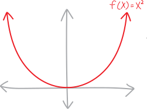
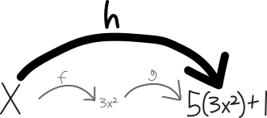
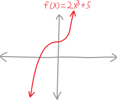
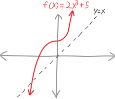
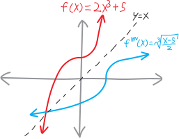

We do things. We undo things.

   

We do things. We don't things.

   

Often in our class we elide^[This is a cool word that I only learned as an adult! Look it up. **Elision** is the noun form.] the distinction between a **function** and a **curve**. For example, we can conceptualize a parabola as being this nice, lovely, one-dimensional curve, twirling through two-dimensional space:

{width=50%}

We can also conceptualize it as a function. Thought of as a function, it's a machine that takes in some input and spits out some output. In the case of a parabola, we take some input, square it, and spit that out:

{width=50%}

This might seem like a distinction without a difference. In our class, it mostly is. We care about curves *qua* curves. We want to understand curves and shapes; functions are merely a way of describing and interacting with them. 

But it's worth lingering, momentarily, on this idea of a **function**. You learn the definition in middle school. People talk about a function as a "machine" that transforms some input into some output. That description seems so simple and trite as to be uninteresting. But... actually, there's a lot there. It's deeper and more meaningful than it appears. Functions, see, are **modular**. They don't exist in isolation. They're not lonely atoms bouncing around the vacancy of interstellar space. Rather, we can *link them up*. We can snap them together, like Legos, and create more complicated functions. We can start with simple machines, and put them together to make more complicated machines. 

Think of a really, really complicated machine. An airplane, or an Amazon distribution center, or an operating system. No one can hold the entirety of something that complicated in their heads. But if we can design *pieces* of a machine, and if we're confident that each individual piece will do what it says it'll do---that it'll take its input, and return the thing we want---then we can, piece by piece, build complexity that's *beautiful* and *powerful* and *deep*.^[There's a style of programming I really like, called [functional programming](https://en.wikipedia.org/wiki/Functional_programming), which very explicitly forces you to write everything as functions! All reality in your program as just functions plugged into other functions!!!] 

So... simplicity, yes, but in that simplicity *beauty*, not banality.

   

That's all hand-wavey abstraction! Let's get more concrete. The word people use for "snapping together two functions like Legos" is **composition**. We can **compose** two functions together and get a new function. For example, suppose we have the functions:

$$f(x) = 3x^2 \hspace{1cm} \text{and} \hspace{1cm} g(x) = 5x + 1$$

Then we can plug $f$ into $g$ and get a third function, a new function, which I'll call $h$:

\begin{align*}
h(x) = g\Big(\,f(x)\,\Big) & = 5\Big(\,f(x)\,\Big) + 1 \\
&= 5\Big(\, 3x^2 \,\Big) + 1
\end{align*}

Actually, the stuff with the parentheses is the standard notation for functions, but I've never been a huge fan of it. I mean, I use it, and we need to, because everyone else does, but if we're thinking about *functions qua functions*, I think it's better to emphasize their take-some-input-vomit-some-output personality by writing them with arrows, like this:

{width=75%}

The order makes more sense this way---it's subject-verb-object, whereas "$f(x)=\text{blah}$" is verb-subject-object. English is a [SVO language](https://en.wikipedia.org/wiki/Subject%E2%80%93verb%E2%80%93object_word_order), so let's not randomly drop into [VSO](https://en.wikipedia.org/wiki/Verb%E2%80%93subject%E2%80%93object_word_order)!

Plus, if you write them like this, then it's easy to compose them---just line them up next to each other! Like Legos!!!

The composition of these two functions, $h$, is:

{width=75%}

Note that when we're composing functions, the order matters! Doing $f$ first and then $g$ is very different from doing $g$ first and then $f$:

{width=75%}

Or, in the standard, less-visual notation:

\begin{align*}
f\Big(\,g(x)\,\Big) & = 3\Big(\,g(x)\,\Big)^2 \\
&= 3\Big(\, 5x+1 \,\Big)^2
\end{align*}

In our class, we usually mean the “$x$” in a function to represent the position along the horizontal axis of a coordinate plane. But if we're thinking about functions more generally (functions *qua* functions), “$x$” is just a “placeholder”^[I feel that this word is overused and underdefined, but I don't know any better words.] that can stand for anything. For instance, these four functions are all written with different placeholders, but they all describe the same underlying function, $f$:

* $f(x) = \displaystyle\frac{1}{x^2}$

* $f(t)  = \displaystyle\frac{1}{t^2}$ 

* $f(\text{Patrick}) = \displaystyle\frac{1}{(\text{Patrick})^2}$ 

* $f(\zeta) = 1/\zeta^2$

So instead of plugging $x$ or Patrick into $f$, why not replace the placeholder with an entire function? This is the essence of composition. 

(That fun frightening symbol in the last example is a lower-case [zeta](https://en.wikipedia.org/wiki/Zeta), the Greek letter cognate with our 'z'!)

Composing functions, note, is exactly what we do when we do linear transformations of parent functions. We take a parent function, $f(x)$, and either we plug into it a different function (to make a horizontal transformation), or we take it and plug it into a different function (to make a vertical transformation). 

For instance, say we have the parent function $f(x)$ (without knowing exactly what it is), and say we have the transformation-function $g(x) = x-3$. Then:
\begin{align*}
f\Big(\,g(x)\,\Big) &= f\Big(\, g(x) \, \Big) \\
&= f(x - 3) \\
&= \text{the parent function shifted right by three}
\end{align*}

## Undoing things

Here's our real question right now: what if we want to *undo* the composition of functions? Think about linear transformations: if we move something right by three, we can undo that action by moving it left by three. This question is hardly restricted to functions alone. We *do things* all the time, so it's natural to ask, can we *undo things*? If so, how?

<table style="width:75%; text-align: center; font-size: 80%; margin-top:1em; margin-bottom:1em">
	<tr style="border-bottom: 1px solid black;"> <td>**A machine**</td> <td> **Its antimachine**</td></tr>
	<tr><td>a machine that takes in eggs, and spits out scrambled eggs</td><td>a machine that take in scrambled eggs, and spits out (unscrambled, pristine) eggs</td></tr>
	<tr><td>a machine that blows up and ties off balloons</td><td>a machine that unties and lets the air out of balloons</td></tr>
	<tr> <td>a machine that multiplies things by five </td> <td>a machine that divides things by five </td> </tr>
	<tr> <td> a machine that takes in angles, and spits out a ratio of opposite side lengths to hypotenuse lengths</td> <td> a machine that takes in a ratio of opposite side lengths to hypotenuse lengths, and spits out angles</td> </tr>
	<tr> <td> </td> <td> </td> </tr>
</table>

For instance: if we add two things, we can undo that by subtracting, thus getting the first thing back:$$A + B - B = A$$If we multiply two things, we can undo that by dividing:
$$\displaystyle A\cdot B \cdot \frac{1}{B} = A$$
We usually don't use the word “undo” to describe this operation; we usually refer to it as **inverting** or **finding an inverse**. So here's our question: we know how to compose functions, but how do we invert that operation? How do we find an inverse for function composition? Can we?

Let's do a quick example. Imagine we take something and quint it (i.e., raise it to the fifth power). How do we get the original thing back? We just take a quintic (fifth) root:
$$\left(x^5\right)^{1/5} = \sqrt[5]{x^5} = x$$
So quinting (raising something to the fifth) and taking a quintic root (taking a fifth root) are **inverse functions**. We know that because if we do one after the other, we get back the original thing we plugged into the equation. In this case that was just $x$, but it could well have been anything. Imagine that Patrick, on a field trip to the quinting factory, accidentally fell into the quinting machine. In order to get Patrick back, you'd just need to bring him to the quintic-root factory next door:
$$\sqrt[5]{(\text{Patrick})^5\,\,} = \text{Patrick}$$
It doesn't matter what order we compose these functions in.^[Well, for the most part, with some exceptions I'll have you poke at in the problems.] If $A$ is the inverse of $B$, then $B$ is the inverse of $A$:
$$\sqrt[5]{x^5} = x$$
$$\left(\sqrt[5]{x}\right)^5 = x$$

Suppose we have two functions, $f$ and $g$. Then they're **inverses** if and only if:

$$f\Big(\,g(x)\, \Big) = x$$
$$\text{ and/or}$$
$$g\Big(\, f(x) \, \Big) = x$$

In other words, they cancel each other out when we compose them. If we do one right after the other, it's as if we've done *nothing*.

Often we use a special notation for inverses: if $f(x)$ is some function, then we write its inverse function as $f^{-1}(x)$. But this is bad notation. The superscript $(-1)$ here has absolutely, absolutely nothing to do with a reciprocal. $\frac{1}{f(x)}$ is *not* (with one or two uninteresting exceptions) the inverse of $f(x)$. Yes, we do usually write reciprocals with a $(-1)$ superscript. But here the $(-1)$ just denotes an inverse. That's why it's horrible notation---the same symbol for two totally different things. “In the language of everyday life,” Wittgenstein writes,

> it very often happens that the same word signifies in two different ways---and therefore belongs to two different symbols---or that two words, which signify in different ways, are apparently applied in the same way in the proposition... Thus there easily arise the most fundamental confusions. In order to avoid those errors, we must employ a symbolism which excludes them, by not applying the same sign in different symbols, and by not applying signs in the same way which signify in different ways.^[ *Tractatus* 3.323-3.325] ^[Though, Wittgenstein uses the word “sign” to mean the same thing that I called a “symbol,” and by “symbol” he means something else altogether... so I am afraid I am guilty of the very offense both he and I believe should be capital.)]

Quite frankly, I'd rather you never use that notation at all; the only reason I'm mentioning it is because other people use it, so if you see an $f^{-1}(x)$ somewhere else in life, you'll know what they mean. If you need a good way of writing the inverse of $f(x)$, why not write $f^{\text{inv}}(x)$ instead? (That's what I use!) Or you could come up with your own clever notation.

Written with my notation, this inverses-cancelling-each-other-out property looks like:
$$f\Big(\, f^\text{inv}(x) \, \Big) = x \quad\quad\text{and}\quad\quad f^\text{inv}\Big(\, f(x) \,\Big)=x$$

## But... how?

That's what inverses *are*. But how do we *find* them? 

Often in life, we know what we want before we have it. We know that we'll know what it is once we get it; we just don't know how to get it. We know what it means to have a correct factorization of a polynomial (it's easy to check! just multiply!), but how we come up with that factorization in the first place is more murky.

Patrick has fallen into the quinting machine, and we need to find (or make) an un-quinting machine *right now*. It's *urgent*!!!

If we're dealing with a function that we can also think of as a curve (that's basically all the time for our class), the situation is actually easy: we just swap the $x$- and $y$-axes! We turn the input into the output! This corresponds to flipping/reflection the function over the line $y=x$. So, for example, suppose we have the function:

$$f(x)=2x^3 + 5$$

It's $x^3$, but vertically stretched by $200\%$, and moved up $3$. It looks like:

{width=50%}

To draw its inverse, we need to reflect it over the line $y=x$:

{width=50%}

Giving us:

{width=50%}

Yay! We've swapped the input for the output, thus creating the inverse. The fact that we can draw our function as a picture gives us x-ray vision for how it works as a function (as a machine), and so how we can run it in reverse!!!

That's visual. What about symbolic? How do we find an inverse *algebraically*? Algebraically speaking, the only thing we know about its inverse is that if we plug it back into the original function, we'll get just $x$ back. We'll get back to where we started. The inverse will cancel out the original function. In other words, we need to have:
$$f\Big(\, f^\text{inv}(x)\, \Big) = x $$
But we know what $f$ is, so really, what we mean here is:
$$ 2\Big(\, f^\text{inv}(x)\, \Big) ^3 + 5 = x$$
So... now we can just do some algebra and solve for $f^\text{inv}(x)$! We have:

\begin{align*}
2\Big(\, f^\text{inv}(x)\, \Big) ^3 + 5 &= x \\ \\
2\Big(\, f^\text{inv}(x)\, \Big) ^3 &= x - 5 \\ \\
\Big(\, f^\text{inv}(x)\, \Big) ^3 &= \frac{x - 5}{2} \\ \\
\sqrt[3]{\Big(\, f^\text{inv}(x)\, \Big) ^3} &= \sqrt[3]{\frac{x - 5}{2}} \\ \\
 f^\text{inv}(x) &= \sqrt[3]{\frac{x - 5}{2}}
\end{align*}
Yay! So we've found it! We've computed the inverse. (And that does indeed look like what we found in our picture/drawing. The original function is $x^3$ vertically stretched by a factor of two and then shifted up five; the inverse is the cube root of $x$, shifted five to the right and vertically compressed by a factor of two.)

## Problems

Graph each of the following functions and try to sketch their inverses; then find the inverse algebraically. (If the inverse is a function, say so; if not, say why.) Then prove that the inverse is, in fact, an inverse.

<ol class="problems">
<li>  $f(x) = -x$  </li>
<li>  $f(x) = -x + 1$ </li>
<li>   $f(x) = 5x - 12$ </li>
<li>   $f(x) = ax + b$ </li>
<li>  $f(x) = 5x^2 - 4$ </li>
<li>  $f(x) = 5 - 2x^3$ </li>
<li>  $f(x) = \left( x^5 + 1 \right)^3$ </li>
<li>  $f(x) = \sqrt{4x - 7}$ </li>
<li>  $f(x) = 5 + \sqrt{3x - 2}$  </li>
<li>  $f(x) = 1/x$ </li>
<li>  $f(x) = 1/x^2$ </li>
<li>   $f(x) = x^k$ </li>
<li>  $\displaystyle f(x) = \frac{1}{2x^2 + 1}$ </li>
<li>  $\displaystyle f(x) = \frac{x}{x^2 + 1}$ </li>
<li>  $\displaystyle f(x) = \sqrt[5]{\frac{3x - 1}{x - 2}}$ </li>
<li>   $\displaystyle f(x) = ax^2$ </li>
<li>   $\displaystyle f(x) = a(x+b)^3 + c$ </li>
<li>   $f(x) = e^x$ </li>
</ol>

<ol class="problems">
	<li> Hey! In my example of drawing a function and its inverse, the two functions/inverses seem to meet/touch at one point. Where???</li>
<li> Give an example of a function whose inverse isn't itself a function! </li>
<li> I said that $\frac{1}{f(x)}$ isn't the inverse of $f(x)$. And it's true that, given some function $f(x)$, its reciprocal isn't *always*, or even *usually* $\frac{1}{f(x)}$. But is it *ever*? In other words, can you find an example of a function, such that $\frac{1}{\text{that function}}$ is its inverse? </li>
<li>Note that not every function has an inverse that is itself a function. Why not? Come up with an example of a function whose inverse isn't a function. For functions we have a “vertical line test” for functionality---can you come up with a similar test to automatically determine whether a given function has an inverse function? (This, by the way, is where commutativity of inverses begins to break down---where $A$ being the inverse of $B$ doesn't mean that $B$ is the inverse of $A$.)
<li> Can you come up with a function(s) that is (are) its own inverse(s)?!? (The fun mathematical name for such a function is an **involution**.) What are the necessary algebraic/graphical properties of such a function?

</ol>

