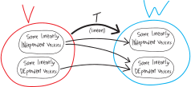

## What's up with the stuff that gets sent to the zero veckkie?

Suppose we have some linear transformation. Can it take the zero veckkie to something that's not the zero veckkie?

It'd be cool if it could! Think back to when we were talking about groups and fields and whatnot: we had all sorts of psychedelic questions like, can we have algebraic structures in which there are multiple identities? Or in which an element has multiple inverses? Or in which inverses don't commute? Crazy creatures we'd sought but never seen! The Loch Ness Monster of mathematics! An Abominable Snowman of algebra! Tragically, just like with Nessie and the Yeti, we had to resolve in the negative. It's the same here: if we have a linear transformation, the zero vecckie HAS to get sent to the zero vecckie. 

Why? Let's formalize this. Suppose, like in our picture, we have some vector space $V$, and a linear map $T$ that sends elements of $V$ to elements of the vector space $W$. What does $T$ send the zero vector to?
$$\underbrace{T(\text{the zero vector}) = T0 = T\vec{0} = T\left(\vec{0}\right)}_{\text{just different notations}} \quad=\quad \text{(some vector)}$$
Let's write that more compactly, and call whatever vector the zero vecckie gets mapped to $\vec{x}$:
$$T\left(\vec{0}\right)= \vec{x}$$
So, what's $\vec{x}$??? Hmm. Well, because the zero vecckie is its own additive identity, this equation is the same as:
$$T\left(\vec{0} + \vec{0}\right)  = \vec{x}$$
But because $T$ is linear, this is the same as:
$$T\left(\vec{0}\right) + T\left(\vec{0}\right)= \vec{x}$$
But each of those guys are INDIVIDUALLY $\vec{x}$:
$$\underbrace{T\left(\vec{0}\right)}_{=\vec{x}} + \underbrace{T\left(\vec{0}\right)}_{=\vec{x}}= \vec{x}$$
So we get:
$$\vec{x} + \vec{x}= \vec{x}$$
$$\vec{x} = 0$$
So $\vec{x}$ MUST be the zero vector! HUZZAH!!!
$$\left(\, T\left(\vec{0}\right)=\vec{x}  \,\right) \quad\implies\quad \Big(\, \vec{x}=\vec{0} \,\Big)$$
Great. So then a linear transformation HAS to send the zero veckkie to the zero veckkie. 

### Can a linear transformation send OTHER STUFF that's not the zero veckkie to the zero veckkie??

Sure!!! Here's a quick example: the zero function!!! The zero function is the function that just sends everything to zero:
$$\text{zero}\left(\vec{x}\right) = \vec{0}$$
Is this indeed a linear function? I think we've proven this in the past, but let's double-check:

* Is it additive? I.e., can we split it up along addition? Sure. If we have:
    \begin{align*}
    \text{zero}\left(\vec{x}+\vec{y}\right) &= \vec{0} \quad\text{(because the zero function ALWAYS outputs zero)} \\
        &= \vec{0} + \vec{0} \quad\text{('cause zero is zero plus zero)}\\
        &= \text{zero}\left(\vec{x}\right) + \text{zero}\left(\vec{y}\right)
        \end{align*}

* Is it ~~homogenous~~ paranormal? I.e., can we pull scalars/constants out?? Also yes! Suppose we have some scalar $k$. Then:
    \begin{align*}
    \text{zero}\left(k\vec{x}\right) &= \vec{0} \quad\text{(because the zero function ALWAYS outputs zero)} \\
        &= k\cdot \vec{0}  \quad\text{('cause zero times anything is zero)}\\
        &= k\cdot \text{zero}\left(\vec{x}\right)
        \end{align*}

Great. So, here's a counterexample: the zero function!

You might object that this isn't the world's most INTERESTING counterexample. It's taking EVERYTHING to zero! Sure, this demonstrates, logically, that there's *some* linear function that sends *some* stuff other than the zero vecckie to the zero vecckie, but it's such an extreme case, that it's not clear how much deep insight we gain about linear functions. If we focus too much on edge cases we run the risk of missing the forest for the trees. Is an edge case a decent representation of the big picture, or is it a *distraction* from the big picture? Put more concretely, and in this context: look, forget about how the zero function technically works here. Are their functions that take MORE than just the zero vector to zero, but without taking EVERYTHING to zero??? In other words, can we come up with a more interesting counterexample? Or perhaps understand the space of counterexamples better???

Here's another, concrete example. Imagine the linear transformation:
$$g:\mathbb{R}^3\rightarrow\mathbb{R}^2$$
$$g(x,y,z) = ( x, y) $$
So this is just a linear map that takes any point in 3D space and projects it down onto the $xy$-plane. All it does is delete the $z$-coordinate! (If you like, you can check the axioms to make sure it's linear.)

Does it take the zero vector in $\mathbb{R}^3$ to the zero vector in $\mathbb{R}^2$? Yeah. The zero vector in $\mathbb{R}^3$ is $(0,0,0)$; in $\mathbb{R}^2$, the zero vector is $(0,0)$. So we have:
\begin{align*}
g\left(\vec{0}\right) &= g(0,0,0) \\
&= (0,0) \\
&= \vec{0}
\end{align*}
Note that I'm using ``$\vec{0}$'' there to represent the zero vector in $\mathbb{R}^3$ as well as the zero vector in $\mathbb{R}^2$, even though those are two different objects! We pay a price for having compact notation. But we pay a price for not having notation, too:
\begin{align*}
g\left(\substack{\text{the zero vector}\\\text{in $\mathbb{R}^3$}}\right) &= g\big(\, (0,0,0) \,\big) \\ \\
&= (0,0) \\ \\
&= \substack{\text{the zero vector}\\\text{in $\mathbb{R}^2$}}
\end{align*}
Anyway, $g$ takes more than just $\mathbb{R}^3$'s zero vector to $\mathbb{R}^2$'s zero vector! It takes anything that's directly above or below the zero vector/origin in $\mathbb{R}^3$ to the zero vector in $\mathbb{R}^2$ as well! For example, it takes $(0,0,7)\in\mathbb{R}^3$ to $(0,0)=\vec{0}\in\mathbb{R}^2$:
\begin{align*}
g(0,0,5) &= (0,0) \\
&= \vec{0}
\end{align*}
So then the set of (other) stuff in $\mathbb{R}^3$ that $g$ sends to the zero veckkie in $\mathbb{R}^2$ is is a vertical line through the origin, i.e.:
$$\text{all the stuff that $g$ sends to the zero veckkie: } \quad\big\{ (0,0,k) \text{ for all } k\in\mathbb{R} \big\}$$

### This has ramifications for us doing algebra!

This also means that if we're doing equations with linear transformations, we need to be careful to not assume that just because a transformation outputs zero, that then its input is zero. $T(0)$ is always $0$, but just because $T(\text{something})$ is zero doesn't mean that $\text{something}=0$!

Phrased more formally:

\begin{align*}
\text{this is true: }\quad \Big(\, T(0) = x \,\Big) &\implies \Big(\, x=0 \,\Big) \\ \\
\text{this is NOT true: }\quad \Big(\, T(x) = 0 \,\Big) &\implies \Big(\, x=0 \,\Big)
\end{align*}

Here's a really really concrete example of that. Suppose we're back in Math 3, and we're playing with a fun, ordinary, real-valued polynomial, like, I dunno:
$$h:\mathbb{R}^1\rightarrow\mathbb{R}^1$$
$$h(x) = (x-2)(x+3)^3$$
And suppose we we're dealing with $h$ in the abstract, and we have some equation like:
$$h(b) = 0$$
Is it then true that $b=0$??? No!!!! Yeah, the *output* of $h$, at some input $b$, is zero. But that doesn't mean that its input $b$ is zero!!! In fact, if $b=0$, then $h$'s output would have to be:
\begin{align*}
h(b) \overset{\text{supposedly}}{=} h(0) &= (0-2)(0+3)^3 \\
&= (-2)(27) \\
&= -54 \\
&\neq 0
\end{align*}
In truth, if $h$'s output is zero, then $h$'s input must be either $+2$ or $-3$. But not zero. 

Note that $h$ isn't a linear function; regardless, I think it's still a good example, because this is still true for linear functions. Like, OK, think about $g$ again from the last example:
$$g:\mathbb{R}^3\rightarrow\mathbb{R}^2$$
$$g(x,y,z) = ( x, y) $$
We saw how $g$ sends $(0,0,5)$ to the zero vecckie. So just because we have some random vector $\vec{b}$ that $g$ sends to zero:
$$g\left(\vec{b}\right) = \vec{0}$$
That doesn't mean that $\vec{b}=0$:
$$\Big(\, g(\vec{b}) = \vec{0} \,\Big) \quad\centernot\implies \quad \Big(\, \vec{b} = 0 \,\Big)$$

I'm hammering away at this point because I'm *still* annoyed at myself for making this mistake in our proof a few weeks ago. And when I told my housemate Aamnah about it---brilliant Stanford math person, etc.---it took *her* a moment to realize why I had been wrong, too. 

### What's the deal with the stuff that gets sent to zero?

This all begs the question: what's going on with that stuff that gets sent to zero? Can we learn anything about it? Can we say anything about it in the general case? If it has the gets-mapped-to-zero property, are there other properties it has to have?

Let's say we have some vectors in $V$ that $T$ each maps to the zero vector in $W$. Call them $\vec{x}$ and $\vec{y}$. Perhaps $\vec{x}$ is the zero vector in $V$; perhaps $\vec{y}$ is; perhaps neither of them are; they're just two vectors that $T$ maps to the zero vector in $W$.

So we have:
$$T\left(\vec{x}\right) = \vec{0} \quad\quad\text{and}\quad\quad T\left(\vec{y}\right) = \vec{0}$$
In other words, we have:
$$T\left(\vec{x}\right) + T\left(\vec{y}\right) = \vec{0} + \vec{0}$$
Or just:
$$T\left(\vec{x}\right) + T\left(\vec{y}\right) = \vec{0}$$
But because $T$ is linear, the left side of this equation is really:
$$T\left(\vec{x} + \vec{y}\right) = \vec{0}$$
Huh. So then we know at least *three* elements of $V$ that map to zero: $\vec{x}$, $\vec{y}$, and $\vec{x}+\vec{y}$:
$$T\left(\vec{x}\right) = \vec{0}, \quad\ T\left(\vec{y}\right) = \vec{0}, \quad T\left(\vec{x} + \vec{y}\right) = \vec{0}$$

Or in other words, if we have any two elements in $V$ that map to zero, then their sum maps to zero, too. So it's like this being-mapped-to-zero property is closed under vector addition.

Hmm. Is it also closed under scalar multiplication? 

Well... let's suppose we have some scalar $k$. What's $T\left(k\vec{x}\right)$?
$$T\left(k\vec{x}\right) = ???$$
Well, because $T$ is linear, this must be:
\begin{align*}
    T\left(k\vec{x}\right) &= k\cdot T\left(\vec{x}\right) \quad\text{(bc $T$ linear)} \\
    &= k \cdot \vec{0} \\
    &= \vec{0}
\end{align*}
So then if $\vec{x}$ maps to zero, then $k\vec{x}$ maps to zero, too. So the being-mapped-to-zero property is closed under scalar multiplication

So, so far, we've learned:

* the zero vector maps to zero
* if two vectors map to zero separately, then their sum also maps to zero
* if a vector maps to zero, any scalar multiple of it maps to zero

Or:

* the zero vector maps to zero
* the being-mapped-to-zero property is closed under:
    * vector addition
    * scalar multiplication

There's a bunch of stuff that maps to zero. The zero vector is one of those things. The sum of any two of those things is also one of those things. The scalar multiple of any of those things is also one of those things.

... do you see where I'm going with this???

The stuff that maps to zero forms a subspace!!!

Put more formally, the set of all $\vec{x}$ in $V$ such that $T\vec{x} = \vec{0}$ forms a subspace of $V$. People call this the **null space** or sometimes **kernel** of a transformation/map $T$:

For any linear transformation $T:V\rightarrow W$, its **kernel** or **null space** of $T$ is all the elements in $V$ that $T$ maps to the zero vekkie:
$$\big\{\, \vec{x}\in V \text{ such that } T\vec{x}=0 \,\big\}$$

If we think back to the example function $g$:
$$g:\mathbb{R}^3\rightarrow\mathbb{R}^2$$
$$g(x,y,z) = ( x, y) $$
Then its kernel is:
$$\text{the kernel/null space of $g$: } \quad\big\{ (0,0,k) \text{ for all } k\in\mathbb{R} \big\} \subset \mathbb{R}^3$$

##  What do linear transformations do to linear in/dependence?

We've spent a lot of time thinking about certain sets of vectors, or rather, sets of vectors that have certain nice properties: linear independence, span, basis.

What do linear transformations do to these properties?!? In particular:

* If we have a set of linearly independent vectors and linearly-map them, is the result always linearly independent? (Always, sometimes, never?)
* If we have a set of linearly independent vectors that is the result of having been mapped from some antecedent set of vectors, is/was that antecedent set of vectors linearly independent? (Always, sometimes, never?)
* If we have a set of linearly DEpendent vectors and linearly-map them, is the result always linearly DEpendent? (Always, sometimes, never?)
* If we have a set of linearly DEpendent vectors that is the result of having been mapped from some antecedent set of vectors, is/was that antecedent set of vectors linearly DEpendent? (Always, sometimes, never?)

## Do linear transformations preserve linear independence?

If we linearly-transform some linearly-independent stuff, is the result always also linearly independent? More formally: suppose we have a set of linearly independent vectors in $V$. When we map them into $T$, is the resulting set of vectors (in $T$) still linearly independent? Yes or no? Always, sometimes, never?

Even more formally:
$$T\left(\text{some linearly-independent vectors}\right) \quad\overset{?}{=}\quad \text{(some linearly independent vectors)}$$
Or, more specifically: let's say that we have some linearly independent vectors $v_1$, $v_2$, etc., through $v_n$, and they map to $w_1$, $w_2$, etc., to $w_n$, respectively:

\begin{align*}
    T\left(v_1\right) &= w_1 \\
    T\left(v_2\right) &= w_2 \\
    \vdots \quad &\quad \vdots \\
    T\left(v_n\right) &= w_n \\
\end{align*}

So if $v_1, v_2, \cdots, v_n$  are linearly independent, are $w_1, w_2, \cdots w_n$ also linearly independent??
$$\Big(\, v_1, v_2, \cdots v_n \text{ linearly independent}\,\Big) \overset{?}{\implies} \Big(\, w_1,w_2, \cdots w_n \text{ linearly independent} \,\Big)$$

Perhaps let's phrase these veckkies not as $w_1, w_2, \cdots w_n$, which throws extra variables into the mix, but instead as just $Tv_1, Tv_2, \cdots Tv_n$:

So then our question is: if $v_1, v_2, \cdots, v_n$  are linearly independent, is $Tv_1, Tv_2, \cdots Tv_n$?

$$\Big(\, v_1, v_2, \cdots v_n \text{ linearly independent}\,\Big) \overset{?}{\implies} \Big(\, Tv_1, Tv_2, \cdots Tv_n \text{ linearly independent} \,\Big)$$

Or, dropping the hypothesis:

$$\text{is }\big\{\, Tv_1, Tv_2, \cdots, Tv_n \,\big\} \text{ linearly independent?}$$

Or, put differently, can we linearly combine all the $Tv_i$ and get zero without needing all the coefficients/scalars to be zero? (Note how when we're referring to them in the plural/in the aggregate we might refer to them with the subscript $i$---that's a common convention.) Put more formally:
$$\Big(\, a_1Tv_1 + a_2Tv_2 + \cdots + a_nTv_n = 0 \,\Big) \quad\overset{?}{\implies}\quad \left(\text{all the $a_i$ are zero}\right)$$
So, this is our question!!!!

OK, let's start to figure things out.

Let's pull out this equation. Suppose we have:
$$a_1Tv_1 + a_2Tv_2 + \cdots + a_nTv_n = 0$$
What can we say here? Well, $T$ is linear, so then we can float scalars/coefficients in and out of it. I guess some people call this the **homogeneity** property, but I prefer to think of it as the **paranormal** property: scalars can float in and out of functions, just like ghosts through walls!!! So this equation is:
$$T\left(a_1v_1\right) + T\left(a_2v_2\right) + \cdots + T\left(a_nv_n\right) = 0$$
I'm tossing parentheses back in for function composition because I think that'll make it neater. And implicitly I guess the scalars of $V$ and $W$ are drawn from the same field, otherwise this wouldn't make sense. Meanwhile, now we just have a bunch of $T$'s added up, and because of that other sub-property of linearity, **additivity** (TODO: COME UP WITH BETTER NAME)("A TASK FOR THE READER"), we can smush them all together:
$$T\left(a_1v_1 + a_2v_2  + \cdots + a_nv_n\right) = 0$$
OK, this is nice, but we're kind of stuck here. We have this nice linear equation in $V$, and we're mapping it to $W$ and getting the zero vector, but... is that telling us all that much? It certainly DOESN'T follow, as we've discussed:
$$\text{DOESN'T FOLLOW: }\quad a_1v_1 + a_2v_2  + \cdots + a_nv_n = 0$$
Because we might have a linear transformation that sends something that's not zero to zero! 

In any case, we've now rephrased our original question as:
$$\Big(\, T\left(a_1v_1 + a_2v_2  + \cdots + a_nv_n\right) = 0 \,\Big) \quad\overset{?}{\implies}\quad \left(\text{all the $a_i$ are zero}\right)$$
So... does this help resolve our question? Here are two specific examples drawn from different extremes of what $T$ could be.

* Suppose $T$ is the identity function. (So then $V$ and $W$ are the same, and we are just boringly mapping the same space to itself boringly.) Then we'd have:
    $$T\left(a_1v_1 + a_2v_2  + \cdots + a_nv_n\right) = 0$$
    $$a_1v_1 + a_2v_2  + \cdots + a_nv_n = 0$$
    and since the only way to make this (by assumption) is that all of the $a_i$ are zero, then all the $a_i$ are zero, and so the output of $T$ is also linearly independent, and so we have a linearly independent set mapped to a linearly independent set! (Which... is what we better hope if we're dealing with the identity function!)

* Alternatively, suppose $T$ is the zero function. Then if we have:
    $$T\left(a_1v_1 + a_2v_2  + \cdots + a_nv_n\right) = 0$$
    Then this whole thing is true even if the $a_i$ aren't all zero! 'Cause it doesn't matter *at all* what the $a_i$ are!!!

So linear transformations don't neccessarily map linearly-independent sets to other linearly-independent sets. Sometimes they do, but but not always!

You might object here that using the examples of the zero function and the identity function are extremes. They're both edge cases! (At two opposite edges!) Yes, a counterexample at the edge is still a counterexample, but is it something we should actually care deeply about? It's the stuff in between that perhaps we should care more deeply about!

So, let's go back to our example from before, of the function that collapses 3D space down onto the 2D plane:
$$g:\mathbb{R}^3\rightarrow\mathbb{R}^2$$
$$g(x,y,z) = ( x, y) $$
Here are some linearly independent vectors in $\mathbb{R}^3$:
$$\text{linearly independent in $\mathbb{R}^3$:}\quad (5,0,0),(0,7,0),(3,5,17)$$
You can check that they're linearly independent if you don't believe me! Here's what they become when we $g$ them (functions are verbs and so we should use them as verbs)(of course functions are also sometimes nouns)(but right now they're verbs):
$$\text{those vectors, $g$'d: }\quad (5,0),(0,7),(3,5)$$
They're no longer linearly independent!
$$\text{not linearly independent in $\mathbb{R}^2$:}\quad (5,0),(0,7),(3,5)$$
You can check this if you like.

So. If we linearly-transform a linearly-independent set, the result might or might not be linearly independent. The result doesn't have to be linearly independent.

**Conversely**: suppose we have a set of linearly independent vectors in $W$. We can think of them as being the output of $T$, and so we can, as it were, rewind the tape (``git revert``), and see what vectors in $V$ these vectors came from. So then we can ask: if we have a set of linearly independent vectors in $W$, is the stuff they came from linearly independent? Yes or no? Always, sometimes, never? Necessarily, possibly, probably?

So let's suppose we have some linearly-independent elements of $W$. Let's call them $w_1$, $w_2$, and so on:

They had to come from somewhere! They had to come from somewhere in $V$!!! Let's say the vectors they came from are $v_1$, $v_2$, and so forth:

So our question is: did the stuff in $V$ that the $w_i$ came from---is that stuff *also* linearly independent??? Are the $v_i$ linearly independent? In other words:
$$\Big(\, \text{ the $w_i$ are linearly independent}\,\Big) \overset{?}{\implies} \Big(\, \text{ the $v_i$ are linearly independent} \,\Big)$$
We could describe the stuff they came from in $V$ by talking about the inverse of $T$ or something. But that seems complicated. Also we don't know that $T$ is invertible??? So instead, like in the last problem, let's re-label the stuff in $W$ as having come from certain elements in $T$. In other words, just like in the last part, let's say:
\begin{align*}
    T\left(v_1\right) &= w_1 \\
    T\left(v_2\right) &= w_2 \\
    \vdots \quad &\quad \vdots \\
    T\left(v_n\right) &= w_n \\
\end{align*}
And so we have:

OK. So $Tv_1, Tv_2, \cdots Tv_n$ are linearly independent. Are the $v_i$ linearly independent???
$$\Big(\, \text{ the $Tv_i$ are linearly independent}\,\Big) \overset{?}{\implies} \Big(\, \text{ the $v_i$ are linearly independent} \,\Big)$$

OK, so, our starting assumption is that this set of output vectors are linearly independent; i.e., there's no set of not-all-zero $a_i$ such that:
$$a_1w_1 + a_2w_2 + \cdots a_nw_n = 0$$
Or, in other words, there's no set of $Tv_i$ such that:
$$a_1Tv_1 + a_2Tv_2 + \cdots a_nTv_n = 0$$
without all the $a_i$ being zero. 

Of course, our question here is about whether the $v_i$ themselves are linearly independent. So, let's suppose we have this linear combination of the $v_i$ making zero:
$$b_1v_1 + b_2v_2 + \cdots + b_nv_n = 0$$
What can we learn about the $b_i$? Are they all zero? Or can they possibly be not all zero??? Hmmmm. OK, this is an equation, so we can do some algebra. Let's $T$ both sides! So we have:
$$T\left(\,  b_1v_1 + b_2v_2 + \cdots + b_nv_n \,\right) = T(0)$$
But $T(0)$ has to be zero. So this equation is:
$$T\left(\,  b_1v_1 + b_2v_2 + \cdots + b_nv_n \,\right) = 0$$
Meanwhile, $T$ is linear, so we can split it up across addition:
$$T\left(\,  b_1v_1 \,\right) + T\left(\, b_2v_2 \,\right) + \cdots + T\left(\, b_nv_n \,\right) = 0$$
And we can pull the scalars $b_i$ out:
$$b_1T\left(\,  v_1 \,\right) + b_2T\left(\, v_2 \,\right) + \cdots + b_nT\left(\, v_n \,\right) = 0$$
$$b_1Tv_1 + b_2Tv_2 + \cdots + b_nTv_n = 0$$
But, wait a sec. We know the $Tv_i$ are linearly independent. So the only way we can linearly-combine/scalar-multiply-and-add them to get zero is if all the scalars are zero! In other words, if all the $b_i$ are zero! So then all the $b_i$ are zero. But wait! The $b_i$ came from this equation:
$$b_1v_1 + b_2v_2 + \cdots + b_nv_n = 0$$
And now we've learned that all the $b_i$ are zero! So if that equation results in requiring that all the $b_i$ be zero, then that means that the $v_i$ have to be linearly independent!!!! So indeed:
$$\Big(\, \text{ the $Tv_i$ are linearly independent}\,\Big)\implies\Big(\, \text{ the $v_i$ are linearly independent} \,\Big)$$
And:

## Do linear transformations preserve linear DEpendence?

Suppose we have a set of linearly DEpendent vectors in $V$. When we map them into $T$, is the resulting set of vectors (in $T$) still linearly dependent? Always, sometimes, never?

Suppose we have some linearly dependent vectors $v_i$ in $V$:
$$\text{some linearly dependent vectors in $V$: } v_1, v_2, \cdots v_n$$
Is their output, under $T$, also linearly dependent?? In other words, is $Tv_1$, $Tv_2$, $Tv_n$, etc., linearly dependent??

Hmm. The $v_i$ are all linearly dependent, so we can linearly-combine/scalar-multiply-and-add them to get zero without all the coefficients/scalars being zero:
$$\text{not all the $a_i$ need be zero: } a_1v_1 + a_2v_2 + \cdots a_nv_n = 0$$
OK. What if we take that equation, and use $T$ to map it into $W$?
$$T\Big(\, a_1v_1 + a_2v_2 + \cdots a_nv_n \,\Big) = T\Big(\, 0 \,\Big)$$
On the right side, because $T$ is linear, $T(0)=0$, so this becomes:
$$T\Big(\, a_1v_1 + a_2v_2 + \cdots a_nv_n \,\Big) =0$$
On the right side, because $T$ is linear, this becomes:
$$T\Big(\, a_1v_1 \,\Big) + T\Big(\, a_2v_2 \,\Big)  + \cdots T\Big(\, a_nv_n \,\Big) =0$$
$$a_1 T\Big(\, v_1 \,\Big) + a_2T\Big(\, v_2 \,\Big)  + \cdots a_nT\Big(\, v_n \,\Big) =0$$
$$a_1 T v_1  + a_2T v_2  + \cdots a_nT v_n  =0$$
But wait! By assumption/hypothesis, the $a_i$ aren't all zero. And yet here's an equation in which we scalar-multiply by the $a_i$ the outputs of the $v_i$, i.e. the $Tv_i$, and we get zero! So then the $Tv_i$ must be linearly dependent. So then if we linearly-map some linearly dependent vectors, the output always has to be linearly dependent.

**What about the converse?** Suppose we have a set of linearly DEpendent vectors in $W$. Is the stuff they came from in $V$ necessarily linearly dependent?

Well... we've basically answered this question by now. We saw, earlier, that a set of linearly-independent vectors can linearly-map into either a linearly independent or a linearly DEpendent set.

And we just saw that a linearly DEpendent set of vectors has to linearly-map into another set of linearly DEpendent vectors. 

So therefore, if we've got a set of linearly dependent vectors as the output of some linear map, then they could have come from either a linearly independent or a linearly dependent set of vectors. (And a set of vectors is either linearly independent or linearly DEpendent---there's no in-between!) 

## In conclusion!

So, what have we learned about how linear transformations/functions/maps treat linear independence? Here's the big takeaway:

* A linear map can take a linearly independent set of vectors to another linearly-independent set of vectors, or it can collapse it to a linearly DEpendent set of vectors.
* A linear map has to take a linearly DEpendent set of vectors to another linearly DEpendent set of vectors. It can't create linear independence.

Put visually:

Linear independence is fragile. It's easy to destroy. It's low-entropy. Linear DEpendence, by contrast, is the default state of chaotic unorganized dissonant high-entropy nature. Linear transformations can't create linear independence. But they can destroy it.

##

one of the useful ideas with functiosn is injectivity/one-to-one-ness

eg with x^2 vs x^3

invertible

maybe we send 0 to 0, but then a bunch of other stuff maps onto the same elements

PICTURE

can this happen?

nope! 

as it turns out

being invertible/injective/one to one is equiv to having kernel being 0

as a FUNCTION this is fine, but it breaks linearity
but it'd be no longer linear

prove that the kernel being just zero is equivalent to injectivity

injective maps preserve linear independnece

injective maps?

suppose we have some linear map $T$ that only maps the zero vector to zero, but does map other vectors to the same vector. in other words, perhaps it looks like this:

PIC

So the only thing that gets sent to $\vec{0}$ in $W$ is $\vec{0}$ in $V$
but we have $x,y$ in $V$ that both get sent to $w$ in $W$. 

$T(x) = w$
$T(y) = w$

adding these two eqns

$T(x) + T(y) = w + w$

$T(x+y) = w+w$

let's SUBTRACT

$T(x) - T(y) = w - w$
$T(x) - T(y) = 0$
$T(x-y) = 0$
but bc the kernel is zero
we must have
$x- y = 0$
$x = y$
so in fact, $x$ and $y$ are the same

moreover $T(v) = 0 \implies v=0$
if we have something in $V$ that maps to $0$ in $W$, that means that that original thing also has to be $0$ in $V$.

## What if we have a linear function that's injective---does *that* preserve linear independence?

it seems like it should?

