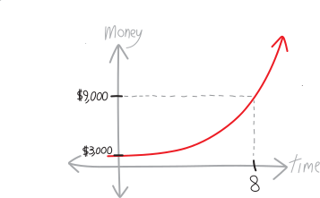
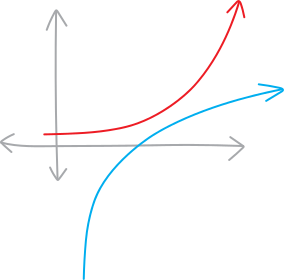
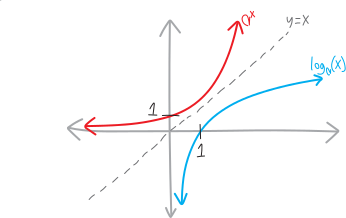

**Arizona. August 2036**. It's 145 degrees. Wave after wave of photons crashes down on you as you stroll along the shore of Tempe Town Flats. It used to be a lake, but that was before---before it all evaporated. The water, the town, the people, their souls, your bank account---gone. All gone. They evaporated into a humid human mist that hung in the air briefly, like a firework at the apex of its flight, and then dispersed, constrained by the second law of thermodynamics to forever increase the entropy of the universe.

It's so hot you can't even ride your bike. The rubber tires crumble the instant they meet UV. Forget about driving. Car tires are just as bad. Prices have reached $10,000 for a set, and even then, you can only drive between 1 and 2 AM. Your buddy stole a tank from the abandoned army base---no rubber on that thing!---but you wouldn't want to be sealed into a hermetic steel chamber in this heat. You no longer need superheated gases to weld your metal sculptures together. You just use a magnifying glass.

You've got to get out of Tempe. Luckily, you've saved up $3,000 over the past few years by running a textbook-smuggling ring. New editions of glossy books, delivered in crates by your contacts at print shops in Dallas and Sacramento, resold at a tenth of retail to impoverished ASU students. Somehow the university still operates, despite what's happened to the rest of the Valley. Quality doesn't seem to have gone down.

You've got to get out of the wasteland. You want to go to Alaska. You're not really sure what you would do. Maybe set up a used-book store outside of Fairbanks. Maybe set up a homestead; live off the land. Lumber's probably easily available. You could export moose- and bear-jerky to gourmet food stores the Lower 48. 

In any case, you figure you need $9,000 to get up there and get set up. You've got a guy in Tucson who says he can given you a 15\% return per year on your money. 15\% per year, every year. That beats inflation. That beats inflation a lot. You decide to invest with him. Eventually, you'll have enough to export yourself to the land of the midnight sun.

<table style="width:75%; text-align: center; font-size: 80%; margin-top:1em; margin-bottom:1em">
	<tr style="border-bottom: 1px solid black;">
    <th>time passed</th>
    <th>your assets</th>
  </tr>
  <tr>
    <td>initially</td>
    <td>$\$3,000$</td>
  </tr>
  <tr>
    <td>after 1 year</td>
    <td>$\$3,000 \cdot (1.15) = \$3,450$</td>
  </tr>
  <tr>
    <td>after 2 years</td>
    <td>$\underbrace{\$3,000 \cdot (1.15)}_{\text{what you had last year}}\cdot (1.15) = \$3,967.50$</td>
  </tr>
  <tr>
    <td>after 3 years</td>
    <td>$\underbrace{\$3,000 \cdot (1.15)\cdot(1.15)}_{\text{what you had last year}}\cdot (1.15) = \$4,562.63$ </td>
  </tr>
  <tr>
  	<td>after 4 years</td>
    <td>$\underbrace{\$3,000 \cdot (1.15)\cdot(1.15)\cdot(1.15)}_{\text{what you had last year}}\cdot (1.15) = \$5,247.02$</td>
  </tr>
  <tr>
    <td>$$\vdots$$</td>
    <td>$$\vdots$$</td>
  </tr>
  <tr>
    <td>after $t$ years</td>
    <td>$(\$3,000) \cdot (1.15)^t$</td>
  </tr>
</table>

After you invest, your assets will increase exponentially! You can even plot their growth with time:

{width=75%}

So the question is: when will you be able to go to Alaska? When will you have the $\$9,000$ necessary to leave? From the graph, it looks like it'll take another 8 years of textbook-running.

{width=75%}

But how do you find this *exactly*? You need to find what value of $t$ makes your asset-function equal to $\$9,000$:

$$\$9,000 = \$(3000)\cdot(1.15)^t$$

How do we solve this equation? I guess we could start by dividing off the $\$3,000$:

$$\frac{\$9,000}{\$3,000} = (1.15)^t$$
$$3 = (1.15)^t$$

But how do we isolate $t$? Could we take a $t$'th root?

\begin{align*}
\sqrt[t]{3} &= \sqrt[t]{ (1.15)^t }\\
3^{1/t} &= \Big( (1.15)^t \Big)^{1/t} \\
3^{1/t} &= (1.15)^{t \cdot (1/t)} \\
3^{1/t} &= 1.15
\end{align*}

No, that doesn't work. It just gives us the same problem, in a different place. There's still a $t$ in the exponent. What we really need, I guess, is some function that could get the $t$ out of the exponent. Some function that could undo the action of exponentiation... *an inverse function*! 

How would we do this? I guess we'd say that we have the function:

$$f(x) = 3000\cdot1.15^x$$

And we want to find:

$$f^{\text{inv}}(x)$$

Such that:

$$f^{\text{inv}}\Big(\, f(t) \,\Big) = t$$

Or really just:

$$f^{\text{inv}}\Big(\,3000\cdot1.15^t\,\Big) = t$$

That way, we could solve our equation for $t$:

\begin{align*}
9000 &= f(t) \\ \\
9000 &= 3000(1.15)^t \\ \\
f^{\text{inv}}(9000) &= f^{\text{inv}}\left(3000\cdot1.15^t\right) \\ \\
f^{\text{inv}}(9000) &= t \\ \\
t &= f^{\text{inv}}(9000)
\end{align*}

Whatever that inverse function is---and we don't really know what it is; we're just assuming that exists and that it's *something*---we can just plug $9,000 into it, and find out how long we need to wait until we triple our assets and can go to Alaska!!! 

But what *is* that inverse function??? We don't know. I guess whatever it is, it'll look like this (a reflection of the original function across $y=x$):

{width=75%}

But... what *is* it, algebraically???

## It's worse

The problem is more general than figuring out when we can go to Alaska. More broadly, we know how to deal with exponential functions. Can we come up with functions that are the inverse of exponential functions? Let's call such functions (whatever they are) **logarithms**, and define them formally in this way, as the inverse of an exponential function:

Given an **exponential function with base a**:
$$f(x) = a^x$$
then the **logarithm base a** is its inverse:
$$f^{\text{inv}}(x) = \log_a{x}$$
such that
$$\log_a\left( a^x \right) = x \hspace{1cm}\text{and/or}\hspace{1cm} a^{\log_a(x)} = x$$

We might not have a general method to figure these out---to actually *compute* logarithms as specific functions or specific numbers, written in terms of decimals and square roots and arithmetic operations and whatnot. But if we define the logarithm in this way, we should be able to figure out some simple ones. We'll talk about some examples in a moment. 

In the context of our Alaska problem, we're dealing with the exponential function:

$$f(\text{a time}) = 3000\cdot 1.15^{\text{that time}}$$

We plug in a duration of time; we get out an amount of money we have. Then its inverse, I guess, using this fancy notation of "logarithms," is:

$$f^\text{inv}(\text{an amount of money}) = \log_{1.15}\left(\text{an amount of money}\right)$$

So we plug in an amount of money, and get out a time. 

The problem is, we haven't actually learned a whole lot here. We're defining this thing called a "logarithm," and we're making up a notation for it, but we don't know very much about it. We don't know what the function is in terms of numbers and addition/subtraction/multiplication/division, in terms of $x$'s and square roots and that sort of thing. All we know is that it's the inverse of an exponential. That, by itself, isn't particularly useful. We can't call up the travel agent and book tickets to Alaska, “departing $\log_{1.15}(9000)$ years from now.” Not yet, at least. 

So our question is: if this is all we know about the logarithm, what else must necessarily be true?

I guess we must know what it looks like. We know what exponential functions look like (e.g. $e^x$, $5^x$, etc.). We know what inverses look like (they look like the original function flipped around the line $y=x$). So we know what logarithms have to look like! Imagine we have some generic exponential function $a^x$, where $a$ is some constant:

{width=75%}

It's asymptoting down to $y=0$ on the left; it's passing through a $y$-intercept of $y=1$; it's zooooooming up on the right. We know that to find the inverse of any function, we just swap the inputs and outputs, i.e. we swap the $y$ and the $x$, i.e. we reflect it over the line $y=x$. So the inverse of $a^x$, the $\log_a(x)$, will look like $a^x$ flipped over the line $y=x$:

{width=75%}

OK, what's happening? The horizontal asymptote at $y=0$ has turned into a vertical asymptote at $x=0$. The fact that an exponential is never negative (if $a$ is positive, then $a^x$ is also positive) means that we (apparently?^[For our purposes, we're only defining the logarithm of positive numbers. You *can* define the logarithm for negative numbers, but for various reasons there are lots of different ways to define it, and it gets kind of messy. Complex numbers get involved! The typical way to define the logarithm of a negative is such that $\ln(-1) = i\pi$.]) can't put negative into logs (and so the graph doesn't exist to the left of the origin). The $y$-intercept at $y=1$ turns into an $x$-intercept at $x=1$. 

What else can we figure out about logarithms, based solely on this definition? I suppose the next most important observation (which concerns specific numbers and not more general functions) is this. Imagine we have some sort of exponential equation, like:

$$a^b = c$$

This is the same^[By “the same” I mean that these two statements are logically equivalent---that if one is true, then the other is necessarily true as well. Often we just denote this using a double-double-arrow: $a^b = c \iff \log_a(c) = b$] as writing:

$$\log_a(c) = b$$

For instance, since $5^2 = 25$, then $\log_5\left(25\right) = 2$. Why is this true (in general)? Well, imagine we have $a^b = c$. Then...

$$\begin{align*}
a^b &= c \\ \\
\log_a\left(a^b\right) &=\log_a(c) \quad \text{(taking the $\log_a$ of both sides)} \\ \\
\cancel{\log_a}\left(\cancel{a}^b\right) &= \log_a(c) \quad \text{(they're inverse functions---they cancel out on the left)} \\ \\
b &= \log_a(c)
\end{align*}$$

So, for example:

* $5^2 = 25$, and $\log_{5}(25) = 2$
* $4^3 = 64$, and $\log_4(64) = 3$
* $2^4 = 16$, and $\log_2(16) = 4$

Another way to think about these examples is this:

* $\begin{align*}
25 &= 5^2 \\
\log_5(25) &= \log_5\left(5^2\right) \quad\quad \text{(another way to write $25$)} \\
 &=2 \quad\quad\text{(inverse fxns---they cancel out)}
\end{align*}$
* $\begin{align*}
64 &= 4^3 \\
\log_4(64) &= \log_4\left(4^3\right) \quad\quad\text{(another way to write $64$)} \\
&=3 \quad\quad \text{(inverse fxns cancel)}
\end{align*}$
*  $\begin{align*}
16 &= 2^4 \\
\log_2(16) &= \log_2\left(2^4\right) \quad\quad\text{(another way to write $8$)}  \\
&=4 \quad\quad \text{(inverse fxns cancel)}
\end{align*}$

Yet another way to think about these is as a question:

* $\log_{5}(25)$ is like asking, $5^\text{what} = 25$? Clearly, the answer is just $2$. So $\log_{5}(25) = 2$. 
* $\log_{4}(64)$ is like asking, $4^\text{what} =64$? Clearly, the answer is just $3$. So $\log_{4}(64) = 3$. 
* $\log_{2}(16)$ is like asking, $2^\text{what} = 16$? Clearly, the answer is just $4$. So $\log_{2}(16) = 4$. 

Here's another way of thinking about logs. I like the number seven. It's my favorite number. But sometimes I don't want to write just “$7$”. Sometimes I want to write it differently. Luckily, there are lots of different ways to write $7$: 

* $7$
* $10-3$
* $\sqrt{49}$
* 28/4
* $7\cdot1$
* the solution to the equation $x - 7 = 0$
* $343^{1/3}$

But two years before 7 became my favorite number, $5$ was my favorite number. What if I wanted to combine these two? What if I wanted to write my current favorite number (7) in terms of my older favorite number (5)? I guess we could write:

* $5+2 = 7$
* $5\cdot1.4 = 7$

But what if we wanted to do this not using addition (like in the first example) or multiplication (like in the second), but by using our *third* binary operation---exponentiation? Put differently, what if we want to write:

$$5^\text{something} = 7$$

How do we figure out what that something in the exponent is? If we have $5^x = 7$, how do we solve for $x$? The cool observation here is that *we can write any (positive) number, simply as any other positive number raised to some power*!!! And logarithms tell us how we can do that. It's the same as how we can write any number as some other number plus something:

$$\text{there is some number $x$ such that } 5 + x = 7$$

$$\text{we can find it using subtraction: } x = 7 - 5$$

or how we can write any number as some other number times something:

$$\text{there is some number $x$ such that } 5\cdot x = 7$$

$$\text{we can find it using division: } x = 7/5$$

so we define the **logarithm** as the operation that does this---that is the inverse of exponentiation.
$$\text{there is some number $x$ such that } 5^x = 7$$

$$\text{we can find it using a logarithm: } x = \log_5(7)$$

Does any of this make any sense? I have given, like, five different intuitive explanations of a logarithm, plus a formal definition, and some wacky story about textbooks and Tucson. I'm trying to make it un-confusing, but I worry that excessive information will have the opposite effect.

<table style='text-align:center;'>
	<thead><td>**operation**</td><td>**inverse operation**</td></thead>
	<tr> <td>addition</td> <td>subtraction</td></tr>
	<tr> <td>multiplication</td><td>division</td></tr>
	<tr> <td>exponentiation</td><td>logarithmancy</td></tr>
</table>

Anyway, your persisting question should be, "Well, it's all well and good to say that $\log_5(7)$ is the number such that $5^\text{that number} = 7$, but I still don't know what it is! We've just written “log”! We don't know what it is as a decimal!!! You're just putting a bunch of fancy language on top of something that is still just as mysterious and unclear and unknown as it was before you added the fancy language!!!"

That is a good objection. I mean, we can *sometimes* find logarithms as decimals. Like, $\log_5(25) = 2$, because $5^2 = 25$. Only under lucky circumstances. Not all the time. What is $\log_5(7)$ as a decimal, anyway? And when can we can go to Alaska? From looking at the graphs back on pages 2 or 3, we can see that it'll take maybe 7 or 8 years. But we'd like to know the exact date, so we can buy plane tickets! How do we figure that out?

The analogy here is to division. Sometimes we can divide numbers and get really clean results:
$$\frac{10}{5} = 2$$
But sometimes we can't, and we have to approximate using long division
$$\frac{10}{7} \approx 1.428571\dots$$
It's the same with logarithms. Logarithmancy, like division, is a *messy* operation. Sometimes we can do it cleanly... and sometimes we can't. So if we're faced with something like $\log_5(7)$, we have various options:

* We might be able to approximate in our heads. For example, if we want to find $\log_{10}(1004)$, we know that's probably a little bit more than $3$, because $10^3 = 1000$. Or if we want to find $\log_6(34)$, that's probably a little less than $2$, because $6^2 = 36$. 

* We could use our... our... calculator. Eek. Except our calculators only have `ln` and `Log` buttons, for the base-$e$ and base-$10$ logs. (At least traditionally---I keep seeing more and more calculators that let you do logarithms to arbitrary bases.) What if you want to find $\log_5(7)$? As it turns out, there's a *change-of-base formula* that lets you write any logarithm in terms of any other logarithm. We'll prove it in a bit. But I'll give it to you now: $$\log_a(b) = \frac{\log_c(b)}{\log_c(a)}$$So in this case, you could have$$\log_5(7) = \frac{\log_e(7)}{\log_e(5)} = \frac{\ln(7)}{\ln(5)}$$And you could type that into your stupid hunk of silicon. You get that $\log_5(7) \approx 1.209\dots$

* Or we could use the change-of-base formula, coupled with this fun fact from higher calculus:
$$\ln (1+x) \;=\; \sum_{n=1}^{n = \infty} \frac{(-1)^{n+1}}{n} x^n \;=\; x \,-\, \frac{x^2}{2} \,+\, \frac{x^3}{3} \,-\, \frac{x^4}{4} \,+\, \cdots$$
That's the Taylor series for a logarithm, if you remember our brief introduction to Taylor series when we were talking about polynomials. The formula above is a logairthm polynomialized, though polynomialized not around the origin but around the point $x=1$. This, is basically how your calculator computes logs---it uses a series approximation like this. But I don't think you'd really want to do this by hand, because it'd take a long time, and it'd be boring.

More broadly: who cares if we can't write it as a decimal? A decimal is (usually) just an *approximation* of a number. We'd far prefer to write $10/7$ as $10/7$ and not as $1.42857\dots$. The former is the *actual number*; the latter is just a *dirty photocopy*. This sort of thing comes up all the time. There are very few numbers that we can write exactly as a decimal (like $2$ or $5.68$). There are far more numbers that we can't express exactly in decimal form---like $\sqrt{2}$ or $\pi$ or even something basic like $1/3$. 

<table style='text-align:center;'>
	<thead><td>**the actual number**</td><td>**its decimal approximation**</td></thead>
	<tr><td>$46$</td><td>$46$</td></tr>
	<tr><td>$\pi$</td><td>$3.14159\dots$</td></tr>
	<tr><td>$\sqrt{2}$</td><td>$1.41421\dots$</td></tr>
	<tr><td>$50/17$</td><td>$2.94117\dots$</td></tr>
	<tr><td>$5/4$</td><td>$1.25$</td></tr>
	<tr><td>$\pi/5$</td><td>$0.58778\dots$</td></tr>
	<tr><td>$\log_5(7)$</td><td>$1.20906\dots$</td></tr>
	<tr><td>$\ln(5)$</td><td>$1.60943\dots$</td></tr>
</table>

## A very special logarithm

Oh! Something else! There's a special logarithm, and a special number that is its base. I just used it in one of the examples, actually. That is: the **natural logarithm** $\ln(x)$, defined as the logarithm to the base $e$: $\ln(x)=  \log_e(x)$, where  $e$ is an irrational, transcendental number (like $\pi$), roughly equal to $2.781...$:

The **natural logarithm**, i.e. the logarithm with base $e$:
$$\log_e(x) = \ln(x)$$
where $e \approx 2.718...$

The abbreviation $\ln$ comes from the Latin *logarithmus naturalis*. You can pronounce it “ell-enn” or “linn” or even just “log,” if you're of a certain bent. Often mathematicians will write “log” when they mean “log base $e$”. But the button `Log(x)` on your calculator computes the base-$10$ log ($\log_{10}(x)$), and a lot of K-12 teachers say that “log” means “log base ten.”  I think this is silly. $10$ is a horrifically *un*natural base for a logarithm. The only reason we use base 10 is because we count in units of ten, and the only reason we count in units of ten (base 10) is because we have ten fingers. What if you were a tapir? with only four toes on each of your front feet? Would you then use a base-8 number system? What if you wanted to count with your rear toes? Tapirs only have three toes on each rear foot. Would you then use a base-6 number system? Thus, you can assume that if I just say “log” without any qualification as to the base, I'm talking about the natural log. If I say “the artificial, evolutionarily-induced log,” then I'm probably talking about the base-10 log. (Or going on a bizarre rant about faux-wood trim.)

There's a cool mnemonic I came up with to remember the first $15$ digits of $e$:

$$e \approx 2.7 \,\, 1828 \,\, 1828\,\, 45\,\, 90\,\, 45...$$

So it's just $2.7$, followed by the year Andrew Jackson was elected president, then that again, followed by a $45-45-90$ right triangle (but rearranged). 

But where does $e$ come from? Why do we care about the natural log? Is it just one of those bizarre math-things that we're not supposed to be able to understand but have to accept? No. $e$ is a number that eerily arises out of mathematical nature, like $\pi$. $\pi$ is just the ratio of the circumference of a circle to its diameter. But it's not a nice, clean integer, or even a rational number. It's an infinitely-long, non-repeating, patternless decimal. Out of very basic geometry we get a very strange number^[Incidentally: what's the length of the hypotenuse of a right triangle whose other sides are $1$?].

$e$'s origin is slightly more abstract. It comes from this question: is there a function that is its own slope? As it turns out---we won't figure out why until we get to calculus---as it turns out, the slope of exponential functions like $5^x$ or $7^x$ is equal to the same exponential function  back again, but times some constant:
$$\left( \text{slope of } 5^x \right)  = (\text{some constant})\cdot 5^x$$
And $e$ is the number such that that constant is 1:
\begin{align*}
\left( \text{slope of } e^x \right) &= 1\cdot e^x  \\
&= e^x
\end{align*}
THAT is why we care about the number $e$. It's the number whose exponential function *is its own slope*!!! 

There's another amazing fact we'll prove in calculus:
$$e^{i\pi} + 1 = 0$$
This is known as **Euler's Identity**, after Leonhard Euler (1707--1783). It is wondrous and beautiful. It gives, in a single equation, a relationship between the five most important numbers in math---$e$, $i$, $\pi$, $0$, and $1$---the three most important operations---addition, multiplication, exponentiation---and the most important relationship---equality.
<!-- 
One more thing: I don't think I've talked about what the graph of a log looks like. I mean, I guess you guys should already know, since it was one of our parent functions, but in case you've forgotten, here it is:

PICTURE

So it looks just like the graph of $e^x$, but flipped about the line $y=x$. It has a vertical asymptote at $x=1$, and an $x$-intercept at $x=0$. Any other logarithm (or any other exponential) looks essentially the same (but possibly with vertical expansion/compression). Note that it doesn't exist on the left side of the graph. For our purposes, we're only defining the logarithm of positive numbers. You *can* define the logarithm for negative numbers, but it gets messy, and you need complex numbers and all that.^[The typical way to define the logarithm of a negative is such that $\ln(-1) = i\pi$, though, if you ask me, it really should be the infinite set of numbers, $\ln(-1)=i\pi(2k+1)$, where $k$ is any/all the integers.] -->

## Fun facts

Anyway, let's talk more about how logs behave. We've talked a lot about how we can compute logarithms of specific numbers. But let's consider how logarithms behave in a more general sense. Here are a bunch of fun facts about logs! 

We'll walk through the reasons why they're true, too. I'm not going to use the word "proof," even though these are proofs. "Proof" has so much baggage. But really, fundamentally, a proof is just an *argument* for why something is true. It's just the *reasons* why something is true. It's no different than an argument in your history class or your science class or your English class. The stuff we're arguing about is abstract objects, rather than empirical data or historical events or the motivations of characters in a novel, but that's a *superficial* difference, rather than a fundamental one. 

### Fun Fact \#1: $\log_a(a^b) = b$ 

### Fun Fact \#2: $a^{\log_a(b)} = b$

#### Argument/reasoning:

OK, this is basically just the definition of a log! It's this basic idea of an inverse function, but applied to the specific case of an exponential and a logarithm.

Imagine we have some exponential function, $f(x) = a^x$. Then, by definition, the inverse of $f(x)$ is the logarithm base $a$. “Log base $a$” is just another name for “the inverse of $a^x$.”  So: 
$$f(x) = a^x \quad\quad f^\text{inv}(x) = \log_a(x)$$
But we know that, if we have any two functions that are inverses of each other, they will cancel out upon composition:
$$f^\text{inv}\Big(\, f(x)\, \Big) = x \quad \text{and} \quad f\Big(\,f^\text{inv}(x)\,\Big) = x $$
So then, for these specific two inverses, we will have:
$$\log_a(\,a^x\,) = x \quad\text{and}\quad a^{\log_a(x)}=x$$
$$\includegraphics[scale=.25]{andrewproof.png}  $$
I guess here in the fun facts we used $a^b$ and $\log_a(b)$ rather than $a^x$ and $\log_a(x)$, but it's the same idea!

### Fun Fact \#3: $\log_a(b\cdot c) = \log_a(b) + \log_a(c)$

This is the coolest property of logs: we can split them up along multiplication! Put differently, logarithms *turn multiplication into addition*. In fact, we could define logarithms only as a function that has this property (rather than define them as the inverse of an exponential). That's how they were created---18th century mathematicians wanted an easier way to multiply number together, and tried to find a function that could turn a (potentially difficult) multiplication problem into an (easier) addition problem. 

### Argument/reasoning:

The proof is kind of cool. First, we'll use logs to find a different way to write $b$ and $c$, and then multiply them together to find a different way to write $b\cdot c$. And then we'll hit that up with a log *again*, simplify, and poof! We'll get our answer.

So... how do we rewrite $a$ and $b$? Our idea is to be *stupid*. Namely: there are lots of stupid ways we can rewrite things. For example, if we want to foolishly and needlessly overcomplicate the plain and simple variable $b$, we could rewrite it as:

* $b = b+ 0$
* $b = b\cdot 1$
* $b = \sqrt[3]{b^3}$
* $b = b + 12 - 12$
* $b = b\cdot 7 \cdot \frac{1}{7}$

Alternatively, using our newfound knowledge of logs, we could rewrite it as:
$$b = a^{\log_a(b)}$$
Or:
$$b = \log_a\left(a^b\right)$$
A logarithm and an exponential (with the same base) are inverses, so if we compose them, they'll cancel out! Above, we used the log/exponent base $a$, but we could have used any base.

With $c$, we can rewrite it the same way:

$$c = a^{\log_a(c)}$$
Or:
$$c = \log_a\left(a^c\right)$$

Let's use the first versions of both of those ways of rewriting things. So, stupidly, we can rewrite $b$ and $c$ as:
$$b = a^{\log_a(b)} \quad\quad\text{and}\quad\quad c = a^{\log_a(c)}$$

So, let's get back to our main question here. What's $\log_a(b\cdot c)$? Can we simplify it? Well, because we have these ways of rewriting $b$ and $c$, this is:

$$\log_a(b\cdot c)  = \log_a\left( \underbrace{a^{\log_a(b)}}_{=b}\cdot \underbrace{a^{\log_a(c)}}_{=c} \right)$$

But then we can use rules of exponents! We're multiplying two things with the same base, so the exponents add, and this is:

$$ = \log_a\left( a^{\log_a(b)+\log_a(c)} \right) $$

But wait! Then we have $\log_a$ of $a^\text{something}$! Those cancel out! They're just inverses! so we have:

\begin{align*}
&= \cancel{\log_a}\left( \cancel{a}^{\log_a(b)+\log_a(c)} \right) \\ \\
&= \log_a(b)+\log_a(c)
\end{align*}

But that's what we wanted to prove! So we have:

$$\log_a(b\cdot c) = \log_a(b) + \log_a(c)$$

### Fun Fact #4: $\log_a\left( b^c \right) = c\cdot \log_a(b)$

This theorem is really useful and really cool. It tells us that if we want to get something out of an exponent (which is our whole reason for coming up with logs in the first place), we can take *any* logarithm---we don't need to get the base right. This is a very, very useful property. It tells us, for instance, that:
$$\ln\left(7^5\right) = 5\cdot \ln(7)$$
Logarithms *liberate us from exponents*, no matter the logarithm!

#### Why:

Why is this true? Well, if we're exponentiating something, that's the same as just multiplying it by itself a lot of times. And if we're multiplying stuff inside a log, that's the same as adding it outside a log! And if we add the same thing to itself a bunch of times, that's the same as multiplication! Symbolically, the argument looks like:

\begin{align*}
\log_a(b^c) &= \log_a(\underbrace{ b \cdot b \cdots b}_\text{c times}) \quad \text{(by definition of exponentiation)} \\ \\
&= \underbrace{ \log_a(b) +  \log_a(b) + \cdots + \log_a(b)}_\text{c times} \quad \text{(by Fun Fact \#3---we can split logs up along multiplication)} \\ \\
&= c\cdot \log_a(b) \quad \text{(multiplication)} \\ \\
&= c \log_a(b)   \\
& \includegraphics[scale=.25]{andrewproof.png}
\end{align*}

### Fun Fact #5: $\displaystyle \log_a\left(\frac{b}{c} \right) = \log_a(b) - \log_a(c)$

I can think of at least two different arguments we can make here! One argument we can make is to repeat basically the same argument we used to prove Fun Fact \#3 (and just change the details). The other way is to combine Fun Fact \#3 and Fun Fact \#4 together, in a different argument (use our existing tools to make more complicated tools). Here's the first argument:

#### Argument #1: 

We know that we can rewrite $b$ as 
$$b = a^{\log_a(b)}$$
That's the same technique we did when we were arguing for why Fun Fact \#3 is true. Likewise, we can rewrite $c$ as:
$$c= a^{\log_a(c)}$$
If we put them together, $\frac{b}{c}$ must be equal to this: 
$$\frac{b}{c} = \frac{a^{\log_a(c)}}{a^{\log_a(c)}}$$
But by properties of exponents, this must be just:
$$\frac{b}{c} = a^{\log_a(x)-\log_a(y)}$$
If we take the $\log_a$ of both sides of that equation, we get:
$$\log_a\left(\frac{b}{c}\right) = \log_a\left(a^{\log_a(b)-\log_a(c)}\right)$$
On the right side, the $\log_a$ and $a$ cancel, because they're inverses: 
$$\log_a\left(\frac{b}{c}\right) = \cancel{\log_a}\left(\cancel{a}^{\log_a(b)-\log_a(c)}\right)$$
$$\log_a\left(\frac{b}{c}\right) = {\log_a(b)-\log_a(c)}$$
Yay!

This is basically the same as the argument we made for Fun Fact \#3. There's a detail that's different---we're dividing rather than multiplying---and I presented it a little bit differently. But the core argument is identical. 

#### Argument #2: 

Here's a different argument for why this is true. Suppose we have $\log_a\left(\frac{b}{c} \right)$. Because of properties of exponents, $\frac{b}{c}$ is the same as $b\cdot c^{-1}$, so this becomes:
$$\log_a\left(\frac{b}{c} \right) = \log_a\left( b\cdot c^{-1} \right)$$
But then we have two things multiplied together inside a log!
$$= \log_a\Big( b\cdot \left(c^{-1}\right) \Big)$$
So we can split it up (via Fun Fact \#3):
$$= \log_a\Big( b\Big) + \log_a\Big( c^{-1} \Big)$$
Then, on the right side, we have an exponent inside a log! So we can bring it out in front of the log, using Fun Fact \#4:
$$= \log_a\left( b\right) + (-1)\cdot \log_a\left( c\right)$$
But because of algebra, this is just:
$$= \log_a\left( b\right) - \log_a\left( c\right)$$
Yay! So we get:
$$\log_a\left(\frac{b}{c}\right) = {\log_a(b)-\log_a(c)}$$

### Fun Fact \#6 : $\log_a(1) = 0$

#### Reasoning:

We know, as a property of exponents, that any number raised to the $0$ is $1$:
$$a^0 = 1$$
So this is just the reverse way of saying that. Boom.  

\includegraphics[scale=.25]{andrewproof.png} 

### Fun Fact \#7: $\displaystyle \log_a(b) = \frac{\log_c(b)}{\log_c(a)}$

This is the **change-of-base formula**! With this formula, we'll finally be able to use our calculators (ew ew ew) and evaluate logarithms to weird bases---we'll be able to compute $\log_5(7)$, and we'll be able to compute when we can finally go to Alaska!

Why is this true? Imagine we want to rewrite $\log_a(b)$ using a differently-based logarithm (say in terms of a base-$c$ logarithm). 
$$\log_a(b) \quad=\quad ???$$
Let's start with that same silly technique where we rewrite something as some base raised to the log of that base of the thing. In other words, let's re-write $b$ as:
$$b = a^{\log_a(b)}$$
Now imagine that we take the $\log_c$ of both sides. Then we have:
$$\log_c(b) = \log_c\left(a^{\log_a(b)}\right)$$
But because of Fun Fact \#4 (I told you it was cool), we can just move that exponent inside the log out of it:
$$\log_c(b) = \log_a(b) \cdot \log_c(a)$$
But if we just rearrange this, we get:
$$\frac{\log_c(b)}{\log_c(a)} = \log_a(b)$$ 
Or:
$$\log_a(b) = \frac{\log_c(b)}{\log_c(a)}$$
Yay!

$$\includegraphics[scale=.25]{andrewproof.png} $$

## Time to buy that flight!

So now we can finally compute $\log_5(7)$, as well as figure out when we'll go to Alaska! For the former... 
$$\log_5(7) = \frac{\ln(7)}{\ln(5)} \approx 1.20906 \dots$$
So then $5^{1.20906\dots} = 7$!!! 

As for Alaska, we needed to solve the following equation for $t$: 
\begin{align*}
\$9,000 &= \$(3000)\cdot(1.15)^t \\\\
\frac{\$9,000}{\$3,000} &= 1.15^t \\ \\
3 &= 1.15^t \\ \\
\ln(3) &= \ln\left(1.15^t\right) \\ \\
\ln(3) &= t\ln(1.15) \\ \\
t &= \frac{\ln(3)}{\ln(1.15)} \\ \\
t &\approx 7.8606\dots
\end{align*}
So we can go to Alaska in 7.86 years!!! Note that (secret of secrets) we didn't even need to use the change-of-base formula---we could have taken a $\log_{1.15}$, yes, and then used the change-of-base formula, but since we just wanted to get the $t$ out of the exponent, *any* logarithm would do, so we chose the easiest one (the natural log). 

## Wait, one more question 

Addition repeated is multiplication; multiplication repeated is exponentiation... wait, what comes after that?!?

<table style='text-align:center'>
	<thead><td>**operation**</td><td>**inverse operation**</td></thead>
	<tr> <td>addition</td> <td>subtraction</td></tr>
	<tr> <td>multiplication</td><td>division</td></tr>
	<tr> <td>exponentiation</td><td>logarithmancy</td></tr>
  <tr> <td>???</td><td>???</td></tr>
</table>

## Problems

<ol class="problems"> 
<li> For your own personal reference, make a list of all the logarithms fun facts! You could even include more fun facts that we didn't discuss; you could include fun facts about exponents (if that's helpful, since they're so similar). In other words, make your own quick-reference sheet!!!
<li> **Tate's question**: the fun fact about how we can pull an exponent out of every logarithm is great, but how might it apply to an expression like $\log_a\left(b^c\cdot 5^d\right)$?
</ol>

Evaluate the following logarithms (without a calculator!):

<ol class="problems"> 
<li> $\log_2(2)$ </li>
<li> $\log_5(5)$ </li>
<li> $\log_2(2^3)$ </li>
<li> $\log_7(7^9)$ </li>
<li> $\log_{11}(11^{45})$ </li>
<li> $\log_{15}(15)$ </li>
<li> $\ln(e)$ </li>
<li> $\ln(e^3)$ </li>
<li> $\log_2(2^{10})$ </li>
<li> $\log_4\left(4^3\right)$ </li>
<li> $\log_5(25)$ </li>
<li> $\log_3(81)$ </li>
<li> $\log_7(343)$ </li>
<li> $\log_2(512)$ </li>
<li> $\log_4(64)$ </li>
<li> $\log_{10}(10,000,000)$ </li>
<li> $\log_{125}(1)$ </li>
<li> $\log_4(1)$ </li>
<li> $\log_7(1)$ </li>
<li> $\log_{23,344.1}(1)$ </li>
<li> $\log_\pi(1)$ </li>
<li> $\ln(1)$ </li>
<li> $\log_{246.7}(1)$ </li>
<li> $\log_{27.9}(27.9)$ </li>
<li> $\log_{46}(46)$ </li>
<li> $\log_3(3)$ </li>
<li> $\log_5\left(\frac{1}{5}\right)$ </li>
<li> $\log_7\left(\frac{1}{7}\right)$ </li>
<li> $\log_4\left(\frac{1}{4}\right)$ </li>
<li> $\log_6\left(\frac{1}{36}\right)$ </li>
<li> $\log_9\left(\frac{1}{81}\right)$ </li>
<li> $\log_{11}\left(\frac{1}{121}\right)$ </li>
<li> $\log_{12}\left(\frac{1}{144}\right)$ </li>
<li> $\log_2\left(\frac{1}{4,096}\right)$ </li>
<li> $\log_5\left(\frac{1}{125}\right)$ </li>
<li> $\log_{1/2}\left(\frac{1}{2}\right)$ </li>
<li> $\log_{1/6}\left(\frac{1}{6}\right)$ </li>
<li> $\log_{1/7}\left(\frac{1}{7}\right)$ </li>
<li> $\log_{1/9}(9)$ </li>
<li> $\log_{1/5}(5)$ </li>
<li> $\log_{1/3}(3)$ </li>
<li> $\log_{1/5}(125)$ </li>
<li> $\log_{1/9}(81)$ </li>
<li> $\log_{1/4}(16)$ </li>
<li> $\log_{1/9}(3)$ </li>
<li> $\log_{1/16}(2)$ </li>
<li> $\ln(\frac{1}{e})$ </li>
</ol>

Estimate the following logarithms WITHOUT A CALCULATOR!!! (Show your thought process!) Then check your estimate using a calulator.

<ol class="problems"> 
<li> $\log_{10}(947)$ </li>
<li> $\log_{2}(65)$ </li>
<li> $\log_{2}(131)$ </li>
<li> $\log_{5}(33.1)$ </li>
<li> $\log_{7}(45)$ </li>
<li> $\ln(3)$ </li>
<li> $\ln(2.5e)$ </li>
<li> $\ln(10)$ </li>
<li> $\ln(10e)$ </li>
<li> $\log_{10}(15)$ </li>
<li> $\log_{10}(7500)$ </li>
<li> $\log_{3}(3)$ </li>
</ol>

LOG EXPLOSION! Rewrite the following expressions so that inside the logarithm(s) there are *as few things as possible* (potentially exploding the expression into multiple separate logarithms to do so!).

<ol class="problems">
<li> $\log_{a}\left(\frac{a^b}{a^c}\right)$</li>
<li> $\log_{a}\left(a^ba^c\right)$</li>
<li> $\log_{x}(x^5)$</li>
<li> $\log_{a}(a^b + a^b)$</li>
<li> $\log_{k}(5^{2000})$</li>
<li> $\log_{a}(a+4a^2)$</li>
<li> $\log_{a}(a^bk^b)$</li>
<li> $\log_{a}(a\sqrt[b]{a})$</li>
<li> $\ln(2k^5)$</li>
<li> $\log_5(\sqrt{v})$</li>
<li> $\log_2\left(4xy^2\right)$</li>
<li> $\log_2\left(\frac{x}{8y}\right)$</li>
<li> $\log_5\left(u^3v^5\right)$</li>
<li> $\log_5(625uv)$</li>
<li> $\log_2\left(\frac{1}{y\sqrt{x}}\right)$</li>
<li> $\log_{a}(\frac{xy^2}{4x^3})$</li>
<li> $\log_{a}(a^bb^5)$</li>
<li> $\log_{a}\left(\frac{a^b}{b^5}\right)$</li>
<li> $\log_{a}(\frac{a}{50})$</li>
<li> $\log_{a}(10^55^3)$</li>
<li> $\ln(25^29^5)$</li>
<li> $\log_{a}(2^23^35^27^211^5)$</li>
<li> $\ln(5^{10}\cdot3^{10}\cdot2^{10}\cdot7^{10}\cdot100\cdot13^{10})$</li>
<li> $\log_{a}(x^2 - 2x - 3)$</li>
<li> $\ln\left(12x^3 + 9x^2 + 8x + 6\right)$</li>
<li> $\log_{a}(3x^2 + 5x + 11)$</li>
<li> $2\ln(\sqrt{e})$</li>
<li> $\ln\left(\ln\left(e^e\right)\right)$</li>
<li> $\ln(e^{2\ln(x)})$</li>
<li> $\ln(\sin \theta) - \ln(\frac{\sin \theta}{5})$</li>
<li> $\ln(3x^2 - 9x) + \ln(\frac{1}{3x})$</li>
<li> $\frac{1}{2}\ln(4t^4) - \ln(2)$</li>
<li> $\ln\left(\frac{1}{\cos \theta}\right) + \ln\left(\cos \theta\right)$</li>
<li> $\ln(8x + 4) - 2\ln(2)$</li>
<li> $3\ln\left(\sqrt[3]{t^2 - 1}\right) - \ln(t + 1)$</li>
<li> $e^{\ln(7.2)}$</li>
<li> $e^{-\ln(x^2)}$</li>
<li> $e^{\ln(x) - \ln(y)}$</li>
<li> $e^{\ln(x^2 +y^2)}$</li>
<li> $e^{-\ln(.3)}$</li>
<li> $e^{\ln(\pi x) - \ln(2)}$ </li>
</ol>

LOG IMPLOSION!!!! Rewrite the following expressions so that there are *as few logarithms as possible*, and *as much stuff inside each as possible*.

<ol class="problems"> 
<li> $\log_5(3)+3\log_5(7)+\frac{\log_5(10)}{2}$     </li>
<li> $4\log_3(8) - \log_3(7) - 5\log_3(5)$    </li>
<li> $\log(c) + 2\log(a) + 3\log(b)$    </li>
<li> $5\log(w) + 5\log(u) + 10\log(v)$   </li>
<li> $\log(w) + \frac{\log(x)}{2} + \frac{\log(y)}{2} + \frac{\log(z)}{2}$   </li>
<li> $\log_2(8) + \frac{4\log_2(7)}{3} + \frac{\log_2(5)}{3}$   </li>
<li>     </li>
<li>     </li>
</ol>

True or false??? (Or is it more nuanced than that?)

<ol class="problems"> 
<li> $\log_b(x+y) = \log_b(x) + \log_b(y)$ </li>
<li> $\log_b(x+y) = \log_b(x) \cdot \log_b(y)$ </li>
<li> $\Big(\log_b(x)\Big)\cdot \Big(\log_b(y)\Big) = \log_b(xy)$</li>
<li> $\displaystyle\frac{\log_b(x)}{\log_b(y)} = \log_b\left(\displaystyle\frac{x}{y}\right)$  </li>
<li> $\log_a\left(b^x+c^y\right) = x\log_a(b) + y\log_a(c)$</li>
</ol>

Solve the following equations for $y$ and $t$ (both!):

<ol class="problems">
<li> $\ln(y - 40) = 5t$ </li>
<li> $\ln(y-1) - \ln(2) = x + \ln(x)$ </li>
<li> $\ln(y) = -t + 5$ </li>
<li> $\ln(1-2y) = t$ </li>
<li> $\ln(y^2 - 1) - \ln(y + 1) = \ln(\sin x)$ </li>
<li> $e^{2y} = 4$ </li>
<li> $100e^{10y} - 200 = 0$ </li>
<li> $e^{5y} = 1/4$ </li>
<li> $80e^y = 1$ </li>
<li> $e^{y/1000} = a$ </li>
<li> $e^{y\ln(.8)} = .8$ </li>
<li> $e^{-.3t} = 27$ </li>
<li> $e^{ky} = 1/2$ </li>
<li> $e^{t\ln(.2)} = .4$ </li>
<li> $e^{ky} = 1/10$ </li>
<li> $e^{t\ln(2)} - 1/2 = 0$ </li>
<li> $\ln(t) = 2t + 4$ </li>
<li> $\Big(\log_2(x)\Big)^4 - 625 = 0$ </li> <!-- quadratic! -->
<li> $2\ln(x) = \ln(2x-1)$ </li> <!-- quadratic! -->
<li> $\ln(x+4) + \ln(x-2) = 5$ </li> <!-- quadratic! -->
<li> $2\ln(x) - \ln(3x-7) = \ln(5x) - \ln(x+3)$ </li> <!-- quadratic! -->
<li> $e^{2x} - 12e^x + 27 = 0$ </li> <!-- quadratic! -->
<li> $e^{2x+1} - 26e^x + 5 = 0$ </li> <!-- quadratic! -->
</ol>

<ol class='problems'>
<li> In these notes, we proved the division rule for logs in two different ways: first, by starting from scratch, and second, by re-using/building on the multiplication and exponent rules. In class, Edden Li wondered: if we proved the division rule from scratch, could we then use it to prove the multiplication rule? In other words, could we think of *division* as being the more fundamental operation, and then use that to derive multiplication? 

Can you do it?!? Can you start by building the division rule from scratch, and then derive the exponent and multiplication rules as consequences of it? 

(Note that we also used the multiplication rule to derive the exponent rule, so, implicitly, we'd have to re-prove the exponent rule using just the divsion rule, too! We don't want our logic to be circular!)

</li>
<li> We've got all these nice logarithms we can compute exactly in our heads (e.g., $\log_2 8$) and we've also got these gross logs that we need to use a calculator for, if we want to approximate them as a decimal (e.g., $\log_5 7$). In these notes, I gave the infinite polynomial ("Taylor series") of a logarithm (or, at least, of natural log). Using that formula, can you, in a spreadsheet or a Python script or something like that, estimate some of the weird gross logs in the "Estimate these WITHOUT A CALCULATOR!!!" section? 

Two subsidiary questions:

<ul>
<li> First, how many terms of the infinite polynomial do you need to get a good approximation? In other words, does adding up just the first five terms of the polynomial give you a good approximation, or do you need to add, like, 100 terms, before you get something that's decent? One good way to check this/think about this is to use this formula to compute a log that *does* work out to something nice and exact (e.g., the $\log_2 8$). Another way to think about this might be to plot the value of the approximation as you add more and more terms---like, make a plot where "number of terms" is on the horizontal axis, and "value of the approximation" is on the vertical axis. Then you could see how fast it converges! (That'd be the fancy math way to phrase it---"how fast such-and-such converges.") </li>

<li> Second, as you try to use this infinite polynomial to estimate these logs, there'll be an added complication that comes up (relating to some of the "fine print" of infinite polynomials). Don't give up!</li>

</ol>

Here are some word problems involving exponential growth and decay. Do them.

<ol class="problems">

<li> After doing some sort of bacterial experiment, you place your agar-coated petri dish underneath a UV lamp to sterilize it so that you can reuse it. You leave it under the UV lamp for ten minutes, and the high-energy light kills all the bacteria... except for one. The lone remaining bacterium, fed by the plentiful supply of agar, begins to grow and reproduce. It takes about an hour for it to undergo a complete cell cycle, so an hour later, there are two bacteria. How many bacteria are there after two hours? three hours? four hours? what about after $t$ hours? what about after $m$ minutes? how many bacteria will there be after a day? when will there be ten million bacteria on your petri dish? </li>

<li> Russia has a problem. A problem with overpopulation. Or rather, a problem with *under*population. Population growth in Russia is (and has been for the past several decades) below replacement levels, meaning that the population has actually been *decreasing*. (Depressingly, this is due not only to a declining birthrate, but also to a decreasing life expectancy, thanks to the increasingly third-world-quality of Russia's healthcare system (not to mention its political system).) In 2009, Russia's population was about $142$ million, and was declining at a rate of $0.177\%$ per year. If this is true, what should Russia's population be this year (2010)? next year? in 2011? what about in 2020? what about in the centenary of Putin's birth in 2052? when will the Russian population drop below $100$ million? according to the model, when will it drop below $75$ million? If you were a Russian policymaker, what would you do to alleviate this problem? </li>

<li> In 1985, the only freeways that existed in the greater Salt River Valley area^[I refuse to call it the “Valley of the Sun,” which emphasizes the superficial desires of local immigrants for “good weather” and ignores a perfectly competent, geographically-accurate, existing name.] were I-10 and I-17, totaling about 85 miles in length. In 1985, Arizona voters passed Proposition 300, enacting a half-cent sales tax to fund highway construction. This resulted in the current car-encouraging sprawl of superhighways. In 2005, the total freeway network in Maricopa County was about 185 miles in length^[these data come from some Google Maps calculations, as well as AZDOT's 2005 Annual Report on Proposition 400, http://www.azdot.gov/Highways/valley\_freeways/US60/Superstition/PDF/ANNUALREPORT89292.pdf]. Assuming you have no other knowledge about Ph****x's growth patterns, Arizona politics, American demographics, etc., and can only assume that the Maricopa highway network will continue to grow at the same rate, how many miles of freeway should there be in 2010? What about in 2015? What about in 2020? What about in year $t$? When will the highway network in the Salt River Valley reach 1,000 miles in length? </li>

<li> After graduating from high school, you gradually begin to lose touch with friends, such that every year, you only have half as many friends from high school as you did the year before. At the instant of your graduation, you had 22 friends from high school. How many do you have the summer after your first year of college? the summer after that? Come up with a function for the number of high school friends you have as a function of the years since your graduation. (Do you think that creating said functions might be responsible for the decline in your number of friends?) When will you only have four friends left from high school? When will you have no friends left from high school? </li>

<li> Between 2003 and 2007, the University of Chicago's endowment increased from $\$3.22$ billion dollars to $\$6.2$ billion dollars---an average increase of roughly $18\%$ per year\footnote{2009 University of Chicago Annual Report, http://www.uchicago.edu/annualreport/financials/endowment.shtml} . Assuming that the U of C's endowment increases exponentially, as financial instruments seem wont to do in first-order approximations, come up with a function for the value of the U of C's endowment as a function of time. (It might help to set 2003 as “year zero,” though if you set the year $0$ C.E. as “year zero” in the model, it's just a simple horizontal shift away.) Based on your model, what was the endowment worth in 2006? When did the endowment hit \$5 billion? What should the endowment have been worth in 2009, according to your model? The actual value of the endowment in 2009 was \$5.1 billion. Why does your model disagree? (Models are imperfect. Also, what happened in 2008?) </li>

In 2019, the U of C's endowment was worth $\$8.5$ billion.\footnote{University of Chicago News Office, 16 October 2019, http://news.uchicago.edu/story/university-chicago-endowment-grows-85-billion} What was the average annual percentage increase from 2003 to 2019? What about from 2009 to 2019?

<li> You have a baby. You want the baby to go to college. (You hope the baby wants to go to college, too.) But college is expensive, so as soon as the baby is born, you start putting aside money into an educational investment account (a 529 plan\footnote{See section 529 of the Internal Revenue Code, 26 U.S.C. \S  529}). You're not sure how much money to put in, so you do some calculations. \begin{enumerate}
\item Imagine you deposit $k$ dollars into this account every year, and the account grows at a nice, predictable rate of $p$ percent every year. (So after the first year, the account is worth $k(1+p)$.) How much money will there be in $18$ years, when your kid is headed off to Cambridge? Give your answer in terms of $k$ and $p$. If you assume that it grows at a reasonable rate of 5\% every year\footnote{not historically unreasonable, but then again, “past performance is not a predictor of future returns.”}, what will a $\$1,000$ annual contribution become in $18$ years? A $\$5,000$ annual contribution? $\$10,000$? The current cost of attending MIT for four years is about $\$200,000$---how much money will you need to deposit every year in order to have that much in $18$ years?
\item  Realistically, though, the cost of attending MIT will increase in the next $18$ years. Assume that the total four-year cost of attending school X is currently $c$ dollars, and that it increases at a steady rate of $q$ percent each year. How much will it cost to attend school X in 18 years? Give your answer in terms of $c$ and $q$. What will the cost of attending MIT be in $18$ years? 
\item Let's combine these two ideas. Your kid wants to attend school X in 18 years, and you deposit $k$ dollars annually into an account that grows at $p$ percent per year. How much money should you deposit per year? Give your answer in terms of $k$, $p$, $c$, and $q$. Now imagine that school X is MIT, and that your kid's 529 plan returns $5\%$ per year. How much should you deposit per year?
\item Of course, realistically, your income is probably going to increase over the course of the $18$ years this little thing is wandering around your house, so we could continue this and say, well, what if our contribution to the 529 plan increases by $r$ percent each year... but that would be creating a very complicated model all teetering on top of this assumption of nice, predictable, exponential growth. And economies and incomes don't actually work like that. Also, MIT gives out lots of financial aid.
</li>

<li> In 1948, shortly before India and Pakistan's independence from the United Kingdom and subsequent Partition, the nizam (ruler) of Hyderabad deposited just over one million British pounds into a bank account in London for safekeeping. The money remained in legal limbo for the next 71 years, being claimed by the governments of India and Pakistan as well as the nizam and his family, until a British court in October 2019 finally ruled that the money could be paid out to the nizam's descendants. By then, the money had grown with interest to about 35 million pounds (\$43 million-ish USD).^["Heirs Of Hyderabad's Last King Can Claim Millions Held In U.K. Account, Court Rules,"" *NPR*, 3 October 2019, https://www.npr.org/2019/10/03/766701335/heirs-of-hyderabads-last-king-can-claim-millions-held-in-u-k-account-court-rules
]

1.  What was the average annual interest rate (or rate of return) on the money over that time period? 
2. Suppose that instead of investing the money in a generic British savings account, the nizam had instead invested it in a broad mix of American stocks in the form of an S\&P 500 index fund (which didn't exist until decades later on a different continent, but no matter). Between 1948 and 2019, the S\&P 500 (the stocks of the 500 largest publicly-traded companies in the US) had an average annual return of 11.1\% (including re-invested dividends, but ignoring inflation). How much money would the nizam's family have now?
3. Right now, a typical savings account in the U.S. pays out only a few tenths of a percent per year in interest. Suppose you invested a million dollars into a savings account paying $0.15\%$ interest annually for the next $71$ years––how much money would you have in $2090$?
</li>

</ol>

