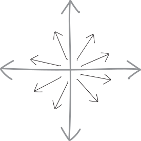
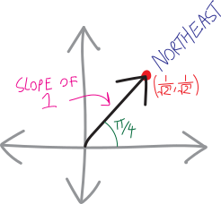
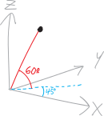
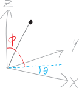
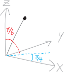
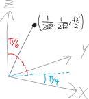

Before we can begin our exploration of multivariable calculus---multi*dimensional* calculus---we need to learn how to explore higher-dimensional reality.

One-dimensional calculus only requires the ability to navigate one-dimensional reality. That's easy. We only have two choices for where to go: left or right. Positive or negative.

Higher-dimensional space is harder. In 1D calculus, we were finding our way around Manhattan. Now we're finding our way around Tokyo. It's way easier to get lost.

We need a map. We need a compass. We need *a sense of direction.*

**What is a direction?** Up, down, front, back, north, south---those are all *examples* of directions. But what *is* a direction, fundamentally? 

In one-dimensional space, this is easy. One-dimensional space just just a line. There are only two directions: left and right. Or "positive" and "negative," if you want to sound a bit more mathy (though really, they're just different words for the same thing). That makes things pretty easy!

{ width=50% }

In two dimensions... things get harder. We could go left, or right, or forwards, or back, or anywhere in between. We can turn in any direction we want! If we're standing on a two-dimensional plane, we can rotate and turn and spin in any direction we want! A full $360^\circ$! A full $2\pi$! 

{ width=50% }

We can turn at an angle that's any number between $0$ and $2\pi$---and there are an infinite number of such numbers.

<table style='text-align:center;'>
    <thead>
        <th>number of dimensions</th>
        <th>number of directions</th>
    </thead>
    <tr>
        <td>$1$</td>
        <td>$2$</td>
    </tr>
    <tr>
        <td>$2$</td>
        <td>$\infty$</td>
    </tr>
</table>
In one dimension, we only had two possible directions we could turn in; in two dimensions, we have $\infty$! That's a big jump.

If we were living in zero-dimensional space---i.e., just a point---then we could turn in zero possible directions. We can't move anywhere, so we can't look anywhere. Or maybe that means that there's only one, fixed direction to look in. Hmm. I'm not sure. Anyway, here's another line in this table:
<table style='text-align:center;'>
    <thead>
        <th>number of dimensions</th>
        <th>number of directions</th>
    </thead>
<tr>
        <td>$0$</td>
        <td>$0$?</td>
    </tr>
    <tr>
        <td>$1$</td>
        <td>$2$</td>
    </tr>
    <tr>
        <td>$2$</td>
        <td>$\infty$</td>
</table>

What about three-dimensional space? Left, right, forward, back, and now *up* and *down*! It's still infinite!

<table style='text-align:center;'>
    <thead>
        <th>number of dimensions</th>
        <th>number of directions</th>
    </thead>
<tr>
        <td>$0$</td>
        <td>$0$</td>
    </tr>
    <tr>
        <td>$1$</td>
        <td>$2$</td>
    </tr>
    <tr>
        <td>$2$</td>
        <td>$\infty$</td>
    </tr>
    <tr>
        <td>$3$</td>
        <td>$\infty$</td>
</table>

(For those of you who know about the beauties of [transfinite cardinals](https://en.wikipedia.org/wiki/Cardinality_of_the_continuum)---a.k.a. "different sizes of infinity"---the infinitude of directions in three-dimensional space isn't any bigger than the infinitude of directions in two-dimensional space.)

Anyway, things don't magically get simpler once we get into higher and higher dimensions. In three dimensions, there are already an infinite number of ways to get lost. As the number of dimensions increases, the situation remains bleak:

<table style='text-align:center;'>
    <thead>
        <th>number of dimensions</th>
        <th>number of directions</th>
    </thead>
<tr>
        <td>$0$</td>
        <td>$0$</td>
    </tr>
    <tr>
        <td>$1$</td>
        <td>$2$</td>
    </tr>
    <tr>
        <td>$2$</td>
        <td>$\infty$</td>
    </tr>
    <tr>
        <td>$3$</td>
        <td>$\infty$</td>
    </tr>
    <tr>
        <td>$\vdots$</td>
        <td>$\infty$</td>
    </tr>
</table>

Exploring higher dimensions, then, is like exploring a cave. There are many ways to get irretrievably, terminally lost. 

We will need to put on our helmets. We will need to bring snacks. We will need to make sure our lights have fresh batteries.

## Directions in 2D

How do we describe directions in 2D? Not just ask ``how many directions are there in 2D?,'' but how do we talk about them? What words do we use?

In one-dimensional space, there are only two directions. So describing them is easy: just use one of two words. Go left; go right. Go in the positive direction; go in the negative direction.

In two-dimensional space... well, now we have an infinite number of directions. English doesn't have an infinite number of words. But mathematics, thankfully, has an infinite number of numbers. So we can use those. And actually, we're already pretty adept at describing directions in two dimensions, given that that's the world we live in (live *on*). Birds and fish live in a three-dimensional world; we bipeds live in 2D, until we learn to lucid-dream or get a pilot's license.

Suppose we have a single specific direction in two dimensions. Here are four different ways to describe that one direction:

<ul>
<li> We could describe it using one of our lovely English-language compass words, like "northeast." </li>
<li> We could describe it by giving an angle, like $45^\circ$.</li>
<li> We could describe it by giving the slope of a line going in that direction, like $1$.</li>
<li> We could describe it by giving a point on the unit circle in that direction, like $\left( \frac{1}{\sqrt{2}}, \frac{1}{\sqrt{2}} \right)$.
</li>
</ul>

{ width=50% }

These are all equivalent ways of describing the same direction! Of course, each different method has its pros and cons:

*  Using an English word like ``northeast'' is cool, except we have a finite number of English words, and an infinite number of directions, so that's going to be a problem. (If you check out [the Wikipedia page for "points of the compass,"](https://en.wikipedia.org/wiki/Points\_of\_the\_compass) you can see some of the very very specific words old-timey navigators and cartographers came up with!)
* Using an angle like $45^\circ$ seems very natural. It's just one number, and it's a unit of measurement we've used for a long time and are very comfortable with. Sadly, while it works great in two dimensions, it's hard to generalize to larger number of dimensions!
* Using the slope of a line, like $1$, seems very calculus-y!
* Using a point on the unit circle in that direction, like $\left( \frac{1}{\sqrt{2}}, \frac{1}{\sqrt{2}} \right)$ seems redundant, since we need *two* pieces of information. And it is. Nevertheless, it's the main way we're going to use in MVC, as it generalizes to huge numbers of dimensions really well.

## Directions in 3D

How do we describe directions in three dimensions? This is harder. Because we're not birds, we're not used to being able to freely move in any three-dimensional direction. So we lack the language.

Can we use an angle? In 2D, angles are pretty nice. How do we make an angle in three-dimensional space? I guess one way to do it would be to use *two* angles. So, for example, we could describe a direction as being "northeast" on the $xy$ plane, and also "up at a $60^\circ$ angle" in the vertical dimension. Or, because "northeast" isn't really an angle, we could describe it as "at a $45^\circ$ angle on the $xy$-plane, and up at a $60^\circ$ angle in the vertical direction."
{ width=50% }
Using a second angle makes things a little messy. Mathematicians and physicists often do it a little differently. The way it usually gets done in math (which isn't the way I just did it in the previous paragraph) is to make two angles, $\theta$ and $\phi$, in this way:

* $\theta$: the angle on the $xy$-plane, like in polar coordinates, the way we've always done it
* $\phi$: the *vertical* angle, i.e., the angle *between* the vertical axis ($z$) and the $xy$-plane. 

Here's a picture of what this looks like:

{ width=50% }

Generally (and this is what we'll do in this class), $\phi$ is defined so that straight up is an angle of $0$, and the angle increases as you go down. So, rather than thinking about it as the angle *up* off the flat horizontal $xy$-plane, think about it as the angle *down* from the $z$-axis.

Note that $\phi$ doesn't need to get any bigger than $\pi$. If $\phi$ is bigger than $\pi$, then that's the same as using a different angle for $\theta$.

So, the direction I was initially describing we could describe with these angles:
$$\theta=\frac{\pi}{4},\quad \phi = \frac{\pi}{6}$$
{ width=50% }
The direction is going up $60^\circ=\frac{\pi}{3}$ from the horizontal $xy$-plane, which means that it's going down from the vertical $z$-axis by $30^\circ=\frac{\pi}{6}$, so that's what $\phi$ is, in this setup.

But all this stuff with angles gets messy, especially as we move into higher and higher dimensions. Where do the angles start from? How do we define them? Which ones can range between $0$ and $2\pi$, and which ones can only range between $0$ and $1\pi$?

Angles were  nice when there was just one of them. But they're not an ideal way to deal with higher-dimensional space. (Or rather, they're not an ideal way to deal with *directions* in higher-dimensional space.)

So let's do something different! Just like how we can describe directions in 2D space by giving points on the unit circle, let's describe directions in 3D space by giving points on the unit sphere! (By unit sphere, I mean a sphere of radius $1$, centered at the origin---the higher-dimensional version of a unit circle.)

So, back to our example direction, with $\theta=\frac{\pi}{4}$ and $\phi=\frac{\pi}{6}$. Where is it on the unit sphere? In other words, can we find its $(x,y,z)$-coordinates? You bet! By doing a little geometry and a little trig---I won't show the details, but you can try to work it out yourself---we get that this direction, when considered as a point on the unit sphere, is:
$$\left(\frac{1}{2\sqrt{2}},\,\,  \frac{1}{2\sqrt{2}},\,\, \frac{\sqrt3}{2}  \right)$$
{ width=50% }
Don't worry too much about how I worked that out. We're not going to spend much time going from angles in 3D to rectangular/Cartesian coordinates in 3D (at least, not for quite a while). But doing so just takes the straightforward geometry and trig you know (though in 3D it can get a little tricky to keep all the pieces organized). You can Google **[spherical coordinates](https://en.wikipedia.org/wiki/Spherical_coordinate_system)** if you want to learn more. (All this stuff about thinking of "directions" as angles is just spherical coordinates with a radius of $1$.)

Also note that I didn't draw the unit sphere on that diagram! Drawing in three dimensions is really taxing my artistic abilities. So imagine, if you will, a sphere of radius one, centered at the origin, and passing through that labelled point!

The point is this: **the way we're going to describe directions in three-dimensional space is as points on the unit sphere**. 

That's not a perfect way to do it. It's redundant. In theory, we could describe the direction with only two numbers (two angles); using a point on the unit sphere takes *three* numbers (one for each coordinate). Sad! The reason we're doing it this way is because it generalizes really nicely to arbitrary numbers of dimensions.

## Directions in $n$D

What if we want to describe a direction in *four*-dimensional space?!? We don't even know what four-dimensional space looks like! We're completely blind! 

If you like angles, you can do it by adding a third angle. Google "generalized spherical coordinates" or "hyperspherical coordinates" if you want a taste of what that might look like. But that's not how we're going to do it.

Instead, we're going to continue this idea of a "direction" as being a point on the unit circle or unit sphere. Except, now we're in four dimensions, so we need a hypersphere! I don't know what that looks like. I don't know what *anything* in four dimensions looks like. But whatever it looks like, we can describe a direction in four-dimensional space as being some point on the unit hypersphere. 

How does the math for a four-dimensional hypersphere work? Well, in two dimensions, we can have a "$1$-sphere," i.e., a circle, the points on which obey this equation:
$$x^2+y^2 = r^2$$
So this is the set of all points that are exactly $r$ units away from the origin in two-dimensional space. And note that we call a circle a "$1$-sphere." Circles are not two-dimensional objects. They're one-dimensional objects. It's just that they're one-dimensional objects **embedded** (that's the mathy word) in two-dimensional space. (Or in even higher-dimensional space!)

In three-dimensional space, we can have a "$2$-sphere" (i.e., a sphere), the points on which obey this equation:
$$x^2+y^2+z^2=r^2$$
So this is the set of all points which are exactly $r$ units away from the origin, in three-dimensional space. And again, we can think of a sphere as being a fundamentally two-dimensional object. (And again, by "sphere" I mean the *surface* of a sphere.) There are important differences between a sphere and the normal two-dimensional flat plane. The normal 2D flat plane extends infinitely in every direction. But the two-dimensional surface of a sphere is finite.^[If the surface of Earth were infinite, [Henry George](https://en.wikipedia.org/wiki/Henry_George) would have written a very different book on the economics of land value.]

What about in four dimensions? Well, we can embed a "$3$-sphere" in four-dimensional space. The surface of a $3$-sphere is a three-dimensional space. But unlike our normal three-dimensional space, the surface of a $3$-sphere is finite. (Finite and **bounded**, to use another mathy word.)

We've run out of letters for the dimensions, so to describe a $3$-sphere, I'm going to call the dimensions $x_1$, $x_2$, $x_3$, and so forth. Then the points on the surface of a $3$-sphere with radius $r$ obey this equation:
$$\left(x_1\right)^2 + \left(x_2\right)^2 + \left(x_3\right)^2 + \left(x_4\right)^2 = r^2$$
And the points on the surface of the unit $3$-sphere obey the equation:
$$\left(x_1\right)^2 + \left(x_2\right)^2 + \left(x_3\right)^2 + \left(x_4\right)^2 = 1$$
So, to get back to directions. A direction in four-dimensional space is a point on the "unit $3$-sphere." And, more generally (this is the definition that we've been building to):

A direction in $n$-dimensional space 
is 
a point on the $(n-1)$-dimensional unit sphere.

So:

* In one-dimensional space, a direction is a point on the "unit $0$-sphere" (i.e., it's either $-1$ or $+1$, i.e., positive or negative).
* In two-dimensional space, a direction is a point on the unit $1$-sphere, better known as the unit circle.
* In three-dimensional space, a direction is a point on the unit $2$-sphere, i.e., the surface of a three-dimensional sphere with radius $1$, centered at the origin.
* In four-dimensional space, a direction is a point on the unit $3$-sphere, i.e., the surface of a four-dimensional sphere with radius $1$, centered at the origin... whatever that looks like.
* In five-dimensional space, a direction is a point on the unit $4$-sphere, i.e., the surface of a five-dimensional sphere with radius $1$, centered at the origin.
* And so forth.^[I'm being casual with language here. Mathematicians often distinguish between a **[ball](https://en.wikipedia.org/wiki/Ball_(mathematics)) which is a solid shape (a filled-in circle, a filled-in sphere) and a **[sphere](https://en.wikipedia.org/wiki/Hypersphere), which is just the points on the surface. (A ring and a balloon, versus a frisbee and a bowling ball). For our purposes, none of these distinctions are that crucial; context is sufficient. But if you enjoy geometric and topological taxonomy, go read about them!]

In other words, to describe a direction in $n$-dimensional space, we need $n-1$ numbers^[I guess this isn't really true for $1$-dimensional space, because we need more than $0$ real numbers to describe a direction in 1D (but fewer than all the real numbers)]. We haven't done that here: we described points on the unit circle with two numbers (rather than one), and points on the unit sphere with three numbers (rather than two). But in principle, we could use the Pythagorean theorem to describe all the points on the unit $n$-sphere with just $n-1$ numbers. (Think of how we normally describe points on the surface of the earth: we only use two numbers, a latitude and a longitude.) For instance, if we have some point $(a,b,c)$ on the unit sphere, we know it must obey the equation:
\begin{align*}
    a^2+b^2+c^2 &= 1^2 \\
&= 1
\end{align*}
But then we can solve this for one of $a$, $b$, or $c$ in terms of the other two, e.g.:
\begin{align*}
c^2 &= 1 - a^2 - b^2 \\
c &= \sqrt{1 - a^2 - b^2}
\end{align*}
So then we just need two numbers to describe this point, $a$ and $b$:
$$\left(a,\, b,\, \underbrace{\sqrt{1 - a^2 - b^2}}_{=c}\right)$$

## Rocketing off on a tangent

So we can describe directions in $n$-dimensional space using $n-1$ numbers (even if, in practice, we usually are redundant and use $n$ numbers). If you're living in $n$-dimensional space, and you want to fly your rocketship out from the origin to some distant point, all you need to know are:

* what direction to point your rocketship in ($n-1$ numbers)
* how far to travel (a distance---i.e., one number)

In other words, we can describe every point in $n$-dimensional space with:

* a direction ($n-1$ numbers)
* a distance (one number)

This isn't the normal way (up until now) that we've described points in high-dimensional space. Rather, we've just described them using our old-fashioned rectangular coordinate system:

* Go blah blah units in the $x$-direction
* Then turn $90^\circ$ and go blah blah units in the $y$-direction
* Then turn $90^\circ$ and go blah blah units in the $z$-direction

This way of describing points using a direction and a distance is different! It's like a higher-dimensional generalization of polar coordinates. In polar coordinates, we have an angle and a distance; here, we have a more general *direction* and a distance.
