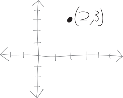
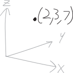
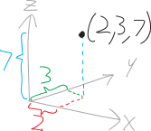

> Let us go then, you and I 
> When the evening is laid out before the high-dimensional sky. 
> Like a matrix diagonalized around its basis.

Here's a point in one-dimensional space:
$$x=2$$
{ width=50% }
One-dimensional space is just a line. This point is just a number on that line.

Here's a point in two-dimensional space:
$$x=2,\,\, y = 3; \text{ i.e. } (2,3)$$
{ width=50% }
Two-dimensional space is just a plane. So this point is just a point on that plane. We've known how to graph such points for ages and ages.

Here's a point in three-dimensional space:
$$x=2,\,\, y = 3;\,\ z=7 \text{ i.e. } (2,3,7)$$
{ width=50% }
Now we have not just an $x$- and a $y$-coordinate, but also a $z$-coordinate! A vertical coordinate! So we go two in the $+x$-direction, three in the $+y$-direction, and seven in the $+z$-direction, and there we are at our point!

And, OK, it's pretty tough to draw a three-dimensional picture on a two dimensional screen, especially when you have my drawing ability. I'll draw in the components/projections on each of the three axes:
{ width=50% }
What about a point in four-dimensional space? This is harder! For one thing, we've run out of letters, so I'm just going to start labelling each dimension as $x_1$, $x_2$, $x_3$, and $x_4$. But more fundamentally, *we can't see in four dimensions!!!*

Here's some point in four-dimensional space:
$$\left(8, -\pi, 206, 43\right)$$
We could describe how to get to this point in words:

* We go $8$ units in the positive direction in dimension $x_1$
* We go $\pi$ units in the negative direction in dimension $x_2$
* We go $206$ units in the positive direction in dimension $x_3$
* We go $43$ units in the positive direction in dimension $x_4$

Here's a point in seven-dimensional space, which we definitely can't visualize:
$$\left(  5,\, 8,\, 11,\, -3,\, 0,\, 1,\, 9  \right)$$
With all of these points, I'm describing them in **rectangular/Cartesian coordinates**. That's not the only way of describing points. For example, in Math 3, we learned about how we can describe points in two-dimensional space either in rectangular coordinates, or in polar coordinates. There are many, many other possible coordinate systems we could use!