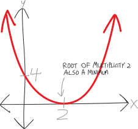
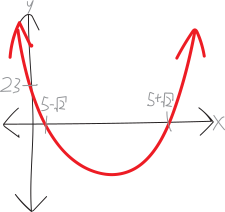
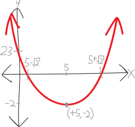
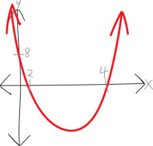
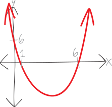
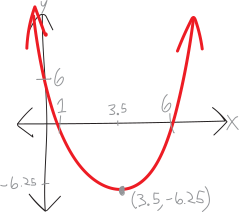
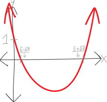
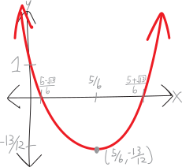

---
title: Persuading Parabolas into Vertex Form (A.K.A. "Completing the ■")
usemathjax: true
layout: post
---

*Okay, everyone! We're about to start talking about ***rational functions***, which are like polynomials, but way cooler---but before we do, I want to do one last thing with parabolas. I'm generally not a huge fan of completing the square, but if we learn how to do it, there are two fun and useful proofs about parabolas that we'll be able to do. You know the results of both the proofs---one is the fact that the vertex of a parabola is halfway in between its roots; the other is the quadratic equation---but I want us to be able to really *feel *why these two things are true. In order to do that, we'll need to prove them, and in order to do that, we'll need to be able to complete the square---and likewise, to really *feel *why completing the square as a method works.*

   

In our efforts so far at becoming algebraic synæsthetes, we've encountered parabolas in two different contexts:

* We've seen parabolas as being the parent function $f(x)=x^2$ with various linear transformations, like $f(x)=(x+1)^2-9$
* We've seen parabolas as being polynomials of degree $2$, like $f(x) = (x+4)(x-2)$

These are two different ways of thinking about parabolas. They both have pros and cons!

<ul>
<li> If we think of parabolas as being polynomials of degree $2$, and write them in factored form, then it's really easy to see where the roots/zeroes/$x$-intercepts are:

A parabola with roots/$x$-intercepts at $x=+r$ and $x=+s$:
$$f(x) = (x-r)(x-s)$$

PICTURE

 </li>

<li> If we think of parabolas as being parent functions transformed, then it's really easy to see where the vertex/minimum/maximum is:

The parabola $f(x)=x^2$, but shifted right by $h$ and up by $k$:
$$f(x) = (x-h)^2 + k$$

PICTURE

We know that $f(x)=x^2$ has a minimum at $(0,0)$, so if we move it around---say right by $h$ and up by $k$---then its vertex will move, too!

An upwards-opening parabola, with a vertex at $(+h,+k)$:
$$f(x) = (x-h)^2 + k$$

Likewise, if we were to flip it vertically over the $x$-axis, then its minimum would become a maximum.

You might have seen this in previous math classes called the **vertex form** of a parabola. Since we're talking about parent functions and their linear transformations in this class, you might also call them **transformed-parent-function form** of a parabola (a somewhat less mellifluous moniker). 
</li>
</ul>

But, here's the problem. We want parabolas to be our best friends. We want to know *everything about them*. We don't want to have to choose between knowing the vertex of *some* parabolas, and the roots of others. We want to know the vertex of *every* parabola. We want to know the roots of *every parabola*. We want to know it *all*.

We already have a way of figuring out the roots of any parabola. We have the quadratic equation! That tells us the roots of any parabola. But what about the vertex? We don't know how to find that, in general, unless we're lucky and get a parabola as a transformed parent function. And besides---do we *really* know the quadratic equation? We don't know where it comes from. We just found it etched onto some stone tablets in our archæological dig. 

In these notes, I'm going to outline a method for finding the vertex of any parabola. You may already have seen it---people call this method **completing the square**---but we're going to try to *really understand* and *really feel* how it works.

## Some parabolas are in *both* factored and vertex form!

There's a class of special parabolas which are *both* in factored form and in vertex form at the same time! In other words, we know their roots, *and* their vertex! Here's an example:

\begin{align*}
    f(x) &= x^2-4x+4
\end{align*}
If we factor this, we get:
\begin{align*}
    &= (x-2)(x-2) \\
    &= (x-2)^2
\end{align*}

So this is fully factored! It looks like a polynomial of degree $2$, with a single root of multiplicity $2$ at $x=+2$. But we could also think of this as being:

\begin{align*}
    &= (x-2)^2 + 0
\end{align*}

In other words, we could think of this as the parent function $f(x)=x^2$, but shifted right by $2$, and up $0$. So the we know it has a minimum at $x=+2$ and $y=0$. 

{ width=50% }

The fancy name for this sort of parabola is that it's a **perfect square factorization**. In other words, we can factor it into a *single* factor, of degree $2$! Making it look *simultaneously* like a transformed parent function, and a fully-factored polynomial.

There are others like it. For example:
\begin{align*}
    f(x) &= x^2 - 10x + 25 \\
    &= (x-5)(x-5) \\
    &= (x-5)^2
\end{align*}

Or:

\begin{align*}
    f(x) &= x^2 + 14x + 49 \\
    &= (x+7)(x+7) \\
    &= (x+7)^2
\end{align*}

Or:

\begin{align*}
    f(x) &= x^2 + 2\!\cdot\!(\text{blaargh})\!\cdot\!x + (\text{blaargh})^2 \\
    &= (x+\text{blaargh})(x+\text{blaargh}) \\
    &= (x+\text{blaargh})^2
\end{align*}

And so forth! The point is, there's this special group of parabolas for which it's really easy to *both* know their vertex, *and also* know their roots (... because they're identical). These are really nice! It's easy for us to know *everything* about them---the roots *and* the vertex!

## But what if it's not a perfect square??? (Example \#1) 

 Let's suppose we have something a little different. I just showed you the perfect-square parabola:

\begin{align*}
    f(x) &= x^2 - 10x + 25 \\
    &= (x-5)(x-5) \\
    &= (x-5)^2
\end{align*}

Suppose we have a parabola/quadratic a little different, like:

$$g(x) = x^2 - 10x + 23$$

Let's draw a picture of it! To draw a picture, we'll need to factor it. Can we do that by hand? Not easily!!! It *almost* looks like that beautiful perfect square we just saw. Buuuuut not quite. Instead of having a $+25$ as the constant/$y$-intercept, now we have $+23$. We can try to factor it by hand; we'd probably fail. So, if we resort to the quadratic equation, we get:

\begin{align*}
    g(x) &= x^2 - 10x + 23 \\ \\
        &= \left(x - \frac{-b+\sqrt{b^2-4ac}}{2a}\right)\left(x - \frac{-b-\sqrt{b^2-4ac}}{2a}\right) \\ \\
        &= \left(x-\frac{-(-10)+\sqrt{(-10)^2-4\!\cdot\!1\!\cdot\!23}}{2\!\cdot\!1}\right)\left(x - \frac{-(-10)-\sqrt{(-10)^2-4\!\cdot\!1\!\cdot\!23}}{2\!\cdot\!1}\right) \\ \\
        &\quad \vdots \\ \\
        & \text{... much simplification later ...}\\ \\
        &\quad \vdots \\ \\
        & \text{... dum de dum...}\\ \\
        &\quad \vdots \\ \\
        &= \Bigg(x- \left(5+\sqrt2\right)\Bigg)\Bigg(x- \left(5-\sqrt2\right)\Bigg)
\end{align*}

So, now we can sketch it. It has two roots, at $x=5+\sqrt2$ and $5-\sqrt2$. We know from the original unfactored equation that it's opening upwards (because it was $+x^2$) and that it has a $y$-intercept of $23$:

{ width=50% }

But this leaves us with the question: WHERE IS ITS VERTEX/MINIMUM???? We really, *really*, want to know. We want to be *best friends* with this parabola. We want to know *everything about it*. 

If we knew calculus, we'd be able to find where the vertex/minimum is. The minimum happens where the slope is zero, so if we could use calculus to find an equation for the slope, then we could set that equal to zero, solve for $x$, and ta-da! We'd have the minimum. 

But we don't know calculus. Darn.

But that's OK. Here's my proposal. This *almost* looks like a perfect square. It *almost* looks like $x^2 - 10 + 25$, which factors so so beautifully to just  $(x- 5)^2$. So what if we just... pretend that it is $x^2 - 10 + 25$? Namely, what if we write it as:

\begin{align*}
    g(x) &= x^2 - 10x + 23 \\
    &=  x^2 - 10x + \overbrace{25 -2}^{=23} \\
    &=  x^2 - 10x + 25 \quad-2 \\
    &=  x^2 - 10x + 25 \quad\quad-2 \\
    &=  x^2 - 10x + 25 \quad\quad\quad-2 \\
    &=  x^2 - 10x + 25 \quad\quad\quad\quad-2
    \end{align*}

See?!?! It BASICALLY looks like this beautiful perfect square quadratic parabola... just with this extra $-2$ hanging out at the end. We'll just ignore that and pretend it's not there. That's part of the bullying. And now we can factor it!!!!
\begin{align*}
    &= (x-5)^2\quad\quad\quad\quad\underbrace{-2}_{\text{sad and lonely}} \\
    &= (x-5)^2-2
\end{align*}

BUT WAIT!!! Now it looks like something that's in transformed-parent-function form (aka vertex form)!!!! It looks like we just took $x^2$, moved it right by $5$, and down by $2$!!!! AND THAT MEANS WE KNOW WHERE THE VERTEX/MINIMUM IS!!!!

{ width=50% }

So we've managed to take this quadratic/parabola, and write it BOTH in factored form, AND in transformed-parent-function form!!! The factored form lets us see the roots; the transformed-parent-function form lets us see where the vertex is!!!!

$$\underbrace{x^2 - 10x + 23}_{\substack{\text{unfactored form}\\\text{(easy to see $y$-int)}}} \quad=\quad \underbrace{\Bigg(x- \left(5+\sqrt2\right)\Bigg)\Bigg(x- \left(5-\sqrt2\right)\Bigg)}_{\substack{\text{factored form}\\\text{(easy to see $x$-ints)}}} \quad=\quad \underbrace{(x-5)^2 -2}_{\mathclap{\substack{\text{transformed-parent-function}\\\text{form, a/k/a vertex form}\\\text{(easy to see min/max)}}}}  $$

SO NOW WE KNOW EVERYTHING ABOUT THIS PARABOLA!!!!!!!

## Example \#2

Okay, let's actually figure out how to force things into vertex form. In that last example, we just happened to notice that it looked *almost* like a perfect square factorization, and so we were able to persuade it to get into transformed-parent-function form. But we might not always be so lucky!

Here's an example. Here's another quadratic/parabola:
$$f(x) = x^2-6x+8$$
It's very pretty! We want to look at it! To look at it, we'll need to factor it, so that we can find its roots, and draw it. What are the roots?
$$f(x) = (x+\quad)(x+\quad)$$
So, to factor it, we need two numbers that:

* multiply to be $+8$
* add to be $-6$

Hmm. Let's list the (integer) factors of $+8$:
$$+8,+1$$
$$-8,-1$$
$$+4,+2$$
$$-4,-2$$
The last one works! $-4$ and $-2$ multiply to be $+8$, and add to be $-6$. So our factorization is:

$$(x-4)(x-2)$$

So then, we have roots/$x$-intercepts/solutions/zeroes at $x=+4$ and $x=+2$. Let's draw a picture! (Also, note that we have a $y$-intercept at $+8$):

{ width=50% }

But where's the minimum???? We don't know! And if only this equation were in transformed-parent-function/vertex form, we'd be able to figure it out!!!

It's not. Drat. *But maybe we can convince it to get into vertex form*!!! Namely: we have this:

$$x^2-6x+8$$

$$\underbrace{x^2-6x}_\text{some $x$'s}\quad\quad+\underbrace{8}_{\mathclap{\text{a constant}}}$$

But if we could just make it look something like this:

$$\left(x - \text{something}\right)^2 \quad\quad+8\quad$$

... then we'd know where the minimum was. It'd be at:

$$(\text{something},\,8)$$

So, perhaps we can use our tools of algebra to somehow persuade/convince/cajole/bully the equation to get into vertex form? After all, this parabola is our friend. And what do we do with friends? Bully them!!!

Here's my idea. We need to somehow figure out what this magic number "something" is. We'll use some algebraic trickery to do that. What we wrote above is the same as:

$$\left(x + \text{something}\right)\left(x + \text{something}\right) \quad\quad+8\quad$$

If we multiply this out, it becomes:

$$x^2 \,+\,(\text{something})\!\cdot\!x \,+\,(\text{something})\!\cdot\!x \,+\, (\text{something})^2 \quad\quad+8\quad$$

Or just:

$$x^2 \,+\, 2\!\cdot\!(\text{something})\!\cdot\!x \,+\, (\text{something})^2 \quad\quad+8\quad$$

But this needs to look like $x^2-6x+8$, which means that the "$b$" term---i.e., the term with the $x$ in it---needs to be $-6x$:

$$x^2 \,+\, \underbrace{2\!\cdot\!(\text{something})\!\cdot\!x}_{=6x} \,+\, (\text{something})^2 \quad\quad+8\quad$$

So, in other words, whatever this magic number "something" is, we need to have:

$$ 2\!\cdot\!(\text{something})\!\cdot\!x = -6x$$

Anyway, back to this sorta-factored-into-vertex-form form:

$$\left(x^2 - 6x + (\text{something})^2\right) \quad\quad+8\quad$$

So, let's think about how we might factor this forced-into-vertex-form of the equation? We have:

$$\left(x - \text{something}\right)\left(x - \text{something}\right) \quad\quad+8\quad$$

What does "something" need to be? Well:

* "something" plus "something" needs to be $-6$
* "something" time "something" needs to be... well, I guess it can be whatever

So, we can do some algebra to think about what it might be! We need a number, that when added to itself, equals $-6$:

$$(\text{something})+ (\text{something}) = -6$$

I.e., a number that, when multiplied by two, is $-6$:

$$2\cdot \text{something} = -6$$

So then that something must be:

$$\text{something} = -3$$

So then, our factorization must be:

$$\left(x - 3 \right)(x-3) \quad\quad+8\quad$$

$$\left(x - 3 \right)^2 \quad\quad+8\quad$$

That's in vertex form!!! Yay!!! So I guess we have a minimum at $(+3, +8)$??!? 

PICTURE

Well, no. **We can't actually do all this.** We can't willy-nilly change around the equation and add things. If we multiply this out, we get:

$$\left(x^2 - 6x + 9\right) \quad\quad+8\quad$$

$$x^2 - 6x + 17 =0$$

Which is *totally different than what we had in the first place!*

$$\underbrace{\left(x^2 - 6x + 9\right) + 8}_{\text{forced into vertex form}} \quad \neq \quad \underbrace{\left(x^2 - 6x \right) +8}_{\text{the original equation}}$$

$$x^2 - 6x + 17 \quad\neq\quad x^2-6x+8$$

There's that extra $+9$! We can't just randomly add nine to things!

... *except we can*. It's totally fine to randomly add nine to something---as long as we also randomly subtract nine from that same thing. In other words, it's fine for me to steal \$100 from you---as long as I also give you \$100. Maybe you don't have your original \$100 bill (now it's in my wallet!), and maybe I don't have my original \$100 bill either (now it's in your wallet), but that's fine, because money is (to use the fancy economic word) **fungible**. The specific representations of money are interchangeable. And same with numbers: numbers are fungible.

So, the point is, we randomly added $9$ to force this into vertex form. That's fine---we just need to randomly subtract nine:

$$\big(x^2 - 6x \overbrace{+ 9}^{\mathclap{\text{randomly add $9$}}}\big)\underbrace{- 9}_{\mathclap{\text{randomly subtract $9$}}} \quad\quad+8$$

So, if we re-factor this, but leave the $-9$ in place, we have:

$$\left(x - 3 \right)^2\underbrace{- 9}_{\mathclap{\substack{\text{still randomly}\\\text{subtracting $9$}}}} \quad\quad+8$$

And then we can combine the $-9$ and the $+8$, and get just $-1$:

$$\left(x - 3 \right)^2-1$$

Now these two things ARE the same! We've forced this parabola into vertex form!!! So, to summarize, we did this:

\begin{align*}
x^2 - 6x  +8 \quad &=\quad \left(x^2 - 6x + 9\right) - 9 + 8  \\
    x^2 - 6x  +8  \quad &= \quad \left(x - 3\right)^2 - 9 + 8\\
   \underbrace{x^2 - 6x +8\quad}_{\mathclap{{\text{the original equation}}}} \quad &= \quad \underbrace{\left(x - 3\right)^2 -1}_{\mathclap{{\text{forced into vertex form}}}}
\end{align*}

Yay! So now we've forced this equation into transformed-parent-functon/vertex form!!!

$$\boxed{f(x) = \left(x - 3\right)^2 -1}$$

So this means we've taken $x^2$, and moved it right by $3$ and down by $1$. And that means we have a minimum at $(+3,-1)$!

$$\boxed{\text{vertex/minimum at: }(+3,-1)}$$

{ width=50% }

It also means we now have this original equation written in *three* separate pretty algebraic forms:

$$\underbrace{\left(x^2 - 6x + 8\right)}_{\substack{\text{unfactored form}\\\text{(easy to see $y$-int)}}} \quad=\quad \underbrace{(x-4)(x-2)}_{\substack{\text{factored form}\\\text{(easy to see $x$-ints)}}} \quad=\quad \underbrace{(x-3)^2 -1}_{\mathclap{\substack{\text{transformed-parent-function}\\\text{form, a/k/a vertex form}\\\text{(easy to see min/max)}}}}  $$

## Example \#3 

Here's another parabola:

$$f(x) = x^2 - 7x + 6$$

It's pretty! Let's factor it so we can look at it:

$$f(x) = (x-6)(x-1)$$

So it has roots at $x=+6$ and $x=+1$. And it also has a $y$-intercept at $y=+6$. So it looks something like this:

{ width=50% }

But where is its vertex?!?! Like in the last example, let's try to convince it to transform into vertex form.

If we shove the $6$ over, and only think about the $x^2$ and the $-7x$, this parabola looks like:

$$x^2 - 7x \quad\quad\quad+ 6$$

So, our idea is, can we somehow turn $x^2-7x$ into some factored perfect square???

$$(x + \text{something})^2\quad\quad+ 6$$

I.e., showing both the factors:

$$(x + \text{something})(x + \text{something})\quad\quad+ 6$$

**Here's the key step:** we need to figure out what that "something" is!

$$\underbrace{(x + \text{something})(x + \text{something})}_{\text{has to equal $x^2-7x + \text{(something else)}$}}\quad\quad+ 6$$

We need "something" to be some number, such that:

* "something"  plus "something"  is equal to $-7$
* "something"  times "something"  is equal to... anything; we don't care what it is.

In other words, we need:

* "something"  times $2$  is equal to $-7$

So what can that "something" be? It has to be $-3.5$!

$$\text{``something''} = -3.5 = -\frac72$$

So then our in-vertex-form, perfect-square version of this parabola becomes:

$$\left(x - \frac72\right)^2\quad\quad+ 6$$

$$\left(x - \frac72\right)\left(x - \frac72\right)\quad\quad+ 6$$

EXCEPT NOT QUITE!!! I stole that cash from Charlie and Noah in class on Tuesday---but I had to make it up to them by giving them the same amount of cash back. Same thing here: we've added on some random number, so we need to balance that out by subtracting it away. What is that random number we've added on? If we multiply things out, we get:

$$x^2 - 7x + \left(\frac72\right)^2 \quad\quad+ 6$$

$$x^2 - 7x + \frac{49}{4} \quad\quad+ 6$$

So, we've randomly added $\frac{49}{4}$. To balance things out, we also need to randomly *subtract* $\frac{49}{4}$ to make up for it. (Written as a decimal, that's the same as $12.25$.) So really, we have:

$$\left(x - \frac72\right)^2 - \frac{49}{4}+ 6$$

$$\left(x - \frac72\right)\left(x - \frac72\right) - \frac{49}{4}+ 6$$

Let's do some arithmetic to combine the $-49/4$ and the $+6$. Doing this by hand (no calculator!), we get:

\begin{align*}
-\frac{49}{4} + 6 &\\
&= -\frac{49}{4} + \frac{24}{4} \\
&= \quad\frac{25}{4} \\
&= \quad6.25
\end{align*}

So then our parabola, in transformed-parent-function/vertex form, is:

$$f(x) = \left(x - \frac72\right)^2 - \frac{25}{4}$$

Or, with decimals:

$$f(x) = \left(x - 3.5\right)^2 - 6.25$$

So it looks like $x^2$, but moved right by $3.5$ and down by $6.25$! So it has a minimum at $x=+3.5$ and $y=-6.25$!!

$$\boxed{\text{vertex/minimum at: }(+3.5,-6.25)}$$

{ width=50% }

It also means we now have this original equation written in *three* separate pretty algebraic forms:

$$\underbrace{\left(x^2 - 7x + 6\right)}_{\substack{\text{unfactored form}\\\text{(easy to see $y$-int)}}} \quad=\quad \underbrace{(x-6)(x-1)}_{\substack{\text{factored form}\\\text{(easy to see $x$-ints)}}} \quad=\quad \underbrace{\left(x - 3.5\right)^2 - 6.25}_{\mathclap{\substack{\text{transformed-parent-function}\\\text{form, a/k/a vertex form}\\\text{(easy to see min/max)}}}}$$

## Example \#4 

Let's do one last example! Here's a pretty parabola:

$$y= 3x^{2}-5x+1$$

There's a major way in which it's different from the previous two examples: there's that $3$ out in front!\footnote{The fancy word for this is that it's a **non-monic** polynomial, with a leading coefficient that's not $1$, as opposed to a **monic** polynomial, the leading coefficient of which is $1$.} The coefficient on the $x^2$ isn't $1$! This will create a few complications.

But first, let's try to factor it. This ends up being way too hard to factor by hand (sad!), but if we use the quadratic equation, we get:

$$3\left(x-\frac{5-\sqrt{13}}{6}\right)\left(x-\frac{5+\sqrt{13}}{6}\right)$$

$$3\left(x-0.2324\text{ish}\right)\left(x-1.434\text{ish}\right)$$

So them we have roots at $x=+\frac{5-\sqrt{13}}{6}$ and $x=+\frac{5+\sqrt{13}}{6}$. Also, it's opening upwards, and we have a $y$-intercept of $+1$. So it looks like this:

{ width=50% }

But where's the vertex?? Let's figure it out.

Again, let's focus on just these first two terms:

$$3x^2-5x\quad\quad\quad+1$$

Can we somehow turn $3x^2 - 5$ into some factored perfect square???

$$(x + \text{something})^2\quad\quad +1$$

$$(x + \text{something})(x + \text{something})\quad\quad+ 1$$

The fact that there's a $3$ in front of the $x^2$ will make this a bit trickier. Let's make things easier: let's factor out the $3$, so that we just have something that just looks like $x^2$ minus something. This will be way, way easier if we can deal with just a $1\cdot x^2$:

$$3\left(x^2-\frac{5}{3}x\right)\quad\quad\quad+1$$

Of course, we can't nicely factor a $3$ out of the $5$, because they have no common factors. So we end up with that $\frac53$, which is a little ugly, but whatever. So, effectively then, we have:

$$3(x + \text{something})^2\quad\quad+ 1$$

$$3\cdot \underbrace{(x + \text{something})(x + \text{something})}_{\text{has to equal $x^2-\frac53x + \text{(something else)}$}}\quad\quad+ 1$$

So for our "something," we need:

* "something"  plus "something"  is equal to $-\frac53$
* "something"  times "something"  is equal to... whatever

In other words:

* "something"  times $2$ is equal to $-\frac53$

So what can that "something" be? It has to be $\displaystyle \frac{\quad-\frac53\quad}{2}$, which is just another way of writing $-\frac{5}{6}$. So we have:

$$\text{``something''} = -\frac56$$

So then our in-vertex-form, perfect-square version of this parabola becomes:

$$3\left(x - \frac56\right)^2\quad\quad\quad+ 1$$

Except, again, NOPE!!! We need to compensate for stealing Charlie and Noah's cash. We've randomly added on some number, so we need to balance it out by subtracting it. What is that random number we've added on? Let's multiply it out to see! First, let's just multiply out the squared part, and deal with the $3$ later:

$$3\left(x - \frac56\right)^2\quad\quad\quad+ 1$$

$$3\left(x - \frac56\right)\left(x - \frac56\right)\quad\quad\quad+ 1$$

$$3\left(x^2 \,- \frac56x \,- \frac56x \,+\, \frac56\cdot \frac56 \right) \quad\quad\quad+ 1$$

$$3\left(x^2 -  2\cdot \frac56x + \left(\frac56\right)^2\right) \quad\quad\quad+ 1$$

$$3\left(x^2 -  \frac53x + \frac{25}{36}\right) \quad\quad\quad+ 1$$

Okay, now let's distribute the $3$:

$$3x^2 - 3\cdot \frac53x + 3\cdot \frac{25}{36} \quad \quad\quad+ 1$$

$$3x^2 - 3\cdot \frac53x + \cancel{3}\cdot \frac{25}{\cancel{3}\cdot 12} \quad \quad\quad+ 1$$

$$3x^2 - 5x + \frac{25}{12} \quad\quad\quad + 1$$

It's $25/12$! That's the amount we stole from Charlie/Noah. So we'll need to fix this by subtracting $25/12$:

$$3\left(x - \frac56\right)^2 - \frac{25}{12} \quad\quad\quad+ 1$$

$$3\left(x - \frac56\right)^2 - \frac{25}{12} + 1$$

And we can simplify this by combining $- \frac{25}{12}$ and $+1$:

\begin{align*}
&- \frac{25}{12} + 1 \\
=&- \frac{25}{12} + \frac{12}{12}\\ 
=& -\frac{13}{12}
\end{align*}

So then we get:

$$f(x) = 3\left(x - \frac56\right)^2 - \frac{13}{12}$$

And that's our parabola, in transformed-parent-function/vertex form!!! It looks like $x^2$, but shifted right by $5/6$, vertically expanded by a factor of $3$, and shifted down $13/12$! So we have a minimum at $x=+\frac56$ and $y=- \frac{13}{12}$!!!

$$\boxed{\text{vertex/minimum at: }\left(+\frac56,- \frac{13}{12}\right)}$$

{ width=50% }

And like before, now we can write our parabola in all three forms:

$$\underbrace{\left( 3x^{2}-5x+1 \right)}_{\substack{\text{unfactored form}\\\text{(easy to see $y$-int)}}} \quad=\quad \underbrace{3\left(x-\frac{5-\sqrt{13}}{6}\right)\left(x-\frac{5+\sqrt{13}}{6}\right)}_{\substack{\text{factored form}\\\text{(easy to see $x$-ints)}}} \quad=\quad \underbrace{3\left(x - \frac56\right)^2 - \frac{13}{12}}_{\mathclap{\substack{\text{transformed-parent-function}\\\text{form, a/k/a vertex form}\\\text{(easy to see min/max)}}}} $$

## Problems 

Force each of the parabolas below into vertex form! In particular:
<ol class='lettered-list'>
<li> Find the $y$-intercept!
<li> Find the roots/$x$-intercepts! You might be able to do this by factoring by hand, or you might need the Q.E.
<li> Finally, use the forcing-it-into-vertex-form method to find the vertex! (Is the vertex a max, or a min?)
<li> (And of course, draw a picture of the parabola, labelling all these properties!)
</ol>

You can look up formulas online for how to complete the square (or perhaps you know them from previous math classes), but *don't* try to do this. Try to do it in the same way as in these notes---by getting up close and personal with the parabola. 

<ol class='problems'>
<li> $f(x) = x^2 - 6x + 9$ <!-- % perfect square -->
<li> $f(x) = x^2 + 16x + 64$
<li> $f(x) = -x^2 + 24x - 144$
<li> $f(x) = x^2 - 6x + 7$ <!-- % %=(x-3)^2 -2  -->
<li> $f(x) = x^2 + 12x + 24$ <!-- % % =(x+6)^2 - 12  -->
<li> $f(x) = x^2 - 2x - 4$ <!-- % % = (x-1)^2 -5  -->
<li> $f(x) = x^2 - 14x + 47$ <!-- % % = (x-7)^2 - 2 -->
<li> $f(x) = -x^2 + 6x - 8$ <!-- % %= (x+5)*(x-7) -->
<li> $f(x) = x^2 - 2x - 35$ <!-- % % =(x+5)*(x-7) -->
<li> $f(x) = x^2+2x-24$ <!-- % %=(x+4)(x-6) -->
<li> $f(x) = x^2 + 5x+3$
<li> $f(x) = 2x^2+4x+8$
<li> $f(x) = -5x^2-10x-15$
<li> $f(x) = 3x^2+27x+9$
<li> $f(x) = -7x^2+16x-100$
<li> $f(x) = 10x^2+4x-68$
<li> $f(x) = 5x^2 -7x+2$
<li> $f(x) = 7x^2 + 5x - 9$
<li> $f(x) = 5x^2-3x-11$
<li> $f(x) = 5x^2 - 7x + 13$
</ol>

