**Polynomials! They're great!** You've known about them for years! Algebraically, they're expressions that look like:

$$f(x) = x^7 - 13x^6 + 6 x^5 + 458x^4 - 1007x^3 - 4845x^2 + 10600x + 14000$$

Visually, they're functions that look like:

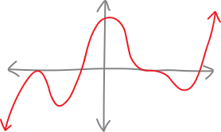

Here are a few more random examples of polynomials (as equations):

$$f(x) = 5x^2 + 3x - 2 \quad\quad\quad f(x) = -8x^{15} \quad\quad\quad f(x) = 3x + 4$$

$$f(x) = 25.7x^{9,000,000} - 3x \quad\quad\quad f(x) = 9 \quad\quad\quad f(x) = x^3 + 92x$$

So we just have a bunch of terms added together, where each term looks like a variable raised to some power times some coefficient. We can have as many or as few terms as we want; the coefficients can be integers, real numbers, whatever. That's what they look like, algebraically. Visually, they're nice, curvy lines that go up and down, up and down, all curvy, like a weathered mountain range. They go up or down to infinity at the ends but they never do so *too dramatically*---they're never infinitely steep or infinitely flat. They're functions that are simultaneously *interesting* and also *well-behaved*. They're not boring, but neither are they dangerous and scary---they're the perfect balance!

We want polynomials to be our best friends. We want to know *everything about them*. In these notes we'll discuss their anatomy---both algebraic and visual---and then we'll discuss how to acquire synæsthesia for polynomials---how to go from their equations to their pictures, from their pictures to their equations, back and forth, back and forth, first consciously and deliberately; then automatically and intuitively.

## What's NOT a polynomial???

We don't want to be negative. We don't want to exclude anyone from our beloved community of functional friends. But not everything is a polynomial. One of the main restrictions, algebraically, is that all the powers need to be positive integers. They can't be negative integers:

$$\text{not a polynomial: } \quad x^{-1} + 5x^{-2} + 3x^2$$

Nor can they be fractions:

$$\text{not a polynomial: } \quad x^{1/2} + 2x^{4/3} - 7x^5$$

I've included one term with an A-OK positive integer power in each of those counterexamples, just to demonstrate that *all* of the powers need to be positive integers (or zero, if it's a constant term, so maybe I should say "non-negative integers"). If any of the powers are fractions or negative (or both!), it's not a polynomial!

Why not? Well, there's a good answer and a bad answer. The bad answer is that that's just how we define what a polynomial is. Polynomials are things that have variables raised to non-negative powers. But that's a bad answer. It doesn't explain *why* we define polynomials like that. The definition of a polynomial wasn't given to Joseph Smith on a golden plate by the angel Moroni. Moses didn't bring the definition of a polynomial down on tablets from Mt. Sinai. The reason we define polynomials this way is because we're trying to *describe* a class of functions. "Definition" is a word that implies human agency. But actually, we're trying to describe abstract objects that are *already there*, and sort them into useful, descriptive buckets, just like we organize the natural world into kingdoms and phyla and classes and orders and genera and species. We're not "defining" sea lions as being eared swimming dogs found on the coast; we're describing what we see and trying to taxonomize it. Even if the act of making a mathematical definition did conjure up abstract structures out of empty space, then we could still ask: why *these* abstractions, and not others? Why *not* allow polynomials to have negative or fractional exponents? Why define it in this way, and not a different way?

The short answer is that, when it comes to polynomials, we're trying to describe a class of functions that---to put it one way---*behave really nicely*. 

Why don't we want negative exponents? We already know one example of a function that's kind like a polynomial but has a negative exponent. $f(x)=\frac{1}{x^2}$, if we write it differently, is just $f(x)=x^{-2}$. And it looks like:

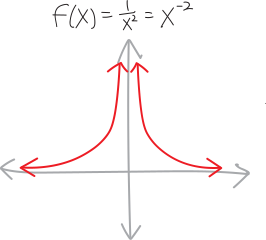{ width=50% }

It's SPIKING UP TO INFINITY! That's scary. Negative exponents mean we sometimes get **singularities** (or "**vertical asymptotes**"), which can be frightening and tricky to deal with. 

What about if we allow fractional exponents? Like with negative exponents, we already know some examples, since roots are just fractional exponents. A cube root, for instance, $f(x) = \sqrt[3]{x}$, we can rewrite as $f(x)=x^{1/3}$:

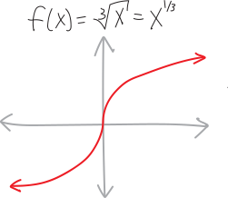{ width=50% }

This isn't spiking up to infinity any more... but look at what's going on at the origin. It's infinitely steep!!!^[A **cusp** is the fancy word for this sort of place, where a function is infinitely steep.] That's kind of scary. Plus, cube roots are less scary then square(/even roots), which are also infinitely steep at the origin, but don't even exist to the left:

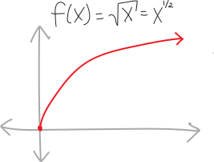{ width=50% }

Square roots (and even roots, and anything with a fractional exponent whose denominator is even) are not only infinitely steep at the origin, but they don't even exist for negative numbers! (At least not without dealing with imaginary numbers, which is a whole other bag of worms.)

So, the point is, if we just build a fence around our playground, we can keep ourselves safe. If we just restrict ourselves to functions whose exponents are positive (or at least non-negative), then we don't have to worry about any of these problems. And maybe once we grow up---once we get a little steadier on our feet---then we can start to deal with things that are scarier and more dangerous, like negative or fractional exponents.

Oh, there's another set of things I won't point out that aren't polynomials. Trig functions and exponential functions---sine, cosine, $e^x$, all that---those aren't polynomials, either. We'll see in calculus that if we could write polynomials with *infinitely many terms*, then trig functions and exponentials would be polynomials^[This is one of my favorite theorems from calculus, known as **[Taylor's Theorem](https://en.wikipedia.org/wiki/Taylor\%27s\_theorem)**.]. But for now, we'll stick to the finite world. That's for later. We'll require our polynomials to be of finite length because infinity is nasty and nebulous and it's not entirely clear what we mean by "infinity."

(Actually, if we could have infinitely-long polynomials, then sometimes we'd even be able to turn things with fractional and negative exponents into polynomials, at least some of the time! But this is getting a bit ahead of ourselves...)

## Polynomial anatomy: equations!

The first two years of medical school you spend basically memorizing every single bone and every single muscle and every single nerve and every single hormone and *every single everything* in the human body. It's a lot of information! And that's basically what we're going to do right now (but with polynomials). Polynomials get complicated. There are a bunch of different words we have for the different pieces of their anatomy. So let's walk step-by-step through what equations for polynomials look like, algebraically, and what we call all their different organ systems.

To start with, here's a random equation for a parabola (which is a simple polynomial):

$$f(x)=5x^2+3x-7$$

So we've got some numbers, times some $x$'s, with each of the $x$'s raised to some power. Algebraically speaking, the idea with a polynomial is: what if we keep going? What if we add on more terms, with numbers and $x$'s raised to higher powers?!? For example, here's a **cubic equation** (a polynomial where the highest exponent is $3$):

$$f(x)=12x^3 + 5x^2+3x-7$$

And here's a **quartic equation** (a polynomial where the highest exponent is $4$):

$$f(x)= x^4 + 12x^3 + 5x^2+3x-7$$

The fancy word for "the highest exponent in a polynomial" is **degree**. So, for example, the degree of a quartic equation is $4$, the degree of a cubic equation is $3$, the degree of a quadratic equation (i.e., a parabola) is $2$, and so forth.

Straight lines are actually just polynomials of degree $1$! That's because the $x$ in the equation actually has an invisible exponent of $1$:

\begin{align*}
f(x) &= 2x+3 \\
&= 2x^1 + 3
\end{align*}

Actually, straight lines are polynomials of degree zero if they're flat. That's because we can think of the constant term (the $y$-intercept) as having an invisible $x^0$ next to it (because $x^0=1$). For example, here's a horizontal straight line at all the $y$-values of $5$:

\begin{align*}
f(x) &= 5 \\
&= 5x^0
\end{align*}

So, actually, *all sorts of things* are polynomials! Straight lines are polynomials! Parabolas are polynomials!!! Et cetera!

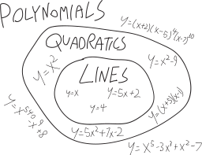

Here's another polynomial:
$$f(x) = 12x^{320}$$
It's not very poly. There's only one term. The name people often give to a one-term polynomial like this is a **monomial**. But it's still a type of polynomial. 

Here's that same *terrifying-looking* seventh-degree polynomial from the introduction:

$$f(x)=x^7 - 13x^6 + 6 x^5 + 458x^4 - 1007x^3 - 4845x^2 + 10600x + 14000$$

I guess if you wanted to give it a cool name, you could call it a **septic equation**, since "sept-" is the Latin root for "seven." Anyway, you can factor this as:

\begin{align*}
f(x) &= x^7 - 13x^6 + 6 x^5 + 458x^4 - 1007x^3 - 4845x^2 + 10600x + 14000 \\
& = (x+1)(x-7)(x+4)^2(x-5)^3
\end{align*}

And by "you," I mean, "theoretically, this *could* be factored by someone, but definitely not you, and definitely not me." I came up with it by writing out the factored form first, and then multiplying it all out to get the unfactored form. (Well, actually, even that would be a pain---I just asked a computer to multiply it out for me.)

We can write polynomials in both **factored** and **unfactored** forms:

\begin{align*}
f(x) &= \overbrace{x^7 - 13x^6 + 6 x^5 + 458x^4 - 1007x^3 - 4845x^2 + 10600x + 14000}^{\text{unfactored form}} \\ \\
&= \underbrace{(x+1)(x-7)(x+4)^2(x-5)^3}_{\text{factored form}}
\end{align*}

Note that lots of high school math teachers call this unfactored form on the top **standard form**, but I don't like that, because that would imply that there's something "not standard" about factored form. That's silly. Factored form is a perfectly "standard" way to write a polynomial.

Unfactored form is made up of a bunch of **terms** added together:

$$f(x) = \underbrace{x^7}_\text{term} - \underbrace{13x^6}_\text{term}  + \underbrace{6x^5}_\text{term}  + \underbrace{458x^4}_\text{term}  - \underbrace{1007x^3}_\text{term}  - \underbrace{4845x^2}_\text{term}  + \underbrace{10600x}_\text{term}  + \underbrace{14000}_\text{term}$$

The term with the highest exponent gets called the **leading term**. The term that's just a number---i.e., the term with the invisible $x^0$---gets called the **constant term**. Sometimes people call the terms in between the **cross terms**:

$$f(x) = \overbrace{x^7}^{\mathclap{\text{leading term}}} \underbrace{- 13x^6 + 6 x^5 + 458x^4 - 1007x^3 - 4845x^2 + 10600x}_{\text{cross terms}} + \overbrace{14000}^{\mathclap{\text{constant term}}}$$

Oh! And there's another really important word: **coefficient**. A coefficient is the number before the $x$---the number the $x$ is multiplied by. So, for example:

$$f(x) = x^7 \underbrace{-13}_{\mathclap{\text{coefficient}}}x^6 + \underbrace{6}_{\mathclap{\text{coefficient}}} x^5 + \underbrace{458}_{\mathclap{\text{coefficient}}}x^4 \underbrace{- 1007}_{\mathclap{\text{coefficient}}}x^3 \underbrace{- 4845}_{\mathclap{\text{coefficient}}}x^2 + \underbrace{10600}_{\mathclap{\text{coefficient}}}x + \underbrace{14000}_{\mathclap{\text{coefficient}}}x^0$$

So, for example, the coefficient on the $x^6$ term is $-13$. The coefficient on the $x^5$ term is $6$. And so forth. It includes the positive or negative sign. The coefficient on the $x^7$ term is $1$---it's just an invisible $1$ we didn't write. Since the $x^7$ term goes by the name "leading term," the coefficient on it often gets called the **leading coefficient**:

$$f(x) = \overbrace{1\cdot}^{\mathclap{\text{leading coefficient}}}x^7 - 13x^6 + 6 x^5 + 458x^4 - 1007x^3 - 4845x^2 + 10600x + 14000$$

Sometimes coefficients are zero! For example, here's the equation for a parabola:

$$f(x) = x^2 - 16$$

What's the coefficient on the $x$-term? Trick question?!? There's no $x$-term?!? Of course there is! It's just that the coefficient is zero, making the $x$-term invisible:

\begin{align*}
f(x) &=  x^2 - 16 \\
&=  x^2\quad\quad\, - 16 \\
&= x^2 + 0x - 16
\end{align*}

There's some vocabulary associated with polynomials written in factored form, too. Factored form is made up of a bunch of **factors** multiplied together:
$$f(x)= \underbrace{(x+1)}_\text{factor}\cdot\underbrace{(x-7)}_\text{factor}\cdot\underbrace{(x+4)^2}_\text{factor}\cdot\underbrace{(x-5)^3}_\text{factor} $$
The number of times a factor shows up (i.e., its exponent) is called its **multiplicity**:
$$f(x)= \underbrace{(x+1)}_{\substack{\text{factor of}\\\text{multiplicity $1$}}}\cdot\underbrace{(x-7)}_{\substack{\text{factor of}\\\text{multiplicity $1$}}}\cdot\underbrace{(x+4)^2}_{\substack{\text{factor of}\\\text{multiplicity $2$}}}\cdot\underbrace{(x-5)^3}_{\substack{\text{factor of}\\\text{multiplicity 3}}} $$

Factors with multiplicities greater than one people sometimes call **repeated roots**. If you want to sound more sophisticated, you can call them **degenerate roots**. (There's nothing salacious about them; it's just that "degenerate" is a fancy word mathematicians and physicists often use for repeats.) Multiplicities have a big effect on what polynomials look like near their $x$-intercepts! We'll get to that soon.

Factors are themselves polynomials, so we can describe as being **linear factors** or **quadratic factors** or **cubic factors** etc., based on what degree polynomial they are. For example, here's a different version of the above polynomial:
$$f(x) = \underbrace{\left( x-7 \right)}_{\text{linear factor}} \underbrace{\left( x^2 + 8x + 16 \right)}_{\text{quadratic factor}}\underbrace{\left(x^3 - 9x^2 + 15x + 25 \right)}_{\text{cubic factor}}\underbrace{\left( x-5 \right)}_{\text{linear factor}}  $$
Above, I made the quadratic factor by multiplying out $(x+4)^2$, and made the cubic factor by multiplying together $(x+1)(x-5)^2$ (so two of the $(x-5)$ factors, but not all three). I's hard to see that this version is the same as the **fully-factored** version of the polynomial just by looking at it (although it is!). Fully-factored, in this context, means that all the factors are linear factors:
$$f(x)= \underbrace{(x+1)}_\text{linear factor}\cdot\underbrace{(x-7)}_\text{linear factor}\cdot\underbrace{(x+4)^2}_\text{linear factor}\cdot\underbrace{(x-5)^3}_\text{linear factor} $$
We've broken the polynomial down as far as we can go! Linear factors are the *atoms* of polynomials. They're the prime numbers of polynomials: think of how we factor numbers down into primes (and how primes are the smallest factors we can break numbers down into).

If you really want to be ridiculous, you could say that the unfactored version of the polynomial is really just a single septic factor:
$$f(x) = \underbrace{\left(x^7 - 13x^6 + 6 x^5 + 458x^4 - 1007x^3 - 4845x^2 + 10600x + 14000\right)}_{\text{``a septic factor"}}$$
Following the letter of the law, but violating the spirit!

Factored and unfactored forms aren't the only ways you can write a polynomial. Here's another polynomial:

$$f(x) = (x - 2)(x +3)^2 - 7$$

This is neither factored nor in "standard" (a/k/a unfactored) form. It's just a weird Frankenstein polynomial. A factored polynomial consists of *only* a bunch of factors multiplied together; a fully-unfactored polynomial consists of *only* a bunch of terms added together.

The verb for factoring a polynomial, by the way, is just **to factor**, note, and definitely not **to factorize**. What's that extra "-ize" doing? Come on! (If you're British, it's not "**to factorise**," either.)

## Unfactoring is boring and tedious

How do we go back and forth between factored and unfactored forms of a polynomial? If we have a factored polynomial, then all we have to do is multiply it out to get the unfactored form! Of course, if it's something with a ton of factors, that's probably pretty boring and tedious. It's not *difficult* (intellectually speaking), but it is *tedious*. 

One nice little trick is that if we have a factored polynomial, and we just want to know its leading term and its constant term, all we have to do is multiply together all the first terms of each factor (to get the leading term) or all the second terms of each factor (to get the constant term). All the gross cross-terms come from combining different combinations of the first and second term of each factor. But if we just want the outermost terms---like, if we want to know the degree of a factored polynomial, or its $y$-intercept---then things are much easier. For example, here's how you could figure out the degree and constant term of that big scary septic polynomial:

\begin{align*}
f(x) &= (x+1)(x-7)(x+4)^2(x-5)^3 \\ \\
&\text{..multiply it all out}\\
&\quad\quad\text{combining every combination of the first and second term of each factor...}\\ \\
&= \Big(\substack{\text{all of the first}\\\text{terms of each factor}}\Big) + \,\, \cdots \quad \substack{\text{a bunch of cross-terms, coming }\\\text{from different combinations}\\\text{of the first and second term}\\\text{of each factor}}\quad \cdots \,\, + \Big(\substack{\text{all of the last}\\\text{terms of each factor}}\Big) \\ \\
&= x\!\cdot\!x\!\cdot\!x^2\!\cdot\!x^3 \quad+ \,\, \cdots \quad \text{cross-terms}\quad \cdots \,\, +\quad (1)(-7)(4)^2(-5)^3 \\ \\
&= x^7  \quad+ \,\, \cdots \quad \text{cross-terms}\quad \cdots \,\, +\quad 14000 \\ \\
&= x^7 - 13x^6 + 6 x^5 + 458x^4 - 1007x^3 - 4845x^2 + 10600x + 14000 
\end{align*}

## But factoring is actually hard

Factoring, in contrast to multiplying, is a legitimate intellectual challenge. It's tough. When you first learn it, it's really hard. There's no formula for how to do it. You're sitting there, a wee eighth-grader, querulous over a quagmire of a quadratic like: 

$$x^2 - 2x - 15$$

You're not sure what to do. So you write down: 

$$(x + \,\,\,\,\,\,)(x + \,\,\,\,\,\,)$$

You stare at that for a while. You experiment. You quiver in anxiety. You try some numbers, multiply them out, and they don't work. So you try some more. Eventually---in a blinding flash of insight---you realize how to do it! You realize that it's:

$$(x + 3)(x -5)$$

In a sense, this is the first time that you really get to experience the *feeling* of doing math. You get that feeling of being lost in the woods without a map, and having to stumble through, trusting that eventually you'll make it out, groping at branches,

> ...  in a dark wood, in a bramble,  
> On the edge of a grimpen, where is no secure foothold,  
> And menaced by monsters, fancy lights,  
> Risking enchantment. ... ^[T.S. Eliot, *East Coker*, 90-93]

And then all of a sudden, without warning, you come to an opening and push the branches aside and see the glory of a beautiful mirador!!! It's glorious! It's beautiful! It's sublime!

So you keep factoring. You do more and more problems, and it gets easier. You come up with little strategies for how to factor, little mental heuristics, and you develop an intuition. You wonder: could you formalize this intuition? Meaning: you've gotten good at factoring, but you still don't really want to have to factor every quadratic you see by hand. It would be nice if you could do it automatically. It would be nice if you could *build a machine* that factors quadratics for you! It would be nice if you *had an equation* into which you could pop a quadratic, and out of which would pop its roots!

So you work on this project for a while. And eventually you come up with the method of completing the square, and eventually you derive the quadratic equation. And with the quadratic equation, you can now factor every quadratic!!! To wit:

$$ax^2 + bx + c \quad=\quad a\left(x - \frac{-b \,+ \, \sqrt{b^2 - 4ac}}{2a}\right)\!\!\! \left(x - \frac{-b \,-\, \sqrt{b^2 - 4ac}}{2a}\right)$$

If you're skeptical, just multiply out the right side (using FOIL or something). After a lot of simplification, you'll get just $ax^2 + bx + c$! Isn't it beautiful? Here's a picture of the quadratic equation spray-painted onto a Jersey barrier in New York:

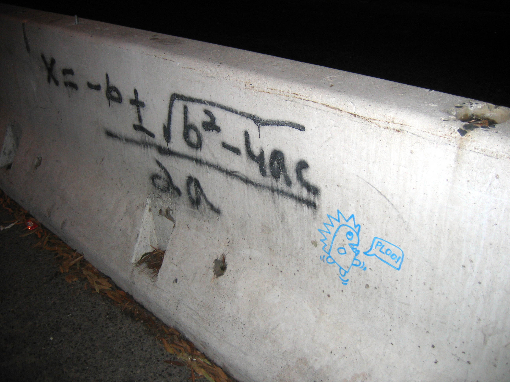{ width=75% }^[http://www.flickr.com/photos/37665276@N00/76780093]

You can do the same thing for any cubic polynomial. You can come up with a "cubic formula" which is hideously long but does factor any third-degree polynomial. Likewise with quartics (fourth-degree polynomials), though the quartic formula is so long and messy that it's kind of a nightmare. But as it turns out, for fifth-degree polynomials and above, there is no general formula for factoring. There's no machine we can build that will factor every fifth-degree (or higher) polynomial. In other words, sometimes it's *impossible* to factor fifth-degree and greater polynomials! Thank Évariste Galois (1811-1832) for proving that, and then getting killed in a duel over a love interest before he could do even more awesome mathematics. 

The theory of factoring is one of my favorite things in mathematics. When you do it abstractly enough (i.e., you define a polynomial such that it might not involve numbers, or even arithmetic), there is a lot of beauty in factorization. It requires a lot of mathematical machinery, but there are some really amazing connections between whether you can factor a polynomial and the symmetry of the coefficients. When you take Jana's Abstract Algebra course, you'll get to learn this!

## Polynomial anatomy: pictures!

So, that's the *algebraic* anatomy of polynomials. What about their *visual* anatomy? This is easier! They're just curvy lines.

Polynomials have **maxima** and **minima**:

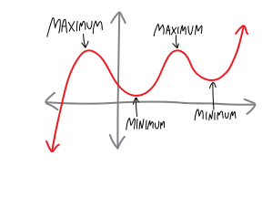{ width=65% }

You can think of maxima as being like the mountains of the polynomials, and minima as the valleys. Sometimes people call them **local maxima** and **local minima**, to emphasize that they're just the highest/lowest points nearby, as opposed to the highest or lowest the polynomial *ever* gets (which people call a **global maximum** and a **global minimium**). But I usually just use **maximum** and **minimum** (those are the singular forms.) If we want to talk about them collectively, we can refer to **optima** (singular **optimum**) or **extrema** (singular **extremum**):

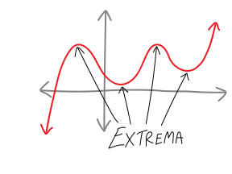{ width=65% }

Polynomials also have weird points like this:

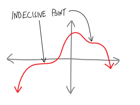{ width=65% }

Most people call these **inflection points**; I usually call them **indecisive points**, because it's like the polynomial is indecisive about whether it wants to be an extremum or not. It's going up, slowing down, about to turn around and go towards the negative, it's *almost* a maximum... but then it changes its mind at the last minute. Or, inversely, it's going down, and it's slowing down, about to turn around and go back towards the positive and become a minimum... but then it changes its mind and keeps going down. It's indecisive! (Also, inflection points are also defined in a slightly more subtle way, encompassing more than just what I've described as indecisive points, but we'll wait to calculus to talk about them.^[Or this footnote. Here is a picture of other points that get described as inflection points---can you figure out what inflection points actually are? What do all these points have in common??? { width=50% } ])

Polynomials also have **$x$-intercepts**! Which are also known as **roots**! Which are also known as **solutions**! Which are also known as **zeroes**! (These terms all have slight shades of meaning, but it's fine for us to use them interchangeably.) They're great! They're wherever a polynomial crosses (or even just touches) the $x$-axis. Here are some:

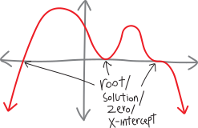{ width=65% }

Note that polynomials can behave in different ways at their roots. They can bounce off the $x$-axis---i.e., they can touch it, without actually crossing it. They can cross it, straight through, directly, with confidence. Or they can cross, but kind of indecisively and bendily:

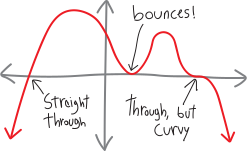{ width=65% }

The distinction between a root at which the polynomial crosses in a straight line versus a root at which the polynomial crosses in a cubicky shape is kind of like the distinction between dogs and coyotes. If you're walking down the street and see some sort of generic canine ambling along, how do you know if it's a dog or a coyote? Well, dogs, when they take themselves for walks, are indecisive. They pause to sniff, they circle back, they path-find along twisty, tortuous curves. But coyotes---they just *go*. They're goal-oriented. They move quickly. They walk decisively. They walk in straight lines, not paying attention to the people or the plants or anything else. So a root that crosses the $x$-axis straight through is like a coyote; a root that crosses the $x$-axis is like a dog. 

What about roots that bounce off the $x$-axis? I should come up with an animal name for them, too. Maybe an animal that's skittish and scared and will run away? A deer?

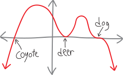{ width=65% }

Oh, and polynomials have **$y$-intercepts**, too. They're not that exciting:

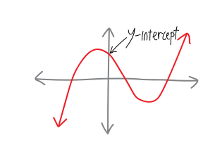{ width=65% }

## Painting polynomials!!!!

So we can think about polynomials *algebraically*, or we can think about them *visually*! But how do we connect these two representations? How do we take the equation for a polynomial and draw a picture? How do we take the picture of a polynomial and write an equation??

$$\large \substack{\text{equation of}\\ \text{a polynomial}} \quad \overset{???}{\Longleftrightarrow} \quad \substack{\text{picture of}\\ \text{a polynomial}}  $$

If our polynomial is just a monomial---if it just has one term---then it's pretty easy to draw. Even-degree monomials look like this:

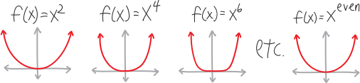

So, as the power increases, even monomials get steeper at the edges, and flatter between $x=-1$ and $x=+1$. In Jamie Choy '24's phrasing, they get a *stronger jawline*. So $x^6$ has a stronger jawline than $x^4$, which has a stronger jawline than $x^2$, etc. 

Odd-degree monomials, meanwhile, look like:

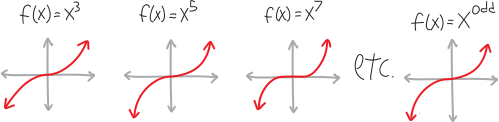

They, too, get a stronger jawline; it's just that... well, uh, they're beautiful in their own way.

   

But what about polynomials that have lots of terms? What about stuff like:

$$f(x) = 5x^4 - 35x^3 + 25x^2 + 155x - 150$$

What happens when we add all of those extra terms? How do all of those cross-terms affect the shape of the polynomial? Good news: that's when the fun stuff happens! It's the cross-terms that make polynomials bounce up and down! It's the cross-terms that make them exciting! When we add these additional terms, we introduce the possibility of factoring the polynomial differently, which would give us new $x$-intercepts, and consequently, new maxima and minima. And we'll get to all that fun stuff in a second. But, overall, the polynomial retains the "general shape" of its leading term---meaning that if you zoom out far enough, the polynomial above will look more and more like $f(x) = 5x^4$:

$$5x^4 - 35x^3 + 25x^2 + 155x - 150 \quad \xrightarrow{\quad \text{as we zoom reallllly far out}\quad }\quad 5x^4$$

In other words, it'll look more and more like a parabola (or at least more and more like $x^4$, which is just a parabola with a stronger jawline). Here's what the function looks like, zoomed in, near the roots:

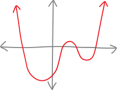{ width=50% }

And here's what it looks like if we zoom out a bit:

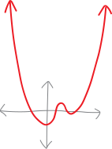{ width=50% }

Here's what it looks like if we zoom out even further:

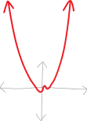{ width=50% }

It looks like a parabola!!! Another way of describing this is to say that the polynomial has an **end asymptote**^[The rigorous mathematician inside of me feels obligated to point out that all this stuff is true only for a certain definition of an asymptote, and not necessarily true for other definitions, but I'm going to pretend that we are using the computer-sciencey definition of an asymptote, and we can always save the rigor and the details for later... it's not like we're formally defining any of this, anyway!] at whatever its leading term is. In the above example, for instance, the polynomial $f(x) =5x^4 - 35x^3 + 25x^2 + 155x - 150$ has an end asymptote at $f(x) = 5x^4$ (a **parabolic asymptote**). 

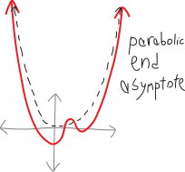{ width=65% }

Let me see if I can give some justification for why this happens. This isn't a formal proof, but it does contain the basic idea about what's going on. Imagine we have some polynomial---say, the one we've been playing with. What happens as we plug in bigger and bigger values for $x$? Let's make a table and see.

$$f(x) = 5x^4 - 35x^3 + 25x^2 + 155x - 150$$

| $x$ | $5x^4$ | $-35x^3$ | $25x^2$ | $155x$ | $-150$ | 
|---|---|---|---|---|---|
| $0$ | $0$ | $0$ | $0$ | $0$ | $-150$  | 
| $1$ | $5$ | $-35$ | $25$ | $155$ | $-150$  | 
| $5$ | $3,\!125$ | $-4,\!375$ | $625$ | $775$ | $-150$  | 
| $10$ | $50,\!000$ | $-35,\!000$ | $2,\!500$ | $1,\!550$ | $-150$  | 
| $100$ | $500,\!000,\!000$ | $-35,\!000,\!000$ | $250,\!000$ | $15,\!500$ | $-150$  | 
| $1000$ | $1,\!000,\!000,\!000,\!000$ | $-35,\!000,\!000,\!000$ | $25,\!000,\!000$ | $155,\!000$ | $-150$ |

What's going on here? When we plug in zero for $x$, everything is zero, except for the constant term. Near $x=0$, all the other terms will be comparatively small, so the constant term (to use a fancy phrase) is the **dominant term**, and the function will be close to $y = -150$. But as we plug in larger values for $x$, $-150$ just stays the same, and all of a sudden other terms start getting larger than it. As we plug in bigger and bigger values for $x$, not only is the leading term ($5x^4$) getting exponentially bigger, but the *difference* between $5x^4$ and all the other terms is *itself* getting exponentially bigger. Compared to $-150$, $50\!,000$, or even one million, $1\!,000\!,000\!,000\!,000$ is just way, way bigger. 

In summary, then, it's easy to find out what a polynomial looks like on the far left side and the far right side---we just look at the leading term. The tails of a polynomial always go either up to infinity or down to negative infinity---there are never any horizontal asymptotes or anything like that. Put differently:
 
* **Polynomials of even degree**: the tails both go in the same direction. 
    * Leading coefficient $+$: tails both go up (like $+x^2$).
    * Leading coefficient $-$: tails both go down (like $-x^2$). 
* **Polynomials of odd degree**: the tails go in opposite directions. 
    * Leading coefficient $+$: down on the left, up to the right (like $+x^3$)
    * Leading coefficient $-$: up on the left, down to the right (like $-x^3$)

   

So that's what the edges of a polynomial will look like. What about the middle of a polynomial?

> In the middle, not only in the middle of the way  
> But all the way, in a dark wood, in a bramble,  
> On the edge of a grimpen, where is no secure foothold,  
> And menaced by monsters, fancy lights,  
> Risking enchantment. ...

Oh... that's that exact same passage from *East Coker* again. Oops. Anyway, the *middle* is where the real fun happens! That's where polynomials bounce up and down---smoothly, continuously, never getting infinitely steep, never getting infinitely flat, etc., etc. We're definitely not "menaced by monsters" in the middle of a polynomial. Instead, we can basically figure out how they bounce up and down just by figuring out where the roots/zeroes/solutions/$x$-intercepts are, and then connecting the dots (as it were)! If we know what's happening at the far left and far right edges of the polynomial, and we know where and how the polynomial is crossing the $x$-axis, then we can just connect the dots and doodle a pretty polynomial!

So then our question becomes: where do roots/zeroes/solutions/$x$-intercepts happen? How do we find them? Well, $x$-intercepts happen wherever the $y$-value of a polynomial is zero. So to find them, we can set the polynomial equal to zero, and solve for $x$. It's way easier to do this in factored form, because then we just have to look at where each individual factor is zero. (If one of the factors is zero, then the whole polynomial has to be zero, because zero times anything is still zero.)

For example, consider the polynomial:

$$f(x) = (x+2)(x-3)$$

If we want to find its roots/solutions/zeroes/$x$-intercepts, we want to find where its $y$-value is zero, so we can set the whole thing equal to zero:

$$0 = (x+2)(x-3)$$

What values of $x$ make this true? If either *one* of those two factors on the right is zero, then the entire expression will be zero, and so the equation will be true. So, for example, if the $(x-2)$ factor is zero, we'll have:

\begin{align*}
0 &= \underbrace{(x+2)}_{\mathclap{\substack{\text{if this is zero,}\\\text{then EVERYTHING is zero}\\\text{and the equation will be true}}}}(x-3)\\
0 &= 0\cdot (x-3) \\
0 &= 0 \\
&\text{great}
\end{align*}

So we just need to find when $x+2$ is zero:

$$0 = \underbrace{(x+2)}_{\mathclap{\substack{x+2=0\\ \\ x=-2}}}(x-3)$$

So $x=-2$ is one of the roots/solutions/zeroes/$x$-intercept. What about the other factor? If that's ever zero, then the whole polynomial will be zero, too:

$$0 = (x+2)\underbrace{(x-3)}_{\mathclap{\substack{\text{if this is zero,}\\\text{then EVERYTHING is zero}\\\text{and the equation will be true}}}}$$

So let's figure out when it's zero:

$$0 = (x-2)\underbrace{(x-3)}_{\mathclap{\substack{x-3=0\\ \\ x=+3}}}$$

So then $x=+3$ is another root/solution/zero/$x$-intercept.

In this case, of course, the two equations we had to solve were pretty simple. But in other instances, they might be more complicated. The point is: to find the roots, we find where the $y$-value of the polynomial is zero; this means that we just need to find where each factor of the polynomial is zero! (And... there might be times when we have a factor that doesn't actually cause an $x$-intercept! We'll see an example later.)

Of course, as we've already seen, roots can do different things at the $x$-axis! They can go straight through, like coyotes; they can go through distractedly and bendily, like dogs; they can skittishly bounce off, like deer. How can we figure out, from the equation, which of these happens? We just have to think about the multiplicity of a root!!!  As we said earlier, the **multiplicity** of an $x$-intercept/solution/zero/root is the number of times the factor creating the particular root shows up in the complete factorization (in the factored form of the polynomial). They're useful in our synæsthesia, because the multiplicity of a root tells us what the polynomial looks like near that root! It tells us the shape of the polynomial near the $x$-intercept/root/solution/zero. In particular:

* if the root is of **multiplicity $1$**: the polynomial looks like a straight line near that root (crosses through axis)(like a coyote)
* if the root is of **even multiplicity**: the polynomial looks like a parabola (even-degree polynomial) near the root (i.e., it only bounces off the axis; it doesn't cross it)(like a deer)
* if the root is of **odd multiplicity** (greater than $1$): the polynomial looks like an odd-degree polynomial near the root (e.g., crosses through axis and is bendy as it goes through)(like a dog)

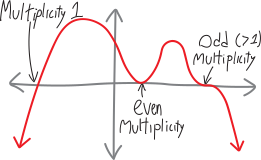{ width=65% }

   

Oh right, and then there's that boring ol' $y$-intercept. Finding the $y$-intercept of a polynomial is the same as finding the $y$-intercept of anything else. Since the $y$-axis is just the line $x=0$, the $y$-intercept is just the value of the function when $x=0$. So we can plug $0$ in for $x$ to find the $y$-intercept.

If we have a polynomial in un-factored form, the $y$-intercept is just the constant term. For example, consider the polynomial:

\begin{align*}
f(x) &= 5x^6 - 2x^3 + 4x + 32 \\
\text{Then its $y$-intercept will be at:} \\
f(0) &= 5\cdot0^6 - 2\cdot0^3 + 4\cdot0 + 32 \\
&= 0 - 0 + 0 + 32 \\
&= 32
\end{align*}

So the $y$-intercept is at $y = 32$.

If we have a polynomial that's factored, it's a little trickier... but not much trickier. We just multiply the non-variable parts of each term (including the exponents). So, for example, if we have the polynomial:

\begin{align*}
f(x) &= (x + 3)(x - 4)(x + 2)^2 \\
\text{Then the $y$-intercept is at:} \\
f(0) &= (0 + 3)(0 - 4)(0 + 2)^2 \\
&= (3)(-4)(2)^2  \\
&= - 48
\end{align*}

So the $y$-intercept is at $y = -48$. 

## Let's graph a real polynomial!

All that theory is tedious. Let's actually graph (paint) a real (pretty) polynomial!!! Start to finish! Consider this polynomial:
$$f(x) = x(x - 2)(x+4)^3(2x-6.39)^2$$

*  First, let's figure out what the overall shape will look like! To do that, we need to see what degree this polynomial is. If we were to multiply this all out, the leading term would be something like $x^7$, so the general shape will look like a $+x^\text{odd}$ polynomial! So it looks like $+x^3$ or something---it comes from the bottom left, and ends up heading up and to the right. Let's mark that:

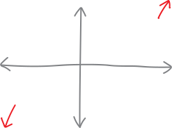{ width=65% }

* Next, let's find the $x$-intercepts/roots/solutions/zeroes. This function has four factors, so we'll set each of them equal to zero and figure out the corresponding $x$-intercept/root/solution/zero.

    * From the first factor, $x$, we get $x=0$ as a root/$x$-intercept, of multiplicity $1$. It's a little easier to see if we write that factor as "$(x-0)$" instead of just "$x$":
    \begin{align*}
f(x) &= x(x - 2)(x+4)^3(2x-6.39)^2 \\
&= (x-0)(x - 2)(x+4)^3(2x-6.39)^2
\end{align*}

    So if we set that factor equal to zero, we'll get $0$ as a root:
    $$f(x) = \underbrace{(x-0)}_{\mathclap{\substack{x-0=0\\ \\x=0}}}(x - 2)(x+4)^3(2x-6.39)^2$$
    It has a multiplicity of $1$, because there's an invisible "$1$" on the $x$:
    \begin{align*}
f(x) &= x^1(x - 2)(x+4)^3(2x-6.39)^2 \\
&= (x-0)^1(x - 2)(x+4)^3(2x-6.39)^2
\end{align*}
    So it passes through the $x$-axis, and it passes straight through, like a line.

    * From the second factor, $(x-2)$, we get that $x=2$ is a root (of multiplicity $1$, so it goes straight through). Again, we can see this by setting that factor equal to zero and solving for $x$:
$$f(x) = x\underbrace{(x-2)}_{\mathclap{\substack{x-2=0\\ \\x=2}}}(x+4)^3(2x-6.39)^2$$

    * From the $(x+4)^3$ factor, we get that $x=-4$ is a root, of multiplicity $3$. We can figure this out by setting that factor equal to zero and doing some algebra:
$$f(x) = x(x - 2)(x+4)^3\underbrace{(x+4)^3}_{\mathclap{\substack{(x+4)^3=0\\ \\\sqrt[3]{(x+4)^3}=\sqrt[3]{0}\\ \\ x+4 = 0 \\ \\ x = -4}}}(2x-6.39)^2$$
So $x = -4$ is an $x$-intercept. And, since the factor $(x+4)^3$ is cubed, the root is of multiplicity $3$. So it goes through the $x$-axis, and it's bendy as it goes through.

    * Finally, the $(2x-6.39)^2$ factor gives us an $x$-intercept at $x = 3.195$ (of multiplicity $2$):
$$f(x) = x(x - 2)(x+4)^3(x+4)^3\underbrace{(2x-6.39)^2}_{\mathclap{\substack{(2x-6.39)^2=0\\ \\\sqrt{(2x-6.39)^2}=\sqrt{0}\\ \\ 2x-6.39 = 0 \\ \\ 2x = 6.39 \\ \\ x = 3.195}}}$$

We can summarize our findings:

$$f(x) = x(x - 2)(x+4)^3(2x-6.39)^2$$

| factor	|	$x$ | $(x - 2)$ | $(x+4)^3$ | $(2x-6.39)^2$  |
|---|---|---|---|---|
| root	|	$x=0$  |  $x=2$    | $x=-4$  |   $x=3.195$  |
| multiplicity	|	$1$  |  $1$    | $3$  |   $2$  |
| shape | $\substack{\text{straight}\\\text{through}}$ | $\substack{\text{straight}\\\text{through}}$ | $\substack{\text{bendy}\\\text{through}}$ | $\text{bounces}$ |

Let's mark those roots on the graph:
   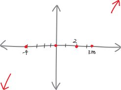{ width=65% }

* How about the $y$-intercept? We'll just plug $0$ in for $x$, and get:
\begin{align*}
f(0) &= 0(0 - 2)(0+4)^3(2\cdot0-6.39)^2 \\
&=0(- 2)(4)^3(-6.39)^2 \\
&= 0
\end{align*}
    So this polynomial has a y-intercept at $0$. It has to, because it has a root there at $x=0$! But it's good to double-check. That's already on our picture, so no need to add anything new. 

* So now we can graph it! All we have to do is plot the $x$-intercepts and, basically, connect the dots---we need to know where to start drawing a line from (in this case, starting at the bottom left and ending at the top right, because it looks like $+x^3$), and we need to know what the polynomial looks like at each of the $x$-intercepts (which the multiplicity tells us). But then we can do it!

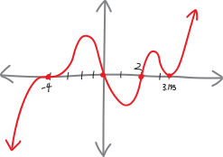{ width=65% }

## Let's graph another polynomial!

Another! This time, let's draw a picture of this polynomial:

$$f(x) = - (x - 3)(x + 1)^2(x-1)^3$$

* This is sixth-degree, and there's a negative in front, so the general shape is like $-x^2$ (so both the tails go down). So, let's draw that in on our graph:
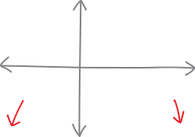{ width=65% }

* Its roots and their multiplicities are:

$$f(x) = - (x - 3)(x + 1)^2(x-1)^3$$

| factor	|	$(x - 3)$ | $(x + 1)^2$ 	| $(x-1)^3$ 	 |
|---:|:---:|:---:|:---:|
| root	|		$x=+3$  		|  $x=-1$    		| $x=+1$	    |
| multiplicity|	$1$  		|  $2$    		| $3$  	  |
| shape | $\substack{\text{straight}\\\text{through}}$ | bounces | $\substack{\text{bendily}\\\text{through}}$

Let's mark those on the graph!

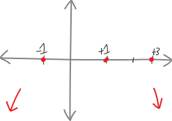{ width=65% }

* It has a $y$-intercept at:  \begin{align*}
f(0) &= - (0 - 3)(0 + 1)^2(0 - 1)^3 \\
&= - (- 3)(1)^2(- 1)^3 \\
&= - 3
\end{align*}
Let's mark that on the graph!!!

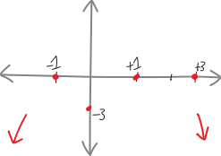{ width=65% }

* So now let's connect the dots, and paint our complete polynomial!!!! We should have:

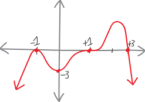{ width=65% }

## Going backwards

What if we wanted to do the reverse---to walk into the Metropolitan Museum of Art, see a beautiful oil painting of a polynomial on the wall (there is a little-known mathematics gallery underneath the Temple of Dendur), and show off our math skills to our attractive date by saying, "Aha! I can come up with an equation for that polynomial!"?

We could do just that. Imagine that the painting that strikes our fancy looks like this:

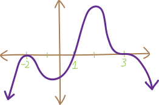{ width=65% }

What can we say about this just from looking at it? 

* We can see that both tails point in the same direction, so it must be of even degree. The tails are both pointing down (not up), so it must have a negative out in front somewhere (making it open down rather than up).

* We can see that it has three roots:
    * It has a root at $x=-2$, and since the polynomial bounces/looks like a parabola near $x=-2$, this root must be of even multiplicity. It might be of multiplicity $2$, multiplicity $4$, $6$, etc. So a possible factor of the polynomial could be $(x + 2)^2$.

    * It has a root at $x=+1$, and since it goes straight through the axis (not curvily through the axis), that root must be of multiplicity $1$. So it must have been created by the factor $(x - 1)$.

    * Finally, it has a root at $x=+3$, and since it goes through the axis and is kinda bendy as it goes through, that root must be of odd multiplicity---maybe multiplicity $3$, maybe $5$, maybe $341$. So a possible factor could be $(x - 3)^3$.

    We can summarize our findings, similarly to how we did before:
    
    

    | root | $x=-2$ | $x=+1$ | $x=+3$ |
    |---:|:---:|:---:|:---:|
    | multiplicity |	even  		|  $1$    		| odd  	   |
    | possible factor	|	$(x + 2)^2$ | $(x + 1)$ 	| $(x - 3)^3$ |

So now we can take a stab at coming up with an equation! We'll just pile all those factors together, and remember to include a $-$ in front:

$$f(x) = -(x + 2)^2(x + 1)(x - 3)^3$$

Could this be an equation for this graph? Sure. The polynomial we've written is of degree $6$, so it's even, which checks out. It has a negative in front, which will make it open downward (good). And, finally, we can check the $y$-intercept: 

\begin{align*}
f(0) &= -(0 + 2)^2(0 + 1)(0 - 3)^3 \\
&= -(1)^2(1)(-3)^3 \\
&= -108 \\
&= (\text{negative})
\end{align*}

The $y$-axis on our graph doesn't have a scale, but we can see that the $y$-intercept should be some negative number---so this appears to work. Hooray!

So you tell this to your date. And they say, “Mmm... but couldn't it also be $$f(x) = -(x + 2)^4(x + 1)(x - 3)^7$$

And you stammer, "Well, of course. That function would still have the same basic properties---it just might have a different vertical scale, and some of the roots might be a little more shapely."

Then they say, “What about

$$f(x) = -(x + 2)^4(x + 1)(x - 3)^7\left(x^2+1\right)$$

And you say, "Of course not! What's that extra $\left(x^2 + 1\right)$ factor doing in there? There's no root at... oh."

They say, “It works. The factor $\left(x^2 + 1\right)$ doesn't give you a real-valued root that you can plot on the $xy$-plane. If you try to solve it, you get:

$$\left(x^2 + 1\right) = 0$$
$$x^2 = -1$$
$$x =\pm \sqrt{-1}$$
"The square root of negative one is an imaginary number, not a real one. It'll change the vertical scale of the polynomial---it's like a non-linear vertical expansion, if you can imagine that---but it'll still have all these basic properties."

And then they walk off toward the Henry Moore exhibit.

## Problems

First, some factoring! Solve each of the following equations for $x$. (What do I mean by "solve"? I mean, find all the values of $x$ such that the equation is true.)

<ol class="problems">
<li> $x = 0$ </li>
<li> $2x = 4$ </li>
<li> $3x = 5$ </li>
<li> $x - b = 0$ </li>
<li> $4x - 2a = -7$ </li>
<li> $5 = 3$ </li>
<li> $x - 5 = 6$ </li>
<li> $x^2 = 9$ </li>
<li> $x^2 = 12$ </li>
<li> $x^2 = 40$ </li>
<li> $-x^2 = -10$ </li>
<li> $3x^2 = 12$ </li>
<li> $\frac{1}{2}x^2 = 10$ </li>
<li> $-5x^2 = -30$ </li>
<li> $-3x^2 = 11$ </li>
<li> $25x^2 - 4 = 0$ </li>
<li> $4x^2 - 28 = 0$ </li>
<li> $-3x^2 + 8 = -20$ </li>
<li> $-2x^2 - 11 = 5$ </li>
<li> $\frac{1}{x} = 0$ </li>
<li> $x^2 - 8x + 15 = 0$ </li>
<li> $x^2 - 5x = 14$ </li>
<li> $x^2 + 5x + 6 = 0$ </li>
<li> $x^2 + x = 20$ </li>
<li> $2x^2 + 5x - 3 = 0$ </li>
<li> $3x^2 - x - 2 = 0$ </li>
<li> $4x^2 + 9x + 2 = 0$ </li>
<li> $9x^2 + 2 = 11x$ </li>
<li> $3x^2 + x = 4$ </li>
<li> $5x^2 + 26x = -5$ </li>
<li> $12x^2 + 13x = 4$ </li>
<li> $18x^2 = 23x + 6$ </li>
<li> $x^2 - yz + xz - xy = 0$ </li>
<li> $x^6 - 2x^4 - 8x^2 + 16 = 0$ </li>
<li> $a^3 - 2b^2 + 2a^2b - ab = 0$ </li>
<li> $u^2x - 2w^2 - 2uxw + uw = 0$ </li>
<li> $x^3 + 4x^2 - 8x - 32 = 0$ </li>
<li> $z^8 - 5z^7 + 2z - 10 = 0$ </li>
<li> $12x^3 + 9x^2 + 8x + 6 = 0$ </li>
<li> $10x^2y - 8x^2 + 5y - 4 = 0$ </li>
<li> $3x^2 + 5x + 11 = 0$ </li>
<li> $px^2 + qx + r = 0$ </li>
<li> $x^2 -2x = 12$ </li>
<li> $x^2 - 4x - 30 = 0$ </li>
<li> $x^2 - x - 1 = 0$ </li>
<li> $x^2 + 3x - 2 = 0$ </li>
<li> $x^2 - 4x + 1 = 0$ </li>
<li> $x^2 + 6x + 7 = 0$ </li>
<li> $x^2 + 6 = 2x$ </li>
<li> $4x^2 - 4x = 7$ </li>
<li> $4x^2 - 8x + 1 = 0$ </li>
<li> $5x^2 + 8x = -2$ </li>
<li> $x^2 + 9x + 18 = 0$ </li>
<li> $4x(x+ 1) = 1$ </li>
<li> $2x^2 = 7x + 15$ </li>
<li> $x^2 + 4x + 13 = 0$ </li>
<li> $\frac{7x^2}{3} = \frac{2x}{3} - 1$ </li>
<li> $25x + \frac{4}{x} = 20$ </li>
<li> $\sqrt{7}x^2 + 3x + 33 = 0$ </li>
<li> $x^2 + \pi x + 3.1 = 0$  </li>
<li> $5x^2 + 5x + 5 = 0$ </li>
<li> $10\alpha x^{29} - 40g\alpha x^{27} - 5yx^2{\alpha}^2 + 20{\alpha}^2gy = 0$ </li>
</ol>

   

For the following polynomials: 
<ol class="lettered-list">
<li> What is the degree of the polynomial? </li>
<li> What is the sign of the leading coefficient? </li>
<li> How many real roots/solutions/zeroes/$x$-intercepts does it have? Where are they, and what are their multiplicities? </li>
<li> What is the $y$-intercept? </li>
<li> What does the polynomial look like? (i.e., sketch it. Without a calculator!)  </li>
</ol>

(You might have to factor or otherwise manipulate the expressions to get them into a convenient form.)

<ol  class="problems">
<li> $f(x) = (x - 2)(x + 4)$ </li>
<li> $h(x) = x^2 + 8x + 15$ </li>
<li> $t(x) = x^2 - 2x -15$ </li>
<li> $r(x) = x^2 - x - 2$ </li>
<li> $w(x) = x^2 - 2x - 63$ </li>
<li> $f(x) = x^3 + x^2 - 4x - 4$ </li>
<li> $j(x) = x^4 + 2x^3 + 9x + 18$ </li>
<li> $g(x) = x^5 - x^3 + 5x^2 - 5$ </li>
<li> $h(x) = (x - 2)(x + 3)(x + 5)$ </li>
<li> $t(x) = -(x - 1)(x + 9)(x -7)(x + 3)$ </li>
<li> $r(x) = (x + 4)(x - 2)(x + 6)(x - 5)$ </li>
<li> $f(x) = 5(x - 2)(x + 10) (x + 4)$ </li>
<li> $f(x) = 3x^2(x - 1)(x + 7) (x + 8)$ </li>
<li> $w(x) = (x - 6)(x + 4)^2(x - 1)^3$ </li>
<li> $f(x) = (x + 3)^2(x + 5)^2$ </li>
<li> $j(x) = (x + 1)^2$ </li>
<li> $f(x) = (x + 1)(x- 5)^2(x^2 + 3)$ </li>
<li> $f(x) = -(x^2 - 1)(x- 3)^2x^2$ </li>
<li> $f(x) = 5x(3x + 2)(x - 5)(x + 6)$ </li>
<li> $f(x) = (x^3 + 27)(x + 2)^2$ </li>
<li> $f(x) = -(x^2 - x - 12)(x^2 + 8x + 12)$ </li>
<li> $f(x) = (x + 1)^2(x + 7)^7(x^2 + 3)$ </li>
<li> $f(x) = x^3(x^2 - 9)$ </li>
<li> $f(x) = (x - a)(x+5a)^2(x+a)$, where $a$ is a constant greater than zero. </li>
<li> $f(x) = a^2(x - 3a)(x+a)^3$, where $a$ is a constant greater than zero. </li>
<li> $f(x) = (x - a)(x+b)^2(x+5b)$ </li>
</ol>

   

For the following graphs of polynomials: 

<ol class="lettered-list">
<li> What is the degree of the polynomial (even or odd)?
<li> What is the sign of the leading coefficient (positive or negative)?
<li> How many real roots/solutions/zeroes/$x$-intercepts does it have? Where are they, and what are their multiplicities?
<li> How many extrema (minima and maxima) does the polynomial have?
<li> What could a possible equation for the polynomial be? (Give it in factored form.)
<li> What could a *second* possible equation for this polynomial be? (i.e., an equation which gives a polynomial that has the same general shape and the same $x$-intercepts.)
</ol>

(Note that the $x$-axes and $y$-axes of these graphs have different scales.)

<ol class="problems">
<li> 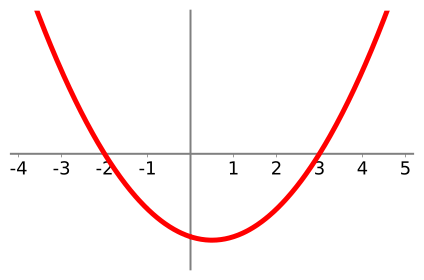{ width=90% }</li>
<li> 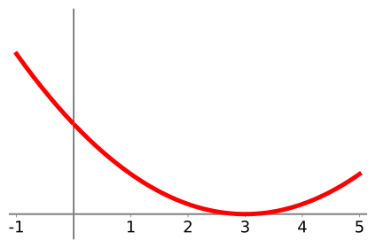{ width=90% }</li>
<li> 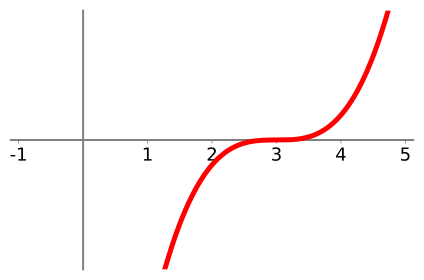{ width=90% }</li>
<li> 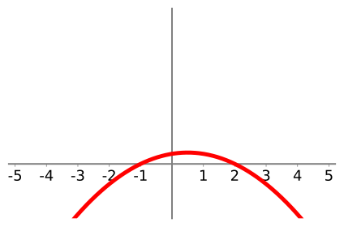{ width=90% }</li>
<li> 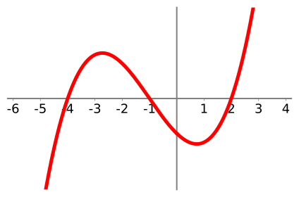{ width=90% }</li>
<li> 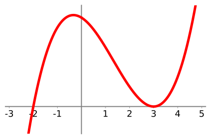{ width=90% }</li>
<li> 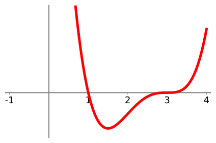{ width=90% }</li>
<li> 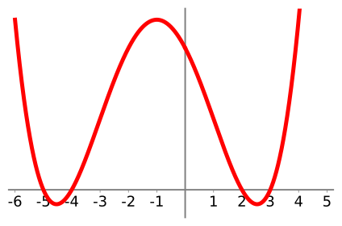{ width=90% }</li>
<li> 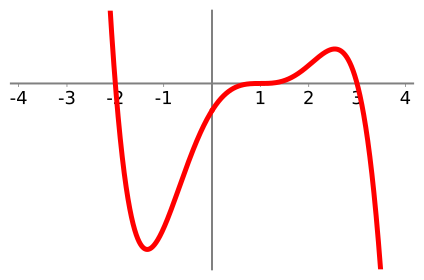{ width=90% }</li>
<li> 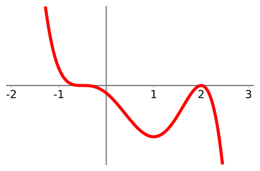{ width=90% } </li>
<li> 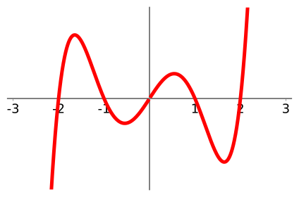{ width=90% } </li>
<li> 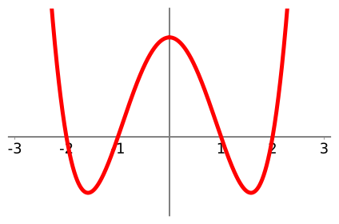{ width=90% } </li>
<li> 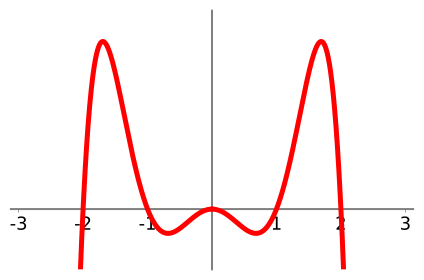{ width=90% } </li>
<li> 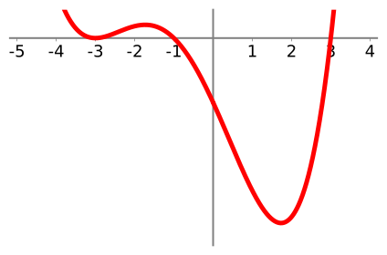{ width=90% } </li>
<li> 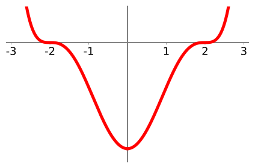{ width=90% } </li>
<li> 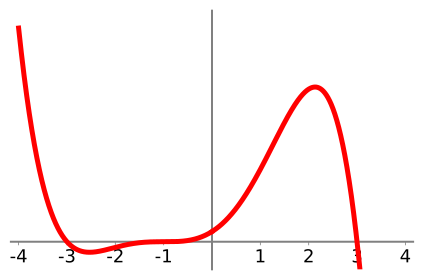{ width=90% } </li>
<li> 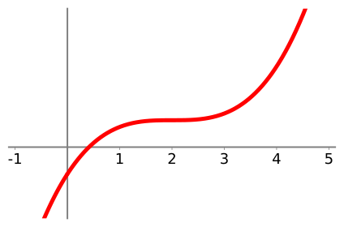{ width=90% } </li>
<li> 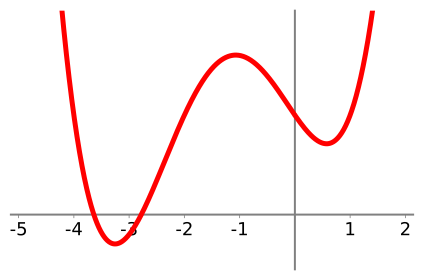{ width=90% } </li>
<li> 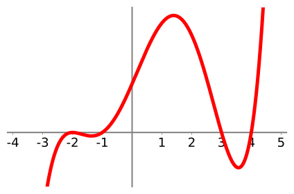{ width=90% } </li>
<li> 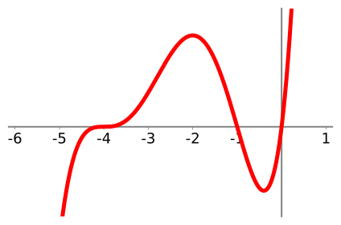{ width=90% } </li>
<li> 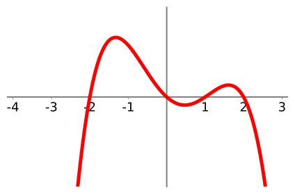{ width=90% } </li>
<li> 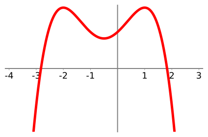{ width=90% } </li>
</ol>

<ol class="problems">
<li> Suppose you have a polynomial of degree $n$. 
	<ol class="lettered-list"> 
<li> What's the largest number of extrema (max/mins) it can have? The smallest? Why? Explain!!!!
<li> What's the largest number of roots it can have? The smallest? Why? Explain!!!
</ol>
<li> harder problems TKTKTKTKTKTKKTKTKTKTKTKKT
</ol>

