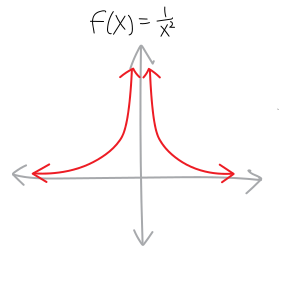
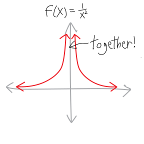

**In the beginning** were the natural numbers:

$$0,1,2,3,\cdots$$

But with only the natural numbers, mathematicians could not subtract, and so they created the integers:

$$\cdots,-2,-1,0,+1,+2,\cdots$$

But with only the integers, mathematicians could not divide. And so mathematicians created the rational numbers. They did this by taking every possible *ratio* of the integers: they said that any number that can be written in the form of one integer divided by another integer is a **rational number**:^[Does this chart, if you continue the pattern, contain every rational number? Why, or why not?]

$$\begin{array}{c c c c c c c c c c c}
\cdots & -\frac{1}{4} & -\frac{1}{3} & -\frac{1}{2} & -\frac{1}{1} & +\frac{1}{1} & +\frac{1}{2} & +\frac{1}{3} & +\frac{1}{4} & \cdots \\ \\
\cdots & -\frac{2}{4} & -\frac{2}{3} & -\frac{2}{2} & -\frac{2}{1} & +\frac{2}{1} & +\frac{2}{2} & +\frac{2}{3} & +\frac{1}{4} &  \cdots \\ \\
\cdots & -\frac{3}{4} & -\frac{3}{3} & -\frac{3}{2} & -\frac{3}{1} & +\frac{3}{1} & +\frac{3}{2} & +\frac{3}{3} & +\frac{1}{4} &  \cdots \\ \\
\cdots &-\frac{4}{4} &  -\frac{4}{3} & -\frac{4}{2} & -\frac{4}{1} & +\frac{4}{1} & +\frac{4}{2} & +\frac{4}{3} & +\frac{1}{4} &  \cdots \\
{\mathinner{
  \kern1mu\raise1pt{.}
  \kern2mu\raise4pt{.}
  \kern2mu\raise7pt{\Rule{0pt}{7pt}{0pt}.}
  \kern1mu
}} & \,\,\vdots & \,\,\vdots & \,\,\vdots & \,\,\vdots & \,\,\vdots & \,\,\vdots & \,\,\vdots & \,\,\vdots &  \ddots
\end{array}$$

Each time we expand our number system---when we go from the naturals to the integers to the rationals, and so forth---we get more and more structure and richness and beauty. If we only have the natural numbers, then we can count. That's cool,^[It actually is extremely cool. All of combinatorics---all that stuff with permutations and combinations---that math all happens using just the natural numbers. You can take entire classes just on *counting* (i.e., combinatorics).] but as far as operations go, we're restricted to only adding and multiplying. What's $5-12$? If you only believe in natural numbers, you can't answer that question. But if we believe in negative numbers, then all of a sudden we can subtract. And if we go further and start using the rationals, we can divide. What's $5/12$? If you only believe in integers, you can't answer that question. But if you believe in rational numbers, you can. We can keep going. We can keep zooming out and expanding our conception of a number, creating the real numbers, the complex numbers, then the [quaternions/Hamiltonians](https://en.wikipedia.org/wiki/Quaternion), etc., and get all these amazing and beautiful structures of numbers and their relationships to each other.

The analogy holds for polynomials. In the beginning, we learn about lines, which are just first-degree polynomials. Then we zoomed out (we **generalized**) to quadratics (polynomials of second degree). Then we generalized further to third-degree polynomials (cubics), fourth-degree polynomials (quartics), and $n$th-degree polynomials. They're pretty cool. We can do a lot with polynomials. But what if we generalized more? What if we considered a function that is not a polynomial *per se*, but rather a *ratio* of two polynomials? 

We already know one example. Think about $f(x) = \frac{1}{x}$. Obviously, $x$ is a polynomial, though not a very interesting one. And so is $1$ (we can think of it as $1x^0$). And, as you know, the graph of $1/x$ has some pretty weird properties:

{ width=50% }

Namely, it has a vertical asymptote at $x=0$ and a horizontal asymptote at $y=0$. Those are weird! Polynomials don't have those! It's *co-mingling the finite with the infinite*! And such is the case for rational functions in general: they can have the same shapes as polynomials (they still have the same behavior with maxima and minima and roots, etc.), but they can have *so much more*. I hate video games and popular culture and desperately don't want to make any analogies there---but you can think of rational functions as being an *expansion pack* for polynomials!

Here are some beautiful pictures of rational functions, just to give you an idea of how cool they can look and the sort of behavior they can have:

{ width=50% }  { width=50% }

{ width=50% } { width=50% }

Look at these! Just look at them! Here are some things to notice: the maxima and minima! the roots! the vertical asymptotes! the end behavior! Sometimes there are horizontal asymptotes, and sometimes not! Sometimes the function goes up or down on both sides of a vertical asymptote; sometimes it goes in opposite directions! See how weird these can look!

What about algebraically? What do they look like algebraically? Here are some example equations! (They're not equations of the above pictures, note!)

$$f(x) = \frac{3x^2 + 5 + 7}{2x + 1} \quad\quad\quad f(x) = \frac{3}{x^8}$$

$$f(x) = \frac{12x^{17} - 2 x^5 + 4x^3 + 2}{x^5 + 3x^3 - 4x} \quad\quad\quad f(x) = \frac{(x+4)(x-2)^3(x+7)}{(3x+2)^2(x-1)^8(x+9)}$$

$$f(x) = 5x^2 - 4x + 7 = \frac{5x^2 - 4x + 7}{1} = \frac{5x^2 - 4x + 7}{1x^0}$$

One of the neat things about moving from natural numbers to integers to rationals, etc., is that each new number system doesn't replace the previous number system. It expands it. Every natural number is also an integer (as well as a rational number and a real number and a complex number, etc.); every integer is also a rational number, etc., and so forth. This analogy holds for our more abstract concept of a function: every polynomial is also a rational function. It's just a rational function whose denominator is $1$, a/k/a the polynomial $1x^0$. 

In these notes, we'll figure out how to sketch rational functions from their equations, and how to write their equations from their pictures. We'll discuss each of the main features of rational functions---their end behavior, their roots, their vertical asymptotes, and a couple other things. Then we'll work through some examples.

In our discussion of polynomials, we've talked about how they're safe. We never have to worry about things spiking to infinity, or getting infinitely steep, or anything frightening like that. But now we're older. Now we're more experienced. It's time to take off the training wheels. *It's time to get dangerous*. 

## End Behavior 

We know that if we take a polynomial and zoom way way out, it looks more and more like its leading term. Its leading term is its **end asymptote**. Rational functions have end asymptotes, too! They can look like any simpler polynomial. 

We'll talk about how to find them in a moment, but first, a few pictures. Here's a rational function with a linear end asymptote (so the end asymptote looks like a straight line). I've marked the asymptote with a dashed black line (as is common visual practice):

{ width=50% }

People sometimes call linear end asymptotes **slant asymptotes**.

Here's a rational function with a horizontal end asymptote at $y=0$ (sometimes people call these just a **horizontal asymptote**):

{ width=50% }

And here's another horizontal asymptote, but this time not at $y=0$:

{ width=50% }

Here's a rational function with a parabolic end asymptote (i.e., it looks like $x^2$): 

{ width=50% }

So, how do we find end asymptotes of rational functions? With polynomials, we just look at the leading term. But with rational functions, we have *two* polynomials (one in the numerator, and one in the denominator). So we need to consider the *ratio* of their leading terms. Whatever that ratio is, when simplified, will be the end asymptote of our rational function.^[I should acknowledge here that I'm being hand-wavey and non-rigorous about the actual mathematics here. (Which is a pretentious way of saying "wrong.") It's not quite true that functions have end asyptotes at the ratio of their leading terms, at least not unless you define "asymptote" differently than normally gets done in high school. To find the precise end asymptote, at least according to the standard definition of an asymptote, we'd have to use polynomial division. But that's a huge pain. And taking the ratio of the leading terms gets us basically the important information!] This end asymptote might be horizontal (e.g., the line $y = 0$) or it might not be horizontal (e.g., the parabola $y = x^2$, or the line $y = 4x$). Put most generally: 

$$\substack{\text{end asymptote of a}\\ \text{rational function at:}} \quad y = \frac{\text{the leading term on top}}{\text{the leading term on bottom}}$$

So, for example, consider this rational function:

$$\displaystyle f(x) = \frac{5x^3 + 25x^2 - 10x - 120}{6x^3 + 18x^2 - 78x - 90}$$

The leading term of the top is $5x^3$, and the leading term of the bottom is $6x^3$. So this function has an "end asymptote" at $y = \frac{5x^3}{6x^3} = \frac{5}{6}$:

\begin{align*} 
\text{end asymptote at } y &= \frac{5x^3}{6x^3} \\ \\
&= \frac{5}{6}
\end{align*}

Which is just a horizontal asymptote at the line $y = 5/6$. So even though this rational function might be jumping around and spiking and doing weird things near the origin, the further and further we get from the origin, the more and more this function will start to look like the horizontal line $y = 5/6$. Here's what it looks like (although we don't know how to graph the other parts of it yet):

{ width=50% }

Here's another example. What if we have this rational function:

$$\displaystyle f(x) = \frac{x^2 + 2}{x^3 + 4x^2 - 8x + 9}$$

The leading term of the top is $x^2$, and the leading term of the bottom is $x^3$. So this will have a horizontal asymptote at $\displaystyle y = \frac{x^2}{x^3} = \frac{1}{x}$. The further and further we get from the origin, the more and more $f(x)$ will look like $y = 1/x$. But we also know that the further and further we get from the origin, the more and more $y = 1/x$ looks like the horizontal line $y = 0$. So then $f(x)$, the further and further we get from the origin, will look more and more like the horizontal line $y=0$.

\begin{align*}
\text{end asymptote at } y &= \frac{x^2}{x^3} \\ \\
&= \frac{1}{x} \\ \\
&= 0
\end{align*}

Here's what it looks like (although, again, we don't know how to graph all of it):

{ width=50% }

Let's do one more example: consider:

$$\displaystyle f(x) = \frac{5x^3 + 3x^2 - 7x + 90}{x - 7}$$

In this case, the ratio of the leading coefficients is $\frac{5x^3}{x} = 5x^2$. So $f(x)$ will look sort of like $5x^2$ in the most zoomed-out version, meaning that both the left and right sides will spike up to infinity (like the parabola $5x^2$!). Here's what it looks like (way, way zoomed out, and note the single vertical asymptote at $x=+7$):

{ width=50% }

See the parabolic asymptote?!?^[Yeah, so, this is a good example of what I was hedging about in the previous footnote. Here, via the standard definition of an asympotote, it's not quite true that $f(x)$ has an end asymptote at $y=5x^2$. In fact it's at $5x^2+38x+259$.  But $f(x)$ still goes up to $+\infty$ on both sides, much like $5x^2$ does, even if it's not asymptotically approaching $5x^2$ *per se*. In this class we never actually formally define what a "asymptote" is, so...]

## $x$-intercepts/<wbr>roots/<wbr>solutions/<wbr>zeroes

We know how to find the roots of a polynomial---we just factor it, and then deal with the individual factors. But how do we find the roots of a rational function?!? There are factors on the top and on the bottom! Factors everywhere! What a mess!

But actually, it's not that bad. Let me show you why. Let's suppose we have this rational function:

$$f(x) = \frac{(x+3)(x-2)}{x(x+6)}$$

Finding the $x$-intercepts/roots/solutions/zeroes is the same as finding what values of $x$ make $y$ equal to zero. So we can set the whole function equal to zero, and then solve for $x$:
\begin{align*}
0 &= \frac{(x+3)(x-2)}{x(x+6)} \\
\text{But then we can just multiply off the denominator...} \\
0\cdot  x(x+6)&= \frac{(x+3)(x-2)}{x(x+6)} \cdot x(x+6) \\
\text{It cancels on the right:} \\
0\cdot  x(x+6)&= \frac{(x+3)(x-2)}{\cancel{x(x+6)}} \cdot \cancel{x(x+6)}\\ \\
0\cdot  x(x+6)&= (x+3)(x-2) \\
\text{And anything times zero is zero, so:} \\
0&= (x+3)(x-2) \\
x &= \{-3, +2 \}
\end{align*}

So actually, we only need to find where the *top* polynomial is zero! If the top polynomial is zero, then the whole thing is zero. And there's nothing we can divide by that will give us zero! So the roots/zeroes/$x$-intercepts of the top will be the roots/zeroes/$x$-intercepts of the entire rational function. In the case of this example, we have two $x$-intercepts at $-3$ and $+2$. These two roots both have multiplicity $1$, so this rational function will pass straight through the $x$-axis at these points---everything we know about the multiplicity of roots still applies. (Well, sort of. Rational functions, thanks to their asymptotes, tend to be pretty bendy, so it can be tough to distinguish between roots of multiplicity $1$ and roots of odd-but-greater-than-$1$ multiplicity. But we can at least classify them as either even or odd.)

We could prove this a little more generally if we wanted to. Consider the rational function:

$$f(x) = \frac{p(x)}{q(x)}$$

where $p(x)$ and $q(x)$ are both polynomials. This could be *any* rational function, so we're doing a proof! We want to find the $x$-intercepts, and we know that to do that, we'll need to set the entire function equal to zero. So we have:

$$0 = \frac{p(x)}{q(x)}$$

To solve this, we can just multiply both sides by $q(x)$:

$$q(x)\cdot 0 = \frac{p(x)}{q(x)} \cdot q(x)$$

But then the left side will still be zero, and the $q(x)$'s will cancel out on the right side! So we're left with just:
$$0 = p(x)$$

So all we need to do is find where the top polynomial is zero. Which we already know how to do---we just factor it and look at the individual factors.

## Vertical asymptotes/<wbr>poles/<wbr>singularities 

The biggest difference between rational functions and polynomials---the strangest new symptom that materializes when we zoom out and allow negative exponents---the scariest thing about rational functions---is that they can have **vertical asymptotes**. (These also get called **singularities**, or, especially if you're in Jana's Complex Analysis class, **poles**). They can spike up to infinity, like an infinitely-tall volcano, or drop down into infinitely-deep pits of despair. We know $1/x$, which does both:

{ width=50% }

And we know $1/x^2$, which, if it has a $+$ out in front, looks like an infinitely-tall redwood:

{ width=50% }

Yikes. Very scary. Why do these happen? Because we're dividing by zero! A vertical asymptote is a physical, visual, visceral manifestation of a divide-by-zero error. Think about $1/x$. What happens to this function as $x$ gets close to 0? 

| $x$ | $1/x$ |
|--:|:--|
| $10$ | $0.1$ |
| $5$ | $0.2$ |
| $2$ | $0.5$ |
| $1$ | $1$ |
| $0.5$ | $2$ |
| $0.1$ | $10$ |
| $0.01$ | $100$ |
| $0.001$ | $1000$ |
| $0.0001$ | $10000$ |
| $0.000001$ | $1000000$ |

As we plug smaller and smaller numbers in for $x$, $1/x$ becomes bigger and bigger and bigger. As we plug into $x$ numbers that are closer and closer to $0$, $1/x$ *explodes*! We get a vertical asymptote. *Vertical asymptotes are division by zero made flesh.* 

So vertical asymptotes/poles/singularities happen when the denominator of a rational function is zero. In other words, to find where the rational function has vertical asymptotes/poles/singularities, we just need to find the zeroes of its denominator. Here's an example. Imagine we have the function:

$$f(x) = \frac{(x+2)(x-4)(x+6)}{(x-1)(x-3)^2(x+5)}$$

Where does this function have a division-by-zero problem? At the zeroes of the denominator! So we have a division-by-zero problem, and thus vertical asymptotes, at $x = +1$, $x=-3$, and $x = -5$:

$$f(x) = \frac{(x+2)(x-4)(x+6)}{\underbrace{(x-1)}_{\substack{\text{pole at}\\ x=+1}}\underbrace{(x-3)^2}_{\substack{\text{pole at}\\ x=+3}}\underbrace{(x+5)}_{\substack{\text{pole at}\\ x=-5}}}$$

I'm calling them "poles" there in part because it's typographically easier. Visually, the function looks like:

{ width=75% }

Don't worry yet about how we drew the rest of the graph---just observe its beautiful vertical asymptotes. And note that when we draw graphs, it can be nice to denote asymptotes (vertical or horizontal) with a dotted line. It makes things a bit clearer.

Wait, let's go back to $1/x$ and $1/x^2$. There's a cool visual distinction between them. Namely, with $1/x$, the vertical asymptote splits. The function goes down on one side, and up on the other:

{ width=50% }

But with $1/x^2$, it goes up on both sides:

{ width=50% }

Why the difference? It's coming from the multiplicities! We know all about how the multiplicities of a polynomial affect what it looks like at its roots. But vertical asymptotes have multiplicities, too! Factors of the denominator can have multiplicities! Think about what's going on with $1/x$. In that case, $x=0$ is a zero of the denominator with multiplicity $1$, and its vertical asymptotes at $x=0$ split:

{ width=50% }

With $1/x^2$, $x=0$ is a zero of its denominator with multiplicity $2$, and its vertical asymptotes at $x=0$ stay together:

{ width=50% }

This is a more general pattern!

* with a vertical asymptote of **odd multiplicity**, the function goes up on one side of the asymptote and down on the other. (It splits.)
* with a vertical asymptote of **even multiplicity**, the function either goes up on both sides of the asymptote, or goes down on both sides. (It stays together.)

Here's a picture:

{ width=75% }

Let's do another quick concrete example. What if we take a somewhat modified version of the last function:

$$ f(x) = \frac{(x+2)(x-4)(x+6)}{(x+5)(x-1)^2(x-2)^3}$$

I've changed all of its asymptotes so that they are now have different multiplicities. Where are the vertical asymptotes, what are their multiplicities, and what does the function look like near them? We have:

$$ f(x) = \frac{(x+2)(x-4)(x+6)}{(x+5)(x-1)^2(x-2)^3}$$

| factor of denominator:	|	$(x+5)$ | $(x-1)^2$ | $(x - 2)^3$    |
|---:|:---:|:---:|:---:|
| pole	at: |	$x=-5$  |  $x=+1$    | $x=+2$   |
| multiplicity:	|	$1$  |  $2$    | $3$      |
| shape: | splits | together | split |

Here's what this function looks like:

{ width=75% }

Again, don't worry about how we graphed the rest of the function---just notice that the asymptotes are now all going in the same direction. The other thing to notice with this graph is that there was some collateral damage from changing the multiplicities---e.g., that parabolicky one on the right side now opens down, not up, and we get some weird bumps.

## Holes

There's a slight exception to our rule about how the zeroes of the numerator give us the roots and the zeroes of the denominator give us the vertical asymptotes. That is: what if we have a number that is both a zero of the numerator *and* the denominator? 

For example, consider the function:

\begin{align*}
 f(x) &= \frac{x^2 + 5x + 6}{x^2+6x+8} \\
 \text{If we factor it, we get:} \\
&= \frac{(x+2)(x+3)}{(x+2)(x+4)} \\
\text{But we have an $(x+2)$ on both the top and bottom,}\\
\text{so these essentially cancel out and give us:} \\
&= \frac{(x+3)\cancel{(x+2)}}{\cancel{(x+2)}(x+4)} \\ \\
&= \frac{x + 3}{x+4} \quad\quad\text{(...sorta)}
\end{align*}

Except... well, they don't *really* cancel out, because (in unfactored form) we still have:

$$ f(x) = \frac{x^2 + 5x + 6}{x^2+6x+8} $$

What happens is this: at every point *other than* $x = -2$, the numerator and the denominator will cancel out, and my function will look exactly like $f(x) = x + 3$. And *at* $x = -2$, we'll have $f(x) = 0/0$, which is basically like a divide-by-zero problem, except we've got zero on the top, too, so instead of getting a vertical asymptote, the function *simply won't exist at that point*. It will be undefined. It will look exactly like $f(x) = x + 3$, but with that one point $(-2,1)$ missing. It's a *ghost* point! Algebraically, we get:

\begin{align*}
 f(x) &= \frac{x^2 + 5x + 6}{x^2+6x+8} \\ \\
&= \frac{(x+2)(x+3)}{(x+2)(x+4)} \\ \\
&= \frac{\cancel{(x+2)}(x+3)}{\cancel{(x+2)}(x+4)} \\ \\
&= \frac{x + 3}{x+4} \quad\quad\text{everywhere but at $x=-2$}
\end{align*}

Visually, we denote a hole with a little circle in the graph. So in this case, this function will look basically like the function $f(x)= \frac{x + 3}{x+4}$, except for at $x=-2$, at which point it will just blip out of existence for a moment:

{ width=50% }

Holes are weird and esoteric and in some sense their existence ("existence") is a bit of a technicality that I wouldn't ordinarily mention. But you should know about their existence,^[How can we talk about the existence of something which is literally defined as *that which does not exist*?!?] because... well, partly because they just show up in problems math teachers write to deliberately include holes. But more importantly, *all of calculus is founded on a hole*. More on that later. (Much later.)

Gracie Fisher-Owens suggests that instead of representing a hole with a open dot, we should use a ghost emoji or something, which also reflects how George Berkeley, complaining about holes and their connection to calculus, referred to them as the "ghosts of departed quantities:"

{ width=50% }

## $y$-intercepts

So, those are all the cool features of rational functions! Let's dive in and graph one! Oh... wait, not quite. There's one more thing. Rational functions can have $y$-intercepts, just like everything else. And just like everything else, we can find the $y$-intercept just by plugging in $0$ for $x$. This is pretty straightforward. I don't even want to do an example. Look on your polynomial notes if you want an example. (Of course, sometimes we might have a vertical asymptote at $x = 0$ (i.e., at the origin), and thus not have a $y$-intercept.)

For what it's worth, just like the $y$-intercept of a polynomial is its constant term, the $y$-intercept of a rational function is the *ratio* of its two constant terms (because that's what's left over once we plug in zero for $x$). 

## Let's sketch a rational function!!!

So now we can figure out quite a bit about any given rational function. So let's dive in and do an example of how to graph them! Consider the function:

$$\displaystyle f(x) = \frac{5}{x + 2}$$

One way we could think about this function is as being $1/x$ with some transformations. It's $1/x$, but moved left by two, and expanded vertically by $500\%$. So we already know what it should look like. What if we try to graph it using just our rational function knowledge? We should get the same graph! Knowing how to do something in two different ways gives us some **epistemic redundancy**. 

So, if we think of this as a rational function, what do we know about it?

* **Roots**: We know it will have roots/zeroes/etc. wherever the top polynomial equals zero. When does $5$ equal $0$? Never. That never happens. So this function has no $x$-intercepts. 

* **Vertical asymptotes/poles/singularities**: We know that vertical asymptotes will happen whenever the bottom polynomial equals zero. That happens at $x = -2$, so that's our vertical asymptote. It has a multiplicity of $1$, so the vertical asymptotes split (one goes up, one goes down). 

* **Holes**: These will happen whenever the top and bottom polynomials have a root at the same place. But that doesn't happen here, so there are no holes.

* **End behavior**: We need to look at the ratio of the leading terms. The leading term of the top is $5$, and the leading term of the bottom is $x$, so this function has an end asymptote at $y = (5)/(x)$, which looks basically like $1/x$, which has a horizontal asymptote at $y=0$. So this function has a horizontal asymptote at $y = 0$:
\begin{align*}
\text{end asymptote at: } y &= \frac{5}{x} \\ \\
\text{which is basically: } y &= \frac1x \\ \\
\text{which has a horizontal asymptote at: } y &= 0
\end{align*}

* **$y$-intercept**: Like with polynomials (or any other function), this is equivalent to plugging in $0$ for $x$. So we have:
\begin{align*}
y\text{-intercept at: } y &= \frac{5}{0+2} \\ \\
&= +2.5
\end{align*}

So now we can start to draw it! We'll start by drawing the asymptotes (with dotted lines), and marking the location of the $y$-intercept. (If we had $x$-intercepts, we'd mark those, too.)

(Note that I've drawn the horizontal asymptote just a little bit under $y=0$---I want to make it visible and not get in the way of the $x$-axis.)

So from here, we can try to connect the dots, more-or-less. On the right-hand side, we'll asymptote up from the end asymptote at $y=0$, cross through the $y$-intercept at $(0,+2.5)$, and then spike up to infinity just before $x=-2$:

What about the left part? We know that the vertical asymptote at $x=-2$ has odd multiplicity, so it splits the function. So, because it's spiking up to $+\infty$ on the right side of that asymptote, it has to come up from down below at $-\infty$ on the left side. And then it approaches the end asymptote at $y=0$:

Yay! Does this look basically like $1/x$ stretched out and moved to the left? It does!

## A more complicated example!!!

Here's another rational function:

$$\displaystyle f(x) = \frac{x - 5}{x^2 + 5x + 4}$$

Let's graph it! We'll need to factor it first to make our lives easier. We have:

$$f(x) = \frac{(x - 5)}{(x + 4)(x + 1)}$$

What do we know about it?

* **End behavior**: We need to look at the ratio of the leading terms. The leading term of the top is $x$, and the leading term of the bottom is $x^2$, so this function has an end asymptote at $y =\frac{x}{x^2}= 1/x$, which means it will have a horizontal asymptote at $y = 0$.

* **Roots**: We know it will have roots/$x$-intercepts/etc. wherever the top polynomial equals zero. That happens only at $x = +5$. This root has multiplicity $1$, so the function goes straight through.

* **Vertical Asymptotes**: We know that vertical asymptotes will happen whenever the bottom polynomial equals zero. That happens at $x = -4$ and $x = -1$. So those are our vertical asymptotes. They both have a multiplicity of $1$, so the function splits at both of those asymptotes.

* **Holes**: These will happen whenever the top and bottom polynomials have a root at the same place (of the same multiplicity). But that doesn't happen here, so there are no holes.

* **$y$-intercept**: Like with polynomials (or any other function), this is equivalent to plugging in $0$ for $x$. Which gives us $y = \frac{(-5)}{(4)(1)} = -\frac54 = -1.25$ as the $y$-intercept.

So far, so good! Let's sketch what we have so far. I'll represent the intercepts with dots, and represent the asymptotes with dotted lines:

{ width=75% }

We can connect dots on the far right side. Note how, because of the intercepts, it'll have to start on bottom, go up through $(0,-1.25)$ and $(5,0)$, but then go back down again to approach the horizontal asymptote at $y=0$. It can't start on the top, because then how would it have a negative $y$-intercept?

{ width=75% }

But what do we do in the middle? It can't go through the $x$-axis, because then there would be an $x$-intercept, but there isn't one there. So it has to either always be above the axis, or below it. We have two options:

{ width=75% }

Which one is it? It has to be the top one! We know that because the vertical asymptote at $x=-2$ is of odd multiplicity, so it has to split the function. The function is going down on the right side, so it has to go left on the right side, and we have to have:

{ width=50% }

Alternatively, if we didn't know that, we could try plugging in some number between $x=-4$ and $x=-2$ and seeing whether the function is positive or negative. That would pin us down to only one option!

What about far left? Again, we have two choices. The function could approach the asymptote from below, or from above:

{ width=75% }

We know that it has to approach the horizontal asymptote from below, because the vertical asymptote at $x=-4$ has multiplicity $1$. The function goes down from the top on the right side of that asymptote, so it needs to go down to the bottom on the left side. So it must approach the horizontal asymptote below (i.e., the function must be negative).

Alternatively, we could decide by figuring out whether the function is positive or negative on that interval. In other words, when $x < -4$, is the function negative or positive? Let's figure out whether each of the factors is positive or negative on that interval. Then we can multiply together their positive-or-negative-ness (their **parity**) to figure out whether the overall function is positive or negative:

<table style='text-align:center;'>
 <thead colspan=4 ><td > When $x<-4$...<td></thead>
 <tr><td>Factor</td><td>$(x-5)$</td><td>$(x+4)$</td><td>$(x+1)$</td></tr>
 <tr><td>Parity</td><td>$-$</td><td>$-$</td><td>$-$</td></tr>
</table>

So then, when $x$ is less than $-4$, we have:

$$f(x) = \frac{(-)}{(-)(-)} = (-)$$

So the function is always negative in that region, which means it approaches the asymptote from below. So both methods give us the same result (good!). Thus, the final graph is this one:

{ width=75% }

And that's our function!!!

## Why only have two examples? Let's do a third!

This stuff gets complicated, so let's do a third example with some weird roots, some weird asymptotes, and some weird end behavior. How about the function:

$$f(x) = \frac{3x(x+1)^2}{(x-2)^2}$$

What do we know about this?

* **End behavior**: We need to look at the ratio of the leading terms. The leading term of the top is $3x^3$, and the leading term of the bottom is $x^2$, so at the far left and far right this function will look like $y = (3x^3)/(x^2) = 3x$. So it'll go down linearly on the left and up linearly on the right.^[Again, if you want to be reeeeeeally precise, I should point out that its end asymptote is actually at $y=3x+18$, which is what you'd find out if you used polynomial division. But for our purposes, it's OK to hand-wave a bit and say that it looks more-or-less like $3x$, insofar as it goes down linearly on the left, and up linearly on the right. We could use the computer scientist definition of an asymptote: we can make the **relative difference** between $f(x)$ and $3x$ as small as we want, just by inputting a sufficiently big $x$, even if we can't make their **absolute difference** arbitrarily small.]

* **Roots**: We know it will have roots/$x$-intercepts/etc. wherever the top polynomial equals zero. So we have two roots: at $x=0$ (of multiplicity $1$), and at $x=-1$ (of multiplicity $2$).

* **Vertical Asymptotes**: We know that vertical asymptotes will happen whenever the bottom polynomial equals zero. That happens at $x = +2$. This vertical asymptote has a multiplicity of $2$, which means that the function will either spike up on both sides of that asymptote (like a volcano!), or drop down on both sides (into an abyss!).

* **Holes**: These will happen whenever the top and bottom polynomials have a root at the same place (of the same multiplicity). But that doesn't happen here, so there are no holes.

* **$y$-intercept**: We just plug in $0$ for $x$. Which gives us $y = 0$ as the $y$-intercept. (This makes sense, because we have an $x$-intercept at $0$, so the function should pass through the origin.

So far, so good! Let's sketch what we have so far. I'll represent the intercepts with dots, and represent the asymptotes with dotted lines:

{ width=75% }

For some reason, I started the previous two examples right-to-left. There's really no reason we have to do that (and it's a little weird, since don't we normally go left to right?) So let's draw this one left to right! (Sometimes, with rational functions, one direction can be easier than the other.) So, on the left, we have to come up from this slant/end asymptote, bounce off the root of multiplicity $2$ at $x=-1$, go straight through this root of multiplicity $1$ at the origin, and then spike up to the vertical asymptote:

{ width=75% }

What does the function look like on the right side of this asymptote? We have two options. It could come down from the vertical asymptote, turn around, and then go back up to meet the end/slant/linear asymptote. Or it could come *up* the vertical asymptote, starting at $-\infty$, and go up to meet the meet the end/slant/linear asymptote:

{ width=75% }

Which one is it? It's the top one! Why? Because:

* The vertical asymptote at $x=+2$ has a multiplicity of $2$. Since the function goes up on the left side, it must come from the top on the right side, so both the sides are together (like a volcano). 

* If the function had started at the bottom and gone up, it'd have to cross the $x$-axis to meet up with the slant/linear end asymptote. But then it'd have a root somewhere to the right of $x=+2$. But it doesn't. So it can't do this.

* If neither of the following two reasons convinced you, you could see where the function was positive and negative, and come to the same conclusion. What do we know about the parity of the function when $x>+2$?

$$f(x) = \frac{3x(x+1)^2}{(x-2)^2}$$

<table>
	<tr colspan=4> When $+2< x$...</tr>
	<tr><td>Factor</td><td>$3x$</td><td>$(x+1)^2$</td><td>$(x-2)^2$</td></tr>
	<tr><td>Parity</td><td>$+$</td><td>$+$</td><td>$+$</td></tr>
</table>

So then the function, when $x >+2$, must always be positive:

$$f(x, \, x>+2) = \frac{(+)(+)}{(+)} = (+)$$

Three reasons! Logically and mathematically, we only need *one* reason 

So we must have:

{ width=75% }

## Going backwards!

With polynomials, we saw that we can do this process in both directions---we can take an equation and draw a picture of it, or we can take a picture and write an equation for it. We can do the same with rational functions.

So imagine we have a rational function that looks like this: 

{ width=75% }

How can we find an equation for it? What do we know?

* **Vertical asymptotes**: This function appears to have vertical asymptotes at $x=+1$ and $x=-2$. At each of the vertical asymptotes, the function is going in opposite directions, so each of the vertical asymptotes must have odd multiplicity. So the factors in the denominator could be $(x-1)$ and $(x+2)$. Or they could be $(x-1)^3$ and $(x+2)^5$, et cetera.

* **Roots and their multiplicities**: This function appears to have only one root, at $x=0$. It goes through the $x$-axis, so the root must be of odd multiplicity. Thus, the numerator of the function could be $x$, or $x^3$, etc. 

* **End behavior**: This function appears to have some sort of a slant asymptote---maybe like $y=x$, or at the very least, an asymptote that is some odd polynomial (could be $x^3$, $x^5$, etc.), because it goes up in the far right and down in the far left. This means that the degree of the numerator will need to be some odd difference greater than the degree of the denominator. So we could have leading terms of $x^5$ on top and $x^4$ on the bottom (which would give us an end asymptote of $x^1$), or $x^{10}$ on top and $x^7$ (which would give us an end asymptote of $x^3$), et cetera.

* **$y$-intercept**: It's at zero, and it has to be, since we have an $x$-intercept there.

Really, all we need to know to come up with a preliminary equation are the roots and the vertical asymptotes (because that way we can make the numerator and the denominator). So now we can give it a shot! What about:

$$f(x)= \frac{x}{(x-1)(x+2)}$$

Nope, this won't work, because this equation has a horizontal asymptote at $y=0$. That's not what we want. What about:
$$f(x)= \frac{x^3}{(x-1)(x+2)}$$

This could work. It gives a slant asymptote at $y=x$. Yay! What else might work? What if we tack on an imaginary factor to the top:

$$f(x)= \frac{x^3\left(x^2+1\right)}{(x-1)(x+2)}$$

That works, too! The end asymptotes might be a bit steeper---it's now at $y=x^3$. Or how about:

$$f(x)= \frac{x^5}{(x-1)(x+2)}$$

With that one, the root at $x=0$ might be bendier. Or how about:

$$f(x)= \frac{546x^3}{(x-1)(x+2)}$$

Et cetera! All of these equations have graphs with this same general shape.

## Problems 

For the following rational functions: 
<ol class="lettered-list">
<li> Where are the vertical asymptotes/poles/singularities?
<li> What is the end behavior? Is there a horizontal asymptote? Where? A parabolic asymptote? Cubic asymptote? Etc.?
<li> Where are the holes, if any?
<li> How many real roots/solutions/zeroes/$x$-intercepts does it have? Where are they, and what are their multiplicities?
<li> What is the $y$-intercept?
<li> What does the rational function look like? I.e.: sketch it! Without a calculator! Without Desmos!!!
</ol>

<ol class="problems">
<li> $\displaystyle f(x) = \frac{3}{x + 2}$
<li> $\displaystyle f(x) = \frac{4}{x + 12}$
<li> $\displaystyle f(x) = \frac{1}{x -3}$
<li> $\displaystyle f(x) = \frac{x}{x+1}$
<li> $\displaystyle f(x) = \frac{3x}{x -7}$
<li> $\displaystyle f(x) = \frac{x^2}{x +4}$
<li> $\displaystyle f(x) = \frac{5}{(x+2)^2}$
<li> $\displaystyle f(x) = \frac{5}{(x-1)^2}$
<li> $\displaystyle f(x) = \frac{7x}{(x-1)^2}$
<li> $\displaystyle f(x) = \frac{x+4}{(x+3)^3}$
<li> $\displaystyle f(x) = \frac{x^2 - x - 2 }{x^2 - 2x - 63}$
<li> $\displaystyle f(x) = \frac{x^2 - 3x - 2 }{x^2 + x - 20}$
<li> $\displaystyle f(x) = \frac{x^2 + 9x + 18 }{x^2 - 1}$
<li> $\displaystyle f(x) = \frac{x^2 + 4x + 3}{x^2 - x - 2}$
<li> $\displaystyle f(x) = \frac{x^2 -12x + 35}{x^2 - 25}$
<li> $\displaystyle f(x) = \frac{x^2 - 4}{x^2 - 5x}$
<li> $\displaystyle f(x) = \frac{x^3 - 4x^2 + x - 4}{4x}$
<li> $\displaystyle f(x) = \frac{x^3 + 4x^2 + 7x + 28}{5x + 3}$
<li> $\displaystyle f(x) = \frac{2x^3 - 6x^2 + x - 3}{2x + 1}$
<li> $\displaystyle f(x) = \frac{5}{x^2 - x -6}$
<li> $\displaystyle f(x) = \frac{3}{x^2 + x - 20}$
<li> $\displaystyle f(x) = \frac{2x}{x^2 + 4x + 3}$
<li> $\displaystyle f(x) = \frac{2x^2 - 5x - 3}{3x^2 + 2x -1}$
<li> $\displaystyle f(x) = \frac{5(x^2 - x - 2)}{x^2 - 2x - 63}$ 
<li> $\displaystyle f(x) = \frac{(x + 1)(x - 2)(x + 7)}{4(x - 4)(x + 7)(x + 2)}$
<li> $\displaystyle f(x) =  12$
<li> $\displaystyle f(x) = \frac{(x + 1)(x + 3)(x + 5)}{x^3 + 6x^2 + 8x}$
<li> $\displaystyle f(x) = \frac{(x - 4)(x - 5)}{(x - 4)^2}$
<li> $\displaystyle f(x) = \frac{x^3 +3x^2}{(x +5)^2\left(x^2 + 14x + 49\right)}$
<li> $\displaystyle f(x) = \frac{-x^3}{(x - 4)^3(x +1)^2}$
<li> $\displaystyle f(x) = \frac{x(x - 4)(x - 2)}{(x - 1)(x - 3)(x - 5)}$
<li> $\displaystyle f(x) = \frac{x^2 - x - 2 }{x^2 - 2x - 63}$
<li> $\displaystyle f(x) = \frac{(x - 2)(x + 4)}{x^2 + 8x + 15}$
<li> $\displaystyle f(x) = \frac{(x - 1)(x + 9)(x -7)(x + 3)}{(x + 4)(x - 2)(x + 6)(x - 5)}$
<li> $\displaystyle f(x) = \frac{3(x - 2)(x + 1)(x - 4)(x + 2)}{(x - 1)(x - 3)(x + 1)(x - 6)}$
<li> $\displaystyle f(x) = \frac{-(x - 7)(x + 1)(x - 2)(x + 0)}{(x - 1)(x - 9)(x + 2)(x - 5)}$
<li> $\displaystyle f(x) = \frac{x^5 - x^3 + 5x^2 - 5}{(x - 2)(x + 3)(x + 5)}$
<li> $\displaystyle f(x) = \frac{-(x - 2)(x + 1)^2}{(x - 1)(x - 3)(x + 2)(x - 5)}$
<li> $\displaystyle f(x) = \frac{(x^2 - 1)(x^2 - 9)}{x(x +2)^2(x-2)^2}$
<li> $\displaystyle f(x) = \frac{(x - 2)^4(x + 1)^4}{(x - 1)^2(x - 3)^2(x + 2)^2(x - 5)^2}$
<li> $\displaystyle f(x) = \frac{(x+2)(x-2)}{(x^3 - 3x)}$
<li> $\displaystyle f(x) = \frac{-4(x - 2)^3}{(x - 7)(x^2 - 16)}$
<li> $\displaystyle f(x) = \frac{-4(x - 2)^3}{(x - 7)(x^2 - 16)}$
<li> $\displaystyle f(x) = \frac{x^3 + x^2 - 4x - 4}{ x^4 + 2x^3 + 9x + 18}$
<li> $\displaystyle f(x) = \frac{-3(x+1)(x-2)(x+4)}{(x+2)}$
<li> $\displaystyle f(x) = \frac{5(x^2+ 1)(x+5)(x+7)}{ (x+7)(x-2)}$
<li> $\displaystyle f(x) = \frac{x(x^2 - 1)}{ (x^2 - 4)}$
<li> $\displaystyle f(x) = \frac{(x^2 - 4)(x + 5)(x-5)}{ x}$
<li> $\displaystyle f(x) = \frac{4x + 2}{1}$
<li> $\displaystyle f(x) = \frac{1}{(x+1)(x+54)(x-12)}$
<li> $\displaystyle f(x) = \frac{3}{4}$
<li> $\displaystyle f(x) = \frac{x^3(x + 4)(x - 5)}{ (x + 2)(x-1)}$
<li> $\displaystyle f(x) = \frac{(x + 2)^2(x-4)}{ x^2}$
<li> $\displaystyle f(x) = \frac{1}{ x^2 + 1}$
</ol>

For the following graphs of rational functions:

<ol class='lettered-list'>
<li> Where are the vertical asymptotes? What are their multiplicities? (What does this tell you about the denominator?)
<li> What is the end behavior/end asymptote? (What does this tell you about the relative degrees of the numerator and denominator?)
<li> Where are the $x$-intercepts/roots/solutions/zeroes, if there are any? Their multiplicities? (What does this tell about the numerator?)
<li> Where is the $y$-intercept, if it exists? (You might not know it as a number, but is it positive or negative?) 
<li> Finally (and most importantly): write an equation for the graph.
</ol>

(Note that the $x$-axes and $y$-axes of these graphs have different scales. Also note that the number of the problem is at the *top*-left corner of the graph CSS is annoying and it's hard to align the numbers and the pictures better.)

<ol class="problems">
<li>   <!-- 1/(x + 4)     -->
<li>   <!-- 1/(x - 3)     -->
<li>   <!-- 1/(x + 1)     -->
<li>   <!-- 1/(x + 1) + 5     -->
<li>   <!-- 5*(x - 1)/(x - 3)     -->
<li>   <!-- x^2/(x + 2)     -->
<li>   <!-- (x + 1)*(x - 1)/(x + 2)     -->
<li>   <!-- -(x - 1)^3/(x - 3)     -->
<li>   <!-- 1/((x + 1)*(x - 2))     -->
<li>  <!--  x/((x + 3)*(x + 2))     -->
<li>  <!--  -(x + 4)/((x - 1)*(x - 3))     -->
<li>  <!--  -(x - 1)/((x + 1)*(x - 3))     -->
<li>  <!--  x^3/((x + 2)*(x - 2))     -->
<li>  <!--  (x + 2)*(x - 2)/((x + 1)*x)     -->
<li>  <!--  (x + 5)*(x + 3)*(x + 2)/((x + 4)*(x + 1))     -->
<li>  <!--  -(x - 1)*(x - 3)*(x - 5)/((x - 2)*(x - 4))     -->
<li>  <!--  (x - 1)^2*(x - 5)/((x - 2)*(x - 4))     -->
<li>  <!--  -(x + 5)^2*(x + 3)^2*(x + 1)^2/((x + 4)*(x + 2))     -->
<li>  <!--  (x + 3)*(x + 1)/((x + 4)*(x + 2))     -->
<li>  <!--  (x + 1)*(x - 1)/((x - 3)*x)     -->
<li>  <!--  (x + 1)*(x - 1)/((x - 3)*x)     -->
<li>  <!--  1/((x + 1)*(x - 2))     -->
<li>  <!--  -1/((x - 3)*x)     -->
<li>  <!--  (x + 1)*(x - 1)/((x + 2)*(x - 2))     -->
<li>  <!--  (x + 2)*(x + 1)/((x + 3)*(x - 2))     -->
<li>  <!--  (x + 3)*(x - 1)/((x + 2)*(x + 1)*(x - 3))     -->
<li>  <!--  -(x - 2)/((x + 1)*(x - 1))     -->
<li>  <!--  (x + 4)*(x + 2)*(x - 2)*(x - 4)*x/((x + 1)*(x - 1))     -->
<li>  <!--  (x + 1)*(x - 3)/((x - 2)*(x - 4)*x)     -->
<li>  <!--  (x - 3)/((x - 2)^2*(x - 4)*x)     -->
<li>  <!--  (x + 1)^2*(x - 1)^2/((x^2 + 1)*x^2)     -->
<li>  <!--  x/((x + 1)*(x - 2)^2)     -->
<li>  <!--  -2*(x - 1)/(x - 3)^2     -->
<li>  <!--  -(x + 1)^4/((x + 2)^2*x)     -->
<li>  <!--  1/((x + 1)^2*(x - 2)^2)     -->
<li>  <!--  5*(x + 1)^4/(x + 2)^2     -->
<li>  <!--  -(x - 1)^2/((x + 2)^2*x)     -->
<li>  <!--  -(x + 3)^2*(x + 1)^2*(x - 1)^2*(x - 3)^2/((x + 4)*(x + 2)*(x - 2)*(x - 4)*x)     -->
<li>  <!--  -(x + 3)^2*(x + 1)^2*(x - 1)^2*(x - 3)^2/((x + 4)^2*(x + 2)^2*(x - 2)^2*(x - 4)^2*x^2)     -->
<li>  <!--  -(x + 5)*(x + 3)^2*(x + 1)^2*(x - 1)^2*(x - 3)^2*(x - 5)^2/((x + 4)^2*(x + 2)^2*(x - 2)^2*(x -x)     -->
<li>  <!--  -(x^4 + 1)*(x + 3)*(x + 2)*(x - 2)*(x - 3)/((x + 1)^2*(x - 1)^2)     -->
</ol>

   

<ol class="problems">
<li> Suppose a rational function has an end asymptote that's a flat horizontal line at $y=0$. What can you figure out about the polynomials in its numerator and denominator?
<li> Suppose a rational function has an end asymptote that's a flat horizontal line. What can you figure out about the polynomials in its numerator and denominator?
</ol>
