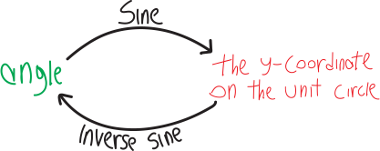
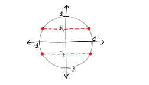
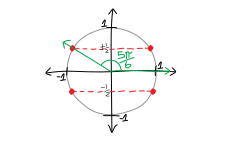
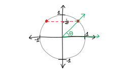
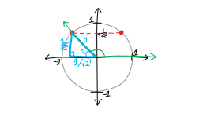
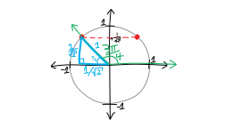

We've been getting *real good* at solving equations. Basic algebra we're great at. Linear equations, quadratic equations, you name it. We're probably not going to memorize the cubic or quartic formulas, but they're there if we wanted to use them. We've tossed tricky logarithms and exponentials into the mix. We can jailbreak variables out of functions by using inverses. Et cetera! But what if we start including *trig functions* in the fun?!? In principle, we don't need to learn anything new. We know trig, we know algebra; we just need to combine them! That's why I've been giving you these equations on the homework without telling you how to solve them. You haven't needed any new information! You don't need me!

Here, though, I'll write up some solutions for some of the tricky trig equations we've tackled, just for your reference. I'll walk through, step by step, how we can solve each of these equations for $\theta$ (and find *all* the values of $\theta$ that work, which, because it's trig, is probably an infinite amount!):

  **solve for $\theta$:**
$$\sin^2(\theta) - \frac14 = 0$$
$$\sin^2(\theta) - 5\sin(\theta) - \frac{1}{\sqrt{2}}\sin(\theta) + \frac{5}{\sqrt{2}} = 0$$
$$\cos^2(\theta) - \sin^2(\theta) + \sin(\theta) = 0$$
$$\ln\left(\cos \theta \right) - \frac12\ln(2) = 0$$

## Solve for $\theta$: $\sin^2(\theta) - 1/4 = 0$

This involves some notation I don't particularly like. By “$\sin^2(\theta)$”, we mean “$\big(\sin(\theta)\big)^2$.” It's not the theta that's being squared, and it's not the sine alone that's being squared (what does that even mean?); it's the *entire output* of the function that's being squared. I don't love this notation, because I think it makes that a bit confusing. On the other hand, writing the square on the outside involves more parentheses, which is kind of ugly. If you have a better notation for this, please let me know! 

Anyway, we have:
$$\sin^2(\theta) - 1/4 = 0$$
Or, written differently:
$$\big(\sin(\theta)\big)^2 - 1/4 = 0$$
Again, we want to solve for $\theta$, and we want to find ALL the values of theta that satisfy this equation, not just one or two or three! It's trig, so there are probably an INFINITUDE of possible values. To start finding them, we can move the $-1/4$ over and take a square root:
\begin{align*}
\left(\sin\theta\right)^2  &= 1/4 \\ \\
\sin(\theta) &=\pm\sqrt{1/4} \\ \\
\sin(\theta) &=\pm\frac{1}{2}
\end{align*}
Let's not forget that plus-or-minus!!! That's actually important and relevant here. So, with the plus-or-minus, we get TWO equations:
$${\sin(\theta)}  = +\frac{1}{2} \quad\quad\quad\sin(\theta)   = -\frac{1}{2}$$
To solve them, we'll take inverses:
$$\sin^\text{inv}\big(\sin(\theta)\big)  = \sin^\text{inv}\left(+\frac{1}{2}\right) \quad\quad\quad \sin^\text{inv}\big(\sin(\theta)\big)   = \sin^\text{inv}\left(-\frac{1}{2}\right)$$
$$\theta  = \sin^\text{inv}\left(+\frac{1}{2}\right) \quad\quad\quad \theta   = \sin^\text{inv}\left(-\frac{1}{2}\right)$$
Remember, inverse sine is a function that takes a $y$-coordinate on the unit circle, and sends it to an angle! (Sine takes an angle, and sends it to a $y$-coordinate on the unit circle.)
{width=50%}
So, in other words, we need to find ALL THE ANGLES that give us a $y$-coordinate of $\pm\frac12$ on the unit circle. We'll get FOUR possible points on the unit circle:

To find those points, without using a calculator, we can squeeze in one of our special right triangles!!! In particular, we can squeeze in a $\pi/6-\pi/3-\pi/2$ special right triangle. Let's think about how we can do this to find the angle that gives us the point at the top right:

We need some triangle that has a hypotenuse of length $1$, and a side length of $1/2$:

What could work? What about our $\pi/6-\pi/3-\pi/2$ special right triangle!

So if we slide it into place:

It fits!!!! And then we know that the angle is $\pi/6$. So $\theta$ could be $\pi/6$! Actually, it could be more than just $\pi/6$. If we go around the circle another $2\pi$, clockwise or counterclockwise, we'll end up in the same place. So actually. $\theta$ could be $\pi/6$ plus or minus any multiple of $2\pi$. Or, put differently, $\theta$ could be $\pi/6 + 2k\pi$, where $k$ is any integer (positive or negative):
$$\theta = \frac{\pi}{6} + 2k\pi, \quad k\in\mathbb{Z}$$ 
These aren't the only possibilities for $\theta$, though. There are three other points on the unit circle with a $y$-coordinate of $\pm\frac12$! So there are three more families of possible solutions!!!

Let's think about the solution in the upper-left quadrant. We need to figure out what angle makes it:

Again, we can use our  $\pi/6-\pi/3-\pi/2$ special right triangle!!! We'll flip it around and slide it in like this:

So, how do we find the big green angle??? We can see, geometrically, that the green angle and $\pi/6$ must add up to $\cancel{180^\circ}$ $\pi$:
$$\frac{\pi}{6} + \text{green angle} = \pi$$
So:
$$\text{green angle} = 5\pi/6$$

So that's the next possible solution for $\theta$! Theta could be $5\pi/6$, plus or minus any multiple of $2\pi$:
$$\theta = \frac{5\pi}{6} + 2k\pi, \quad k\in\mathbb{Z}$$ 
We can continue this procedure, and use the unit circle and the special right triangle to get the other two families of angles, the ones in the $-y$-quadrants. It's the same idea, so I won't show it. Ultimately, for $\theta$, we'll end up with:
\begin{align*}
\theta=& \frac{\pi}{6} + 2k\pi, \\ \\
 & \frac{5\pi}{6} + 2k\pi, \\  \\
 & \frac{7\pi}{6} + 2k\pi, \text{ and}\\  \\
 & \frac{11\pi}{6} + 2k\pi.
 \end{align*}
If we want, we can simplify this a little bit, by noticing that $\pi/6$ and $7\pi/6$ are just $1\pi$ away from each other, and so are $5\pi/6$ and $11\pi/6$. (You can see this either numerically or visually.) So, we can write this more compactly:
\begin{align*}
\theta =& \frac{\pi}{6} + k\pi \text{ and} \\
 & \frac{5\pi}{6} + k\pi. 
 \end{align*}
In summary, we get:

  all the possible values for $\theta$ which satisfy:
 $$\sin^2(\theta) - 1/4 = 0$$
are:
$$\theta =  \frac{\pi}{6} + 2k\pi$$
and
$$\theta =  \frac{5\pi}{6} + 2k\pi $$
and
$$\theta =  \frac{7\pi}{6} + 2k\pi $$
and
$$\theta =  \frac{11\pi}{6} + 2k\pi $$
where
$$k\text{ is any/all the integers}$$

Oh! I've got another question! What does this look like *as a function*? I mean, we were trying to solve the equation:
$$\sin^2(\theta) - 1/4 = 0$$
But we can think of this as just finding the roots/solutions/zeroes/$x$-intercepts of this more general function:
$$f(\theta) = \sin^2(\theta) - 1/4$$
What does that look like?!?! Let's plot it. Drawing it by hand would be tricky, so here's a computer-generated plot I made:
{ width=100% }

Pretty! And you can see all the solution points we found (the $x$-intercepts; the places this function is zero) as the blue dots!

## Solve for $\theta$: $\sin^2(\theta) - 5\sin(\theta) - \frac{1}{\sqrt{2}}\sin(\theta) + \frac{5}{\sqrt{2}} = 0$

This looks totally nuts!!! But actually, it's not so bad. We just have to factor it by grouping. We have:
\begin{align*}
\sin^2(\theta) - 5\sin(\theta) - \frac{1}{\sqrt{2}}\sin(\theta) + \frac{5}{\sqrt{2}} &= 0 \\ \\
\underbrace{\sin^2(\theta) - 5\sin(\theta)}_{\text{a $\sin\theta$ in common!}} - \frac{1}{\sqrt{2}}\sin(\theta) + \frac{5}{\sqrt{2}} &= 0 \\ \\
\sin(\theta)\Big(\sin(\theta) - 5\Big) - \frac{1}{\sqrt{2}}\sin(\theta) + \frac{5}{\sqrt{2}} &= 0 \\ \\
\sin(\theta)\Big(\sin(\theta) - 5\Big) - \underbrace{\frac{1}{\sqrt{2}}\sin(\theta) + 5\cdot\frac{1}{\sqrt{2}}}_{\text{a $\frac{1}{\sqrt2}$ in common!}} &= 0 \\ \\
\sin(\theta)\Big(\sin(\theta) - 5\Big) + \underbrace{\frac{1}{\sqrt{2}}\Big(-\sin(\theta) + 5\Big)}_{\mathclap{\substack{\text{oh wait, this doesn't quite match...}\\\text{let's pull out a $-\frac{1}{\sqrt2}$ instead}}}} &= 0 \\ \\
\sin(\theta)\Big(\sin(\theta) - 5\Big) - \frac{1}{\sqrt{2}}\Big(\sin(\theta) - 5\Big) &= 0 \\ \\
\left( \sin(\theta) - \frac{1}{\sqrt{2}}\right) \Big(\sin(\theta) - 5\Big) &= 0
\end{align*}
So we get two equations! The only thing better than ONE trig equation is TWO of them! Let's solve both. Solving the left factor, we have:
$$\underbrace{\left( \sin(\theta) - \frac{1}{\sqrt{2}}\right)}_{\substack{\sin(\theta) - \frac{1}{\sqrt{2}} =  0 \\ \\ \sin(\theta) = \frac{1}{\sqrt{2}} \\ \\ \theta = \sin^\text{inv}\left(  \frac{1}{\sqrt{2}} \right)  }} \Big(\sin(\theta) - 5\Big) = 0$$
Great! So now we have a simpler equation to solve. We want to solve:
$$\theta = \sin^\text{inv}\left(  \frac{1}{\sqrt{2}} \right) $$
So we need to find all the angles that give us a $y$-coordinate on the unit circle of  $+\frac{1}{\sqrt{2}}$:

Here's one possible angle:

How do we actually calculate what angle that is? Hmmmm. Can we find a right triangle with a hypotenuse of $1$, and a side opposite $\theta$ of length $1/\sqrt2$? Yeah! A $\pi/4-\pi/4-\pi/2$ special right triangle!!! 

So let's squeeze that in:

It works! So one possible solution to this equation is $\pi/4$. Of course, we could go around a full $2\pi$ from that, so really, $\pi/4 + 2k\pi$ for any integer (positive or negative) $k$ works. 

What about the other possibility? We could have a larger angle, that intersects the unit circle at $y=1/\sqrt2$ on the left side:

To figure out that angle, we can again squeeze in a  $\pi/4-\pi/4-\pi/2$ special right triangle:

The green angle and the $\pi/4$ angle must add up to be $\pi$, so then the green angle---the one we care about---must be $3\pi/4$!!!

So $3\pi/4$ is another possible solution to this equation!!! Or, again, it could be $3\pi/4$ plus or minus any multiple of $2\pi$. 

So, then, from this factor, we get two families of solutions:
$$\theta = \frac{\pi}{4} \pm 2k\pi$$
$$\theta = \frac{3\pi}{4} \pm 2k\pi$$
Or, displayed this way:
$$\underbrace{\left( \sin(\theta) - \frac{1}{\sqrt{2}}\right)}_{\substack{\sin(\theta) - \frac{1}{\sqrt{2}} =  0 \\ \\ \sin(\theta) = \frac{1}{\sqrt{2}} \\ \\ \theta = \sin^\text{inv}\left(  \frac{1}{\sqrt{2}} \right) \\ \\ \\ \theta = \frac{\pi}{4} +2k\pi \\ \\ \text{and } \frac{3\pi}{4} + 2k\pi  }} \Big(\sin(\theta) - 5\Big) = 0$$
Great! But this original quadratic gave us two factors and thus two equations. We need to solve the other one, too! Let's go. It was:
$$\sin\theta - 5 = 0$$
Rearranging this, we get:
\begin{align*}
\sin\theta &= 5 \\
\sin^\text{inv}\big( \sin \theta \big) &= \sin^\text{inv}(5) \\
\theta &= \sin^\text{inv}(5)
\end{align*}
But wait! From this factor, we get that sine has to be $5$---but sine is never $5$!!! It's always between $-1$ and $+1$! Sine is the $y$-coordinate on the unit circle---and the unit circle has a radius of $1$, so that $y$-coordinate is never going to be $5$!!! So this factor gives us no solutions.

In summary, we had:
$$0 \quad=\quad \sin^2(\theta) - 5\sin(\theta) - \frac{1}{\sqrt{2}}\sin(\theta) + \frac{5}{\sqrt{2}} \quad=\quad \underbrace{\left( \sin(\theta) - \frac{1}{\sqrt{2}}\right)}_{\substack{\sin(\theta) - \frac{1}{\sqrt{2}} =  0 \\ \\ \sin(\theta) = \frac{1}{\sqrt{2}} \\ \\ \theta = \sin^\text{inv}\left(  \frac{1}{\sqrt{2}} \right) \\ \\ \\\theta = \frac{\pi}{4} +2k\pi \\ \\ \text{and } \frac{3\pi}{4} + 2k\pi  }} \cdot\underbrace{\Big(\sin(\theta) - 5\Big)}_{\substack{\sin\theta - 5 = 0 \\ \\ \sin\theta = 5 \\ \\ \theta = \sin^\text{inv}(5)\\ \\ \text{NOPE IMPOSSIBLE!} }} $$
And in even more summary:

all the possible values for $\theta$ which satisfy:
$$\sin^2(\theta) - 5\sin(\theta) - \frac{1}{\sqrt{2}}\sin(\theta) + \frac{5}{\sqrt{2}} = 0$$
are:
$$\theta = \frac{\pi}{4} \pm 2k\pi$$
and
$$\theta = \frac{3\pi}{4} \pm 2k\pi$$
where
$$k\text{ is any/all the integers}$$

Let's take a look at what this looks like as a function! Again, I've added little blue dots representing the zeroes/roots/solutions/$x$-intercepts we found:
{ width=100% }

## Solve for $\theta$:  $\cos^2(\theta) - \sin^2(\theta) + \sin(\theta) = 0$

This also looks like some sort of quadratic we should be able to factor... but how?!? It has a $\sin^2$ and a $\sin$, but then there's that $\cos^2$! And $\theta$ is trapped inside of it! What do we do?

Let's use one of our favorite trig identities: the Pythagorean Identity! It tells us:
$$\boxed{\text{the Pythagorean Identity: } \sin^2\theta + \cos^2\theta = 1}$$
This is the same as saying that:
$$\cos^2\theta = 1 - \sin^2\theta $$
So then, we can plus that back into our original equation, and get it only in terms of sine!!! We have:
\begin{align*}
\cos^2(\theta) - \sin^2(\theta) + \sin(\theta) &= 0 \\ \\
\underbrace{\cos^2(\theta)}_{= 1 - \sin^2\theta } - \sin^2(\theta) + \sin(\theta) &= 0 \\ \\
1 - \sin^2\theta - \sin^2(\theta) + \sin(\theta) &= 0 \\ \\
-2\sin^2\theta + \sin(\theta) + 1 &= 0
\end{align*}
This is probably something we can factor!!! Let's get rid of that annoying leading negative sign, since I don't like that. We'll multiply both sides by $-1$ (and $-1\cdot 0=0$):
$$2\sin^2\theta - \sin(\theta) - 1= 0$$
Then this factors as:
$$\left(2\sin\theta  + \,\, ???\,  \right)\cdot\left(\sin\theta + \,\, ???\,   \right) = 0$$
$$\left(2\sin\theta  + 1  \right)\cdot\left(\sin\theta -1  \right) = 0$$
So, again, we get two equations! The left factor gives us:
$$\underbrace{\left(2\sin\theta  + 1  \right)}_{\substack{2\sin\theta  + 1 = 0 \\ \\ 2\sin\theta  = -1 \\\\ \sin\theta  = -\frac12 \\ \\ \theta = \sin^\text{inv}\left(-\frac12\right)   }}\cdot\left(\sin\theta -1  \right) = 0$$
So, we need to find all the angles that give us a $y$-coordinate on the unit circle of $-\frac12$:

Conveniently, we already found these, in the previous problem! They are:
\begin{align*}
\theta &=\sin^\text{inv}\left(- \frac{1}{2}\right) \\
&= \frac{7\pi}{6} \pm 2k\pi \text{ and } \frac{11\pi}{6} \pm 2k\pi
\end{align*}
What about the other factor? Solving it for $\theta$, we get:
$$\left(2\sin\theta  + 1  \right)\cdot\underbrace{\left(\sin\theta -1  \right)}_{\substack{\sin\theta -1 = 0 \\ \\\sin\theta = +1 \\\\ \theta = \sin^\text{inv}\left(+1\right)   }} = 0$$
So we need to find all the angles that give us a $y$-coordinate of $+1$ on the unit circle:

That's easy! It's just $\pi/2$, plus or minus all the possible multiples of $2\pi$!
\begin{align*}
\sin\theta - 1 &= 0 \\
\sin\theta &= 1 \\
\sin^\text{inv}\big( \sin\theta \big) &= \sin^\text{inv}(1) \\
\theta &= \sin^\text{inv}(1) \\
\theta &=  \frac{\pi}{2} \pm2k\pi,\quad \text{where } k\in\mathbb{Z}
\end{align*}
So, overall, we get:

  all the possible values for $\theta$ which satisfy:
$$\cos^2(\theta) - \sin^2(\theta) + \sin(\theta) = 0$$
are:
$$\theta = \frac{7\pi}{6} \pm 2k\pi$$
and
$$\theta = \frac{11\pi}{6} \pm 2k\pi$$
and
$$\theta =\frac{\pi}{2} \pm2k\pi$$
where
$$k\text{ is any/all the integers}$$

Let's graph this as a function, too:
{ width=100% }
Oh wow! This is really cool. It's so much less symmetric than the others. There are all these new bumps! It almost looks like a row of teeth or something. 

## Solve for $\theta$: $\ln\left(\cos \theta \right) - \frac12\ln(2) = 0$

 Logs!!!! It's bad enough that theta is trapped inside this cosine. Here, it's DOUBLY trapped, with the cosine itself trapped inside a natural log!!! To solve it, let's first move things around:
\begin{align*}
\ln\left(\cos \theta \right) - \frac12\ln(2) &= 0 \\
\ln\left(\cos \theta \right) &= \frac12\ln(2) \\
\text{We'll get rid of that log by raising both sides by the $e$:} \\
e^{\ln\left(\cos \theta \right)} &= e^{\frac12\ln(2)} \\
\text{The left side cancels nicely:} \\
\cos \theta &= e^{\frac12\ln(2)} \\
\text{On the right side, we can fiddle with the exponents:} \\
\cos \theta &= \left(e^{\ln(2)}\right)^{1/2} \\ \\
\cos \theta &= \left(2\right)^{1/2} \\ \\
\cos \theta &= \sqrt{2}
\end{align*}
Much better! There's a $\sqrt2$, so I bet a $\pi/4-\pi/4-\pi/2$ special right triangle will come up in the answer! We're solving for $\theta$, so we'll take an inverse cosine:
\begin{align*}
\cos^\text{inv}\left( \cos \theta \right) &= \cos^\text{inv}\left( \sqrt{2} \right) \\ \\
\theta &= \cos^\text{inv}\left( \sqrt{2} \right)
\end{align*}
Cosine is the $x$-coordinate on the unit circle, so we need to find what angle gives us an $x$-coordinate of $\sqrt{2}$. It sounds like that $\pi/4-\pi/4-\pi/2$ special right triangle should come up... but its leg lengths are $1/\sqrt{2}$, not $\sqrt2$ itself! In fact, $\sqrt2$ is like $1.4$ish... is it even reasonable to have a cosine that's $1.4$ish??? I mean, we have to have an $x$-coordinate between $-1$ and $+1$. Cosine can only be between $-1$ and $+1$. So there's no way this can work!!! 

 regarding all the possible values for $\theta$ which satisfy:
$$\ln\left(\cos \theta \right) - \frac12\ln(2) = 0$$
THERE ARE NONE

If we plot this as a function, we should be able to see that it has no roots/solutions/$x$-intercepts. Let's take a look:
{ width=100% }
Yup! It never crosses the $x$-axis---that's why this equation had no solutions. And wow! Look at those crazy vertical asymptotes. And look at how the function *doesn't even exist* sometimes! It just blips out of existence sometimes. Why is that happening? It's happening because our equation has a $\ln(\cos\theta)$ in it. $\cos\theta$ is sometimes negative... but we can't take the logarithm of a negative number! (Not without using complex numbers, anyhow.) So that's why (and where) it disappears.
