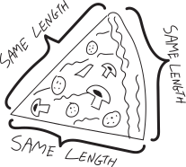
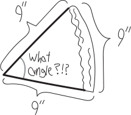
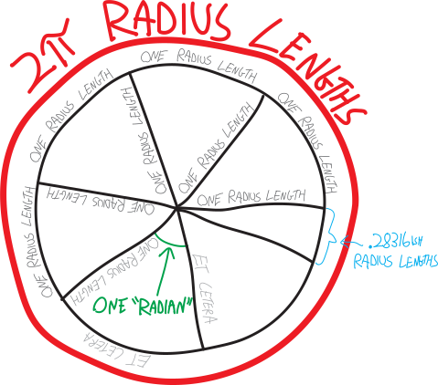

How do we measure angles? We usually measure them in degrees:
{width=75%}
But why degrees? In a complete revolution of a circle, there are 360 degrees. Whence 360? Isn't that kind of an awkward number? Why not define a “degree” such that all the degrees in a circle add up to 100 degrees? or 10 degrees?

Or maybe we could measure angles as a percent. We could say that the measure of the angle of a full circle is $100\%$ (or $1$), and then a $90\degree$ angle would be the same as a $25\%$ ($0.25$) angle, a $135\degree$ angle would be equivalent to a $37.5\%$ ($0.375$) angle, and  so forth. This would be a natural way of measuring an angle. Rather than being based on the arbitrariness of the number “$360$,” it would use the much more natural choice of the number $1$. 

Another way to measure angles---the way we'll use---involves pizza. Pizza is great! Pizza is so delicious. The only thing better than pizza is *really symmetrical pizza*. Imagine we have a strong predisposition for geometric symmetry, and so we want the crust of our piece of pizza to be the same length as the two cheesey sides, like so:
{width=50%}
(Note that we're measuring the crust on the outside edge.) So we want an equilateral piece of pizza. Sort of like an equilateral triangle, except not a triangle *per se*, because the crust side is curvy. But it's a similar idea. So, what angle should we cut this slice of pizza at, such that its crust length is the same as the length of the other two sides? (By “angle” we mean the angle at the center of the pizza, the one whose opposite side is the crust.)

Let's think about this. Imagine this is a pizza with an $18$-inch diameter. Then it has a radius of $9$ inches, and then we know the total length of its crust (measured on the outside) is $2\pi\cdot9 = 18\pi$. We also know---and we'll slip back into degrees for a moment here, but I assure you it's in service of a greater good---that the total number of degrees in this pizza is $360\degree$. So we can think of this like a proportion:
$$\frac{\text{total crust length}}{\quad \text{total degrees in pizza} \quad} = \frac{\quad \text{crust length of our slice} \quad}{\text{degrees in our slice}}$$
We want the length of the crust to be equal to the length of the other two sides. But because the pizza slice is just a slice of a circle, the other two sides must be both $9$ inches long:
{width=75%}
So if we plug in all that stuff, our proportion looks like this:
$$\frac{18\pi \,\, \text{inches}}{360\degree} \quad=\quad \frac{9\,\, \text{inches}}{\text{degrees in our slice}}$$
Then it is easy to solve this and find out how many degrees there are in our equilateral slice of pizza:
\begin{align*}
(\text{degrees in our slice})\cdot \frac{18\pi}{360\degree} &= 9\,\, \text{inches} \\ \\
\text{degrees in our slice} &= \frac{9\,\, \text{inches} \cdot 360\degree}{18\pi \,\, \text{inches}} \\ \\
\text{degrees in our slice} &\approx 57.296\degree 
\end{align*}
So then if we want a beautiful, equilateral slice of pizza, in which all the sides are the same length, we should cut it at an angle of $57.296\degree$!!! Note that there's something interesting here: even though we started with a pizza of radius $9$ inches, that got cancelled out in our calculations. For *any* size pizza, an angle of $57.296\degree$ will give us an equilateral slice.\footnote{To prove this, we could just repeat all of the same calculations, but using a pizza of radius $r$ instead of radius $9$}

This all relates back to thinking about how to measure angles. Namely: this is the system of angle-measurement that we will use. We'll create a measurement system in which the base unit is not $360\degree$ in a full revolution, or $100\%$, but rather, in which the base unit of measurement represents the angle needed to make the opposite arc of a circle equal to the length of its radius. We'll call it a **radian**:

1 radian $=$  the angle needed to make all three sides of a slice of pizza the same length

{width=50%}

That's  way of defining angles that is *natural to math*. It doesn't rely on something like the human-chosen number $360$. It's a way of *talking about math using math*.

It should make sense that a radian is approximately $57.296\degree$. We know that an equilateral triangle has angles of $60\degree$, and an equilateral pizza slice isn't quite the same thing---because of the curvy sides---but it is pretty close. So it makes sense that its angles should be close to $60\degree$. 

If we want to convert from degrees to radians (you would, of course, never want to convert out of radians!), we can simply derive a unit conversion factor. We know that the total number of radians in a full circle must be $2\pi$, since that's how many times we can fit the radius of a circle around its circumference. (We would have a pizza whose crust-length was $2\pi$ times that of its slice-radius.) Likewise, we know that the total number of degrees in a full circle is $360$. So we must have $360\degree$ for every $2\pi$ radians.

So, for example, if we want to convert $75\degree$ to radians:
\begin{align*}
\left(\frac{75 \,\, \text{degrees}}{1} \right)\left(\frac{2\pi \,\, \text{radians}}{360 \,\, \text{degrees}} \right) &= \left(\frac{75 \,\, \cancel{\text{degrees}}}{1} \right)\left(\frac{2\pi \,\, \text{radians}}{360 \,\, \cancel{\text{degrees}}} \right) \\ \\
&= \frac{150\pi}{360} \,\, \text{radians} \\ \\
&= \frac{5\pi}{12} \, \text{radians}
\end{align*}
The only sad thing about cutting our pizza in slices of one radian is that we'll end up with exactly $2\pi$ slices---and that's not an even number of slices! (Or rather, it's not an *integer* number of slices.) $2\pi$ is about $6.283$, so we'll have $0.283$ pieces of pizza left!

{style='border:1px solid black; padding: 1em;'}

## Problems

Rewrite the following angles in radians (or degrees, as appropriate), WITHOUT USING A CALCULATOR!:

<ol class = 'problems'>
<li> $0$</li>
<li> $\pi$</li>
<li> $2\pi$</li>
<li> $3\pi$</li>
<li> $4\pi$</li>
<li> $\pi/6$</li>
<li> $5\pi/6$</li>
<li> $7\pi/6$</li>
<li> $11\pi/6$</li>
<li> $13\pi/6$</li>
<li> $\pi/4$</li>
<li> $3\pi/4$</li>
<li> $7\pi/4$</li>
<li> $9\pi/4$</li>
<li> $\pi/3$</li>
<li> $2\pi/3$</li>
<li> $4\pi/3$</li>
<li> $5\pi/3$</li>
<li> $7\pi/3$</li>
<li> $\pi/2$</li>
<li> $3\pi/2$</li>
<li> $5\pi/2$</li>
<li> $74,452\pi$</li>
<li> $8,000,000\pi$</li>
<li> $k\pi$</li>
<li> $a\pi/b$</li>
<li> $45\degree$</li>
<li> $60\degree$</li>
<li> $30\degree$</li>
<li> $90\degree$</li>
<li> $135\degree$</li>
<li> $110\degree$</li>
<li> $150\degree$</li>
<li> $170\degree$</li>
<li> $179\degree$</li>
<li> $225\degree$</li>
<li> $12\degree$</li>
<li> $5.34\degree$</li>
<li> $7\degree$</li>
<li> $180\degree$</li>
<li> $360\degree$</li>
<li> $365\degree$</li>
<li> ($5$ million)\degree</li>
<li> (your favorite number)$\degree$ </li>
</ol>

