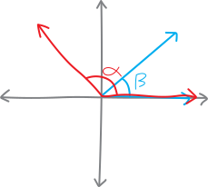
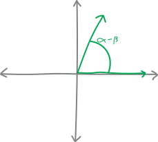
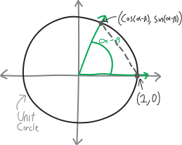

We know how to find trig functions of certain, special angles. Using our unit circle definition of the trig functions, as well as our knowledge of a couple special right triangles, we can find the sine/cosine/tangent of angles like $\pi$, $2\pi$, $3\pi$, $-\pi$, $-2\pi$---all the multiples of $\pi$---as well as all the multiples of $\pi/2$, $\pi/3$, etc. Really, we can find the sine/cosine/tangent of any multiple of any of these angles:

$$\pi, \quad \frac{\pi}{2}, \quad \frac{\pi}{3}, \quad \frac{\pi}{4}, \quad \frac{\pi}{6}$$

We can find them all without a calculator! No gross decimals! It's great. We've liberated ourselves from the tyranny of technology!!!

But... not completely. We still can't find the sine/cosine/tangent of *any* angle. Not without a calculator, at least. And that should be our overriding goal! To attain complete command of trigonometry. And... well, I don't know how we would do this in general. But let me suggest one way that maybe we could go about adding one more angle to our inventory. Here's something I notice when I look at that list. What happens if we subtract $\pi/3$ and $\pi/4$?

$$\frac{\pi}{3} - \frac{\pi}{4} = \frac{4\pi - 3\pi}{12} = \frac{\pi}{12}$$

We get a new angle, $\pi/12$. That's an angle that isn't already on the list^[In number-theory terms, the reason this happens is because $4$ and $3$ are “relatively prime”---they share no common factors. And so when we try to find a common denominator, we have to multiply them together.]. 

So maybe... hmm. I think I have an idea. We don't know what, like, $\sin\left(\frac{\pi}{3} - \frac{\pi}{4}\right)$ is:

$$\sin\left(\frac{\pi}{12}\right) = \sin\left(\frac{\pi}{3} - \frac{\pi}{4}\right) = ???$$

We don't know any way to simplify that. It's certainly not just $\sin\left(\frac{\pi}{3}\right) - \sin\left(\frac{\pi}{4}\right)$:

$$\underbrace{\sin\left(\frac{\pi}{3} - \frac{\pi}{4}\right) \neq    \sin\left(\frac{\pi}{3}\right) - \sin\left(\frac{\pi}{4}\right)}_{\text{noooooooo}}$$

We can't break trig functions up like that. *But what if we could?!?* Meaning, what if we could come up with some sort of formula for, like, the sine and cosine of $(\text{something} - \text{something else})$... maybe then we could be able to work out $\sin(\pi/3 - \pi/4)$, and by extension, $\sin(\pi/12)$. I guess what I mean, more formally, is: can we come up for a formula for $\sin(\alpha - \beta)$ (and $\cos(\alpha - \beta)$) only using $\sin(\alpha)$, $\sin(\beta)$, $\cos(\alpha)$, $\cos(\beta)$, and other simple stuff we know? 

\begin{align*}
\sin(\alpha + \beta) &=  \quad ??? \\
\sin(\alpha - \beta) &=  \quad ???  \\
\cos(\alpha + \beta) &= \quad ???  \\
\cos(\alpha - \beta) &= \quad ???
\end{align*}

If we could do that, we could figure out the sine and cosine of $\pi/12$. And that would be one little step towards our ultimate goal of being able to find the sine and cosine of any angle!!!

Let's do it. Let's try to find a formula for $\cos(\alpha - \beta)$. The basic idea of this derivation^[Which is just a polysyllabic word for “proof,” or, more accurately, for a certain type of proof.] is that we'll draw the angle $\alpha - \beta$ in two different ways. Then we'll use the Pythagorean theorem/distance formula to translate these two geometric pictures into algebraic sentences (i.e., equations). Then, because our two pictures are pictures of the same angle, we'll be able to set these two equations equal to each other, do some algebra, and ultimately solve for $\cos(\alpha - \beta)$. 

Here's how we'll start. Imagine we have Cartesian axes^[Just a fancy name for “a graph with $x$ and $y$ axes,” after Rene Descartes.], and we draw the angle $\beta$ on them:

{width=50%}

And then, on the same axes, also starting from the right side of the $x$-axis, we draw the angle $\alpha$:

{width=50%}

Obviously, $\alpha$ and $\beta$ could be anything; they're not specific angles. The cool observation here is that this picture contains the angle $\alpha - \beta$! See it? It's just the angle in between $\alpha$ and $\beta$:

{width=50%}

Meanwhile, we can also draw the angle $\alpha - \beta$ in the “normal” way, meaning that we can draw it starting from the $x$-axis (rather than drawing it in the middle):

{width=50%}

So then we have two different ways of drawing the same angle!

<table style='border-collapse: separate; border:0px;'> <tr> <td>{style='width:100%;'} </td> <td>{style='width:100%;'}</td></tr></table>

Here's the interesting thing. What if we draw the unit circle on these graphs, like so:

<table style='border-collapse: separate; border:0px;'> <tr> <td>{style='width:100%;'} </td> <td>{style='width:100%;'}</td></tr></table>

Then we can notice that the following line (opposite the angle $\alpha - \beta$)(the dotted one) is the same line in both drawings:

<table style='border-collapse: separate; border:0px;'> <tr> <td>{style='width:100%;'} </td> <td>{style='width:100%;'}</td></tr></table>

The line is in a slightly different position, yes---but it must be the same length. The only difference in the two pictures is that we've rotated the angle $\alpha - \beta$. The dotted line is just the other side of this triangle formed by these two radii of length $1$ and the angle $\alpha - \beta$ (side-angle-side, anyone?). So whatever the length of the line is, it must be the same for both drawings. 

If only we had a way to measure the length! But we do. Because this is a unit-circle setup, we know the coordinates of the two ends of the line:

<table style='border-collapse: separate; border:0px;'> <tr> <td>{style='width:100%;'} </td> <td>{style='width:100%;'}</td></tr></table>

So we can use the distance formula to find the lengths of the line! The equations will look different, but we know that the triangles are the same, so they'll have to work out to be the same thing (and then we'll be able to set the two different equations for the length of the dotted line equal to each other, etc., and eventually solve for just $\cos(\alpha - \beta)$). 

The distance formula, keep in mind, is just a modified version of the Pythagorean theorem:

$$\substack{\text{the distance/length between}\\\text{$\left(x_1,y_1\right)$ and $\left(x_2,y_2\right)$}} = \sqrt{ \left(x_2 - x_1\right)^2 + \left(y_2 - y_1\right)^2\,\,}$$

So let's apply this to the diagram on the left. If we use the distance formula to find the length of the dotted line, we get:

$$\text{length} = \sqrt{(\cos \alpha - \cos \beta)^2 + (\sin\beta - \sin\alpha)^2 \,\,} $$

Then if we multiply out the first square, this becomes:

$$= \sqrt{\cos^2\alpha - 2\cos\alpha\cos\beta + \cos^2\beta + (\sin\beta - \sin\alpha)^2 \,\,}$$

And if we multiply out the next square, we get:

\begin{align*}
&= \sqrt{\cos^2\alpha - 2\cos\alpha\cos\beta + \cos^2\beta + \sin^2\beta  - 2\sin\alpha\sin\beta + \sin^2\alpha \,\,}
\end{align*}

Messy, messy, messy. And long. But we can make it shorter! Remember that thing we proved the other day? The Pythagorean Identity? (The thing I love about this proof, by the way, is how long and intricate it is and how it pulls together so many different concepts.) Remember the Pythagorean identity? The one about $\sin^2\theta + \cos^2\theta = 1$? We can use that here! Let's rearrange this equation slightly:

\begin{align*}
 &= \sqrt{\underbrace{\left(\cos^2\alpha + \sin^2\alpha\right)}_{=1} - 2\cos\alpha\cos\beta + \underbrace{\left(\cos^2\beta + \sin^2\beta\right)}_{=1}  - 2\sin\alpha\sin\beta \,\,} \\
\end{align*}

See? Parentheses? We have $\cos^2\alpha + \sin^2\alpha$, which must be equal to just $1$, and we also have $\cos^2\beta + \sin^2\beta$, which must also be equal to $1$. So we have:

$$= \sqrt{1 - 2\cos\alpha\cos\beta + 1  - 2\sin\alpha\sin\beta \,\,}$$

Or if we combine the $1$'s:

$$= \sqrt{2 - 2\cos\alpha\cos\beta  - 2\sin\alpha\sin\beta}$$

So this is *one* way of writing the length of that dotted line. Phew. 

*Alternatively*, we could find the length using the picture on the *right*. If we do that, and if we apply the distance formula, we get:

\begin{align*}
\text{length (other way)}&= \sqrt{(\cos(\alpha - \beta) - 1)^2 + (\sin(\alpha - \beta) - 0)^2} \\
\end{align*}

You may want to glance back at the picture to convince yourself that this is true. Then, if we multiply out those squares, we get:

\begin{align*}
&= \sqrt{\cos^2(\alpha - \beta) -2\cos(\alpha - \beta) + 1  + \sin^2(\alpha - \beta)}
\end{align*}

Kinda messy. But AGAIN, we can apply the Pythagorean Identity!!! We have $\cos^2(\alpha - \beta)$ and also $\sin^2(\alpha - \beta)$, so when added together these must be $1$. So we must have:

\begin{align*}
&= \sqrt{-2\cos(\alpha - \beta) + 1 + 1} \\ \\
&= \sqrt{2 -2\cos(\alpha - \beta)}
\end{align*}

So we have two different ways to write the length of the same line. Let's summarize:

<table style='border-collapse: separate; border:0px;'> <tr> <td>{style='width:100%;'} </td> <td>{style='width:100%;'}</td></tr>
<tr style='text-align:center;'> <td>Length of dotted line: $\sqrt{2 - 2\cos\alpha\cos\beta  - 2\sin\alpha\sin\beta}$</td> <td>Length of dotted line: $\sqrt{2 -2\cos(\alpha - \beta)}$ </td> </tr></table>

Obviously, these two lines are the same lines. So their lengths must be equal. So we can set these two equations equal to each other, and (hopefully!) solve for $\cos(\alpha - \beta)$!!!

\begin{align*}
\text{length} \,\, &= \,\, \text{length} \\ \\
\sqrt{2 - 2\cos\alpha\cos\beta  - 2\sin\alpha\sin\beta } \,\,&=\,\, \sqrt{2 -2\cos(\alpha - \beta)} \\ \\
2 - 2\cos\alpha\cos\beta  - 2\sin\alpha\sin\beta  \,\,&=\,\, 2 -2\cos(\alpha - \beta) \quad\quad\text{(squaring both sides)} \\  \\
- 2\cos\alpha\cos\beta  - 2\sin\alpha\sin\beta  \,\,&=\,\, -2\cos(\alpha - \beta) \quad\quad\text{(subtracting 2)}\\ \\
\cos\alpha\cos\beta  \sin\alpha\sin\beta  \,\,&=\,\, \cos(\alpha - \beta) \quad\quad\text{(dividing by $-2$)} \\ \\
\cos(\alpha - \beta) \,\,&=\,\, \cos\alpha\cos\beta  + \sin\alpha\sin\beta
\end{align*}

There we go! We've done it! We've found an equation for $\cos(\alpha - \beta)$! This means that we can now find $\cos(\pi/12)$!!! We can use the equation that we just derived:

\begin{align*}
\cos\left(\frac{\pi}{12}\right) &= \cos\left(\frac{\pi}{3} - \frac{\pi}{4}\right) \quad\quad\text{(fractions)}  \\ \\
&= \cos\left(\frac{\pi}{3}\right)\cos\left(\frac{\pi}{4}\right) + \sin\left(\frac{\pi}{3}\right)\sin\left(\frac{\pi}{4} \right) \quad\quad\text{(by our equation!!!)} \\ \\
&= \frac{1}{2}\cdot \! \frac{1}{\sqrt{2}} \,\,\,\,+\,\,\,\, \frac{\sqrt{3}}{2}\cdot\! \frac{1}{\sqrt{2}} \quad\quad\text{(trig)} \\ \\
&= \displaystyle \frac{1+\sqrt{3}}{2\sqrt{2}} \quad\quad\text{(fractions)}
\end{align*}

We've found the cosine!!!! Wahooooo!

$$\boxed{ \cos\left(\frac{\pi}{12}\right) = \frac{1+\sqrt{3}}{2\sqrt{2}}}$$

But there are still many questions unanswered. We know the cosine of $\pi/12$---but what's the sine of $\pi/12$? Or the tangent? We know $\cos(\alpha - \beta)$---but what about $\cos(\alpha + \beta)$? Or $\sin(\alpha + \beta)$? Or $\sin(\alpha - \beta)$? We could make a whole list of related formulae:

**Sum and Difference Identities:**

\begin{align*}
\sin(\alpha + \beta) &=  \quad ??? \\
\sin(\alpha - \beta) &=  \quad ???  \\
\cos(\alpha + \beta) &= \quad ???  \\
\cos(\alpha - \beta) &= \cos\alpha\cos\beta  + \sin\alpha\sin\beta
\end{align*}

Hmmmm....

## Problems

For problems 1-4, write up your work neatly and turn it in. Use full sentences and give a complete explanation, as if you were explaining the problem/proof to a friend who's never seen it before and is very confused. 

<ol class='problems'>
<li> It's pretty cool that we know now how to find $\cos(\alpha-\beta)$. But we'd really like to know how to find all of the similar formulae:

**Sum and Difference Identities:**

\begin{align*}
\sin(\alpha + \beta) &=  \quad ??? \\
\sin(\alpha - \beta) &=  \quad ???  \\
\cos(\alpha + \beta) &= \quad ???  \\
\cos(\alpha - \beta) &= \cos\alpha\cos\beta  + \sin\alpha\sin\beta
\end{align*}

So, come up with formulas for the first three. The hard way to do it would be to just repeat what we did here: construct two different ways of writing each angle, calculate the distance between the legs of the angle in two different ways, and do a bunch of algebra to back out the identities. And do that three times. Ugh. You can do that if you want. An easier way, though, would be combine our knowledge of $\cos(\alpha - \beta)$ with our existing knowledge of other trig identities.

So, do that. Come up with formulas for each of the three identities above only in terms of $\sin(\alpha)$, $\sin(\beta)$, $\cos(\alpha)$, and $\cos(\beta)$. Justify and explain each step. You can probably look up what the formulas are on the internet or something, and maybe you should to verify that you don't get them wrong. The point in this problem isn't to come up with the answer so much as it is to **explain** how to come up with the answer. Make a mathematical argument! Think like a mathematician!
</li>

<li> Using those identities, find $\sin(\pi/12)$. </li>
<li> Using those identities, find $\cos(\pi/12)$. </li>
<li> Look closely at your answers to problems 2 and 3. Do you see a new special right triangle we could construct? What are its angles and side lengths? </li>
</ol>
