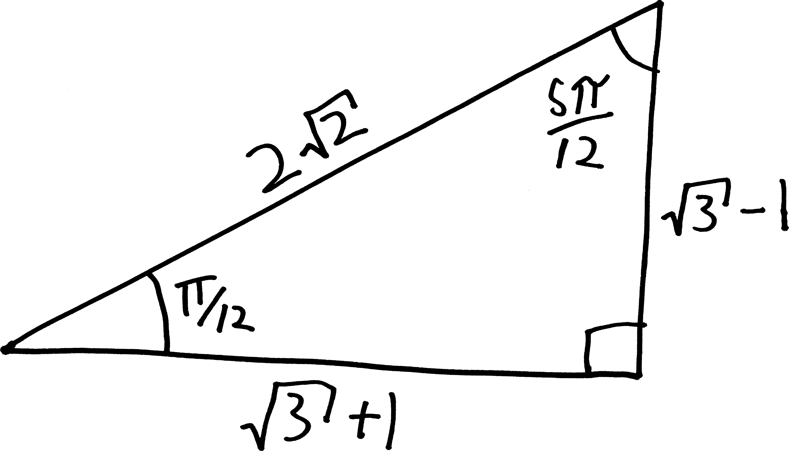

After a massive amount of effort---involving geometry, a bunch of algebra, various fun facts about trig---we figured out what the cosine of two angles subtracted was:
$$\cos(\alpha - \beta) = \cos\alpha\cos\beta  + \sin\alpha\sin\beta$$
Using that, we were able to figure out how to calculate the cosine of $\pi/12$ without a calculator, which is pretty cool:

\begin{align*}
\cos\left(\frac{\pi}{12}\right) &= \cos\left(\frac{\pi}{3} - \frac{\pi}{4}\right) \\ \\
&= \underbrace{\cos\left(\frac{\pi}{3}\right)\cos\left(\frac{\pi}{4}\right) + \sin\left(\frac{\pi}{3}\right)\sin\left(\frac{\pi}{4}\right)}_{\text{by our awesome equation}} \\ \\
&= \frac{1}{2}\cdot \! \frac{1}{\sqrt{2}}\,+\, \frac{\sqrt{3}}{2}\cdot\! \frac{1}{\sqrt{2}} \\ \\
&=  \frac{1+\sqrt{3}}{2\sqrt{2}}
\end{align*}

But this still left us with many questions unanswered. We know the cosine of $\pi/12$---but what's the sine? We know $\cos(\alpha - \beta)$---but what about $\cos(\alpha + \beta)$? Or $\sin(\alpha + \beta)$? Or $\sin(\alpha - \beta)$? We could make a whole list of related formulae:

**Sum and Difference Identities:**

\begin{align*}
\sin(\alpha + \beta) &=  \quad ??? \\
\sin(\alpha - \beta) &=  \quad ???  \\
\cos(\alpha + \beta) &= \quad ???  \\
\cos(\alpha - \beta) &= \cos\alpha\cos\beta  + \sin\alpha\sin\beta
\end{align*}

We only know one of these formulae. Let's see if we can find the other three. Our goal, ultimately, is to be able to find $\sin(\alpha - \beta)$, and thus $\sin(\pi/12)$.

One way to do this would be to follow the same procedure we did to find $\cos(\alpha - \beta)$. We could draw the angle $\alpha-\beta$ in two different ways, measure its length, and do some algebra. That would work.  It's what many of you did on the homework. Some of you were even successful! But it was such a tedious, long process. Doing repetitive, tedious processes isn't fun. It'd be nice if there was an easier way. And there is!!!

It's kind of like how, when you break into a house to steal the TV, it's really tough to get in. You have to cut the phone lines. You have to disable the security system. You have to feed sleeping-pill-laced steaks to the guard dogs. You have to dance your way through the lattice of laser sensors. You have to carefully cut a hole in a window and suction-cup remove it. It's a lot of work!!! But if you then decide that you also want to steal the stereo, *you don't have to break into the house a second time*. You can just walk over and take the stereo! Sure, you *could* break into the house a second time. You *could* do all that hard stuff again. But why???

We've done the hard work to get one of the formulas. The other three can now come much more easily. 

For instance, if we want to find $\cos(\alpha + \beta)$, we can use the fact that subtraction is just addition, but with a negative sign! So we can take the formula we came up with, “subtract” “negative beta,” and then use two of our symmetry identities to simplify it:

\begin{align*}
\cos(\alpha + \beta) &= \cos\big(\alpha - (-\beta) \big) \quad\quad\text{(just algebra!!!)} \\ \\
&= \cos(\alpha)\cos(-\beta) + \sin(\alpha)\sin(-\beta)  \quad\quad\text{(we can apply our equation)} \\ \\
& =  \cos(\alpha)\cos(\beta) + \sin(\alpha)\sin(-\beta)  \quad\quad\text{(we know $\cos(-\theta) = \cos(\theta)$)}  \\ \\
&= \cos(\alpha)\cos(\beta) + \sin(\alpha)\big(-\sin(\beta)\big)  \quad\quad\text{(and $\sin(-\theta) = -\sin(\theta)$)} \\ \\
&= \cos(\alpha)\cos(\beta) - \sin(\alpha)\sin(\beta)  \quad\quad\text{(distributing negative)} \\ \\
& \includegraphics[scale=.25]{andrewproof.png}
\end{align*}

Hooray!!! So here's what we know now:

**Sum and Difference Identities:**

\begin{align*}
\sin(\alpha + \beta) &=  \quad ??? \\
\sin(\alpha - \beta) &=  \quad ???  \\
\cos(\alpha + \beta) &= \quad \cos(\alpha)\cos(\beta) - \sin(\alpha)\sin(\beta)   \\
\cos(\alpha - \beta) &= \quad\cos(\alpha)\cos(\beta)  + \sin(\alpha)\sin(\beta)
\end{align*}

What about the sines? OK, this isn't *quite* as easy. We did all that hard work to break into the house to steal the TV. We decided to steal the stereo, too, and that was very little extra work. But now we want to steal the family silver. So we'll have to break into pantry, hunt around, and maybe pick a few locks on the cupboard doors. It's a little bit more work. (But still way easier than breaking into the house *ab initio*!)

Here's the argument we can make. We know that sine and cosine *are the same function*... just modulo a horizontal shift^[The word **modulo** in this context means “they are the same except for a horizontal shift.” Another similar usage might be, “my blue 1999 minivan is the same as your blue 2001 minivan, modulo the model year.” I have been part of a small cult movement that has been trying, for the past few years, to introduce this word (originally from math) into the popular lexicon. Here's another example, from an email my dad sent a few days before I originally typed up this proof: “Actually, life in Switzerland is not so different from life at home, modulo a few obvious things like living without a car, struggling to communicate with people on the street, and being dirt poor.”]. More formally, we know:

$$\sin(\theta) = \cos(\theta - \pi/2)$$

So if we think of a sine as just being a shifted cosine, we have:

$$\sin(\alpha + \beta) = \cos\Big( \,(\alpha + \beta)\, - \pi/2 \Big)$$

Yay! And now we've got just the cosine of two angles subtracted! We have a formula for that! So if we apply that, we'll get:

$$\sin(\alpha + \beta) = \cos(\, \alpha + \beta\,)\cos\left(\frac{\pi}{2}\right) + \sin(\, \alpha + \beta\,)\sin\left(\frac{\pi}{2}\right)$$

OK, and we know that $\cos(\pi/2)$ is $0$, and $\sin(\pi/2)$ is $1$, so this becomes:

\begin{align*}
\sin(\alpha + \beta) &= \cos(\, \alpha + \beta\,)\underbrace{\cos\left(\frac{\pi}{2}\right)}_{=0} + \sin(\, \alpha + \beta\,)\underbrace{\sin\left(\frac{\pi}{2}\right)}_{=1} \\ \\
\sin(\alpha + \beta) &= \cos(\, \alpha + \beta\,)\cdot 0 \quad+\quad \sin(\, \alpha + \beta\,)\cdot 1 \\ \\
\sin(\alpha + \beta) &= 0 + \sin(\, \alpha + \beta\,) \\ \\
\sin(\alpha + \beta) &= \sin(\, \alpha + \beta\,)
\end{align*}

Uh.

Uh.

OK, I mean, we're not wrong here... $\sin(\alpha+\beta)$ does equal $\sin(\alpha+\beta)$. Things do equal themselves. Math would be... a lot more boring if they didn't. (Or maybe a lot more exciting? Unclear.) But this isn't what we were hoping to get. We didn't do anything *wrong*, but we didn't do anything *right*. We didn't get what we wanted. We didn't get caught, but nor did we get the family silver.

So let's... try again? Maybe we can rearrange things in a way that's a bit more productive. We had:

$$\sin(\alpha + \beta) = \cos\Big( \,(\alpha + \beta)\, - \pi/2 \Big)$$

Let's move the parentheses around:

$$\sin(\alpha + \beta) = \cos\Big( \alpha + (\beta - \pi/2)\, \Big)$$

But now we have the cosine of two things *added*! And we have a formula for that. So, applying that formula, we get:

$$\sin(\alpha + \beta) = \cos(\alpha)\cos\left(\beta - \frac{\pi}{2}\right) - \sin(\alpha)\sin\left(\beta-\frac{\pi}{2}\right)$$

That's kind of ugly. We can make it nicer! We could simplify the $\cos(\beta - \pi/2)$ by applying our formula for $\cos(\alpha-\beta)$ again, but we that's overkill. Instead, let's use that same horizontal shift identity!!! We know that $\sin(\theta) = \cos\left(\theta - \frac{\pi}{2}\right)$. We've already used it. We can apply it *again*. So then we have:

$$\sin(\alpha + \beta) = \cos(\alpha)\sin(\beta) - \sin(\alpha)\sin(\beta-\pi/2)$$

What about this $\sin\left(\beta-\frac{\pi}{2}\right)$? Can we simplify that? You might not know it offhand, but we can come up with a similar horizontal shift identity. You can convince yourself that $\sin\left(\theta - \frac{\pi}{2}\right) = -\cos(\theta)$. So if we apply that, we have:

$$\sin(\alpha + \beta) =  \cos(\alpha)\sin(\beta) - \sin(\alpha)\big(-\cos(\beta)\, \big)$$

We can distribute the negatives, and then the two negatives annihilate each other like matter and antimatter:

\begin{align*}
\sin(\alpha + \beta) &=  \cos(\alpha)\sin(\beta) + \sin(\alpha)\cos(\beta) \\
&\includegraphics[scale=.25]{andrewproof.png}
\end{align*}

Yay!!! So now our big list of formulas looks like:

**Sum and Difference Identities:**

\begin{align*}
\sin(\alpha + \beta) &=  \quad \cos(\alpha)\sin(\beta) + \sin(\alpha)\cos(\beta) \\
\sin(\alpha - \beta) &=  \quad ???  \\
\cos(\alpha + \beta) &= \quad \cos(\alpha)\cos(\beta) - \sin(\alpha)\sin(\beta)   \\
\cos(\alpha - \beta) &= \quad \cos(\alpha)\cos(\beta)  + \sin(\alpha)\sin(\beta)
\end{align*}

We're not done! Eyes on the prize. We want to be able to find $\sin\left(\frac{\pi}{12}\right)$. And in order to do that, we'll need to find $\sin\left(\frac{\pi}{3} - \frac{\pi}{4}\right)$, and in order to do *that*, we'll need to have a formula for $\sin(\alpha - \beta)$.

We're almost there! We can an argument that's similar to the one we used to find $\cos(\alpha+\beta)$. In this case, we know how to find $\sin(\alpha+\beta)$, so we can just subtract negative $\beta$, and that'll do it!!

\begin{align*}
\sin(\alpha - \beta) &= \sin\big(\alpha + (-\beta) \big) \quad\quad\text{(just algebra!!!)} \\ \\
&=\cos(\alpha)\sin(-\beta) +\sin(\alpha)\cos(-\beta) \quad\quad\text{(by the formula we just came up with)}  \\ \\
&=\cos(\alpha)\sin(-\beta) + \sin(\alpha)\cos(\beta) \quad\quad\quad\text{(we know $\cos(-\theta) = \cos(\theta)$)} \\ \\
&=\cos(\alpha)\big(-\sin(\beta)\big) + \sin(\alpha)\cos(\beta) \quad\quad\text{(and $\sin(-\theta) = -\sin(\theta)$)} \\ \\
&= -\cos(\alpha)\sin(\beta) + \sin(\alpha)\cos(\beta) \quad\quad\text{(distributing negative)}  \\ \\
&= \sin(\alpha)\cos(\beta) - \cos(\alpha)\sin(\beta) \quad\quad\text{(rearranging)}  \\ \\
& \includegraphics[scale=.25]{andrewproof.png}
\end{align*}

So there we have it: all of our sum and difference identities!!! Let's summarize (*sum*marize):

**Sum and Difference Identities:**

\begin{align*}
\sin(\alpha + \beta) &=  \sin(\alpha)\cos(\beta) + \cos(\alpha)\sin(\beta) \\
\sin(\alpha - \beta) &=  \sin(\alpha)\cos(\beta) - \cos(\alpha)\sin(\beta)  \\
\cos(\alpha + \beta) &= \cos(\alpha)\cos(\beta) - \sin(\alpha)\sin(\beta)  \\
\cos(\alpha - \beta) &= \cos(\alpha)\cos(\beta)  + \sin(\alpha)\sin(\beta)
\end{align*}

Formulae that follow like a tedious argument... we still have this overwhelming question: what's the sine of $\pi/12$? Now we can figure it out!!! Using the same method that we used to find $\cos(\pi/12)$, we can split $\pi/12$ up into $\pi/3 - \pi/4$, and then apply the identity we just derived:

\begin{align*}
\sin\left(\frac{\pi}{12}\right) &= \sin\left(\frac{\pi}{3} - \frac{\pi}{4}\right) \quad\quad\text{(fractions)} \\ \\
&= \sin\left(\frac{\pi}{3}\right)\cos\left(\frac{\pi}{4}\right) - \cos\left(\frac{\pi}{3}\right)\sin\left(\frac{\pi}{4}\right) \quad\quad \text{(by our equation!!!)} \\ \\
&= \frac{\sqrt{3}}{2}\cdot \! \frac{1}{\sqrt{2}} \,\,\,\,-\,\,\,\, \frac{1}{2}\cdot \! \frac{1}{\sqrt{2}} \quad\quad\text{(trig)}  \\ \\
&= \displaystyle \frac{-1+\sqrt{3}}{2\sqrt{2}} \quad\quad\text{(fractions)} 
\end{align*}

Whoopee!!!! Now we know both the sine and cosine of $\displaystyle\frac{\pi}{12}$! 

But wait.

Something's interesting here. We know

$$\cos\left(\frac{\pi}{12}\right) = \frac{1 + \sqrt{3}}{2\sqrt{2}} \hspace{1cm}\text{and}\hspace{1cm} \sin\left(\frac{\pi}{12}\right) = \frac{-1 + \sqrt{3}}{2\sqrt{2}}$$

And we also know that, at least with angles between $0$ and $\pi/2$, cosine and sine are the ratios of the adjacent and opposite sides of a right triangle to its hypotenuse!

$$\cos\left(\frac{\pi}{12}\right) = \frac{1 + \sqrt{3}}{2\sqrt{2}} = \frac{\text{adj}}{\text{hyp}} \hspace{1cm}\text{and}\hspace{1cm} \sin\left(\frac{\pi}{12}\right) = \frac{-1 + \sqrt{3}}{2\sqrt{2}} = \frac{\text{opp}}{\text{hyp}}$$

So we can construct a *new special right triangle*, whose^[I know I should be writing “the hypotenuse of which is...”, but I'd rather anthropomorphize my triangles.] hypotenuse is $2\sqrt{2}$, whose side adjacent to $\pi/12$ is $1 + \sqrt{3}$, and whose side opposite $\pi/12$ is $-1 + \sqrt{3}$! (Note, then, that the other angle in the triangle will be $5\pi/12$, since the angles have to all add up to $\pi/2$.) This is awesome!

{width=75%}

So *this is what all of our work comes down to*. We did this huge derivation to find the sum and difference identities, and then we used the sum and difference identities to evaluate the sine and cosine of $\pi/12$, and then we used *that* to build this special right triangle. And now we can evaluate the sine/cosine/tangent of any multiple of $\pi/12$. Just using this new special right triangle. Phew.

This was fun.

## Problems

Using what you know about trigonometry, the unit circle, and special right triangles---including our brand-new special right triangle!---evaluate the following trig functions without a calculator:

<ol class='problems'>
<li> $\sin(\pi/12)$ </li>
<li> $\cos(\pi/12)$</li>
<li> $\tan(\pi/12)$ </li>
<li> $\sin(5\pi/12)$</li>
<li> $\cos(5\pi/12)$ </li>
<li> $\tan(5\pi/12)$</li>
<li> $\sin(7\pi/12)$ </li>
<li> $\cos(7\pi/12)$</li>
<li> $\tan(7\pi/12)$ </li>
<li> $\sin(11\pi/12)$</li>
<li> $\cos(11\pi/12)$ </li>
<li> $\tan(11\pi/12)$</li>
<li> $\sin(13\pi/12)$ </li>
<li> $\cos(13\pi/12)$</li>
<li> $\tan(13\pi/12)$ </li>
<li> $\sin(17\pi/12)$</li>
<li> $\cos(17\pi/12)$ </li>
<li> $\tan(17\pi/12)$</li>
<li> $\sin(19\pi/12)$ </li>
<li> $\cos(19\pi/12)$</li>
<li> $\tan(19\pi/12)$ </li>
<li> $\sin(23\pi/12)$</li>
<li> $\cos(23\pi/12)$ </li>
<li> $\tan(23\pi/12)$</li>
<li> $\sin(25\pi/12)$ </li>
<li> $\cos(25\pi/12)$</li>
<li> $\tan(25\pi/12)$</li>
</ol>

<ol class= 'problems'>
<li> We have formulas for the sine and cosine of sums and differences... how 'bout tangent?!?
<li> Can you double-check, using the Pythagorean Theorem, that the three side lengths of our new special right triangle, actually are viable (i.e., that they fit the Pythagorean Theorem)??
<li> In class, Emma <!-- Wang '26 --> asked about what to do if we have the sine or cosine of not *two* things added together, but *three* things, e.g.
	$$\sin(\alpha + \beta + \gamma) = \,\, ???$$
	$$\cos(\alpha + \beta + \gamma) = \,\, ???$$
Can you answer her question???

(That third angle is a **[gamma](https://en.wikipedia.org/wiki/Gamma)**, note, the third letter of the Greek alphabet, which I write as a downwards-swimming fishy.)
<li> Sometimes, on big lists of trig identities, people will write down what they often call the **double angle identities**, which are formulas like:
$$\sin(2\theta) = \text{ blah blah blah}$$
$$\cos(2\theta) = \text{ blah blah blah}$$
Figure these formulas out! (Don't look them up!)
<li> We've figured out how sine and cosine play with addition and subtraction... how do they play with multiplication and division???
\begin{align*}
\sin(\alpha \cdot \beta) &=  \quad\quad ??? \\ \\
\sin\left(\frac{\alpha}{\beta}\right) &=  \quad\quad ??? \\ \\
\cos(\alpha \cdot \beta) &= \quad\quad ??? \\ \\
\cos\left(\frac{\alpha}{\beta}\right) &= \quad\quad ???
\end{align*}

</ol>

