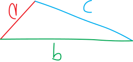
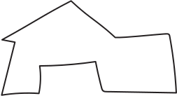
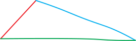
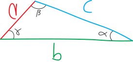
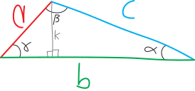
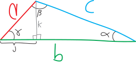
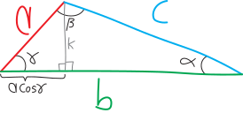
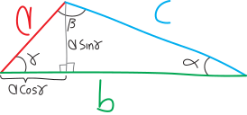
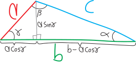
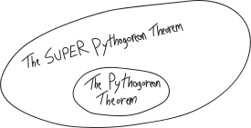

You know the Pythagorean Theorem. It's great:
{width=50%}
$$c^2 = a^2 + b^2$$
But it has a problem. *It only works for right triangles.* That's a problem because there are plenty of triangles that are ~~wrong~~ non-right! Suppose we have a triangle like this one:
{width=50%}
What if we want to come up with an equation relating its side lengths?? We can't do it! We don't have such an equation!

But... *maybe we could build one.*

Let's back up a bit. We care a lot about triangles. We're always talking about triangles in math classes. Triangles, side lengths, angles, trig functions---why do we care about triangles so much? 

One reason is that *triangles are the atoms of shapes*. Every shape we can just split up into a bunch of triangles! Rectangles, squares, octagons, vigintiseptagons, convex, concave---they're all really just a bunch of triangles glued together and with the seams sanded down.^[Okay, obviously we're talking about only shapes that aren't curvy... but curvy shapes have to wait until calculus.]. So *triangles are like the atoms of shapes*!!! If we understand how triangles work, we can understand how all shapes work!!

Here's a shape:
{width=50%}
But it's really just triangles:
{width=50%}
(If you want some fun, go on Wikipedia and read about **[triangulation](https://en.wikipedia.org/wiki/Triangulation_(geometry))** (in the geometric sense).) The analogy goes further. It's not just triangles that we're always talking about in math classes---we spend a tremendous tranche of time talking about *right triangles* in particular. I guess one of the nice things about right triangles is that we know a lot about them. We can come up with equations and functions relating their side lengths and angles (the Pythagorean Theorem, trig functions, etc). They're easier to understand than non-right triangles. And here's the thing: *every non-right triangle we can turn into a bunch of right triangles.*. Actually, just two right triangles, although we could keep going and turn it into even more right triangles if we wanted. So really, every triangle is just a pair of right triangles, glued together with the seams sanded to invisibility. So if triangles are like the atoms of shapes, then right triangles are like the *protons* and *neutrons* and *electrons* of shapes.^[What are the quarks of shapes? The gluons?] 

Here's a non-right triangle:
{width=50%}
But it's really just two right triangles!
{width=50%}
So we want to come up with something like the Pythagorean Theorem that works for *all* triangles. Here's how we're going to do it. We're going to take an arbitrary triangle---a random triangle; maybe it's right; maybe it's non-right, dunno---and put it into our ~~atom-smasher~~ triangle-smasher to break it into right triangles. Then we're going to use our tried-and-true traditional Pythagorean Theorem to understand *those* right triangles better, and then, having done that, we'll be able to understand our original non-right triangle better.

One thing I like about this argument is that it starts with the normal/boring/old-fashioned Pythagorean Theorem. It uses the *simpler* version of the Pythagorean Theorem to come up with a *more complicated* version of the Pythagorean Theorem. It uses a *more specific, less general* tool to come up with a *more general, more powerful* tool. It doesn't start with a powerful tool and use that to make a simpler tool. It starts with a simple tool and uses that to make a more powerful tool. Civilization starts with people banging stones together to create simple tools, and then using those tools to create slightly more complicated tools, etc. etc., and then ten thousand years later we have lasers and 747s. All that can be traced back to people in Anatolia banging stones together. *Simplicity first, then complexity.*

OK, enough with the preamble. Let's imagine we have a triangle:
{width=75%}
This could be *any* triangle---right, wrong, obtuse, scalene, isoleces, acute, (*frantically Googling "names for types of triangles"*), whatever!

Let's say it has side lengths $a$, $b$, and $c$:
{width=75%}
And let's say it has angles of $\alpha$, $\beta$, and $\gamma$ ("gamma"), opposite $a$, $b$, and $c$, respectively. (Alpha, beta, and gamma are the first three letters of the Greek alphabet, hence wanting to match them up with $a$, $b$, and $c$.)
{width=75%}
Can we come up with a relationship between $a$, $b$, and $c$? If this were a right triangle, we'd have:
$$c^2 = a^2 + b^2$$
But this might not be a right triangle! So this might not be true.
$$\cancel{c^2 = a^2 + b^2}$$
But... hmmm, maybe we can put this into our atom-smasher and smash it into its constituent parts. In other words, maybe we can chop this up into a pair of right triangles. If we chop it into a pair of right triangles, then we can use our old-school right triangle trig (the normal Pythagorean theorem, trig functions, etc.) on the individual right triangle parts. And by learning more about the *parts* of the triangle (its two constituent right triangles), we can learn more about the *whole* of the triangle. We can figure out properties of protons and neutrons, and use that to figure out properties of atoms.

Here's one way we could chop up this triangle:
{width=75%}
So this is a line that goes through the angle $\beta$ and intersects perpendicularly with $b$. It doesn't neccessarily cut $\beta$ in half---it *might*, but it doesn't have to---the only constraint is that it has to be perpindicular to $b$, to create these two nice little right angles. (Sometimes people refer to this sort of line as an **altitude**, and this process as "**dropping an altitude**" or something like that. Sounds like Colorado skiier lingo.)

Note that this isn't the *only* way to chop this triangle up into two right triangles. We could chop it by cutting it with a line perpendivular to $a$ (through angle $\alpha$); we could chop it by cutting it with a line perpendicular to $c$ (through $\gamma$). And we'd get a different, more exotic, but equally true and equally valid version of the Super Pythagorean Theorem!

But, anyway, we'll do it this way. So now we have two right triangles. We have a right triangle on the left; we have a right triangle on the right. Since they're right triangles, we can do trig with them! And we can do the Pythagorean theorem with them!

Let's think at first about that right triangle on the left. What do we know about it? Well, we know it has a hypotenuse of length $a$. We know that one of its angles is $\gamma$. We know that one of its angles is $\pi/2$ (i.e., the right angle). There's a third angle, there at the top... and since the total degrees must add up to $\pi$, that angle must be $\pi/2 - \gamma$:
{width=75%}
OK, that's nice. What about the side lengths? The hypotenuse is length $a$. We don't know the two leg lengths. Hmmm. But we can figure them out using trig! We have a right triangle, and we know the angles! So we can do it! 

Let's add some more variables and label some lengths first. Let's say that the altitude we drew is of length $k$:
{width=75%}
And that the bottom leg of this triangle (the segment of $b$) is of length $j$ (whatever that is):
{width=75%}
Of course we haven't really done anything yet; we haven't *learned* anything; we've just given new names to things we don't know. Ultimately we want *fewer* names, not more! So can we re-simplify? Can we write these things ($k$ and $j$) in terms of things we already know??? Yes!

Take $j$, for example. It's the bottom leg of that right triangle with hypotenuse length $a$ and it's adjacent---*adjacent*!---to angle $\gamma$. But we know:
$$\text{cosine} = \frac{\text{adjacent}}{\text{hypotenuse}}$$
So we must have:
$$\cos(\gamma) = \frac{j}{a}$$
Or, rearranging:
$$a\cos(\gamma) = j$$
$$j = a\cos\gamma$$
Delightful! Let's delete $j$ and call it $a\cos\gamma$ instead:
{width=75%}
We can make the same argument to get rid of $k$. $k$ is the side opposite angle $\gamma$ in this right triangle with hypotenuse $a$, so we must have:
$$\sin(\gamma) = \frac{k}{a}$$
Or:
$$k = a\sin\gamma$$
Or, relabelling that on our diagram:
{width=75%}
OK! Look at this beautiful triangle cut up into two beautiful right triangles!!!! And if we think about the right triangle on the left, now we know everything about it! We know all its angles, and all its lengths! 

Can we figure out everything about the right triangle on the right, too? We know two of its angles. There's another $\pi/2$ angle, and there's the angle $\alpha$. All the angles have to add up to $\pi$, so the angle at the top has to be $\frac{\pi}{2}-\alpha$. 
{width=75%}
What about the side lengths? We know it has a hypotenuse of legnth $c$. We know that one of the sides has a length of $a\cos\gamma$, because we just figured that out. (Maybe we could rewrite it in terms of $\alpha$, but let's stick with that for now.) What about the leg on the bottom? Do we know its length? Well, because the total length of the bottom leg of the big non-right triangle is $b$, and the chunk on the left is length $a\cos\gamma$, then the bottom leg of the right triangle on the right must be $b-a\cos\gamma$:
{width=75%}
Now we know everything about both of the two right triangles that make up our original big non-right triangle!!!

Let's go back to the right triangle on the right and think about it for a moment. It's a right triangle, so it has to follow the Pythagorean Theorem (the normal one). So then we must have:
$$(\text{hypotenuse})^2 = (\text{leg 1})^2 + (\text{leg 2})^2$$
Or:
$$c^2 = (a\sin\gamma)^2 + (b-a\cos\gamma)^2$$
In a sense, this is it!!! We've found a Super Pythagorean Theorem! We have an equation now that relates the three sides of this original non-right triangle---$a$, $b$, and $c$---and there's some extra information we need in there, too, in the form of this angle $\gamma$. 

But let's see if we can clean this up? Can we noodle around with this and make it a bit nicer? Maybe we can't, but we might as well try. Diving into the algebra, we have:
\begin{align*}
c^2 &= (a\sin\gamma)^2 + (b-a\cos\gamma)^2  \\ \\
&= (a\sin\gamma)^2 + (b-a\cos\gamma)(b-a\cos\gamma)   \\ \\
 &= a^2\sin^2(\gamma)  \,\,+\,\, \Big(\, b^2 - 2ab\cos(\gamma) + a^2\cos^2(\gamma)\,\Big)  \quad\text{(squaring)} \\ \\
 &=  a^2\sin^2(\gamma) + b^2 - 2ab\cos(\gamma) + a^2\cos^2(\gamma) \\ \\
 &=  a^2\sin^2(\gamma) + a^2\cos^2(\gamma)  \quad+\quad  b^2 - 2ab\cos(\gamma) \quad\quad\text{(rearranging)} \\ \\
&=  a^2\cdot\left(\cos^2\gamma + \sin^2\gamma\right) + b^2 - 2ab\cos(\gamma) \quad\quad \text{(factoring first couple terms)}  \\ \\
&=  a^2\cdot\underbrace{\left(\cos^2\gamma + \sin^2\gamma\right) }_{=1} + b^2 - 2ab\cos(\gamma)  \quad\quad \text{(Pythagorean identity!)}  \\ \\
&=  a^2\cdot 1 \quad+\quad  b^2 - 2ab\cos(\gamma) \\ \\
&=  a^2 + b^2 - 2ab\cos(\gamma) \quad\quad\text{(rearranging)}
\end{align*}
Boy howdy! Look at this! This looks so nice and clean, and *sooooo* similar to the original Pythagorean Theorem! It's an equation relating the three sides of our not-neccesarily-right triangle, $a$, $b$, and $c$, in a way that looks exactly like the old-school Pythagorean Theorem... just with this additional correction factor of $-2ab\cos\gamma$ to account for the non-righteousness.
$$\overbrace{c^2 \quad=\quad  a^2 + b^2 }^{\substack{\text{the original}\\\text{Pythagorean Theorem} }} \quad \underbrace{- 2ab\cos(\gamma)}_{\mathclap{\text{``correction factor''}}}$$
It's kind of like we have the Pythagorean Theorem Classic, and now we have the Pythagorean Theorem XL, too:
\begin{align*}
\text{Pythagorean Theorem Classic:}\quad c^2&=a^2+b^2 \\ \\
\text{Pythagorean Theorem XL:}\quad c^2&=a^2+b^2-2ab\cos(\gamma)
\end{align*}
So it's like the $-2ab\cos\gamma$ is the expansion pack that brings us to the XL version! 

Sometimes people call this the **law of cosines**, but that's such a dull name for a concept that's so much deeper and more exciting. Shouldn't we name things in ways that are evocative? This is just a broader version of the Pythagorean Theorem---so shouldn't its name reflect that? (Plus, there's only one cosine. So why "law of cosine**s**" plural?)

Kelly Z<!--hao '27--> points out how spookily similar the $-2ab\cos\gamma$ correction term is to the cross-terms in our expansion of the binomial $(a+b)^2$:
\begin{align*}
(a+b)^2 &= a^2 +b^2 \quad\quad +2ab \\
c^2 &= a^2 + b^2\quad\quad -2ab\cos\gamma
\end{align*}
Like it's almost like we have:
$$c^2 = \underbrace{(a+b)^2}_{\substack{\text{but somehow}\\\text{with like half of}\\\text{$-\cos\gamma$ in there?!?}}}$$

Note that, if $\gamma = 90^\circ = \pi/2$, i.e. if our triangle is a right triangle, this just reduces to the good old Pythagorean Theorem:
{width=75%}
\begin{align*}c^2 &= a^2 + b^2 - 2ab\cos\left(\gamma\right) \\ \\
&= a^2 + b^2 - 2ab\cos\left(\frac{\pi}{2}\right) \\ \\
&= a^2 + b^2 - 2ab\cdot 0 \\ \\
&= a^2 + b^2
\end{align*}
Don't memorize the Pythagorean Theorem---memorize THIS!!! It's better! it works for right triangles, but it also works for non-right triangles!!!! 
{width=75%}
So the Super Pythagorean Theorem is a **generalization** of the Pythagorean theorem, meaning that it does everything the Pythagorean Theorem does (relate the side lengths of a right triangle), but it does even more (relate the sides of *any* triangle). Likewise, the unit circle definition of trig functions is a generalization of the right-triangle definition of trig functions (because it does all the same stuff that the right-triangle definition does, but it also accounts for angles greater than $90^\circ$ or less than $0^\circ$), and the rational numbers are a generalization of the integers (because the rationals include the integers, but also include other numbers, like $2/5$ or $0.945$). Or to use a non-math example, a cordless drill is a generalization of a screwdriver (because, given the right drill bits, you can use it as a screwdriver, but you can also use it to drill holes in masonry to pack dynamite into). That's one of the fundamental themes of mathematics: this idea of *generalization*. How do we take what we already know, and already understand, and *zoom out*?

## kid example of a different version of the SPT

TKTTKTKKTKTKT

## But what *is* the Super-de-Duper Pythagorean Theorem?

Barak points out, accurately, that I titled these notes "the super-de-duper pythagorean theorem," when in fact the notes are just about the Super Pythagorean Theorem. "There's no *de-duper*!!!," he complained. So what would a Super-*De-Duper* Pythagorean Theorem be? What's the generalization? Perhaps a Pythagorean theorem on a not-flat surface? Like what if we want to do the Pythagorean Theorem on a curvy surface? Like a sphere? Or a hyperbolic sheet? What would the Pythagoream Theorem equivalent in that situation be??
