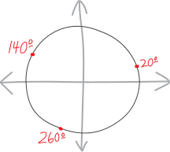

One of the themes, as we solve trig equations, is that it's not enough to just find one solution that works. We need *all* the solutions. It's not enough to tell the truth---we need to tell *the whole truth*.

Think of the typical oath one recites when being sworn in to give testimony:

> Do you solemnly swear that you will tell the truth, the whole truth, and nothing but the truth?

What does this mean? You swear to tell *the truth*, which gets broken down into:

* *... the whole truth...* (don't leave out stuff that's true!)
* *... nothing but the truth...* (don't say something that's false!)

When it comes to equations with trig functions, we usually have many many many many solutions! Finding one solution is good---but finding *all* the solutions is better, and is what we really want. 

We've seen how this plays out when we deal with certain types of equations inviolving trig functions. Here's one type that we haven't yet thought about: trig functions that have stuff *trapped inside them*. 

More concretely, suppose we have a ho-hum trig equation, and we want to solve it for $\theta$:
$$\sin(3\theta) = \frac{\sqrt3}{2}$$
It's kind of like the equation:
$$\sin (\theta)= \frac{\sqrt3}{2}$$
Except now there's a $3$ as well, trapped inside the trig function! Maybe we're smart, and we think, well, if we had just $\sin(x)= \frac{\sqrt3}{2}$, then the answer would be $\pi/3$:
$$\sin x= \frac{\sqrt3}{2} \quad\implies\quad x = \frac{\pi}{3}$$
Or, ack, I'm going to do this in degrees. I think I'm going to stick with degrees for the rest of these notes---you can make fun of me for doing so (and please do!), but for reasons that will become apparent, I think this story is going to me more lucid if we tell it in degrees rather than radians. Anyway, we have:

$$\sin x= \frac{\sqrt3}{2} \quad\implies\quad x = 60^\circ$$
We can figure that out just by thinking about a basic $30^\circ-60^\circ-90^\circ$ right triangle:

{width=50%}

So then if we want to find the sine of THREE times $x$ (or theta or whatever), then we can just divide $x$ by three! So then, for $\sin(3\theta) = \frac{\sqrt3}{2}$, we can just divide $60^\circ$ by $3$, and that's our answer:
$$\theta = 20^\circ$$
Indeed, that's ONE of the answers!!! But it's not all of them.
$$\boxed{ \sin(3\theta) = \frac{\sqrt3}{2} \quad\implies\quad  \theta = \begin{cases} \displaystyle 20^\circ \\ \\ \text{... and more!} \end{cases} }$$
So maybe we can be smarter, and think, well, trig functions repeat every $360^\circ$, so we can add any multiple of $360^\circ$. That'll give us *more* of the solutions (an infinite number more), but still not all!
$$\boxed{ \sin(3\theta) = \frac{\sqrt3}{2} \quad\implies\quad  \theta = \begin{cases} 20^\circ + 360k^\circ \quad\text{for }k\in\mathbb{Z} \\ \\ \text{... and more!} \end{cases} }$$
Then you might be EVEN SMARTER. You might think, well, there are probably two solutions in a full circle---that's often how trig works---often, but not always---so we can just divide each of THOSE by three, and add $360^\circ$, and that'll get us all the solutions! 

So let's see if we can find two sets of solutions here within a single circle? Let's sketch it visually. Let's back up, too. Let's imagine we have some angle "$3\theta$", which has a sine of $\frac{\sqrt3}{2}$. That corresponds, visually, to a diagram on the unit circle like this:

{width=75%}

And that angle $3\theta$ is really just $60^\circ$. So if we divide it by $3$, we get just $\theta$, or $20^\circ$:

{width=75%}

Of course, if we have some angle $3\theta$ that has a sine of $\sqrt{3}/2$, then $60^\circ$ isn't the only possibility for $3\theta$! There are *two* points on the unit circle with a $y$-coordinate of $\frac{\sqrt3}{2}$. There's a point on the left side, too, which corresponds to an angle of $120^\circ$:

{width=75%}

So if we divide that $3\theta$ by $3$, we get that $\theta=40^\circ$! And that's a new angle!!!

{width=75%}

So, in summary: there are two solutions for $\sin x = \frac{\sqrt3}{2}$: $60^\circ$ and $120^\circ$ (plus their multiples of $360^\circ$). We can divide each of THOSE by three, and our two families of solutions for $\sin(3x) = \frac{\sqrt3}{2}$ are $20^\circ$ and $40^\circ$, plus any multiples of $360^\circ$. Which is great! And which indeed are all solutions! BUT THEY'RE STILL NOT ALL!!!
$$\boxed{ \sin(3\theta) = \frac{\sqrt3}{2} \quad\implies\quad  \theta = \begin{cases} 20^\circ + 360k^\circ, \\ \\ 
40^\circ + 360k^\circ,  \\ \\
\text{... and more!} \end{cases} }$$

## Anonymous Tips

What's really going on here is that we're career prosecutors in the Department of Justice, and we're trying to take down a vast criminal conspiracy, involving cartels and multinational corporations and corrupt petrostates. There's not just one bad guy. There are a *lot* of bad guys. It's not enough for us to throw the book at *one* gang member. We can indict and convinct and lock away one conspirator, and the criminal network will still keep operating as normal. We want to convict *all* the gang members. We want to take down the *entire* conspiracy. (We want to take full advantage of [RICO](https://en.wikipedia.org/wiki/Racketeer_Influenced_and_Corrupt_Organizations_Act).)

Hmm. But how to nail down the remaining suspects?

Sometimes, when you work in law enforcement, you get anonymous tips. What if we get an anonymous tip-off that $\theta= 250^\circ$ and $\theta = 260^\circ$ are solutions? 

If we get those anonymous tips, it's easy for us to investigate. We can easily see whether those angles are guilty, or whether they're innocent. We can just plug them into the formula to find out!

If we try to investigate whether $\theta= 250^\circ$ is a solution, we can plug it into $\sin(3\theta)$ and see whether it works out to be $\frac{\sqrt3}{2}$:
$$\begin{align*}
\sin\left(3\cdot 250^\circ\right) &= \sin\left(750^\circ\right) \\
&= \sin\left(2\cdot 360^\circ + 30^\circ\right) \\
&= \sin\left(30^\circ \right) \\
&= \frac{1}{2} \\
&\neq \frac{\sqrt3}{2} \\
&{\huge \times}
\end{align*}
$$
So $250^\circ$ is innocent!!!! Note that in American criminal law, we never declare suspects innocent---we declare them *not guilty*. The goal of a court is to prove whether someone is guilty (or fail to prove that), not to prove that someone is innocent. Math, here, has different epistimological standards. We actually *can* prove that angles are innocent! $250^\circ$ is, very definitively, *not* a solution to this equation. We plug it into $\sin(3\theta)$, and what we get out is something that's not $\frac{\sqrt3}{2}$. 

Cross that one off the list!

What about the other suspect? Is $\theta = 260^\circ$ one of the solutions??? Again, we can plug it into the equation to check:
$$\begin{align*}
\sin\left(3\cdot 260^\circ\right) &= \sin\left(780^\circ\right) \\
&= \sin\left(60^\circ + 2\cdot 360^\circ\right) \\
&= \sin\left(60^\circ \right) \\
&= \frac{\sqrt3}{2} \\
&{\huge \checkmark}
\end{align*}
$$
It is!!! $260^\circ$ is indeed another solution here!!! (Presumably its multiples of $360k^\circ$ are, too.) We plug it into $\sin(3\theta)$ and we get out $\frac{\sqrt3}{2}$.

So we have:

$$\boxed{ \sin(3\theta) = \frac{\sqrt3}{2} \quad\implies\quad  \theta = \begin{cases} 20^\circ + 360k^\circ, \\ \\ 
40^\circ + 360k^\circ,  \\ \\
260^\circ + 360k^\circ,  \\ \\
\text{... and more???} \end{cases} }$$

But... why is $260^\circ$ a solution??? Like, if we're handed that angle, we can check it to see if it works, but that's doesn't tell us that there aren't yet *more* angles out there that would work. Nor is it a *procedure* that we can rely on to reliably give us all of the angles that work. We can't rely on getting lucky and getting anonymous tips. 

Do we just check every possible angle, one by one?!? That sounds nuts! There are $360$ of them! Actually, no, there are even *more*, because angles can be fractions! There are an *infinite* number of angles we need to check!!!

Hmmm.

## Suspicions

Lila Pastor and Grace Bishara are crack investigators. These gumptious gumshoes had an idea:

* in general, if we reflect an angle horizontally across the $y$-axis, it's $y$-coordinate doesn't change
* so if we reflect an angle horizontally across the $y$-axis, it's sine doesn't change
* what if we take the guilty angles we already have and reflect them across the $y$-axis? Maybe the new angles we get will *also* have the same sine, and thus *also* be guilty.

The guilty angles we already have are $20^\circ$ and $40^\circ$:

{width=75%}

If we reflect $20^\circ$ and $40^\circ$ horizontally across the $y$-axis, then we get the angles $160^\circ$ and $140^\circ$:

{width=75%}

Do those work as solutions??? We can check! If we see whether $160^\circ$ works, we'll have:
$$\begin{align*}
\sin\left(3\cdot 160^\circ\right) &= \sin\left(480^\circ\right) \\
&= \sin\left(120^\circ + 360^\circ\right) \\
&= \sin\left(120^\circ \right) \\
&= \frac{\sqrt3}{2} \\
&{\huge \checkmark}
\end{align*}
$$
Yay! So indeed, $160^\circ$ works here as a solution!!!! What about $140^\circ$? 
$$\begin{align*}
\sin\left(3\cdot 140^\circ\right) &= \sin\left(420^\circ\right) \\
&= \sin\left(60^\circ + 360^\circ\right) \\
&= \sin\left(60^\circ \right) \\
&= \frac{\sqrt3}{2} \\
&{\huge \checkmark}
\end{align*}
$$
So $140^\circ$ is also a solution here!!! Let's list all of the angles that we're going to send to the grand jury:
$$\boxed{ \sin(3\theta) = \frac{\sqrt3}{2} \quad\implies\quad  \theta = \begin{cases} 20^\circ + 360k^\circ, \\ \\ 
40^\circ + 360k^\circ,  \\ \\
140^\circ + 360k^\circ,  \\ \\
160^\circ + 360k^\circ,  \\ \\
260^\circ + 360k^\circ,  \\ \\
\text{... are there more???} \end{cases} }$$
OK. So that's five angles (plus their multiples-of-more-circles) that are solutions to this equation. Excellent detective work.

## Dragnet

Look, if we want to actually take down all the gang members, we can't be doing it haphazardly. We have to do it systematically. We need to do it algorithmically, procedurally---we need to have some *method* with which to find *every* answer. We need to set up a **[dragnet](https://en.wikipedia.org/wiki/Dragnet_(policing))**. 

But how?

Let's try to solve this algebraically. We haven't really tried that as a strategy. We've just looked at $\sin(3\theta) = \sqrt3 /2$, and intuited from there. So let's take a more algebraic approach to isolating $\theta$. If we try to solve this equation algebraically/symbolically, we'll start with:
$$\sin(3\theta) = \frac{\sqrt3}{2}$$
Then we can take the inverse sine of both sides:
$$\sin^\text{inv}\Big(\, \sin(3\theta) \,\Big) = \sin^\text{inv}\left(\, \frac{\sqrt3}{2} \,\right)$$
$$\cancel{\sin^\text{inv}}\Big(\, \cancel{\sin}(3\theta) \,\Big) = \sin^\text{inv}\left(\, \frac{\sqrt3}{2} \,\right)$$
$$3\theta = \sin^\text{inv}\left(\, \frac{\sqrt3}{2} \,\right)$$

We know how to find $\sin^\text{inv}\left(\, \frac{\sqrt3}{2} \,\right)$. That's just $60^\circ$ and $120^\circ$, plus their multiples of $360^\circ$:
$$3\theta = \Big\{\, 60^\circ + 360k^\circ \quad\text{and}\quad 120^\circ + 360k^\circ \,\Big\}$$
But... we're solving for $\theta$ here, not $3\theta$, so to solve for just $\theta$, we divide by three:
$$\theta = \frac{\,\, \Big\{\, 60^\circ + 360k^\circ \quad\text{and}\quad 120^\circ + 360k^\circ \,\Big\} \,\,}{ 3}$$
That's basically what we've already figured out, using our knowledge of trig-as-triangles, and some basic trig-as-circles thinking. Of course, we want to solve for $3\theta$, not just $\theta$. So there's some dividing-by-three that needs to happen. **Here's the key insight**: we have to divide *everything* by three. Not just the original angle---we have to divide the $+360k^\circ$ by three, too!!!
$$\theta = \left\{\, \frac{  60^\circ + 360k^\circ  }{3} \quad\text{and}\quad \frac{  120^\circ + 360k^\circ  }{3} \,\right\}$$
$$\theta = \left\{\, \frac{  60^\circ}{3} + \frac{360k^\circ  }{3} \quad\text{and}\quad \frac{  120^\circ}{3} + \frac{360k^\circ  }{3} \,\right\}$$
Giving us:
$$\theta = \left\{\,  20^\circ + 120k^\circ \quad\text{and}\quad  40^\circ + 120k^\circ   \,\right\}$$
THE $360^\circ$ ALSO GETS DIVIDED BY THREE!!! So apparently, the solutions we get are:
$$\boxed{ \sin(3\theta) = \frac{\sqrt3}{2} \quad\implies\quad  \theta = \begin{cases} \displaystyle 20^\circ + 120k^\circ, \\ \\ 
\displaystyle 40^\circ + 120k^\circ
 \end{cases} }$$
This gives us a whole bunch of possibilities, depending on what $k$ is! Let's list-slash-draw them all out, to get some intuition? We'll need to loop through various integer values of $k$ to find them all (or rather, to find all the ones in a single circle).

<ul>
<li> When $k=0$, what's $20^\circ + 120k^\circ$?
$$k=0 \quad\implies\quad 20 + 120\!\cdot\!0 = 20^\circ$$
So $\theta = 20^\circ$ is a solution:

{width=50%}
</li>
<li> When $k=1$, what's $20^\circ + 120k^\circ$?
$$k=1 \quad\implies\quad 20 + 120\!\cdot\!1 = 140^\circ$$
So $\theta = 140^\circ$ is a solution:

{width=50%}
</li>
<li> When $k=2$, what's $20^\circ + 120k^\circ$?
$$k=2 \quad\implies\quad 20 + 120\!\cdot\!2 = 260^\circ$$
So $\theta = 260^\circ$ is a solution:

{width=50%}
</li>
<li> When $k=3$, what's $20^\circ + 120k^\circ$?
\begin{align*}k=3 \quad\implies\quad 20 + 120\!\cdot\!3 &=  380^\circ\\
&= 360^\circ + 20^\circ \\
&\cong 20^\circ
\end{align*}
So $\theta = 20^\circ$ is a solution... oh, but we already have that! So they're going to start to repeat.</li>
</ul>

If we want to list the whole infinitude of solutions we get from this family, we have something like:
$$\color{red} 20^\circ + 120k^\circ  = \begin{cases}\quad
\begin{align*}
&\hfill \quad\vdots \hfill\hfill && \quad\vdots &&\quad \vdots  \\
& 20 + 120\!\cdot\!(-3), && -340^\circ && 20^\circ,\\
& 20 + 120\!\cdot\!(-2), && -220^\circ && 140^\circ,\\
& 20 + 120\!\cdot\!(-1), && -100^\circ && 260^\circ,\\
& 20 + 120\!\cdot\!0, &= \quad\ & +20^\circ & \cong \quad & 20^\circ, \\
& 20 + 120\!\cdot\!1, && +140^\circ && 140^\circ, \\
&  20 + 120\!\cdot\!2, && +260^\circ && 260^\circ,\\
& 20 + 120\!\cdot\!3, && +380^\circ && 20^\circ,\\
& 20 + 120\!\cdot\!4, && +500^\circ && 140^\circ,\\
& \hfill \quad \vdots \hfill\hfill && \hfill \quad\vdots \hfill\hfill && \quad\vdots
\end{align*}
\end{cases}
$$

What about the solutions we get from this other branch of the family tree??

<ul>
<li> When $k=0$, what's $40^\circ + 120k^\circ$?
$$k=0 \quad\implies\quad 40 + 120\!\cdot\!0 = 40^\circ$$
So $\theta = 20^\circ$ is a solution:

{width=50%}
</li>
<li> When $k=1$, what's $40^\circ + 120k^\circ$?
$$k=1 \quad\implies\quad 40 + 120\!\cdot\!1 = 160^\circ$$
So $\theta = 160^\circ$ is a solution:

{width=50%}
</li>
<li> When $k=2$, what's $40^\circ + 120k^\circ$?
$$k=2 \quad\implies\quad 40 + 120\!\cdot\!2 = 280^\circ$$
So $\theta = 280^\circ$ is a solution:

{width=50%}
</li>
<li> When $k=3$, what's $40^\circ + 120k^\circ$?
\begin{align*}
k=3 \quad\implies\quad 40 + 120\!\cdot\!3 &= 400^\circ \\
&= 360^\circ + 40^\circ \\
&\cong 40^\circ
\end{align*}
So $\theta = 40^\circ$ is a solution, but again, we already have that, so they're starting to repeat!</li>
</ul>
So the set of solutions we get from this angle and its multiples of $120^\circ$ is:
$$\color{blue} 40^\circ + 120k^\circ  = \begin{cases}\quad
\begin{align*}
&\hfill \quad\vdots \hfill\hfill && \quad\vdots &&\quad \vdots  \\
& 40 + 120\!\cdot\!(-3), && -320^\circ && 40^\circ,\\
& 40 + 120\!\cdot\!(-2), && -200^\circ && 160^\circ,\\
& 40 + 120\!\cdot\!(-1), && -80^\circ && 280^\circ,\\
& 40 + 120\!\cdot\!0, &= \quad\ & +40^\circ & \cong \quad & 40^\circ, \\
& 40 + 120\!\cdot\!1, && +160^\circ && 160^\circ, \\
& 40 + 120\!\cdot\!2, && +280^\circ && 280^\circ,\\
& 40 + 120\!\cdot\!3, && +400^\circ && 40^\circ,\\
& 40 + 120\!\cdot\!4, && +520^\circ && 160^\circ,\\
& \hfill \quad \vdots \hfill\hfill && \hfill \quad\vdots \hfill\hfill && \quad\vdots
\end{align*}
\end{cases}
$$
So then, in total, our solutions are:
$$\boxed{ \sin(3\theta) = \frac{\sqrt3}{2} \quad\implies\quad  \theta = \begin{cases} \displaystyle 20^\circ + 120k^\circ \\ \\
\quad\quad\text{and} \\ \\
\displaystyle 40^\circ + 120k^\circ \\ \\
\quad\quad\text{for }k\in\mathbb{Z}
 \end{cases} \quad}$$
And they look like:

{width=50%}

Those are all of our solutions!!! There are an infinite number, of course, and they're organized into these two seperate families (the stuff that's $20^\circ$ plus something and the stuff that's $40^\circ$ plus something) And they repeat not every $360^\circ$, but every $120^\circ$. The full circle gets shrunk down to just a third of a circle. 

