If you open up a trig textbook, you'll see pages that look like this:

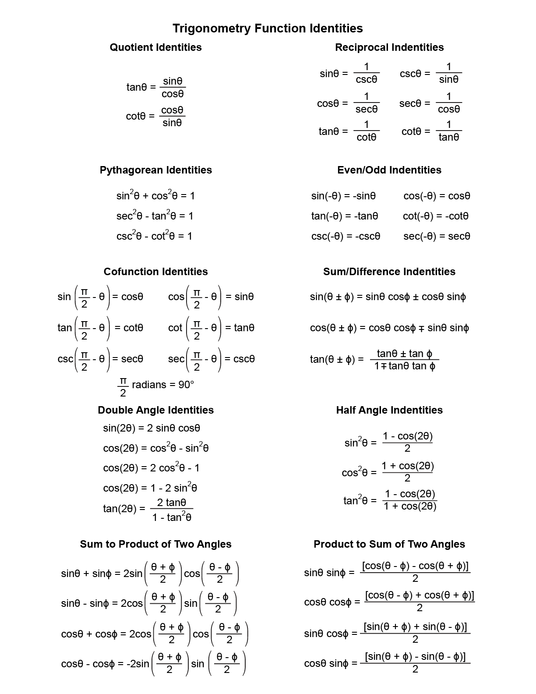{style="border: 0.25px solid black; width: 75%"}

<!---
This is horrible.-->

When I was in high school, my teachers let us bring formula sheets like these into our tests. Their intentions were good: they didn't want us to memorize all these trig identities. But their assumptions, however well-meaning, were not. The fundamental assumption (fundamental assertion?) behind huge reference sheets like this is, trigonometry is just *a set of facts*. (As is mathematics.) 

But that's not true. 

Math isn't sand. It's a *spiderweb*. Mathematics isn't a set of disconnected facts, floating out in space, occasionally colliding like the point particles that make up an ideal gas (perfectly elastically, etc.) Rather, it's a complex and beautiful and self-supporting crystal lattice (now it's my metaphors that are colliding). 

When it comes to trigonometry, we're trying to understand the very simple beauty of *circles* and *triangles*. That's it! It's so simple. There's lots of complexity that comes out of that, sure, but fundamentally it's so simple. Thinking of trigonometry as being a big list of complicated formulas is not the way to understand it. It's the way to *mis*understand it.

On the other hand, the more we do trig problems, the more we should start to notice patterns. The better we understand trig, the more we'll start to notice fun facts and shortcuts.  We can codify those observations into nice little equations. (When it came to logs, we called these the "fun facts" about log functions.) And it's not a terrible idea to list our observations, for our own reference and remembrance. 

So, in these notes, I'll make some observations about how trig works. You could think of this as me listing trig identities and then proving them, but that seems like too aggressive a way to describe it. We're just thinking about how circles and angles work, noticing patterns and deeper truths, and writing them down.

## Periodicity Identities

What if we're trying to find the sine of $9\pi/4$, like so:

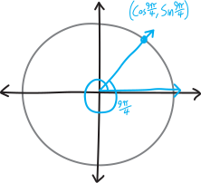{width=75%}

It's the same as $\sin(\pi/4)$. Why? Because $9\pi/4$ is the same as $\pi/4 + 2\pi$, and the extra $2\pi$ is just another revolution around the unit circle. $9\pi/4$ is a different *angle* than $\pi/4$, but it lands us back in the same *place* that $\pi/4$ does. So the sine is the same! (It's $1/\sqrt{2}$.)

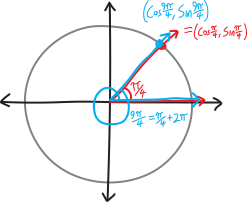{width=75%}

This is a general rule. Both sine and cosine repeat every time we go around the unit circle. Every time we add $2\pi$ to an angle, the sine and cosine don't change. We can add $2\pi$ as many times as we want. We can add $4\pi$, $6\pi$, $358\pi$, whatever. We could go around the circle in the opposite direction, and *subtract* $2\pi$, or $4\pi$, or $358\pi$. Trig functions repeat! So, if you want to memorialize or formalize this observation into  an equation (or a couple of equations), you could write something like this:

$$\sin(\theta + 2k\pi) = \sin(\theta)$$

$$\cos(\theta + 2k\pi) = \cos(\theta)$$

I'm using $k$ there to stand in for any integer, i.e., any number like $1$, $-5$, $0$, $300$, and so forth. Sometimes it's nice to describe that concisely in-line with the equation. In that case we might use "$\in$" (the "is an element of" symbol) and "$\mathbb{Z}$" (the symbol for the set of all integers), and write "$\text{for }k\in\mathbb{Z}$" ("$k$ is in the set of integers"), like so:

$$\sin(\theta + 2k\pi) = \sin(\theta)\quad\text{for }k\in\mathbb{Z}$$

$$\cos(\theta + 2k\pi) = \cos(\theta)\quad\text{for }k\in\mathbb{Z}$$

If $k$ is an integer, $k$ can be negative, so this includes the "negative" angles (going clockwise around the origin), but if you want to be *extra-redundant*, you could use a $\pm$ instead of just a $+$:

$$\sin(\theta \pm 2k\pi) = \sin(\theta)\quad\text{for }k\in\mathbb{Z}$$

$$\cos(\theta \pm 2k\pi) = \cos(\theta)\quad\text{for }k\in\mathbb{Z}$$

What about tangent? It repeats even faster than sine and cosine. Since the only thing that changes about sine and cosine every $\pi$ units is its sign (s-i-g-n, i.e., whether it's $+$ or $-$), and since tangent is just the quotient of sine and cosine, the signs will cancel out. And so tangent repeats every $\pi$ units. Formally:

$$\tan(\theta \pm k\pi) = \tan(\theta)$$

## Symmetry Identities

Here's another observation. What if we have some angle $\theta$, and we find $\cos(\theta)$, and then we also want to find $\cos(-\theta)$? Is there any relationship between these two cosines? Let's think about what this will look like on a unit circle:

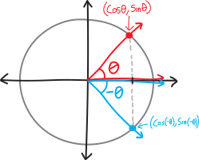{width=75%}

Cosine, of course, is just the $x$-coordinate of that point on the unit circle. So if we consider $-\theta$, that point just becomes the vertical reflection of the corresponding point for $+\theta$. Meaning that its $x$-coordinate doesn't change. Meaning that its cosine doesn't change. And thus we have the following identity:

$$\cos(-\theta) = \cos(\theta)$$

By contrast, the $y$-coordinate of that point *does* change. The point gets reflected across the horizontal axis. So the $y$-coordinate becomes the negative of whatever it was before. And the $y$-coordinate, by definition, is $\sin(\theta)$. So we must have:

$$\sin(-\theta) = -\sin(\theta)$$

Visually:

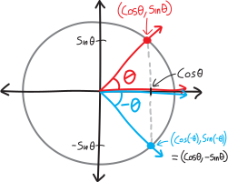{width=75%}

As a quick aside, do you remember, from previous classes, the definitions of **even functions** and **odd functions**? (You might not, which isn't a huge deal.) Even functions are functions that are horizontally symmetric around the vertical $y$-axis, or, more formally, functions for which $f(-x)=f(x)$:

$$\text{even functions: } f(-x) = f(x)$$

In other words, they're functions that destroy negatives. $x^2$ is an example! 

Odd functions, by contrast, are functions symmetric if you flip them across the line $y=x$. (Theyu're *not* functions that are vertically symmetric across the horizontal axis, note!). In other words, they're, functions for which $f(-x)=-f(x)$:

$$\text{odd functions: } f(-x) = -f(x)$$

In other words, negatives float in and out of them, like ghosts through walls. $x^3$ is an example! 

"Even" and "odd" here don't have anything to do with even and odd numbers, note; they're just the names people have chosen to give to functions that have these properties. (Although... any ideas why people might have chosen those words over the many other words they could have chosen?)

Anyway, notice anything about these two trig identities we just wrote down? They look exactly like the definitions of even and odd functions!!!! So cosine is an even function/a function that's horizontally symmetric around the $y$-axis (like $x^2$), and sine is an odd function (like $x^3$). (We might have already known that, from knowing what the graphs look like, but the point is, *this is where that comes from*.)

Tangent, meanwhile, will incorporate the negative:

$$\tan(-\theta) = \frac{\sin(-\theta)}{\cos(-\theta)} = \frac{-\sin(\theta)}{\cos(\theta)} = -\tan(\theta)$$

and thus will be odd.

(Idle related question: will the product of an even function and an odd function be a) always an even function, b) always an odd function, or c) sometimes one and sometimes the other? What about the quotient of an even function and an odd function?)

## Interchange Identities

Another thing we've noticed, just from knowing the graphs of sine and cosine, is that they're the same---they've just got a slight horizontal shift. Sine and cosine are *the same function*. They're just shifted by $90^\circ$! Er, uh, excuse me; I mean $\pi/2$. If we wanted to formalize that observation into an equation (or equation*s*), one way to do that would be:

$$\cos(\theta) = \substack{\text{sine, shifted left}\\\text{by $\pi/2$}} = \sin(\theta + \pi/2)$$

$$\sin(\theta) = \substack{\text{cosine, shifted right}\\\text{by $\pi/2$}} =  \cos(\theta - \pi/2)$$

Or just:

$$\cos(\theta) = \sin(\theta + \pi/2)$$

$$\sin(\theta) = \cos(\theta - \pi/2)$$

We know this from knowing what the graphs of sine and cosine look like... but actually, I should put "know" in quotes. We "know" this. We don't really *know* it. We haven't *proved* it. We don't know why, from the basic starter foundational definitions of sine and cosine, why this is true. We've sort of seen it empirically, as a high-level phenomenological result... but we should think more deeply. Sine and cosine are the $y$- and $x$-coordinates on the unit circle---so what is it that makes them to be the same thing, but just $\pi/2$ apart?

Here's a high-level argument: if we take the $x$-axis and rotate it $\pi/2$, we get the $y$-axis! So an $x$-coordinate, rotated $\pi/2$, becomes a $y$-coordinate! Like, suppose we have some angle $\theta$, such that its $x$-coordinate is $\cos\theta$:

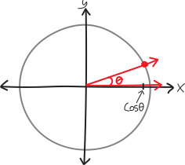{width=75%}

And then we rotate it by $\pi/2$:

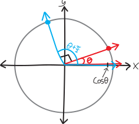{width=75%}

Then the sine of the rotated angle is the same as the cosine of the original angle!

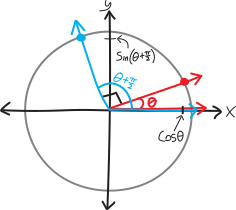{width=75%}

$$\underbrace{\cos(\theta)}_{\text{an $x$-coordinate}} = \underbrace{\sin(\overbrace{\theta + \pi/2}^{\text{rotated $\pi/2$}})}_{\text{a $y$-coordinate}}$$

What about the other way around? If we take a $y$-coordinate, and rotate it $\pi/2$, we don't get the $x$-coordinate. Or we do, but not the $+x$-coordinate; we get the $-x$-coordinate. So you could say:

$$\sin(\theta) = -\cos(\theta + \pi/2) $$

Delightful! But, if we wanted to come up with something more like the second of our original pair of equations, where it's just about shifting angles and getting stuff, without negatives outside of things, we could realize that if we take a $y$-coordinate, and rotate it *backwards* by $\pi/2$---i.e., rotate it in the negative direction, i.e. the clockwise direction---then we get an $x$-coordinate:

$$\underbrace{\sin(\theta)}_{\text{a $y$-coordinate}} = \underbrace{\cos(\overbrace{\theta - \pi/2}^{\substack{\text{rotated backwards}\\\text{by $\pi/2$}}})}_{\text{an $x$-coordinate}}$$

Or just:

$$\sin(\theta) = \cos(\theta - \pi/2)$$

## The Pythagorean Identity

There's another really cool relationship between trig functions. Namely: if we square the cosine of some angle, and then square the sine of the same angle, and add them, we just get $1$:

$$(\sin \theta)^2 + (\cos \theta)^2 = 1$$

It's true for any angle!!! As long as we're sine'ing and cosine'ing the same angle, then if we square them and add them, we always get just $1$!!!!

Why is this true? Well, imagine we have some angle $\theta$:

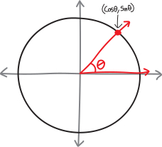{width=75%}

If we look at it the right way, it makes a nice little right triangle!

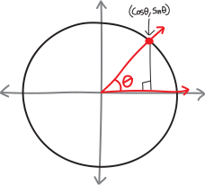{width=75%}

It's a right triangle, with a hypotenuse of $1$, and legs of length $\cos\theta$ and $\sin\theta$:

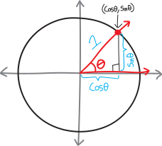{width=75%}

But then... the Pythagorean Theorem has to apply! If we square both the legs, we should get the hypotenuse squared:

$$(\sin \theta)^2 + (\cos \theta)^2 = 1^2$$

Or just:

$$(\sin \theta)^2 + (\cos \theta)^2 = 1$$

Whoa!!!

Often, by the way, we write things like $(\sin \theta)^2$ and $(\cos \theta)^2$ as $\sin^2 \theta$ and $\cos^2 \theta$, just as a more convenient notation (fewer parentheses!). (I don't love this notation, since it seems like you're squaring the sine alone, and what does it mean to square a function? But I haven't been able to come up with a better one.) Written that way:

$$\sin^2 (\theta) + \cos^2 (\theta) = 1$$

We can make slightly modified versions of this identity. For example, if we divide both sides by $\cos^2(\theta)$, we get:

\begin{align*}
\frac{\sin^2 \theta + \cos^2 \theta}{\cos^2 \theta} &= \frac{1}{\cos^2 \theta} \\ \\
\frac{\sin^2 \theta}{\cos^2 \theta} + \frac{\cos^2 \theta}{\cos^2 \theta}  &= \frac{1}{\cos^2 \theta}\\ \\
\tan^2 \theta + 1 &= \frac{1}{\cos^2 \theta}
\end{align*}

Or if we divide it all by $\sin^2\theta$:

\begin{align*}
\frac{\sin^2 \theta + \cos^2 \theta}{\sin^2 \theta} &= \frac{1}{\sin^2 \theta} \\ \\
\frac{\sin^2 \theta}{\sin^2 \theta} + \frac{\cos^2 \theta}{\sin^2 \theta}  &= \frac{1}{\sin^2 \theta}\\ \\
1 + \frac{1}{\tan^2 \theta}  &= \frac{1}{\sin^2 \theta}
\end{align*}

## Summary!

For convenience, you might want to write up these identities we've discussed into a handy reference table. Probably you wouldn't write something as horrific as the example I started these notes with, but you could list the identities we've discussed here. Maybe you could add some examples or outline the reasoning.  Maybe you could make up (/think up/dream up/notice) even more identities, and add those, too. If you think that'd be useful, then you should make one. It's always better to make your own list than copy someone else's. 

But please, please don't try to memorize these identities (or others). Doing so won't help you understand trigonometry better. If you understand the trig---really *understand* it---really *feel* it---then all of these identities should make sense. If you do a lot of trig problems, then all these identities will start to be natural and feel obvious and eventually, you won't even really have to think about them in order to apply them. You probably don't feel that way right now. Hopefully you will, eventually. That's our goal. (Doing lots of trig problems is the means!) 

A list of trig identities, then, shouldn't be a list of facts to memorize, or disconnected ideas to search through when trying to solve a problem, but rather, *a codification of things we already know.*

