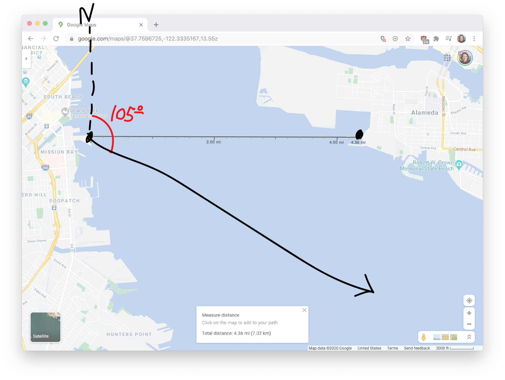
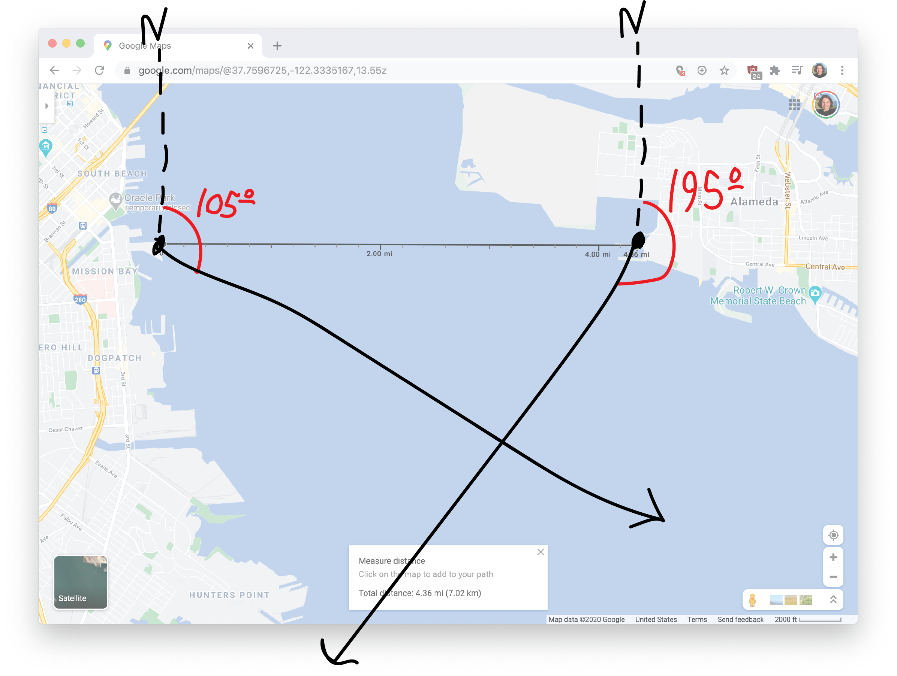
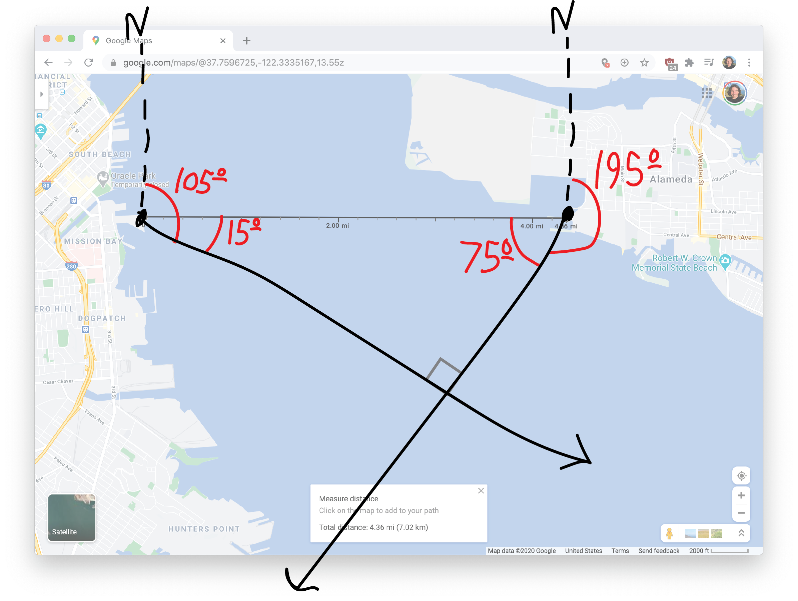
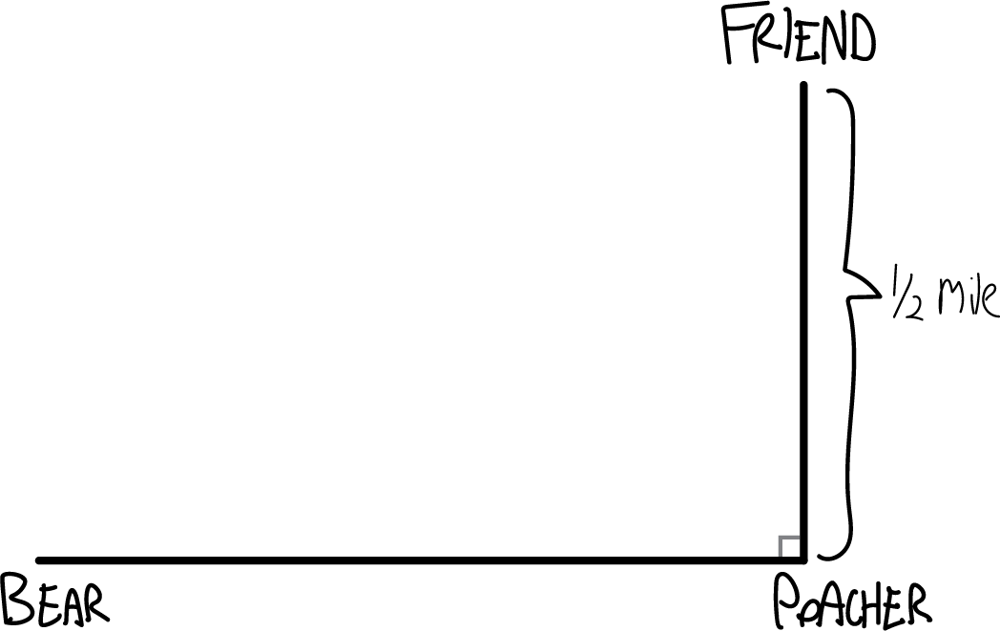
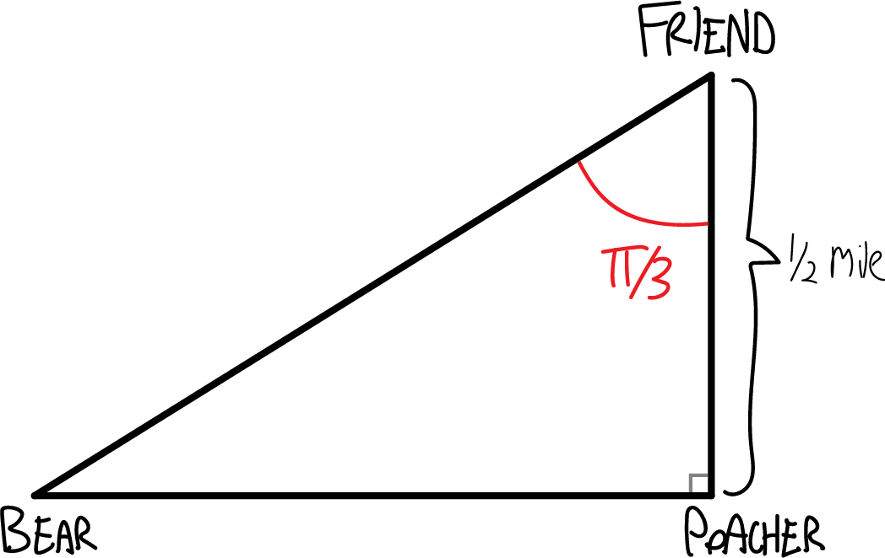
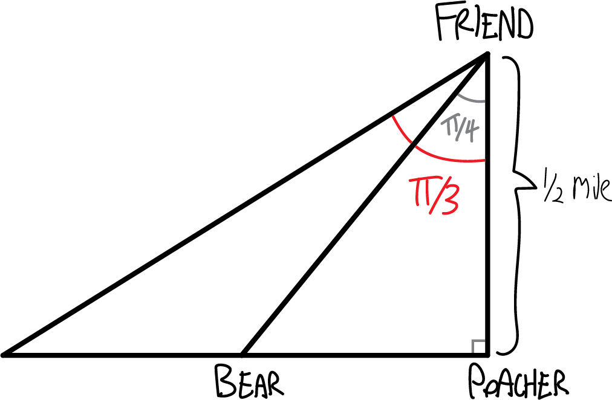

> On a foggy night in San Francisco, you set off in your jetski at 9:30 PM, zipping across San Francisco Bay at $23$mph on a heading of $105^\circ$. Simultaneously, your friend Lee leaves from a marina in Oakland due east of your marina in SF, traveling at a heading of $195^\circ$. Later, other boaters will tell police that they heard screams and saw a large fireball in the Bay. What happened? When? What was Lee's average speed before the crash?

So, if you got through this problem, you may have realized that you need to know how far apart the two marinas are in order to solve it. Well, that's no problem! You can just look up how far apart SF and Oakland are! Of course, we don't know exactly where these marinas are, but that's OK---we can figure this out, contingent on the distance.

So, using Google Maps, perhaps I left in my jetski from Mission Bay, and perhaps Lee left from a jetty in Alameda (not technically Oakland, but whatever). Those two spots are, according to Google Maps, $4.36$ miles apart:

Of course if you use a different number, you'll get a slightly different answer, but that's fine. Anyway, we know the **headings** that Lee and I take from the marinas. A heading is an angular measurement from due north, rotating clockwise. So, for example, a heading of $90^\circ$ is going due east, a heading of $180^\circ$ is going due south, and so forth. So my heading of $105^\circ$ will make my trajectory look like this:

And Lee's heading of $195^\circ$ will make her trajectory look like this:

So somewhere, we'll crash! But where? And when?!?! I guess we can figure this out using triangles and trig and such! First of all, let's figure out what the two small, somewhat more relevant angles are:

OK. So we have a triangle with a $75^\circ$ and a $15^\circ$ angle. Because all the angles have to add up to $180^\circ$, we know the third angle must be $90^\circ$. So it's a right triangle! And thus it's easy to do trig with. 

Had we had more time, we'd have constructed a $75^\circ-15^\circ-90^\circ$ special right triangle, which we could have used here! But we didn't have time this semester. Very sad. If you want to see it anyway, here's what it looks like:

How long are the other two sides of our triangle? That's the tricky part. We know the hypotenuse---that's the $4.36$ miles that Google Maps told us. But what about the side lengths? Let's use a variable. We know I'm going $23$ miles per hour, so let's label my side has having length $23t$, where $t$ is the time (in hours) until we crash:

Lee's side I guess we can label as having length $V_\text{Lee}\cdot t$, where $V_\text{Lee}$ is her speed. We don't know what that is, but hopefully we'll be able to figure it out.

Now let's do some trig!!! Let's figure out how long it was until the crash. We can approach this in lots of ways. One way is to take the sine of $75^\circ$, which must be opposite over hypotenuse, or:

$$\sin\left(75^\circ\right) = \frac{\text{opp}}{\text{hyp}}$$

Or:

$$\sin\left(75^\circ\right) = \frac{23t}{4.36}$$

So, we can solve for $t$, and get:

$$t = \frac{4.36\sin\left(75^\circ\right)}{23}$$

We can work out $\sin\left(75^\circ\right)$ with a calculator, or, if we know the special triangle, directly:

$$t = \frac{4.36}{23}\cdot\left(\frac{\sqrt3+1}{2\sqrt2}\right) \text{ hours}$$

Approximating all this with a calculator, we get:

$$t \approx .1831 \text{ hours}$$

$$t \approx 10.98 \text{ minutes}$$

Only eleven minutes!!! So I guess the crash happened at $\boxed{9:41 \text{ PM}}$. What was Lee's speed? We could work this 
out in multiple ways. If we use a tangent, the $t$s cancel nicely:

$$\tan\left(75^\circ\right) = \frac{\text{opp}}{\text{adj}}$$

$$\tan\left(75^\circ\right) = \frac{23t}{V_\text{Lee}t}$$

$$\tan\left(75^\circ\right) = \frac{23}{V_\text{Lee}}$$

$$V_\text{Lee}= \frac{23}{ \tan\left(75^\circ\right) }$$

$$V_\text{Lee}= \frac{23}{\quad \frac{\sqrt{3}+1}{\sqrt3-1} \quad }$$

$$\boxed{ V_\text{Lee} \approx 6.16 \text{ miles per hour} }$$

Six miles per hour! Very slow. (Note here that we don't need to use the distance to find Lee's average speed---it's totally independent! The number "$4.36$"" never came up in our calculations.

> Somewhere in Canada's frozen north, a poacher is setting a trap for a polar bear. Unbeknownst to him, a polar bear has noticed, and is running toward the poacher to teach him a lesson in Arctic ethics. The poacher's friend, watching in horror, tries to warn the poacher, but they're a half-mile apart, and the poacher can't hear his friend shouting for him to turn around. The friend, meanwhile, has a compass with him, and observes that over a thirty-second period, the angle between the two friends and the bear (i.e., the angle given by poacher--friend--bear) decreases from $\pi/3$ to $\pi/4$. (You can assume that the polar bear is running on a course perpendicular to the line between the two friends, i.e., that the angle friend--poacher--bear is a right angle.) When will the polar bear enjoy his sashimi? (Be sure to give proper units.)

So, I guess we start with a situation like this:

I'm sorry for not drawing actual pictures of the characters, which would be way more fun. The problem says that "over a thirty-second period, the angle between the two friends and the bear (i.e., the angle given by poacher--friend--bear) decreases from $\pi/3$ to $\pi/4$", which means that I guess the situation initially looks like this:

And then, after thirty seconds, like this:

We want to figure out when the bear will reach the poacher, so that means we need to figure out a) how far away the bear has left to run, and b) how fast the bear is going. 

To figure out how far the bear has left to run, we can notice that this is a special $\pi/4-\pi/4-\pi/4$ right triangle, which has two legs of the same length. The distance from the poacher to his friend is half a mile (though this is in Canada, so it should really be in kilometers), so the distance remaining from the poacher to the bear is half a mile:

But how fast is the bear going? How far did it run in those thirty seconds? We can notice that this bigger triangle is a $\pi/3-\pi/6-\pi/2$ special right triangle, and since it has a side opposite $\pi/3$ of $1/2$, the adjacent side must be $\sqrt{3}/2$:

So then, to figure out the polar bear's speed, we can remember that distance is rate times time:

$$\text{distance} = \text{speed}\cdot\text{time}$$

I.e., speed is distance divided by time:

$$\text{speed} = \frac{\text{distance}}{\text{time}}$$

So, what's the change in distance? What's the change in time? We have:

\begin{align*}
\text{speed} &= \frac{\,\frac{\sqrt3}{2}-\frac12}{30 \text{ seconds}} \\ \\
&= \frac{\sqrt3-1}{60} \text{ miles/second} \\ \\
&\approx .02440\text{ miles/second} \\ \\
&\approx 43.92\text{ miles/hour}
\end{align*}

That's a pretty fast bear!!! When will he reach the poacher? Again, we know that:

$$\text{distance} = \text{speed}\cdot\text{time}$$

So then:

\begin{align*}
\text{time} &= \frac{\text{distance}}{\text{speed}} \\ \\
&= \frac{1/2 \text{ mile}}{\frac{\sqrt3-1}{60} \text{ miles/second}} \\ \\
&= \frac{30}{\sqrt3-1} \text{ seconds} \\ \\
&\approx 40.98\text{ seconds}
\end{align*}

Thus always to poachers!

