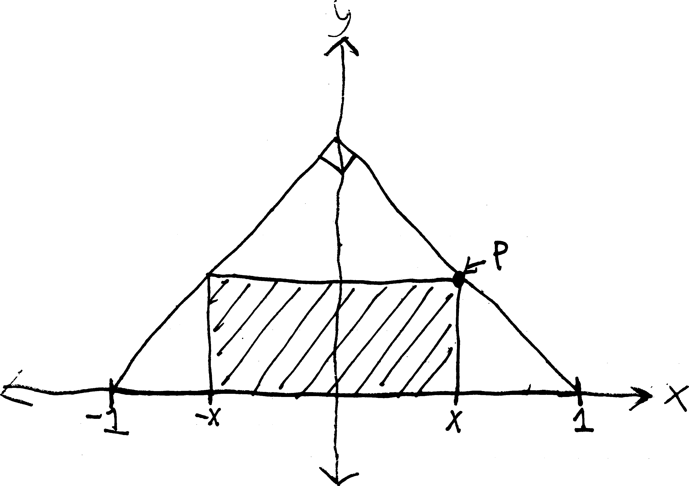

Here are a bunch of word problems involving trig. Do them. Convert angles to radians when appropriate. Leave your answers in fully-written-out form as far as you can; if you are desperate for a decimal answer, wait until the last step before you plug things into your calculator. (And if you do that, be sure your calculator is in the correct mode (radians or degrees).)

Note that a lot of these problems use the phrases **angle of elevation** and **angle of depression.** From the context of the problems I think it's clear what these mean, but here's a visual explanation:

{style='display:inline;width:45%'}{style='display:inline;width:45%'}

And... I need to redraw all of these old bad pictures, as I'm sure you can tell, but I'm out of time! Tragic.

<ol class='problems'>

<li> A $24$-ft ladder leaned up against a wall forms an angle of $75\degree$ with the ground. How high up the wall does the ladder reach? How far is the base of the ladder from the wall? </li>

<li> Imagine you have a $15$-foot ladder. Come up with an equation for the height the ladder can reach as a function of the angle of elevation between the ladder and the ground. </li>

<li> A guy wire stretches from the top of a radio tower to a point (on flat ground) $18$ feet from the base of the tower. The angle between the wire and the ground is $\pi/3$. How high is the tower? </li>

<li> A plane takes off at an angle of $5\degree$. After traveling three miles away from the airport (measured along the surface of the earth), how high is the plane? </li>

<li> A plane takes off at an angle of $6\degree$ traveling at the (constant) rate of $200$ feet per second. If it continues on this flight path at the same speed, how many minutes will it take to reach an altitude of $8000$ feet? (Recall that distance $=$ rate $\cdot$ time, if the rate is constant.) </li>

<li> The angle between the top of a building and a point $80$ feet away from the base (on level ground) is $70\degree$. How tall is the building? </li>

<li> The Ohio Turnpike has a maximum uphill slope of $3\degree$. How long must a straight uphill segment of the road be in order to rise $450$ feet vertically? </li>

<li> Jilly-Jane is flying a kite. Her hand is $3$ feet above the ground, and is holding the end of a $300$-ft kite string, which makes an angle of $57\degree$ with the horizontal. How high is the kite? </li>

<li> Imagine that a person with a reach of $27$ inches and a shoulder height of $5$ feet is standing upright on rock face that makes a $62\degree$ angle with the horizontal (as shown below). Can the person touch the mountain?

{width=50%}
<li> A swimming pool is $3$ feet deep in the shallow end. The bottom of the pool has a steady downward drop of $12\degree$ towards the deep end. If the pool is $50$ feet long, how deep is the deep end? </li>

<li> A wire from the top of a TV tower makes an angle of $49.5\degree$ with the ground and touches the ground 225 feet from the base of the tower. How high is the tower?</li>

<li> A building casts a shadow $130$ feet long when the angle of elevation of the sun (measured from the horizon) is $38\degree$. How tall is the building? </li>

<li> A plane flies on a straight course. On the ground directly below the flight path, observers $2$ miles apart spot the plane at the same time. The plane's angle of elevation is $46\degree$ from one observation point and $71\degree$ from the other. How high is the plane? </li>

{width=50%}

<li> A buoy in the ocean is observed from the top of a $40$-meter-high oil rig. The angle of depression from the top of the tower to the buoy is $6.5\degree$. How far is the buoy from the base of the oil rig? </li>

<li> A plane passes directly over your head at an elevation of $500$ feet. Two seconds later, you observe its angle of elevation (the angle between the plane, you, and the horizontal) as $\pi/4$. How far did the plane travel during those $2$ seconds? </li>

<li> A man stands $12$ feet from a statue. The angle of elevation from eye level to the top of the statue is $20\degree$, and the angle of depression to the base of the statue is $15\degree$. How tall is the statue? </li>

<li> From the top of a $100$-foot building, a man observes a car moving towards him. If the angle of depression of the car changes from $15\degree$ to $33\degree$ during the three minutes that the man is watching the car, how far does the car travel? how fast is it traveling? </li>

<li> Two boats lie on a straight line with the base of a lighthouse. From the top of the lighthouse, $21$ meters above the water level, you observe that the angle of depression of the two boats are $53\degree$ and $27\degree$. How far apart are the boats? </li>

<li> A rocket shoots straight up from the launch pad. Five seconds after lift-off, an observer $2$ miles away notes that the rocket's angle of elevation as $3.5\degree$. Four seconds after that, the angle of elevation is $42\degree$. How far did the rocket rise during those $4$ seconds? What is its velocity? (Give units.)  </li>

<li> You are sitting in your apartment in Brooklyn late one night, staring out the window. You see a streetlight. The angle of depression to the top of the streetlight is $55\degree$, and the angle of depression to the base of the streetlight is $57.8\degree$. You're on the ninth floor of your building, and each floor (including floor/ceiling space) takes up about $12$ vertical feet. How tall is the streetlight?

<li> The $60$-foot drawbridge to your castle is $24$ feet above water level when lowered. When raised, the bridge makes an angle of $\pi/3$ with the horizontal. When raised, how high is the tip of the bridge above the water? how far is the top of the bridge away from the opposite bank of your moat?

{width=50%} </li>

<li> In aerial navigation, directions are given in degrees clockwise from north, called **headings**. So due east is $90\degree$, due south is $180\degree$, due west is $270\degree$, etc. 

{width=50%}

A plane travels from an airport for $200$ miles at a heading of $300\degree$. How far west of the airport is the plane? 

</li>

<li> Okay, another airplane question. A plane travels from an airport at a constant $300$mph at a heading of $65\degree$. How far east of the airport is the plane after half an hour? How far north of the airport is the plane after $2$ hours and $24$ minutes? </li>

<li> A car on a straight road passes under a bridge. Two seconds later, an observer on the bridge, 20 feet above the road, notes that the angle of depression to the car is $7.4\degree$. How fast (in mph) is the car traveling? </li>

<li> You walk across the shown-below pedestrian overpass. As you step onto it, your sweater snags on the bridge. Unaware, you continue walking, and it begins to unravel. When you disembark at the opposite side of the bridge, how many feet of yarn have unravelled from your sweater? (Assume, however unrealistically, that the yarn doesn't stretch, and is lying on the bottom of the bridge.) 

{width=50%} </li>

<li> A $50$-foot flagpole stands on top of a building. From a point on the ground, the angle of elevation to the top of the pole is $43\degree$, and the angle of elevation to the bottom of the pole is $40\degree$. How high is the building? </li>

<li> Two points on level ground are $500$ meters apart. The angles of elevation from these points to the top of a nearby hill are $52\degree$ and $67\degree$, respectively. The two points and the top of the hill lie on a straight line. How high is the hill? </li>

<li> A boat travels at $40$mph from port on a course of $65\degree$ for $2$ hours, and then changes to a course of $155\degree$ for $4$ hours. After these six hours, how far is it away from port? </li>

<li> A point on the North Rim of the Grand Canyon is $7,256$ feet above sea level. A point on the South Rim directly across is $6,159$ above sea level. The canyon is $3,180$ feet wide (horizontally) between the two points. What is the angle of depression from the North Rim point to the South Rim point? </li>

<li> A truss for a barn roof is constructed as shown below. What is the height of the barn directly underneath the center of the roof?
\medskip

{width=50%} </li>

<li> Your grandfather dies and leaves you his $9$-foot-tall clock. It has a base (and top) that's about $2$ feet square. Your apartment has $9$-foot, two-inch ceilings. But the door to your apartment is only $7$ feet tall. Will you be able to use the grandfather clock as an interior decoration? </li>

<li> More generally: imagine you have a grandfather clock $a$ units tall and $b$ units wide, a ceiling $k$ units high, and a door less than $k$ units tall. When will you be able to fit it into your apartment? </li>

<li> On a foggy night in San Francisco, you set off in your jetski at 9:30 PM, zipping across San Francisco Bay at $23$mph on a heading of $105\degree$. Simultaneously, your friend Lee leaves from a marina in Oakland due east of your marina in SF, traveling at a heading of $195\degree$. Later, other boaters will tell police that they heard screams and saw a large fireball in the Bay. What happened? When? What was Lee's average speed before the crash? </li>

<li> Somewhere in Canada's frozen north, a poacher is setting a trap for a polar bear. Unbeknownst to him, a polar bear has noticed, and is running toward the poacher to teach him a lesson in Arctic ethics. The poacher's friend, watching in horror, tries to warn the poacher, but they're a half-mile apart, and the poacher can't hear his friend shouting for him to turn around. The friend, meanwhile, has a compass with him, and observes that over a thirty-second period, the angle between the two friends and the bear (i.e., the angle given by poacher--friend--bear) decreases from $\pi/3$ to $\pi/4$. (You can assume that the polar bear is running on a course perpendicular to the line between the two friends, i.e., that the angle friend--poacher--bear is a right angle.) When will the polar bear reach the poacher? (Be sure to give proper units.) </li>

<li> Imagine a rectangle of width $2x$ inscribed in an isosceles right triangle with a hypotenuse $2$ units long:

{width=50%}
<ol>
<li> Express the $y$-coordinate of the point $P$ in terms of $x$</li>
<li> Come up for a function for the area of the rectangle in terms of $x$.</li>
<li> Imagine you wanted to find the area of the largest possible rectangle that can fit inside the triangle. How would you do it?</li>
</ol>
 </li>

<li> You want to make an open-topped rectangular box by taking an $8$-by-$15$in piece of cardboard, cutting squares out from the corners, and folding up the sides. Come up with an equation for the volume of said box, if each square you cut out is $x$ inches long. What if you wanted to make the biggest box you can make? What would its dimensions be? How would you figure out? </li>

<li> At 7 AM, Ship A is $60$ miles due east of Ship B. Ship A had been sailing west at $20mph$ and Ship B had been sailing southeast at $30mph$. Come up with a function for the distance between the two ships as a function of time. When are the two ships closest together? </li>

<li> A fence $h$ feet high runs parallel to a tall building and $w$ feet away from it. Find the length of the shortest ladder that will reach from the ground across the top of the fence to the wall of the building. (Suggestion: come up with a function for the length of such a ladder as a function of its angle of elevation.) </li>

<li> Determine the point(s) on the function $f(x) = x^2 + 1$ that are closest to the point $(0,2)$. (Suggestion: Draw a picture. Then come up for the a function for the distance between the point $(0,2)$ and some arbitrary point on the function $f(x)$. When will that function be smallest?) </li>

<li> You are a lifeguard at the municipal beach in Churchill, Manitoba. One day, as you are sitting on your lifeguard chair next to Hudson Bay, you see a swimmer being attacked by a polar bear. The swimmer appears to be roughly 120 yards out to sea (on a straight line between the swimmer and the shore), and the lifeguard station is roughly 300 yards down the beach from the nearest point on shore to the swimmer. You can run at 13 yards per minute along the beach, and you can swim at 5 yards per minute. You want to get to the swimmer in the shortest amount of time, but you know that if you swim directly to him/her, it will take longer (since you can't swim very fast), and you know that if you run all the way down the beach, it'll take longer (since you'll have to travel a longer distance). Given that you want to reach the swimmer as quickly as possible, how far down the beach do you run, and how far do you swim?

Suggestion: if you run $x$ yards down the beach, how far do you swim (in terms of $x$)? how long will it take you to get to the swimmer (in terms of $x$)? how can you find where this function has a minimum?</li>

