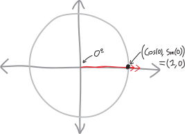
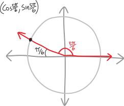
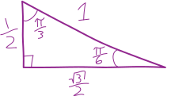
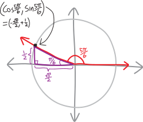
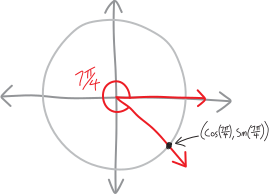
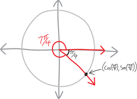
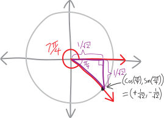
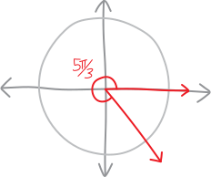
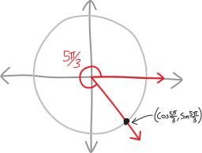
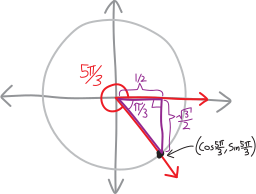

Please DON'T just blaze through all of these problems---please do these thoughtfully and slowly. What I mean by that is: I want you do to try to work out these trig functions from the basics, in the same sort of procedural way that I outline and give an example of in the notes. I *don't* want you to just "memorize the unit circle." Please please don't do that---math isn't about memorization! Rather, we want to understand, deeply, how these things work. To use a CS/Silicon Valley phrase: we want to go down to the bare metal!

**compute the following fun trig values: **
\large $$\sin(0),\quad \cos\left(\frac{5\pi}{6}\right),\quad \sin\left(\frac{7\pi}{4}\right),\quad \cos\left(\frac{5\pi}{3}\right)$$

## $\sin(0) = \,\,???$ 

OK, let's draw this angle on the unit circle!
{width=50%}
Not much to draw. Meanwhile, we know that the $x$ and $y$-coordinates of the point where that line intersects the unit circle will tell us the sine and cosine of the angle, respectively. 
{width=50%}
Sine is the $y$-coordinate... and here the $y$-coordinate is obviously zero. Nothing fancy required! (Also, we get the cosine for free: the $x$-coordinate of this point is $1$, so then $\cos(0)$ is $1$!
{width=50%}
$$\boxed{ \sin(0) =0 }$$

## $\cos\left(\frac{5\pi}{6}\right) = \,\,???$

Here's an angle whose trig functions we wouldn't be able to figure out if we just defined trig functions using triangles!!! $5\pi/6$ is a little less than $6\pi/6$, i.e. a little less than $\pi$, i.e. a little less than $180^\circ$. In particular, it's like $150^\circ$. Do you know any right triangles with an angle of $150^\circ$? No! Of course not!!! Thus the utility of our broader, expanded definition of trig functions: we can evaluate the trig functions of angles BIGGER than $90^\circ$, or less than $0^\circ$! Anyway, drawing the angle $5\pi/6$, we have:
{width=50%}
If we can find the $x$ and $y$-coordinates of this point, we'll find the cosine and sine!
{width=50%}
But how? How do we figure out the coordinates of that point? Agh. What a conundrum.

Oh! I have an idea! That little sliver between the angle and the $x$-axis is $\pi/6$:
{width=50%}
And that reminds me of our $30-60-90$ special right triangle---I mean, our $\pi/6-\pi/3-\pi/2$ special right triangle:
{width=50%}
We know all of its side lengths, and we know that it has a $\pi/6$ angle. That means we could slide it into place, right there on our unit circle. It'd fit in the $\pi/6$ angle, and it'd also touch that magic point on the unit circle, whose coordinates are the sine and cosine of $5\pi/6$. So then, since we know its side lengths, we'd be able to figure out the coordinates of that point!!! Let's try it:
{width=50%}
We know the side lengths of the triangle, so we know the coordinates of the magic point!!! The horizontal distance on the bottom/$x$ is $\sqrt3/2$, but it's going in the negative direction, so the $x$-coordinate is $-\frac{\sqrt{3}}{2}$. And the vertical distance to the point is $1/2$, in the positive direction, so the $y$-coordinate is $+1/2$:
{width=50%}
And so then we know:
$$\cos(5\pi/6) = -\frac{\sqrt{3}}{2}$$
$$\sin(5\pi/6) = +\frac{1}{2}$$
Yay!
$$\boxed{ \cos(5\pi/6) = -\frac{\sqrt{3}}{2} }$$

## $\sin\left(\frac{7\pi}{4}\right) = \,\,???$

OK, once again we have an angle whose trig functions we can't evaluate without using a unit circle! $7\pi/4$ is a little less than $8\pi/4$, which is $2\pi$, which is $360^\circ$, and $\pi/4$ is $45^\circ$, so then $7\pi/4$ is $315^\circ$. Halfway between the $x$- and $y$-axes in the lower-right quadrant! Let's draw it:
{width=50%}
OK, so, to figure out the sine of $7\pi/4$, we nede to figure out the $y$-coordinate of this point:
{width=50%}
But how? Hmm. If we think about that little leftover sliver of an angle, it's $\pi/4$:
{width=50%}
But that should remind us of our beloved $45-45-90$---I mean, $\pi/4-\pi/4-\pi/2$---special right triangle!!!!
{width=50%}
We know all its side lengths! So if we slide it in here (I guess we have to flip it upside-down first), we'll be able to find the $(x,y)$-coordinates of that point!
{width=50%}
OK! So the $x$-coordinate of this point is $1/\sqrt2$ away from the origin, in the positive direction, so it's $+1/\sqrt2$. And the $y$-coordinate is also $1/\sqrt2$ away from the origin, but in the negative direction, so it's $-1/\sqrt2$:
{width=50%}
Yay! So then the sine of $7\pi/4$ is $-1/\sqrt2$.
$$\boxed{ \sin(7\pi/4) = -\frac{1}{\sqrt{2}}} $$

## $\cos\left(\frac{5\pi}{3}\right) = \,\,???$

OK, another fun angle!!!  Let's draw it:
{width=50%}
OK, so, if we can find the $(x,y)$-coordinates of where the angle touches the circle, we'll find the cosine and sine of $5\pi/3$! 
{width=50%}
Hmmm, how to do that? There's a little wedge of $\pi/3$ that we could probably shove our $\pi/3-\pi/6-\pi/2$ special right triangle into! 
{width=50%}
Let's do that:
{width=50%}
OK! So now we can find the coordinates of the point!
{width=50%}
And thus:
$$\boxed{ \cos(5\pi/3) = +\frac{1}{2} } $$

